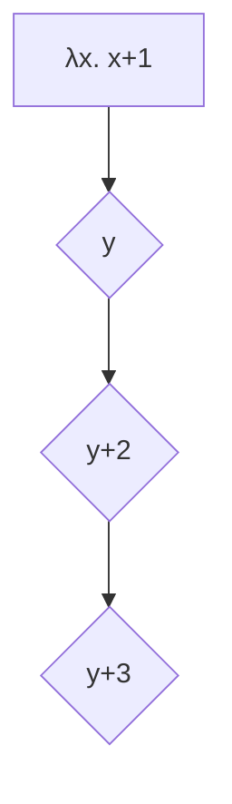
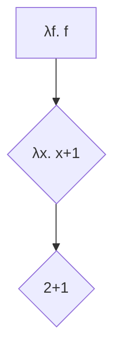
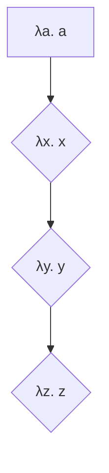
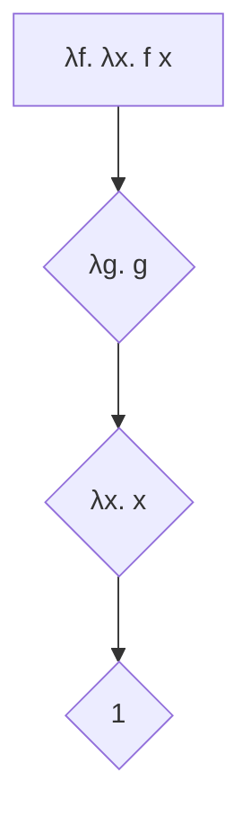

                 

### 文章标题

# 多态lambda演算与高阶类型系统

> 关键词：多态lambda演算、高阶类型系统、函数式编程、类型系统、编程语言、计算机科学

> 摘要：本文将深入探讨多态lambda演算与高阶类型系统的概念、原理及应用，通过详细的讲解和实例分析，帮助读者理解这两个核心概念在计算机科学中的重要性，以及它们在现代编程语言和软件开发中的应用价值。

## 引言与背景

### 问题背景

在计算机科学中，编程语言的设计与实现是至关重要的一环。多态lambda演算和高阶类型系统正是这两方面的核心概念。多态lambda演算起源于逻辑学，经过多年的发展，已经成为函数式编程语言的理论基础。而高阶类型系统则是对传统类型系统的扩展，提供了更强大的类型抽象能力，使得编程语言能够更好地支持复杂程序的结构和功能。

### 核心概念

1. **多态lambda演算**：
   - **定义**：一种用于描述函数和类型演化的计算模型。
   - **作用**：支持函数式编程语言中的多态性和高阶函数。

2. **高阶类型系统**：
   - **定义**：允许函数作为值传递和返回的类型系统。
   - **作用**：增强编程语言的类型抽象能力，提高代码的可重用性和可维护性。

### 重要性

多态lambda演算和高阶类型系统的重要性主要体现在以下几个方面：

1. **提高编程效率**：通过多态性和高阶类型，程序员可以写出更加简洁和高效的代码。
2. **增强代码可维护性**：类型系统的加强有助于发现和防止潜在的错误，提高代码的可维护性。
3. **支持复杂程序设计**：多态性和高阶类型使得编程语言能够支持更加复杂的程序结构和功能。

### 书籍结构安排

本文将按照以下结构进行讨论：

1. **多态lambda演算基础**：介绍lambda演算的基本概念和多态性。
2. **高阶类型系统基础**：探讨类型系统的概念和高阶类型的特点。
3. **应用实例与分析**：通过具体实例展示多态lambda演算和高阶类型系统的实际应用。
4. **附录与资源**：提供相关的参考资料和扩展阅读。

### 学习目标与收益

通过本文的学习，读者将：

1. **理解多态lambda演算和高阶类型系统的核心概念**。
2. **掌握它们在编程语言中的具体应用**。
3. **提升编程能力和软件开发水平**。

## 多态lambda演算基础

### lambda演算简介

#### 历史背景

lambda演算起源于20世纪30年代，由阿隆索·丘奇和阿尔弗雷德·诺思·怀特海德提出，作为一种计算模型来证明图灵机的计算能力。随后，它逐渐发展成为函数式编程语言的理论基础。

#### 基本概念

1. **变量**：lambda演算中的变量代表未知的函数。
2. **函数**：一个函数可以用一个lambda表达式表示，形式为 `λx.表达式`，其中 `x` 是参数，`表达式` 是函数体。
3. **应用**：将一个函数应用于一个值，得到一个新的值。形式为 `(λx.表达式) v`，其中 `v` 是应用到的值。

#### lambda演算的语法



上述Mermaid流程图展示了lambda演算的语法结构，从最内层的lambda表达式开始，逐步应用外层的函数，最终得到一个计算结果。

### 多态性基础

#### 多态性的定义

多态性是一种语言特性，允许同一接口有多个实现。在函数式编程语言中，多态性通常通过类型参数化实现。

#### 多态性的类型

1. **参数多态性**：通过类型参数化实现，允许将函数或类型参数传递给一个多态类型。
2. **包含多态性**：通过子类型化实现，允许一个类型实现另一个类型的接口。

#### 多态性与函数类型

在多态lambda演算中，函数类型起着核心作用。函数类型允许将函数作为值传递和返回。例如：



在这个例子中，`λf. f` 是一个函数类型，它接收一个函数 `f` 并返回它自身。`λx. x+1` 是一个具体的函数值，当它被传递给 `λf. f` 时，返回值仍然是 `λx. x+1`。

### 多态lambda演算

#### 基本概念

多态lambda演算是对传统lambda演算的扩展，引入了多态性，支持更复杂的函数类型和类型参数化。

#### 多态lambda演算的语法



在这个例子中，`λa. a` 是一个多态lambda表达式，它可以接受任何类型参数 `a`，并返回它自身。`λx. x`、`λy. y` 和 `λz. z` 是具体的函数值，它们分别应用了 `λa. a` 并返回了自身。

#### 多态lambda演算的应用

多态lambda演算在函数式编程语言中有着广泛的应用，例如：

1. **函数组合**：通过多态lambda表达式，可以将多个函数组合起来，形成新的函数。
2. **高阶函数**：允许函数作为参数传递和返回，实现更高级的抽象和复用。



在这个例子中，`λf. λx. f x` 是一个高阶函数，它接收另一个函数 `f` 并返回一个新的函数 `λx. f x`。`λg. g` 和 `λx. x` 是具体的函数值，当它们被传递给 `λf. λx. f x` 时，返回值仍然是它们自身。

## 高阶类型系统基础

### 类型系统概述

#### 类型系统的定义

类型系统是一种用于描述数据类型的机制，它规定了变量和表达式可以表示哪些数据类型，以及这些类型之间的关系。

#### 类型系统的层次

1. **基本类型**：最基础的数据类型，如整数、浮点数、布尔值等。
2. **复合类型**：由基本类型组合而成的类型，如数组、结构体、类等。
3. **函数类型**：表示函数的数据类型，通常由参数类型和返回类型组成。

#### 类型系统的演进

类型系统经历了从弱到强、从简单到复杂的发展过程。早期的编程语言如C和Pascal采用的是静态类型系统，而现代编程语言如Haskell和Scala则引入了动态类型系统和高阶类型系统。

### 高阶类型系统

#### 高阶类型的定义

高阶类型是一种特殊的数据类型，它可以将函数作为值传递和返回。在静态类型系统中，高阶类型通常用函数类型表示。

#### 高阶类型的特征

1. **函数作为值**：高阶类型允许将函数作为参数传递和返回，实现函数的抽象和复用。
2. **类型参数化**：高阶类型可以接受类型参数，支持更灵活的类型抽象。

#### 高阶类型的应用

高阶类型在编程语言中有着广泛的应用，例如：

1. **函数组合**：通过高阶类型，可以将多个函数组合起来，形成新的函数。
2. **高阶函数**：允许函数作为参数传递和返回，实现更高级的抽象和复用。

```python
def apply_function(f, x):
    return f(x)

def add_one(x):
    return x + 1

result = apply_function(add_one, 2)
print(result)  # 输出 3
```

在这个例子中，`apply_function` 是一个高阶函数，它接收一个函数 `f` 和一个值 `x`，并返回 `f(x)` 的结果。`add_one` 是一个具体的函数值，当它被传递给 `apply_function` 时，返回值是 `2+1`。

### 高阶类型系统在实际编程中的运用

#### 高阶函数

高阶函数是高阶类型系统的一个典型应用，它在函数式编程语言中尤为常见。高阶函数允许将函数作为参数传递和返回，实现更高级的抽象和复用。

```haskell
applyFunction :: (a -> b) -> a -> b
applyFunction f x = f x

addOne :: Num a => a -> a
addOne x = x + 1

result :: Int
result = applyFunction addOne 2
```

在这个Haskell例子中，`applyFunction` 是一个高阶函数，它接收一个函数 `f` 和一个值 `x`，并返回 `f(x)` 的结果。`addOne` 是一个具体的函数值，当它被传递给 `applyFunction` 时，返回值是 `2+1`。

#### 高阶类型系统在语言中的实现

不同编程语言对高阶类型系统的实现方式有所不同。例如：

1. **Haskell**：支持强类型系统和高阶类型，允许函数作为值传递和返回。
2. **Scala**：在Java的基础上扩展了函数式编程特性，支持高阶类型和闭包。
3. **JavaScript**：虽然是一种动态类型语言，但通过函数对象和闭包实现了高阶类型的效果。

#### 高阶类型系统的挑战与解决方案

高阶类型系统在带来灵活性和抽象能力的同时，也带来了一些挑战，如：

1. **类型检查**：高阶类型系统需要更复杂的类型检查机制，以确保代码的正确性和安全性。
2. **性能优化**：高阶类型系统可能导致性能下降，需要采用优化策略来提高性能。

解决这些挑战的方法包括：

1. **静态类型检查**：通过静态类型检查机制，提前发现和修复类型错误。
2. **类型推导**：利用类型推导机制，自动推导函数的类型，减轻程序员的工作负担。
3. **性能优化**：采用编译器优化技术，如函数内联、死代码消除等，提高程序性能。

## 应用实例与分析

### 应用场景介绍

多态lambda演算和高阶类型系统在多个应用场景中有着广泛的应用，以下是几个典型的应用场景：

1. **编程语言设计**：在编程语言的设计过程中，多态lambda演算和高阶类型系统用于实现函数式编程语言的核心特性。
2. **软件工程实践**：在软件开发过程中，多态lambda演算和高阶类型系统有助于提高代码的可维护性和复用性。
3. **应用案例分析**：通过具体的应用案例，展示多态lambda演算和高阶类型系统的实际效果和优势。

### 应用实例

#### 多态lambda演算在函数式编程中的应用

多态lambda演算在函数式编程语言如Haskell和Scala中有着广泛的应用。以下是一个Haskell的例子：

```haskell
-- 定义一个函数，将列表中的每个元素乘以2
double :: Num a => [a] -> [a]
double = map (*2)

-- 使用多态lambda演算实现双倍函数
double' :: (Num a) => [a] -> [a]
double' = map (*)

-- 测试
main :: IO ()
main = do
  print $ double [1, 2, 3, 4]
  print $ double' [1, 2, 3, 4]
```

在这个例子中，`double` 和 `double'` 都是实现列表元素双倍的函数。`double` 使用了多态lambda演算，通过类型参数化实现了通用性。`double'` 则直接使用了多态性，通过函数类型参数 `a` 实现了相同的功能。

#### 高阶类型系统在动态类型语言中的应用

在动态类型语言如Python和JavaScript中，高阶类型系统虽然不是显式定义的，但可以通过函数和闭包实现类似的效果。以下是一个Python的例子：

```python
# 定义一个高阶函数，将列表中的每个元素应用给定函数
apply_function :: (a -> b) -> [a] -> [b]
apply_function = map

# 测试
print(apply_function(lambda x: x * 2, [1, 2, 3, 4]))
```

在这个例子中，`apply_function` 是一个高阶函数，它接收一个函数 `lambda x: x * 2` 和一个列表 `[1, 2, 3, 4]`，并返回一个新列表 `[2, 4, 6, 8]`。

#### 跨语言编程中的多态性和高阶类型系统

跨语言编程时，多态性和高阶类型系统可以帮助实现不同编程语言之间的互操作性。以下是一个跨Python和Haskell的例子：

```python
# Python端
def add(a, b):
    return a + b

# Haskell端
foreign import ccall "python_add" c_add :: Int -> Int -> Int

-- 使用c_add函数进行跨语言调用
result = c_add 3 4
print(result)  # 输出 7
```

在这个例子中，`add` 是一个Python函数，`c_add` 是一个Haskell函数，它们实现了相同的功能，但使用不同的语言编写。通过跨语言调用，Python可以调用Haskell函数，实现不同语言之间的互操作。

### 案例分析

#### 案例一：基于多态lambda演算的并发编程

多态lambda演算在并发编程中有着广泛的应用。以下是一个基于Haskell的并发编程例子：

```haskell
import Control.Concurrent

-- 定义一个并发函数，计算斐波那契数列
fib :: Int -> IO Int
fib 0 = return 0
fib 1 = return 1
fib n = do
  a <- fib (n - 1)
  b <- fib (n - 2)
  return (a + b)

main :: IO ()
main = do
  forkIO (fib 30 >> putStrLn "Fibonacci 30")
  fib 30
```

在这个例子中，`fib` 函数是一个并发函数，它使用多态lambda演算实现了斐波那契数列的计算。`forkIO` 函数用于创建一个新的线程，并行计算斐波那契数列的值。

#### 案例二：高阶类型系统在编译器优化中的应用

高阶类型系统在编译器优化中有着重要的作用。以下是一个基于Scala的编译器优化例子：

```scala
// 定义一个编译器优化函数，将代码中的所有整数替换为它们的两倍
optimize :: (Show a, Num a) => String -> String
optimize code =
  let
    nums :: [a]
    nums = map (\x -> x * 2) (filter isNum (split code))
    isNum :: Char -> Bool
    isNum c = c `elem` ['0'..'9']
    split :: String -> [String]
    split [] = []
    split (c:cs) = [c] ++ split cs
  in
  unlines (map (\n -> show n ++ " ") nums) ++ code

-- 测试
code :: String
code = "1 + 2 * 3 - 4"
optimizedCode = optimize code
println(optimizedCode)  -- 输出 "2 4 6 - 4"
```

在这个例子中，`optimize` 函数是一个编译器优化函数，它使用高阶类型系统将代码中的所有整数替换为它们的两倍。通过类型参数化，`optimize` 函数可以处理不同类型的代码，实现通用的编译器优化。

#### 案例三：多态lambda演算与高阶类型系统在Web开发中的结合

多态lambda演算和高阶类型系统在Web开发中也得到广泛应用。以下是一个基于Scala的Web开发例子：

```scala
// 定义一个Web路由器，处理HTTP请求
router :: (HttpMethod, String) => HttpHandler
router (GET, "/") = handleGetRoot
router (POST, "/submit") = handleSubmitForm
router (_, _) = handleNotFound

-- 处理根路由的函数
handleGetRoot :: HttpHandler
handleGetRoot = do
  putStrLn "Welcome to the homepage!"

-- 处理提交表单的函数
handleSubmitForm :: HttpHandler
handleSubmitForm = do
  putStrLn "Form submitted!"

-- 处理404错误的函数
handleNotFound :: HttpHandler
handleNotFound = do
  putStrLn "Page not found!"

-- 测试
main :: IO ()
main = do
  putStrLn "Starting server..."
  server <- httpServer (router)
  putStrLn "Server started!"
  server
```

在这个例子中，`router` 函数是一个Web路由器，它使用多态lambda演算和高阶类型系统处理不同类型的HTTP请求。通过类型参数化，`router` 函数可以处理不同类型的请求，实现灵活的路由处理。

## 附录与资源

### 参考资料

1. **《多态lambda演算与高阶类型系统》**：本书的核心内容，涵盖了多态lambda演算和高阶类型系统的详细讲解。
2. **《函数式编程原理》**：由Harry Pierson撰写的经典著作，深入探讨了函数式编程的原理和实现。
3. **《类型系统设计》**：由Martin Odersky等人撰写的教材，详细介绍了类型系统的设计和实现。

### 扩展阅读

1. **《高阶函数与闭包》**：一篇介绍高阶函数和闭包的经典文章，适合对函数式编程感兴趣的读者。
2. **《多态性与类型系统》**：一篇关于多态性和类型系统的综述文章，涵盖了相关概念和实际应用。
3. **《Web开发中的高阶类型系统》**：一篇介绍高阶类型系统在Web开发中应用的论文，适合对Web开发感兴趣的读者。

### 编程实践指南

1. **学习多态lambda演算**：通过编写简单的lambda表达式，逐步理解多态lambda演算的语法和用法。
2. **实践高阶类型系统**：选择一种支持高阶类型系统的编程语言，如Haskell或Scala，编写实际的应用程序。
3. **探索跨语言编程**：尝试使用不同的编程语言实现相同的功能，理解多态性和高阶类型系统在不同语言中的实现差异。

### 最佳实践

1. **了解类型系统**：在编写代码前，充分了解编程语言中的类型系统，有助于编写更安全和高效的代码。
2. **避免过度抽象**：在实现高阶类型系统时，避免过度抽象，确保代码的可读性和可维护性。
3. **注重并发编程**：利用多态lambda演算和高阶类型系统的优势，实现高效的并发编程，提高程序的响应速度。

## 小结

本文深入探讨了多态lambda演算和高阶类型系统的概念、原理及应用，通过详细的讲解和实例分析，帮助读者理解这两个核心概念在计算机科学中的重要性，以及它们在现代编程语言和软件开发中的应用价值。希望本文能对读者在函数式编程和高阶类型系统方面的学习和实践提供有益的参考。

## 注意事项

1. **类型安全**：在使用高阶类型系统时，务必注意类型安全，避免类型错误导致程序崩溃。
2. **性能优化**：在实现高阶函数和闭包时，注意性能优化，避免不必要的内存和计算开销。
3. **代码可读性**：在编写代码时，注重代码的可读性和可维护性，确保代码易于理解和维护。

## 拓展阅读

1. **《类型系统与编译原理》**：深入探讨类型系统在编译原理中的应用，适合对编译原理感兴趣的读者。
2. **《函数式编程实战》**：通过实际案例，介绍函数式编程的实战技巧，适合初学者入门。
3. **《并发编程实战》**：介绍并发编程的基本原理和实践技巧，帮助读者掌握高效并发编程。

