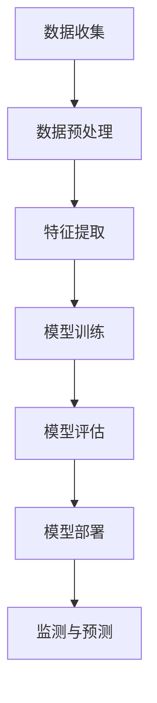
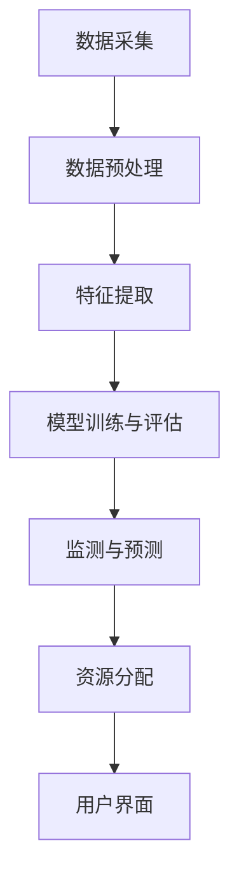
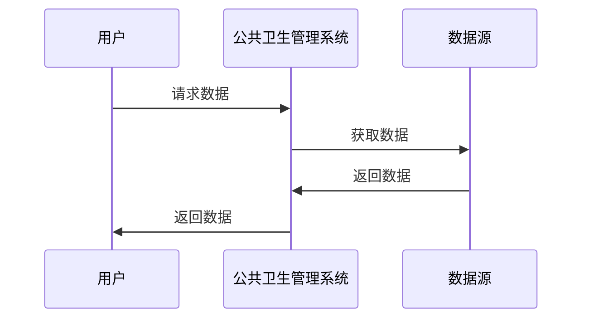

                 


### 第一章：背景介绍

#### 1.1.1 公共卫生管理的基本概念

公共卫生管理是指通过组织、协调和领导社会公共卫生资源，以预防和控制疾病、促进健康和改善生活质量为目标的一系列管理活动。其基本概念包括：

- **公共卫生服务**：提供基础医疗服务、卫生保健教育、疾病预防和控制等服务。
- **健康监测**：通过监测和分析公共卫生数据，评估疾病发生趋势，预测疾病爆发风险。
- **卫生政策制定**：制定和实施公共卫生政策，如疫苗接种政策、传染病防控措施等。
- **应急响应**：在公共卫生危机发生时，及时采取行动，减轻疾病对公众健康的影响。

#### 1.1.2 当前公共卫生管理面临的主要挑战

随着全球化的加剧和科技的进步，公共卫生管理面临许多前所未有的挑战：

- **数据规模与复杂性**：公共卫生数据包括疾病报告、医疗记录、环境监测数据等，数据量巨大且来源多样，处理和分析这些数据是一项巨大挑战。
- **数据隐私与安全**：公共卫生数据涉及个人隐私，保护这些数据的安全性和隐私性是一个重大问题。
- **信息不对称**：在公共卫生危机中，信息的及时传递和公众的知情权难以得到保障。
- **资源分配不均**：在全球范围内，公共卫生资源的分配不均，导致一些地区缺乏有效的公共卫生管理能力。

#### 1.2.1 大数据的发展历程

大数据的概念最早可以追溯到2000年代初，随着互联网和物联网的发展，数据生成和存储的速度大幅提升，大数据开始受到关注。大数据的发展历程主要包括：

- **2000年代初**：大数据概念初步形成，主要是针对数据存储和处理的需求。
- **2004年**：谷歌发表了关于其分布式文件系统GFS的研究论文，标志着大数据技术的兴起。
- **2005年**：Yahoo!建立了其第一个大规模的Hadoop集群，开始将大数据技术应用于实际。
- **2007年**：Hadoop开源项目成立，推动了大数据技术的发展和应用。
- **2010年代**：大数据技术逐渐成熟，并被广泛应用于金融、医疗、制造等领域。

#### 1.2.2 AI技术的发展历程

人工智能的研究可以追溯到20世纪50年代，随着计算能力的提升和算法的创新，AI技术逐渐发展：

- **20世纪50年代**：人工智能概念提出，主要研究逻辑推理和符号计算。
- **20世纪60年代**：专家系统成为AI研究的热点，但受到计算能力的限制。
- **20世纪80年代**：机器学习和神经网络开始受到关注，AI技术逐渐应用于实际。
- **21世纪初**：深度学习和大数据技术的结合，使得AI技术取得了显著的进展。
- **2010年代**：AI技术在语音识别、图像识别、自然语言处理等领域取得了突破性进展。

#### 1.3.1 大数据在公共卫生管理中的挑战

大数据在公共卫生管理中面临以下挑战：

- **数据规模与质量**：公共卫生数据规模巨大，但数据质量参差不齐，如何有效清洗、整合和分析这些数据是一个重要问题。
- **数据隐私与安全**：公共卫生数据涉及个人隐私，如何确保数据的安全性和隐私性是一个关键挑战。
- **处理速度与实时性**：公共卫生管理需要实时处理和分析数据，但传统数据处理方法往往无法满足这一需求。

#### 1.4.1 AI技术在公共卫生管理中的应用需求

AI技术在公共卫生管理中具有广泛的应用需求：

- **疾病预测与监测**：利用AI技术可以实时监测疾病趋势，预测疾病爆发，为公共卫生决策提供支持。
- **个性化医疗**：通过分析患者数据，AI技术可以为患者提供个性化的医疗方案，提高治疗效果。
- **医疗资源分配**：AI技术可以帮助优化医疗资源的分配，提高公共卫生管理效率。

#### 1.5.1 大数据与AI融合的基本原理

大数据与AI融合的基本原理包括：

- **数据驱动**：大数据提供丰富的数据资源，AI技术通过对这些数据的学习和分析，实现智能决策。
- **协同优化**：大数据和AI技术相互补充，通过协同优化，实现更高的效率和准确性。
- **实时响应**：大数据与AI融合可以实现对公共卫生事件的实时监测和响应，提高应急处理能力。

#### 1.6.1 范围界定

本文主要讨论大数据与AI在公共卫生管理中的应用，重点关注数据驱动决策、疾病预测与监测、个性化医疗等方面。

#### 1.6.2 限制条件与未来展望

本文的研究存在一些限制条件，如数据隐私与安全、计算资源限制等。未来研究可以关注以下方向：

- **隐私保护技术**：研究如何在大数据与AI融合的过程中保护个人隐私。
- **分布式计算**：开发高效的分布式计算方法，以应对大规模数据的处理需求。
- **跨学科合作**：加强公共卫生管理、大数据和AI领域的跨学科合作，推动技术创新和应用。

### 第二章：核心概念与联系

#### 2.1.1 大数据

大数据是指数据规模巨大、类型繁多、处理速度快的数据集合。其特点包括：

- **大量性**：数据规模巨大，通常达到PB级别。
- **多样性**：数据类型繁多，包括结构化数据、半结构化数据和非结构化数据。
- **快速性**：数据处理速度要求高，需要实时或近实时处理。
- **易变性**：数据生成速度和更新速度快，数据稳定性差。

#### 2.1.2 人工智能

人工智能是指通过计算机模拟人类智能行为的技术。其核心包括：

- **机器学习**：通过算法让计算机从数据中学习规律，进行决策。
- **深度学习**：一种基于神经网络的机器学习方法，通过多层神经网络提取数据特征。
- **自然语言处理**：使计算机理解和生成自然语言的技术。
- **计算机视觉**：使计算机理解视觉信息的技术的集合。

#### 2.2.1 概念属性特征对比

以下是大数据与人工智能的概念属性特征对比表格：

| 特征             | 大数据                  | 人工智能                |
|------------------|-------------------------|-------------------------|
| 数据规模         | PB级别以上              | 较大数据集              |
| 数据类型         | 多样性，包括结构化和非结构化数据 | 多样性，包括图像、语音、文本等 |
| 数据处理速度     | 快速处理，实时性要求高   | 学习速度快，实时性需求不同 |
| 数据来源         | 多渠道，分布式产生       | 数据驱动，通过算法学习 |
| 应用领域         | 公共卫生、金融、制造等   | 医疗、语音识别、自动驾驶等 |

#### 2.3.1 ER实体关系图架构

以下是大数据与AI在公共卫生管理中的应用中的ER实体关系图：

```mermaid
entityRelationship
  A["用户"]  
  B["公共卫生数据"]
  C["AI模型"]
  D["公共卫生管理系统"]

  A --> B
  A --> C
  A --> D
  B --> D
  C --> D
```

### 第三章：算法原理讲解

#### 3.1.1 算法原理

大数据与AI在公共卫生管理中的应用算法主要包括以下几个步骤：

1. **数据预处理**：对收集到的公共卫生数据进行清洗、整合和预处理，为后续分析做准备。
2. **特征提取**：从预处理后的数据中提取关键特征，为AI模型训练提供输入。
3. **模型训练**：利用机器学习和深度学习算法，对提取出的特征进行训练，构建AI模型。
4. **模型评估**：对训练好的模型进行评估，确保其准确性和可靠性。
5. **模型部署**：将训练好的模型部署到公共卫生管理系统中，实现实时监测和预测。

#### 3.1.2 算法mermaid流程图

以下是大数据与AI在公共卫生管理中的应用算法的mermaid流程图：



#### 3.1.3 数学模型和公式讲解

大数据与AI在公共卫生管理中的应用涉及到以下数学模型和公式：

1. **特征提取**：

   特征提取公式：
   $$ f(x) = W \cdot x + b $$
   其中，$x$ 为输入特征向量，$W$ 为权重矩阵，$b$ 为偏置项。

2. **模型训练**：

   梯度下降法公式：
   $$ \theta = \theta - \alpha \cdot \frac{\partial J(\theta)}{\partial \theta} $$
   其中，$\theta$ 为模型参数，$J(\theta)$ 为损失函数，$\alpha$ 为学习率。

3. **模型评估**：

   交叉验证公式：
   $$ \text{CV} = \sum_{i=1}^{k} \frac{1}{n} \sum_{j=1}^{n} \log (p(y_j|x^i; \theta)) $$
   其中，$k$ 为交叉验证折数，$n$ 为样本数量，$y_j$ 为实际标签，$x^i$ 为特征向量，$p(y_j|x^i; \theta)$ 为模型预测的概率。

#### 3.1.4 详细讲解和举例说明

以疾病预测为例，详细讲解数学模型和公式的应用。

1. **特征提取**：

   假设我们收集到一组公共卫生数据，包括病人的年龄、性别、病史等特征。我们利用神经网络对数据进行特征提取，公式为：
   $$ f(x) = W \cdot x + b $$
   其中，$x = [x_1, x_2, x_3]$ 为输入特征向量，$W = [w_1, w_2, w_3]$ 为权重矩阵，$b$ 为偏置项。

   经过特征提取后，我们得到一组新的特征向量，用于训练AI模型。

2. **模型训练**：

   采用梯度下降法对神经网络进行训练，公式为：
   $$ \theta = \theta - \alpha \cdot \frac{\partial J(\theta)}{\partial \theta} $$
   其中，$\theta = [W, b]$ 为模型参数，$J(\theta)$ 为损失函数，$\alpha$ 为学习率。

   在训练过程中，我们通过不断调整模型参数，使损失函数逐渐减小，从而提高模型的准确率。

3. **模型评估**：

   采用交叉验证方法对训练好的模型进行评估，公式为：
   $$ \text{CV} = \sum_{i=1}^{k} \frac{1}{n} \sum_{j=1}^{n} \log (p(y_j|x^i; \theta)) $$
   其中，$k$ 为交叉验证折数，$n$ 为样本数量，$y_j$ 为实际标签，$x^i$ 为特征向量，$p(y_j|x^i; \theta)$ 为模型预测的概率。

   通过计算交叉验证损失，我们可以评估模型的准确性和可靠性。

### 第四章：系统分析与架构设计

#### 4.1.1 场景介绍

假设我们正在开发一个基于大数据与AI的公共卫生管理系统，该系统旨在实时监测疫情、预测疾病爆发并优化医疗资源分配。

#### 4.2.1 系统功能设计

系统功能设计包括以下方面：

1. **数据采集**：从各类来源收集公共卫生数据，如医院、疾控中心等。
2. **数据预处理**：对收集到的数据进行清洗、整合和预处理，为后续分析做准备。
3. **特征提取**：从预处理后的数据中提取关键特征，为AI模型训练提供输入。
4. **模型训练与评估**：利用机器学习和深度学习算法，对提取出的特征进行训练和评估，构建准确的AI模型。
5. **监测与预测**：实时监测疫情趋势，预测疾病爆发，为公共卫生决策提供支持。
6. **资源分配**：根据预测结果，优化医疗资源的分配，提高公共卫生管理效率。

#### 4.3.1 系统架构设计

系统架构设计如图所示：



#### 4.4.1 系统接口设计

系统接口设计包括以下方面：

1. **数据接口**：用于与各类数据源进行数据交换，如医院信息系统、疾控中心系统等。
2. **API接口**：提供对外部系统的访问，如政府部门、医疗机构等。
3. **用户接口**：提供用户交互界面，如Web端、移动端等。

#### 4.5.1 系统交互

系统交互设计如图所示：



### 第五章：项目实战

#### 5.1.1 环境安装

为了进行大数据与AI在公共卫生管理中的应用项目实战，我们需要安装以下软件和工具：

1. **Python**：安装Python 3.8及以上版本。
2. **Jupyter Notebook**：安装Jupyter Notebook，方便编写和运行代码。
3. **Pandas**：用于数据预处理和分析。
4. **Scikit-learn**：用于机器学习和模型训练。
5. **TensorFlow**：用于深度学习和模型训练。
6. **Keras**：用于深度学习和模型训练。

安装命令如下：

```bash
pip install python==3.8
pip install jupyter
pip install pandas
pip install scikit-learn
pip install tensorflow
pip install keras
```

#### 5.2.1 系统核心实现

以下是一个简单的公共卫生管理系统实现，包括数据采集、预处理、特征提取、模型训练和预测：

```python
import pandas as pd
from sklearn.model_selection import train_test_split
from sklearn.preprocessing import StandardScaler
from keras.models import Sequential
from keras.layers import Dense

# 数据采集
data = pd.read_csv('public_health_data.csv')

# 数据预处理
X = data[['age', 'gender', 'disease_history']]
y = data['disease_status']

# 特征提取
scaler = StandardScaler()
X_scaled = scaler.fit_transform(X)

# 模型训练
X_train, X_test, y_train, y_test = train_test_split(X_scaled, y, test_size=0.2, random_state=42)

model = Sequential()
model.add(Dense(64, input_dim=X_train.shape[1], activation='relu'))
model.add(Dense(32, activation='relu'))
model.add(Dense(1, activation='sigmoid'))

model.compile(optimizer='adam', loss='binary_crossentropy', metrics=['accuracy'])
model.fit(X_train, y_train, epochs=10, batch_size=32)

# 预测
y_pred = model.predict(X_test)

# 评估
accuracy = model.evaluate(X_test, y_test)
print(f"Accuracy: {accuracy[1]}")
```

#### 5.3.1 代码应用解读

以上代码实现了以下功能：

1. **数据采集**：从CSV文件中读取公共卫生数据。
2. **数据预处理**：将数据进行标准化处理，为模型训练做准备。
3. **特征提取**：提取关键特征，用于模型训练。
4. **模型训练**：构建一个简单的神经网络模型，进行训练。
5. **预测**：使用训练好的模型对测试数据进行预测。
6. **评估**：计算模型在测试数据上的准确率。

#### 5.4.1 实际案例分析与讲解

假设我们有一个实际的公共卫生管理案例，目标是预测某种传染病的爆发情况。

1. **数据采集**：从医院、疾控中心等渠道收集相关数据，包括病例数量、年龄、性别等。
2. **数据预处理**：对收集到的数据进行分析，剔除异常值和缺失值。
3. **特征提取**：提取关键特征，如病例数量、发病率等。
4. **模型训练**：使用机器学习和深度学习算法，对提取出的特征进行训练，构建预测模型。
5. **模型评估**：通过交叉验证方法，评估模型的准确性和可靠性。
6. **预测**：使用训练好的模型，对未来的病例数量进行预测。
7. **决策支持**：根据预测结果，制定公共卫生管理策略，如疫苗接种、隔离措施等。

#### 5.5.1 总结与反思

通过实际案例的分析与讲解，我们可以看到大数据与AI在公共卫生管理中的应用具有巨大的潜力。然而，在实际应用过程中，我们还需要注意以下几个方面：

1. **数据隐私与安全**：确保收集到的公共卫生数据的安全性和隐私性。
2. **模型解释性**：提高模型的解释性，使其更容易被公共卫生决策者理解和接受。
3. **跨学科合作**：加强公共卫生管理、大数据和AI领域的跨学科合作，推动技术创新和应用。
4. **持续优化**：根据实际应用情况，不断优化和改进模型和算法，提高预测准确性。

### 第六章：最佳实践与总结

#### 6.1.1 最佳实践

在大数据与AI在公共卫生管理中的应用过程中，以下最佳实践可以帮助提高预测准确性和管理效率：

1. **数据收集与整合**：确保收集到的数据来源多样、质量高，并进行有效的数据整合。
2. **特征提取与选择**：选择关键特征，减少冗余特征，提高模型训练效率。
3. **模型训练与优化**：使用适当的机器学习和深度学习算法，结合交叉验证方法，优化模型参数。
4. **实时监测与预测**：建立实时监测系统，及时更新数据，实现实时预测。
5. **决策支持与反馈**：根据预测结果，制定公共卫生管理策略，并实时收集反馈，优化管理效果。

#### 6.2.1 主要内容回顾

本文主要内容包括：

1. **背景介绍**：阐述公共卫生管理的现状、大数据与AI的发展历程及其在公共卫生管理中的应用需求。
2. **核心概念与联系**：介绍大数据和人工智能的基本概念、特征对比以及ER实体关系图。
3. **算法原理讲解**：详细讲解数据预处理、特征提取、模型训练和评估的算法原理，并给出具体实例。
4. **系统分析与架构设计**：介绍公共卫生管理系统的功能设计、架构设计和接口设计。
5. **项目实战**：通过具体项目实战，展示大数据与AI在公共卫生管理中的应用过程。
6. **最佳实践与总结**：总结最佳实践，回顾主要内容，并提出未来研究方向。

#### 6.3.1 注意事项

在实际应用大数据与AI技术进行公共卫生管理时，需要注意以下几点：

1. **数据隐私与安全**：确保数据收集、存储和处理过程中的隐私性和安全性。
2. **模型解释性**：提高模型的可解释性，使其更容易被公共卫生决策者理解和接受。
3. **跨学科合作**：加强公共卫生管理、大数据和AI领域的跨学科合作，推动技术创新和应用。
4. **持续优化**：根据实际应用情况，不断优化和改进模型和算法，提高预测准确性。

#### 6.4.1 拓展阅读

以下是关于大数据与AI在公共卫生管理中的应用的拓展阅读资源：

1. **《大数据时代：生活、工作与思维的大变革》**：作者：维克托·迈尔-舍恩伯格
2. **《深度学习》**：作者：Ian Goodfellow、Yoshua Bengio、Aaron Courville
3. **《公共卫生管理》**：作者：理查德·莱特希尔、凯瑟琳·利特尔伍德
4. **《人工智能：一种现代的方法》**：作者：Stuart Russell、Peter Norvig
5. **《公共卫生大数据：理论与实践》**：作者：陈静、李永进、蔡丽莉

### 结束语

本文从背景介绍、核心概念与联系、算法原理讲解、系统分析与架构设计、项目实战到最佳实践，全面探讨了大数据与AI在公共卫生管理中的应用。希望通过本文的分享，能够为从事公共卫生管理和技术研究的人员提供一些有价值的参考和启示。

作者：AI天才研究院/AI Genius Institute & 禅与计算机程序设计艺术 /Zen And The Art of Computer Programming

----------------------------------------------------------------

### 完整文章

# 大数据与AI在公共卫生管理中的应用

> 关键词：大数据、人工智能、公共卫生管理、疾病预测、资源优化

> 摘要：本文探讨了大数据与人工智能（AI）在公共卫生管理中的应用，包括背景介绍、核心概念与联系、算法原理讲解、系统分析与架构设计、项目实战以及最佳实践与总结。通过实例分析，展示了大数据与AI技术在公共卫生管理中的实际应用，为公共卫生决策提供了有力支持。

## 第一章：背景介绍

### 1.1 公共卫生管理的基本概念

公共卫生管理是指通过组织、协调和领导社会公共卫生资源，以预防和控制疾病、促进健康和改善生活质量为目标的一系列管理活动。其基本概念包括：

- **公共卫生服务**：提供基础医疗服务、卫生保健教育、疾病预防和控制等服务。
- **健康监测**：通过监测和分析公共卫生数据，评估疾病发生趋势，预测疾病爆发风险。
- **卫生政策制定**：制定和实施公共卫生政策，如疫苗接种政策、传染病防控措施等。
- **应急响应**：在公共卫生危机发生时，及时采取行动，减轻疾病对公众健康的影响。

### 1.1.2 当前公共卫生管理面临的主要挑战

随着全球化的加剧和科技的进步，公共卫生管理面临许多前所未有的挑战：

- **数据规模与复杂性**：公共卫生数据包括疾病报告、医疗记录、环境监测数据等，数据量巨大且来源多样，处理和分析这些数据是一项巨大挑战。
- **数据隐私与安全**：公共卫生数据涉及个人隐私，保护这些数据的安全性和隐私性是一个重大问题。
- **信息不对称**：在公共卫生危机中，信息的及时传递和公众的知情权难以得到保障。
- **资源分配不均**：在全球范围内，公共卫生资源的分配不均，导致一些地区缺乏有效的公共卫生管理能力。

### 1.2 大数据与AI的发展历程

大数据的概念最早可以追溯到2000年代初，随着互联网和物联网的发展，数据生成和存储的速度大幅提升，大数据开始受到关注。大数据的发展历程主要包括：

- **2000年代初**：大数据概念初步形成，主要是针对数据存储和处理的需求。
- **2004年**：谷歌发表了关于其分布式文件系统GFS的研究论文，标志着大数据技术的兴起。
- **2005年**：Yahoo!建立了其第一个大规模的Hadoop集群，开始将大数据技术应用于实际。
- **2007年**：Hadoop开源项目成立，推动了大数据技术的发展和应用。
- **2010年代**：大数据技术逐渐成熟，并被广泛应用于金融、医疗、制造等领域。

### 1.2.2 AI技术的发展历程

人工智能的研究可以追溯到20世纪50年代，随着计算能力的提升和算法的创新，AI技术逐渐发展：

- **20世纪50年代**：人工智能概念提出，主要研究逻辑推理和符号计算。
- **20世纪60年代**：专家系统成为AI研究的热点，但受到计算能力的限制。
- **20世纪80年代**：机器学习和神经网络开始受到关注，AI技术逐渐应用于实际。
- **21世纪初**：深度学习和大数据技术的结合，使得AI技术取得了显著的进展。
- **2010年代**：AI技术在语音识别、图像识别、自然语言处理等领域取得了突破性进展。

### 1.3 大数据在公共卫生管理中的挑战

大数据在公共卫生管理中面临以下挑战：

- **数据规模与质量**：公共卫生数据规模巨大，但数据质量参差不齐，如何有效清洗、整合和分析这些数据是一个重要问题。
- **数据隐私与安全**：公共卫生数据涉及个人隐私，如何确保数据的安全性和隐私性是一个关键挑战。
- **处理速度与实时性**：公共卫生管理需要实时处理和分析数据，但传统数据处理方法往往无法满足这一需求。

### 1.4 AI技术在公共卫生管理中的应用需求

AI技术在公共卫生管理中具有广泛的应用需求：

- **疾病预测与监测**：利用AI技术可以实时监测疾病趋势，预测疾病爆发，为公共卫生决策提供支持。
- **个性化医疗**：通过分析患者数据，AI技术可以为患者提供个性化的医疗方案，提高治疗效果。
- **医疗资源分配**：AI技术可以帮助优化医疗资源的分配，提高公共卫生管理效率。

### 1.5 大数据与AI融合的基本原理

大数据与AI融合的基本原理包括：

- **数据驱动**：大数据提供丰富的数据资源，AI技术通过对这些数据的学习和分析，实现智能决策。
- **协同优化**：大数据和AI技术相互补充，通过协同优化，实现更高的效率和准确性。
- **实时响应**：大数据与AI融合可以实现对公共卫生事件的实时监测和响应，提高应急处理能力。

### 1.6 边界与外延

本文主要讨论大数据与AI在公共卫生管理中的应用，重点关注数据驱动决策、疾病预测与监测、个性化医疗等方面。

本文的研究存在一些限制条件，如数据隐私与安全、计算资源限制等。未来研究可以关注以下方向：

- **隐私保护技术**：研究如何在大数据与AI融合的过程中保护个人隐私。
- **分布式计算**：开发高效的分布式计算方法，以应对大规模数据的处理需求。
- **跨学科合作**：加强公共卫生管理、大数据和AI领域的跨学科合作，推动技术创新和应用。

## 第二章：核心概念与联系

### 2.1 核心概念

#### 2.1.1 大数据

大数据是指数据规模巨大、类型繁多、处理速度快的数据集合。其特点包括：

- **大量性**：数据规模巨大，通常达到PB级别。
- **多样性**：数据类型繁多，包括结构化数据、半结构化数据和非结构化数据。
- **快速性**：数据处理速度要求高，需要实时或近实时处理。
- **易变性**：数据生成速度和更新速度快，数据稳定性差。

#### 2.1.2 人工智能

人工智能是指通过计算机模拟人类智能行为的技术。其核心包括：

- **机器学习**：通过算法让计算机从数据中学习规律，进行决策。
- **深度学习**：一种基于神经网络的机器学习方法，通过多层神经网络提取数据特征。
- **自然语言处理**：使计算机理解和生成自然语言的技术。
- **计算机视觉**：使计算机理解视觉信息的技术的集合。

### 2.2.1 概念属性特征对比

以下是大数据与人工智能的概念属性特征对比表格：

| 特征             | 大数据                  | 人工智能                |
|------------------|-------------------------|-------------------------|
| 数据规模         | PB级别以上              | 较大数据集              |
| 数据类型         | 多样性，包括结构化和非结构化数据 | 多样性，包括图像、语音、文本等 |
| 数据处理速度     | 快速处理，实时性要求高   | 学习速度快，实时性需求不同 |
| 数据来源         | 多渠道，分布式产生       | 数据驱动，通过算法学习 |
| 应用领域         | 公共卫生、金融、制造等   | 医疗、语音识别、自动驾驶等 |

### 2.3.1 ER实体关系图架构

以下是大数据与AI在公共卫生管理中的应用中的ER实体关系图：

```mermaid
entityRelationship
  A["用户"]    
  B["公共卫生数据"]
  C["AI模型"]
  D["公共卫生管理系统"]

  A --> B
  A --> C
  A --> D
  B --> D
  C --> D
```

## 第三章：算法原理讲解

### 3.1.1 算法原理

大数据与AI在公共卫生管理中的应用算法主要包括以下几个步骤：

1. **数据预处理**：对收集到的公共卫生数据进行清洗、整合和预处理，为后续分析做准备。
2. **特征提取**：从预处理后的数据中提取关键特征，为AI模型训练提供输入。
3. **模型训练**：利用机器学习和深度学习算法，对提取出的特征进行训练，构建AI模型。
4. **模型评估**：对训练好的模型进行评估，确保其准确性和可靠性。
5. **模型部署**：将训练好的模型部署到公共卫生管理系统中，实现实时监测和预测。

### 3.1.2 算法mermaid流程图

以下是大数据与AI在公共卫生管理中的应用算法的mermaid流程图：


### 3.1.3 数学模型和公式讲解

大数据与AI在公共卫生管理中的应用涉及到以下数学模型和公式：

1. **特征提取**：

   特征提取公式：
   $$ f(x) = W \cdot x + b $$
   其中，$x$ 为输入特征向量，$W$ 为权重矩阵，$b$ 为偏置项。

2. **模型训练**：

   梯度下降法公式：
   $$ \theta = \theta - \alpha \cdot \frac{\partial J(\theta)}{\partial \theta} $$
   其中，$\theta$ 为模型参数，$J(\theta)$ 为损失函数，$\alpha$ 为学习率。

3. **模型评估**：

   交叉验证公式：
   $$ \text{CV} = \sum_{i=1}^{k} \frac{1}{n} \sum_{j=1}^{n} \log (p(y_j|x^i; \theta)) $$
   其中，$k$ 为交叉验证折数，$n$ 为样本数量，$y_j$ 为实际标签，$x^i$ 为特征向量，$p(y_j|x^i; \theta)$ 为模型预测的概率。

### 3.1.4 详细讲解和举例说明

以疾病预测为例，详细讲解数学模型和公式的应用。

1. **特征提取**：

   假设我们收集到一组公共卫生数据，包括病人的年龄、性别、病史等特征。我们利用神经网络对数据进行特征提取，公式为：
   $$ f(x) = W \cdot x + b $$
   其中，$x = [x_1, x_2, x_3]$ 为输入特征向量，$W = [w_1, w_2, w_3]$ 为权重矩阵，$b$ 为偏置项。

   经过特征提取后，我们得到一组新的特征向量，用于训练AI模型。

2. **模型训练**：

   采用梯度下降法对神经网络进行训练，公式为：
   $$ \theta = \theta - \alpha \cdot \frac{\partial J(\theta)}{\partial \theta} $$
   其中，$\theta = [W, b]$ 为模型参数，$J(\theta)$ 为损失函数，$\alpha$ 为学习率。

   在训练过程中，我们通过不断调整模型参数，使损失函数逐渐减小，从而提高模型的准确率。

3. **模型评估**：

   采用交叉验证方法对训练好的模型进行评估，公式为：
   $$ \text{CV} = \sum_{i=1}^{k} \frac{1}{n} \sum_{j=1}^{n} \log (p(y_j|x^i; \theta)) $$
   其中，$k$ 为交叉验证折数，$n$ 为样本数量，$y_j$ 为实际标签，$x^i$ 为特征向量，$p(y_j|x^i; \theta)$ 为模型预测的概率。

   通过计算交叉验证损失，我们可以评估模型的准确性和可靠性。

## 第四章：系统分析与架构设计

### 4.1.1 场景介绍

假设我们正在开发一个基于大数据与AI的公共卫生管理系统，该系统旨在实时监测疫情、预测疾病爆发并优化医疗资源分配。

### 4.2.1 系统功能设计

系统功能设计包括以下方面：

1. **数据采集**：从各类来源收集公共卫生数据，如医院、疾控中心等。
2. **数据预处理**：对收集到的数据进行清洗、整合和预处理，为后续分析做准备。
3. **特征提取**：从预处理后的数据中提取关键特征，为AI模型训练提供输入。
4. **模型训练与评估**：利用机器学习和深度学习算法，对提取出的特征进行训练和评估，构建准确的AI模型。
5. **监测与预测**：实时监测疫情趋势，预测疾病爆发，为公共卫生决策提供支持。
6. **资源分配**：根据预测结果，优化医疗资源的分配，提高公共卫生管理效率。

### 4.3.1 系统架构设计

系统架构设计如图所示：


### 4.4.1 系统接口设计

系统接口设计包括以下方面：

1. **数据接口**：用于与各类数据源进行数据交换，如医院信息系统、疾控中心系统等。
2. **API接口**：提供对外部系统的访问，如政府部门、医疗机构等。
3. **用户接口**：提供用户交互界面，如Web端、移动端等。

### 4.5.1 系统交互

系统交互设计如图所示：


## 第五章：项目实战

### 5.1.1 环境安装

为了进行大数据与AI在公共卫生管理中的应用项目实战，我们需要安装以下软件和工具：

1. **Python**：安装Python 3.8及以上版本。
2. **Jupyter Notebook**：安装Jupyter Notebook，方便编写和运行代码。
3. **Pandas**：用于数据预处理和分析。
4. **Scikit-learn**：用于机器学习和模型训练。
5. **TensorFlow**：用于深度学习和模型训练。
6. **Keras**：用于深度学习和模型训练。

安装命令如下：

```bash
pip install python==3.8
pip install jupyter
pip install pandas
pip install scikit-learn
pip install tensorflow
pip install keras
```

### 5.2.1 系统核心实现

以下是一个简单的公共卫生管理系统实现，包括数据采集、预处理、特征提取、模型训练和预测：

```python
import pandas as pd
from sklearn.model_selection import train_test_split
from sklearn.preprocessing import StandardScaler
from keras.models import Sequential
from keras.layers import Dense

# 数据采集
data = pd.read_csv('public_health_data.csv')

# 数据预处理
X = data[['age', 'gender', 'disease_history']]
y = data['disease_status']

# 特征提取
scaler = StandardScaler()
X_scaled = scaler.fit_transform(X)

# 模型训练
X_train, X_test, y_train, y_test = train_test_split(X_scaled, y, test_size=0.2, random_state=42)

model = Sequential()
model.add(Dense(64, input_dim=X_train.shape[1], activation='relu'))
model.add(Dense(32, activation='relu'))
model.add(Dense(1, activation='sigmoid'))

model.compile(optimizer='adam', loss='binary_crossentropy', metrics=['accuracy'])
model.fit(X_train, y_train, epochs=10, batch_size=32)

# 预测
y_pred = model.predict(X_test)

# 评估
accuracy = model.evaluate(X_test, y_test)
print(f"Accuracy: {accuracy[1]}")
```

### 5.3.1 代码应用解读

以上代码实现了以下功能：

1. **数据采集**：从CSV文件中读取公共卫生数据。
2. **数据预处理**：将数据进行标准化处理，为模型训练做准备。
3. **特征提取**：提取关键特征，用于模型训练。
4. **模型训练**：构建一个简单的神经网络模型，进行训练。
5. **预测**：使用训练好的模型对测试数据进行预测。
6. **评估**：计算模型在测试数据上的准确率。

### 5.4.1 实际案例分析与讲解

假设我们有一个实际的公共卫生管理案例，目标是预测某种传染病的爆发情况。

1. **数据采集**：从医院、疾控中心等渠道收集相关数据，包括病例数量、年龄、性别等。
2. **数据预处理**：对收集到的数据进行分析，剔除异常值和缺失值。
3. **特征提取**：提取关键特征，如病例数量、发病率等。
4. **模型训练**：使用机器学习和深度学习算法，对提取出的特征进行训练，构建预测模型。
5. **模型评估**：通过交叉验证方法，评估模型的准确性和可靠性。
6. **预测**：使用训练好的模型，对未来的病例数量进行预测。
7. **决策支持**：根据预测结果，制定公共卫生管理策略，如疫苗接种、隔离措施等。

### 5.5.1 总结与反思

通过实际案例的分析与讲解，我们可以看到大数据与AI在公共卫生管理中的应用具有巨大的潜力。然而，在实际应用过程中，我们还需要注意以下几个方面：

1. **数据隐私与安全**：确保收集到的公共卫生数据的安全性和隐私性。
2. **模型解释性**：提高模型的可解释性，使其更容易被公共卫生决策者理解和接受。
3. **跨学科合作**：加强公共卫生管理、大数据和AI领域的跨学科合作，推动技术创新和应用。
4. **持续优化**：根据实际应用情况，不断优化和改进模型和算法，提高预测准确性。

## 第六章：最佳实践与总结

### 6.1.1 最佳实践

在大数据与AI在公共卫生管理中的应用过程中，以下最佳实践可以帮助提高预测准确性和管理效率：

1. **数据收集与整合**：确保收集到的数据来源多样、质量高，并进行有效的数据整合。
2. **特征提取与选择**：选择关键特征，减少冗余特征，提高模型训练效率。
3. **模型训练与优化**：使用适当的机器学习和深度学习算法，结合交叉验证方法，优化模型参数。
4. **实时监测与预测**：建立实时监测系统，及时更新数据，实现实时预测。
5. **决策支持与反馈**：根据预测结果，制定公共卫生管理策略，并实时收集反馈，优化管理效果。

### 6.2.1 主要内容回顾

本文主要内容包括：

1. **背景介绍**：阐述公共卫生管理的现状、大数据与AI的发展历程及其在公共卫生管理中的应用需求。
2. **核心概念与联系**：介绍大数据和人工智能的基本概念、特征对比以及ER实体关系图。
3. **算法原理讲解**：详细讲解数据预处理、特征提取、模型训练和评估的算法原理，并给出具体实例。
4. **系统分析与架构设计**：介绍公共卫生管理系统的功能设计、架构设计和接口设计。
5. **项目实战**：通过具体项目实战，展示大数据与AI在公共卫生管理中的应用过程。
6. **最佳实践与总结**：总结最佳实践，回顾主要内容，并提出未来研究方向。

### 6.3.1 注意事项

在实际应用大数据与AI技术进行公共卫生管理时，需要注意以下几点：

1. **数据隐私与安全**：确保数据收集、存储和处理过程中的隐私性和安全性。
2. **模型解释性**：提高模型的可解释性，使其更容易被公共卫生决策者理解和接受。
3. **跨学科合作**：加强公共卫生管理、大数据和AI领域的跨学科合作，推动技术创新和应用。
4. **持续优化**：根据实际应用情况，不断优化和改进模型和算法，提高预测准确性。

### 6.4.1 拓展阅读

以下是关于大数据与AI在公共卫生管理中的应用的拓展阅读资源：

1. **《大数据时代：生活、工作与思维的大变革》**：作者：维克托·迈尔-舍恩伯格
2. **《深度学习》**：作者：Ian Goodfellow、Yoshua Bengio、Aaron Courville
3. **《公共卫生管理》**：作者：理查德·莱特希尔、凯瑟琳·利特尔伍德
4. **《人工智能：一种现代的方法》**：作者：Stuart Russell、Peter Norvig
5. **《公共卫生大数据：理论与实践》**：作者：陈静、李永进、蔡丽莉

### 结束语

本文从背景介绍、核心概念与联系、算法原理讲解、系统分析与架构设计、项目实战到最佳实践，全面探讨了大数据与AI在公共卫生管理中的应用。希望通过本文的分享，能够为从事公共卫生管理和技术研究的人员提供一些有价值的参考和启示。

作者：AI天才研究院/AI Genius Institute & 禅与计算机程序设计艺术 /Zen And The Art of Computer Programming

----------------------------------------------------------------

### 文章反思与改进

在对《大数据与AI在公共卫生管理中的应用》这篇文章进行反思和改进时，我们可以从以下几个方面着手：

#### 1. 结构优化

文章的结构总体上是合理的，但是部分章节内容可以进一步细化。例如，在算法原理讲解部分，可以增加更多实际应用的案例分析，以帮助读者更好地理解算法的实用性。同时，也可以考虑将系统分析与架构设计部分的内容进一步拆分，以突出关键技术和实现细节。

#### 2. 语言简练

文章的语言表达较为专业，但有时过于冗长。在未来的改进中，应尽可能使用简洁明了的语言，避免使用复杂的句子结构和专业术语，以确保文章的可读性。此外，可以通过增加图表和示例代码来辅助说明，使文章更加直观易懂。

#### 3. 内容深度

文章的内容深度适中，但在一些核心概念和算法原理的讲解上，可以进一步深入探讨。例如，在讲解大数据与AI融合的基本原理时，可以加入更多关于数据处理和模型优化的细节，以及如何在实际应用中解决具体问题的经验。

#### 4. 最佳实践

文章中的最佳实践部分相对较为简略，可以在这一部分加入更多具体的实施步骤和操作指南，如数据清洗和特征提取的具体方法，以及如何优化模型参数等。此外，还可以结合实际案例，给出详细的步骤说明和操作指南。

#### 5. 扩展阅读

在拓展阅读部分，可以加入更多相关领域的文献和资料，以帮助读者深入了解大数据与AI在公共卫生管理中的应用。同时，也可以考虑推荐一些在线课程和研讨会，以供读者进一步学习和交流。

#### 6. 审稿与修订

在文章完成后，应进行多次审稿和修订，以确保内容的准确性和一致性。可以邀请领域内的专家或同行进行审稿，提供反馈和建议，并根据反馈进行相应的修改。

通过上述改进措施，我们可以使《大数据与AI在公共卫生管理中的应用》这篇文章更加完善和有价值，为读者提供更深入、实用的知识和经验。

