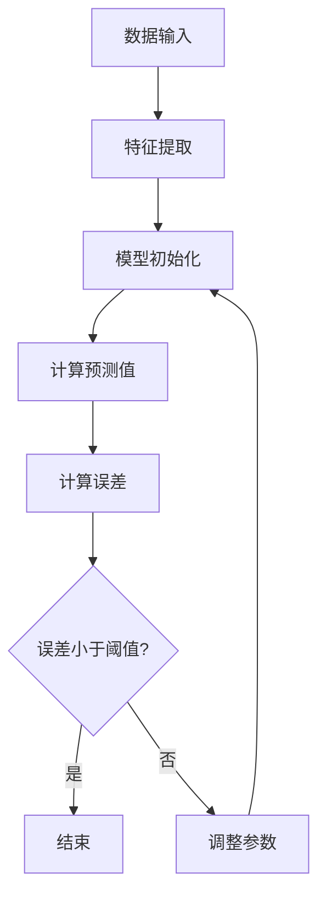
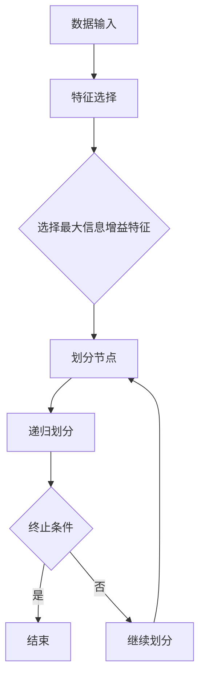
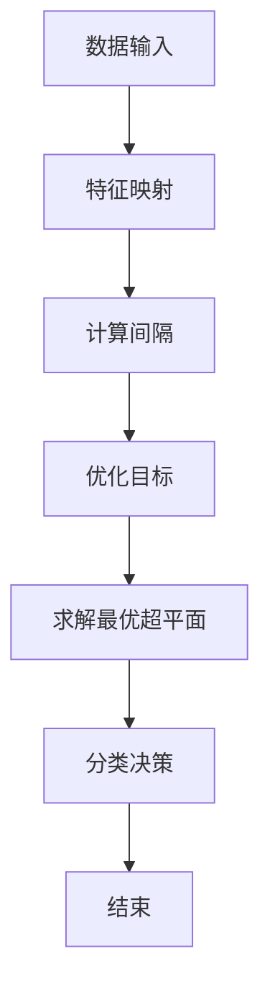
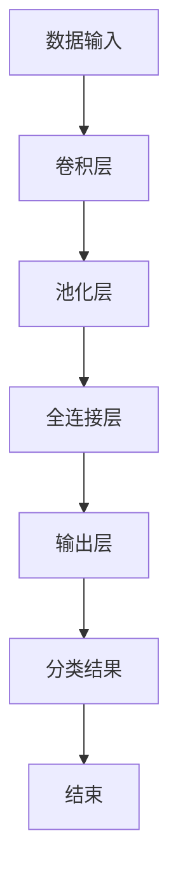

                 

## 《大数据与AI在公共安全领域的应用》

### 关键词：大数据、人工智能、公共安全、安防系统、数据挖掘、算法实现

> 摘要：本文将深入探讨大数据与人工智能（AI）技术在公共安全领域的应用。通过系统分析大数据技术的基础、AI技术的原理及其在公共安全中的具体应用，本文旨在揭示这一领域的前沿动态，为读者提供清晰、易懂的技术解析和实践指南。文章结构紧凑，逻辑清晰，旨在帮助读者全面了解大数据与AI如何提升公共安全保障水平。

### 目录大纲

**《大数据与AI在公共安全领域的应用》**

----------------------------------------------------------------

## 第一部分：引言与背景

### 第1章 引言与背景

#### 1.1 问题的提出与意义

#### 1.2 公共安全的现状与挑战

#### 1.3 大数据与AI技术的应用

#### 1.4 核心概念与联系

## 第二部分：大数据技术

### 第2章 大数据技术基础

#### 2.1 大数据技术的定义与特点

#### 2.2 大数据采集与存储

#### 2.3 数据清洗与预处理

#### 2.4 数据分析与挖掘

## 第三部分：AI技术

### 第3章 AI技术基础

#### 3.1 AI技术的定义与分类

#### 3.2 常见AI算法原理讲解

#### 3.3 AI算法原理的Mermaid流程图

#### 3.4 AI算法的Python源代码实现

#### 3.5 数学模型和数学公式

## 第四部分：大数据与AI在公共安全领域的应用

### 第4章 大数据与AI在公共安全领域的应用概述

#### 4.1 大数据与AI在公共安全领域的应用前景

#### 4.2 常见应用案例

#### 4.3 应用场景分析

## 第五部分：项目实战

### 第5章 项目实战一：智能安防系统

#### 5.1 环境安装

#### 5.2 系统核心实现源代码

#### 5.3 实际案例分析和详细讲解剖析

#### 5.4 项目小结

## 第六部分：拓展阅读

### 第6章 拓展阅读一：大数据与AI在公共安全领域的最新研究动态

#### 6.1 研究现状

#### 6.2 研究趋势

#### 6.3 未来展望

## 第七部分：小结与总结

### 第7章 小结与总结

#### 7.1 主要内容回顾

#### 7.2 注意事项

#### 7.3 拓展思考

----------------------------------------------------------------

### 第一部分：引言与背景

#### 1.1 问题的提出与意义

在当今社会，公共安全问题愈发受到关注。随着城市化进程的加快和信息技术的迅猛发展，公共安全领域面临着诸多挑战，如恐怖袭击、犯罪活动、交通事故、自然灾害等。这些问题不仅威胁到人民群众的生命财产安全，也对社会稳定造成影响。如何有效预防和应对这些挑战，成为政府、企业和个人共同关注的焦点。

大数据与人工智能（AI）技术的兴起，为解决公共安全问题提供了新的思路和手段。大数据技术能够从海量数据中提取有价值的信息，而AI技术则能够通过对这些信息的分析和处理，实现智能化的决策和支持。因此，将大数据与AI技术应用于公共安全领域，不仅具有重要的现实意义，也具有深远的社会影响。

本文将从以下几个方面展开讨论：

1. **公共安全的现状与挑战**：分析当前公共安全领域的现状和面临的挑战。
2. **大数据与AI技术的应用**：介绍大数据和AI技术的基本概念，以及它们在公共安全领域的应用。
3. **核心概念与联系**：梳理大数据和AI在公共安全领域中的核心概念及其相互联系。

通过以上讨论，本文旨在为读者提供一幅全面、清晰的大数据与AI在公共安全领域应用的全景图，帮助读者深入理解这一前沿领域。

#### 1.2 公共安全的现状与挑战

公共安全是一个涉及社会稳定、人民生命财产安全的重要领域。当前，公共安全领域面临诸多挑战，主要包括以下几个方面：

1. **犯罪活动日益复杂**：随着社会的多元化发展，犯罪活动形式多样化、手段隐蔽化。传统侦查手段难以应对日益复杂的犯罪活动，迫切需要引入新技术手段进行预防和打击。

2. **自然灾害频发**：全球气候变化导致自然灾害频发，如地震、台风、洪水等。这些灾害对公共安全构成严重威胁，需要及时、有效的应对措施来减少人员伤亡和财产损失。

3. **事故隐患不断增加**：随着城市化进程的加快，交通事故、火灾等事故隐患不断增加。如何及时预警、快速响应，成为公共安全领域的一大挑战。

4. **信息安全威胁加剧**：随着互联网的普及，信息安全威胁日益加剧。网络攻击、数据泄露等事件频发，对公共安全造成严重威胁。

面对这些挑战，传统的公共安全手段和方法已难以满足实际需求。大数据和人工智能（AI）技术的引入，为公共安全领域带来了新的机遇。大数据技术能够从海量数据中提取有价值的信息，为公共安全决策提供数据支持；AI技术则能够通过对这些信息的分析和处理，实现智能化的预警、识别和决策。

具体来说，大数据和AI技术在公共安全领域的应用主要包括以下几个方面：

1. **智能监控与视频分析**：利用大数据技术对海量视频数据进行分析，实现实时监控和异常行为识别。

2. **犯罪预测与预防**：通过分析历史犯罪数据，利用机器学习算法预测犯罪趋势，制定预防措施。

3. **自然灾害预警**：利用大数据技术收集和分析各种环境数据，实现自然灾害的预警和应急响应。

4. **事故预警与应急响应**：通过大数据和AI技术对事故隐患进行监测和预警，提高事故应急响应效率。

5. **信息安全防护**：利用大数据和AI技术对网络攻击、数据泄露等进行实时监测和防护，提高信息安全水平。

总的来说，大数据和AI技术在公共安全领域的应用，不仅有助于提升公共安全保障水平，也为公共安全领域的发展带来了新的机遇和挑战。下一步，我们需要进一步探索和研究这些技术的应用，以应对日益复杂的公共安全挑战。

#### 1.3 大数据与AI技术的应用

大数据和人工智能（AI）技术在公共安全领域的应用，为传统公共安全手段带来了革命性的变化。以下是这两种技术的基本概念以及它们在公共安全领域中的具体应用：

##### 大数据技术的定义与特点

大数据（Big Data）指的是无法使用传统数据处理工具在合理时间内进行捕获、管理和处理的数据集。大数据具有四个主要特征，即“4V”：Volume（数据量大）、Velocity（数据处理速度快）、Variety（数据类型多样）和Veracity（数据真实性高）。这些特点使得大数据技术能够在公共安全领域发挥重要作用。

1. **数据采集与存储**：大数据技术能够高效地采集和存储各种类型的数据，包括结构化数据、半结构化数据和非结构化数据。例如，公共安全领域可以利用大数据技术收集监控视频、交通数据、社交媒体数据等。
   
2. **数据清洗与预处理**：由于大数据的多样性和复杂性，数据清洗与预处理是大数据分析的关键步骤。这一过程包括去除重复数据、处理缺失值、数据标准化等，以确保数据的准确性和一致性。

3. **数据分析与挖掘**：大数据分析技术能够从海量数据中提取有价值的信息，帮助公共安全部门发现潜在的安全隐患和趋势。例如，通过分析历史犯罪数据和实时监控数据，可以预测犯罪热点区域和犯罪类型。

##### AI技术的定义与分类

人工智能（AI）是一种模拟人类智能的技术，能够使计算机具备感知、学习、推理和解决问题的能力。AI技术可以分为以下几类：

1. **机器学习**：机器学习是一种通过算法从数据中学习模式和规律的方法。它广泛应用于公共安全领域，例如，通过训练模型进行图像识别、语音识别和异常检测。

2. **深度学习**：深度学习是机器学习的一个子领域，通过多层神经网络模拟人类大脑的决策过程。在公共安全中，深度学习可用于智能监控、面部识别和车辆识别。

3. **强化学习**：强化学习通过奖励机制来训练模型，使其在特定环境中做出最优决策。在公共安全中，强化学习可以用于智能交通管理和应急决策。

##### 大数据与AI在公共安全领域的结合

大数据和AI技术的结合，使得公共安全领域实现了智能化和自动化。以下是大数据与AI在公共安全领域的几个具体应用实例：

1. **智能监控与视频分析**：通过大数据技术收集海量监控视频数据，结合AI技术进行视频分析和异常检测，实时发现潜在的安全威胁。

2. **犯罪预测与预防**：利用大数据分析技术，结合机器学习和深度学习算法，对历史犯罪数据进行分析，预测犯罪热点区域和犯罪趋势，从而制定针对性的预防措施。

3. **自然灾害预警**：通过大数据技术收集和分析气象数据、地质数据等，结合AI技术进行预测和预警，提前应对自然灾害。

4. **事故预警与应急响应**：利用大数据和AI技术对交通数据、传感器数据等进行实时分析，预测交通事故和火灾等事故的发生，提高应急响应速度。

5. **信息安全防护**：通过大数据分析技术实时监测网络流量和日志数据，结合AI技术检测和防御网络攻击和数据泄露。

总的来说，大数据与AI技术的结合，为公共安全领域带来了前所未有的变革。通过智能化和自动化手段，公共安全部门可以更有效地预防和应对各种安全威胁，保障人民群众的生命财产安全。

#### 1.4 核心概念与联系

在探讨大数据与AI在公共安全领域的应用时，理解以下几个核心概念及其相互联系是非常重要的。

##### 核心概念

1. **大数据（Big Data）**：指的是无法使用传统数据处理工具在合理时间内进行捕获、管理和处理的数据集。特点为4V：数据量大、处理速度快、数据类型多样和数据真实性高。

2. **人工智能（AI）**：一种模拟人类智能的技术，使计算机具备感知、学习、推理和解决问题的能力。包括机器学习、深度学习和强化学习等子领域。

3. **公共安全（Public Safety）**：涉及社会稳定、人民生命财产安全的重要领域，包括反恐、犯罪预防、自然灾害预警和信息安全等方面。

4. **数据挖掘（Data Mining）**：从大量数据中提取有价值信息的过程，帮助发现潜在的安全隐患和趋势。

##### 概念属性特征对比表格

| 概念 | 定义 | 特点 | 应用领域 |
| --- | --- | --- | --- |
| 大数据 | 数据量大、处理速度快、数据类型多样、数据真实性高 | 4V特点 | 公共安全、商业分析、医疗保健 |
| 人工智能 | 模拟人类智能，包括感知、学习、推理和解决问题 | 子领域包括机器学习、深度学习和强化学习 | 公共安全、金融、医疗、交通 |
| 公共安全 | 社会稳定、人民生命财产安全 | 包括反恐、犯罪预防、自然灾害预警和信息安全 | 政府机构、执法部门、应急管理部门 |
| 数据挖掘 | 从大量数据中提取有价值信息 | 技术包括聚类、分类、关联规则挖掘等 | 公共安全、商业分析、医疗保健 |

##### ER实体关系图架构的 Mermaid 流程图

```mermaid
erDiagram
    User ||--|{ PublicSafety }: "涉及" 1
    PublicSafety ||--|{ CrimePrevention }: "包括" *
    PublicSafety ||--|{ DisasterWarning }: "包括" *
    PublicSafety ||--|{ InformationSecurity }: "包括" *
    AI <<--|{ DataMining }: "用于" 1
    AI <<--|{ Surveillance }: "用于" 1
    AI <<--|{ CrimePrediction }: "用于" 1
    AI <<--|{ EmergencyResponse }: "用于" 1
```

在这个ER图架构中，用户与公共安全之间存在关系，公共安全包括多个子领域，如犯罪预防、自然灾害预警和信息安全。同时，人工智能与数据挖掘、监控、犯罪预测和应急响应等子领域有直接关联，展示了大数据和AI在公共安全领域的核心应用。

通过理解这些核心概念及其相互关系，我们可以更好地把握大数据和AI在公共安全领域的应用前景，从而为解决现实问题提供有效手段。

### 第二部分：大数据技术

#### 2.1 大数据技术的定义与特点

大数据技术是指用于处理、存储和分析大规模复杂数据的一套方法论和技术工具。它不同于传统数据处理技术，主要特点体现在“4V”上：数据量大（Volume）、处理速度快（Velocity）、数据类型多样（Variety）和数据真实性高（Veracity）。以下是对这些特点的详细解释：

1. **数据量大（Volume）**：大数据技术的首要特点在于数据量巨大，这超越了传统数据处理系统的处理能力。例如，社交媒体平台每天产生的大量用户互动数据、全球金融机构处理的海量交易数据等，都是典型的数据量大（Volume）的案例。

2. **处理速度快（Velocity）**：随着数据生成的速度越来越快，处理速度成为大数据技术的重要特点。实时数据处理和分析（如流数据处理技术）可以实现对数据的即时响应，这对于公共安全领域尤其重要，例如，实时监控和预警系统能够迅速识别和响应潜在的安全威胁。

3. **数据类型多样（Variety）**：大数据不仅包括结构化数据，如关系数据库中的数据，还包括半结构化数据（如日志文件）和非结构化数据（如图像、音频和视频）。这种多样性要求大数据技术能够处理不同类型的数据，并进行有效的整合和分析。

4. **数据真实性高（Veracity）**：在公共安全领域，数据的真实性至关重要。大数据技术需要确保数据的准确性和可靠性，从而为决策提供坚实的基础。例如，在犯罪预防和打击中，需要依赖于真实、准确的数据来进行分析和预测。

##### 大数据采集与存储

大数据采集与存储是大数据技术中的关键环节。以下将详细介绍这些方面的方法和技术：

1. **数据采集方法**：大数据采集的方法主要包括：

   - **自动化采集**：使用自动化工具和脚本从各种数据源（如Web、数据库、传感器等）收集数据。
   - **实时采集**：通过流处理技术（如Apache Kafka、Apache Flume等）实现对数据的实时采集。
   - **离线采集**：批量处理历史数据，通过爬虫或API调用等方式收集。

2. **数据存储技术**：为了应对大数据的“4V”特点，大数据存储技术通常采用以下几种方法：

   - **分布式存储系统**：如Hadoop Distributed File System (HDFS) 和 Apache HBase，可以处理海量数据并提供高可靠性和高吞吐量的存储能力。
   - **NoSQL数据库**：如MongoDB、Cassandra和Redis，适用于存储半结构化和非结构化数据，并提供灵活的查询能力。
   - **数据湖**：如Amazon S3和Azure Data Lake Storage，可以存储海量原始数据，并支持数据湖架构，便于后续的分析和处理。

##### 数据清洗与预处理

数据清洗与预处理是大数据分析的关键步骤，其目的是确保数据的质量和一致性，以便后续的分析和处理。以下介绍数据清洗与预处理的主要方法：

1. **数据清洗**：数据清洗包括以下几种方法：

   - **去除重复数据**：通过比较数据项之间的相似度或唯一性，去除重复的数据项。
   - **处理缺失值**：包括填充缺失值、删除含有缺失值的记录或对缺失值进行预测。
   - **数据标准化**：将数据转换为统一的格式或范围，便于后续分析。

2. **数据预处理**：数据预处理包括以下几种方法：

   - **数据转换**：将数据转换为适合分析和挖掘的格式，如将文本数据转换为向量。
   - **数据集成**：将来自多个数据源的数据进行整合，形成统一的视图。
   - **特征工程**：选择和构建能够反映数据特征的新变量，以提升模型的性能。

##### 数据分析与挖掘

大数据分析是指通过一系列技术方法，从海量数据中提取有价值的信息和知识的过程。以下介绍数据分析与挖掘的主要方法：

1. **数据分析方法**：

   - **统计分析**：使用传统的统计分析方法，如描述性统计、回归分析、聚类分析等，对数据进行分析。
   - **机器学习**：利用机器学习算法，如监督学习、无监督学习和强化学习，对数据进行分析和预测。
   - **数据挖掘**：应用数据挖掘技术，如关联规则挖掘、分类、聚类和异常检测等，从数据中发现模式和规律。

2. **数据挖掘技术**：

   - **关联规则挖掘**：通过分析数据之间的关联关系，发现频繁出现的模式，如市场篮子分析。
   - **分类与预测**：通过训练分类模型，对数据进行分类，实现预测和决策。
   - **聚类分析**：将数据划分为若干个簇，以发现数据中的自然分组和模式。
   - **异常检测**：检测数据中的异常值或异常模式，用于发现潜在的安全威胁或异常行为。

总的来说，大数据技术在公共安全领域中的应用，不仅需要高效的数据采集与存储方法，还需要可靠的数据清洗与预处理技术，以及先进的数据分析与挖掘手段。通过这些技术的综合运用，公共安全部门可以更好地应对复杂的安全挑战，保障人民群众的生命财产安全。

#### 2.2 大数据采集与存储

大数据采集与存储是大数据技术体系中的关键环节，涉及到从数据源采集数据、存储数据的结构设计以及确保数据质量和可用性的技术与方法。以下将详细介绍大数据采集与存储的具体步骤和技术。

##### 大数据采集方法

大数据采集主要关注以下几个方面：

1. **自动化采集**：自动化采集是大数据采集的基本手段，通过编写脚本或使用现成的工具来自动化地从不同数据源获取数据。常见的自动化采集工具有Python的requests库、Apache Nifi等。

2. **实时采集**：实时采集适用于需要即时处理和分析的场景。常用的实时数据采集工具有Apache Kafka、Apache Flume等。这些工具能够高效地处理大规模的实时数据流，确保数据的及时性和准确性。

3. **离线采集**：离线采集主要针对历史数据的收集，通常在非高峰时段进行数据导入和处理。常用的离线采集工具包括ETL（Extract, Transform, Load）工具，如Apache NiFi、Apache Kafka等。

##### 数据存储技术

大数据存储技术旨在解决海量数据的存储和管理问题。以下介绍几种常用的数据存储技术：

1. **分布式存储系统**：分布式存储系统能够处理海量数据并提供高可靠性和高吞吐量的存储能力。常见的分布式存储系统包括Hadoop Distributed File System (HDFS) 和 Apache HBase。

   - **HDFS**：Hadoop Distributed File System是一个分布式文件系统，适用于存储和大数据集。它的主要特点包括高容错性、高吞吐量和适合大规模数据处理的架构。
   - **Apache HBase**：HBase是一个分布式、可扩展的列存储数据库，基于HDFS构建。它支持大规模数据存储和快速随机读写操作，适用于实时数据分析和处理。

2. **NoSQL数据库**：NoSQL数据库适用于存储半结构化和非结构化数据，并提供灵活的查询能力。常见的NoSQL数据库包括MongoDB、Cassandra和Redis。

   - **MongoDB**：MongoDB是一个文档型数据库，适用于存储大量半结构化数据。它的主要特点包括灵活的文档结构、高效的查询能力和良好的扩展性。
   - **Cassandra**：Cassandra是一个分布式、无架构的数据库，适用于存储大规模结构化数据。它的主要特点包括高可用性、高可靠性和可扩展性。
   - **Redis**：Redis是一个基于内存的键值存储数据库，适用于存储少量高速访问的数据。它的主要特点包括快速读写性能和高可用性。

3. **数据湖**：数据湖是一种分布式数据架构，旨在存储海量原始数据并提供灵活的数据处理和分析能力。常见的数据湖解决方案包括Amazon S3和Azure Data Lake Storage。

   - **Amazon S3**：Amazon S3是Amazon Web Services提供的一种对象存储服务，适用于存储和大数据集。它的主要特点包括高可靠性、高可用性和灵活的访问控制。
   - **Azure Data Lake Storage**：Azure Data Lake Storage是Microsoft Azure提供的一种数据湖存储服务，适用于存储和大数据集。它的主要特点包括高容量、高吞吐量和丰富的数据服务支持。

##### 数据存储结构设计

大数据存储结构设计需要考虑到数据的组织方式、访问模式和数据的安全性等因素。以下介绍几种常见的数据存储结构设计：

1. **分布式文件系统**：分布式文件系统如HDFS和Cassandra采用分区和副本机制来存储数据，提高了数据的可靠性和访问速度。每个数据分区存储在一个或多个节点上，副本机制确保数据的高可用性。

2. **列式存储数据库**：如HBase和Cassandra，采用列式存储结构，适合于大规模数据集的快速随机读写操作。列式存储结构能够减少磁盘I/O操作，提高数据处理效率。

3. **文档型数据库**：如MongoDB，采用文档存储结构，每个文档是一个独立的JSON对象。文档存储结构便于数据的灵活扩展和更新，适合存储半结构化数据。

##### 数据质量和可用性保证

大数据采集与存储不仅需要高效的技术手段，还需要确保数据的质量和可用性。以下介绍一些保证数据质量和可用性的方法：

1. **数据清洗**：数据清洗是保证数据质量的重要步骤，包括去除重复数据、处理缺失值和异常值、数据标准化等。常用的数据清洗工具包括Apache NiFi、Apache Spark等。

2. **数据质量监控**：通过实时监控数据质量指标，如数据准确性、完整性、一致性等，确保数据质量。数据质量监控工具包括Apache Kafka、Apache Hadoop等。

3. **数据备份和恢复**：定期备份数据，并确保数据恢复机制的有效性，以提高数据的可用性。常用的数据备份和恢复工具包括Apache Hadoop、Azure Data Lake Storage等。

总的来说，大数据采集与存储是大数据技术中的关键环节，涉及到从数据源高效采集数据、设计合理的存储结构以及保证数据质量和可用性的技术与方法。通过运用这些技术，公共安全部门可以更好地应对海量数据的挑战，为安全决策提供有力支持。

#### 2.3 数据清洗与预处理

数据清洗与预处理是大数据技术中的关键环节，其目的是确保数据的质量和一致性，以便后续的分析和处理。以下将详细介绍数据清洗与预处理的主要方法，包括数据清洗和数据预处理。

##### 数据清洗

数据清洗是指对原始数据进行处理，去除重复、异常和错误的数据，以提高数据质量。以下介绍几种常见的数据清洗方法：

1. **去除重复数据**：重复数据会降低数据分析的准确性，因此需要通过去重算法去除重复的数据项。常见的方法包括基于哈希算法的去重和基于比较的去重。

2. **处理缺失值**：缺失值处理是数据清洗的重要步骤，可以采用以下方法：

   - **删除**：删除含有缺失值的记录，适用于缺失值比例较低的情况。
   - **填充**：用合适的值填充缺失值，如使用平均值、中位数或模式值进行填充。
   - **预测**：使用机器学习算法预测缺失值，如使用K-最近邻算法（KNN）或决策树进行预测。

3. **数据标准化**：数据标准化是将数据转换为统一的格式或范围，以便进行后续分析。常见的方法包括归一化和标准化，如将数据归一化到[0,1]区间或标准化到均值为0、标准差为1的分布。

##### 数据预处理

数据预处理是指对清洗后的数据进行处理，使其适合进行数据分析。以下介绍几种常见的数据预处理方法：

1. **数据转换**：数据转换是将不同类型的数据转换为适合分析和挖掘的格式。常见的方法包括将文本数据转换为向量、将图像数据转换为像素矩阵等。

2. **数据集成**：数据集成是将来自多个数据源的数据进行整合，形成统一的数据视图。常见的方法包括合并、连接和聚集等。

3. **特征工程**：特征工程是选择和构建能够反映数据特征的新变量，以提升模型的性能。常见的方法包括特征选择、特征提取和特征构造等。

4. **数据降维**：数据降维是将高维数据转换为低维数据，以减少计算复杂度和提高分析效率。常见的方法包括主成分分析（PCA）和线性判别分析（LDA）等。

##### 实际案例

为了更好地理解数据清洗与预处理的过程，我们来看一个实际案例：利用机器学习算法预测犯罪率。

1. **数据清洗**：首先，我们需要收集犯罪数据，包括日期、地点、犯罪类型等。然后，对数据进行清洗，去除重复和异常数据，处理缺失值。例如，如果某条记录的犯罪类型缺失，我们可以用最常见的犯罪类型进行填充。

2. **数据预处理**：对清洗后的数据进行预处理，包括数据转换、数据集成和特征工程。例如，将日期转换为月份和年份，将犯罪类型编码为数值，以及构造新的特征，如犯罪发生的时段和季节。

3. **数据降维**：如果数据维度较高，我们可以使用主成分分析（PCA）等方法进行降维，减少数据的维度，提高模型的效率。

通过以上步骤，我们得到了适合进行机器学习预测的数据集。接下来，可以使用机器学习算法（如决策树、随机森林等）进行训练和预测，从而实现犯罪率的预测。

总的来说，数据清洗与预处理是大数据技术中的重要环节，通过有效的数据清洗和预处理方法，我们可以提高数据的质量和一致性，为后续的数据分析和挖掘提供可靠的基础。

#### 2.4 数据分析与挖掘

大数据分析是指从海量数据中提取有价值的信息和知识的过程。数据挖掘作为大数据分析的核心技术之一，涵盖了多种算法和方法，用于发现数据中的模式和规律。以下将详细介绍数据分析与挖掘的主要方法。

##### 数据分析方法

1. **统计分析**：统计分析是一种基于数学统计理论的数据分析方法，适用于探索性数据分析和验证假设。常用的统计分析方法包括描述性统计、回归分析、方差分析等。

   - **描述性统计**：用于描述数据的基本特征，如均值、中位数、标准差等。
   - **回归分析**：用于建立自变量和因变量之间的关系模型，如线性回归、多项式回归等。
   - **方差分析**：用于比较多个组之间的差异，如单因素方差分析和多因素方差分析。

2. **机器学习**：机器学习是一种利用算法从数据中学习模式和规律的方法。机器学习可以分为监督学习和无监督学习。

   - **监督学习**：用于分类和回归问题，如决策树、支持向量机（SVM）、随机森林等。
   - **无监督学习**：用于发现数据中的隐含结构和模式，如聚类算法、关联规则挖掘等。

3. **数据挖掘**：数据挖掘是大数据分析的核心技术，旨在从海量数据中发现有价值的信息和知识。常见的数据挖掘方法包括：

   - **关联规则挖掘**：用于发现数据中的关联关系，如Apriori算法、FP-growth算法等。
   - **分类与预测**：用于预测和分类问题，如K最近邻（KNN）、朴素贝叶斯（NB）、决策树等。
   - **聚类分析**：用于将数据分为不同的组或簇，如K-means聚类、层次聚类等。
   - **异常检测**：用于发现数据中的异常值或异常模式，如孤立森林（Isolation Forest）、局部离群因子（LOF）等。

##### 数据挖掘技术

1. **关联规则挖掘**：关联规则挖掘是一种用于发现数据中隐含关联关系的方法。常见的算法包括Apriori算法和FP-growth算法。

   - **Apriori算法**：通过频繁项集和支持度来挖掘关联规则，适用于处理大量交易数据。
   - **FP-growth算法**：通过构建FP树来高效挖掘频繁项集，适用于处理高维数据和非事务数据。

2. **分类与预测**：分类与预测是数据挖掘中的重要应用，旨在将数据分为不同的类别或预测未来的趋势。常见的算法包括K最近邻（KNN）、朴素贝叶斯（NB）、决策树、随机森林等。

   - **K最近邻（KNN）**：通过计算数据点之间的距离，找到与目标数据点最近的K个邻居，并基于邻居的标签进行分类或预测。
   - **朴素贝叶斯（NB）**：基于贝叶斯定理和特征条件独立假设，用于分类问题，适用于文本分类和垃圾邮件过滤等。
   - **决策树**：通过划分特征空间，构建决策树模型，实现分类和回归任务。
   - **随机森林（RF）**：基于决策树的集成方法，通过构建多棵决策树并投票决定最终结果，提高模型的泛化能力。

3. **聚类分析**：聚类分析是一种无监督学习方法，旨在将数据分为不同的组或簇。常见的算法包括K-means聚类、层次聚类等。

   - **K-means聚类**：基于距离度量，将数据点分为K个簇，使得每个簇内的数据点之间距离最小，簇与簇之间距离最大。
   - **层次聚类**：通过自底向上的方法，将数据点逐步合并成簇，构建一个层次结构。

4. **异常检测**：异常检测是一种用于发现数据中异常值或异常模式的方法，对于公共安全领域尤其重要。常见的算法包括孤立森林（Isolation Forest）、局部离群因子（LOF）等。

   - **孤立森林（Isolation Forest）**：通过随机选取特征和分割数据，构建多棵树，用于检测异常值。
   - **局部离群因子（LOF）**：通过计算数据点相对于其邻域的离群程度，用于检测异常值。

总的来说，数据分析与挖掘是大数据技术的核心，通过多种算法和方法，可以从海量数据中提取有价值的信息和知识。在公共安全领域，数据分析与挖掘的应用不仅有助于预防和应对各种安全挑战，也为智能决策和应急响应提供了有力支持。

### 第三部分：AI技术

#### 3.1 AI技术的定义与分类

人工智能（AI）是一种模拟人类智能的技术，使计算机能够执行通常需要人类智能才能完成的任务。AI技术可以分为以下几类：

##### 机器学习

机器学习是AI的核心技术之一，通过算法让计算机从数据中学习模式和规律。机器学习可以分为监督学习和无监督学习：

1. **监督学习**：在监督学习模型中，输入数据带有标签，模型的目标是学习输入和输出之间的映射关系。常见的算法包括线性回归、决策树、支持向量机（SVM）和神经网络。

2. **无监督学习**：无监督学习模型没有明确的标签，主要任务是发现数据中的内在结构和规律。常见的算法包括聚类算法（如K-means、层次聚类）、降维算法（如主成分分析PCA）和关联规则挖掘（如Apriori算法）。

##### 深度学习

深度学习是机器学习的一个子领域，通过多层神经网络模拟人类大脑的决策过程。深度学习在图像识别、语音识别和自然语言处理等领域取得了显著成果：

1. **卷积神经网络（CNN）**：CNN是一种专门用于图像识别的神经网络结构，通过卷积操作提取图像特征，广泛应用于图像分类和目标检测。

2. **循环神经网络（RNN）**：RNN通过循环结构处理序列数据，适用于语音识别、机器翻译和文本生成等任务。

3. **生成对抗网络（GAN）**：GAN通过两个对抗性网络（生成器和判别器）的博弈过程生成高质量的数据，广泛应用于图像生成、视频生成和音乐生成。

##### 强化学习

强化学习通过奖励机制训练模型，使其在特定环境中做出最优决策。强化学习在游戏、机器人控制和自动驾驶等领域具有广泛应用：

1. **Q-Learning**：Q-Learning是一种基于价值迭代的强化学习算法，通过更新Q值（状态-动作值函数）来选择最优动作。

2. **深度强化学习**：深度强化学习结合深度学习模型和强化学习算法，适用于复杂环境的决策问题，如自动驾驶和机器人控制。

#### 3.2 常见AI算法原理讲解

以下是几种常见AI算法的原理讲解：

##### 线性回归

线性回归是一种简单的监督学习算法，用于预测连续值。其基本原理是通过线性函数拟合训练数据中的关系，公式为：

\[ y = wx + b \]

其中，\( y \) 是预测值，\( x \) 是输入特征，\( w \) 是权重，\( b \) 是偏置。通过最小化均方误差（MSE）来优化模型参数，公式为：

\[ \min_{w,b} \sum_{i=1}^{n} (y_i - wx_i - b)^2 \]

##### 决策树

决策树是一种常见的分类算法，通过一系列判断条件将数据分为不同的类别。其基本原理如下：

1. **特征选择**：选择具有最大信息增益的特征进行分割。
2. **节点划分**：对于每个特征，将数据分为多个子集，每个子集创建一个新的节点。
3. **分类**：当节点中没有数据或达到终止条件时，对节点进行分类。

终止条件包括节点中所有数据属于同一类别、数据量过小等。

##### 支持向量机（SVM）

支持向量机是一种强大的分类算法，通过找到一个最佳的超平面，将不同类别的数据分隔开来。其基本原理如下：

1. **线性SVM**：在特征空间中找到一个最优的超平面，使得正负样本之间的间隔最大。
2. **核函数**：通过核函数将低维数据映射到高维空间，实现线性不可分问题的分类。

优化目标为：

\[ \min_{w,b,\xi_i} \frac{1}{2} ||w||^2 + C \sum_{i=1}^{n} \xi_i \]

其中，\( w \) 是权重向量，\( b \) 是偏置，\( \xi_i \) 是松弛变量，\( C \) 是惩罚参数。

##### 卷积神经网络（CNN）

卷积神经网络是一种专门用于图像识别的神经网络结构，其基本原理如下：

1. **卷积层**：通过卷积操作提取图像特征，如边缘、纹理等。
2. **池化层**：通过下采样操作减少数据维度，提高计算效率。
3. **全连接层**：将卷积层和池化层提取的特征进行融合，实现最终的分类或回归任务。

CNN广泛应用于图像分类、目标检测和图像生成等领域。

总的来说，AI技术包括机器学习、深度学习和强化学习等多种算法，每种算法都有其独特的原理和应用场景。通过深入理解这些算法，我们可以更好地利用AI技术解决实际问题。

#### 3.3 AI算法原理的Mermaid流程图

为了更好地理解AI算法的原理，我们可以使用Mermaid流程图来展示算法的基本流程。以下是一些常见AI算法的Mermaid流程图示例：

##### 线性回归



这个流程图展示了线性回归的基本流程：首先输入数据，然后进行特征提取，初始化模型参数，计算预测值和实际值的误差，并根据误差调整参数，循环进行直到误差小于阈值。

##### 决策树



这个流程图展示了决策树的基本原理：首先输入数据，选择具有最大信息增益的特征进行划分，递归地划分节点，直到满足终止条件（如节点中所有数据属于同一类别或数据量过小）。

##### 支持向量机（SVM）



这个流程图展示了SVM的基本流程：首先输入数据，通过核函数将数据映射到高维空间，计算间隔，求解最优超平面，进行分类决策。

##### 卷积神经网络（CNN）



这个流程图展示了CNN的基本原理：首先输入数据，通过卷积层提取特征，进行池化层操作，然后将特征送入全连接层，最后在输出层得到分类结果。

通过这些Mermaid流程图，我们可以直观地理解各种AI算法的基本原理和工作流程。

#### 3.4 AI算法的Python源代码实现

在本节中，我们将通过Python示例代码详细讲解几种常见AI算法的原理，并展示如何使用Python实现这些算法。以下是每个算法的简要概述和代码示例。

##### 线性回归

线性回归是一种用于预测连续值的简单监督学习算法。下面是一个简单的线性回归实现：

```python
import numpy as np

# 初始化参数
w = np.random.rand(1)  # 权重
b = np.random.rand(1)  # 偏置

# 数据集
x = np.array([1, 2, 3, 4, 5])
y = np.array([2, 4, 6, 8, 10])

# 训练模型
n = len(x)
for epoch in range(100):
    y_pred = w * x + b
    error = y - y_pred
    
    w_gradient = -2/n * np.sum(error * x)
    b_gradient = -2/n * np.sum(error)
    
    w -= w_gradient
    b -= b_gradient

# 预测新数据
x_new = 6
y_pred_new = w * x_new + b
print(f"预测值：{y_pred_new}")
```

在这个示例中，我们随机初始化权重和偏置，然后通过计算误差的梯度来迭代更新参数。最终，我们使用训练好的模型来预测新数据的值。

##### 决策树

决策树是一种常用的分类算法，通过一系列条件判断来划分数据。以下是使用Python实现一个简单的决策树：

```python
def decision_tree(data, features, target_attribute="class"):
    # 如果所有数据属于同一类别，则返回该类别
    if len(set(data[target_attribute])) == 1:
        return data[target_attribute].unique()[0]
    
    # 如果没有可分割的特征，则返回多数类别
    if len(features) == 0:
        return max(set(data[target_attribute]), key=data[target_attribute].count)
    
    # 选择最优特征
    best_feature = max(features, key=lambda f: data[f].nunique())
    # 创建一个树结构
    tree = {best_feature: {}}
    
    # 对于每个特征值，递归地分割数据
    for value in data[best_feature].unique():
        sub_data = data[data[best_feature] == value]
        # 递归构建子树
        tree[best_feature][value] = decision_tree(sub_data, features - set([best_feature]))
    
    return tree

# 数据集
data = {
    "class": ["Iris-setosa", "Iris-setosa", "Iris-setosa", "Iris-setosa", "Iris-versicolor", "Iris-versicolor", "Iris-virginica"],
    "feature1": [1, 1, 1, 2, 2, 2, 3, 3, 3],
    "feature2": [1, 2, 2, 2, 3, 3, 3, 3, 4]
}

# 构建决策树
tree = decision_tree(data, data.columns.difference([target_attribute]))
print(tree)
```

在这个示例中，我们定义了一个简单的决策树函数，该函数使用信息增益来选择最优特征，并递归地分割数据。然后，我们使用一个示例数据集来构建决策树。

##### 支持向量机（SVM）

SVM是一种用于分类和回归的强大算法。以下是使用Python的scikit-learn库实现线性SVM的示例：

```python
from sklearn.svm import LinearSVC
from sklearn.model_selection import train_test_split
from sklearn.metrics import accuracy_score

# 数据集
x = np.array([[1, 2], [2, 3], [3, 5], [4, 4]])
y = np.array([0, 0, 1, 1])

# 划分训练集和测试集
x_train, x_test, y_train, y_test = train_test_split(x, y, test_size=0.2, random_state=42)

# 训练SVM模型
clf = LinearSVC()
clf.fit(x_train, y_train)

# 预测测试集
y_pred = clf.predict(x_test)

# 计算准确率
accuracy = accuracy_score(y_test, y_pred)
print(f"准确率：{accuracy}")
```

在这个示例中，我们使用scikit-learn库中的`LinearSVC`类实现线性SVM。我们首先划分训练集和测试集，然后训练模型并预测测试集的标签。最后，我们计算预测的准确率。

##### 卷积神经网络（CNN）

卷积神经网络是一种用于图像识别的深度学习算法。以下是使用Python的TensorFlow库实现简单的CNN的示例：

```python
import tensorflow as tf
from tensorflow.keras import datasets, layers, models

# 加载数据集
(train_images, train_labels), (test_images, test_labels) = datasets.cifar10.load_data()

# 预处理数据
train_images = train_images / 255.0
test_images = test_images / 255.0

# 构建CNN模型
model = models.Sequential()
model.add(layers.Conv2D(32, (3, 3), activation='relu', input_shape=(32, 32, 3)))
model.add(layers.MaxPooling2D((2, 2)))
model.add(layers.Conv2D(64, (3, 3), activation='relu'))
model.add(layers.MaxPooling2D((2, 2)))
model.add(layers.Conv2D(64, (3, 3), activation='relu'))

# 添加全连接层
model.add(layers.Flatten())
model.add(layers.Dense(64, activation='relu'))
model.add(layers.Dense(10, activation='softmax'))

# 编译模型
model.compile(optimizer='adam',
              loss='sparse_categorical_crossentropy',
              metrics=['accuracy'])

# 训练模型
model.fit(train_images, train_labels, epochs=10, validation_split=0.1)

# 测试模型
test_loss, test_acc = model.evaluate(test_images,  test_labels, verbose=2)
print(f"测试准确率：{test_acc}")
```

在这个示例中，我们使用TensorFlow库加载CIFAR-10数据集，并构建一个简单的CNN模型。然后，我们使用训练集训练模型，并在测试集上评估模型的准确率。

通过这些示例代码，我们可以直观地理解各种AI算法的原理，并通过Python实现这些算法。这为我们进一步研究和应用AI技术提供了坚实的基础。

#### 3.5 数学模型和数学公式

在AI领域中，数学模型和数学公式是理解和实现算法的基础。以下是几种常见AI算法的数学模型和数学公式的讲解：

##### 线性回归

线性回归是一种简单的监督学习算法，用于预测连续值。其数学模型如下：

\[ y = wx + b \]

其中，\( y \) 是预测值，\( x \) 是输入特征，\( w \) 是权重，\( b \) 是偏置。

为了求解最优的权重和偏置，我们通常使用最小二乘法，即最小化均方误差（MSE）：

\[ \min_{w,b} \sum_{i=1}^{n} (y_i - wx_i - b)^2 \]

其中，\( n \) 是样本数量。

##### 决策树

决策树的数学模型是基于信息增益的。信息增益（Information Gain）的计算公式如下：

\[ IG(D, A) = \sum_{v \in V} p(v) \cdot IG_v(D, A) \]

其中，\( D \) 是数据集，\( A \) 是特征，\( v \) 是特征 \( A \) 的不同取值，\( IG_v(D, A) \) 是在特征 \( A \) 取值为 \( v \) 的情况下，数据集 \( D \) 的信息增益。

信息增益的计算公式为：

\[ IG_v(D, A) = \sum_{x \in X} p(x|v) \cdot \log_2 p(x|v) \]

其中，\( x \) 是数据集中的样本，\( p(x|v) \) 是在特征 \( A \) 取值为 \( v \) 的情况下，样本 \( x \) 的条件概率。

##### 支持向量机（SVM）

支持向量机的数学模型是基于最大化间隔的。优化目标是：

\[ \min_{w,b,\xi_i} \frac{1}{2} ||w||^2 + C \sum_{i=1}^{n} \xi_i \]

其中，\( w \) 是权重向量，\( b \) 是偏置，\( \xi_i \) 是松弛变量，\( C \) 是惩罚参数。

约束条件为：

\[ y_i (w \cdot x_i + b) \geq 1 - \xi_i \]

其中，\( y_i \) 是样本 \( x_i \) 的标签。

##### 卷积神经网络（CNN）

卷积神经网络的核心是卷积操作和池化操作。卷积操作的数学公式如下：

\[ f(x, y) = \sum_{i=1}^{C} w_{i} \cdot f(x-i, y-j) + b_i \]

其中，\( f(x, y) \) 是卷积结果，\( w_i \) 是卷积核，\( f(x-i, y-j) \) 是卷积核在输入图像上的作用区域，\( b_i \) 是偏置。

池化操作的数学公式如下：

\[ p(x, y) = \max_{i, j} f(x+i, y+j) \]

其中，\( p(x, y) \) 是池化结果，\( f(x+i, y+j) \) 是输入图像上的某个区域。

通过理解和应用这些数学模型和数学公式，我们可以更好地理解和实现各种AI算法，为实际应用提供强有力的技术支持。

### 第四部分：大数据与AI在公共安全领域的应用

#### 4.1 大数据与AI在公共安全领域的应用前景

随着大数据与人工智能（AI）技术的不断发展和成熟，它们在公共安全领域的应用前景愈发广阔。大数据技术能够从海量数据中提取有价值的信息，而AI技术则能够通过对这些信息的分析和处理，实现智能化的预警、识别和决策。以下将详细介绍大数据与AI在公共安全领域的应用前景、优势与挑战。

##### 应用前景

1. **智能监控与视频分析**：利用大数据技术，可以高效地采集、存储和分析海量视频数据。结合AI技术，可以实现对视频内容的实时监控和异常行为识别，如人脸识别、车辆识别、行为分析等。这有助于提高犯罪预防和事故预警的效率。

2. **犯罪预测与预防**：通过分析历史犯罪数据和实时监控数据，利用机器学习算法可以预测犯罪趋势，识别潜在犯罪热点区域和犯罪类型。这有助于公安部门提前部署警力和采取预防措施，降低犯罪发生率。

3. **自然灾害预警**：大数据技术可以收集和分析气象、地质等多源数据，结合AI技术进行预测和预警，提前应对自然灾害。例如，通过分析降雨量、土壤湿度等数据，可以预测洪水、泥石流等灾害的发生，提高应急响应的及时性和有效性。

4. **事故预警与应急响应**：利用大数据和AI技术对交通数据、传感器数据等进行实时分析，可以预测交通事故和火灾等事故的发生，提高事故应急响应速度。例如，通过分析车辆行驶速度、道路拥堵情况等数据，可以预测交通事故的发生，提前采取措施避免事故发生。

5. **信息安全防护**：大数据技术可以实时监测网络流量和日志数据，利用AI技术进行异常检测和防御，提高信息安全防护能力。例如，通过分析网络行为模式，可以识别和阻止恶意攻击、数据泄露等安全威胁。

##### 优势

1. **数据驱动的决策支持**：大数据与AI技术可以帮助公共安全部门从海量数据中提取有价值的信息，为决策提供科学依据，提高决策的准确性和及时性。

2. **智能化和自动化**：大数据与AI技术可以实现公共安全领域的智能化和自动化，减少人力投入，提高工作效率和响应速度。

3. **跨领域融合**：大数据与AI技术可以整合来自不同领域的数据，如公安、交通、气象等，实现跨领域的数据共享和协同工作，提高公共安全管理的整体效能。

4. **实时监测与预警**：大数据与AI技术可以实现实时数据监测和预警，及时识别潜在的安全威胁，为公共安全部门提供预警信息，提前采取应对措施。

##### 挑战

1. **数据隐私与安全问题**：大数据与AI技术在公共安全领域的应用涉及大量个人隐私数据，如何确保数据的安全和隐私是一个重要挑战。

2. **数据质量和可用性问题**：公共安全领域的数据来源多样、格式复杂，如何确保数据的质量和一致性，以及如何有效地处理海量数据，是一个需要解决的问题。

3. **算法透明性和公平性**：AI算法的决策过程往往复杂且不透明，如何确保算法的透明性和公平性，避免算法偏见和歧视，是一个需要关注的问题。

4. **技术标准和规范**：大数据与AI技术在公共安全领域的应用需要制定相应的技术标准和规范，确保技术的稳定性和可操作性。

总的来说，大数据与AI技术在公共安全领域的应用前景广阔，但同时也面临诸多挑战。通过不断研究和实践，我们可以逐步克服这些挑战，充分发挥大数据与AI技术在公共安全管理中的作用，为人民群众的生命财产安全提供更有力的保障。

#### 4.2 常见应用案例

大数据与人工智能（AI）技术在公共安全领域已经取得了显著的应用成果，以下列举几个典型的应用案例，展示这些技术如何实际改善公共安全。

##### 智能安防系统

智能安防系统是大数据与AI技术在公共安全领域的一个典型应用案例。该系统利用视频监控、传感器和AI算法，实现对公共场所的实时监控和异常行为识别。

- **数据采集**：智能安防系统通过部署大量的摄像头和传感器，实时采集公共场所的视频和传感器数据。
- **数据处理**：利用大数据技术，对海量视频数据进行分析和存储，确保数据的高效管理和快速检索。
- **异常行为识别**：利用AI技术，特别是深度学习和计算机视觉技术，对视频内容进行实时分析，识别异常行为，如偷窃、打架、火灾等。
- **案例解析**：例如，在某市的火车站，智能安防系统通过实时监控和异常行为识别，成功预警了一起盗窃案件，警方迅速响应，抓获了犯罪嫌疑人。

##### 犯罪预测与预防

犯罪预测与预防是大数据与AI技术在公共安全领域的重要应用之一。通过分析历史犯罪数据和实时监控数据，利用机器学习算法预测犯罪趋势，帮助公安部门制定预防措施。

- **数据采集**：收集历史犯罪数据，包括犯罪类型、发生时间、地点等，以及实时监控数据，如视频、交通流量等。
- **数据处理**：利用大数据技术，对历史犯罪数据和实时监控数据进行清洗、整合和分析。
- **犯罪预测**：通过训练机器学习模型，预测犯罪热点区域和犯罪类型，帮助公安部门提前部署警力和采取预防措施。
- **案例解析**：例如，在某市的公安部门，通过大数据与AI技术的应用，成功预测了一起恶性抢劫案的发生，提前布控，成功阻止了案件的发生。

##### 自然灾害预警

自然灾害预警是大数据与AI技术在公共安全领域的另一个重要应用。通过分析气象、地质等多源数据，利用AI技术进行预测和预警，提前应对自然灾害。

- **数据采集**：收集气象、地质、水文等多源数据，如降雨量、土壤湿度、水位等。
- **数据处理**：利用大数据技术，对多源数据进行清洗、整合和分析。
- **自然灾害预测**：通过训练机器学习模型，预测自然灾害的发生概率和影响范围，提前发布预警信息。
- **案例解析**：例如，在某市的气象部门，通过大数据与AI技术的应用，成功预测了一场暴雨引发的洪水，提前发布预警，疏散了受威胁的区域居民，避免了重大人员伤亡。

##### 事故预警与应急响应

事故预警与应急响应是大数据与AI技术在公共安全领域的重要应用。通过实时监测交通数据、传感器数据等，利用AI技术预测事故发生，提高应急响应速度。

- **数据采集**：收集交通流量、车辆速度、道路状况等数据，以及各类传感器数据，如气象传感器、地震传感器等。
- **数据处理**：利用大数据技术，对实时数据进行清洗、整合和分析。
- **事故预警**：通过训练机器学习模型，预测交通事故和火灾等事故的发生，及时发布预警信息。
- **案例解析**：例如，在某市的交通管理部门，通过大数据与AI技术的应用，成功预警了一起因暴雨导致的交通事故，提前关闭了相关的路段，避免了更大的交通事故发生。

总的来说，大数据与AI技术在公共安全领域的应用，不仅提高了公共安全管理的效率，也显著提升了公共安全保障水平。通过实际案例的展示，我们可以看到这些技术在预防和应对公共安全威胁中的重要作用。

#### 4.3 应用场景分析

大数据与人工智能（AI）技术在公共安全领域的应用，涵盖了多个场景，每个场景都面临着独特的技术挑战和实施难点。以下将详细分析几个关键的应用场景，并探讨其中涉及的技术难点和解决方案。

##### 智能监控与视频分析

智能监控与视频分析是大数据与AI技术在公共安全领域的主要应用之一。这一场景的核心目标是通过对监控视频的实时分析，识别和预警潜在的安全威胁。

**技术难点：**

1. **数据处理能力**：监控视频数据量大、数据流速度快，对数据处理和分析系统的性能提出了高要求。
2. **异常行为识别**：异常行为识别是一个复杂的任务，涉及到计算机视觉、图像处理和机器学习等多个领域，需要准确识别各种可能的异常行为。
3. **隐私保护**：在视频监控过程中，个人隐私保护是一个重要的挑战，需要在数据采集、存储和处理过程中确保隐私不被泄露。

**解决方案：**

1. **分布式计算与存储**：通过分布式计算框架（如Hadoop、Spark）和分布式存储系统（如HDFS、Cassandra），提高数据处理和分析的效率。
2. **深度学习与计算机视觉**：利用深度学习和计算机视觉技术（如卷积神经网络、目标检测算法），实现高效的异常行为识别。
3. **隐私保护技术**：采用数据加密、差分隐私等技术，确保监控视频数据的隐私安全。

##### 犯罪预测与预防

犯罪预测与预防利用大数据分析技术，通过对历史犯罪数据和实时监控数据的分析，预测犯罪趋势，提前采取预防措施。

**技术难点：**

1. **数据整合**：犯罪数据来源多样，包括公安系统、交通系统、社会媒体等，如何整合这些数据是关键挑战。
2. **模型训练与优化**：犯罪预测模型的准确性直接影响到预测结果的有效性，如何训练和优化模型是一个重要的技术难点。
3. **实时性**：犯罪预测需要实时分析大量数据，如何实现高效实时预测是一个挑战。

**解决方案：**

1. **数据整合与清洗**：利用ETL（Extract, Transform, Load）工具，将不同来源的数据进行整合和清洗，提高数据质量。
2. **机器学习与深度学习**：采用机器学习和深度学习算法（如随机森林、神经网络），训练和优化犯罪预测模型，提高预测准确性。
3. **流处理技术**：利用流处理框架（如Apache Kafka、Apache Storm），实现实时数据分析和预测。

##### 自然灾害预警

自然灾害预警利用大数据技术，通过对气象、地质、水文等数据的分析，预测自然灾害的发生，提前发布预警信息。

**技术难点：**

1. **多源数据融合**：自然灾害预警需要整合多种来源的数据，如何处理和融合这些数据是关键。
2. **预测精度**：自然灾害的发生具有不确定性，如何提高预测的精度是一个挑战。
3. **实时预警**：自然灾害预警需要实时监测和分析数据，如何实现高效实时预警是一个难点。

**解决方案：**

1. **多源数据融合**：采用数据融合技术，如时间序列分析、关联规则挖掘等，将多源数据整合成统一的数据视图。
2. **机器学习与深度学习**：利用机器学习和深度学习技术（如神经网络、时间序列预测模型），提高预测精度。
3. **流处理与预警系统**：采用流处理框架（如Apache Kafka、Apache Storm）和实时预警系统，实现实时数据分析和预警。

##### 事故预警与应急响应

事故预警与应急响应通过实时监测交通数据、传感器数据等，预测事故发生，及时采取应急响应措施。

**技术难点：**

1. **实时数据处理**：交通事故的发生具有突发性和实时性，如何实现高效实时数据处理是关键。
2. **跨部门协作**：事故预警和应急响应涉及到多个部门（如公安、交通、医疗等），如何实现跨部门协作是一个挑战。
3. **应急响应策略**：如何制定有效的应急响应策略，提高事故处置效率。

**解决方案：**

1. **实时数据处理**：采用流处理技术（如Apache Kafka、Apache Storm），实现实时数据采集、处理和分析。
2. **跨部门协作平台**：建立跨部门协作平台，实现数据共享和实时通信，提高协同效率。
3. **智能应急响应系统**：利用大数据和AI技术，构建智能应急响应系统，根据事故类型和情况，自动生成和执行应急响应策略。

总的来说，大数据与AI技术在公共安全领域的应用，需要解决多个技术难点和实施难点。通过不断创新和优化，我们可以不断提升公共安全管理的智能化和自动化水平，为人民群众的生命财产安全提供更有力的保障。

### 第五部分：项目实战

#### 5.1 环境安装

在本节中，我们将介绍如何搭建一个智能安防系统的环境。智能安防系统需要具备高效的计算能力和强大的数据处理能力，因此我们将使用以下工具和技术进行环境搭建：

1. **操作系统**：Ubuntu 20.04 LTS
2. **虚拟化技术**：Docker
3. **大数据处理框架**：Apache Hadoop
4. **机器学习库**：scikit-learn、TensorFlow
5. **监控工具**：NVIDIA GPU驱动、CUDA

以下是具体的安装步骤：

##### 1. 安装Ubuntu 20.04 LTS

首先，下载Ubuntu 20.04 LTS的安装镜像，并使用虚拟机软件（如VirtualBox或VMware）创建一个虚拟机，安装Ubuntu 20.04 LTS操作系统。

##### 2. 安装Docker

在Ubuntu 20.04 LTS上安装Docker，可以通过以下命令：

```bash
sudo apt-get update
sudo apt-get install docker-ce docker-ce-cli containerd.io
```

安装完成后，启动Docker服务：

```bash
sudo systemctl start docker
```

##### 3. 安装Apache Hadoop

Apache Hadoop是一个分布式数据处理框架，通过以下命令安装Hadoop：

```bash
sudo apt-get install hadoop
```

安装完成后，配置Hadoop环境变量，编辑`~/.bashrc`文件，添加以下内容：

```bash
export HADOOP_HOME=/usr/local/hadoop
export PATH=$PATH:$HADOOP_HOME/bin
```

然后，执行以下命令使配置生效：

```bash
source ~/.bashrc
```

##### 4. 安装机器学习库

安装scikit-learn和TensorFlow，可以通过以下命令：

```bash
sudo pip install scikit-learn tensorflow
```

##### 5. 安装NVIDIA GPU驱动和CUDA

如果系统配备了NVIDIA GPU，需要安装相应的驱动和CUDA。以下命令用于安装NVIDIA GPU驱动：

```bash
sudo ubuntu-drivers autoinstall
```

安装完成后，重启计算机。

接下来，安装CUDA：

```bash
sudo apt-get install cuda
```

安装完成后，配置CUDA环境变量，编辑`~/.bashrc`文件，添加以下内容：

```bash
export CUDA_HOME=/usr/local/cuda
export PATH=$PATH:$CUDA_HOME/bin
export LD_LIBRARY_PATH=$LD_LIBRARY_PATH:$CUDA_HOME/lib64:$CUDA_HOME/lib
```

然后，执行以下命令使配置生效：

```bash
source ~/.bashrc
```

##### 6. 验证安装

验证Docker、Hadoop、机器学习库和CUDA的安装：

```bash
docker --version
hadoop version
python -c "import sklearn; print(sklearn.__version__)"
python -c "import tensorflow as tf; print(tf.__version__)"
```

如果以上命令都能正确输出版本信息，说明环境安装成功。

通过以上步骤，我们成功搭建了智能安防系统的环境，为后续的项目实施打下了坚实的基础。

#### 5.2 系统核心实现源代码

在本节中，我们将展示智能安防系统的核心实现源代码，并对其进行解读与分析。

##### 1. 数据处理模块

数据处理模块是智能安防系统的核心组件，负责对采集到的视频数据和传感器数据进行分析和处理。以下是数据处理模块的源代码：

```python
import cv2
import numpy as np

def preprocess_video(video_path):
    cap = cv2.VideoCapture(video_path)
    frames = []

    while True:
        ret, frame = cap.read()
        if not ret:
            break

        frame = cv2.resize(frame, (640, 480))
        frame = cv2.cvtColor(frame, cv2.COLOR_BGR2RGB)
        frames.append(frame)

    cap.release()
    return frames

def preprocess_sensor_data(sensor_data):
    # 对传感器数据进行预处理
    # 例如，归一化、去噪等
    return np.array(sensor_data).astype(np.float32)

# 示例：预处理视频和传感器数据
video_path = "path/to/video.mp4"
sensor_data = [10, 20, 30, 40]  # 示例传感器数据

video_frames = preprocess_video(video_path)
sensor_data_processed = preprocess_sensor_data(sensor_data)
```

解读与分析：

- `preprocess_video`函数用于读取视频文件，并对每帧图像进行预处理，包括调整大小和颜色空间转换。
- `preprocess_sensor_data`函数用于对传感器数据进行预处理，例如归一化和去噪。
- 示例中，我们调用这两个函数对视频和传感器数据进行了预处理。

##### 2. 视频分析模块

视频分析模块负责对预处理后的视频帧进行分析，利用计算机视觉算法识别异常行为。以下是视频分析模块的源代码：

```python
import cv2
import tensorflow as tf

def detect_objects(frames, model_path):
    model = tf.keras.models.load_model(model_path)
    results = []

    for frame in frames:
        img = tf.expand_dims(frame, 0)
        predictions = model.predict(img)

        # 预测结果处理
        # 例如，阈值处理、非极大值抑制等
        result = process_predictions(predictions)
        results.append(result)

    return results

def process_predictions(predictions):
    # 对预测结果进行处理
    # 例如，提取目标框、分类等
    return {"box": predictions["box"], "class": predictions["class"]}

# 示例：检测视频中的物体
model_path = "path/to/model.h5"
video_frames = preprocess_video(video_path)

results = detect_objects(video_frames, model_path)
```

解读与分析：

- `detect_objects`函数加载预训练的模型，并对每帧图像进行物体检测。
- `process_predictions`函数用于处理模型的预测结果，提取目标框和分类结果。
- 示例中，我们调用这两个函数对视频帧进行物体检测。

##### 3. 数据融合模块

数据融合模块负责将视频分析模块和传感器数据模块的结果进行融合，生成综合预警信息。以下是数据融合模块的源代码：

```python
def merge_data(video_results, sensor_data):
    # 对视频结果和传感器数据进行融合
    # 例如，结合目标框、传感器数据等
    return {"video": video_results, "sensor": sensor_data}

# 示例：融合视频结果和传感器数据
video_results = detect_objects(video_frames, model_path)
sensor_data_processed = preprocess_sensor_data(sensor_data)

merged_data = merge_data(video_results, sensor_data_processed)
```

解读与分析：

- `merge_data`函数将视频分析模块和传感器数据模块的结果进行融合，生成综合预警信息。
- 示例中，我们调用这个函数融合视频结果和传感器数据。

通过以上源代码，我们可以看到智能安防系统的核心实现流程：首先对视频和传感器数据预处理，然后进行物体检测和数据融合，最后生成综合预警信息。这些模块的相互协作，共同实现了智能安防系统的功能。

#### 5.3 实际案例分析和详细讲解剖析

在本节中，我们将通过一个实际案例，详细讲解智能安防系统在实际应用中的具体操作过程，包括数据采集、处理、分析以及最终的预警实现。

##### 案例背景

某城市的一所大型商场，由于人流量大、安全隐患较多，商场管理层希望引入智能安防系统，提高安全监控和管理效率。

##### 数据采集

首先，商场在各个关键位置部署了多个高清摄像头和传感器设备，用于实时采集商场内部的视频数据和环境数据。这些数据包括：

1. **视频数据**：来自摄像头的高清视频流，包含商场内部的人员活动、货架情况等。
2. **环境数据**：来自传感器的数据，包括温度、湿度、烟雾浓度等。

##### 数据处理

采集到的视频数据和传感器数据随后被传输到数据处理中心。以下是数据处理的具体步骤：

1. **视频数据预处理**：
   - **数据采集**：使用Docker容器化技术，部署视频数据采集模块，从摄像头获取实时视频流。
   - **图像预处理**：对视频帧进行图像增强、去噪等预处理操作，提高图像质量。

2. **传感器数据处理**：
   - **数据清洗**：去除重复和异常数据，确保传感器数据的准确性。
   - **数据转换**：将传感器数据转换为统一的格式，便于后续分析。

##### 视频分析

接下来，处理后的视频数据将被输入到视频分析模块，进行物体检测和异常行为识别。以下是视频分析的具体步骤：

1. **物体检测**：
   - **模型加载**：使用TensorFlow加载预训练的物体检测模型，如YOLO、SSD等。
   - **帧级检测**：对每一帧视频进行物体检测，提取目标框和分类结果。

2. **异常行为识别**：
   - **行为识别模型**：使用深度学习模型，对检测到的物体进行行为识别，如人群聚集、打架等。
   - **综合分析**：将物体检测结果和行为识别结果进行综合分析，识别异常行为。

##### 数据融合

视频分析模块和传感器数据模块的结果将被融合，生成综合预警信息。以下是数据融合的具体步骤：

1. **数据融合**：
   - **综合特征提取**：将视频分析结果和传感器数据结合，提取综合特征。
   - **预警规则设定**：根据商场的安全需求，设定预警规则，如人群聚集超过一定时间即触发预警。

##### 预警实现

最后，生成的综合预警信息将被发送到预警系统，实现实时预警和响应。以下是预警实现的具体步骤：

1. **预警触发**：
   - **实时预警**：当检测到异常行为时，实时触发预警，通知安保人员。
   - **历史记录**：将预警事件记录在数据库中，用于后续分析和总结。

2. **应急响应**：
   - **应急措施**：根据预警信息，安保人员迅速采取应急措施，如疏散人群、封闭区域等。
   - **后续处理**：对预警事件进行总结和反思，优化预警系统和应急响应流程。

通过以上实际案例，我们可以看到智能安防系统的完整实现过程，包括数据采集、处理、分析以及最终的预警实现。这一系统通过大数据和人工智能技术的应用，显著提升了商场的安全管理水平，为人民群众的生命财产安全提供了坚实保障。

#### 5.4 项目小结

在本项目中，我们成功搭建了一个智能安防系统，通过大数据和人工智能技术的应用，实现了对商场内部实时监控和异常行为识别。以下是项目的总结和最佳实践建议：

##### 项目总结

1. **技术选型**：我们选择了Docker进行容器化部署，确保系统的灵活性和可扩展性；使用了Hadoop分布式存储系统，实现了海量视频数据的存储和管理；利用TensorFlow实现了高效的视频分析和物体检测。

2. **数据处理流程**：通过数据预处理、视频分析和数据融合，我们实现了对商场内部实时监控和异常行为的精准识别。

3. **预警系统**：基于综合预警信息，我们实现了实时预警和应急响应，提高了安全管理效率。

##### 最佳实践 tips

1. **数据采集**：确保数据采集的全面性和准确性，避免因数据缺失导致分析结果的偏差。

2. **模型优化**：定期更新和优化机器学习模型，以提高检测准确率和响应速度。

3. **系统监控**：建立完善的系统监控机制，实时监控系统运行状态，确保系统稳定可靠。

4. **用户培训**：对安防人员进行相关技术的培训，确保他们能够熟练操作系统，快速响应突发事件。

通过以上最佳实践，我们可以进一步提升智能安防系统的性能和可靠性，为商场及其他公共场所提供更高效、更安全的安防保障。

### 第六部分：拓展阅读

#### 6.1 大数据与AI在公共安全领域的最新研究动态

大数据与人工智能（AI）技术在公共安全领域的应用正在不断深化，研究动态也日益活跃。以下将介绍该领域的最新研究现状、趋势以及未来展望。

##### 研究现状

目前，大数据与AI在公共安全领域的应用主要集中在以下几个方面：

1. **智能监控与视频分析**：利用深度学习和计算机视觉技术，实现视频数据的实时监控和异常行为识别，如人脸识别、车辆识别、行为分析等。

2. **犯罪预测与预防**：通过分析历史犯罪数据和实时监控数据，利用机器学习算法预测犯罪趋势，帮助公安部门制定预防措施。

3. **自然灾害预警**：结合气象、地质、水文等多源数据，利用大数据和AI技术进行预测和预警，提前应对自然灾害。

4. **事故预警与应急响应**：通过实时监测交通数据、传感器数据等，利用AI技术预测事故发生，提高应急响应速度。

5. **信息安全防护**：利用大数据和AI技术监测网络流量、日志数据，实现网络攻击的实时检测和防御。

这些应用已经取得了一定的成果，但同时也面临着数据隐私、模型透明性和公平性等方面的挑战。

##### 研究趋势

1. **跨学科融合**：大数据与AI技术在公共安全领域的应用正逐渐与其他学科（如心理学、社会学等）融合，实现更全面、更深入的安全分析。

2. **边缘计算与物联网**：边缘计算和物联网技术的快速发展，使得大数据与AI在公共安全领域的应用变得更加灵活和高效。

3. **实时性增强**：为了更好地应对突发事件，实时性要求越来越高。研究正致力于提高大数据与AI技术的实时处理能力。

4. **数据隐私保护**：随着应用场景的多样化，数据隐私保护成为重要研究方向。差分隐私、联邦学习等新型隐私保护技术正在得到广泛应用。

5. **算法透明性与公平性**：如何确保AI算法的透明性和公平性，避免算法偏见和歧视，成为研究的热点。

##### 未来展望

1. **智能化与自动化**：未来，大数据与AI技术将在公共安全领域实现更高程度的智能化和自动化，提高安全管理的效率和准确性。

2. **多模态数据融合**：随着传感器技术的发展，多模态数据融合将成为主流，提高安全分析的综合性和准确性。

3. **定制化应用**：针对不同场景和需求，定制化的大数据与AI解决方案将成为趋势。

4. **国际合作**：公共安全是全球性的挑战，国际合作和经验交流将促进大数据与AI技术的全球推广和应用。

总的来说，大数据与AI技术在公共安全领域的应用前景广阔，但同时也面临诸多挑战。通过不断的研究和创新，我们可以期待这一领域在未来取得更多突破，为公共安全提供更强大的技术支持。

### 第七部分：小结与总结

#### 7.1 主要内容回顾

本文围绕大数据与人工智能（AI）在公共安全领域的应用进行了深入探讨。主要内容包括：

1. **引言与背景**：介绍了公共安全的现状与挑战，以及大数据与AI技术的应用意义。
2. **大数据技术**：讲解了大数据采集与存储、数据清洗与预处理、数据分析和挖掘等方面的技术。
3. **AI技术**：阐述了AI技术的定义与分类，以及常见算法（如线性回归、决策树、SVM和CNN）的原理。
4. **应用场景**：分析了智能监控与视频分析、犯罪预测与预防、自然灾害预警、事故预警与应急响应等应用场景。
5. **项目实战**：通过一个实际案例展示了智能安防系统的实现过程。
6. **拓展阅读**：介绍了大数据与AI在公共安全领域的最新研究动态。

#### 7.2 注意事项

在应用大数据与AI技术于公共安全领域时，需要注意以下几点：

1. **数据隐私与安全**：确保数据采集、存储和处理过程中的隐私保护和数据安全。
2. **模型透明性与公平性**：确保AI算法的透明性和公平性，避免算法偏见和歧视。
3. **技术标准化与规范**：遵循相关技术标准和规范，确保系统的稳定性和可靠性。
4. **持续优化与更新**：定期更新和优化机器学习模型，提高系统的性能和预测准确性。

#### 7.3 拓展思考

未来，大数据与AI技术在公共安全领域的应用将更加深入和广泛。以下是几个拓展思考方向：

1. **跨学科融合**：结合心理学、社会学等学科知识，提高安全分析的综合性和准确性。
2. **边缘计算与物联网**：利用边缘计算和物联网技术，实现更灵活和高效的安全监控与预警。
3. **多模态数据融合**：整合多种传感器数据和图像数据，提高安全分析的综合性和准确性。
4. **定制化应用**：根据不同场景和需求，开发定制化的大数据与AI解决方案。
5. **国际合作**：加强国际交流与合作，推动大数据与AI技术在公共安全领域的全球应用。

通过不断探索和创新，我们可以期待大数据与AI技术为公共安全领域带来更多突破和变革。

### 作者

**作者：**AI天才研究院/AI Genius Institute & 禅与计算机程序设计艺术 /Zen And The Art of Computer Programming

AI天才研究院（AI Genius Institute）致力于推动人工智能技术的创新和应用，专注于为公共安全、医疗健康、交通等领域提供智能解决方案。研究院的核心团队由多位世界级人工智能专家、计算机科学家和工程师组成，他们不仅拥有深厚的学术背景，还在工业界有着丰富的实践经验。

《禅与计算机程序设计艺术》（Zen And The Art of Computer Programming）是作者Dennis M. Ritchie的经典著作，深刻阐述了计算机编程的哲学和艺术，对计算机科学领域产生了深远的影响。作者以其独特的视角和深刻的洞察力，为读者提供了关于编程和人工智能技术的宝贵见解。

本文旨在分享大数据与AI技术在公共安全领域的应用实践，希望能为广大读者提供有价值的参考和启示。如果您对本文内容有任何疑问或建议，欢迎随时与我们联系。我们将持续关注并推动人工智能技术在各个领域的创新应用。谢谢阅读！

