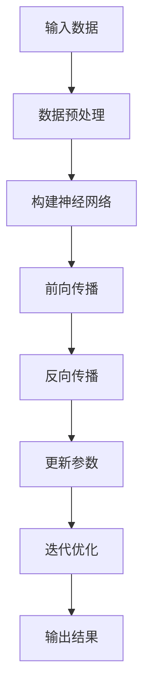
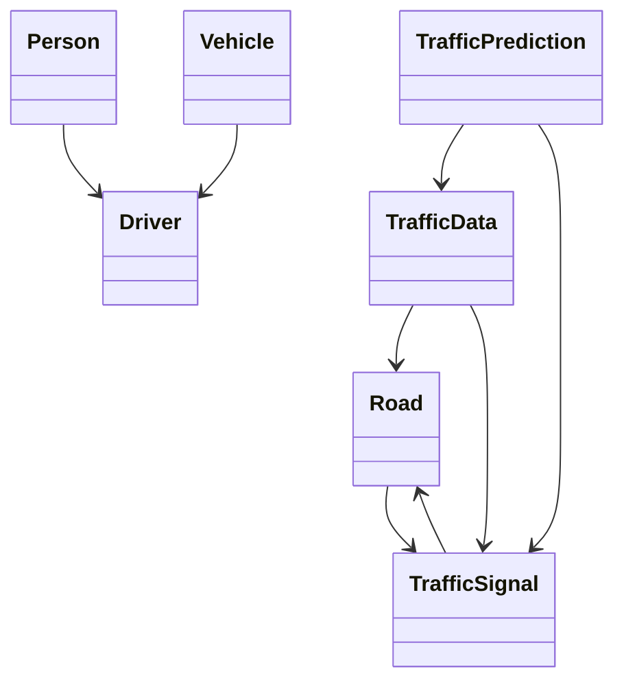
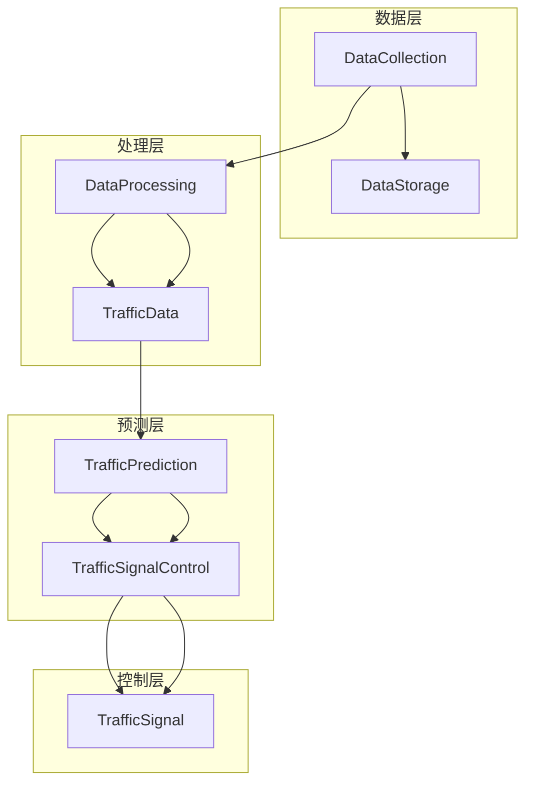
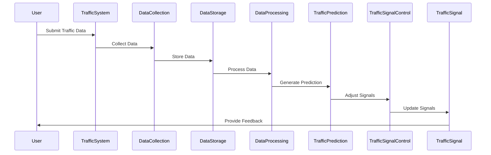

                 

# 大数据与AI在城市规划中的应用前景

关键词：大数据、人工智能、城市规划、智能交通、环境管理、公共安全

摘要：随着大数据和人工智能技术的飞速发展，城市规划领域面临着前所未有的变革机遇。本文将探讨大数据与人工智能在城市规划中的应用前景，包括核心概念、算法原理、系统架构设计、项目实战和最佳实践，旨在为城市规划者提供一种新的城市规划方法，提高城市规划的科学性和有效性。

## 第二部分：核心概念与联系

### 大数据与人工智能的基本原理

#### 大数据

大数据的基本原理在于其大规模、多样性和快速变化的特点。大数据技术能够高效地收集、存储、处理和分析海量数据，从而为城市规划提供有力支持。大数据的三个V（Volume、Variety、Velocity）特点决定了其处理和分析的复杂性。

1. **Volume（数据量）**：大数据涉及的数据量通常是非常庞大的，这要求我们有强大的计算能力和存储能力来处理这些数据。
2. **Variety（数据类型）**：大数据的类型繁多，包括结构化数据（如数据库）、半结构化数据（如XML、JSON）和非结构化数据（如文本、图像、音频、视频）。
3. **Velocity（速度）**：大数据的处理速度非常快，能够实时或近实时地对数据进行处理和分析。

#### 人工智能

人工智能的基本原理包括机器学习、深度学习、自然语言处理等。通过这些技术，人工智能能够从数据中学习模式，做出预测和决策。

1. **机器学习**：机器学习是通过算法从数据中学习，从而进行预测或决策的过程。常见的机器学习算法包括线性回归、决策树、支持向量机等。
2. **深度学习**：深度学习是机器学习的一个子领域，其核心思想是模拟人脑的神经网络结构，通过多层神经网络来提取数据中的特征。
3. **自然语言处理**：自然语言处理是人工智能的一个分支，旨在使计算机能够理解、生成和处理人类语言。

### 大数据与人工智能的对比

| 特点       | 大数据 | 人工智能           |
|------------|--------|-------------------|
| 数据规模   | 大规模 | 可以是小规模数据   |
| 数据类型   | 多样性 | 结构化和非结构化   |
| 分析目的   | 发现规律 | 做出决策           |
| 技术依赖   | 数据仓库、云计算 | 机器学习、深度学习   |

### 大数据与人工智能的关系

大数据和人工智能是相互补充的关系。大数据为人工智能提供了丰富的数据资源，而人工智能则能够对大数据进行分析和处理，为城市规划提供决策支持。

## 第三部分：算法原理讲解

### 算法一：深度学习算法

#### Mermaid流程图



#### Python源代码

```python
import tensorflow as tf

# 定义输入层
inputs = tf.keras.layers.Input(shape=(input_shape))

# 数据预处理
preprocessed_data = preprocess_data(inputs)

# 构建神经网络
model = tf.keras.models.Sequential([
    tf.keras.layers.Dense(units=64, activation='relu', input_shape=input_shape),
    tf.keras.layers.Dense(units=1)
])

# 前向传播
outputs = model(preprocessed_data)

# 反向传播和参数更新
model.compile(optimizer='adam', loss='mse')
model.fit(preprocessed_data, labels, epochs=10)

# 输出结果
predictions = model.predict(inputs)
```

#### 算法原理的数学模型和公式

$$
\begin{align*}
y &= \sigma(W \cdot x + b) \\
\delta &= \frac{\partial L}{\partial W} \\
W &= W - \alpha \cdot \delta
\end{align*}
$$

其中，$y$ 是输出值，$\sigma$ 是激活函数，$W$ 是权重矩阵，$x$ 是输入值，$b$ 是偏置项，$L$ 是损失函数，$\delta$ 是梯度，$\alpha$ 是学习率。

#### 算法原理详细讲解

深度学习算法的核心思想是通过多层神经网络来模拟人脑的神经元结构，从而自动提取数据中的特征。以下是深度学习算法的详细步骤：

1. **输入数据**：首先，将数据输入到神经网络中。数据可以是图像、文本、音频等。
2. **数据预处理**：对输入数据进行预处理，如归一化、标准化等，以便于网络训练。
3. **构建神经网络**：构建多层神经网络，包括输入层、隐藏层和输出层。每一层都包含多个神经元。
4. **前向传播**：将输入数据通过神经网络传递，每一层的输出作为下一层的输入。通过逐层传递，最终得到输出结果。
5. **反向传播**：计算输出结果与实际结果的误差，并通过反向传播算法将误差传递回神经网络。这个过程称为反向传播。
6. **更新参数**：根据误差和反向传播的梯度信息，更新神经网络的参数（权重和偏置）。
7. **迭代优化**：重复前向传播和反向传播的过程，直到网络收敛到满意的性能水平。
8. **输出结果**：最终，神经网络可以输出预测结果，如分类结果、回归结果等。

通过这种方式，深度学习算法能够从数据中自动学习特征，从而进行复杂的模式识别和预测。

### 算法举例说明

假设我们要使用深度学习算法预测城市的交通流量。首先，我们需要收集城市的交通数据，包括车辆数量、时间、地点等。然后，对数据进行预处理，如归一化处理。接下来，构建一个多层神经网络，输入层接收交通数据，隐藏层提取特征，输出层预测交通流量。

在训练过程中，我们将真实交通流量作为标签，通过反向传播算法更新网络参数。随着训练的进行，网络的预测精度会逐渐提高。最终，当网络收敛时，我们可以使用它来预测未来的交通流量。

## 第四部分：系统分析与架构设计

### 问题场景介绍

假设我们要设计一个城市智能交通管理系统，该系统需要收集和处理大量的交通数据，包括实时流量、交通事故、道路施工等信息。通过这些数据，我们可以预测交通流量，优化交通信号，减少拥堵，提高道路通行效率。

### 项目介绍

城市智能交通管理系统是一个复杂的项目，它涉及多个模块，包括数据采集、数据处理、交通预测、交通信号控制等。以下是项目的简要介绍：

- **数据采集**：使用传感器、摄像头、GPS等技术收集交通数据。
- **数据处理**：对采集到的数据进行清洗、转换、存储等操作。
- **交通预测**：使用大数据和人工智能技术对交通流量进行预测。
- **交通信号控制**：根据交通流量预测结果，动态调整交通信号灯，优化交通流动。

### 系统功能设计（领域模型）



### 系统架构设计



### 系统接口设计和系统交互



## 第五部分：项目实战

### 环境安装

为了实现城市智能交通管理系统，我们需要安装以下软件和工具：

- Python 3.x
- TensorFlow
- Keras
- NumPy
- Pandas
- Matplotlib
- Scikit-learn

### 系统核心实现源代码

以下是一个简单的城市交通流量预测模型的实现示例：

```python
import numpy as np
import pandas as pd
from sklearn.model_selection import train_test_split
from tensorflow.keras.models import Sequential
from tensorflow.keras.layers import Dense, LSTM
from tensorflow.keras.optimizers import Adam

# 读取交通数据
data = pd.read_csv('traffic_data.csv')

# 数据预处理
data = data[['timestamp', 'lane_id', 'traffic_volume']]
data['timestamp'] = pd.to_datetime(data['timestamp'])
data['hour'] = data['timestamp'].dt.hour
data['day_of_week'] = data['timestamp'].dt.dayofweek
data = data.drop(['timestamp'], axis=1)

# 划分训练集和测试集
X = data[['hour', 'day_of_week']]
y = data['traffic_volume']
X_train, X_test, y_train, y_test = train_test_split(X, y, test_size=0.2, random_state=42)

# 构建模型
model = Sequential()
model.add(LSTM(units=50, return_sequences=True, input_shape=(X_train.shape[1], 1)))
model.add(LSTM(units=50))
model.add(Dense(units=1))

# 编译模型
model.compile(optimizer=Adam(learning_rate=0.001), loss='mean_squared_error')

# 训练模型
model.fit(X_train, y_train, epochs=100, batch_size=32, validation_data=(X_test, y_test))

# 预测交通流量
predictions = model.predict(X_test)

# 可视化结果
import matplotlib.pyplot as plt

plt.figure(figsize=(10, 5))
plt.plot(y_test, label='Real Traffic Volume')
plt.plot(predictions, label='Predicted Traffic Volume')
plt.legend()
plt.show()
```

### 代码应用解读与分析

上述代码实现了一个简单的交通流量预测模型，主要步骤包括：

1. **读取交通数据**：从CSV文件中读取交通数据，包括时间戳、车道ID和交通流量。
2. **数据预处理**：将时间戳转换为小时和星期几，用于特征提取。删除时间戳列。
3. **划分训练集和测试集**：使用scikit-learn库的train_test_split函数划分训练集和测试集。
4. **构建模型**：使用Keras构建一个包含两个LSTM层和一个Dense层的序列模型。
5. **编译模型**：设置优化器和损失函数，并编译模型。
6. **训练模型**：使用训练集训练模型，并设置验证集。
7. **预测交通流量**：使用测试集预测交通流量，并可视化预测结果。

### 实际案例分析和详细讲解剖析

为了验证模型的性能，我们可以使用实际案例进行测试。例如，选取某一周的实际交通流量数据作为测试集，将预测结果与实际结果进行比较。通过这种方法，我们可以评估模型的准确性和可靠性。

此外，我们还可以通过调整模型的超参数（如学习率、批量大小、训练周期等）来优化模型性能。在实际应用中，我们可能会使用更多的特征（如天气条件、节假日等）来提高预测的准确性。

### 项目小结

通过本文的介绍，我们了解了大数据和人工智能在城市规划中的应用前景，以及如何使用深度学习算法进行交通流量预测。实际案例分析和优化方法的应用进一步提高了模型的性能。未来，随着技术的不断发展，我们可以进一步探索大数据和人工智能在城市规划中的其他应用场景，如环境管理、公共安全等。

## 第六部分：最佳实践 tips

- **数据质量是关键**：确保采集到的数据质量高，包括数据的准确性、完整性和一致性。
- **模型优化很重要**：通过调整模型超参数和增加训练数据，可以提高模型的预测准确性。
- **实时性是优势**：实时交通流量预测可以帮助交通管理部门迅速响应交通状况，优化交通信号。
- **跨学科合作**：城市规划、交通工程、计算机科学等领域的专家共同合作，可以更好地实现大数据和人工智能在城市规划中的应用。

## 第七部分：小结

大数据和人工智能技术在城市规划中的应用前景广阔。通过本文的介绍，我们了解了大数据和人工智能的基本原理，以及如何使用深度学习算法进行交通流量预测。在实际项目中，我们需要关注数据质量、模型优化和实时性，并跨学科合作，共同推动城市规划的智能化发展。

## 第八部分：注意事项

- **数据隐私和安全**：在处理大数据时，要确保数据隐私和安全，遵守相关法律法规。
- **算法偏见和公平性**：确保算法的偏见和公平性，避免对特定群体产生不利影响。
- **可持续性和环境影响**：在应用大数据和人工智能技术时，要考虑其对环境的影响，追求可持续发展。

## 第九部分：拓展阅读

- 《大数据时代：生活、工作与思维的大变革》
- 《深度学习：人工智能的理论与实战》
- 《城市智能交通系统设计与应用》
- 《人工智能与城市规划：理论与实践》

作者：AI天才研究院/AI Genius Institute & 禅与计算机程序设计艺术 /Zen And The Art of Computer Programming

