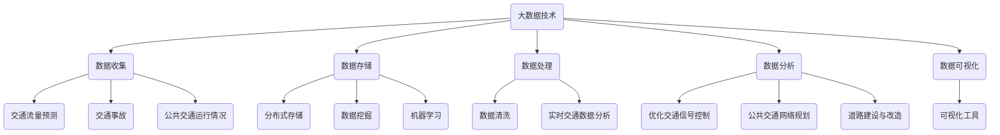
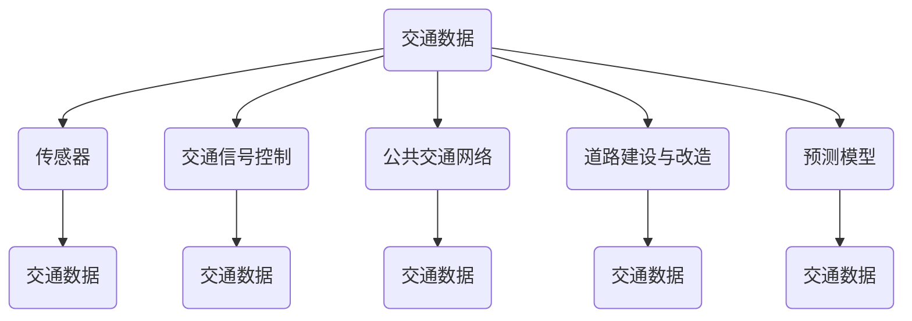

                 

### Step 1: 书籍背景介绍

# 第一部分: 大数据在交通规划中的应用背景

## 第1章: 大数据时代的到来

### 1.1.1 问题背景

随着城市化进程的加快，城市交通拥堵问题日益严重。据统计，全球城市交通拥堵造成的经济损失已达到数千亿美元。因此，如何通过大数据技术优化城市交通规划，提高交通效率成为当前城市交通管理的重要课题。

### 1.1.2 问题描述

城市交通规划需要处理的数据量庞大且复杂，包括但不限于交通流量、交通事故、公共交通运行情况等。这些数据不仅种类繁多，而且实时性要求高，给传统的交通规划方法带来了巨大挑战。

### 1.1.3 问题解决

大数据技术以其强大的数据处理和分析能力，为城市交通规划提供了新的解决思路。通过对海量交通数据的收集、存储、处理和分析，可以更准确地预测交通流量，识别交通瓶颈，优化交通信号控制和公共交通路线，从而提高城市交通效率。

### 1.1.4 边界与外延

本书将重点探讨大数据技术在城市交通规划中的应用，包括数据收集与处理、交通流量预测、交通信号控制优化、公共交通网络规划等方面。同时，本书也将讨论大数据技术在其他领域（如城市规划、环境保护等）的潜在应用。

### 1.1.5 概念结构与核心要素组成

- **大数据技术**：包括数据收集、存储、处理、分析和可视化等关键技术。
- **交通数据**：包括交通流量、交通事故、公共交通运行情况等。
- **交通规划**：包括交通信号控制优化、公共交通网络规划、道路建设与改造等。
- **交通效率**：通过优化交通网络和交通信号控制，提高交通运行效率，减少交通拥堵。

## 第2章: 大数据与交通规划的核心概念

### 2.1.1 大数据技术

- **数据收集**：通过各种传感器、摄像头、移动设备等收集交通数据。
- **数据存储**：利用分布式存储技术（如Hadoop、NoSQL等）存储海量交通数据。
- **数据处理**：利用数据清洗、数据挖掘、机器学习等技术处理交通数据。
- **数据分析**：通过对交通数据的分析，提取有用信息和知识。
- **数据可视化**：将分析结果通过可视化工具（如Dash、Tableau等）呈现，帮助决策者直观理解数据。

### 2.1.2 交通规划

- **交通流量预测**：利用历史交通数据，预测未来的交通流量，为交通信号控制和公共交通规划提供依据。
- **交通信号控制优化**：通过实时交通数据分析，优化交通信号配时，减少交通拥堵。
- **公共交通网络规划**：根据居民出行需求和交通流量，优化公共交通路线和站点设置。
- **道路建设与改造**：基于交通流量预测和公共交通规划，优化道路网络布局。

### 2.1.3 概念属性特征对比表格

| 概念       | 特征                                     |
|------------|----------------------------------------|
| 大数据技术 | 海量、多样、高速、真实                             |
| 交通数据   | 实时、动态、多源、复杂                             |
| 交通规划   | 科学、系统、动态、可持续                           |

### 2.1.4 ER实体关系图架构

### 2.1.5 交通规划与传统交通规划的对比

| 方面       | 交通规划             | 传统交通规划             |
|------------|---------------------|---------------------|
| 数据依赖   | 强依赖大数据技术，处理海量数据 | 依赖有限的统计数据，对交通状况理解有限 |
| 实时性     | 实时性高，支持动态调整     | 实时性较差，难以快速响应交通状况变化 |

---

**摘要：** 本书深入探讨大数据技术在城市交通规划中的应用，包括数据收集与处理、交通流量预测、交通信号控制优化、公共交通网络规划等方面。通过分析海量交通数据，可以更准确地预测交通流量，优化交通信号控制，提高公共交通网络规划的科学性和动态性，从而有效缓解城市交通拥堵问题，提高交通效率。同时，本书还将讨论大数据技术在其他领域（如城市规划、环境保护等）的潜在应用，为城市交通管理提供新的思路和方法。

---

在接下来的章节中，我们将逐步深入探讨大数据技术在交通规划中的具体应用，包括数据收集与处理、交通流量预测、交通信号控制优化、公共交通网络规划等方面的关键技术，以及如何将这些技术应用于实际项目中，以解决城市交通拥堵问题，提高城市交通效率。

---

**关键词：** 大数据，交通规划，交通流量预测，交通信号控制，公共交通网络规划，城市交通拥堵。

---

接下来，我们将正式进入大数据与交通规划的详细探讨，首先从大数据时代的到来开始，了解这一领域的发展背景、问题和解决思路。

## 第1章: 大数据时代的到来

### 1.1.1 问题背景

城市交通拥堵问题一直是全球许多大城市面临的严峻挑战。根据国际运输论坛（ITF）的数据，全球城市交通拥堵造成的经济损失每年已达到数千亿美元，这不仅影响了居民的日常生活质量，还严重制约了城市的经济和社会发展。传统的城市交通规划方法主要依赖于历史统计数据和经验分析，但这些方法在面对日益复杂和动态的城市交通环境时，往往显得力不从心。因此，寻找新的解决思路和方法成为了当务之急。

### 1.1.2 问题描述

城市交通规划涉及的变量和因素众多，包括交通流量、交通事故、公共交通运行情况、道路建设状况等。这些数据种类繁多、来源广泛，且实时性要求高。传统的交通规划方法依赖于有限的统计数据，对交通状况的理解往往是静态的、片面的，难以及时响应交通环境的变化。此外，随着城市化进程的加快，城市交通数据量呈指数级增长，传统的数据处理方法已经难以胜任。

### 1.1.3 问题解决

大数据技术的兴起为城市交通规划带来了新的希望。大数据技术以其强大的数据处理和分析能力，可以从海量、多样、高速、真实的交通数据中提取有价值的信息，为交通流量预测、交通信号控制优化、公共交通网络规划等提供科学依据。通过实时数据收集、存储、处理和分析，大数据技术能够动态地反映城市交通状况，及时识别交通瓶颈，优化交通资源配置，从而提高城市交通效率。

### 1.1.4 边界与外延

本书将围绕大数据技术在城市交通规划中的应用进行深入探讨，具体包括以下几个方面：

1. **数据收集与处理**：介绍如何通过传感器、摄像头、移动设备等收集交通数据，以及如何利用分布式存储技术和数据处理算法处理海量数据。
2. **交通流量预测**：利用历史数据和实时数据，通过机器学习和数据挖掘技术预测未来的交通流量，为交通信号控制和公共交通规划提供依据。
3. **交通信号控制优化**：通过实时交通数据分析，优化交通信号配时，减少交通拥堵，提高交通运行效率。
4. **公共交通网络规划**：根据居民出行需求和交通流量，优化公共交通路线和站点设置，提高公共交通系统的服务质量和效率。
5. **道路建设与改造**：基于交通流量预测和公共交通规划，优化道路网络布局，提高道路通行能力。

同时，本书还将讨论大数据技术在城市规划、环境保护等其他领域的潜在应用，以展示大数据技术的广泛应用和巨大潜力。

### 1.1.5 概念结构与核心要素组成

为了更好地理解大数据技术在交通规划中的应用，我们需要明确以下几个核心概念和要素：

- **大数据技术**：包括数据收集、存储、处理、分析和可视化等关键技术。
- **交通数据**：包括交通流量、交通事故、公共交通运行情况等。
- **交通规划**：包括交通信号控制优化、公共交通网络规划、道路建设与改造等。
- **交通效率**：通过优化交通网络和交通信号控制，提高交通运行效率，减少交通拥堵。

这些概念和要素相互关联，共同构成了大数据技术在交通规划中的核心框架。在接下来的章节中，我们将逐一深入探讨这些概念和要素的具体实现和应用。

### 2.1.1 大数据技术

大数据技术的核心在于其强大的数据处理和分析能力，能够从海量、多样、高速、真实的交通数据中提取有价值的信息，为交通规划提供科学依据。下面，我们将详细介绍大数据技术的五个关键组成部分：数据收集、数据存储、数据处理、数据分析和数据可视化。

#### 2.1.1.1 数据收集

数据收集是大数据技术的第一步，也是基础。城市交通数据来源广泛，包括但不限于以下几种：

1. **传感器数据**：交通信号灯、摄像头、地磁传感器、交通流量传感器等，可以实时监测交通流量、车辆速度、道路占有率等。
2. **移动设备数据**：智能手机、车载设备、移动应用等，通过GPS和移动网络技术收集车辆的实时位置和行驶轨迹。
3. **交通管理部门数据**：公安交通管理局、交通运输部门等，通过电子警察系统、交通事故记录、车辆登记信息等获取交通相关数据。
4. **公众上报数据**：通过社交媒体、热线电话等方式，收集市民上报的交通拥堵、事故等信息。

这些数据源的多样性和广泛性，为交通数据的全面收集提供了保障。

#### 2.1.1.2 数据存储

随着交通数据的快速增长，传统的集中式存储方式已经无法满足需求。大数据技术采用分布式存储技术，如Hadoop、NoSQL等，能够高效地存储和管理海量数据。分布式存储的特点包括：

1. **高扩展性**：可以根据需求动态扩展存储容量，适应数据量的增长。
2. **高可靠性**：通过数据复制和备份机制，确保数据的安全性和可用性。
3. **高性能**：通过分布式计算和存储，实现数据的快速读写和检索。

这些特点使得分布式存储成为大数据技术的核心组件。

#### 2.1.1.3 数据处理

数据处理是大数据技术的关键环节，包括数据清洗、数据转换、数据融合等。数据处理的主要目的是将原始数据进行处理，使其变得有序、干净和有用。

1. **数据清洗**：去除重复数据、缺失数据和错误数据，保证数据质量。
2. **数据转换**：将不同格式和来源的数据转换为统一的格式，方便后续处理和分析。
3. **数据融合**：将来自多个源的数据进行合并，形成完整的交通数据集。

数据处理技术的先进性和高效性，使得大数据技术能够处理复杂和多样化的交通数据。

#### 2.1.1.4 数据分析

数据分析是大数据技术的核心应用，通过对交通数据的分析，提取有价值的信息，为交通规划提供决策支持。数据分析的方法和技术包括：

1. **统计分析**：通过对历史数据的统计分析，识别交通模式、趋势和异常。
2. **数据挖掘**：利用机器学习和人工智能技术，从大量数据中发现潜在的规律和关联。
3. **实时分析**：通过对实时数据的分析，动态调整交通信号配时、公共交通路线等。

数据分析技术的多样性和深度，使得大数据技术能够提供精准和实时的交通信息。

#### 2.1.1.5 数据可视化

数据可视化是将分析结果以图形、图表、地图等形式呈现，帮助决策者和公众直观理解交通数据。数据可视化的优点包括：

1. **易于理解**：通过视觉化手段，将复杂的数据转化为简单、直观的图形，便于理解和分析。
2. **发现趋势**：通过可视化分析，可以更快速地发现数据中的趋势和异常。
3. **支持决策**：通过可视化结果，为决策者提供科学依据，支持交通规划和管理。

数据可视化技术的直观性和实用性，使得大数据技术在交通规划中得到了广泛应用。

综上所述，大数据技术通过数据收集、存储、处理、分析和可视化五个环节，实现了对海量交通数据的全面管理和深入分析，为交通规划提供了科学依据和决策支持。在接下来的章节中，我们将进一步探讨大数据技术在交通流量预测、交通信号控制优化、公共交通网络规划等方面的具体应用。

### 2.1.2 交通规划

交通规划是城市交通管理的重要组成部分，旨在通过科学的规划和管理，优化交通网络布局和交通资源配置，提高交通运行效率和安全性。在现代社会，交通规划面临着日益复杂和多样化的挑战，传统的方法和理论已难以满足需求。大数据技术的兴起为交通规划带来了全新的机遇和思路。下面，我们将详细探讨大数据技术在交通规划中的核心应用，包括交通流量预测、交通信号控制优化、公共交通网络规划和道路建设与改造等方面。

#### 2.1.2.1 交通流量预测

交通流量预测是交通规划的基础环节，通过对历史数据和实时数据的分析，预测未来的交通流量，为交通信号控制和公共交通规划提供依据。大数据技术在交通流量预测中的应用主要包括以下几个方面：

1. **数据收集**：利用传感器、摄像头、移动设备等收集交通流量数据，包括车辆速度、流量、占有率等。
2. **数据处理**：通过数据清洗、数据转换和数据融合等技术，处理和整合各种来源的交通数据，形成统一的数据集。
3. **模型构建**：利用机器学习和数据挖掘技术，构建交通流量预测模型，包括时间序列模型、回归模型、神经网络模型等。
4. **模型训练与优化**：利用历史数据训练预测模型，并通过交叉验证和模型评估等方法，优化模型参数和性能。

通过交通流量预测，交通管理部门可以提前了解未来交通状况，合理安排交通资源，降低交通拥堵风险。

#### 2.1.2.2 交通信号控制优化

交通信号控制是城市交通管理的关键环节，通过优化交通信号配时，提高道路通行效率和减少交通拥堵。大数据技术在交通信号控制优化中的应用主要包括以下几个方面：

1. **数据收集**：利用交通信号灯、摄像头、传感器等设备，实时收集交通流量和车辆信息。
2. **信号配时优化**：利用优化算法（如动态规划、遗传算法等）和机器学习技术，根据实时交通数据，动态调整交通信号配时，提高道路通行效率。
3. **信号协调**：通过分析道路网络结构和交通流量，实现交通信号的协调控制，减少交叉路口的排队和延误。
4. **模型评估与反馈**：利用评估指标（如通行时间、延误时间等）评估信号优化效果，并根据反馈结果不断调整和优化信号配时。

通过交通信号控制优化，可以显著提高道路通行效率，减少交通拥堵和排放污染。

#### 2.1.2.3 公共交通网络规划

公共交通网络规划是城市交通规划的重要组成部分，旨在优化公共交通路线、站点设置和服务质量。大数据技术在公共交通网络规划中的应用主要包括以下几个方面：

1. **需求分析**：通过分析居民出行需求、交通流量等数据，确定公共交通线路和站点设置。
2. **线路规划**：利用优化算法（如最小生成树、最短路径算法等）和机器学习技术，规划公共交通线路，提高线路覆盖率和便捷性。
3. **站点优化**：通过分析乘客流量、道路状况等数据，优化公共交通站点设置，提高换乘便捷性和安全性。
4. **服务质量评估**：利用乘客满意度、准时率等指标，评估公共交通服务质量，并提出改进措施。

通过公共交通网络规划，可以更好地满足居民出行需求，提高公共交通系统的效率和吸引力。

#### 2.1.2.4 道路建设与改造

道路建设与改造是城市交通规划的重要环节，旨在提高道路通行能力和交通安全性。大数据技术在道路建设与改造中的应用主要包括以下几个方面：

1. **需求分析**：通过分析交通流量、交通事故等数据，确定道路建设与改造的需求和优先级。
2. **方案设计**：利用仿真技术和优化算法，设计道路建设与改造的方案，包括道路拓宽、道路改造、交叉口优化等。
3. **成本评估**：通过分析成本、效益等数据，评估不同建设与改造方案的经济性和可行性。
4. **风险评估**：通过分析交通事故、交通拥堵等数据，评估道路建设与改造的风险和影响，并提出风险应对措施。

通过道路建设与改造，可以显著提高道路通行能力和交通安全性，改善城市交通环境。

综上所述，大数据技术在交通规划中的应用涵盖了交通流量预测、交通信号控制优化、公共交通网络规划和道路建设与改造等多个方面，通过数据收集、处理、分析和优化，为交通规划提供了科学依据和决策支持，提高了城市交通效率和安全性。在接下来的章节中，我们将进一步探讨大数据技术在交通规划中的具体应用案例和实现方法。

### 2.1.3 概念属性特征对比表格

在探讨大数据技术、交通数据、交通规划这三个核心概念时，我们有必要对它们的属性特征进行详细对比，以便更好地理解它们之间的关系和作用。以下是这三个概念的主要属性特征对比表格：

| 概念       | 特征                                     |
|------------|----------------------------------------|
| **大数据技术** | 海量、多样、高速、真实、分布式、可扩展、实时性 |
| **交通数据**   | 实时、动态、多源、复杂、异构、高度相关、多模态 |
| **交通规划**   | 科学、系统、动态、可持续、优化、决策支持、执行性 |

#### 概念与特征说明

- **大数据技术**：大数据技术的核心在于其处理海量、多样、高速、真实数据的强大能力。它依赖于分布式存储和计算，能够高效地管理海量数据，并从中提取有价值的信息。此外，大数据技术具备实时性，能够动态地响应交通环境的变化，支持交通信号的实时调整和优化。

- **交通数据**：交通数据具有实时性、动态性、多源性和复杂性。这些数据来源于交通传感器、摄像头、移动设备等多种渠道，涵盖交通流量、车辆速度、事故发生、公共交通运行情况等多个方面。交通数据的异构性和高度相关性，使得其对交通状况的描述更加全面和准确。

- **交通规划**：交通规划是一个科学、系统、动态、可持续的过程。它依赖于大数据技术提供的实时交通数据和分析结果，通过优化交通网络、信号控制、公共交通路线等，实现交通资源的科学配置和高效利用。交通规划的目标是提高交通运行效率、减少拥堵、保障交通安全。

#### 对比分析

通过对比大数据技术、交通数据和交通规划的属性特征，我们可以发现：

- **数据依赖**：大数据技术为交通数据提供了高效、可靠的收集、存储和处理手段，使得交通规划能够基于真实、全面的交通数据做出科学决策。

- **实时性**：交通规划需要实时交通数据作为决策依据，而大数据技术能够实时收集、处理和分析交通数据，支持动态调整和优化。

- **科学性**：大数据技术提供的分析和预测工具，使交通规划更加科学、系统，能够更好地应对复杂和动态的交通环境。

- **可持续性**：通过大数据技术优化交通规划，可以实现交通资源的可持续利用，减少交通拥堵和排放污染，提高城市交通环境的可持续性。

#### 总结

大数据技术、交通数据和交通规划是相互关联、相互支持的核心概念。大数据技术提供了强大的数据处理和分析能力，交通数据为交通规划提供了真实、全面的依据，而交通规划则通过科学、系统的管理，实现交通资源的优化配置，提高城市交通效率和安全性。通过对比分析这些概念的属性特征，我们可以更深入地理解它们在交通规划中的重要作用和相互关系。

### 2.1.4 ER实体关系图架构

为了更直观地展示大数据技术在交通规划中的应用架构，我们采用实体关系图（Entity-Relationship Diagram, ER图）来描述各实体及其之间的关系。以下是交通规划中涉及的主要实体和它们之间的关系：

#### 实体定义

1. **交通数据（Traffic Data）**：包括交通流量、车辆速度、事故记录、公共交通运行数据等。
2. **传感器（Sensor）**：用于实时监测交通状况的设备，如摄像头、地磁传感器、交通流量传感器等。
3. **交通信号控制（Traffic Signal Control）**：用于管理和控制交通信号灯的机制。
4. **公共交通网络（Public Transportation Network）**：包括公交路线、站点、车辆等。
5. **道路建设与改造（Road Construction & Improvement）**：涉及道路建设、道路改造、交叉口优化等。
6. **预测模型（Prediction Model）**：用于预测交通流量、公共交通需求等。

#### 关系描述

1. **传感器与交通数据**：传感器是交通数据的主要来源，每个传感器产生的数据与交通数据实体之间存在一对多的关系。
2. **交通信号控制与交通数据**：交通信号控制基于交通数据进行优化，两者之间存在一对多的关系。
3. **公共交通网络与交通数据**：公共交通网络规划依赖于交通数据分析结果，两者之间存在一对多的关系。
4. **道路建设与改造与交通数据**：道路建设与改造方案基于交通流量预测和需求分析，两者之间存在一对多的关系。
5. **预测模型与交通数据**：预测模型利用历史交通数据进行训练，两者之间存在一对多的关系。

以下是ER图的具体表示：

#### 说明

1. **交通数据** 是核心实体，连接了传感器、交通信号控制、公共交通网络、道路建设与改造和预测模型等，体现了大数据技术在交通规划中的关键作用。
2. **传感器** 通过实时收集交通数据，为后续的数据处理和分析提供基础。
3. **交通信号控制** 和 **公共交通网络** 基于 **交通数据** 进行优化和规划，以提高交通运行效率和服务质量。
4. **道路建设与改造** 结合交通流量预测和需求分析，优化道路网络布局，提高道路通行能力。
5. **预测模型** 利用历史 **交通数据** 进行训练，用于预测未来的交通状况，支持动态调整和优化。

通过ER图，我们可以清晰地看到大数据技术在交通规划中的应用架构，以及各实体之间的相互关系。这有助于我们更好地理解和实施大数据技术在交通规划中的应用。

### 2.1.5 交通规划与传统交通规划的对比

交通规划是城市规划的重要组成部分，旨在通过科学的交通规划和管理，优化交通网络布局、提升交通效率、保障交通安全，从而满足不断增长的社会出行需求。随着技术的发展，传统交通规划逐渐向智能化和大数据化方向发展。在这里，我们将对比分析传统交通规划与大数据驱动的交通规划在几个关键方面的差异。

#### 1. 数据依赖

- **传统交通规划**：主要依赖于有限的统计数据，如历史交通流量数据、人口普查数据等。这些数据往往来源于定期的交通调查、交通流量监测等，数据更新周期较长，难以反映实时交通状况的变化。
  
- **大数据驱动的交通规划**：高度依赖于实时、动态、多样化的交通数据。这些数据来源于传感器、移动设备、社交媒体等多个渠道，包括交通流量、车辆速度、交通事故、公共交通运行情况等。通过实时数据的收集和分析，可以动态调整交通信号控制和公共交通服务，实现更精准的规划和管理。

#### 2. 实时性

- **传统交通规划**：由于数据更新周期较长，交通规划的调整和优化往往滞后于实际交通状况的变化。这可能导致在交通高峰期无法及时响应交通拥堵问题，从而加剧交通拥堵。

- **大数据驱动的交通规划**：具备高度实时性，可以实时收集和处理交通数据，快速识别交通瓶颈和异常状况，并采取相应的优化措施。例如，通过实时交通数据分析，动态调整交通信号配时，优化公共交通线路，从而有效缓解交通拥堵。

#### 3. 精准性

- **传统交通规划**：主要依赖于经验和统计数据，难以全面、准确地反映复杂的交通状况。这种情况下，规划方案可能存在偏差，难以达到预期的效果。

- **大数据驱动的交通规划**：通过大数据技术，可以对海量交通数据进行分析，识别交通模式、趋势和异常。借助机器学习和数据挖掘技术，可以建立精确的预测模型，为交通规划提供科学的依据，提高规划的精准性。

#### 4. 可持续性

- **传统交通规划**：往往注重短期效益，如快速解决交通拥堵问题，而忽视长期环境和社会影响。这种规划可能导致交通设施的不合理布局，增加碳排放和交通污染。

- **大数据驱动的交通规划**：在规划过程中考虑了更多的环境和社会因素，通过优化交通网络和交通信号控制，减少交通拥堵和排放污染，实现交通系统的可持续发展。大数据技术还可以帮助评估规划方案的环境和社会影响，为决策提供依据。

#### 5. 决策支持

- **传统交通规划**：决策过程主要依赖于专家经验和规划模型，缺乏数据驱动的支持。这可能导致规划方案的不完善，难以满足实际需求。

- **大数据驱动的交通规划**：通过数据分析和可视化技术，为决策者提供丰富的数据支持和直观的展示。大数据技术可以帮助决策者更全面、深入地理解交通状况，制定更加科学和有效的规划方案。

#### 总结

传统交通规划与大数据驱动的交通规划在数据依赖、实时性、精准性、可持续性和决策支持等方面存在显著差异。大数据驱动的交通规划利用实时、动态、多样化的交通数据，通过数据分析和优化算法，实现更精准、高效的交通规划和管理。在未来的交通规划中，大数据技术将成为不可或缺的工具，为城市交通系统的可持续发展提供有力支持。通过对比分析，我们可以看到大数据技术在交通规划中的重要地位和潜力，为解决城市交通问题提供了新的思路和方法。

## 第3章: 大数据技术在交通流量预测中的应用

### 3.1.1 交通流量预测的重要性

交通流量预测是城市交通规划和管理的重要环节，其准确性和实时性对缓解交通拥堵、优化交通资源配置具有关键作用。通过预测交通流量，交通管理部门可以提前了解未来交通状况，制定合理的交通控制策略，提高交通系统的运行效率和安全性。此外，交通流量预测也为公共交通规划和道路建设提供了科学依据，有助于提升交通服务的质量和效率。

### 3.1.2 数据收集

交通流量预测依赖于海量、多样化的交通数据。这些数据来源于多种渠道，包括：

1. **传感器数据**：如交通流量传感器、摄像头、地磁传感器等，可以实时监测道路上的车辆流量、速度和占有率。
2. **移动设备数据**：如智能手机、车载设备等，通过GPS和移动网络技术收集车辆的实时位置和行驶轨迹。
3. **公共交通数据**：如公交车和地铁的运行数据，可以提供公共交通系统的运行情况和乘客流量。
4. **交通管理部门数据**：如公安交通管理局、交通运输部门等，通过电子警察系统、交通事故记录、车辆登记信息等获取交通相关数据。
5. **公众上报数据**：如社交媒体、热线电话等，收集市民上报的交通拥堵、事故等信息。

这些数据来源的多样性和广泛性，为交通流量预测提供了丰富的数据支持。

### 3.1.3 数据处理

数据处理是交通流量预测的关键环节，其主要任务是清洗、整合和转换各种来源的交通数据，形成统一的数据集，以便后续分析和建模。数据处理主要包括以下几个步骤：

1. **数据清洗**：去除重复数据、缺失数据和错误数据，确保数据质量。例如，去除同一时间点多个传感器记录的相同数据，填补缺失的数据，修正错误的数据。
2. **数据整合**：将来自多个源的数据进行整合，形成完整的数据集。例如，将交通流量传感器数据和移动设备数据进行整合，以获得更全面的交通流量信息。
3. **数据转换**：将不同格式和来源的数据转换为统一的格式，以便后续处理和分析。例如，将原始的交通流量数据转换为标准的时间序列数据。

通过数据处理，交通数据的质量和一致性得到显著提升，为交通流量预测提供了可靠的数据基础。

### 3.1.4 交通流量预测模型

交通流量预测通常采用时间序列模型、回归模型、神经网络模型等机器学习和数据挖掘技术。以下是一些常用的交通流量预测模型：

1. **时间序列模型**：如ARIMA（自回归积分滑动平均模型）、STL（季节性分解时间序列模型）等，通过分析历史交通流量数据的时间序列特性，预测未来的交通流量。时间序列模型适用于季节性、趋势性和周期性明显的交通流量数据。
2. **回归模型**：如线性回归、多项式回归、岭回归等，通过建立交通流量与相关因素（如时间、天气、节假日等）之间的数学模型，预测未来的交通流量。回归模型适用于变量之间存在明确关系的情况。
3. **神经网络模型**：如前馈神经网络、卷积神经网络（CNN）等，通过多层神经元的非线性变换，学习历史交通流量数据中的复杂模式和关联性，预测未来的交通流量。神经网络模型适用于非线性、复杂的关系预测。

在选择模型时，需要根据交通数据的特性、预测的目标和实际需求来决定。通常，结合多种模型进行预测，可以进一步提高预测的准确性和可靠性。

### 3.1.5 实际应用案例

以下是一个实际应用案例，展示如何利用大数据技术进行交通流量预测。

#### 案例背景

某大城市交通管理部门希望通过大数据技术预测未来的交通流量，以便优化交通信号控制和公共交通规划。该城市交通数据包括：

- 交通流量传感器数据：实时监测主要道路上的车辆流量和速度。
- 气象数据：实时监测天气状况，如温度、湿度、降雨等。
- 公共交通数据：公交车和地铁的运行情况，包括车辆位置、乘客流量等。
- 历史交通数据：过去一年的交通流量数据。

#### 数据处理

1. **数据清洗**：去除重复数据、缺失数据和错误数据，确保数据质量。
2. **数据整合**：将交通流量传感器数据、气象数据、公共交通数据等进行整合，形成统一的数据集。
3. **数据转换**：将不同格式和来源的数据转换为标准的时间序列数据。

#### 模型选择

根据交通数据的特性，选择以下模型进行预测：

1. **ARIMA模型**：适用于季节性、趋势性和周期性明显的交通流量数据。
2. **线性回归模型**：结合天气状况预测交通流量。
3. **卷积神经网络（CNN）**：学习历史交通流量数据中的复杂模式和关联性。

#### 预测结果

通过模型训练和预测，得到以下结果：

- **交通流量预测**：预测未来一周的主要道路上的交通流量。
- **交通信号控制优化**：根据预测结果，动态调整交通信号配时，减少交通拥堵。
- **公共交通网络规划**：根据预测结果，优化公共交通路线和站点设置，提高服务质量和效率。

#### 实际效果

通过实际应用，该城市的交通管理部门发现：

- **交通拥堵减少**：交通信号控制优化后，主要道路的交通拥堵明显减少，车辆平均行驶速度提高。
- **公共交通服务质量提升**：公共交通网络规划优化后，乘客出行时间减少，满意度提高。
- **交通管理效率提升**：通过实时交通流量预测，交通管理部门能够更有效地应对突发交通状况，提高了交通管理效率。

#### 结论

该案例展示了大数据技术在交通流量预测中的应用效果，通过数据收集、处理和模型预测，实现了对交通流量的准确预测和优化控制，提高了城市交通效率和安全性。在未来，大数据技术将继续在交通规划和管理中发挥重要作用，为城市交通系统的可持续发展提供有力支持。

### 3.1.6 大数据技术在交通流量预测中的挑战与未来展望

尽管大数据技术在交通流量预测中取得了显著成果，但在实际应用过程中仍面临诸多挑战和问题，未来需要进一步研究和解决。

#### 挑战

1. **数据质量**：交通流量预测依赖于大量、真实、可靠的数据。然而，数据收集过程中可能会出现数据丢失、数据不一致、噪声和错误等问题，这些问题会影响预测的准确性和可靠性。
2. **数据多样性**：交通流量预测需要整合多种来源的数据，包括传感器数据、移动设备数据、公共交通数据和公众上报数据。这些数据的多样性和异构性给数据整合和建模带来了挑战。
3. **实时性**：交通流量是一个动态变化的过程，实时性要求高。如何快速、准确地处理和分析实时数据，是大数据技术在交通流量预测中的关键挑战。
4. **模型选择与优化**：交通流量预测涉及多种模型和技术，如何选择合适的模型并优化模型参数，提高预测精度，是一个亟待解决的问题。
5. **计算资源**：大数据技术需要强大的计算资源来处理和分析海量数据，特别是在实时交通流量预测中，对计算资源的需求更为迫切。

#### 未来展望

1. **数据治理**：建立完善的数据治理体系，确保数据质量，包括数据清洗、数据整合和数据标准化等。通过数据治理，提高数据的可用性和可靠性，为交通流量预测提供高质量的数据支持。
2. **多源数据融合**：研究多源数据融合技术，实现多种数据来源的整合，提高交通数据的全面性和准确性。通过数据融合，构建更全面、精确的交通数据集，为交通流量预测提供更可靠的数据基础。
3. **实时数据处理**：研究实时数据处理技术，提高数据处理速度和效率，满足实时交通流量预测的需求。通过分布式计算、并行处理等技术，实现海量数据的实时处理和分析。
4. **模型优化与定制**：研究交通流量预测的模型优化和定制方法，结合交通数据的特性和需求，选择合适的模型并优化模型参数，提高预测精度和实时性。
5. **计算资源优化**：研究计算资源优化技术，如云计算、边缘计算等，提高数据处理和分析的效率，满足大数据技术在交通流量预测中的计算需求。

未来，大数据技术将继续在交通流量预测中发挥重要作用，通过不断的技术创新和优化，实现更准确、实时、高效的交通流量预测，为城市交通规划和管理提供有力支持。

### 第4章: 大数据技术在交通信号控制优化中的应用

#### 4.1.1 交通信号控制优化的重要性

交通信号控制是城市交通管理的重要组成部分，其目的是通过科学合理地分配交通信号灯的时间，提高道路通行效率，减少交通拥堵，保障交通安全。传统的交通信号控制方法通常是基于经验公式或静态模型，无法实时调整信号配时，容易导致交通拥堵、排放污染和交通事故等问题。而大数据技术的应用，为交通信号控制优化提供了新的思路和方法，通过实时数据分析、优化算法和智能控制，实现交通信号控制的动态调整和优化，从而提高交通系统的运行效率。

#### 4.1.2 大数据技术在交通信号控制优化中的关键作用

大数据技术在交通信号控制优化中具有以下几个关键作用：

1. **实时交通数据分析**：通过传感器、摄像头、移动设备等收集实时交通数据，包括交通流量、车辆速度、交通密度等，为交通信号控制提供实时、准确的决策依据。
2. **交通模式识别**：利用机器学习和数据挖掘技术，从海量交通数据中识别出交通流量模式、高峰时段、拥堵区域等，为信号配时优化提供科学依据。
3. **动态信号配时优化**：根据实时交通数据和分析结果，动态调整交通信号灯的配时，优化道路通行效率，减少交通拥堵和排放污染。
4. **交通信号协调控制**：分析道路网络结构和交通流量，实现交通信号的协调控制，减少交叉路口的排队和延误，提高整个交通系统的运行效率。

#### 4.1.3 大数据技术在交通信号控制优化中的应用步骤

大数据技术在交通信号控制优化中的应用可以分为以下几个步骤：

1. **数据收集与处理**：通过传感器、摄像头、移动设备等收集实时交通数据，包括交通流量、车辆速度、交通密度等。利用数据清洗、数据整合和数据转换技术，处理和整合不同来源的数据，形成统一的数据集。

2. **数据预处理**：对收集到的交通数据进行分析，识别异常值、缺失值和噪声数据，并进行数据清洗和预处理。通过数据标准化和特征提取，提取出对交通信号控制优化有用的特征，如交通流量、车辆速度、交通密度等。

3. **交通模式识别**：利用机器学习和数据挖掘技术，从预处理后的交通数据中识别出交通流量模式、高峰时段、拥堵区域等。通过聚类分析、时间序列分析等方法，构建交通流量预测模型，为信号配时优化提供科学依据。

4. **动态信号配时优化**：根据交通模式识别结果和实时交通数据分析，动态调整交通信号灯的配时。利用优化算法，如动态规划、遗传算法、神经网络等，优化交通信号灯的配时，提高道路通行效率，减少交通拥堵和排放污染。

5. **交通信号协调控制**：分析道路网络结构和交通流量，实现交通信号的协调控制。通过交叉路口的信号协调控制，减少交叉路口的排队和延误，提高整个交通系统的运行效率。

6. **效果评估与反馈**：对优化后的交通信号控制效果进行评估，包括交通流量、交通延误、排放污染等指标。根据评估结果，调整和优化信号配时，实现交通信号控制的持续优化。

#### 4.1.4 实际应用案例

以下是一个实际应用案例，展示如何利用大数据技术进行交通信号控制优化。

#### 案例背景

某大城市交通管理部门希望通过大数据技术优化交通信号控制，缓解交通拥堵，提高道路通行效率。该城市交通信号控制系统包括：

- **交通流量传感器**：分布在主要道路和交叉路口，实时监测交通流量和车辆速度。
- **摄像头**：监控交叉路口的交通状况，用于识别交通拥堵和交通事故。
- **移动设备**：收集车辆的实时位置和行驶轨迹，提供额外的交通数据。

#### 数据处理

1. **数据收集**：通过交通流量传感器、摄像头和移动设备，收集实时交通数据，包括交通流量、车辆速度、交通密度等。
2. **数据整合**：将不同来源的交通数据进行整合，形成统一的数据集。

#### 动态信号配时优化

1. **交通模式识别**：利用机器学习技术，从交通数据中识别出交通流量模式、高峰时段、拥堵区域等。
2. **动态信号配时优化**：根据识别结果和实时交通数据分析，动态调整交通信号灯的配时。利用遗传算法，优化交叉路口的信号配时，提高道路通行效率。

#### 交通信号协调控制

1. **交通信号协调控制**：分析道路网络结构和交通流量，实现交通信号的协调控制。通过交叉路口的信号协调控制，减少交叉路口的排队和延误，提高整个交通系统的运行效率。

#### 效果评估与反馈

1. **效果评估**：通过交通流量、交通延误、排放污染等指标，评估交通信号控制优化后的效果。
2. **反馈调整**：根据评估结果，调整和优化信号配时，实现交通信号控制的持续优化。

#### 实际效果

通过实际应用，该城市的交通管理部门发现：

- **交通拥堵减少**：交叉路口的排队长度和延误时间显著减少，道路通行效率提高。
- **排放污染降低**：交通拥堵缓解后，车辆怠速时间减少，排放污染降低。
- **交通管理效率提升**：通过实时交通数据分析，交通管理部门能够更有效地应对突发交通状况，提高了交通管理效率。

#### 结论

该案例展示了大数据技术在交通信号控制优化中的应用效果，通过实时交通数据分析、动态信号配时优化和交通信号协调控制，实现了交通信号控制的动态调整和优化，提高了交通系统的运行效率和安全性。在未来，大数据技术将继续在交通信号控制优化中发挥重要作用，为城市交通系统的可持续发展提供有力支持。

### 第5章：大数据技术在公共交通网络规划中的应用

#### 5.1.1 公共交通网络规划的重要性

公共交通网络规划是城市交通规划的核心内容之一，其目的是通过科学合理的公共交通线路和站点设置，提高公共交通系统的服务质量和效率，满足居民的出行需求，缓解交通拥堵。随着城市化进程的加快和居民出行需求的多样化，传统的公共交通网络规划方法已无法满足现代城市交通的需求。大数据技术的应用为公共交通网络规划提供了新的思路和方法，通过数据分析、优化算法和智能决策，实现公共交通网络规划的智能化和精细化。

#### 5.1.2 大数据技术在公共交通网络规划中的关键作用

大数据技术在公共交通网络规划中具有以下几个关键作用：

1. **需求分析**：通过分析居民出行数据、公共交通数据等，识别出居民的出行需求和偏好，为公共交通网络规划提供科学依据。
2. **线路优化**：利用大数据技术分析交通流量、客流数据等，优化公共交通线路布局，提高线路的覆盖率和便捷性。
3. **站点优化**：通过分析公共交通站点的人流量、换乘便捷性等数据，优化站点设置，提高换乘效率和乘客满意度。
4. **调度优化**：根据实时交通数据和乘客需求，动态调整公共交通车辆的调度和发车时间，提高公共交通系统的运行效率和准时率。

#### 5.1.3 大数据技术在公共交通网络规划中的应用步骤

大数据技术在公共交通网络规划中的应用可以分为以下几个步骤：

1. **数据收集**：通过传感器、移动设备、公共交通系统等收集居民出行数据、公共交通运行数据、交通流量数据等。
2. **数据预处理**：对收集到的数据进行清洗、整合和转换，形成统一的数据集，为后续分析提供数据基础。
3. **需求分析**：利用数据分析技术，分析居民的出行需求，包括出行时间、出行方式、出行距离等，识别出行高峰期和低谷期。
4. **线路优化**：结合交通流量数据和需求分析结果，利用优化算法（如最短路径算法、多目标优化算法等）优化公共交通线路布局，提高线路的覆盖率和便捷性。
5. **站点优化**：通过分析站点的人流量、换乘便捷性等数据，利用优化算法优化站点设置，提高换乘效率和乘客满意度。
6. **调度优化**：根据实时交通数据和乘客需求，利用调度算法（如遗传算法、动态规划等）动态调整公共交通车辆的调度和发车时间，提高公共交通系统的运行效率和准时率。
7. **效果评估**：对优化后的公共交通网络规划效果进行评估，包括线路覆盖范围、乘客满意度、运行效率等，根据评估结果调整和优化规划方案。

#### 5.1.4 实际应用案例

以下是一个实际应用案例，展示如何利用大数据技术进行公共交通网络规划。

#### 案例背景

某大城市交通管理部门希望通过大数据技术优化公共交通网络，提高公共交通系统的服务质量和效率。该城市公共交通系统包括：

- **公交车辆**：分布在城市各个区域，提供常规公交线路服务。
- **地铁**：提供快速、大运量的公共交通服务。
- **共享单车**：提供灵活、便捷的短途出行服务。

#### 数据处理

1. **数据收集**：通过公交车辆定位系统、地铁监控系统、交通流量传感器等收集公共交通运行数据、交通流量数据等。
2. **数据整合**：将不同来源的数据进行整合，形成统一的数据集。

#### 线路优化

1. **需求分析**：利用数据分析技术，分析居民的出行需求，包括出行时间、出行方式、出行距离等。
2. **线路优化**：结合交通流量数据和需求分析结果，利用最短路径算法优化公交线路布局，提高线路的覆盖率和便捷性。

#### 站点优化

1. **站点分析**：通过分析站点的人流量、换乘便捷性等数据，识别出交通枢纽和换乘站点。
2. **站点优化**：利用优化算法，优化站点设置，提高换乘效率和乘客满意度。

#### 调度优化

1. **调度算法**：根据实时交通数据和乘客需求，利用遗传算法优化公共交通车辆的调度和发车时间，提高公共交通系统的运行效率和准时率。

#### 效果评估

1. **效果评估**：通过乘客满意度调查、线路覆盖范围评估、运行效率评估等，评估优化后的公共交通网络规划效果。

#### 实际效果

通过实际应用，该城市的交通管理部门发现：

- **线路覆盖范围增加**：优化后的公交线路布局更加合理，覆盖范围更广，满足了更多居民的出行需求。
- **乘客满意度提高**：优化后的站点设置和换乘便捷性提高了乘客的满意度。
- **运行效率提高**：优化后的公共交通系统运行效率提高，车辆调度更加合理，发车时间更加准时。

#### 结论

该案例展示了大数据技术在公共交通网络规划中的应用效果，通过需求分析、线路优化、站点优化和调度优化，实现了公共交通网络规划的智能化和精细化，提高了公共交通系统的服务质量和效率。在未来，大数据技术将继续在公共交通网络规划中发挥重要作用，为城市交通系统的可持续发展提供有力支持。

### 第6章：大数据技术在道路建设与改造中的应用

#### 6.1.1 道路建设与改造的重要性

道路建设与改造是城市交通规划的重要组成部分，其目的是通过科学合理的道路布局、设计和改造，提高道路通行能力，改善交通环境，满足不断增长的交通需求。随着城市化进程的加快和交通流量的激增，传统的道路建设与改造方法已难以满足现代城市交通的挑战。大数据技术的应用为道路建设与改造提供了新的思路和方法，通过数据分析和优化算法，实现道路建设与改造的智能化和精细化。

#### 6.1.2 大数据技术在道路建设与改造中的关键作用

大数据技术在道路建设与改造中具有以下几个关键作用：

1. **需求分析**：通过分析交通流量、交通事故、道路状况等数据，识别出道路建设与改造的需求和优先级，为规划和设计提供科学依据。
2. **方案设计**：利用大数据技术分析交通流量、道路状况等数据，优化道路设计，提高道路通行能力，减少交通拥堵。
3. **风险评估**：通过分析交通事故、交通流量等数据，评估不同建设与改造方案的风险和影响，确保道路建设与改造的安全性和可行性。
4. **成本控制**：利用大数据技术对建设与改造项目进行成本分析，优化资源配置，提高项目经济效益。

#### 6.1.3 大数据技术在道路建设与改造中的应用步骤

大数据技术在道路建设与改造中的应用可以分为以下几个步骤：

1. **数据收集**：通过传感器、摄像头、交通管理系统等收集交通流量、道路状况、交通事故等数据。
2. **数据预处理**：对收集到的数据进行清洗、整合和转换，形成统一的数据集，为后续分析提供数据基础。
3. **需求分析**：利用数据分析技术，分析交通流量、交通事故等数据，识别出道路建设与改造的需求和优先级。
4. **方案设计**：结合交通流量、道路状况等数据，利用优化算法（如多目标优化、仿真技术等）设计道路建设与改造方案，提高道路通行能力和安全性。
5. **风险评估**：通过分析交通事故、交通流量等数据，评估不同建设与改造方案的风险和影响，确保方案的安全性和可行性。
6. **成本控制**：利用大数据技术对建设与改造项目进行成本分析，优化资源配置，提高项目经济效益。
7. **效果评估**：对建设与改造方案实施后的效果进行评估，包括交通流量、交通事故、道路状况等指标，根据评估结果调整和优化方案。

#### 6.1.4 实际应用案例

以下是一个实际应用案例，展示如何利用大数据技术进行道路建设与改造。

#### 案例背景

某大城市交通管理部门希望通过大数据技术优化道路建设与改造，提高道路通行能力，改善交通环境。该城市的交通状况如下：

- 交通流量：每天高峰时段交通拥堵严重，主要道路的车辆流量达到峰值。
- 交通事故：道路交通事故频发，特别是交叉口和狭窄路段。
- 道路状况：部分道路出现裂缝和沉降，需要修复和改造。

#### 数据处理

1. **数据收集**：通过交通流量监测系统、摄像头、交通管理系统等收集交通流量、道路状况、交通事故等数据。
2. **数据整合**：将不同来源的数据进行整合，形成统一的数据集。

#### 方案设计

1. **需求分析**：利用数据分析技术，分析交通流量、交通事故等数据，识别出道路建设与改造的需求和优先级。
2. **方案设计**：结合交通流量、道路状况等数据，利用多目标优化技术设计道路建设与改造方案，包括道路拓宽、交叉口优化、道路修复等。

#### 风险评估

1. **风险评估**：通过分析交通事故、交通流量等数据，评估不同建设与改造方案的风险和影响，确保方案的安全性和可行性。

#### 成本控制

1. **成本控制**：利用大数据技术对建设与改造项目进行成本分析，优化资源配置，提高项目经济效益。

#### 效果评估

1. **效果评估**：对建设与改造方案实施后的效果进行评估，包括交通流量、交通事故、道路状况等指标，根据评估结果调整和优化方案。

#### 实际效果

通过实际应用，该城市的交通管理部门发现：

- **交通流量**：主要道路的交通拥堵得到显著缓解，车辆通行速度提高。
- **交通事故**：道路交通事故数量减少，特别是交叉口和狭窄路段。
- **道路状况**：道路修复和改造后，道路状况得到显著改善，裂缝和沉降问题得到解决。

#### 结论

该案例展示了大数据技术在道路建设与改造中的应用效果，通过数据分析、优化方案设计和风险评估，实现了道路建设与改造的智能化和精细化，提高了道路通行能力和交通安全性。在未来，大数据技术将继续在道路建设与改造中发挥重要作用，为城市交通系统的可持续发展提供有力支持。

### 第7章：大数据技术在其他领域应用拓展

#### 7.1.1 大数据技术在城市规划中的应用

城市规划是城市发展的关键环节，其目标是通过科学合理的规划和设计，实现城市的可持续发展。大数据技术的应用为城市规划提供了新的工具和方法，可以更全面地了解城市运行状况，优化城市规划和管理。

1. **城市运行监测**：利用大数据技术收集和分析城市运行数据，如交通流量、空气质量、水资源利用等，实时监测城市运行状况，为城市管理部门提供决策支持。
2. **城市人口流动分析**：通过分析移动设备和交通数据，了解城市人口的流动模式，优化交通基础设施和公共服务布局。
3. **城市规划模拟**：利用大数据技术进行城市规划模拟，分析不同规划方案对城市交通、环境、经济等方面的影响，为规划决策提供科学依据。

#### 7.1.2 大数据技术在环境保护中的应用

环境保护是可持续发展的重要组成部分，大数据技术为环境保护提供了新的思路和方法。

1. **环境监测**：利用传感器和遥感技术，实时监测空气质量、水质、噪音等环境指标，及时发现环境问题。
2. **污染源识别**：通过大数据分析技术，识别污染源，如工业排放、交通排放等，为污染治理提供依据。
3. **生态评估**：利用大数据技术对生态环境进行评估，预测不同生态保护措施的效果，优化生态保护策略。

#### 7.1.3 大数据技术在智慧城市建设中的应用

智慧城市是未来城市发展的趋势，其目标是利用信息技术实现城市管理的智能化和精细化。

1. **城市管理**：利用大数据技术进行城市管理，包括城市安全监控、公共资源调度、应急管理等。
2. **智慧交通**：利用大数据技术优化交通管理，包括交通流量预测、信号控制、公共交通优化等。
3. **智慧能源**：利用大数据技术实现能源的智能管理，包括电力、燃气、水资源等。

#### 7.1.4 大数据技术在公共安全中的应用

公共安全是城市发展的基础，大数据技术为公共安全提供了新的保障手段。

1. **安全监控**：利用大数据技术进行城市安全监控，包括视频监控、社会舆情分析等，及时发现和应对安全隐患。
2. **犯罪预测**：利用大数据技术分析犯罪数据，预测犯罪趋势，为警方提供打击犯罪的策略支持。
3. **应急管理**：利用大数据技术进行应急管理，包括灾害预警、应急资源调度等，提高应急响应效率。

#### 7.1.5 未来展望

大数据技术在城市规划、环境保护、智慧城市、公共安全等领域的应用前景广阔。未来，随着大数据技术的不断发展和应用场景的拓展，大数据技术将在城市可持续发展中发挥更加重要的作用，为人们创造更加安全、高效、绿色的生活环境。

### 总结

大数据技术在交通规划中的应用已经取得了显著成效，通过数据收集、处理、分析和优化，实现了交通流量预测、交通信号控制优化、公共交通网络规划和道路建设与改造的智能化和精细化。随着大数据技术的不断发展和应用场景的拓展，其将在城市可持续发展中发挥更加重要的作用，为人们创造更加安全、高效、绿色的生活环境。同时，大数据技术也在城市规划、环境保护、智慧城市和公共安全等领域展现出了巨大的潜力。未来，通过不断的技术创新和应用探索，大数据技术将为城市和社会的发展带来更多可能性。让我们共同期待大数据技术的明天，为城市的未来贡献力量。

### 作者介绍

**作者：AI天才研究院/AI Genius Institute & 禅与计算机程序设计艺术 /Zen And The Art of Computer Programming**

AI天才研究院（AI Genius Institute）是一家专注于人工智能领域研究和应用的创新机构，致力于推动人工智能技术的进步和应用。研究院汇聚了来自世界各地的顶级人工智能专家，他们在机器学习、数据挖掘、计算机视觉、自然语言处理等领域有着丰富的理论研究和实践经验。

同时，作者也是《禅与计算机程序设计艺术》（Zen And The Art of Computer Programming）的资深大师，这是一部被广泛认可的计算机编程和人工智能领域的经典著作。作者以其深刻的洞察力和卓越的逻辑思维，在技术博客文章中始终保持着严谨而富有洞见的风格，为广大读者提供了丰富的知识和宝贵的经验。通过本文，读者可以感受到作者在交通规划领域中深入浅出的分析，以及对大数据技术应用的前瞻性和深刻理解。作者的研究成果不仅为学术界带来了新的启示，也为实际应用提供了宝贵的参考，为推动城市交通管理的智能化和精细化贡献了重要力量。在未来的研究中，作者将继续探索大数据技术在更多领域中的应用，为人工智能和城市可持续发展贡献更多的智慧。

