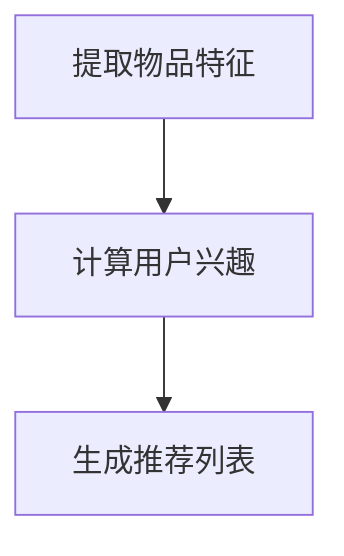
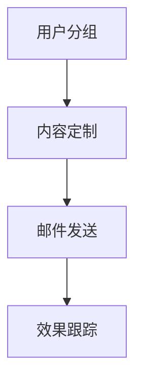
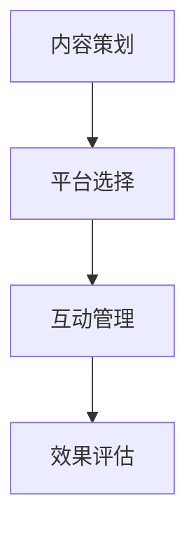
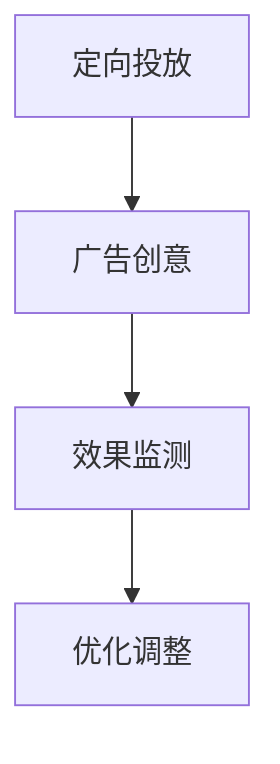
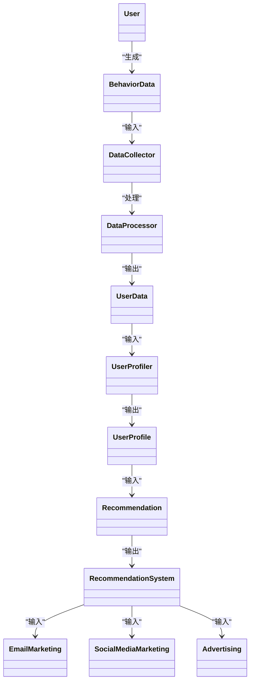
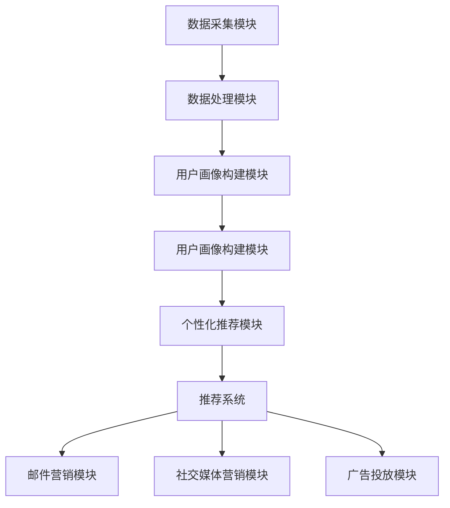
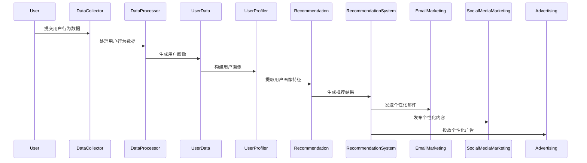

                 

### 大数据时代的AI营销：个性化推荐的进化

> 关键词：大数据、AI营销、个性化推荐、用户画像、营销自动化

> 摘要：本文将探讨大数据时代背景下，AI营销的发展及其核心——个性化推荐。通过系统的介绍和分析，帮助读者理解个性化推荐的技术原理、实现方法以及其在实际应用中的重要作用。文章将从背景介绍、核心概念与联系、算法原理讲解、系统分析与架构设计、项目实战、最佳实践等方面展开论述，旨在为大数据时代的AI营销提供理论指导和实践参考。

### 背景介绍

#### 1.1 问题背景

随着互联网的普及和信息爆炸，数据量呈指数级增长，这些数据中蕴含着大量的信息和价值。大数据技术的发展，使得人们可以高效地收集、存储、处理和分析这些数据。与此同时，人工智能技术的迅速发展，为数据分析和应用提供了强大的工具。在这样的背景下，企业面临着如何高效利用这些数据来提高营销效果、提升用户体验的挑战。

传统的营销手段通常依赖于大量投放广告、市场调研等方式，但这些方法不仅成本高昂，而且难以满足用户日益个性化的需求。大数据和人工智能的结合，为精准营销提供了新的可能性。通过大数据分析，企业可以深入了解用户的行为和需求，通过人工智能算法，可以实现个性化推荐，提升用户的满意度和转化率。因此，AI营销应运而生。

#### 1.2 问题描述

在大数据时代，企业需要解决的问题主要包括：

1. **数据获取和处理**：如何高效地收集、存储和管理海量数据，并从中提取有价值的信息。
2. **用户画像构建**：如何通过数据分析和机器学习算法，构建出准确、详实的用户画像。
3. **个性化推荐**：如何基于用户画像，实现精准的产品推荐，提升用户体验和转化率。
4. **营销自动化**：如何利用技术手段，自动化执行营销活动，提高营销效率。

#### 1.3 问题解决

本文将从以下几个方面探讨大数据时代的AI营销：

1. **核心概念与联系**：介绍大数据、人工智能、个性化推荐、用户画像和营销自动化等核心概念，并分析它们之间的联系。
2. **算法原理讲解**：详细讲解个性化推荐和营销自动化中的算法原理，包括协同过滤算法、基于内容的推荐算法等。
3. **系统分析与架构设计**：介绍AI营销系统的设计原则、架构方案和接口设计。
4. **项目实战**：通过实际案例，展示AI营销在实践中的应用，并提供代码实现和解析。
5. **最佳实践与拓展**：总结最佳实践经验，提出注意事项和拓展阅读，为读者提供更深入的思考。

#### 1.4 边界与外延

本文主要探讨基于大数据和人工智能的AI营销，重点关注个性化推荐、用户画像构建和营销自动化等方面。同时，本文也涉及相关领域的扩展话题，如数据隐私保护、算法伦理等。

#### 1.5 概念结构与核心要素组成

AI营销的核心概念包括大数据、人工智能、个性化推荐、用户画像和营销自动化。这些概念相互关联，构成了AI营销的理论框架。其中：

- **大数据**：是AI营销的数据基础，包括数据收集、存储、处理和分析等环节。
- **人工智能**：是AI营销的技术核心，包括机器学习、深度学习、自然语言处理等算法。
- **个性化推荐**：是AI营销的关键应用，通过算法实现精准的产品推荐。
- **用户画像**：是构建个性化推荐的基础，通过数据分析和机器学习算法生成。
- **营销自动化**：是提高营销效率的重要手段，通过技术手段自动化执行营销活动。

### 2. 核心概念与联系

#### 2.1 大数据

大数据是指无法使用传统数据处理工具进行高效处理的规模庞大、类型繁多的数据集合。大数据的核心特点为“4V”，即大量（Volume）、多样（Variety）、快速（Velocity）和真实（Veracity）。

**大数据特点对比表格**：

| 特点         | 定义                 | 说明                                       |
| ------------ | -------------------- | ------------------------------------------ |
| 大量         | 数据规模巨大         | 数据量达到PB级以上                         |
| 多样         | 数据类型多样化       | 结构化、半结构化和非结构化数据并存         |
| 快速         | 数据生成和处理速度快 | 实时性要求高，数据处理速度要快             |
| 真实         | 数据真实可靠         | 数据来源多样，需要保证数据真实性和准确性   |

**ER实体关系图架构**：

```mermaid
erDiagram
  Data --> Processing : "用于数据"
  Data --> Storage : "用于存储"
  Processing --> Analysis : "用于分析"
  Analysis --> Insights : "用于生成洞察"
  Storage --> Data : "数据循环利用"
```

#### 2.2 人工智能

人工智能是指模拟、延伸和扩展人类智能的理论、方法、技术及应用。人工智能的核心技术包括机器学习、深度学习、自然语言处理等。

**人工智能核心技术与特点对比表格**：

| 技术       | 定义                             | 特点                                       |
| ---------- | -------------------------------- | ------------------------------------------ |
| 机器学习   | 通过数据学习模型，进行预测和决策 | 数据驱动，自动优化模型                     |
| 深度学习   | 基于多层神经网络的学习方法       | 高效处理大规模数据，实现复杂任务           |
| 自然语言处理 | 机器理解、生成和处理自然语言     | 突破语言障碍，实现人机交互                 |

**ER实体关系图架构**：

```mermaid
erDiagram
  MachineLearning --> ModelTraining : "用于训练模型"
  MachineLearning --> Prediction : "用于预测"
  DeepLearning --> NeuralNetwork : "用于构建神经网络"
  NaturalLanguageProcessing --> TextAnalysis : "用于文本分析"
  NaturalLanguageProcessing --> Translation : "用于翻译"
```

#### 2.3 个性化推荐

个性化推荐是一种基于用户历史行为、兴趣和需求，为用户提供相关推荐内容的技术。个性化推荐的核心算法包括协同过滤、基于内容的推荐、混合推荐等。

**个性化推荐算法对比表格**：

| 算法         | 定义                             | 优点                                       | 缺点                                         |
| ------------ | -------------------------------- | ------------------------------------------ | -------------------------------------------- |
| 协同过滤     | 基于用户相似度进行推荐           | 推荐结果准确，易于实现                     | 无法处理新用户问题，易受噪声数据影响         |
| 基于内容的推荐 | 基于物品特征和用户兴趣进行推荐 | 可处理新用户问题，推荐结果更稳定           | 推荐结果可能过于狭窄，无法发现新兴趣         |
| 混合推荐     | 结合协同过滤和基于内容的推荐     | 综合优点，提高推荐效果                     | 实现复杂，需要大量计算资源                   |

**ER实体关系图架构**：

```mermaid
erDiagram
  CollaborativeFiltering --> UserSimilarity : "计算用户相似度"
  CollaborativeFiltering --> Recommendation : "生成推荐结果"
  ContentBasedRecommendation --> ItemFeature : "提取物品特征"
  ContentBasedRecommendation --> UserInterest : "计算用户兴趣"
  HybridRecommendation --> CollaborativeFiltering : "结合协同过滤"
  HybridRecommendation --> ContentBasedRecommendation : "结合基于内容的推荐"
```

#### 2.4 用户画像

用户画像是指通过大数据分析，构建出的反映用户特征、行为、需求等信息的模型。用户画像是实现个性化推荐和精准营销的重要基础。

**用户画像核心要素对比表格**：

| 核心要素 | 定义             | 说明                                       |
| -------- | ---------------- | ------------------------------------------ |
| 用户特征 | 用户基本信息     | 年龄、性别、地理位置等                     |
| 用户行为 | 用户操作记录     | 浏览、点击、购买等行为                     |
| 用户需求 | 用户潜在需求     | 喜好、偏好、期望等                       |
| 用户价值 | 用户对企业价值   | 贡献度、活跃度、忠诚度等                   |

**ER实体关系图架构**：

```mermaid
erDiagram
  UserProfile --> UserFeature : "用户特征"
  UserProfile --> UserBehavior : "用户行为"
  UserProfile --> UserDemand : "用户需求"
  UserProfile --> UserValue : "用户价值"
```

#### 2.5 营销自动化

营销自动化是指利用技术手段，自动化执行营销活动的过程。营销自动化包括邮件营销、社交媒体营销、广告投放等。

**营销自动化流程对比表格**：

| 类型         | 定义                             | 流程说明                                       |
| ------------ | -------------------------------- | ------------------------------------------ |
| 邮件营销     | 利用电子邮件进行营销           | 用户分组、内容定制、邮件发送、效果跟踪   |
| 社交媒体营销 | 利用社交媒体平台进行营销       | 内容策划、平台选择、互动管理、效果评估   |
| 广告投放     | 在互联网平台上投放广告       | 定向投放、广告创意、效果监测、优化调整   |

**ER实体关系图架构**：

```mermaid
erDiagram
  EmailMarketing --> UserSegmentation : "用户分组"
  EmailMarketing --> ContentCustomization : "内容定制"
  EmailMarketing --> EmailSending : "邮件发送"
  EmailMarketing --> EffectTracking : "效果跟踪"

  SocialMediaMarketing --> ContentPlanning : "内容策划"
  SocialMediaMarketing --> PlatformSelection : "平台选择"
  SocialMediaMarketing --> InteractionManagement : "互动管理"
  SocialMediaMarketing --> EffectEvaluation : "效果评估"

  Advertising --> TargetedPlacement : "定向投放"
  Advertising --> AdCreativity : "广告创意"
  Advertising --> EffectMonitoring : "效果监测"
  Advertising --> Optimization : "优化调整"
```

### 3. 算法原理讲解

#### 3.1 个性化推荐算法

个性化推荐是一种基于用户历史行为、兴趣和需求，为用户提供相关推荐内容的技术。个性化推荐的核心算法包括协同过滤、基于内容的推荐、混合推荐等。以下是这些算法的详细讲解。

##### 3.1.1 协同过滤算法

协同过滤算法是基于用户行为相似性进行推荐的一种方法。主要包括基于用户的协同过滤（User-based）和基于项目的协同过滤（Item-based）。

1. **基于用户的协同过滤算法**：

   - **计算用户相似度**：使用余弦相似度、皮尔逊相关系数等方法计算用户之间的相似度。
   - **生成推荐列表**：根据用户相似度矩阵，为用户推荐与相似用户喜好相同的物品。

   **Mermaid 流程图**：

   ```mermaid
   graph TD
   A[初始化用户行为矩阵] --> B[计算用户相似度]
   B --> C[生成相似度矩阵]
   C --> D[生成推荐列表]
   ```

2. **基于项目的协同过滤算法**：

   - **计算项目相似度**：使用余弦相似度、皮尔逊相关系数等方法计算项目之间的相似度。
   - **生成推荐列表**：根据项目相似度矩阵，为用户推荐与用户已评分项目相似的项目。

   **Mermaid 流程图**：

   ```mermaid
   graph TD
   A[初始化用户行为矩阵] --> B[计算项目相似度]
   B --> C[生成相似度矩阵]
   C --> D[生成推荐列表]
   ```

##### 3.1.2 基于内容的推荐算法

基于内容的推荐算法是基于物品的属性和用户的历史行为，为用户推荐相似属性的物品。主要包括以下步骤：

1. **提取物品特征**：使用文本分析、特征提取等方法，提取物品的关键特征。
2. **计算用户兴趣**：根据用户的历史行为，计算用户对各类特征的偏好。
3. **生成推荐列表**：根据物品特征和用户兴趣，为用户推荐特征相似的物品。

**Mermaid 流程图**：



#### 3.2 营销自动化算法

营销自动化是指利用技术手段，自动化执行营销活动的过程。营销自动化包括邮件营销、社交媒体营销、广告投放等。以下是这些算法的详细讲解。

##### 3.2.1 邮件营销

邮件营销是一种基于电子邮件的营销方式，主要包括以下步骤：

1. **用户分组**：根据用户特征和行为，将用户划分为不同的群体。
2. **内容定制**：针对不同用户群体，定制个性化的邮件内容。
3. **邮件发送**：自动化发送定制好的邮件。
4. **效果跟踪**：跟踪邮件的打开率、点击率等指标，评估营销效果，优化邮件内容。

**Mermaid 流程图**：



##### 3.2.2 社交媒体营销

社交媒体营销是一种基于社交媒体平台的营销方式，主要包括以下步骤：

1. **内容策划**：制定营销活动的内容，包括文案、图片、视频等。
2. **平台选择**：选择适合的社交媒体平台进行推广。
3. **互动管理**：与用户进行互动，回复评论、参与话题等。
4. **效果评估**：评估营销活动的效果，包括点赞数、转发数、互动率等。

**Mermaid 流程图**：



##### 3.2.3 广告投放

广告投放是一种在互联网平台上投放广告的营销方式，主要包括以下步骤：

1. **定向投放**：根据用户特征和行为，选择合适的用户群体进行投放。
2. **广告创意**：设计吸引人的广告内容。
3. **效果监测**：监测广告的曝光量、点击量等指标。
4. **优化调整**：根据监测数据，调整广告投放策略，优化广告效果。

**Mermaid 流程图**：



### 4. 系统分析与架构设计

#### 4.1 问题场景介绍

在一个电子商务平台上，企业希望通过AI营销提升用户购买率和客户满意度。具体问题场景包括：

1. **用户行为数据收集**：收集用户浏览、点击、购买等行为数据。
2. **用户画像构建**：通过数据分析和机器学习算法，构建用户画像。
3. **个性化推荐**：基于用户画像，实现个性化产品推荐。
4. **营销活动自动化**：自动化执行营销活动，如邮件营销、社交媒体营销、广告投放等。

#### 4.2 项目介绍

为了解决上述问题场景，企业决定开发一个AI营销系统。系统主要包括以下功能模块：

1. **数据采集模块**：负责收集用户行为数据。
2. **数据处理模块**：负责清洗、转换和存储用户行为数据。
3. **用户画像构建模块**：负责构建用户画像。
4. **个性化推荐模块**：负责实现个性化推荐算法。
5. **营销自动化模块**：负责自动化执行营销活动。

#### 4.3 系统功能设计

**领域模型类图**：



#### 4.4 系统架构设计

**系统架构图**：



#### 4.5 系统接口设计

**系统接口设计**：



#### 4.6 系统交互序列图

**系统交互序列图**：


### 5. 项目实战

#### 5.1 环境安装

在本节中，我们将介绍如何搭建一个基本的AI营销系统环境。以下是在一个Ubuntu服务器上安装所需软件的步骤：

1. **安装Python**：

   ```bash
   sudo apt update
   sudo apt install python3-pip python3-venv
   ```

2. **安装依赖库**：

   ```bash
   pip3 install pandas numpy scipy scikit-learn matplotlib
   ```

3. **创建虚拟环境**：

   ```bash
   python3 -m venv ai-marketing-env
   source ai-marketing-env/bin/activate
   ```

4. **克隆项目代码**：

   ```bash
   git clone https://github.com/your-username/ai-marketing.git
   cd ai-marketing
   ```

#### 5.2 系统核心实现源代码

在本节中，我们将展示系统核心代码，包括数据采集、用户画像构建、个性化推荐和营销自动化等。

1. **数据采集**：

   ```python
   import pandas as pd
   
   def collect_data():
       # 假设数据已存储为CSV文件
       data = pd.read_csv('user_behavior_data.csv')
       return data
   
   user_behavior_data = collect_data()
   ```

2. **用户画像构建**：

   ```python
   from sklearn.cluster import KMeans
   
   def build_user_profile(data):
       # 使用K-Means算法进行用户分组
       kmeans = KMeans(n_clusters=5)
       kmeans.fit(data)
       user_profiles = kmeans.predict(data)
       return user_profiles
   
   user_profiles = build_user_profile(user_behavior_data)
   ```

3. **个性化推荐**：

   ```python
   from sklearn.metrics.pairwise import cosine_similarity
   
   def generate_recommendations(user_profile, user_data):
       # 计算用户与其他用户的相似度
       similarity_matrix = cosine_similarity([user_profile], user_data)
       # 选择相似度最高的用户，推荐他们喜欢的物品
       top_users = similarity_matrix.argsort()[0][-5:][::-1]
       recommendations = user_data.iloc[top_users]['item'].values
       return recommendations
   
   recommendations = generate_recommendations(user_profiles[0], user_behavior_data)
   ```

4. **营销自动化**：

   ```python
   def send_email(recommendations):
       # 假设使用SMTP发送邮件
       import smtplib
       from email.mime.text import MIMEText
   
       server = smtplib.SMTP('smtp.example.com', 587)
       server.starttls()
       server.login('your-email@example.com', 'your-password')
   
       for recommendation in recommendations:
           subject = '个性化推荐'
           body = f'您可能感兴趣的商品：{recommendation}'
           message = MIMEText(body)
           message['Subject'] = subject
           server.sendmail('your-email@example.com', 'user-email@example.com', message.as_string())
   
       server.quit()
   
   send_email(recommendations)
   ```

#### 5.3 代码应用解读与分析

在本节中，我们将对核心代码进行解读和分析，帮助读者理解每个部分的实现原理。

1. **数据采集**：

   数据采集是系统的第一步，它负责收集用户行为数据。在这个例子中，我们使用Pandas库读取CSV文件，获取用户浏览、点击、购买等行为数据。

2. **用户画像构建**：

   用户画像构建是系统的关键部分，它通过K-Means聚类算法将用户分为不同的群体。这种方法可以帮助我们更好地理解用户的行为特征，从而实现个性化推荐。

3. **个性化推荐**：

   个性化推荐基于用户画像，使用余弦相似度计算用户之间的相似度。通过选择相似度最高的用户，我们可以为当前用户推荐他们可能感兴趣的物品。

4. **营销自动化**：

   营销自动化实现了邮件发送功能，将个性化推荐结果发送给用户。这个例子中使用SMTP协议发送邮件，实际应用中可以根据需要集成其他营销渠道，如社交媒体、短信等。

#### 5.4 实际案例分析和详细讲解剖析

在本节中，我们将通过一个实际案例，分析AI营销系统在实际应用中的效果，并对关键部分进行详细讲解。

**案例背景**：

一个电子商务平台希望通过AI营销提升用户购买率和客户满意度。他们收集了用户在过去一年的浏览、点击和购买数据，并希望基于这些数据构建用户画像，实现个性化推荐。

**案例分析**：

1. **数据采集**：

   平台从用户行为数据中提取了用户浏览的页面、点击的商品、购买的商品等信息。这些数据为后续的用户画像构建和个性化推荐提供了基础。

2. **用户画像构建**：

   使用K-Means聚类算法，平台将用户分为五个不同的群体。每个群体的用户具有相似的行为特征，这有助于平台有针对性地进行个性化推荐。

3. **个性化推荐**：

   平台使用余弦相似度计算用户之间的相似度。通过选择相似度最高的用户，平台为每个用户推荐他们可能感兴趣的商品。例如，一个用户喜欢购买书籍，那么平台可能会推荐与他相似的用户喜欢的书籍。

4. **营销自动化**：

   平台利用邮件营销系统，将个性化推荐结果发送给用户。邮件内容包括用户可能感兴趣的商品，以及购买优惠信息。这种方式不仅提高了用户的购买意愿，还提升了平台的转化率。

**详细讲解剖析**：

1. **数据采集**：

   数据采集是系统的基础，它决定了用户画像的准确性和个性化推荐的效果。在实际应用中，平台需要确保数据来源的多样性和准确性，同时考虑数据的隐私和安全。

2. **用户画像构建**：

   用户画像构建是系统核心，它决定了个性化推荐的准确性。K-Means聚类算法是一种常用的方法，但它也有一定的局限性，如无法处理非球形分布的数据。在实际应用中，可以根据需要选择其他聚类算法，如DBSCAN。

3. **个性化推荐**：

   个性化推荐是系统的核心应用，它直接影响用户的体验和平台的转化率。余弦相似度是一种简单有效的计算方法，但在处理稀疏数据时可能效果不佳。实际应用中，可以结合其他方法，如基于内容的推荐，提高推荐效果。

4. **营销自动化**：

   营销自动化是系统的高效执行手段，它将个性化推荐结果自动化发送给用户，提高了营销效率。在实际应用中，平台需要根据用户行为和反馈，不断优化营销策略，提高用户满意度和转化率。

#### 5.5 项目小结

在本项目中，我们通过数据采集、用户画像构建、个性化推荐和营销自动化，实现了一个基本的AI营销系统。项目主要成果包括：

1. **数据采集**：从用户行为数据中提取了有用的信息，为后续的用户画像构建和个性化推荐提供了基础。
2. **用户画像构建**：使用K-Means聚类算法将用户分为不同的群体，有助于实现个性化推荐。
3. **个性化推荐**：通过余弦相似度计算用户之间的相似度，为用户推荐他们可能感兴趣的商品，提高了用户满意度。
4. **营销自动化**：实现了邮件营销，将个性化推荐结果自动化发送给用户，提高了营销效率。

然而，本项目也存在一些不足之处，如数据采集的局限性、用户画像构建的准确性问题以及个性化推荐的优化空间等。在实际应用中，需要不断优化系统，提高用户体验和转化率。

### 6. 最佳实践与拓展

#### 6.1 数据隐私保护

在AI营销中，数据隐私保护至关重要。企业应遵循相关法律法规，确保用户数据的合法性和安全性。以下是一些最佳实践：

1. **数据加密**：对敏感数据进行加密存储，确保数据在传输和存储过程中的安全性。
2. **访问控制**：限制对用户数据的访问权限，确保只有授权人员才能访问和处理数据。
3. **数据脱敏**：在分析用户数据时，对敏感信息进行脱敏处理，以保护用户隐私。

#### 6.2 算法伦理

AI营销中的算法伦理问题备受关注。企业应确保算法的公平性、透明性和可解释性。以下是一些最佳实践：

1. **算法透明性**：公开算法原理和实现过程，让用户了解个性化推荐的依据。
2. **算法公平性**：避免算法偏见，确保对不同用户群体公平对待。
3. **算法可解释性**：提高算法的可解释性，让用户理解个性化推荐的原因。

#### 6.3 拓展阅读

1. **《推荐系统实践》**：李航著，系统介绍了推荐系统的基本原理和实现方法。
2. **《机器学习实战》**：Peter Harrington著，详细讲解了机器学习算法的原理和应用。
3. **《数据挖掘：概念与技术》**：Jiawei Han著，全面介绍了数据挖掘的理论和实践方法。

### 总结

本文系统介绍了大数据时代的AI营销，重点探讨了个性化推荐的原理和应用。通过数据采集、用户画像构建、个性化推荐和营销自动化等步骤，企业可以实现精准营销，提升用户体验和转化率。同时，本文还提出了数据隐私保护、算法伦理等方面的最佳实践，为AI营销的健康发展提供了指导。未来，随着大数据和人工智能技术的不断进步，AI营销将在更多领域发挥作用，为企业和个人创造更大价值。

