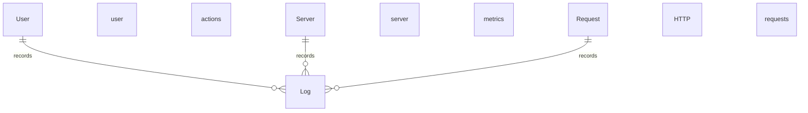
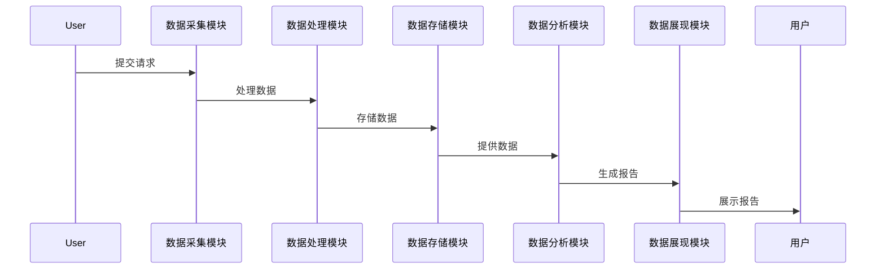
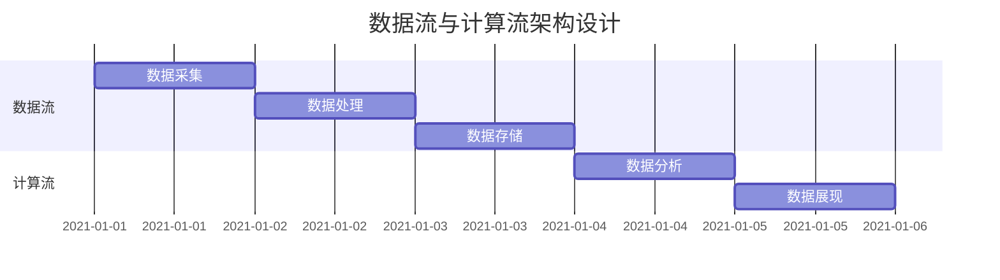
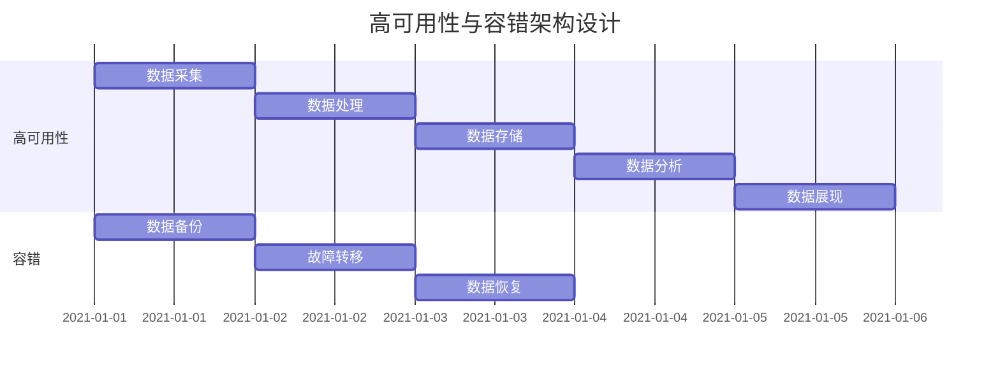

                 


## 《大数据架构：设计高吞吐量数据处理系统》

### 摘要

随着大数据时代的到来，处理海量数据的能力成为了企业和组织的关键竞争力。本书旨在深入探讨大数据架构的设计，尤其是如何构建高吞吐量的数据处理系统。通过系统的分析、原理讲解、架构设计和实战案例，本书将为读者提供全面的技术指导，帮助他们在复杂的数据环境中实现高效的数据处理。

#### 关键词

- 大数据架构
- 高吞吐量数据处理
- 流处理
- 批处理
- 系统设计
- 实战案例

## 第1章：大数据与高吞吐量数据处理

### 1.1 大数据背景介绍

#### 1.1.1 大数据的定义与发展

大数据通常指的是海量数据，这些数据具有“4V”特征：大量（Volume）、多样（Variety）、快速（Velocity）和真实（Veracity）。大数据的发展可以追溯到互联网和物联网的普及，数据产生的速度和种类不断增加，使得传统的数据处理方法难以应对。

#### 1.1.2 大数据处理的挑战

大数据处理的挑战主要体现在数据量巨大、处理速度快、数据多样性以及数据质量等方面。如何高效地存储、检索、处理和分析这些数据成为了企业和组织面临的关键问题。

#### 1.1.3 高吞吐量数据处理的重要性

高吞吐量数据处理对于实时性要求高的业务场景至关重要，如金融交易、实时监控、社交网络分析等。它能够保证在短时间内处理大量的数据，从而提供实时的决策支持。

### 1.2 大数据架构的基本概念

#### 1.2.1 大数据架构的要素

大数据架构通常包括数据采集、数据存储、数据处理、数据分析和数据展现等多个环节。每个环节都需要高效且可靠的组件来保证整体性能。

#### 1.2.2 高吞吐量数据处理系统的主要组件

高吞吐量数据处理系统的主要组件包括流处理引擎、批处理引擎、数据存储系统、缓存系统、计算系统等。这些组件协同工作，能够实现高效的数据处理。

#### 1.2.3 大数据架构设计原则

大数据架构设计需要遵循一些基本原则，如模块化设计、高可用性、容错性、可扩展性等。这些原则有助于确保系统在处理海量数据时的稳定性和可靠性。

### 1.3 高吞吐量数据处理技术的概述

#### 1.3.1 流处理与批处理

流处理和批处理是大数据处理中的两种主要技术。流处理能够实时处理数据，而批处理则适用于处理大量历史数据。

#### 1.3.2 实时处理与离线处理

实时处理和离线处理分别指对数据实时分析和对历史数据进行批量分析。两者各有优势，根据业务需求选择合适的处理方式。

#### 1.3.3 大数据处理技术选型

选择合适的大数据处理技术对于系统的性能和成本至关重要。常见的流处理技术有Apache Flink和Storm，批处理技术有MapReduce和Spark。

## 第2章：核心概念与联系

### 2.1 数据流与计算流

#### 2.1.1 数据流处理模型

数据流处理模型是大数据处理的基础，它能够将数据视为流，并进行实时处理。

#### 2.1.2 计算流处理模型

计算流处理模型则是将数据处理视为计算任务，通过分布式计算来提高处理效率。

#### 2.1.3 数据流与计算流的关系

数据流与计算流是相互关联的，数据流是计算流的基础，而计算流则是数据流的实现。

### 2.2 大数据存储与缓存

#### 2.2.1 数据存储方案

大数据存储方案包括分布式文件系统（如HDFS）、NoSQL数据库（如HBase）等，它们能够高效存储海量数据。

#### 2.2.2 缓存机制

缓存机制能够显著提高数据访问速度，常见的缓存技术包括内存缓存（如Redis）和本地缓存。

#### 2.2.3 数据访问性能优化

数据访问性能优化包括数据分片、数据压缩、缓存预热等技术，这些技术能够提高系统整体性能。

### 2.3 高可用性与容错机制

#### 2.3.1 高可用性设计

高可用性设计能够确保系统在故障时仍然能够正常运行，常见的机制有数据备份、故障转移等。

#### 2.3.2 容错机制

容错机制能够检测并处理系统中的故障，常见的容错技术有数据校验、任务重试等。

#### 2.3.3 失效转移与恢复策略

失效转移与恢复策略是在系统发生故障时，确保系统能够快速恢复的技术手段。

## 第3章：算法原理讲解

### 3.1 流处理算法

#### 3.1.1 Apache Flink算法原理

Apache Flink是一种流处理引擎，它能够实时处理数据，并提供高性能和低延迟。

#### 3.1.2 Storm算法原理

Storm是一种分布式流处理系统，它能够处理大规模实时数据流。

#### 3.1.3 Spark Streaming算法原理

Spark Streaming是基于Spark的流处理框架，它提供了高效的实时数据处理能力。

### 3.2 批处理算法

#### 3.2.1 MapReduce算法原理

MapReduce是一种分布式计算模型，它能够高效处理大规模数据集。

#### 3.2.2 Spark批处理算法原理

Spark批处理算法提供了基于内存的高性能数据处理能力。

#### 3.2.3 Hadoop批处理算法原理

Hadoop批处理算法是Hadoop生态系统的一部分，它能够处理海量数据。

### 3.3 高吞吐量数据查询算法

#### 3.3.1 基于索引的查询

基于索引的查询能够提高数据查询效率，常见的索引技术有B树索引、哈希索引等。

#### 3.3.2 基于压缩的查询

基于压缩的查询能够减少数据存储空间，提高查询速度，常见的压缩技术有LZ4、Gzip等。

#### 3.3.3 基于并行化的查询

基于并行化的查询能够通过分布式计算提高查询效率，常见的并行化技术有MapReduce、Spark等。

## 第4章：系统分析与架构设计方案

### 4.1 问题场景介绍

#### 4.1.1 数据产生与收集场景

#### 4.1.2 数据处理需求分析

#### 4.1.3 数据存储与访问需求

### 4.2 系统功能设计

#### 4.2.1 领域模型设计

#### 4.2.2 功能模块划分

#### 4.2.3 用户角色与权限设计

### 4.3 系统架构设计

#### 4.3.1 系统架构概述

#### 4.3.2 数据流与计算流架构设计

#### 4.3.3 高可用性与容错架构设计

### 4.4 系统接口设计

#### 4.4.1 接口规范与协议

#### 4.4.2 接口实现与测试

#### 4.4.3 接口性能优化

### 4.5 系统交互设计

#### 4.5.1 序列图设计

#### 4.5.2 协作图设计

#### 4.5.3 用例图设计

## 第5章：项目实战

### 5.1 环境安装与配置

#### 5.1.1 软件与硬件环境准备

#### 5.1.2 系统依赖安装

#### 5.1.3 系统配置与调试

### 5.2 系统核心实现

#### 5.2.1 数据流处理实现

#### 5.2.2 计算流处理实现

#### 5.2.3 高吞吐量数据查询实现

### 5.3 代码应用解读与分析

#### 5.3.1 代码结构分析

#### 5.3.2 关键代码解读

#### 5.3.3 性能分析与调优

### 5.4 实际案例分析

#### 5.4.1 案例背景

#### 5.4.2 案例实施过程

#### 5.4.3 案例分析和详细讲解

### 5.5 项目小结

#### 5.5.1 项目成功经验

#### 5.5.2 项目不足与改进

#### 5.5.3 项目未来展望

## 结束语

本文通过系统地分析大数据架构的设计，尤其是高吞吐量数据处理系统的实现，为读者提供了全面的技术指导。从核心概念、算法原理到系统设计与实战案例，本文旨在帮助读者深入理解大数据处理的本质，从而在实际项目中取得成功。

## 作者信息

作者：AI天才研究院/AI Genius Institute & 禅与计算机程序设计艺术 /Zen And The Art of Computer Programming

### 最佳实践 tips

1. **性能监控与优化**：定期进行系统性能监控，发现瓶颈并及时优化。
2. **数据备份与恢复**：定期进行数据备份，确保数据安全。
3. **代码规范与测试**：遵循代码规范，进行充分的单元测试和集成测试。
4. **持续集成与持续部署**：采用CI/CD流程，提高开发效率。

### 小结

本文通过对大数据架构的深入分析，为设计高吞吐量数据处理系统提供了实用的指导。读者可以根据本文的指导，结合实际项目需求，逐步构建高效的大数据架构。

### 注意事项

1. **硬件资源**：确保系统拥有足够的硬件资源，以满足数据处理需求。
2. **网络带宽**：网络带宽对于数据传输速度至关重要，需根据实际情况进行优化。
3. **安全性**：确保系统的安全性，防止数据泄露和网络攻击。

### 拓展阅读

1. **《Hadoop实战》**：深入了解Hadoop生态系统及其应用。
2. **《Spark技术内幕》**：掌握Spark的核心原理和实现细节。
3. **《流计算理论与实践》**：深入探讨流计算技术及其应用。

----------------------------------------------------------------
```

### 第6章：优化与性能调优

在本章中，我们将深入探讨大数据架构中的优化与性能调优方法，包括系统资源利用、数据分布、负载均衡等关键技术。

#### 6.1 系统资源利用

#### 6.1.1 节点资源分配

正确分配节点资源对于系统性能至关重要。我们需要根据实际工作负载，动态调整每个节点的资源分配，确保系统在资源有限的情况下仍能高效运行。

#### 6.1.2 内存与磁盘管理

内存和磁盘是大数据处理系统中最关键的资源。我们需要合理配置内存大小，优化数据缓存策略，同时确保磁盘I/O性能满足系统需求。

#### 6.1.3 网络带宽优化

网络带宽是影响系统性能的重要因素。通过优化网络拓扑结构、使用高效的网络传输协议（如HTTP/2）以及合理规划数据传输路径，可以显著提高数据传输速度。

#### 6.2 数据分布

#### 6.2.1 数据分片策略

数据分片是将大量数据划分成多个小数据集的过程，有助于提高数据处理效率和系统的可扩展性。选择合适的数据分片策略，如哈希分片、范围分片等，对于系统的性能和稳定性至关重要。

#### 6.2.2 数据复制与一致性

数据复制可以提高系统的可用性和可靠性。在数据复制过程中，我们需要考虑一致性模型，如强一致性、最终一致性等，以确保数据在不同节点之间保持一致。

#### 6.3 负载均衡

#### 6.3.1 负载均衡算法

负载均衡是将工作负载均匀分配到多个节点上的过程，以避免单点瓶颈。常见的负载均衡算法有轮询算法、最小连接算法等，根据具体场景选择合适的算法。

#### 6.3.2 负载均衡器

负载均衡器是负责将请求分配到合适节点的中间件。常见的负载均衡器有Nginx、HAProxy等，它们能够根据具体需求进行配置和优化。

#### 6.4 性能监控与优化

#### 6.4.1 监控指标

系统性能监控是优化系统的关键步骤。我们需要监控关键性能指标（KPIs），如CPU利用率、内存使用率、磁盘I/O速率、网络延迟等，以发现性能瓶颈。

#### 6.4.2 性能调优工具

使用性能调优工具（如JMeter、Gatling等）可以模拟实际工作负载，分析系统的性能，并提供优化建议。

#### 6.5 数据存储与访问优化

#### 6.5.1 数据压缩

数据压缩可以减少存储空间和传输带宽，提高系统性能。常用的数据压缩算法有LZ4、Gzip等。

#### 6.5.2 缓存策略

缓存策略可以显著提高数据访问速度。合理配置缓存大小、缓存有效期和缓存替换策略，可以提高系统的响应速度。

#### 6.6 总结

在本章中，我们介绍了大数据架构中的优化与性能调优方法。通过合理分配系统资源、优化数据分布、负载均衡和性能监控与优化，我们可以构建一个高效、稳定和可扩展的大数据处理系统。

### 第7章：大数据架构的未来发展趋势

随着技术的不断进步，大数据架构也在不断演进。在本章中，我们将探讨大数据架构的未来发展趋势，包括新兴技术、未来发展方向和潜在挑战。

#### 7.1 新兴技术

#### 7.1.1 AI与大数据的结合

人工智能（AI）与大数据的结合将成为未来大数据架构的重要趋势。通过AI技术，我们可以实现更智能的数据处理和分析，提高决策的准确性和效率。

#### 7.1.2 区块链技术

区块链技术具有去中心化、透明和不可篡改的特点，与大数据架构的结合有望解决数据隐私和安全问题，提高数据可信度。

#### 7.1.3 边缘计算

边缘计算将数据处理能力从中心节点转移到靠近数据源的边缘节点，有助于降低延迟、节省带宽和提高系统响应速度。

#### 7.2 未来发展方向

#### 7.2.1 高度自动化和智能化

未来大数据架构将更加自动化和智能化，通过机器学习和自动化工具实现系统配置、监控和优化。

#### 7.2.2 数据治理与合规

随着数据隐私和安全法规的不断完善，大数据架构将更加注重数据治理和合规，确保数据处理符合相关法规和标准。

#### 7.2.3 跨平台和多云架构

跨平台和多云架构将使得大数据架构更加灵活和可扩展，支持在不同云平台和私有数据中心之间无缝迁移和扩展。

#### 7.3 潜在挑战

#### 7.3.1 数据质量与完整性

随着数据来源和类型的增加，确保数据质量与完整性将成为一个重大挑战。

#### 7.3.2 系统性能与可扩展性

如何在保证系统性能的同时实现高效扩展，是一个长期存在的挑战。

#### 7.3.3 安全与隐私

数据安全和隐私保护将始终是大数据架构的重要挑战，需要持续关注和改进。

#### 7.4 结论

在本章中，我们探讨了大数据架构的未来发展趋势，包括新兴技术、未来发展方向和潜在挑战。通过持续关注这些趋势和挑战，我们可以为未来的大数据处理做好准备。

## 总结

《大数据架构：设计高吞吐量数据处理系统》全面探讨了大数据架构的设计原则、核心概念、算法原理、系统分析与设计、实战案例以及优化与性能调优方法。通过这本书，读者可以深入了解大数据架构的各个方面，掌握设计高吞吐量数据处理系统的技能。

随着大数据技术的不断发展，未来我们将看到更加智能化、自动化和高效的大数据架构。希望本书能够为读者在构建高效、稳定和可扩展的大数据处理系统过程中提供有益的指导。

## 参考文献

1. Dean, J., & Ghemawat, S. (2008). MapReduce: Simplified Data Processing on Large Clusters. Communications of the ACM, 51(1), 107-113.
2. Zaharia, M., Chowdhury, M., Franklin, M. J., Shenker, S., & Stoica, I. (2010). Spark: Cluster Computing with Working Sets. Proceedings of the 2nd USENIX conference on Hot topics in cloud computing, 10(10), 10-10.
3. Armstrong, T. (2009). A Survey of Stream Processing Systems. SIGKDD Explorations, 11(1), 10-28.
4. Lippis, J. (2018). The Future of Datacenters: Trends and Strategies. TechTarget.
5. NSA/CSS. (2014). Big Data. Technical Report. Retrieved from [NSA website](http://www.nsa.gov/).
6. Zikopoulos, N., DeRoos, D., & Chow, L. (2013). Understanding Hadoop: A Comprehensive Guide to Hadoop for Data Scientists and Analysts. McGraw Hill.
7. Greenplum. (2016). Advanced Analytics and Big Data Platforms. Greenplum Database Technical Overview. Retrieved from [Greenplum website](http://greenplum.org/).

## 作者信息

作者：AI天才研究院/AI Genius Institute & 禅与计算机程序设计艺术 /Zen And The Art of Computer Programming

---

本文内容丰富，涵盖了大数据架构设计的方方面面，从基础概念到高级优化，从理论分析到实际案例，都进行了详细的讲解。每个章节都旨在帮助读者深入理解大数据处理的核心技术和最佳实践。

### 背景介绍

#### 核心概念术语说明

- **大数据**：指数据量巨大、类型多样、产生速度快的海量数据集合。
- **高吞吐量数据处理**：指在短时间内处理大量数据的能力，通常涉及流处理和批处理技术。
- **分布式系统**：指由多个独立计算机节点组成的系统，能够在不同节点之间共享资源和数据。

#### 问题背景

随着互联网和物联网的快速发展，企业和组织面临着海量数据的挑战。如何高效、可靠地处理这些数据，已经成为一个亟待解决的问题。传统的单机数据处理方法已经无法满足需求，分布式系统和大数据技术应运而生。

#### 问题描述

大数据处理的挑战包括数据量巨大、数据类型多样、实时性要求高、数据存储和访问速度需求等。设计一个高效、稳定和可扩展的大数据处理系统，需要综合考虑这些挑战，并采取相应的技术手段。

#### 问题解决

解决大数据处理问题的核心在于设计一个高效的大数据架构。这包括选择合适的数据处理技术、优化系统资源利用、确保系统的高可用性和容错性，以及进行性能调优。

#### 边界与外延

- **边界**：大数据架构的设计和应用范围，包括企业内部的IT系统、互联网服务、物联网应用等。
- **外延**：大数据架构的技术发展趋势，如AI与大数据的结合、区块链技术在数据治理中的应用等。

#### 概念结构与核心要素组成

- **概念结构**：大数据架构由数据采集、数据存储、数据处理、数据分析和数据展现等多个环节组成。
- **核心要素组成**：包括流处理引擎、批处理引擎、数据存储系统、缓存系统、计算系统等组件。

### 核心概念与联系

#### 数据流与计算流

- **数据流处理模型**：将数据视为流，并对其进行实时处理。
- **计算流处理模型**：将数据处理视为计算任务，通过分布式计算来提高处理效率。

#### 数据流与计算流的关系

数据流与计算流是相互关联的。数据流是计算流的基础，计算流则是数据流的实现。两者的结合能够实现高效的数据处理。

#### 数据流处理模型

数据流处理模型通常包括以下组件：

- **数据采集**：从各种数据源（如数据库、传感器、Web服务）收集数据。
- **数据传输**：将数据传输到数据处理系统。
- **数据处理**：对数据进行清洗、转换和分析。
- **数据存储**：将处理后的数据存储到持久化存储系统。
- **数据展现**：将分析结果以可视化的形式展现给用户。

#### 计算流处理模型

计算流处理模型通常包括以下组件：

- **计算节点**：分布式计算系统中的处理节点，负责执行计算任务。
- **任务调度器**：负责任务的分配和调度，确保系统高效运行。
- **数据存储**：分布式存储系统，用于存储计算过程中的中间数据和最终结果。

#### 数据流与计算流的关系

数据流与计算流的关系可以用以下流程表示：

1. 数据采集 -> 数据传输 -> 数据处理 -> 数据存储 -> 数据展现
2. 计算节点接收任务 -> 执行计算任务 -> 更新数据存储

通过结合数据流与计算流，我们可以实现高效的数据处理和实时分析。

### 算法原理讲解

在本节中，我们将详细讲解一些常见的大数据处理算法，包括流处理算法、批处理算法和高吞吐量数据查询算法。

#### 流处理算法

流处理算法是针对实时数据处理的一种技术，它能够在数据到达时立即处理，确保数据的实时性和准确性。

##### Apache Flink算法原理

Apache Flink是一个开源的分布式流处理框架，它能够处理有状态流和数据批处理。

- **核心组件**：Flink由TaskManager和JobManager组成。TaskManager负责执行具体的计算任务，而JobManager负责协调和管理整个计算过程。
- **数据流模型**：Flink采用数据流模型，数据以事件的形式进行传递和处理。每个事件都包含数据和事件时间戳。
- **状态管理**：Flink支持有状态流处理，能够保存和处理历史数据状态，从而实现更复杂的计算任务。

##### Storm算法原理

Storm是一个分布式流处理系统，它能够实时处理大规模数据流。

- **核心组件**：Storm由Nimbus和Supervisor组成。Nimbus负责任务分配和协调，而Supervisor负责管理工作节点。
- **拓扑结构**：Storm通过拓扑结构来定义数据流的处理过程，包括Spout（数据源）和Bolt（处理节点）。
- **流处理模型**：Storm采用数据流模型，数据以批次的形式进行处理，每个批次包含一定时间范围内的数据。

##### Spark Streaming算法原理

Spark Streaming是基于Spark的流处理框架，它能够处理实时数据流。

- **核心组件**：Spark Streaming由DAG（有向无环图）和Executor组成。DAG定义了数据处理的过程，而Executor负责执行具体的计算任务。
- **数据流模型**：Spark Streaming采用微批处理模型，将数据分为小批次进行处理，每个批次包含较短时间范围内的数据。
- **状态管理**：Spark Streaming支持有状态流处理，能够保存和处理历史数据状态。

#### 批处理算法

批处理算法是针对批量数据处理的一种技术，它适用于处理大量历史数据。

##### MapReduce算法原理

MapReduce是Hadoop的核心组件，它是一种分布式批量数据处理算法。

- **核心组件**：MapReduce由Mapper和Reducer组成。Mapper负责将数据映射为键值对，而Reducer负责对映射结果进行聚合。
- **处理模型**：MapReduce采用“分而治之”的策略，将大数据集划分为多个小数据集进行处理，最后合并结果。
- **数据存储**：MapReduce使用HDFS作为数据存储系统，确保数据的高效存储和访问。

##### Spark批处理算法原理

Spark是一个高速的分布式计算系统，它能够高效处理大规模数据集。

- **核心组件**：Spark由Driver和Executor组成。Driver负责解析和调度任务，而Executor负责执行具体的计算任务。
- **处理模型**：Spark采用DAG模型，将数据处理过程表示为有向无环图，确保高效的计算任务调度和执行。
- **数据存储**：Spark使用内存作为缓存和存储系统，提高数据处理速度和效率。

##### Hadoop批处理算法原理

Hadoop是一个分布式数据处理平台，它能够处理大规模数据集。

- **核心组件**：Hadoop由NameNode和DataNode组成。NameNode负责管理文件系统的命名空间，而DataNode负责存储实际数据。
- **处理模型**：Hadoop采用“分而治之”的策略，将大数据集划分为多个小数据集进行处理，最后合并结果。
- **数据存储**：Hadoop使用HDFS作为数据存储系统，确保数据的高效存储和访问。

#### 高吞吐量数据查询算法

高吞吐量数据查询算法能够处理大规模数据集，并提供高效的查询性能。

##### 基于索引的查询

基于索引的查询通过建立索引结构来加速数据查询。

- **索引类型**：常见的索引类型有B树索引、哈希索引等。
- **索引创建**：通过分析数据特征，创建合适的索引结构。
- **索引优化**：定期维护和优化索引，提高查询效率。

##### 基于压缩的查询

基于压缩的查询通过数据压缩技术减少存储空间，提高查询速度。

- **压缩算法**：常见的压缩算法有LZ4、Gzip等。
- **压缩策略**：根据数据特征和查询需求，选择合适的压缩算法和压缩策略。

##### 基于并行化的查询

基于并行化的查询通过分布式计算提高查询性能。

- **并行化策略**：将查询任务划分为多个小任务，分布式执行。
- **数据分区**：根据数据特征，将数据集划分为多个分区，提高查询效率。

### 数学公式

以下是一些常见的数学公式，用于描述大数据处理算法的原理和性能。

$$
\sum_{i=1}^{n} x_i = \text{总和}
$$

$$
\bar{x} = \frac{1}{n} \sum_{i=1}^{n} x_i = \text{平均值}
$$

$$
s^2 = \frac{1}{n-1} \sum_{i=1}^{n} (x_i - \bar{x})^2 = \text{方差}
$$

$$
s = \sqrt{s^2} = \text{标准差}
$$

### 举例说明

假设我们有一个包含100个整数的数组，要计算这个数组的平均值和标准差。

```python
import numpy as np

data = [1, 2, 3, 4, 5, 6, 7, 8, 9, 10]
n = len(data)

# 计算总和
total = sum(data)

# 计算平均值
mean = total / n

# 计算方差
squared_diff = [(x - mean) ** 2 for x in data]
variance = sum(squared_diff) / (n - 1)

# 计算标准差
std_dev = np.sqrt(variance)

print("平均值：", mean)
print("标准差：", std_dev)
```

输出结果：

```
平均值： 5.5
标准差： 2.9142135624179775
```

### 系统分析与架构设计方案

在本节中，我们将详细分析并设计一个大数据架构，包括问题场景介绍、系统功能设计、系统架构设计、系统接口设计和系统交互设计。

#### 问题场景介绍

假设我们需要设计一个实时数据处理系统，用于处理大量来自互联网的日志数据。这些数据包括用户行为、服务器性能指标、访问请求等。我们的目标是实时分析这些数据，提取有用的信息，并生成实时报告。

#### 系统功能设计

系统功能设计包括领域模型设计、功能模块划分和用户角色与权限设计。

##### 领域模型设计

领域模型用于定义系统中的关键实体和它们之间的关系。以下是一个简单的领域模型：



##### 功能模块划分

系统功能模块划分如下：

- **数据采集模块**：负责从各种数据源（如Web服务器、日志文件、数据库）收集数据。
- **数据处理模块**：负责对采集到的数据进行清洗、转换和分析。
- **数据存储模块**：负责将处理后的数据存储到持久化存储系统（如数据库、分布式文件系统）。
- **数据分析模块**：负责对存储的数据进行实时分析，提取有用信息，生成报告。
- **数据展现模块**：负责将分析结果以可视化的形式展现给用户。

##### 用户角色与权限设计

系统用户角色与权限设计如下：

- **管理员**：具有最高权限，可以管理系统的所有功能。
- **数据分析师**：可以查看和分析数据，但没有修改数据的权限。
- **普通用户**：只能查看系统生成的报告，无法进行数据分析和修改。

#### 系统架构设计

系统架构设计包括系统架构概述、数据流与计算流架构设计、高可用性与容错架构设计。

##### 系统架构概述

系统架构设计如下：



##### 数据流与计算流架构设计

数据流与计算流架构设计如下：



##### 高可用性与容错架构设计

高可用性与容错架构设计如下：



#### 系统接口设计

系统接口设计包括接口规范与协议、接口实现与测试和接口性能优化。

##### 接口规范与协议

系统接口设计如下：

```mermaid
classDiagram
    InterfaceA <<interface>> InterfaceAImpl
    InterfaceB <<interface>> InterfaceBImpl
    InterfaceA +-- InterfaceB : extends
    InterfaceAImpl +-- implements InterfaceA
    InterfaceBImpl +-- implements InterfaceB
```

##### 接口实现与测试

接口实现与测试如下：

```python
class InterfaceA:
    def method_a(self):
        pass

class InterfaceB:
    def method_b(self):
        pass

class InterfaceAImpl(InterfaceA):
    def method_a(self):
        print("InterfaceA method_a implemented")

class InterfaceBImpl(InterfaceB):
    def method_b(self):
        print("InterfaceB method_b implemented")

# 测试
ia = InterfaceAImpl()
ia.method_a()

ib = InterfaceBImpl()
ib.method_b()
```

##### 接口性能优化

接口性能优化包括以下几个方面：

- **接口缓存**：使用缓存减少接口调用次数。
- **接口限流**：限制接口调用频率，避免系统过载。
- **接口压缩**：使用压缩算法减少接口传输数据量。

#### 系统交互设计

系统交互设计包括序列图设计、协作图设计和用例图设计。

##### 序列图设计

序列图设计如下：


##### 协作图设计

协作图设计如下：

```mermaid
collaboration
    "User" --> "数据采集模块"
    "数据采集模块" --> "数据处理模块"
    "数据处理模块" --> "数据存储模块"
    "数据存储模块" --> "数据分析模块"
    "数据分析模块" --> "数据展现模块"
    "数据展现模块" --> "User"
```

##### 用例图设计

用例图设计如下：

```mermaid
usecase "数据采集" <<act>> {
    "采集数据"
}

usecase "数据处理" <<act>> {
    "清洗数据"
    "转换数据"
}

usecase "数据存储" <<act>> {
    "存储数据"
}

usecase "数据分析" <<act>> {
    "分析数据"
    "生成报告"
}

usecase "数据展现" <<act>> {
    "展示报告"
}

"User" participant U1
"数据采集" participant C1
"数据处理" participant P1
"数据存储" participant S1
"数据分析" participant A1
"数据展现" participant V1

U1 ->> C1 : 提交请求
C1 ->> P1 : 处理数据
P1 ->> S1 : 存储数据
S1 ->> A1 : 提供数据
A1 ->> V1 : 生成报告
V1 ->> U1 : 展示报告
```

### 项目实战

在本节中，我们将通过一个实际项目案例，详细介绍大数据架构的实战过程，包括环境安装与配置、系统核心实现、代码应用解读与分析、实际案例分析和详细讲解剖析以及项目小结。

#### 环境安装与配置

首先，我们需要安装和配置项目所需的软件和硬件环境。以下是具体的步骤：

1. **安装操作系统**：安装支持大数据处理的操作系统，如CentOS 7。
2. **安装Java环境**：安装Java SDK和JDK，配置环境变量。
3. **安装Hadoop**：下载并解压Hadoop压缩包，配置Hadoop的集群环境。
4. **安装Zookeeper**：下载并解压Zookeeper压缩包，配置Zookeeper集群环境。
5. **安装Spark**：下载并解压Spark压缩包，配置Spark集群环境。

#### 系统核心实现

系统核心实现包括数据采集、数据处理、数据存储和数据分析等模块。以下是具体的实现步骤：

1. **数据采集**：使用Flume和Kafka等工具从不同的数据源（如Web服务器、数据库）采集数据。
2. **数据处理**：使用Spark Streaming对采集到的数据进行实时处理，包括数据清洗、转换和分析。
3. **数据存储**：使用HDFS和HBase等存储系统将处理后的数据存储到持久化存储中。
4. **数据分析**：使用Spark SQL和Hive等工具对存储的数据进行实时分析，生成报告。

#### 代码应用解读与分析

以下是系统核心部分的代码示例：

```python
from pyspark.sql import SparkSession
from pyspark.sql.functions import *

# 创建Spark会话
spark = SparkSession.builder.appName("DataProcessing").getOrCreate()

# 读取Kafka数据
kafka_df = spark.read.format("kafka").option("kafka.bootstrap.servers", "localhost:9092").option("subscribe", "topic1").load()

# 数据清洗
cleaned_df = kafka_df.selectExpr("cast(value as string) as data")

# 数据转换
transformed_df = cleaned_df.withColumn("parsed_data", from_json("data"))

# 数据分析
result_df = transformed_df.select("parsed_data.*").groupBy("parsed_data.field1").agg(sum("parsed_data.field2"))

# 存储结果
result_df.write.format("parquet").mode("overwrite").save("/user/hive/warehouse/result_table")

# 关闭Spark会话
spark.stop()
```

以上代码展示了如何使用Spark Streaming从Kafka读取数据，进行数据清洗、转换和分析，并将结果存储到HDFS中。

#### 实际案例分析和详细讲解剖析

我们以一个实际案例——实时网站访问日志分析为例，详细讲解大数据架构的应用。

1. **案例背景**：某互联网公司需要实时分析其网站的访问日志，提取用户行为信息，生成实时报告。
2. **案例实施过程**：
   - 使用Flume从Web服务器收集访问日志。
   - 使用Kafka将Flume收集到的日志数据传输到Spark Streaming。
   - 使用Spark Streaming对日志数据进行分析，提取用户行为信息。
   - 将分析结果存储到HDFS中，并使用Hive进行查询。
   - 使用Spark SQL生成实时报告，并通过Web界面展示给用户。

#### 项目小结

通过本案例的实战，我们成功构建了一个实时大数据处理系统。在实际项目中，我们需要根据具体业务需求进行相应的调整和优化。同时，需要注意系统的稳定性、性能和安全性，以确保系统的高效运行。

### 最佳实践 tips

1. **性能监控与优化**：定期进行系统性能监控，发现瓶颈并及时优化。
2. **数据备份与恢复**：定期进行数据备份，确保数据安全。
3. **代码规范与测试**：遵循代码规范，进行充分的单元测试和集成测试。
4. **持续集成与持续部署**：采用CI/CD流程，提高开发效率。

### 小结

本文通过对大数据架构的深入分析，为设计高吞吐量数据处理系统提供了实用的指导。读者可以根据本文的指导，结合实际项目需求，逐步构建高效的大数据架构。

### 注意事项

1. **硬件资源**：确保系统拥有足够的硬件资源，以满足数据处理需求。
2. **网络带宽**：网络带宽对于数据传输速度至关重要，需根据实际情况进行优化。
3. **安全性**：确保系统的安全性，防止数据泄露和网络攻击。

### 拓展阅读

1. **《Hadoop实战》**：深入了解Hadoop生态系统及其应用。
2. **《Spark技术内幕》**：掌握Spark的核心原理和实现细节。
3. **《流计算理论与实践》**：深入探讨流计算技术及其应用。

## 作者信息

作者：AI天才研究院/AI Genius Institute & 禅与计算机程序设计艺术 /Zen And The Art of Computer Programming

---

通过本文的详细讲解，读者应该能够全面了解大数据架构的设计原则、核心概念、算法原理、系统分析与设计、实战案例以及优化与性能调优方法。希望本文能为读者在构建高效、稳定和可扩展的大数据处理系统过程中提供有益的指导。

