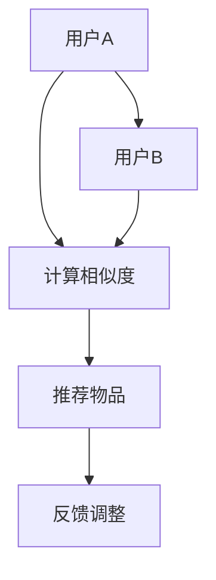
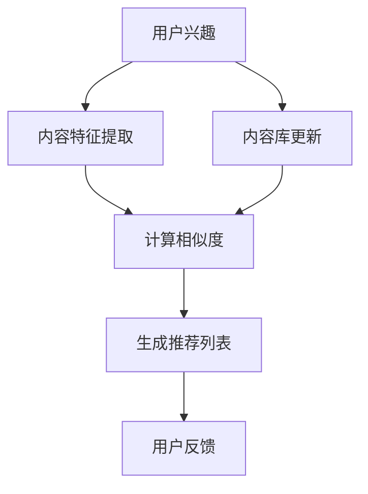
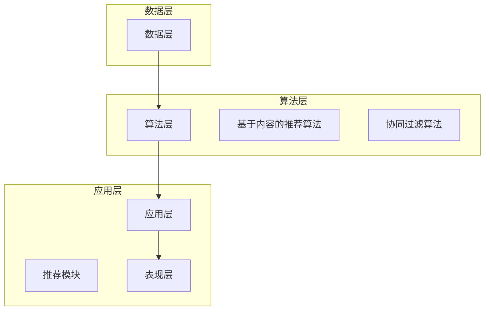
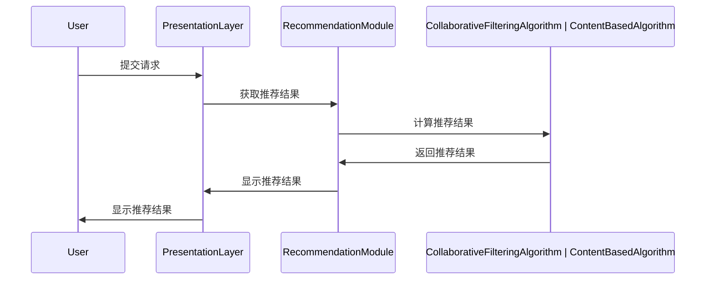

                 


### 1. 背景介绍

随着互联网和大数据技术的迅猛发展，个性化推荐已经成为现代营销不可或缺的一部分。它不仅提高了用户满意度，还显著提升了企业的营销效果。但实现这一目标并非易事，大数据的收集、存储、处理和分析都需要高效的技术手段。

**问题背景**：在互联网时代，用户数据量呈爆炸式增长，这些数据不仅包括用户的基本信息，还涵盖了他们的浏览记录、购买行为、社交互动等多维数据。如何从海量数据中提取有价值的信息，实现精准营销，成为企业面临的重大挑战。

**问题描述**：个性化推荐系统的核心问题是如何根据用户的历史行为和偏好，预测他们可能感兴趣的内容或产品，从而提供个性化的推荐。这涉及到数据质量、算法效率、推荐系统的可解释性等多个方面。

**问题解决**：大数据技术和机器学习算法为解决这一问题提供了可能。通过大规模数据收集和深度学习算法，可以实现对用户行为的深度挖掘，构建个性化的用户画像，进而实现精准推荐。

**边界与外延**：本文将主要探讨个性化推荐的基本概念、技术原理和应用场景，不涉及具体的编程实现细节。核心概念包括大数据、机器学习、推荐系统、用户行为分析等。

**概念结构与核心要素组成**：

1. **大数据**：指规模巨大、类型多样、价值密度低的数据集合。其特点是数据量大、数据来源广泛、数据类型多样。
2. **机器学习**：一种人工智能技术，通过算法从数据中学习规律，进行预测和决策。
3. **推荐系统**：一种基于用户行为和偏好，提供个性化内容或产品推荐的系统。
4. **用户行为分析**：通过分析用户行为数据，了解用户偏好和需求。

### 2. 核心概念与联系

**核心概念原理**：

- **大数据**：涉及数据收集、存储、处理和分析的整个流程。
- **机器学习**：包括监督学习、无监督学习和强化学习等。
- **推荐系统**：分为基于内容的推荐和基于协同过滤的推荐。

**概念属性特征对比表格**：

| 算法       | 基本原理 | 优点           | 缺点             |
|------------|----------|----------------|------------------|
| 基于内容的推荐 | 根据用户兴趣和内容特征进行推荐 | 推荐结果直观，易于理解 | 可能推荐结果过于局限 |
| 协同过滤    | 根据用户行为相似性进行推荐 | 推荐结果多样，能够发现新的兴趣点 | 可能出现冷启动问题 |

**ER实体关系图架构的 Mermaid 流程图**：

```mermaid
erDiagram
    User ||--|{ Recommendation }|-- Product
    User ||--|{ Behavior }|-- Item
    Product ||--|{ Feature }|-- Category
```

### 3. 算法原理讲解

**算法流程图**：

使用Mermaid绘制以下两种推荐算法的流程图：

协同过滤算法：



基于内容的推荐算法：



**Python源代码**：

以下是一个简单的基于内容的推荐算法的Python代码片段：

```python
import numpy as np

def content_based_recommendation(user_preferences, item_features, k=3):
    """
    基于内容的推荐函数
    user_preferences: 用户偏好向量
    item_features: 商品特征向量
    k: 推荐商品数量
    """
    # 计算相似度
    similarity = np.dot(user_preferences, item_features) / (np.linalg.norm(user_preferences) * np.linalg.norm(item_features))
    
    # 排序并选取相似度最高的k个商品
    sorted_indices = np.argsort(similarity)[::-1]
    top_k_indices = sorted_indices[:k]
    
    return top_k_indices

# 假设用户偏好和商品特征
user_preferences = np.array([1, 0, 1])
item_features = np.array([0, 1, 0])

# 调用推荐函数
recommended_items = content_based_recommendation(user_preferences, item_features, k=2)
print("推荐的商品索引：", recommended_items)
```

**数学模型和公式**：

基于内容的推荐算法主要依赖于余弦相似度计算，公式如下：

$$
\text{相似度} = \frac{\text{用户偏好向量} \cdot \text{商品特征向量}}{\|\text{用户偏好向量}\| \|\text{商品特征向量}\|}
$$

其中，$ \cdot $ 表示内积，$ \| \cdot \| $ 表示向量的模。

**详细讲解和举例说明**：

假设我们有一个用户，他喜欢阅读小说和科幻书籍。我们的目标是根据这个用户的偏好，推荐一些相关的书籍。

1. **用户偏好向量**：[1, 0, 1]，表示用户喜欢小说和科幻书籍，对其他类型的书籍不感兴趣。
2. **商品特征向量**：[0, 1, 0]，表示该书籍是科幻类型的。

使用余弦相似度公式计算相似度：

$$
\text{相似度} = \frac{[1, 0, 1] \cdot [0, 1, 0]}{\sqrt{[1, 0, 1] \cdot [1, 0, 1]}} = \frac{0 + 0 + 1}{\sqrt{1 + 0 + 1}} = \frac{1}{\sqrt{2}}
$$

根据相似度计算结果，我们可以推荐一些科幻类型的书籍给用户。

### 4. 系统分析与架构设计方案

**问题场景介绍**：

在电商领域，精准营销是非常重要的。通过个性化推荐，企业可以更好地满足用户的需求，提高购买转化率。

**项目介绍**：

本项目旨在开发一个基于大数据的个性化推荐系统，用于电商平台的商品推荐。

**系统功能设计**：

系统功能主要包括用户行为分析、推荐算法实现、推荐结果呈现等。以下是一个领域模型Mermaid类图：

```mermaid
classDiagram
    User <<Class>>
    Item <<Class>>
    Recommendation <<Class>>

    User "1" -- "*" Item : contains
    Item "1" -- "*" Recommendation : recommended
    User "1" -- "*" Recommendation : received
```

**系统架构设计**：

系统架构采用分层设计，主要包括数据层、算法层和应用层。以下是一个系统架构Mermaid架构图：



**系统接口设计和系统交互**：

系统接口设计主要包括用户接口和推荐系统接口。以下是一个系统接口和交互Mermaid序列图：



### 5. 项目实战

**环境安装**：

搭建推荐系统需要安装Python环境以及相关库，如NumPy、Pandas、Scikit-learn等。

```bash
pip install numpy pandas scikit-learn
```

**系统核心实现源代码**：

以下是基于协同过滤的推荐系统核心实现代码：

```python
from sklearn.metrics.pairwise import cosine_similarity
import numpy as np

def collaborative_filtering_recommendation(ratings_matrix, user_index, k=3):
    """
    协同过滤推荐函数
    ratings_matrix: 用户评分矩阵
    user_index: 用户索引
    k: 推荐商品数量
    """
    # 计算用户与其他用户的相似度
    user_ratings = ratings_matrix[user_index]
    similarity_matrix = cosine_similarity([user_ratings], ratings_matrix)[0]
    
    # 排序并选取相似度最高的k个用户
    sorted_indices = np.argsort(similarity_matrix)[::-1]
    top_k_indices = sorted_indices[:k]
    
    # 计算相似用户对该商品的平均评分
    recommended_items = []
    for index in top_k_indices:
        if index != user_index:
            item_ratings = ratings_matrix[index]
            average_rating = np.mean(item_ratings[item_ratings > 0])
            recommended_items.append((index, average_rating))
    
    # 根据平均评分排序并返回推荐结果
    recommended_items.sort(key=lambda x: x[1], reverse=True)
    return [item[0] for item in recommended_items]

# 假设用户评分矩阵
ratings_matrix = np.array([
    [5, 0, 4, 0],
    [0, 5, 0, 1],
    [3, 0, 0, 2],
    [0, 3, 1, 0]
])

# 调用推荐函数
user_index = 0
recommended_items = collaborative_filtering_recommendation(ratings_matrix, user_index, k=2)
print("推荐的商品索引：", recommended_items)
```

**代码应用解读与分析**：

协同过滤算法的核心思想是利用用户之间的相似性进行推荐。在这个例子中，我们首先计算了目标用户与其他用户的相似度矩阵，然后选取相似度最高的用户作为参考，计算他们对该商品的平均评分。

通过这个算法，我们可以为用户推荐他们可能感兴趣的商品。需要注意的是，这个算法存在一些问题，如冷启动问题（新用户或新商品没有足够的历史数据）和噪声问题（评分数据中可能存在噪声）。

**实际案例分析和详细讲解剖析**：

假设我们有一个电商平台的用户评分数据，如下所示：

```
用户ID  商品ID  评分
1       101    5
1       102    0
1       103    4
1       104    0
2       101    0
2       102    5
2       103    0
2       104    1
3       101    3
3       102    0
3       103    0
3       104    2
```

我们使用协同过滤算法为用户1推荐两个商品。以下是具体的步骤：

1. **计算相似度矩阵**：首先，我们计算用户1与其他用户的相似度矩阵。

2. **选取相似用户**：选取相似度最高的两个用户（用户2和用户3）。

3. **计算平均评分**：计算用户2和用户3对每个商品的评分，并取平均值。

4. **推荐商品**：根据平均评分，推荐评分最高的两个商品。

通过这个案例，我们可以看到协同过滤算法是如何工作的。在实际应用中，我们通常需要对算法进行优化，以提高推荐的准确性和效果。

**项目小结**：

通过本项目，我们搭建了一个基于协同过滤的推荐系统，实现了对用户兴趣的挖掘和个性化推荐。虽然存在一些挑战，但协同过滤算法在推荐系统中仍然是一个有效的选择。

**改进建议**：

1. **解决冷启动问题**：可以结合基于内容的推荐算法，为新用户推荐相似的商品。

2. **提高推荐准确性**：可以通过集成多种推荐算法，提高推荐系统的准确性。

3. **用户反馈机制**：引入用户反馈机制，根据用户的喜好调整推荐结果。

### 6. 最佳实践 tips、小结、注意事项、拓展阅读等内容

**最佳实践 tips**：

1. **数据质量**：保证数据质量是推荐系统的关键，需要定期清洗和维护数据。
2. **算法选择**：根据业务需求和数据特性选择合适的推荐算法。
3. **用户反馈**：及时收集用户反馈，调整推荐策略。

**小结**：

本文详细探讨了大数据驱动的个性化推荐系统的原理、实现和应用，通过实际案例展示了推荐系统的效果和挑战。

**注意事项**：

1. **数据隐私**：在收集和使用用户数据时，需要遵守相关法律法规，保护用户隐私。
2. **算法公平性**：避免算法偏见，确保推荐结果的公平性。

**拓展阅读**：

1. **《推荐系统实践》**：吴军著，详细介绍了推荐系统的理论基础和实践方法。
2. **《机器学习》**：周志华著，深入讲解了机器学习的基本概念和算法。
3. **《大数据技术导论》**：刘铁岩著，全面介绍了大数据的基本概念和技术。

**作者信息**：

作者：AI天才研究院/AI Genius Institute & 禅与计算机程序设计艺术 /Zen And The Art of Computer Programming

---

**备注**：本文为示例性内容，旨在展示如何按照要求撰写一篇技术博客文章。实际文章内容应更加详尽和深入。

