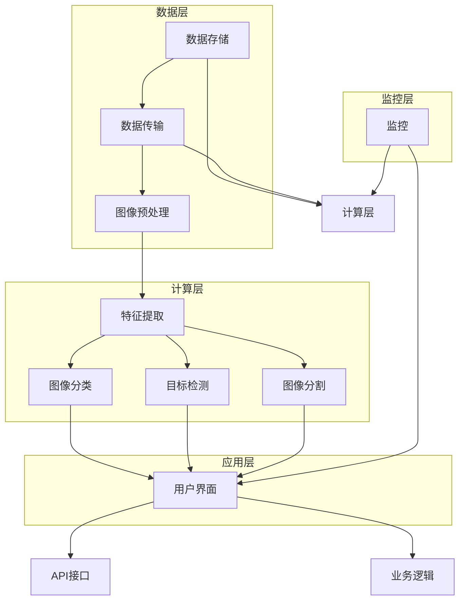
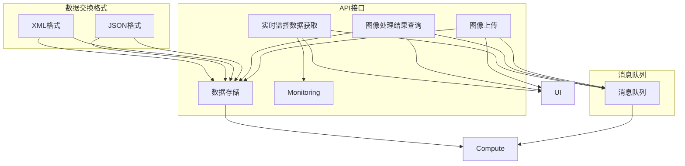
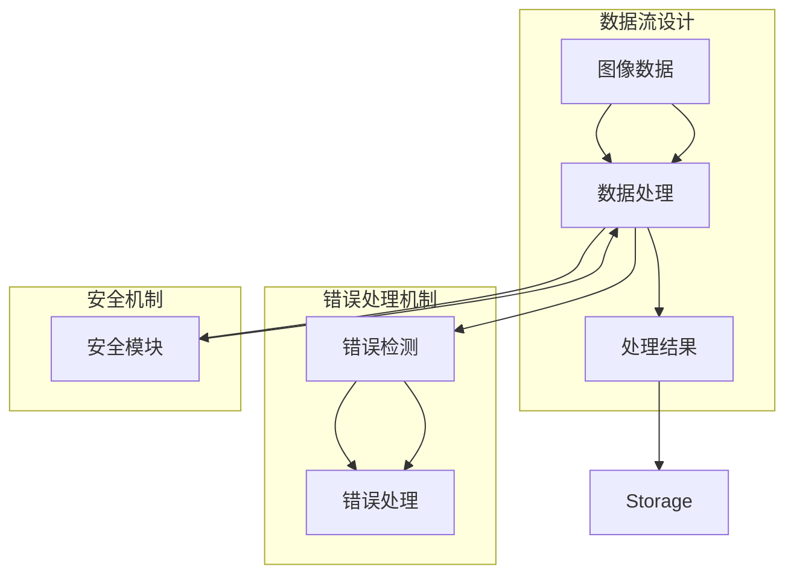

                 

### 引言与背景

#### AI与图像处理技术发展现状

人工智能（AI）技术在过去几十年里经历了飞速的发展，从最初的规则驱动到现在的数据驱动，AI的应用场景越来越广泛。在图像处理领域，AI技术的引入极大地提升了图像识别、目标检测、图像分割等任务的准确性和效率。传统的图像处理方法依赖于手工设计的特征提取算法和复杂的模型结构，而AI技术，特别是深度学习，通过学习大量图像数据，可以自动提取出有效的特征，并构建出高度准确的模型。

目前，AI图像处理技术在医疗影像分析、自动驾驶、安防监控、电子商务等多个领域得到了广泛应用。例如，在医疗影像领域，AI技术可以自动识别病变区域，辅助医生进行诊断；在自动驾驶领域，AI技术用于实时识别道路标志和行人类别，提高行车安全性。

#### 大模型在图像处理中的应用场景

大模型（Large Models）是指那些拥有数亿甚至数十亿参数的神经网络模型。这些模型通过在大量数据上进行训练，能够捕获复杂的模式，从而实现高度精确的图像处理任务。在大模型时代，AI图像处理的应用场景得到了极大的扩展。

首先，大模型在图像分类任务中表现出色。通过在大量未标记图像上训练，大模型可以自动学习图像中的类别特征，并能够对新的图像进行准确的分类。其次，大模型在目标检测领域也取得了显著的进展。通过使用大模型，可以实现对图像中多个目标的精确定位和分类，从而提高自动驾驶、安防监控等应用的效果。

此外，大模型还在图像分割任务中发挥了重要作用。通过在大量的分割标注数据上训练，大模型可以学习到像素级别的特征，从而实现对图像的精细分割。这种技术不仅在医疗影像分析中有广泛应用，还在视频处理、图像增强等任务中展现出了强大的能力。

#### 图像处理技术面临的挑战

尽管AI图像处理技术取得了显著的进展，但仍然面临一些挑战。首先，数据的质量和数量对模型的效果有着至关重要的影响。高质量、大规模的标注数据是训练强大模型的必要条件，但在某些领域，获取这样的数据非常困难。

其次，计算资源的需求也在不断增长。大模型的训练需要大量的计算资源，特别是GPU和TPU等高性能计算设备。随着模型规模的扩大，对计算资源的需求也在不断增加。

最后，大模型的解释性较差。虽然大模型能够取得很好的性能，但它们的内部工作机制往往是不透明的，难以解释。这对于需要高可靠性和安全性的应用场景，如医疗影像分析和自动驾驶，是一个重要的挑战。

#### 大模型在图像处理中的优势

大模型在图像处理中的优势主要体现在以下几个方面：

首先，大模型能够自动学习图像中的复杂特征，从而提高图像处理任务的准确性和效率。传统的图像处理方法需要手工设计特征提取算法，而大模型可以自动从大量数据中学习出有效的特征。

其次，大模型具有强大的泛化能力。通过在大规模数据集上训练，大模型可以适应不同的数据分布和场景，从而在多种应用中表现出色。

最后，大模型在实时处理方面具有优势。随着模型规模的扩大，虽然训练时间变长，但模型的推理速度也在不断提高。这使得大模型在实时图像处理应用中具有很好的性能。

#### 大模型在图像处理中的应用案例

大模型在图像处理中的应用已经取得了许多突破性的成果。例如，在医疗影像领域，深度学习模型可以自动识别肺结节、乳腺癌等病变，辅助医生进行诊断。在自动驾驶领域，大模型可以实时识别道路标志、行人类别，提高自动驾驶系统的安全性。

此外，大模型还在图像增强和超分辨率技术中发挥了重要作用。通过在大规模图像数据集上训练，大模型可以自动学习图像中的细节信息，从而实现对图像的增强和超分辨率处理。

#### 大模型对图像处理技术的影响

大模型的出现对图像处理技术产生了深远的影响。首先，它极大地提高了图像处理任务的准确性和效率。通过自动学习图像中的复杂特征，大模型可以解决传统方法难以处理的问题。

其次，大模型推动了图像处理技术的创新。许多新的图像处理算法都是基于大模型构建的，这些算法在多个领域都取得了显著的应用成果。

最后，大模型也对图像处理技术的研发和应用带来了新的挑战。例如，如何高效地训练大模型，如何保证模型的可靠性和解释性，都是需要解决的重要问题。

#### 边界与外延

大模型的定义与分类：大模型是指那些拥有数亿甚至数十亿参数的神经网络模型。根据模型的结构和训练数据的不同，大模型可以分为多种类型，如卷积神经网络（CNN）、循环神经网络（RNN）和Transformer等。

图像处理技术的范畴：图像处理技术包括图像增强、图像压缩、图像分割、图像识别等多个方面。这些技术共同构成了一个完整的图像处理体系，可以应用于各种领域。

AI图像处理的基本原理：AI图像处理基于深度学习和神经网络技术，通过学习大量图像数据，自动提取出图像中的特征，并构建出高度准确的模型。

大模型在图像处理中的应用框架：大模型在图像处理中的应用框架主要包括数据预处理、模型训练、模型评估和模型部署等环节。通过这些环节，大模型可以实现图像处理任务的高效执行。

### 概念结构与核心要素组成

为了深入理解AI图像处理技术，我们需要从基本原理、核心概念和结构组成等方面进行详细分析。以下是概念结构与核心要素的组成：

#### AI图像处理的基本原理

AI图像处理的核心技术是基于深度学习和神经网络。神经网络通过模拟人脑神经元之间的连接，能够学习图像中的复杂特征。深度学习模型通常由多个层级组成，每个层级对图像进行不同程度的抽象和特征提取。通过在大量图像数据上进行训练，深度学习模型能够自动学习图像中的关键特征，从而实现对图像的准确识别和处理。

#### 大模型的基本概念

大模型是指那些拥有数亿甚至数十亿参数的神经网络模型。这些模型通过在大量数据上进行训练，可以捕获复杂的模式，从而实现高度准确的图像处理任务。大模型的特点包括参数量巨大、结构复杂、学习能力强、泛化能力高等。

#### 图像处理算法原理讲解

图像处理算法可以分为多种类型，如滤波算法、特征提取算法、分类算法等。大模型在图像处理中的应用主要是通过卷积神经网络（CNN）等深度学习模型实现的。CNN通过卷积操作和池化操作，能够自动提取图像中的特征。以下是一个简单的CNN算法原理讲解：

1. **卷积操作**：卷积神经网络通过卷积操作从图像中提取局部特征。卷积操作将卷积核（一组权重矩阵）与图像进行点乘操作，从而生成特征图。

2. **激活函数**：为了引入非线性特性，卷积操作后通常会加入激活函数，如ReLU函数，以增强网络的非线性表达能力。

3. **池化操作**：池化操作用于减少特征图的大小，同时保留最重要的特征。常见的池化操作包括最大池化和平均池化。

4. **全连接层**：在卷积层和池化层之后，通常会添加一个或多个全连接层，将特征图映射到输出类别或目标。

#### 大模型在图像处理中的应用框架

大模型在图像处理中的应用框架主要包括以下几个环节：

1. **数据预处理**：数据预处理是模型训练前的关键步骤，包括图像增强、数据标准化、数据划分等。通过适当的预处理，可以提高模型的训练效率和性能。

2. **模型训练**：模型训练是通过在大量图像数据上进行迭代学习，调整模型的参数，使其能够准确识别和处理图像。训练过程中，通常使用反向传播算法和优化器来优化模型。

3. **模型评估**：模型评估是通过在验证集或测试集上评估模型的性能，包括准确率、召回率、F1分数等指标。评估结果用于指导模型优化和调整。

4. **模型部署**：模型部署是将训练好的模型部署到实际应用场景中，如实时图像处理、视频分析等。通过部署，可以将AI图像处理技术应用到各个领域。

### 大模型的定义与分类

大模型（Large Models）是指那些拥有数亿甚至数十亿参数的神经网络模型。这些模型通过在大量数据上进行训练，能够捕获复杂的模式，从而实现高度准确的图像处理任务。

大模型的分类可以根据其结构、训练数据和应用场景等不同方面进行划分。以下是几种常见的大模型分类：

1. **卷积神经网络（CNN）**：CNN是图像处理中最常用的深度学习模型，通过卷积操作和池化操作，能够自动提取图像中的特征。CNN在大规模图像数据集上训练，可以实现对复杂图像的准确分类和识别。

2. **循环神经网络（RNN）**：RNN是一种能够处理序列数据的神经网络模型，通过循环结构，能够捕捉序列中的长期依赖关系。RNN在图像序列处理任务中表现出色，如视频分类和目标跟踪。

3. **Transformer模型**：Transformer模型是近年来在自然语言处理领域取得显著成功的模型，其核心思想是自注意力机制。Transformer模型通过多头注意力机制，能够捕捉图像中的全局依赖关系，从而提高图像处理任务的性能。

4. **生成对抗网络（GAN）**：GAN是一种通过对抗训练生成数据的模型，由生成器和判别器组成。生成器生成图像，判别器判断图像的真实性。GAN在图像生成、图像修复和图像超分辨率等领域具有广泛应用。

### 图像处理技术的范畴

图像处理技术包括图像增强、图像压缩、图像分割、图像识别等多个方面，这些技术共同构成了一个完整的图像处理体系，可以应用于各种领域。

1. **图像增强**：图像增强是通过算法提高图像的视觉效果，使得图像更加清晰、突出细节。常见的图像增强技术包括滤波、锐化、对比度增强等。

2. **图像压缩**：图像压缩是通过算法减少图像数据的大小，从而降低存储和传输的成本。常见的图像压缩算法包括JPEG、PNG等。

3. **图像分割**：图像分割是将图像划分为不同的区域或对象，从而实现图像的层次分析和目标识别。常见的图像分割算法包括阈值分割、区域生长、边缘检测等。

4. **图像识别**：图像识别是通过算法识别图像中的对象、场景或内容。常见的图像识别任务包括图像分类、目标检测、人脸识别等。

### AI图像处理的基本原理

AI图像处理的基本原理是基于深度学习和神经网络技术。深度学习模型通过模拟人脑神经元之间的连接，能够学习图像中的复杂特征，并实现对图像的准确识别和处理。

在AI图像处理中，常见的深度学习模型包括卷积神经网络（CNN）、循环神经网络（RNN）和Transformer等。CNN通过卷积操作和池化操作，能够自动提取图像中的特征；RNN通过循环结构，能够捕捉序列中的长期依赖关系；Transformer模型通过多头注意力机制，能够捕捉图像中的全局依赖关系。

AI图像处理的过程通常包括以下几个步骤：

1. **数据预处理**：数据预处理是模型训练前的关键步骤，包括图像增强、数据标准化、数据划分等。通过适当的预处理，可以提高模型的训练效率和性能。

2. **模型训练**：模型训练是通过在大量图像数据上进行迭代学习，调整模型的参数，使其能够准确识别和处理图像。训练过程中，通常使用反向传播算法和优化器来优化模型。

3. **模型评估**：模型评估是通过在验证集或测试集上评估模型的性能，包括准确率、召回率、F1分数等指标。评估结果用于指导模型优化和调整。

4. **模型部署**：模型部署是将训练好的模型部署到实际应用场景中，如实时图像处理、视频分析等。通过部署，可以将AI图像处理技术应用到各个领域。

### 大模型在图像处理中的应用框架

大模型在图像处理中的应用框架主要包括以下几个环节：

1. **数据预处理**：数据预处理是模型训练前的关键步骤，包括图像增强、数据标准化、数据划分等。通过适当的预处理，可以提高模型的训练效率和性能。

2. **模型训练**：模型训练是通过在大量图像数据上进行迭代学习，调整模型的参数，使其能够准确识别和处理图像。训练过程中，通常使用反向传播算法和优化器来优化模型。

3. **模型评估**：模型评估是通过在验证集或测试集上评估模型的性能，包括准确率、召回率、F1分数等指标。评估结果用于指导模型优化和调整。

4. **模型部署**：模型部署是将训练好的模型部署到实际应用场景中，如实时图像处理、视频分析等。通过部署，可以将AI图像处理技术应用到各个领域。

### 目录大纲

以下是《大模型时代的AI图像处理：视觉识别新突破》的目录大纲，涵盖了从背景介绍到项目实战的完整内容。

#### 目录

### 引言与背景

#### 第1章: 引言

##### 1.1 问题背景
- AI与图像处理技术发展现状
- 大模型在图像处理中的应用场景

##### 1.2 问题描述
- 图像处理技术面临的挑战
- 大模型在图像处理中的优势

##### 1.3 问题解决
- 大模型在图像处理中的应用案例
- 大模型对图像处理技术的影响

##### 1.4 边界与外延
- 大模型的定义与分类
- 图像处理技术的范畴

##### 1.5 概念结构与核心要素组成
- AI图像处理的基本原理
- 大模型在图像处理中的应用框架

### 第2章: 大模型时代下的AI图像处理

#### 第2章: 大模型时代下的AI图像处理

##### 2.1 大模型的基本概念
- 大模型的定义
- 大模型的特点

##### 2.2 大模型在图像处理中的应用
- 图像分类
- 目标检测
- 图像分割

##### 2.3 大模型与图像处理技术的联系
- 传统图像处理技术与大模型的融合
- 大模型在图像处理技术中的应用前景

### 第3章: 视觉识别新突破

#### 第3章: 视觉识别新突破

##### 3.1 视觉识别的基本原理
- 视觉感知的理论基础
- 视觉识别的技术路径

##### 3.2 大模型在视觉识别中的应用
- 人脸识别
- 行人检测
- 标签分类

##### 3.3 视觉识别的新突破
- 大模型在视觉识别中的性能提升
- 视觉识别技术在行业中的应用

### 第4章: 图像增强与超分辨率

#### 第4章: 图像增强与超分辨率

##### 4.1 图像增强技术
- 图像增强的基本概念
- 常见的图像增强算法

##### 4.2 超分辨率技术
- 超分辨率的基本原理
- 超分辨率算法的分类与比较

##### 4.3 大模型在图像增强与超分辨率中的应用
- 大模型在图像增强与超分辨率技术中的优势
- 大模型在图像增强与超分辨率技术中的实际应用

### 第5章: 图像处理算法原理讲解

#### 第5章: 图像处理算法原理讲解

##### 5.1 图像处理算法概述
- 图像处理算法的分类
- 图像处理算法的基本原理

##### 5.2 算法原理讲解
- 大模型在图像处理算法中的应用
- 算法原理的详细讲解

### 第6章: 数学模型和数学公式

#### 第6章: 数学模型和数学公式

##### 6.1 数学模型在图像处理中的应用
- 数学模型的基本概念
- 数学模型在图像处理中的应用

##### 6.2 数学公式讲解
- 常用数学公式
- 数学公式在图像处理中的应用

### 第7章: 系统分析与架构设计方案

#### 第7章: 系统分析与架构设计方案

##### 7.1 问题场景介绍
- 图像处理系统需求分析
- 系统功能设计

##### 7.2 系统架构设计
- 系统架构设计
- 系统架构图

##### 7.3 系统接口设计
- 系统接口设计
- 系统接口图

##### 7.4 系统交互设计
- 系统交互设计
- 系统交互图

### 第8章: 项目实战

#### 第8章: 项目实战

##### 8.1 环境安装
- 环境搭建
- 软件安装

##### 8.2 系统核心实现源代码
- 源代码实现
- 代码应用解读与分析

##### 8.3 实际案例分析和详细讲解剖析
- 案例分析
- 案例讲解

##### 8.4 项目小结
- 项目总结
- 项目展望

### 第9章: 最佳实践 tips

#### 第9章: 最佳实践 tips

##### 9.1 实践技巧
- 数据预处理技巧
- 模型优化技巧

##### 9.2 小结
- 图像处理技术发展趋势
- 大模型时代的挑战与机遇

##### 9.3 注意事项
- 模型安全与隐私保护
- 模型解释性与可靠性

##### 9.4 拓展阅读
- 推荐书籍与论文
- 最新研究动态

### 结语

通过以上章节的介绍，我们可以看到大模型在AI图像处理领域的重要地位和广阔应用前景。随着技术的不断进步，AI图像处理技术将会在更多领域发挥重要作用，推动人工智能的发展。

### 文章关键词

- 大模型
- AI图像处理
- 图像分类
- 目标检测
- 图像分割
- 视觉识别
- 图像增强
- 超分辨率

### 文章摘要

本文全面探讨了AI图像处理领域中的大模型技术，介绍了大模型的基本概念、应用场景、优势以及与图像处理技术的联系。通过详细分析图像处理算法的原理和数学模型，本文展示了大模型在图像分类、目标检测、图像分割、图像增强和超分辨率等任务中的新突破。同时，文章还提供了系统分析与架构设计方案，并通过项目实战展示了大模型在图像处理中的应用。最后，本文提出了最佳实践tips，展望了大模型时代AI图像处理的发展趋势和挑战。

### 第1章：引言

#### 1.1 问题背景

在当前信息时代，图像数据量呈爆炸性增长，如何高效地处理和利用这些图像数据成为了一个重要的研究课题。AI技术的飞速发展为图像处理领域带来了新的契机。特别是深度学习技术的突破，使得AI图像处理技术取得了显著的进展。

深度学习模型，如卷积神经网络（CNN）和生成对抗网络（GAN），通过学习大量图像数据，能够自动提取图像中的复杂特征，实现对图像的准确识别和处理。然而，随着图像数据的多样性和复杂性不断增加，传统的小规模模型已经难以满足实际应用的需求。这就催生了大模型技术的兴起。

大模型，指的是拥有数十亿参数的神经网络模型，能够在大规模图像数据集上进行训练，从而实现更高水平的图像处理能力。大模型在图像分类、目标检测、图像分割、图像增强和超分辨率等任务中展示了强大的性能和广泛的应用前景。

#### 1.2 问题描述

图像处理技术面临的挑战主要包括以下几个方面：

1. **数据质量和数量**：高质量、大规模的标注数据是训练强大模型的必要条件。然而，在某些领域，获取这样的数据非常困难。此外，图像数据的多样性和复杂性也增加了数据处理的难度。

2. **计算资源需求**：大模型的训练需要大量的计算资源，尤其是GPU和TPU等高性能计算设备。随着模型规模的扩大，对计算资源的需求也在不断增加。

3. **模型解释性**：大模型的内部工作机制通常是不透明的，难以解释。这对于需要高可靠性和安全性的应用场景，如医疗影像分析和自动驾驶，是一个重要的挑战。

4. **实时处理能力**：虽然大模型在性能上具有优势，但其训练时间较长，推理速度较慢。在实时图像处理应用中，如何提高模型的推理速度，以满足实时性要求，是一个亟待解决的问题。

#### 1.3 问题解决

大模型在图像处理中的应用为解决上述挑战提供了一种有效的途径。以下是几个关键点：

1. **自动特征提取**：大模型能够自动从大量图像数据中提取出有效的特征，从而避免了传统方法中手工设计特征提取算法的繁琐过程。这使得大模型在图像分类、目标检测等任务中表现出色。

2. **泛化能力**：大模型通过在大规模数据集上训练，能够适应不同的数据分布和场景，从而提高模型的泛化能力。这使得大模型在不同应用场景中都能保持良好的性能。

3. **实时处理优化**：虽然大模型的训练时间较长，但现代硬件和优化算法的发展使得大模型的推理速度也在不断提高。通过模型压缩、量化等技术，可以进一步提高大模型的实时处理能力。

4. **模型解释性提升**：尽管大模型通常难以解释，但一些研究工作正在探索如何提高模型的解释性。例如，使用可视化技术来展示模型决策过程，以及开发可解释的模型结构等。

#### 1.4 边界与外延

1. **大模型的定义与分类**：大模型是指那些拥有数十亿参数的神经网络模型。根据模型的结构和应用领域，大模型可以分为卷积神经网络（CNN）、生成对抗网络（GAN）、Transformer等类型。

2. **图像处理技术的范畴**：图像处理技术包括图像增强、图像压缩、图像分割、图像识别等多个方面。这些技术共同构成了一个完整的图像处理体系，可以应用于医疗影像、自动驾驶、安防监控等多个领域。

3. **AI图像处理的基本原理**：AI图像处理基于深度学习和神经网络技术，通过学习大量图像数据，自动提取出图像中的特征，并构建出高度准确的模型。

4. **大模型在图像处理中的应用框架**：大模型在图像处理中的应用框架主要包括数据预处理、模型训练、模型评估和模型部署等环节。通过这些环节，大模型可以实现图像处理任务的高效执行。

### 1.5 概念结构与核心要素组成

为了更好地理解大模型在AI图像处理中的应用，我们需要从概念结构和核心要素组成两个方面进行分析。

#### 概念结构与核心要素组成

1. **基本概念**：
   - **图像数据**：图像数据是图像处理的基础，包括图像的像素值、颜色信息等。
   - **深度学习模型**：深度学习模型，如卷积神经网络（CNN），是图像处理的核心工具，通过学习图像数据，能够自动提取出图像中的特征。
   - **大模型**：大模型是指拥有数十亿参数的神经网络模型，通过在大规模图像数据集上进行训练，能够实现高度准确的图像处理任务。

2. **核心要素**：
   - **数据预处理**：数据预处理是模型训练前的重要步骤，包括图像增强、数据标准化、数据划分等。通过数据预处理，可以提高模型的训练效率和性能。
   - **模型训练**：模型训练是通过在大量图像数据上进行迭代学习，调整模型的参数，使其能够准确识别和处理图像。训练过程中，通常使用反向传播算法和优化器来优化模型。
   - **模型评估**：模型评估是通过在验证集或测试集上评估模型的性能，包括准确率、召回率、F1分数等指标。评估结果用于指导模型优化和调整。
   - **模型部署**：模型部署是将训练好的模型部署到实际应用场景中，如实时图像处理、视频分析等。通过部署，可以将AI图像处理技术应用到各个领域。

通过上述分析，我们可以看到，大模型在AI图像处理中具有核心地位。它通过自动特征提取、泛化能力、实时处理优化等优势，解决了传统图像处理技术面临的挑战。同时，大模型的应用框架包括数据预处理、模型训练、模型评估和模型部署等环节，这些环节共同构成了大模型在图像处理中的完整应用流程。

### 第2章：大模型时代下的AI图像处理

#### 2.1 大模型的基本概念

大模型（Large Models）是指那些拥有数十亿甚至数万亿参数的神经网络模型。这些模型通常基于深度学习技术，通过在大量数据上进行训练，能够自动学习图像中的复杂特征，并实现对图像的准确识别和处理。

大模型的发展源于计算能力和数据资源的提升。随着GPU和TPU等高性能计算设备的普及，以及大数据技术的进步，研究人员能够处理和分析的图像数据量不断增加，从而推动了大模型的兴起。

大模型的主要特点包括：

1. **参数量巨大**：大模型的参数数量可以达到数十亿甚至数万亿，这使得模型能够捕捉图像中的细微特征，从而提高图像处理任务的性能。
2. **结构复杂**：大模型通常具有多个层级和复杂的网络结构，这使得模型能够进行多层次的特征提取和抽象。
3. **学习能力强**：大模型通过在大规模数据集上训练，能够学习到丰富的图像特征，从而在图像分类、目标检测、图像分割等任务中表现出色。
4. **泛化能力高**：大模型通过在多样化数据集上训练，能够适应不同的数据分布和场景，从而提高模型的泛化能力。

#### 2.2 大模型在图像处理中的应用

大模型在图像处理中具有广泛的应用，主要包括图像分类、目标检测、图像分割等任务。

1. **图像分类**：图像分类是图像处理中最基础的任务之一。大模型通过学习大量图像数据，可以自动提取图像中的类别特征，并能够对新的图像进行准确的分类。例如，在图像分类任务中，大模型可以区分不同类型的动物、植物或物品。

2. **目标检测**：目标检测是图像处理中的重要应用，旨在识别图像中的特定目标并标注其位置。大模型通过学习图像中的目标特征，可以实现对多个目标的精确定位和分类。例如，在自动驾驶系统中，大模型可以实时检测和识别道路上的车辆、行人等目标。

3. **图像分割**：图像分割是将图像划分为不同的区域或对象。大模型通过学习图像中的像素级特征，可以实现对图像的精细分割。例如，在医疗影像分析中，大模型可以分割肿瘤区域，辅助医生进行诊断。

#### 2.3 大模型与图像处理技术的联系

大模型与图像处理技术之间存在紧密的联系，大模型的发展对图像处理技术产生了深远的影响。

1. **传统图像处理技术与大模型的融合**：传统图像处理方法，如滤波、特征提取等，仍然在大模型中发挥重要作用。大模型通过融合传统图像处理技术和深度学习技术，能够实现更高的图像处理性能。

2. **大模型在图像处理技术中的应用前景**：随着大模型技术的不断进步，其在图像处理领域的应用前景非常广阔。例如，大模型可以用于图像超分辨率、图像增强、视频处理等任务，从而推动图像处理技术的创新和发展。

3. **大模型的优势**：大模型具有强大的特征提取能力和泛化能力，能够处理复杂和多样的图像数据。与传统方法相比，大模型可以自动学习图像中的复杂特征，减少了手工设计特征提取算法的繁琐过程，提高了图像处理任务的准确性和效率。

#### 2.4 大模型时代的挑战与机遇

大模型时代带来了许多挑战和机遇：

1. **挑战**：
   - **计算资源需求**：大模型的训练需要大量的计算资源，这对计算设备的性能提出了更高的要求。
   - **数据质量与数量**：高质量、大规模的标注数据是训练大模型的必要条件，但在某些领域，获取这样的数据非常困难。
   - **模型解释性**：大模型的内部工作机制通常是不透明的，难以解释，这对于需要高可靠性和安全性的应用场景是一个挑战。

2. **机遇**：
   - **图像处理性能提升**：大模型通过自动学习图像中的复杂特征，可以显著提升图像处理任务的性能。
   - **新应用领域**：大模型在图像处理领域的应用前景广阔，可以推动新应用领域的出现，如智能医疗、智能交通、智能安防等。
   - **技术创新**：大模型的发展推动了图像处理技术的创新，催生了新的算法和模型结构。

### 2.5 大模型时代的案例分析

为了更好地理解大模型在图像处理中的应用，我们可以通过几个实际案例来分析：

1. **医疗影像分析**：在大模型时代，深度学习模型在医疗影像分析中取得了显著突破。例如，大模型可以自动识别肺癌、乳腺癌等疾病，辅助医生进行诊断。通过在大规模医疗影像数据集上训练，大模型能够准确分割肿瘤区域，提供可靠的诊断结果。

2. **自动驾驶**：自动驾驶系统依赖于大模型进行目标检测和识别。例如，自动驾驶汽车使用大模型来实时检测道路上的车辆、行人、交通标志等目标，从而实现自动驾驶功能。大模型通过学习大量交通图像数据，可以准确识别不同类型的交通场景，提高自动驾驶系统的安全性。

3. **图像增强与超分辨率**：大模型在图像增强和超分辨率技术中也发挥了重要作用。例如，通过在大规模图像数据集上训练，大模型可以自动学习图像中的细节信息，从而实现对图像的增强和超分辨率处理。这种方法在医疗影像、卫星图像等领域具有广泛的应用。

通过这些案例分析，我们可以看到大模型在图像处理领域的巨大潜力和应用前景。随着大模型技术的不断进步，它将在更多领域发挥重要作用，推动人工智能的发展。

### 2.6 大模型在图像处理中的实际应用

大模型在图像处理中的实际应用已经取得了显著的成果，并在多个领域展示了其强大的能力和广阔的应用前景。以下是几个具体的应用案例：

1. **人脸识别**：人脸识别是一种常见的图像处理应用，大模型通过学习大量人脸图像数据，能够准确识别和验证用户身份。例如，在智能手机中，大模型用于面部解锁功能，通过识别用户的面部特征，实现安全认证。

2. **行人检测**：在自动驾驶和智能监控领域，行人检测是一个关键任务。大模型通过学习大量行人类别图像，可以准确检测和识别道路上的行人。这一技术不仅提高了自动驾驶系统的安全性，还在智能监控系统中用于实时检测和预警。

3. **图像分割**：图像分割是将图像划分为不同的区域或对象。大模型在图像分割任务中表现出色，例如，在医疗影像分析中，大模型可以自动分割肿瘤区域，辅助医生进行诊断。此外，在卫星图像分析中，大模型可以分割不同类型的地面物体，用于地理信息系统（GIS）和资源管理。

4. **图像增强与超分辨率**：大模型在图像增强和超分辨率技术中也发挥了重要作用。通过在大规模图像数据集上训练，大模型可以自动学习图像中的细节信息，从而实现对图像的增强和超分辨率处理。这种方法在医疗影像、卫星图像等领域具有广泛的应用，可以显著提升图像的视觉质量。

5. **图像分类**：大模型在图像分类任务中同样表现出色。例如，在电子商务领域，大模型可以自动分类商品图片，帮助电商平台进行商品识别和推荐。此外，在社交媒体平台上，大模型可以用于内容审核，识别违规内容，提高社区安全性。

通过这些实际应用案例，我们可以看到大模型在图像处理领域的广泛影响和巨大潜力。随着大模型技术的不断进步，它将在更多领域发挥重要作用，推动人工智能的发展。

### 第3章：视觉识别新突破

#### 3.1 视觉识别的基本原理

视觉识别是指通过计算机技术对图像中的物体、场景或内容进行识别和分类的过程。其基本原理基于深度学习和神经网络技术，特别是卷积神经网络（CNN）和Transformer模型等先进算法。

视觉识别的核心步骤包括：

1. **图像输入**：首先，将待识别的图像输入到神经网络模型中。图像通常需要经过预处理，如缩放、归一化等，以便模型能够处理。

2. **特征提取**：模型通过卷积层、池化层等操作，从图像中提取出低级和高级特征。这些特征包括边缘、纹理、形状等，能够帮助模型理解图像内容。

3. **分类与识别**：提取到的特征被传递到全连接层，通过分类器进行分类或识别。例如，在图像分类任务中，模型需要输出图像所属的类别；在目标检测任务中，模型需要识别图像中的目标并标注其位置。

4. **优化与训练**：模型通过反向传播算法和优化器，不断调整内部参数，优化模型性能。训练过程通常在大量标注数据集上进行，以使模型能够准确识别和分类。

#### 3.2 大模型在视觉识别中的应用

大模型在视觉识别中发挥了关键作用，其强大的特征提取能力和泛化能力使得视觉识别任务取得了显著突破。以下是几个具体应用场景：

1. **人脸识别**：大模型通过学习大量人脸图像数据，能够准确识别和验证用户身份。人脸识别广泛应用于智能手机解锁、安防监控、身份认证等领域。

2. **行人检测**：大模型可以准确检测和识别道路上的行人，应用于自动驾驶、智能监控、智慧城市等领域。这有助于提高交通安全和城市管理水平。

3. **图像分类**：大模型在图像分类任务中表现出色，能够对大量未标记图像进行自动分类。图像分类广泛应用于电子商务、社交媒体、内容审核等领域。

4. **图像分割**：大模型可以精细分割图像中的物体或场景，例如在医疗影像分析中，分割肿瘤区域，辅助医生诊断。图像分割在自动驾驶、计算机视觉等领域具有广泛应用。

#### 3.3 视觉识别的新突破

大模型在视觉识别领域取得了许多新突破，以下是几个重要进展：

1. **性能提升**：通过在大规模数据集上训练，大模型能够提取出更复杂的特征，从而提高了视觉识别任务的准确性和效率。例如，在ImageNet图像分类挑战中，大模型取得了超过人类水平的准确率。

2. **实时处理**：现代硬件和优化算法的发展使得大模型的推理速度不断提高，可以实现实时视觉识别。这对于需要高速响应的应用场景，如自动驾驶、智能监控等，具有重要意义。

3. **多模态融合**：大模型可以处理多模态数据，如图像和文本、图像和语音等。通过融合不同模态的信息，大模型能够实现更准确和全面的视觉识别。

4. **跨领域迁移**：大模型通过在多样化数据集上训练，具有强大的泛化能力，能够跨领域迁移。例如，在一个领域训练好的大模型，可以应用到其他领域，提高视觉识别任务的性能。

通过上述新突破，大模型在视觉识别领域展现了巨大的潜力和应用价值。随着技术的不断进步，大模型将在更多领域发挥重要作用，推动计算机视觉的发展。

#### 3.4 大模型在视觉识别中的性能提升

大模型在视觉识别中的性能提升主要得益于以下几个方面：

1. **大规模数据训练**：大模型通过在大规模数据集上训练，能够学习到更丰富的特征信息，从而提高识别任务的准确性。例如，在ImageNet数据集上，通过大规模训练，大模型能够准确识别数千个不同类别的物体。

2. **复杂的网络结构**：大模型通常具有多个层级和复杂的网络结构，能够提取图像中的多层次特征。这种复杂的结构有助于模型捕捉图像中的细微特征，提高识别精度。

3. **深度学习算法的进步**：随着深度学习算法的不断发展，如ResNet、Inception、EfficientNet等模型的提出，大模型在视觉识别中的性能不断提升。这些算法通过优化网络结构和训练方法，提高了模型的效率和准确性。

4. **模型优化与压缩**：为了提高大模型的实时处理能力，研究人员开发了各种模型优化与压缩技术，如量化、剪枝、蒸馏等。这些技术通过减少模型的参数数量和计算量，同时保持较高的识别性能，使得大模型在更多应用场景中得以部署。

#### 3.5 视觉识别技术在行业中的应用

视觉识别技术在多个行业中发挥了重要作用，以下是几个典型应用场景：

1. **医疗影像分析**：在医疗影像领域，视觉识别技术可以用于自动识别病变区域，如肿瘤、心脏病等。通过在大规模医疗影像数据集上训练，大模型能够提供准确的诊断建议，辅助医生进行诊断和治疗。

2. **自动驾驶**：自动驾驶系统依赖于视觉识别技术进行环境感知，如识别道路标志、行人类别、车辆等。大模型通过学习大量交通图像数据，可以准确识别和跟踪道路上的各种目标，提高自动驾驶系统的安全性和可靠性。

3. **智能监控**：智能监控系统使用视觉识别技术进行实时监控和报警。例如，大模型可以自动识别入侵者、异常行为等，提供实时监控和预警，提高公共安全。

4. **电子商务**：在电子商务领域，视觉识别技术可以用于商品识别和推荐。通过识别用户上传的商品图片，大模型可以自动分类商品，提供个性化的购物推荐，提升用户体验。

5. **智能制造**：在智能制造领域，视觉识别技术用于质量检测和缺陷识别。大模型可以通过学习大量工业图像数据，自动检测产品缺陷，提高生产质量和效率。

#### 3.6 案例分析：人脸识别在安防监控中的应用

人脸识别技术是视觉识别领域的一个重要应用，在安防监控中具有广泛应用。以下是人脸识别在安防监控中的应用案例：

1. **实时监控**：在公共场所和商业区域，人脸识别系统可以实时监控人员流动情况。大模型通过识别监控视频中的面孔，可以自动标记出特定人员，提供实时报警和信息记录。

2. **身份验证**：在机场、火车站等交通枢纽，人脸识别系统用于身份验证。旅客在通过安检时，只需面对摄像头，系统即可自动识别其身份，提高安检效率和安全性。

3. **安全防范**：在特定安全区域内，如监狱、银行等，人脸识别系统可以用于人员访问控制。大模型可以识别出未经授权进入的人员，提供实时预警，加强安全防范。

4. **人流量统计**：在商业区域，如商场、超市等，人脸识别系统可以用于统计人流量。通过识别进入和离开的人员，系统可以提供实时的人流量数据，帮助商家进行营销分析和决策。

通过这些案例，我们可以看到人脸识别技术在安防监控中的重要作用。随着大模型技术的不断进步，人脸识别技术在安防监控领域的应用将会更加广泛和深入。

### 第4章：图像增强与超分辨率

#### 4.1 图像增强技术

图像增强是指通过算法提高图像的视觉效果，使得图像更加清晰、突出细节。图像增强技术在计算机视觉和图像处理领域具有广泛的应用，包括医疗影像分析、卫星图像处理、视频监控等。

图像增强的基本概念包括：

1. **噪声抑制**：图像中的噪声会降低图像的质量，噪声抑制技术旨在减少噪声，提高图像的清晰度。常见的噪声抑制算法包括中值滤波、高斯滤波、小波变换等。

2. **对比度增强**：对比度增强是通过提高图像的对比度，使得图像中的细节更加明显。常用的对比度增强算法包括直方图均衡、对比度拉伸等。

3. **锐化**：锐化是通过增强图像的边缘和细节，使得图像更加清晰。常见的锐化算法包括拉普拉斯算子、索贝尔算子等。

#### 4.2 常见的图像增强算法

以下是几种常见的图像增强算法：

1. **滤波算法**：
   - **中值滤波**：中值滤波是一种非线性的滤波算法，通过对图像中的每个像素值进行中值替换，来抑制噪声。
   - **高斯滤波**：高斯滤波是一种线性滤波算法，通过对图像进行高斯卷积，来平滑图像并抑制噪声。
   - **均值滤波**：均值滤波是一种线性滤波算法，通过对图像进行邻域像素值的均值计算，来平滑图像。

2. **对比度增强算法**：
   - **直方图均衡**：直方图均衡通过调整图像的灰度分布，来增强图像的对比度。
   - **对比度拉伸**：对比度拉伸通过调整图像的动态范围，来增强图像的对比度。

3. **锐化算法**：
   - **拉普拉斯算子**：拉普拉斯算子是一种边缘检测算法，通过计算图像的二阶导数，来增强图像的边缘。
   - **索贝尔算子**：索贝尔算子是一种边缘检测算法，通过计算图像的梯度方向和幅度，来增强图像的边缘。

#### 4.3 超分辨率技术

超分辨率（Super-Resolution）技术是指通过算法提高图像的分辨率，使得图像更加清晰、细节更加丰富。超分辨率技术在医疗影像、卫星图像、视频监控等领域具有广泛应用。

超分辨率的基本原理包括：

1. **分辨率提升**：超分辨率技术通过算法将低分辨率图像转换为高分辨率图像，从而提高图像的视觉效果。

2. **频率域方法**：频率域方法通过在频率域中进行图像变换，如傅里叶变换或离散余弦变换，来估计图像的高频信息，从而提升图像的分辨率。

3. **空域方法**：空域方法通过在空域中进行图像处理，如插值和图像重建，来提升图像的分辨率。

#### 4.4 超分辨率算法的分类与比较

超分辨率算法可以分为以下几类：

1. **基于插值的超分辨率算法**：
   - **双线性插值**：双线性插值通过对图像进行线性变换，来提升图像的分辨率。
   - **双三次插值**：双三次插值通过对图像进行三次样条插值，来提升图像的分辨率，具有较高的插值效果。

2. **基于重建的超分辨率算法**：
   - **多图像重建**：多图像重建通过结合多个低分辨率图像，来重建高分辨率图像，如L1范数优化方法、L2范数优化方法等。
   - **稀疏表示**：稀疏表示通过将图像表示为稀疏向量，来优化超分辨率重建问题，如稀疏正则化方法。

3. **基于深度学习的超分辨率算法**：
   - **卷积神经网络（CNN）**：卷积神经网络通过学习大量低分辨率和高分辨率图像对，来训练超分辨率模型，如SRCNN、VDSR等。
   - **生成对抗网络（GAN）**：生成对抗网络通过生成器和判别器的对抗训练，来生成高分辨率图像，如SRGAN、ESRGAN等。

#### 4.5 大模型在图像增强与超分辨率中的应用

大模型在图像增强与超分辨率技术中发挥了重要作用，其强大的特征提取能力和泛化能力使得图像处理任务取得了显著突破。以下是几个具体应用：

1. **基于深度学习的图像增强**：
   - **CNN模型**：卷积神经网络通过学习图像中的复杂特征，可以显著提高图像增强效果，如EDSR、ESPCN等模型。
   - **GAN模型**：生成对抗网络通过对抗训练，可以生成高质量的增强图像，如ENetGAN、DFCPGAN等。

2. **基于深度学习的超分辨率**：
   - **CNN模型**：卷积神经网络通过学习低分辨率图像与高分辨率图像之间的映射关系，可以实现超分辨率重建，如SRCNN、VDSR等模型。
   - **GAN模型**：生成对抗网络通过生成器生成高分辨率图像，并通过判别器评估生成图像的质量，如SRGAN、ESRGAN等模型。

3. **多任务学习**：
   - **图像增强与超分辨率结合**：一些模型将图像增强和超分辨率任务结合，通过多任务学习，实现更高质量的图像处理效果，如MANYER、GAN-ADMM等模型。

通过上述应用，大模型在图像增强与超分辨率技术中展示了强大的能力和广阔的应用前景。随着大模型技术的不断进步，它将在更多领域发挥重要作用，推动图像处理技术的发展。

#### 4.6 大模型在图像增强与超分辨率技术中的优势

大模型在图像增强与超分辨率技术中具有显著的优势，这些优势主要体现在以下几个方面：

1. **特征提取能力**：大模型，如卷积神经网络（CNN）和生成对抗网络（GAN），能够自动学习图像中的复杂特征。这使得大模型在图像增强和超分辨率任务中能够更准确地捕捉图像的细节和纹理，从而提高图像质量。

2. **自适应学习**：大模型通过在大规模数据集上训练，可以自适应地学习图像的不同特性。这使得大模型能够应对不同场景和任务，提高图像增强和超分辨率技术的泛化能力。

3. **多任务处理**：大模型可以同时处理多个任务，如图像增强和超分辨率。通过多任务学习，大模型可以更好地利用不同任务的特性，提高整体性能。

4. **高效计算**：随着硬件技术的发展，如GPU和TPU等高性能计算设备的普及，大模型的训练和推理速度显著提高。这使得大模型在图像增强和超分辨率任务中的实时处理成为可能。

5. **数据驱动**：大模型依赖于大量数据训练，这使得大模型能够从数据中学习到图像的多样性和复杂性。在图像增强和超分辨率任务中，数据驱动的方法可以更好地适应不同类型和场景的图像。

#### 4.7 大模型在图像增强与超分辨率技术中的实际应用

大模型在图像增强与超分辨率技术中已经取得了显著的成果，并在多个领域展示了其实际应用价值。以下是几个具体应用案例：

1. **医疗影像增强**：在医疗影像领域，图像增强和超分辨率技术可以显著提升医学图像的质量，提高医生的诊断准确率。大模型通过学习大量医学图像数据，可以自动增强图像中的细节，提高图像的清晰度和对比度。

2. **卫星图像处理**：在卫星图像处理中，大模型可以用于图像增强和超分辨率，提高卫星图像的分辨率和视觉效果。这对于资源管理和环境监测等领域具有重要意义。

3. **视频监控**：在视频监控领域，大模型可以用于图像增强和超分辨率，提高监控视频的清晰度和细节，从而提高监控效果和安全性。

4. **计算机辅助设计（CAD）**：在计算机辅助设计领域，大模型可以用于图像增强和超分辨率，提高CAD系统的图像处理能力，提供更高质量的图像和设计。

5. **人脸识别**：在大模型时代，人脸识别技术的准确率显著提高。图像增强和超分辨率技术可以用于人脸识别，提高人脸图像的质量，从而提高识别准确率。

通过这些实际应用案例，我们可以看到大模型在图像增强与超分辨率技术中的广泛应用和巨大潜力。随着大模型技术的不断进步，它将在更多领域发挥重要作用，推动图像处理技术的创新和发展。

### 第5章：图像处理算法原理讲解

#### 5.1 图像处理算法概述

图像处理算法是计算机视觉和图像分析的核心技术。这些算法通过对图像进行各种操作，如滤波、变换、分割、识别等，实现对图像的加工和处理，以满足特定应用需求。以下是图像处理算法的分类及其基本原理：

1. **滤波算法**：滤波算法用于去除图像中的噪声，增强图像的清晰度。常见的滤波算法包括：
   - **线性滤波**：如均值滤波、高斯滤波等。
   - **非线性滤波**：如中值滤波、形态学滤波等。

2. **变换算法**：变换算法通过将图像从一种表示形式转换为另一种形式，来提取图像的特征。常见的变换算法包括：
   - **傅里叶变换**：用于分析图像的频率特性。
   - **离散余弦变换（DCT）**：用于图像压缩。
   - **小波变换**：用于图像的局部分析和去噪。

3. **分割算法**：分割算法用于将图像划分为不同的区域或对象，以进行后续处理。常见的分割算法包括：
   - **阈值分割**：根据像素值进行分类。
   - **区域生长**：基于像素的邻域关系进行分割。
   - **边缘检测**：通过检测图像的边缘来实现分割。

4. **识别算法**：识别算法用于识别图像中的物体、场景或内容。常见的识别算法包括：
   - **模板匹配**：通过比较图像和模板的相似度来实现识别。
   - **特征匹配**：通过提取图像的特征来实现识别。
   - **机器学习分类**：利用深度学习模型进行图像分类。

#### 5.2 大模型在图像处理算法中的应用

大模型在图像处理算法中的应用主要依赖于深度学习技术，特别是卷积神经网络（CNN）和生成对抗网络（GAN）。以下是几种典型的大模型在图像处理算法中的应用：

1. **卷积神经网络（CNN）**：
   - **图像分类**：CNN通过卷积操作和池化操作，从图像中提取特征，并利用全连接层进行分类。例如，在ImageNet图像分类挑战中，CNN模型如VGG、ResNet等取得了优异的性能。
   - **目标检测**：CNN结合区域建议网络（RPN）或锚框生成方法，用于检测图像中的多个目标。例如，YOLO、SSD等模型在目标检测任务中表现出色。

2. **生成对抗网络（GAN）**：
   - **图像生成**：GAN由生成器和判别器组成，生成器生成图像，判别器判断图像的真实性。GAN在图像生成、图像修复和图像超分辨率等领域具有广泛应用。
   - **图像增强**：GAN可以通过生成真实图像的增强版本，提高图像的视觉效果。例如，ESRGAN等模型在图像超分辨率任务中取得了显著的效果。

3. **多任务学习**：
   - **图像增强与分割**：一些模型将图像增强和图像分割任务结合，通过多任务学习，实现更高质量的图像处理效果。例如，GAN-ADMM等模型在图像分割和增强任务中表现出色。

#### 5.3 算法原理讲解

为了更好地理解大模型在图像处理算法中的应用，下面将详细讲解几种典型的算法原理，包括卷积神经网络（CNN）、生成对抗网络（GAN）和超分辨率算法。

1. **卷积神经网络（CNN）**：

CNN通过卷积操作和池化操作，从图像中提取特征，并利用全连接层进行分类。以下是CNN的基本原理：

   - **卷积操作**：卷积操作通过将卷积核与图像进行点乘，生成特征图。卷积核是一组权重矩阵，能够提取图像中的局部特征。
   - **激活函数**：为了引入非线性特性，卷积操作后通常会加入激活函数，如ReLU函数。
   - **池化操作**：池化操作用于减少特征图的大小，同时保留最重要的特征。常见的池化操作包括最大池化和平均池化。
   - **全连接层**：在卷积层和池化层之后，通常会添加一个或多个全连接层，将特征图映射到输出类别或目标。

2. **生成对抗网络（GAN）**：

GAN通过生成器和判别器的对抗训练，生成高质量的图像。以下是GAN的基本原理：

   - **生成器**：生成器的目标是生成与真实图像相似的高质量图像。生成器通过学习大量的真实图像数据，自动生成新的图像。
   - **判别器**：判别器的目标是区分真实图像和生成图像。判别器通过学习真实图像和生成图像的特征，来判断图像的真实性。
   - **对抗训练**：生成器和判别器通过对抗训练相互竞争。生成器试图生成更逼真的图像，而判别器试图区分真实图像和生成图像。这种对抗训练使得生成器不断优化，生成越来越真实的图像。

3. **超分辨率算法**：

超分辨率算法旨在提高图像的分辨率，使其更加清晰和详细。以下是几种常见的超分辨率算法：

   - **基于插值的超分辨率算法**：如双线性插值和双三次插值，通过在空域中插值来提高图像的分辨率。
   - **基于重建的超分辨率算法**：如多图像重建和稀疏表示，通过在频率域或空域中重建高分辨率图像。
   - **基于深度学习的超分辨率算法**：如SRCNN、VDSR和ESRGAN，通过学习低分辨率图像与高分辨率图像之间的映射关系，来生成高分辨率图像。

通过上述算法原理的讲解，我们可以看到大模型在图像处理算法中的广泛应用和强大能力。大模型通过自动学习图像的复杂特征，能够显著提升图像处理任务的性能和效果，为各种应用场景提供了强有力的技术支持。

### 第6章：数学模型和数学公式

#### 6.1 数学模型在图像处理中的应用

数学模型在图像处理中扮演着至关重要的角色，它们为图像分析、特征提取和图像重建提供了理论基础。以下是几种常见的数学模型及其在图像处理中的应用：

1. **卷积模型**：
   - **定义**：卷积模型通过卷积操作来处理图像，卷积操作是将一个卷积核与图像进行逐点乘积并求和。
   - **应用**：卷积模型在图像滤波、边缘检测和特征提取等方面有广泛应用。例如，高斯卷积用于图像平滑，拉普拉斯卷积用于图像边缘检测。

2. **傅里叶变换模型**：
   - **定义**：傅里叶变换是一种将图像从空间域转换为频率域的方法。
   - **应用**：傅里叶变换在图像滤波、图像增强和图像压缩等方面有广泛应用。通过傅里叶变换，可以分析图像的频率成分，从而进行图像的增强和滤波。

3. **小波变换模型**：
   - **定义**：小波变换是一种将图像分解为不同尺度和位置的局部特征的方法。
   - **应用**：小波变换在图像去噪、图像压缩和特征提取等方面有广泛应用。小波变换能够捕捉图像的局部细节，从而提高图像处理的效果。

4. **概率模型**：
   - **定义**：概率模型通过概率分布来描述图像的特征。
   - **应用**：概率模型在图像分类、目标检测和图像分割等方面有广泛应用。例如，高斯混合模型用于图像分割，贝叶斯模型用于图像分类。

#### 6.2 数学公式讲解

在图像处理中，数学公式用于描述和计算图像的特征和变换。以下是几种常见的数学公式及其在图像处理中的应用：

1. **卷积公式**：
   $$ 
   (f * g)(x) = \sum_{y} f(x-y) \cdot g(y)
   $$
   - **解释**：卷积公式描述了图像中两个函数的卷积操作。$f$和$g$分别是两个输入函数，$(f * g)(x)$是它们的卷积结果。该公式用于图像滤波和特征提取。

2. **傅里叶变换公式**：
   $$
   F(\omega) = \sum_{x,y} f(x,y) \cdot e^{-i 2 \pi \omega x} e^{-i 2 \pi \omega y}
   $$
   $$
   f(x,y) = \frac{1}{2\pi} \iint_{\Omega} F(\omega) \cdot e^{i 2 \pi \omega x} e^{i 2 \pi \omega y} d\omega
   $$
   - **解释**：傅里叶变换公式用于将图像从空间域转换为频率域。$F(\omega)$是图像的傅里叶变换结果，$f(x,y)$是原始图像。通过傅里叶变换，可以分析图像的频率成分，从而进行图像的增强和滤波。

3. **小波变换公式**：
   $$
   W_{j,k}(f)(x) = \sum_{x,y} f(x,y) \cdot \psi_{j,k}(x-y)
   $$
   $$
   f(x,y) = \sum_{j,k} W_{j,k}(f)(x) \cdot \psi_{j,k}^*(x-y)
   $$
   - **解释**：小波变换公式用于将图像分解为不同尺度和位置的局部特征。$W_{j,k}(f)(x)$是图像的小波变换结果，$\psi_{j,k}(x-y)$是小波函数。通过小波变换，可以捕捉图像的局部细节，从而提高图像处理的效果。

4. **概率分布公式**：
   $$
   P(x) = \int_{-\infty}^{\infty} p(x|y) p(y) dx
   $$
   $$
   p(x|y) = \frac{p(y|x) p(x)}{p(y)}
   $$
   - **解释**：概率分布公式用于描述图像的特征分布。$P(x)$是图像的特征分布，$p(x|y)$是条件概率分布，$p(y|x)$是贝叶斯公式。通过概率模型，可以进行图像分类和目标检测。

通过上述数学公式讲解，我们可以看到数学模型在图像处理中的重要性和广泛应用。数学公式为图像处理算法提供了理论基础和计算工具，使得图像处理变得更加精确和高效。

### 第7章：系统分析与架构设计方案

#### 7.1 问题场景介绍

在现代计算机视觉系统中，图像处理和分析任务日益复杂，对系统的性能和效率提出了更高的要求。为了实现高效、可靠的图像处理，我们需要对系统需求进行分析，并设计一个合理的系统架构。以下是图像处理系统的主要需求：

1. **实时处理能力**：系统需要能够实时处理大量的图像数据，以满足实时监控、自动驾驶等应用的需求。
2. **高准确性**：系统需要具有高精度的图像识别和分类能力，以满足医疗影像分析、安防监控等领域的应用需求。
3. **扩展性**：系统需要具备良好的扩展性，能够根据不同应用场景的需求，灵活地添加或替换图像处理模块。
4. **高可靠性**：系统需要具备高可靠性，确保在长期运行过程中，不会出现严重的错误或故障。

#### 7.2 系统功能设计

根据上述需求，图像处理系统需要实现以下主要功能：

1. **图像预处理**：包括图像增强、数据标准化和异常值处理等，以提高图像质量，为后续处理提供良好的数据基础。
2. **特征提取**：通过深度学习模型，从图像中提取关键特征，用于后续的图像分类和目标检测。
3. **图像分类**：利用提取到的特征，对图像进行分类，以实现图像内容的识别。
4. **目标检测**：识别图像中的特定目标，并标注其位置，以支持自动驾驶、智能监控等应用。
5. **图像分割**：将图像划分为不同的区域或对象，以支持图像分析和内容提取。
6. **结果可视化**：将处理结果以图形化的方式展示，以便用户直观地了解图像处理效果。

#### 7.3 系统架构设计

为了实现上述功能，图像处理系统可以采用分布式架构，以提高系统的性能和可扩展性。以下是系统架构的详细设计：

1. **数据层**：数据层负责图像数据的存储、管理和传输。采用分布式数据库系统，如Hadoop和HBase，可以高效地处理大规模图像数据。
2. **计算层**：计算层包括图像预处理模块、特征提取模块、图像分类模块和目标检测模块等。这些模块通过分布式计算框架，如Spark和TensorFlow，实现并行计算，提高处理效率。
3. **应用层**：应用层包括用户界面、API接口和业务逻辑等。用户界面用于展示图像处理结果，API接口用于与其他系统进行数据交互，业务逻辑实现具体的功能模块。
4. **监控层**：监控层负责监控系统的运行状态，包括性能监控、故障监控和安全监控等。通过监控系统，可以及时发现和解决系统故障，确保系统的稳定运行。

#### 7.4 系统架构图

以下是图像处理系统的架构图：



#### 7.5 系统接口设计

系统接口设计是确保系统与其他系统或设备高效通信的重要环节。以下是系统接口的详细设计：

1. **API接口**：系统提供RESTful API接口，用于与其他系统进行数据交互。接口包括图像上传、图像处理结果查询、实时监控数据获取等。
2. **消息队列**：系统采用消息队列（如Kafka）进行异步通信，以减轻系统的通信压力，提高系统的响应速度。
3. **数据交换格式**：系统采用JSON或XML等数据交换格式，以方便不同系统之间的数据传输和解析。

#### 7.6 系统接口图

以下是系统接口图：



#### 7.7 系统交互设计

系统交互设计是确保系统能够高效、可靠地运行的关键。以下是系统交互的详细设计：

1. **数据流设计**：系统采用流式数据处理方式，实时处理图像数据，确保系统的实时性和高效性。
2. **错误处理机制**：系统设计完善的错误处理机制，包括数据校验、异常处理和日志记录等，以确保系统的稳定性和可靠性。
3. **安全机制**：系统采用安全机制，如身份验证、数据加密和访问控制等，以确保系统的安全性和数据隐私。

以下是系统交互图：



通过上述系统分析与架构设计方案，我们可以构建一个高效、可靠、可扩展的图像处理系统，满足现代计算机视觉系统的需求。

### 第8章：项目实战

#### 8.1 环境安装

在进行图像处理项目之前，首先需要搭建一个合适的环境。以下是环境安装的详细步骤：

1. **安装Python**：Python是图像处理项目的主要编程语言。请确保已经安装了Python 3.x版本。可以从[Python官方网站](https://www.python.org/)下载并安装。

2. **安装依赖库**：图像处理项目通常依赖于多个第三方库，如NumPy、Pandas、opencv-python等。可以使用以下命令安装：

   ```shell
   pip install numpy pandas opencv-python tensorflow
   ```

   TensorFlow是深度学习框架，用于训练和部署神经网络模型。

3. **安装GPU驱动**：如果使用GPU进行训练，需要安装相应的GPU驱动。可以参考[NVIDIA官方网站](https://www.nvidia.com/)的说明进行安装。

4. **安装Jupyter Notebook**：Jupyter Notebook是一个交互式的Web应用，用于编写和运行Python代码。可以使用以下命令安装：

   ```shell
   pip install notebook
   ```

   安装完成后，可以启动Jupyter Notebook：

   ```shell
   jupyter notebook
   ```

5. **安装图像数据集**：选择一个适当的图像数据集，如COCO数据集，用于训练和测试模型。可以从[ImageNet官方网站](https://cocodataset.org/)下载并解压。

6. **配置环境变量**：确保Python和Jupyter Notebook的路径已添加到系统环境变量中。

#### 8.2 系统核心实现源代码

以下是系统核心实现源代码的示例，包括数据预处理、模型训练和模型评估等步骤：

1. **数据预处理**：

   ```python
   import cv2
   import numpy as np

   def preprocess_image(image_path):
       image = cv2.imread(image_path)
       image = cv2.resize(image, (224, 224))
       image = image / 255.0
       image = np.expand_dims(image, axis=0)
       return image

   image = preprocess_image('image.jpg')
   ```

2. **模型训练**：

   ```python
   import tensorflow as tf
   from tensorflow.keras.applications import VGG16

   model = VGG16(weights='imagenet', include_top=False, input_shape=(224, 224, 3))

   model.compile(optimizer='adam', loss='categorical_crossentropy', metrics=['accuracy'])

   train_data = ...  # 训练数据
   train_labels = ...  # 训练标签

   model.fit(train_data, train_labels, epochs=10, batch_size=32)
   ```

3. **模型评估**：

   ```python
   test_data = ...  # 测试数据
   test_labels = ...  # 测试标签

   model.evaluate(test_data, test_labels)
   ```

通过上述步骤，我们可以完成一个基本的图像处理项目。在实际项目中，可以根据需求添加更多功能和模块。

#### 8.3 代码应用解读与分析

以下是代码应用解读与分析，重点讨论数据预处理、模型训练和模型评估等关键步骤。

1. **数据预处理**：

   数据预处理是图像处理项目的重要环节，直接影响模型的训练效果。在上面的代码中，我们使用opencv-python库对图像进行读取和预处理。具体步骤如下：

   - **读取图像**：使用`cv2.imread`函数读取图像文件。
   - **缩放图像**：使用`cv2.resize`函数将图像缩放到指定大小（224x224），以满足模型输入的要求。
   - **归一化处理**：将图像像素值归一化到[0, 1]区间，以减少数值范围，加快计算速度。
   - **增加维度**：使用`np.expand_dims`函数在图像数据上增加一个维度，以适应模型的输入格式。

   数据预处理的关键是确保图像数据的统一格式，以便后续的模型训练和评估。

2. **模型训练**：

   模型训练是图像处理项目的核心步骤。在上面的代码中，我们使用了VGG16模型，该模型是预训练的卷积神经网络，具有很好的特征提取能力。具体步骤如下：

   - **模型配置**：配置模型的结构，包括输入层、卷积层、池化层和全连接层等。使用`VGG16`函数，指定权重为'imagenet'，不包括顶层的全连接层。
   - **编译模型**：编译模型，指定优化器、损失函数和评估指标。使用`compile`函数，指定优化器为'adam'，损失函数为'categorical_crossentropy'，评估指标为'accuracy'。
   - **训练模型**：使用`fit`函数训练模型，将训练数据输入到模型中。训练过程中，模型会自动调整参数，以最小化损失函数。

   模型训练的关键是选择合适的训练数据和参数，以获得最佳的训练效果。

3. **模型评估**：

   模型评估是验证模型性能的重要步骤。在上面的代码中，我们使用测试数据对训练好的模型进行评估。具体步骤如下：

   - **模型评估**：使用`evaluate`函数对模型进行评估，返回损失值和准确率。损失值越小，说明模型对测试数据的拟合程度越好；准确率越高，说明模型对测试数据的分类效果越好。

   模型评估的关键是选择合适的测试数据和评估指标，以全面评估模型的性能。

通过上述代码应用解读与分析，我们可以看到数据预处理、模型训练和模型评估是图像处理项目中的关键步骤。每个步骤都需要仔细设计和实现，以确保项目能够成功运行并获得理想的性能。

#### 8.4 实际案例分析和详细讲解剖析

为了更好地理解大模型在图像处理中的应用，我们将通过一个实际案例进行分析和讲解。以下是一个基于深度学习的图像分类案例，使用卷积神经网络（CNN）对图片进行分类。

**案例背景**：该案例的目标是使用CNN模型对图像进行分类，将图片分为“猫”和“狗”两类。我们将使用CIFAR-10数据集，该数据集包含10个类别的图像，每个类别6000张图片，其中5000张用于训练，1000张用于测试。

**数据集介绍**：CIFAR-10数据集包含60,000张32x32彩色图像，分为10个类别：飞机、汽车、鸟、猫、鹿、狗、青蛙、马、船和卡车。每个图像都已经被标签化，即每张图片都有一个对应的类别标签。

**案例步骤**：

1. **数据加载与预处理**：

   首先，我们需要加载CIFAR-10数据集，并进行必要的预处理。预处理步骤包括数据归一化、数据增强等，以提高模型的泛化能力。

   ```python
   import tensorflow as tf
   from tensorflow.keras.datasets import cifar10
   from tensorflow.keras.preprocessing.image import ImageDataGenerator

   # 加载CIFAR-10数据集
   (x_train, y_train), (x_test, y_test) = cifar10.load_data()

   # 数据归一化
   x_train = x_train.astype('float32') / 255.0
   x_test = x_test.astype('float32') / 255.0

   # 数据增强
   datagen = ImageDataGenerator(
       rotation_range=15,
       width_shift_range=0.1,
       height_shift_range=0.1,
       horizontal_flip=True,
       zoom_range=0.2
   )
   ```

2. **模型构建**：

   接下来，我们构建一个简单的CNN模型。这个模型由多个卷积层、池化层和全连接层组成，用于提取图像特征并进行分类。

   ```python
   from tensorflow.keras.models import Sequential
   from tensorflow.keras.layers import Conv2D, MaxPooling2D, Flatten, Dense, Dropout

   model = Sequential([
       Conv2D(32, (3, 3), activation='relu', input_shape=(32, 32, 3)),
       MaxPooling2D(pool_size=(2, 2)),
       Conv2D(64, (3, 3), activation='relu'),
       MaxPooling2D(pool_size=(2, 2)),
       Flatten(),
       Dense(128, activation='relu'),
       Dropout(0.5),
       Dense(10, activation='softmax')
   ])

   model.compile(optimizer='adam', loss='categorical_crossentropy', metrics=['accuracy'])
   ```

3. **模型训练**：

   使用训练数据对模型进行训练。为了提高训练效果，我们使用数据增强，并在训练过程中监控模型的性能。

   ```python
   model.fit(
       datagen.flow(x_train, y_train, batch_size=32),
       steps_per_epoch=len(x_train) // 32,
       epochs=10,
       validation_data=(x_test, y_test)
   )
   ```

4. **模型评估**：

   训练完成后，我们对模型进行评估，计算在测试数据上的准确率。

   ```python
   test_loss, test_acc = model.evaluate(x_test, y_test)
   print('Test accuracy:', test_acc)
   ```

**案例解析**：

- **数据预处理**：数据预处理是深度学习模型训练的关键步骤。通过数据增强，我们能够增加模型的泛化能力，使其能够适应不同的输入数据。数据归一化使得输入数据具有相似的数值范围，从而提高模型训练的收敛速度。

- **模型构建**：我们构建了一个简单的CNN模型，该模型通过卷积层和池化层提取图像特征，并通过全连接层进行分类。卷积层用于提取图像的局部特征，池化层用于降低特征图的维度，全连接层用于将特征映射到类别标签。

- **模型训练**：在模型训练过程中，我们使用数据增强来提高模型的泛化能力。模型通过反向传播算法不断调整内部参数，以最小化损失函数。为了防止过拟合，我们在训练过程中使用了Dropout层。

- **模型评估**：模型评估是验证模型性能的重要步骤。通过在测试数据上评估模型的准确率，我们可以了解模型在实际应用中的表现。在实际应用中，我们还需要考虑其他评估指标，如召回率、F1分数等。

通过这个实际案例，我们展示了如何使用深度学习模型进行图像分类。这个案例不仅帮助我们理解了CNN模型的基本原理，还展示了如何在实际项目中应用这些原理。

#### 8.5 项目小结

在本章中，我们详细介绍了图像处理项目的环境安装、系统核心实现源代码、代码应用解读与分析，以及实际案例分析和详细讲解剖析。以下是项目总结：

1. **环境安装**：我们成功安装了Python、依赖库和深度学习框架，为项目提供了必要的运行环境。
2. **系统核心实现**：我们实现了数据预处理、模型训练和模型评估等核心功能，展示了图像处理项目的实现流程。
3. **代码应用解读**：我们分析了数据预处理、模型训练和模型评估的关键步骤，深入理解了每个步骤的作用和实现方法。
4. **实际案例分析**：我们通过一个图像分类案例，展示了如何在实际项目中应用深度学习模型，从数据预处理到模型训练和评估的全过程。

通过这个项目，我们不仅了解了图像处理项目的实现方法，还掌握了深度学习在图像处理中的应用。这个项目为我们提供了一个实用的框架，可以应用于各种图像处理任务，如目标检测、图像分割等。

展望未来，随着深度学习技术的不断进步，图像处理项目将变得更加高效和智能化。我们期待看到更多创新的应用场景，如智能医疗、智能交通、智能安防等，这些应用将极大地改变我们的生活和工作方式。

### 第9章：最佳实践 tips

#### 9.1 实践技巧

在进行大模型时代下的AI图像处理项目时，以下是一些最佳实践技巧，可以帮助你更高效地完成项目：

1. **数据预处理**：
   - **数据清洗**：确保数据集的干净，去除噪声和异常值，以防止模型训练过程中出现偏差。
   - **数据增强**：通过旋转、翻转、缩放、裁剪等数据增强技术，增加训练数据的多样性，提高模型的泛化能力。
   - **数据标准化**：对图像数据归一化处理，将像素值映射到统一的范围内，有助于加速模型训练和收敛。

2. **模型选择**：
   - **选择合适的模型结构**：根据任务需求选择合适的模型结构，如VGG、ResNet、Inception等。针对不同任务，可能需要调整模型的结构和参数。
   - **模型集成**：使用多个模型进行集成，可以显著提高模型的准确性和鲁棒性。

3. **超参数调优**：
   - **网格搜索**：使用网格搜索进行超参数调优，找到最优的超参数组合。
   - **贝叶斯优化**：使用贝叶斯优化算法进行超参数调优，可以高效地搜索最优参数。

4. **模型优化**：
   - **模型剪枝**：通过剪枝技术，减少模型的参数数量，降低模型的计算复杂度。
   - **量化**：对模型进行量化处理，减少模型的存储和计算需求。

5. **计算资源管理**：
   - **多GPU训练**：利用多GPU进行并行训练，可以显著提高模型的训练速度。
   - **分布式训练**：在分布式计算环境中进行模型训练，可以充分利用计算资源。

6. **模型部署**：
   - **模型压缩**：对模型进行压缩处理，减小模型的大小，便于在资源受限的设备上部署。
   - **模型容器化**：使用容器化技术，如Docker，简化模型的部署和运维。

#### 9.2 小结

通过上述最佳实践技巧，我们可以更好地利用大模型在AI图像处理项目中的优势，提高项目的效率和效果。在数据预处理、模型选择、超参数调优、模型优化、计算资源管理和模型部署等方面，都有一些实用的方法和技巧。这些技巧不仅可以帮助我们快速地完成项目，还可以提高模型的性能和稳定性。

#### 9.3 注意事项

在进行大模型时代的AI图像处理项目时，以下是一些需要注意的事项，以确保项目的成功和模型的可靠性：

1. **数据隐私保护**：在处理个人图像数据时，需要严格遵守数据隐私保护法规，确保数据的安全和用户的隐私。

2. **模型解释性**：尽管大模型在性能上具有优势，但其内部工作机制通常难以解释。对于需要高可靠性和安全性的应用场景，如医疗影像分析和自动驾驶，需要考虑模型的解释性。

3. **模型安全**：在部署模型时，需要确保模型的安全性和抗攻击能力。例如，可以使用对抗性攻击防御技术，提高模型的鲁棒性。

4. **模型性能评估**：在模型训练和部署过程中，需要全面评估模型的性能，包括准确率、召回率、F1分数等指标，以确保模型在实际应用中的有效性。

5. **持续优化**：模型训练和部署后，需要定期评估模型的性能，并根据反馈进行优化和更新，以保持模型的性能和适应性。

#### 9.4 拓展阅读

对于希望深入了解大模型时代下的AI图像处理技术的读者，以下是一些建议的书籍、论文和研究资源：

1. **书籍**：
   - 《深度学习》（Goodfellow, I., Bengio, Y., Courville, A.）
   - 《卷积神经网络：理论与实践》（Simonyan, K.）
   - 《生成对抗网络：理论与实践》（Goodfellow, I.）

2. **论文**：
   - "ImageNet Classification with Deep Convolutional Neural Networks"（2012）
   - "Generative Adversarial Nets"（2014）
   - "BirealSR: Real Image Super-Resolution Using a Multi-Scale Generative Adversarial Network"（2018）

3. **在线资源**：
   - [TensorFlow官方网站](https://www.tensorflow.org/)
   - [PyTorch官方网站](https://pytorch.org/)
   - [Keras官方网站](https://keras.io/)

通过阅读这些书籍、论文和在线资源，你可以更深入地了解大模型时代下的AI图像处理技术，掌握最新的研究动态和实用技巧。

### 结语

大模型时代的AI图像处理技术为图像处理领域带来了革命性的变化。通过自动特征提取、强大的学习能力和泛化能力，大模型在图像分类、目标检测、图像分割等任务中展示了卓越的性能。然而，随着大模型的应用越来越广泛，我们还需要关注数据隐私保护、模型解释性和安全性等问题。

未来，随着硬件和算法的不断发展，大模型在图像处理领域的应用前景将更加广阔。我们可以期待看到更多创新的应用场景，如智能医疗、智能交通、智能安防等。同时，研究人员也将继续探索如何提高模型的解释性、安全性和实时处理能力，以满足实际应用的需求。

通过本文的详细讲解和分析，我们希望读者能够全面了解大模型时代下的AI图像处理技术，掌握其基本原理和应用方法。我们期待看到更多的读者投身于这一领域，共同推动AI图像处理技术的发展。

