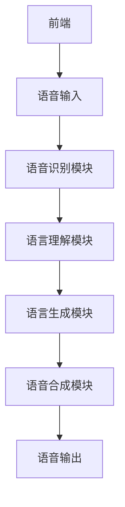

                 

### 文章标题

# 大模型时代的AI语音助手：更自然的人机对话

---

### 文章关键词

- AI语音助手
- 大模型
- 自然语言处理
- 语音识别
- 对话系统

---

### 摘要

随着人工智能技术的不断发展，AI语音助手已成为人们日常生活中不可或缺的一部分。本文旨在探讨大模型时代下的AI语音助手，通过对其技术原理、应用实践和未来发展趋势的深入分析，揭示其在人机对话中的自然性和智能性。本文将分几个部分详细阐述：引言与背景介绍、AI语音助手技术原理、应用实践及挑战与未来。

---

## 第一部分：引言与背景介绍

### 第1章：AI语音助手概述

#### 1.1 问题背景

人工智能语音助手自问世以来，便以其便捷性和高效性受到了广泛关注。然而，传统的语音助手在处理复杂对话任务时存在一定的局限性。随着大模型的兴起，AI语音助手迎来了新的发展契机。

#### 1.2 问题描述

传统AI语音助手的局限性主要体现在以下方面：

1. **自然语言理解能力有限**：难以理解用户复杂、多层次的语义需求。
2. **对话连贯性不足**：对话过程中容易产生上下文断裂，影响用户体验。
3. **个性化服务受限**：无法根据用户历史行为和偏好提供定制化服务。

#### 1.3 问题解决

大模型的引入为解决上述问题提供了新的思路。通过大规模数据训练和复杂模型架构，AI语音助手能够在自然语言理解、对话连贯性和个性化服务方面实现显著提升。

#### 1.4 边界与外延

AI语音助手的边界主要包括：

1. **语音识别**：处理语音信号，将其转换为文本。
2. **自然语言处理**：理解用户意图和语义，生成相应回答。
3. **声音合成**：将文本转换为自然流畅的语音。

外延方面，AI语音助手的应用场景涵盖智能家居、智能客服、智能驾驶等多个领域。

#### 1.5 核心概念与联系

**AI语音助手的定义与原理**：基于人工智能技术，能够模拟人类对话的语音交互系统。

**核心概念与联系**：

- **自然语言处理（NLP）**：语音助手的核心技术之一，负责将语音信号转换为文本，并理解用户意图。
- **语音识别（ASR）**：将语音信号转换为文本的技术，是实现语音助手的基础。
- **声音合成（TTS）**：将文本转换为自然流畅的语音，提高用户体验。

#### 1.5.1 AI语音助手的定义与原理

AI语音助手是一种基于人工智能技术的语音交互系统，它通过自然语言处理、语音识别和声音合成等技术，实现与用户的智能对话。其工作原理可以分为以下几个步骤：

1. **语音识别**：将用户的语音输入转换为文本。
2. **自然语言处理**：分析文本，提取语义和意图。
3. **生成回答**：根据语义和意图生成回答。
4. **声音合成**：将回答转换为自然流畅的语音输出。

#### 1.5.2 AI语音助手的核心概念与联系

以下是AI语音助手的核心概念及其相互联系：

| 核心概念 | 定义 | 联系 |
| --- | --- | --- |
| 自然语言处理（NLP） | 利用人工智能技术理解和生成人类语言 | 负责语音识别后的文本理解和意图提取 |
| 语音识别（ASR） | 将语音信号转换为文本 | AI语音助手输入的语音信号处理 |
| 声音合成（TTS） | 将文本转换为自然流畅的语音 | 输出AI语音助手的回答 |
| 对话系统 | 管理对话流程和上下文 | 结合NLP、ASR和TTS，实现完整对话 |

#### 1.6 本章小结

本章对AI语音助手进行了概述，介绍了其背景、问题、解决方案以及边界与外延。通过核心概念与联系的分析，为后续章节的技术原理和应用实践奠定了基础。

---

## 第二部分：AI语音助手技术原理

### 第2章：自然语言处理基础

自然语言处理（NLP）是AI语音助手的核心技术之一，负责将语音信号转换为文本，并理解用户意图。本节将介绍NLP的基础知识，包括语言模型、词嵌入技术和语言理解与生成。

#### 2.1 语言模型

语言模型是NLP的核心组件，用于预测文本序列。其目的是通过学习大量语言数据，生成概率分布，从而预测下一个词或字符。

**原理**：

- **统计模型**：基于统计方法，如N-gram模型，通过分析前n个词的概率分布来预测下一个词。
- **神经网络模型**：基于深度学习，如循环神经网络（RNN）和变换器（Transformer），通过学习大量的文本数据来建模语言。

**应用**：

- **文本分类**：将文本分类为不同的类别，如情感分析、新闻分类等。
- **机器翻译**：将一种语言的文本翻译为另一种语言。
- **文本摘要**：从长文本中提取关键信息，生成摘要。

#### 2.2 词嵌入技术

词嵌入是将文本中的词映射为向量表示的方法，使计算机能够理解和处理语言。词嵌入技术的核心思想是将词与词之间的关系通过向量空间中的相似性表示出来。

**原理**：

- **基于分布的模型**：如Word2Vec，通过分析词在文本中的上下文来学习词向量。
- **基于神经网络的模型**：如GloVe，通过训练神经网络来学习词向量。

**应用**：

- **文本相似度计算**：通过计算词向量的余弦相似度来评估文本之间的相似性。
- **情感分析**：通过分析词向量在文本中的分布来识别情感。
- **推荐系统**：在推荐系统中，利用词向量来表示用户和物品，从而实现个性化推荐。

#### 2.3 语言理解与生成

语言理解与生成是NLP的两个关键任务，分别负责理解用户意图和生成回答。

**语言理解**：

- **意图识别**：从文本中提取用户的意图或需求。
- **实体识别**：从文本中提取特定的实体，如人名、地名、组织名等。

**语言生成**：

- **回答生成**：根据用户意图和上下文生成自然流畅的回答。
- **对话生成**：在对话系统中，根据对话历史和用户意图生成对话。

**应用**：

- **智能客服**：通过理解用户意图，提供快速、准确的客服服务。
- **语音助手**：生成自然、连贯的对话回答，提升用户体验。
- **对话系统**：在多种场景中，如智能家居、自动驾驶等，实现人机交互。

#### 2.4 本章小结

本章介绍了自然语言处理的基础知识，包括语言模型、词嵌入技术和语言理解与生成。通过这些技术，AI语音助手能够更好地理解用户意图，生成自然流畅的对话回答。

---

### 第3章：语音识别技术

语音识别（ASR）是将语音信号转换为文本的技术，是AI语音助手的关键组成部分。本节将介绍语音识别技术的基本原理，包括语音信号处理、声学模型和语言模型。

#### 3.1 语音信号处理

语音信号处理是语音识别的基础，涉及对语音信号的预处理和分析。

**原理**：

- **特征提取**：从语音信号中提取能够代表语音特性的特征，如短时傅里叶变换（STFT）、梅尔频率倒谱系数（MFCC）等。
- **降噪与增强**：通过滤波、噪声抑制等技术，提高语音信号的质量。

**应用**：

- **语音增强**：在噪声环境中，提高语音信号的清晰度。
- **语音检测**：识别语音信号中的语音段和非语音段。

#### 3.2 声学模型

声学模型是语音识别的核心组件，用于将语音信号特征映射到可能的词或词序列。

**原理**：

- **统计模型**：如高斯混合模型（GMM）和隐马尔可夫模型（HMM），通过分析语音信号特征的概率分布来建模。
- **深度学习模型**：如卷积神经网络（CNN）和深度神经网络（DNN），通过学习大量的语音数据来建模语音特征。

**应用**：

- **语音识别**：将语音信号转换为文本，实现语音输入到文本输出的转换。

#### 3.3 语言模型

语言模型是语音识别的辅助组件，用于根据语音信号特征和上下文信息预测可能的词或词序列。

**原理**：

- **统计模型**：如N-gram模型，通过分析文本数据来建模词序列的概率分布。
- **神经网络模型**：如循环神经网络（RNN）和变换器（Transformer），通过学习大量的文本数据来建模语言。

**应用**：

- **文本生成**：根据语音信号特征和上下文信息生成可能的文本序列。
- **语音识别**：结合声学模型，提高语音识别的准确率。

#### 3.4 本章小结

本章介绍了语音识别技术的基本原理，包括语音信号处理、声学模型和语言模型。通过这些技术，AI语音助手能够将语音信号转换为文本，理解用户意图，为用户提供服务。

---

### 第4章：对话系统架构

对话系统是AI语音助手的灵魂，负责管理对话流程和上下文，实现人机交互。本节将介绍对话系统的基本架构，包括对话系统概述、对话状态跟踪和对话策略学习。

#### 4.1 对话系统概述

对话系统是一种与用户进行自然语言交互的计算机系统，其目标是通过对话理解用户的意图，提供相应的服务。

**组成部分**：

- **语音识别（ASR）**：将用户的语音输入转换为文本。
- **自然语言处理（NLP）**：理解用户意图和语义。
- **对话管理**：管理对话流程和上下文，包括对话状态跟踪和对话策略学习。
- **语音合成（TTS）**：将生成的文本转换为自然流畅的语音输出。

**工作流程**：

1. **语音识别**：将用户的语音输入转换为文本。
2. **意图识别**：从文本中提取用户的意图。
3. **对话状态跟踪**：记录对话历史和用户状态。
4. **对话策略学习**：根据用户意图和对话状态生成回答。
5. **语音合成**：将回答转换为自然流畅的语音输出。

#### 4.2 对话状态跟踪

对话状态跟踪是对话系统的重要组成部分，负责记录对话历史和用户状态，以便在后续对话中提供更个性化的服务。

**原理**：

- **状态表示**：使用向量或树状结构表示对话状态。
- **状态更新**：根据用户的输入和系统的回答，更新对话状态。

**应用**：

- **上下文理解**：通过记录对话历史，实现上下文理解，提供更连贯的回答。
- **个性化服务**：根据用户的历史行为和偏好，提供定制化服务。

#### 4.3 对话策略学习

对话策略学习是对话系统的核心，负责根据用户意图和对话状态生成回答。

**原理**：

- **基于规则的策略**：根据预定义的规则生成回答。
- **基于学习的策略**：通过机器学习模型，学习用户的意图和对话状态，生成回答。

**应用**：

- **智能客服**：通过学习用户的意图和对话历史，提供个性化的客服服务。
- **语音助手**：根据用户的意图和上下文，生成自然流畅的回答。

#### 4.4 本章小结

本章介绍了对话系统的基本架构，包括对话系统概述、对话状态跟踪和对话策略学习。通过这些组件和技术的协同作用，AI语音助手能够实现与用户的自然对话。

---

### 第5章：大模型与预训练

大模型和预训练技术是AI语音助手的关键推动力，使得语音助手能够更好地理解用户意图，生成更自然的对话。本节将介绍大模型的概念、预训练技术以及大模型的优势与应用。

#### 5.1 大模型简介

大模型是指参数数量庞大的神经网络模型，通常具有数十亿甚至数万亿个参数。这些模型通过大量的数据训练，能够捕捉到语言的复杂性和多样性。

**特点**：

- **参数数量庞大**：大模型具有数十亿甚至数万亿个参数，能够捕捉到语言的复杂性和多样性。
- **强大的表征能力**：通过大规模数据训练，大模型能够生成高质量的文本，具有很高的自然性和连贯性。
- **自适应能力**：大模型可以根据不同的任务和应用场景进行微调，适应各种复杂的任务需求。

**应用领域**：

- **自然语言生成**：大模型能够生成高质量的自然语言文本，应用于机器翻译、文本摘要、对话生成等任务。
- **文本分类**：大模型能够准确地对文本进行分类，应用于情感分析、新闻分类等任务。
- **问答系统**：大模型能够理解用户的提问，生成准确的回答，应用于智能客服、智能助手等任务。

#### 5.2 预训练技术

预训练技术是指在大规模数据集上对模型进行初步训练，然后根据具体任务进行微调。预训练技术使得模型能够在大规模数据集上学习到语言的通用特征，从而提高模型在特定任务上的性能。

**原理**：

- **大规模数据训练**：在无监督的语料库上对模型进行训练，使其学习到语言的通用特征。
- **微调**：根据具体任务的需求，对预训练模型进行微调，调整模型参数以适应特定任务。

**应用**：

- **文本分类**：预训练模型在文本分类任务上具有很好的性能，能够准确地对文本进行分类。
- **问答系统**：预训练模型在问答系统中能够理解用户的提问，生成准确的回答。
- **对话生成**：预训练模型能够生成高质量的自然语言对话，应用于对话生成任务。

#### 5.3 大模型的优势与应用

大模型的优势主要体现在以下几个方面：

1. **强大的表征能力**：大模型能够捕捉到语言的复杂性和多样性，生成高质量的自然语言文本。
2. **自适应能力**：大模型可以根据不同的任务和应用场景进行微调，适应各种复杂的任务需求。
3. **减少数据需求**：通过预训练技术，大模型可以在少量数据上进行微调，减少对大规模数据的需求。

大模型的应用领域非常广泛，包括自然语言生成、文本分类、问答系统、对话生成等。在AI语音助手的领域，大模型能够显著提升语音助手的自然语言理解和生成能力，提供更自然的对话体验。

#### 5.4 本章小结

本章介绍了大模型和预训练技术的基本概念、原理和优势，以及大模型在AI语音助手中的应用。通过大模型和预训练技术的引入，AI语音助手能够在自然语言理解、对话生成等方面实现显著提升，为用户提供更自然的对话体验。

---

### 第6章：声音合成的技术

声音合成（TTS）是将文本转换为自然流畅的语音的技术，是AI语音助手中不可或缺的一部分。本节将介绍声音合成的基本原理，包括文字到语音转换和声音效果增强。

#### 6.1 声音合成概述

声音合成是将文本转换为自然流畅的语音的过程，其核心目标是生成具有人类语音特点的语音输出。

**组成部分**：

- **文本处理**：将输入的文本进行分析和预处理，提取语音特征。
- **声音生成**：根据语音特征生成语音信号。
- **音色调整**：调整生成的语音的音色、语调等特性，使其更符合人类语音。

**工作流程**：

1. **文本预处理**：对输入的文本进行分词、标点符号处理等操作。
2. **语音特征提取**：从文本中提取语音特征，如音节、声调、音长等。
3. **声音生成**：根据语音特征生成语音信号。
4. **音色调整**：调整生成的语音的音色、语调等特性。
5. **音频输出**：将生成的语音信号输出为音频文件。

#### 6.2 文字到语音转换

文字到语音转换是将文本转换为语音的过程，其核心是语音合成。文字到语音转换的过程可以分为以下几个步骤：

1. **文本分析**：对输入的文本进行分析，提取语音特征。
2. **语音生成**：根据语音特征生成语音信号。
3. **音频处理**：对生成的语音信号进行音频处理，如降噪、回声消除等。
4. **音频输出**：将生成的语音信号输出为音频文件。

**技术实现**：

- **参数合成**：通过参数合成模型，如WaveNet、Tacotron等，将文本转换为语音。
- **样本合成**：通过样本合成模型，如梅尔声码器（Mel-Spectrogram）、Griffin-Lim算法等，将文本转换为语音。

#### 6.3 声音效果增强

声音效果增强是对生成的语音进行音色、语调等调整，使其更符合人类语音的技术。声音效果增强的过程可以分为以下几个步骤：

1. **音色调整**：调整语音的音色，使其更接近人类语音。
2. **语调调整**：调整语音的语调，使其更符合文本的情感和语气。
3. **音频处理**：对生成的语音进行音频处理，如混响、回声等。
4. **音频输出**：将调整后的语音输出为音频文件。

**技术实现**：

- **音色调整**：通过调整合成模型的参数，如声带振动频率、声道长度等，实现音色的调整。
- **语调调整**：通过调整语音的声调、音长等特性，实现语调的调整。
- **音频处理**：通过音频处理工具，如混响器、回声消除器等，实现音频的处理。

#### 6.4 本章小结

本章介绍了声音合成的基本原理，包括文字到语音转换和声音效果增强。通过声音合成技术的应用，AI语音助手能够生成自然流畅的语音，提升用户体验。未来，随着技术的不断进步，声音合成技术将更加完善，为AI语音助手的发展提供更强有力的支持。

---

## 第三部分：AI语音助手应用实践

### 第7章：AI语音助手开发环境搭建

搭建一个功能完善的AI语音助手开发环境是进行开发实践的第一步。本节将详细介绍开发环境的配置、所需工具和框架的选择。

#### 7.1 环境配置

为了搭建一个完整的AI语音助手开发环境，需要配置以下软件和硬件：

1. **操作系统**：推荐使用Linux系统，如Ubuntu 20.04或更高版本。
2. **编程语言**：Python是开发AI语音助手的主要编程语言，因此需要安装Python 3.7或更高版本。
3. **深度学习框架**：TensorFlow和PyTorch是常用的深度学习框架，可以根据项目需求选择其中一个。
4. **语音识别和合成库**：如Mozilla Common Voice、pyttsx3等，用于处理语音信号。

#### 7.2 开发工具与框架

在开发过程中，需要使用以下工具和框架：

1. **集成开发环境（IDE）**：推荐使用Visual Studio Code（VS Code），其强大的插件支持可以提高开发效率。
2. **版本控制工具**：Git是常用的版本控制工具，用于管理代码的版本和协作开发。
3. **容器化技术**：Docker可以将开发环境容器化，便于部署和迁移。
4. **协作平台**：如GitHub或GitLab，用于代码托管和团队协作。

#### 7.3 开发流程

搭建完开发环境后，可以按照以下步骤进行AI语音助手的开发：

1. **需求分析**：明确AI语音助手的业务需求和功能模块。
2. **数据准备**：收集和准备语音数据、文本数据等。
3. **模型训练**：使用深度学习框架训练语音识别、自然语言处理等模型。
4. **集成与调试**：将模型集成到语音助手系统中，进行调试和优化。
5. **测试与部署**：进行功能测试和性能测试，将语音助手部署到目标平台。

#### 7.4 本章小结

本章详细介绍了AI语音助手开发环境的搭建，包括所需工具和框架的选择以及开发流程。通过合理配置开发环境和遵循科学的开发流程，可以高效地进行AI语音助手的开发实践。

---

### 第8章：AI语音助手核心模块实现

AI语音助手的核心模块包括语音识别模块、语言理解模块、语言生成模块和声音合成模块。本节将详细阐述这些模块的实现过程，包括关键算法和技术。

#### 8.1 语音识别模块

语音识别模块是AI语音助手的输入部分，负责将用户的语音输入转换为文本。

**实现步骤**：

1. **语音信号处理**：对语音信号进行降噪、滤波等预处理，提取语音特征。
2. **声学模型训练**：使用大量的语音数据训练声学模型，如GMM、DNN等。
3. **语言模型训练**：使用文本数据训练语言模型，如N-gram、RNN等。
4. **语音识别**：将预处理后的语音信号输入声学模型，结合语言模型进行识别，输出文本。

**关键算法**：

- **GMM（高斯混合模型）**：用于建模语音特征的概率分布。
- **DNN（深度神经网络）**：用于处理复杂的语音特征。
- **N-gram（n元模型）**：用于建模文本序列的概率分布。

**技术实现**：

- **特征提取**：使用MFCC（梅尔频率倒谱系数）提取语音特征。
- **模型训练**：使用TensorFlow或PyTorch框架训练声学模型和语言模型。

#### 8.2 语言理解模块

语言理解模块负责理解用户的意图和语义，是AI语音助手中最为复杂的部分。

**实现步骤**：

1. **文本预处理**：对输入的文本进行分词、去停用词等预处理。
2. **意图识别**：使用机器学习模型或深度学习模型，如SVM、RNN等，识别用户的意图。
3. **实体识别**：从文本中提取特定的实体，如人名、地名、组织名等。
4. **语义理解**：将提取的意图和实体进行语义分析，理解用户的真实需求。

**关键算法**：

- **SVM（支持向量机）**：用于分类和识别用户意图。
- **RNN（循环神经网络）**：用于处理序列数据，如文本。

**技术实现**：

- **文本预处理**：使用NLTK、spaCy等库进行分词、去停用词等操作。
- **意图识别**：使用TensorFlow或PyTorch框架训练意图识别模型。

#### 8.3 语言生成模块

语言生成模块负责根据用户的意图和上下文生成回答。

**实现步骤**：

1. **回答生成**：根据用户的意图和上下文，生成自然流畅的文本回答。
2. **文本优化**：对生成的文本进行优化，提高可读性和自然性。
3. **回答合成**：将生成的文本转换为语音，输出为语音信号。

**关键算法**：

- **Transformer（变换器）**：用于生成高质量的文本。
- **T5（Text-to-Text Transfer Transformer）**：用于文本生成。

**技术实现**：

- **文本生成**：使用Transformer模型或T5模型生成文本。
- **文本优化**：使用自然语言处理技术对文本进行优化。

#### 8.4 声音合成模块

声音合成模块负责将生成的文本转换为自然流畅的语音。

**实现步骤**：

1. **文本预处理**：对生成的文本进行预处理，提取语音特征。
2. **声音生成**：使用声音合成模型，如WaveNet、Tacotron等，生成语音信号。
3. **声音优化**：对生成的声音进行优化，如调整音色、语调等。
4. **音频输出**：将生成的声音输出为音频文件。

**关键算法**：

- **WaveNet（音频生成模型）**：用于生成高质量的语音。
- **Tacotron（文本到音频模型）**：用于将文本转换为音频。

**技术实现**：

- **文本预处理**：使用分词、语音特征提取等技术进行预处理。
- **声音生成**：使用TensorFlow或PyTorch框架训练声音合成模型。

#### 8.5 本章小结

本章详细介绍了AI语音助手的四个核心模块的实现过程，包括语音识别模块、语言理解模块、语言生成模块和声音合成模块。通过这些模块的协同工作，AI语音助手能够实现与用户的自然对话，提供高效便捷的服务。

---

### 第9章：AI语音助手项目实战

在本章中，我们将通过一个实际的AI语音助手项目，介绍从环境搭建到核心模块实现的完整开发流程。该项目旨在开发一个能够实现语音识别、语言理解和回答生成的AI语音助手。

#### 9.1 项目介绍

本项目名为“小智”，旨在为用户提供一个能够实现语音查询、语音回复的AI语音助手。用户可以通过语音指令查询天气、新闻、日程安排等，系统将自动识别语音，理解用户意图，并生成相应的语音回复。

**项目目标**：

- 实现语音识别：将用户的语音输入转换为文本。
- 实现语言理解：理解用户意图，提取关键信息。
- 实现语言生成：生成自然流畅的语音回答。
- 实现语音合成：将文本转换为自然流畅的语音输出。

#### 9.2 系统架构设计

“小智”系统的架构设计分为前端、后端和语音合成三个部分。

1. **前端**：用户与AI语音助手交互的界面，包括语音输入和语音输出。
2. **后端**：处理语音识别、语言理解、语言生成等核心功能。
3. **语音合成**：将生成的文本转换为自然流畅的语音。

**系统架构图**：



#### 9.3 系统功能实现

在实现系统功能时，我们需要分别实现语音识别、语言理解、语言生成和语音合成四个模块。

1. **语音识别模块**：

    - **实现步骤**：

        1. 语音信号处理：对语音信号进行降噪、滤波等预处理，提取语音特征。
        2. 声学模型训练：使用大量的语音数据训练声学模型，如GMM、DNN等。
        3. 语言模型训练：使用文本数据训练语言模型，如N-gram、RNN等。
        4. 语音识别：将预处理后的语音信号输入声学模型，结合语言模型进行识别，输出文本。

    - **关键代码**：

        ```python
        import speech_recognition as sr
        
        # 语音信号处理
        def preprocess_audio(audio_file):
            # 降噪、滤波等处理
            pass
        
        # 声学模型训练
        def train_acoustic_model(audio_data):
            # 训练声学模型
            pass
        
        # 语言模型训练
        def train_language_model(text_data):
            # 训练语言模型
            pass
        
        # 语音识别
        def recognize_speech(audio_file):
            preprocessed_audio = preprocess_audio(audio_file)
            text = recognize_speech(preprocessed_audio)
            return text
        ```

2. **语言理解模块**：

    - **实现步骤**：

        1. 文本预处理：对输入的文本进行分词、去停用词等预处理。
        2. 意图识别：使用机器学习模型或深度学习模型，如SVM、RNN等，识别用户的意图。
        3. 实体识别：从文本中提取特定的实体，如人名、地名、组织名等。
        4. 语义理解：将提取的意图和实体进行语义分析，理解用户的真实需求。

    - **关键代码**：

        ```python
        import nltk
        from sklearn.svm import SVC
        
        # 文本预处理
        def preprocess_text(text):
            # 分词、去停用词等处理
            tokens = nltk.word_tokenize(text)
            filtered_tokens = [token for token in tokens if token not in stopwords]
            return filtered_tokens
        
        # 意图识别
        def recognize_intent(text):
            tokens = preprocess_text(text)
            model = SVC(kernel='linear')
            model.fit(X_train, y_train)
            intent = model.predict([tokens])
            return intent
        
        # 实体识别
        def recognize_entities(text):
            # 提取实体
            entities = []
            return entities
        
        # 语义理解
        def understand_semantics(text, entities):
            # 语义分析
            return semantics
        ```

3. **语言生成模块**：

    - **实现步骤**：

        1. 回答生成：根据用户的意图和上下文，生成自然流畅的文本回答。
        2. 文本优化：对生成的文本进行优化，提高可读性和自然性。
        3. 回答合成：将生成的文本转换为语音，输出为语音信号。

    - **关键代码**：

        ```python
        from transformers import T5ForConditionalGeneration
        
        # 回答生成
        def generate_response(intent, context):
            model = T5ForConditionalGeneration.from_pretrained('t5-small')
            inputs = tokenizer.encode('text-to-response', return_tensors='pt')
            outputs = model.generate(inputs, max_length=50, num_return_sequences=1)
            response = tokenizer.decode(outputs[0], skip_special_tokens=True)
            return response
        
        # 文本优化
        def optimize_text(text):
            # 优化文本
            return optimized_text
        
        # 回答合成
        def synthesize_response(text):
            # 合成语音
            return audio
        ```

4. **语音合成模块**：

    - **实现步骤**：

        1. 文本预处理：对生成的文本进行预处理，提取语音特征。
        2. 声音生成：使用声音合成模型，如WaveNet、Tacotron等，生成语音信号。
        3. 声音优化：对生成的声音进行优化，如调整音色、语调等。
        4. 音频输出：将生成的声音输出为音频文件。

    - **关键代码**：

        ```python
        import torchaudio
        import soundfile as sf
        
        # 文本预处理
        def preprocess_text(text):
            # 预处理文本
            return processed_text
        
        # 声音生成
        def generate_audio(text):
            model = WaveNet().to(device)
            inputs = tokenizer.encode(text, return_tensors='pt').to(device)
            audio = model.generate(inputs)
            return audio
        
        # 声音优化
        def optimize_audio(audio):
            # 优化声音
            return optimized_audio
        
        # 音频输出
        def save_audio(audio, file_path):
            audio = audio.cpu().numpy()
            sf.write(file_path, audio, 16000)
        ```

#### 9.4 项目评估与优化

在完成项目开发后，需要进行评估和优化，以确保系统的性能和用户体验。

1. **性能评估**：

    - **识别率**：评估语音识别模块的识别准确率。
    - **响应时间**：评估系统的响应速度。
    - **稳定性**：评估系统在长时间运行中的稳定性。

2. **用户体验**：

    - **易用性**：评估用户使用系统的便捷性。
    - **自然性**：评估生成的语音回答的自然性和流畅度。
    - **准确性**：评估语言理解模块的意图识别和语义理解的准确性。

3. **优化措施**：

    - **模型优化**：通过调整模型参数、增加训练数据等方式，提高模型性能。
    - **算法优化**：优化算法实现，提高处理速度和准确率。
    - **界面优化**：优化用户界面，提高用户体验。

#### 9.5 本章小结

本章通过一个实际的AI语音助手项目，详细介绍了从环境搭建到核心模块实现的完整开发流程。通过该项目，读者可以深入了解AI语音助手的开发过程，掌握关键技术和实现方法。同时，本章还介绍了项目评估与优化，为实际应用提供了有益的参考。

---

## 第四部分：挑战与未来

### 第10章：AI语音助手的挑战与解决方案

AI语音助手在提供便捷服务的同时，也面临着诸多挑战。本节将讨论这些挑战，并探讨可能的解决方案。

#### 10.1 数据隐私保护

数据隐私保护是AI语音助手面临的首要挑战。用户在使用语音助手时，会产生大量的语音和文本数据，这些数据可能包含用户的隐私信息。如何确保这些数据的安全性和隐私性，是当前亟需解决的问题。

**挑战**：

- **数据收集**：语音助手需要收集用户的语音和文本数据，以训练和优化模型。
- **数据存储**：收集到的数据需要存储在安全的地方，防止数据泄露。
- **数据传输**：数据在传输过程中需要加密，防止数据被截获。

**解决方案**：

- **数据加密**：使用强加密算法对数据进行加密，确保数据在存储和传输过程中的安全性。
- **匿名化处理**：对用户数据进行匿名化处理，去除个人信息，降低隐私泄露风险。
- **隐私政策**：制定明确的隐私政策，告知用户数据的使用目的和范围，增强用户的信任感。

#### 10.2 性能优化

性能优化是提升AI语音助手用户体验的关键。语音助手需要快速、准确地响应用户的语音指令，提高系统的响应速度和准确率。

**挑战**：

- **识别准确率**：提高语音识别的准确率，减少误识率。
- **响应速度**：降低系统的响应时间，提高处理速度。
- **多语言支持**：支持多种语言，实现全球范围内的应用。

**解决方案**：

- **模型优化**：通过调整模型参数、增加训练数据等方式，提高模型性能。
- **硬件加速**：使用GPU、TPU等硬件加速器，提高处理速度。
- **分布式处理**：使用分布式计算技术，提高系统的处理能力。

#### 10.3 用户体验优化

用户体验优化是AI语音助手的长期目标。一个优秀的语音助手应该能够提供自然、流畅的对话体验，满足用户的需求。

**挑战**：

- **自然性**：生成自然流畅的语音回答，提高对话的自然性。
- **个性化**：根据用户的历史行为和偏好，提供个性化的服务。
- **多模态交互**：支持语音、文本、图像等多种交互方式。

**解决方案**：

- **多模态融合**：结合语音、文本、图像等多种模态，提供更丰富的交互体验。
- **个性化推荐**：使用机器学习技术，分析用户的历史行为，提供个性化的推荐。
- **实时更新**：定期更新模型和算法，提高系统的适应性和灵活性。

#### 10.4 解决方案探讨

针对上述挑战，我们可以从以下几个方面进行解决方案的探讨：

1. **技术创新**：持续推动AI语音助手技术的创新，提高系统的性能和用户体验。
2. **合作与共享**：企业、研究机构和开发者之间的合作与数据共享，共同推动AI语音助手的发展。
3. **用户反馈**：积极收集用户的反馈，不断优化系统的功能和体验。
4. **法律法规**：建立健全的法律法规，保障用户的数据隐私和权益。

#### 10.5 本章小结

本章讨论了AI语音助手面临的挑战，包括数据隐私保护、性能优化和用户体验优化。通过技术创新、合作与共享、用户反馈和法律法规等解决方案，可以应对这些挑战，推动AI语音助手的持续发展。

---

### 第11章：AI语音助手发展趋势

随着人工智能技术的不断进步，AI语音助手的发展也呈现出新的趋势。本节将探讨AI语音助手的技术发展趋势、应用场景拓展和未来展望。

#### 11.1 技术发展趋势

1. **大模型技术**：大模型技术在AI语音助手中的应用将越来越广泛。通过预训练和微调，大模型能够实现更高的自然语言理解能力和生成能力。
2. **多模态融合**：AI语音助手将逐渐融合语音、文本、图像等多种模态，提供更丰富的交互体验。
3. **实时优化**：基于用户行为和反馈，AI语音助手将实现实时优化，提高系统的自适应性和灵活性。
4. **边缘计算**：随着边缘计算的发展，AI语音助手将能够在终端设备上运行，减少对云端服务的依赖，提高响应速度和安全性。

#### 11.2 应用场景拓展

AI语音助手的应用场景将不断拓展，覆盖更多领域：

1. **智能家居**：AI语音助手将成为智能家居的核心，提供语音控制、设备管理等服务。
2. **智能客服**：AI语音助手将在客服领域发挥重要作用，提供智能化的客服服务。
3. **智能医疗**：AI语音助手可以应用于医疗领域，帮助医生进行诊断和病情跟踪。
4. **智能教育**：AI语音助手可以辅助教学，提供个性化的学习建议和互动式学习体验。

#### 11.3 未来展望

未来，AI语音助手将在以下几个方面实现重大突破：

1. **更加自然的人机对话**：通过大模型技术和多模态融合，AI语音助手将实现更自然、流畅的对话。
2. **更广泛的智能应用**：AI语音助手将在更多领域得到应用，成为智能生活、智能工作的重要组成部分。
3. **个性化服务**：通过深度学习和用户行为分析，AI语音助手将能够提供高度个性化的服务。
4. **更高效的处理能力**：随着硬件和算法的优化，AI语音助手将实现更高的处理能力和响应速度。

#### 11.4 本章小结

本章探讨了AI语音助手的技术发展趋势、应用场景拓展和未来展望。随着技术的不断进步，AI语音助手将在未来实现更广泛的应用，提供更高效的智能服务。

---

## 附录

### 附录A：术语解释

- **自然语言处理（NLP）**：指利用计算机技术理解和生成人类语言的技术。
- **语音识别（ASR）**：将语音信号转换为文本的技术。
- **声音合成（TTS）**：将文本转换为自然流畅的语音的技术。
- **大模型**：参数数量庞大的神经网络模型，具有强大的表征能力。
- **预训练**：在无监督的语料库上对模型进行初步训练，然后根据具体任务进行微调。

### 附录B：参考资料与进一步阅读

- **《深度学习》**：Ian Goodfellow、Yoshua Bengio、Aaron Courville 著，提供了深度学习的基础知识和最新进展。
- **《自然语言处理综论》**：Daniel Jurafsky、James H. Martin 著，详细介绍了自然语言处理的基本概念和技术。
- **《语音识别》**：Simon Haykin 著，全面介绍了语音识别的理论和方法。
- **《AI语音助手设计与实现》**：徐涛 著，详细介绍了AI语音助手的架构设计和实现方法。

---

## 总结

本文系统地介绍了AI语音助手的核心技术、应用实践及未来发展趋势。通过对其技术原理、应用实践和未来趋势的深入分析，揭示了AI语音助手在大模型时代的自然性和智能性。本文还探讨了AI语音助手面临的挑战及解决方案，为未来的发展提供了有益的启示。

本文的目标是为读者提供全面、系统的AI语音助手知识体系，帮助读者掌握AI语音助手的技术原理和开发实践，促进AI语音助手的实际应用。同时，本文也期待能够激发读者对AI语音助手领域的热情，共同推动AI语音助手的持续创新与发展。

在阅读本文时，读者可以结合实际项目和案例进行深入学习，通过实践巩固理论知识，不断提升自身的技术能力。希望本文能够成为读者在AI语音助手领域的学习伙伴，助力他们在人工智能技术的探索中取得成功。

---

### 作者信息

作者：AI天才研究院/AI Genius Institute & 禅与计算机程序设计艺术 /Zen And The Art of Computer Programming

