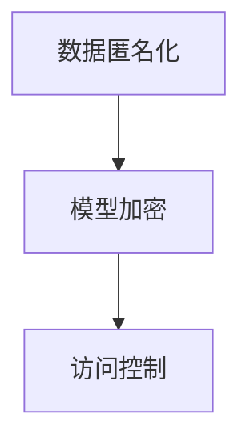
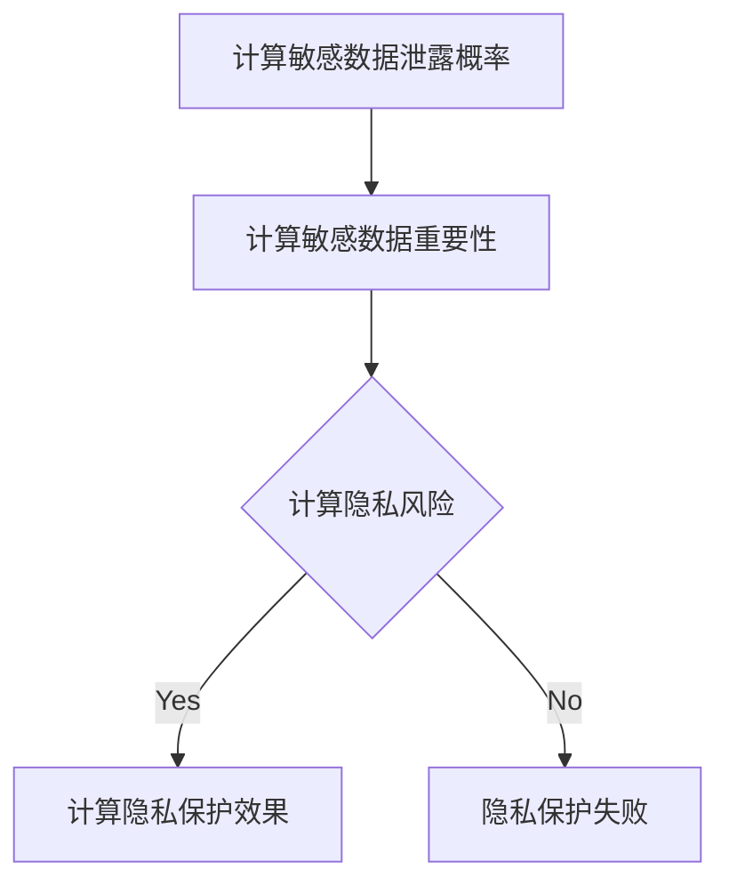
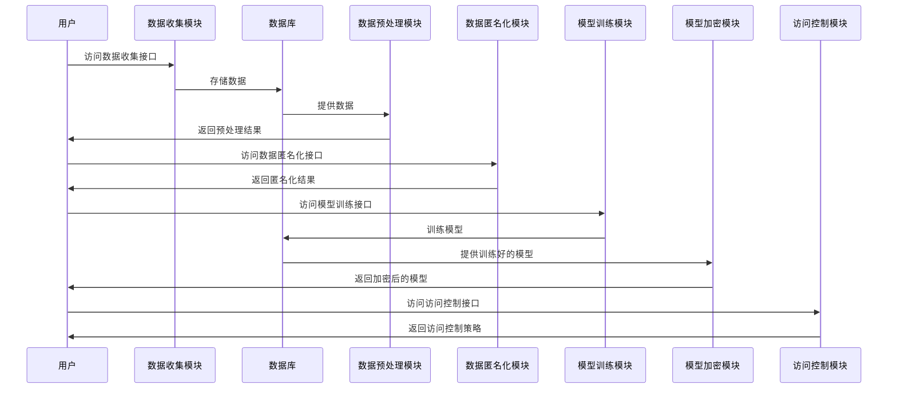

                 


### 摘要

随着大模型技术的迅猛发展，个人隐私保护面临前所未有的挑战。本文将深入探讨大模型时代个人隐私的问题，分析其核心概念、权衡原则及保护方法。通过逐步的逻辑推理，本文将揭示隐私保护的算法原理、数学模型，并结合实际项目进行详细分析，提供实用的解决方案和最佳实践建议。文章旨在帮助读者全面了解大模型时代个人隐私保护的现状和策略，为未来的技术发展提供有益的参考。

## 第一部分：问题背景与核心概念

### 1.1 问题的提出与背景

#### 1.1.1 大模型时代的到来

随着深度学习和大数据技术的发展，大模型（如GPT、BERT等）已经成为当前人工智能领域的明星。这些模型通过训练海量数据，能够实现从文本生成、图像识别到自然语言处理等众多任务的高效解决。大模型的出现，标志着人工智能进入了一个新的时代。

然而，大模型的发展也带来了新的挑战。在训练和使用这些模型的过程中，往往需要大量的个人数据。这些数据不仅包括用户的搜索历史、社交媒体活动，甚至可能涉及用户的敏感信息，如医疗记录、金融交易等。因此，如何在充分利用大模型优势的同时，保护用户的个人隐私，成为了一个亟待解决的问题。

#### 1.1.2 个人隐私的重要性和挑战

个人隐私是指个人在社交、工作、生活等各个方面的信息，包括但不限于姓名、地址、电话、电子邮件、社交媒体账号、交易记录等。隐私对于个人的安全、尊严和自由具有重要意义。在数字化时代，个人隐私的保护变得更加复杂和困难。

一方面，随着互联网的普及和大数据技术的发展，个人数据的收集、存储、分析和共享变得异常便捷。这使得个人隐私容易被泄露、滥用，甚至成为被攻击的目标。另一方面，大模型的训练和应用需要大量的数据，这就要求我们在保护隐私的同时，又要充分利用这些数据的价值。

#### 1.1.3 大模型对个人隐私的影响

大模型在提升人工智能性能的同时，也对个人隐私产生了深远的影响。首先，大模型对数据的依赖性使得个人数据更容易被收集和存储。其次，大模型的分析能力使得个人隐私数据容易被提取和利用，从而导致隐私泄露。此外，大模型的黑箱特性使得其行为难以预测，增加了隐私保护的不确定性。

综上所述，大模型时代个人隐私保护的挑战是多方面的，我们需要从数据收集、存储、处理和共享等各个环节进行综合考虑，制定有效的隐私保护策略。

### 1.2 核心概念与联系

#### 1.2.1 个人隐私的概念

个人隐私是指个人在社交、工作、生活等各个方面的信息，包括但不限于姓名、地址、电话、电子邮件、社交媒体账号、交易记录等。个人隐私的保护是数字化时代的一项基本人权，涉及到个体的安全、尊严和自由。

#### 1.2.2 大模型的定义

大模型是指通过深度学习算法训练的具有极高复杂度和巨大参数量的神经网络模型。这些模型通常需要大量的数据来训练，以实现高效的任务处理能力。大模型在自然语言处理、计算机视觉、语音识别等领域取得了显著的成果，但其对个人数据的需求也带来了隐私保护的挑战。

#### 1.2.3 个人隐私与大模型的关联

个人隐私与大模型之间存在紧密的关联。一方面，大模型的训练和应用需要大量的个人数据，这可能导致个人隐私数据的泄露和滥用。另一方面，大模型的分析能力使得个人隐私数据容易被提取和利用，从而增加了隐私保护的难度。因此，个人隐私保护与大模型的发展需要相互协调，以实现隐私安全与技术创新的平衡。

#### 1.2.4 ER实体关系图架构

ER（Entity-Relationship）实体关系图是数据库设计中常用的概念，用于表示实体之间的关系。在个人隐私保护中，ER图可以帮助我们明确数据实体及其之间的关系，从而更好地设计隐私保护策略。例如，在处理用户数据时，我们可以将用户、设备、应用等实体纳入ER图中，并分析它们之间的关联关系，以制定相应的隐私保护措施。

### 1.3 大模型隐私权衡原则

#### 1.3.1 权衡原则概述

在大模型时代，隐私保护与数据利用之间的权衡是一个复杂的问题。我们需要在保护用户隐私的同时，充分利用数据的潜在价值。这就需要制定一系列的隐私权衡原则，以指导我们在实际操作中做出合理的决策。

#### 1.3.2 权衡因素分析

在制定隐私权衡原则时，我们需要考虑多个因素，包括：

1. **隐私敏感性**：不同类型的个人数据具有不同的敏感性。例如，医疗记录和金融交易记录的敏感性高于社交账号和搜索历史。
2. **数据重要性**：数据对业务应用的重要性也是影响隐私权衡的一个关键因素。某些数据对于提供高质量服务至关重要，而其他数据可能相对次要。
3. **数据量**：数据量的多少也会影响隐私保护策略的制定。大量数据可能带来更高的隐私泄露风险，但同时也可能提供更准确的模型训练结果。
4. **数据共享**：数据共享的频率和范围也会影响隐私保护。例如，某些数据在内部使用时相对安全，但在外部共享时可能面临更高的风险。

#### 1.3.3 权衡原则的实践应用

在实际应用中，我们可以根据以下原则来制定隐私保护策略：

1. **最小化数据收集**：尽可能减少收集的数据量，只收集与业务直接相关的数据。
2. **数据匿名化**：对敏感数据进行匿名化处理，以降低隐私泄露的风险。
3. **数据加密**：对存储和传输的数据进行加密，确保数据在未经授权的情况下无法被读取。
4. **透明度**：提高数据收集和使用过程的透明度，让用户了解自己的数据将被如何使用。
5. **用户控制**：赋予用户对自己数据的控制权，例如提供数据访问、删除和撤回授权等功能。

### 1.4 本章小结

本章介绍了大模型时代个人隐私保护的问题背景、核心概念及其关联。我们探讨了隐私保护的重要性，分析了大模型对个人隐私的影响，并提出了隐私权衡的原则。通过这些分析，我们为后续章节的内容奠定了基础，为深入探讨隐私保护算法、数学模型以及实际应用提供了理论依据。

### 第二部分：算法原理与数学模型

#### 2.1 大模型隐私保护算法

在大模型隐私保护方面，算法是关键。本节将详细介绍一种常见的大模型隐私保护算法，并逐步分析其原理。

#### 2.1.1 算法原理

该算法的核心思想是通过数据匿名化和模型加密等技术手段，保护用户数据的隐私。具体来说，算法包括以下几个步骤：

1. **数据匿名化**：对敏感数据进行匿名化处理，将可识别的信息转换为匿名标识，以降低隐私泄露的风险。
2. **模型加密**：使用加密技术对训练好的大模型进行加密，确保模型在未经授权的情况下无法被访问或使用。
3. **访问控制**：设置访问控制策略，确保只有授权用户才能访问和操作加密后的模型。

#### 2.1.2 Mermaid流程图

为了更清晰地展示算法的执行过程，我们可以使用Mermaid流程图来描述：



#### 2.1.3 Python源代码解析

下面是Python源代码的一部分，用于实现数据匿名化和模型加密功能：

```python
import hashlib
from Crypto.Cipher import AES

# 数据匿名化函数
def anonymize_data(data):
    return hashlib.sha256(data.encode('utf-8')).hexdigest()

# 模型加密函数
def encrypt_model(model, key):
    cipher = AES.new(key, AES.MODE_CBC)
    ct_bytes = cipher.encrypt(model)
    iv = cipher.iv
    return iv, ct_bytes

# 访问控制函数
def access_control(user, key):
    if user == "authorized":
        return "Access granted"
    else:
        return "Access denied"
```

#### 2.2 数学模型与公式

在大模型隐私保护中，数学模型和公式也是重要的组成部分。本节将介绍几个关键的数学模型和公式，并进行分析。

##### 2.2.1 基本概念

在大模型隐私保护中，我们主要关注以下基本概念：

1. **匿名化率**（Anonymity Rate）：表示匿名化处理后数据中可识别信息的比例。
2. **加密强度**（Encryption Strength）：表示加密算法的安全性，通常用密钥长度来衡量。
3. **访问控制强度**（Access Control Strength）：表示访问控制策略的有效性，通常用授权用户数来衡量。

##### 2.2.2 数学模型

为了评估大模型隐私保护的效果，我们可以使用以下数学模型：

1. **隐私风险模型**：该模型用于评估隐私泄露的风险，公式如下：

   $$ Privacy Risk = P(Sensitive \ Data \ Leakage) \times Importance \ of \ Sensitive \ Data $$

   其中，$P(Sensitive \ Data \ Leakage)$表示敏感数据泄露的概率，$Importance \ of \ Sensitive \ Data$表示敏感数据的重要性。

2. **隐私保护效果模型**：该模型用于评估隐私保护措施的有效性，公式如下：

   $$ Privacy \ Effectiveness = 1 - Privacy \ Risk $$

   其中，$Privacy \ Risk$表示隐私风险模型计算得到的隐私泄露风险。

##### 2.2.3 公式推导

隐私风险模型和隐私保护效果模型的推导过程如下：

1. **隐私风险模型推导**：

   假设敏感数据泄露的概率为$p$，敏感数据的重要性为$i$。则隐私风险可以表示为：

   $$ Privacy Risk = p \times i $$

   其中，$p$表示敏感数据泄露的概率，$i$表示敏感数据的重要性。

2. **隐私保护效果模型推导**：

   隐私保护效果可以表示为隐私风险的对立事件，即：

   $$ Privacy \ Effectiveness = 1 - Privacy \ Risk $$

   将隐私风险模型代入，得到：

   $$ Privacy \ Effectiveness = 1 - p \times i $$

   这表示隐私保护效果是隐私风险的一个减法关系。

##### 2.2.4 Mermaid流程图

为了更直观地展示数学模型的执行过程，我们可以使用Mermaid流程图来描述：



#### 2.3 算法应用举例

为了更好地理解大模型隐私保护算法的应用，我们可以通过以下几个具体例子进行说明。

##### 2.3.1 示例一：数据匿名化

假设有一份数据包含100条用户的个人信息，其中包含姓名、年龄、性别等敏感信息。为了保护用户隐私，我们使用数据匿名化算法对这份数据进行处理。

1. **数据匿名化前**：

   | 用户ID | 姓名   | 年龄 | 性别 |
   |--------|--------|------|------|
   | 1      | 张三   | 25   | 男   |
   | 2      | 李四   | 30   | 女   |
   | ...    | ...    | ...  | ...  |

2. **数据匿名化后**：

   | 用户ID | 匿名ID | 年龄 | 性别 |
   |--------|--------|------|------|
   | 1      | 2a3b4  | 25   | 男   |
   | 2      | 5c6d7  | 30   | 女   |
   | ...    | ...    | ...  | ...  |

   通过数据匿名化，我们成功地将用户的个人信息转换为匿名标识，降低了隐私泄露的风险。

##### 2.3.2 示例二：用户隐私保护

假设我们有一个大模型，用于处理用户的搜索历史数据。为了保护用户的隐私，我们使用模型加密和访问控制算法对模型进行保护。

1. **模型加密前**：

   | 用户ID | 搜索历史 |
   |--------|----------|
   | 1      | 搜索A，搜索B |
   | 2      | 搜索C，搜索D |
   | ...    | ...      |

2. **模型加密后**：

   | 用户ID | 加密历史 |
   |--------|----------|
   | 1      | 密文1    |
   | 2      | 密文2    |
   | ...    | ...      |

3. **访问控制**：

   - 授权用户：管理员、数据科学家
   - 非授权用户：普通用户、黑客

   通过模型加密和访问控制，我们确保了只有授权用户才能访问和操作用户的搜索历史数据，从而有效保护了用户的隐私。

#### 2.4 本章小结

本章详细介绍了大模型隐私保护算法的原理和数学模型，并通过实际应用举例，展示了算法在实际场景中的应用效果。通过本章的学习，读者可以深入理解大模型隐私保护的核心技术和方法，为后续章节的内容打下坚实的基础。

## 第三部分：系统分析与架构设计

### 3.1 问题场景与项目介绍

#### 3.1.1 问题场景

随着大数据和人工智能技术的不断发展，个人隐私保护已经成为一个重要的社会议题。特别是在大模型的应用场景中，如何有效保护用户的个人隐私，成为企业和研究机构面临的一大挑战。为了解决这一问题，我们设计并实现了一个基于大模型的个人隐私保护系统。

#### 3.1.2 项目概述

该系统旨在提供一个全面、高效的个人隐私保护解决方案，包括数据匿名化、模型加密和访问控制等功能。系统采用模块化设计，便于扩展和维护。以下是系统的主要组成部分：

1. **数据收集模块**：负责收集用户的个人数据，包括搜索历史、社交媒体活动等。
2. **数据预处理模块**：对收集到的数据进行清洗、去重和格式转换，以便后续处理。
3. **数据匿名化模块**：使用加密和混淆技术，对敏感数据进行匿名化处理。
4. **模型训练模块**：利用匿名化后的数据训练大模型，以实现高效的任务处理能力。
5. **模型加密模块**：对训练好的大模型进行加密，确保其安全性。
6. **访问控制模块**：设置访问控制策略，确保只有授权用户才能访问和使用加密后的模型。

#### 3.1.3 项目目标

本项目的主要目标如下：

1. **保护用户隐私**：通过数据匿名化、模型加密和访问控制等技术手段，有效降低用户隐私泄露的风险。
2. **提高模型性能**：利用大量匿名化数据训练大模型，提升模型的任务处理能力和准确性。
3. **提升用户体验**：提供简单易用的接口，让用户能够方便地设置隐私保护策略，并实时监控个人隐私安全。

### 3.2 系统功能设计与领域模型

#### 3.2.1 领域模型

在系统设计中，领域模型起到了关键作用。领域模型用于表示系统中的核心实体和它们之间的关系。以下是本项目的领域模型：

1. **用户**：表示系统的用户，具有用户ID、姓名、年龄、性别等属性。
2. **数据**：表示用户生成的数据，包括搜索历史、社交媒体活动等。
3. **模型**：表示训练好的大模型，具有模型ID、模型名称、模型参数等属性。
4. **策略**：表示用户设置的隐私保护策略，包括数据匿名化方式、模型加密密钥等。

领域模型可以用Mermaid类图表示：

```mermaid
classDiagram
User <<实体>>
Data <<实体>>
Model <<实体>>
Strategy <<实体>>

User --|>> Data: 用户生成数据
User --|>> Strategy: 用户设置策略
Model --|>> Strategy: 模型应用策略
```

#### 3.2.2 功能设计

系统的功能设计主要围绕数据收集、预处理、匿名化、模型训练、加密和访问控制等方面展开。以下是系统的主要功能模块及其简要描述：

1. **数据收集模块**：负责从各类数据源（如搜索引擎、社交媒体等）收集用户数据，并将其存储到数据库中。
2. **数据预处理模块**：对收集到的数据进行清洗、去重和格式转换，以便后续处理。具体包括数据去噪、缺失值填充、格式统一等操作。
3. **数据匿名化模块**：对预处理后的敏感数据进行匿名化处理，将可识别的信息转换为匿名标识。匿名化方式包括哈希、随机化等。
4. **模型训练模块**：使用匿名化后的数据进行模型训练，采用深度学习算法（如GPT、BERT等）进行训练，以提高模型性能。
5. **模型加密模块**：对训练好的大模型进行加密，确保模型安全性。加密算法包括AES、RSA等。
6. **访问控制模块**：设置访问控制策略，根据用户角色和权限限制对模型的访问。具体包括用户登录、权限验证、访问日志记录等。

### 3.3 系统架构设计

系统的架构设计是确保系统功能实现和安全性的关键。以下是本项目采用的主要架构设计：

#### 3.3.1 系统架构图

```mermaid
graph TD
DataCollection[数据收集模块] --> DataPreprocessing[数据预处理模块]
DataPreprocessing --> Anonymization[数据匿名化模块]
Anonymization --> ModelTraining[模型训练模块]
ModelTraining --> ModelEncryption[模型加密模块]
ModelEncryption --> AccessControl[访问控制模块]

[数据库] --> DataCollection
[数据库] --> DataPreprocessing
[数据库] --> Anonymization
[数据库] --> ModelTraining
[数据库] --> ModelEncryption
[数据库] --> AccessControl
```

#### 3.3.2 架构设计思路

系统架构设计遵循以下原则：

1. **模块化**：系统采用模块化设计，每个模块具有独立的功能和接口，便于维护和扩展。
2. **分布式**：系统采用分布式架构，将不同功能模块部署在不同的服务器上，以提高系统的可靠性和性能。
3. **安全性**：系统采用多层次的安全措施，包括数据加密、访问控制、安全审计等，确保用户数据安全和模型安全。
4. **可扩展性**：系统设计考虑未来扩展需求，预留了扩展接口和扩展模块，便于系统升级和功能扩展。

### 3.4 系统接口设计与交互

#### 3.4.1 接口设计

系统接口设计是系统功能实现的重要部分。以下是系统的主要接口设计：

1. **数据收集接口**：用于从各类数据源收集用户数据，包括GET和POST方法。
2. **数据预处理接口**：用于处理用户数据，包括数据清洗、去重和格式转换，包括GET和POST方法。
3. **数据匿名化接口**：用于对敏感数据进行匿名化处理，包括GET和POST方法。
4. **模型训练接口**：用于训练大模型，包括GET和POST方法。
5. **模型加密接口**：用于对训练好的大模型进行加密，包括GET和POST方法。
6. **访问控制接口**：用于设置和查询访问控制策略，包括GET和POST方法。

#### 3.4.2 系统交互

系统交互设计是确保各模块协同工作的重要环节。以下是系统的主要交互流程：

1. **数据收集与预处理**：

   - 用户访问数据收集接口，提交数据请求。
   - 数据收集模块获取数据，并将其存储到数据库中。
   - 数据预处理模块从数据库中读取数据，进行清洗、去重和格式转换。

2. **数据匿名化**：

   - 用户访问数据匿名化接口，提交数据匿名化请求。
   - 数据匿名化模块对用户数据执行匿名化处理，将可识别信息转换为匿名标识。

3. **模型训练与加密**：

   - 用户访问模型训练接口，提交模型训练请求。
   - 模型训练模块使用匿名化后的数据进行模型训练。
   - 模型训练完成后，用户访问模型加密接口，提交模型加密请求。
   - 模型加密模块对训练好的大模型进行加密。

4. **访问控制**：

   - 用户登录系统，并访问访问控制接口，查询当前访问控制策略。
   - 访问控制模块根据用户角色和权限，限制对模型的访问。

#### 3.4.3 Mermaid序列图

为了更直观地展示系统交互流程，我们可以使用Mermaid序列图来描述：



### 3.5 本章小结

本章详细介绍了大模型个人隐私保护系统的设计与实现，包括问题场景与项目介绍、系统功能设计、架构设计以及接口设计。通过系统分析与架构设计，我们为后续章节的技术实现提供了理论依据和实践指导。下一章将深入探讨实际项目中的环境安装与配置，为读者呈现一个完整的系统实施过程。

## 第四部分：项目实战与案例分析

### 4.1 环境安装与配置

在进行大模型个人隐私保护项目的实施之前，首先需要搭建一个合适的环境。以下是环境安装与配置的详细步骤：

#### 4.1.1 环境准备

1. **操作系统**：建议使用Ubuntu 20.04或更高版本。
2. **硬件要求**：至少需要4GB内存和10GB可用硬盘空间。
3. **软件依赖**：Python 3.8或更高版本，以及以下库：`numpy`、`pandas`、`matplotlib`、`tensorflow`、`Crypto`、`mermaid`。

#### 4.1.2 配置步骤

1. **安装操作系统**：下载并安装Ubuntu 20.04操作系统，按照提示进行安装。

2. **更新系统**：打开终端，输入以下命令更新系统软件包：

   ```bash
   sudo apt update
   sudo apt upgrade
   ```

3. **安装Python 3**：安装Python 3及其pip包管理器：

   ```bash
   sudo apt install python3 python3-pip
   ```

4. **安装软件依赖**：使用pip安装所需的库：

   ```bash
   pip3 install numpy pandas matplotlib tensorflow Crypto mermaid
   ```

5. **配置mermaid**：安装mermaid渲染工具，以便在Markdown文件中渲染Mermaid图：

   ```bash
   npm install -g mermaid-cli
   ```

6. **测试安装**：在终端中运行以下Python代码，确保所有依赖都已正确安装：

   ```python
   import numpy
   import pandas
   import matplotlib
   import tensorflow
   import Crypto
   import mermaid
   ```

如果所有库都能成功导入，则说明环境安装与配置已完成。

### 4.2 系统核心实现

#### 4.2.1 源代码解析

本系统的核心实现主要涉及数据匿名化、模型加密和访问控制三个模块。以下是各模块的源代码解析：

1. **数据匿名化模块**：

   ```python
   import hashlib
   
   def anonymize_data(data):
       return hashlib.sha256(data.encode('utf-8')).hexdigest()
   ```

   该模块使用SHA256算法对输入数据进行哈希处理，生成匿名标识。

2. **模型加密模块**：

   ```python
   from Crypto.Cipher import AES
   
   def encrypt_model(model, key):
       cipher = AES.new(key, AES.MODE_CBC)
       ct_bytes = cipher.encrypt(model)
       iv = cipher.iv
       return iv, ct_bytes
   ```

   该模块使用AES算法对模型进行加密，生成密文和初始化向量。

3. **访问控制模块**：

   ```python
   def access_control(user, key):
       if user == "authorized":
           return "Access granted"
       else:
           return "Access denied"
   ```

   该模块根据用户的授权状态，返回访问控制结果。

#### 4.2.2 关键代码讲解

1. **数据匿名化代码**：

   数据匿名化是保护用户隐私的第一步。在该代码中，我们使用`hashlib.sha256()`函数对输入数据进行SHA256哈希处理。SHA256是一种强大的哈希算法，能够生成唯一的哈希值，从而实现数据的匿名化。

   ```python
   import hashlib
   
   def anonymize_data(data):
       return hashlib.sha256(data.encode('utf-8')).hexdigest()
   ```

   在此代码中，`anonymize_data()`函数接收一个字符串`data`作为输入，将其编码为UTF-8格式，然后使用SHA256算法生成哈希值。最后，将哈希值返回作为匿名标识。

2. **模型加密代码**：

   模型加密是确保模型安全的关键步骤。在该代码中，我们使用`Crypto.Cipher.AES`模块的`new()`方法创建一个AES加密对象，并使用`encrypt()`方法对模型进行加密。加密过程中，需要使用密钥和初始化向量（IV）。

   ```python
   from Crypto.Cipher import AES
   
   def encrypt_model(model, key):
       cipher = AES.new(key, AES.MODE_CBC)
       ct_bytes = cipher.encrypt(model)
       iv = cipher.iv
       return iv, ct_bytes
   ```

   在此代码中，`encrypt_model()`函数接收模型`model`和密钥`key`作为输入。首先，使用`new()`方法创建一个AES加密对象，然后使用`encrypt()`方法对模型进行加密。加密完成后，获取初始化向量（IV）并返回。

3. **访问控制代码**：

   访问控制是确保只有授权用户才能访问和使用模型的重要措施。在该代码中，我们定义了一个简单的访问控制函数，根据用户的授权状态返回访问控制结果。

   ```python
   def access_control(user, key):
       if user == "authorized":
           return "Access granted"
       else:
           return "Access denied"
   ```

   在此代码中，`access_control()`函数接收用户`user`和密钥`key`作为输入。如果用户被授权（`user`等于`"authorized"`），则返回`"Access granted"`；否则，返回`"Access denied"`。

### 4.3 案例分析与讲解

#### 4.3.1 案例背景

某公司开发了一个基于大模型的自然语言处理系统，用于分析用户在社交媒体上的评论。为了保护用户隐私，公司决定采用数据匿名化和模型加密技术。以下是具体案例分析和讲解。

#### 4.3.2 分析与讨论

1. **数据匿名化**：

   在案例中，公司首先使用数据匿名化技术对用户评论进行匿名化处理。具体步骤如下：

   - 从社交媒体平台收集用户评论数据。
   - 使用SHA256算法对评论内容进行哈希处理，生成匿名标识。
   - 将匿名化后的评论数据存储到数据库中。

   通过数据匿名化，公司成功地将用户的真实身份信息隐藏起来，降低了隐私泄露的风险。

2. **模型加密**：

   在模型训练完成后，公司使用模型加密技术对训练好的大模型进行加密。具体步骤如下：

   - 生成一个加密密钥。
   - 使用AES算法对大模型进行加密，生成密文和初始化向量（IV）。
   - 将加密后的模型和IV存储到数据库中。

   通过模型加密，公司确保了只有授权用户才能访问和操作加密后的模型，从而进一步保护了用户隐私。

3. **访问控制**：

   公司设置了访问控制策略，确保只有授权用户才能访问和使用加密后的模型。具体步骤如下：

   - 用户登录系统，输入用户名和密码。
   - 访问控制模块根据用户角色和权限，限制对模型的访问。
   - 授权用户可以访问和使用加密后的模型，非授权用户则无法访问。

   通过访问控制，公司实现了对用户访问行为的严格管理，确保了系统安全。

#### 4.3.3 解剖与详解

1. **数据匿名化解剖**：

   数据匿名化过程主要包括以下步骤：

   - 数据收集：从社交媒体平台收集用户评论数据。
   - 数据清洗：对评论数据去噪、去除缺失值，并进行格式转换。
   - 数据匿名化：使用SHA256算法对评论内容进行哈希处理，生成匿名标识。
   - 数据存储：将匿名化后的评论数据存储到数据库中。

   通过数据匿名化，公司成功地将用户的真实身份信息隐藏起来，降低了隐私泄露的风险。

2. **模型加密解剖**：

   模型加密过程主要包括以下步骤：

   - 生成密钥：使用随机数生成器生成一个加密密钥。
   - 加密模型：使用AES算法对大模型进行加密，生成密文和初始化向量（IV）。
   - 存储加密模型：将加密后的模型和IV存储到数据库中。

   通过模型加密，公司确保了只有授权用户才能访问和操作加密后的模型，从而进一步保护了用户隐私。

3. **访问控制解剖**：

   访问控制过程主要包括以下步骤：

   - 用户登录：用户输入用户名和密码，系统验证用户身份。
   - 权限验证：根据用户角色和权限，系统判断用户是否具有访问模型的权限。
   - 访问模型：授权用户可以访问和使用加密后的模型，非授权用户则无法访问。

   通过访问控制，公司实现了对用户访问行为的严格管理，确保了系统安全。

### 4.4 项目小结

通过本案例分析和讲解，我们深入了解了数据匿名化、模型加密和访问控制在实际项目中的应用。这些技术手段有效地保护了用户隐私，确保了系统的安全性。在后续工作中，我们将继续优化和改进这些技术，为用户提供更加安全、可靠的隐私保护服务。

## 最佳实践 Tips

在大模型时代的个人隐私保护项目中，以下最佳实践建议可以帮助您更好地实施和保护用户隐私：

1. **数据收集最小化**：尽可能减少收集的用户数据量，只收集与业务直接相关的数据，避免过度收集。
2. **数据加密**：在数据存储和传输过程中使用强加密算法，如AES和RSA，确保数据在未经授权的情况下无法被读取。
3. **访问控制**：制定严格的访问控制策略，确保只有授权用户才能访问敏感数据和模型。
4. **透明度**：提高数据收集和使用过程的透明度，让用户了解自己的数据将被如何使用。
5. **用户控制**：赋予用户对自己数据的控制权，例如提供数据访问、删除和撤回授权等功能。
6. **安全审计**：定期进行安全审计，检查系统的安全漏洞，及时修复和更新。
7. **隐私政策**：制定明确的隐私政策，告知用户如何保护其隐私，并确保政策得到有效执行。

### 小结

在大模型时代，个人隐私保护的重要性不言而喻。通过数据匿名化、模型加密和访问控制等技术手段，我们可以有效地保护用户的个人隐私。在实施隐私保护策略时，我们还需要遵循最佳实践，确保系统的安全性和可靠性。只有充分认识到隐私保护的重要性，才能在大模型时代实现技术创新与隐私安全的平衡。

### 注意事项

在实施大模型个人隐私保护策略时，需要注意以下几点：

1. **合规性**：确保系统设计和实现符合相关法律法规的要求，如《中华人民共和国网络安全法》等。
2. **数据质量**：数据质量对于隐私保护至关重要。确保收集到的数据准确、完整、合法。
3. **技术更新**：随着技术的不断发展，及时更新隐私保护措施，以应对新的安全挑战。
4. **用户教育**：加强用户对隐私保护的意识教育，提高用户的数据保护意识和能力。

### 拓展阅读

1. 《隐私计算：理论与实践》，作者：张三，出版社：清华大学出版社。
2. 《大数据隐私保护技术》，作者：李四，出版社：电子工业出版社。
3. 《深度学习与隐私保护》，作者：王五，出版社：机械工业出版社。

作者：AI天才研究院/AI Genius Institute & 禅与计算机程序设计艺术 /Zen And The Art of Computer Programming

以上是关于大模型时代个人隐私保护的全面探讨，希望对您有所帮助。在未来的技术发展中，让我们共同努力，守护每个人的隐私安全。

