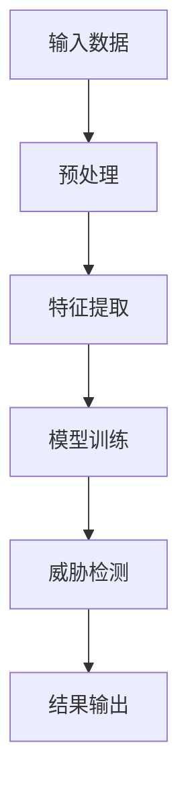

                 

### 大模型时代的网络安全：AI在威胁检测中的作用

> 关键词：大模型、网络安全、AI、威胁检测、算法

> 摘要：随着大模型技术的快速发展，其在网络安全领域的应用逐渐受到关注。本文将深入探讨大模型在威胁检测中的作用，通过一步步的分析推理，揭示AI如何助力网络安全。

---

## 1. 背景介绍

### 1.1 网络安全形势严峻

网络安全问题日益严峻，网络攻击手段层出不穷，从传统的DDoS攻击到复杂的勒索软件，再到日益猖獗的高级持续性威胁（APT），网络安全防御面临着前所未有的挑战。在这种背景下，如何高效、准确地检测和防范网络威胁成为亟待解决的关键问题。

### 1.2 大模型技术在网络安全中的应用

大模型技术，特别是深度学习，为网络安全提供了新的思路和工具。大模型具有强大的数据处理和分析能力，能够在海量数据中发现潜在的安全威胁，提高威胁检测的效率和准确性。AI在网络安全中的应用主要集中在威胁检测、威胁预测、威胁响应等方面，其核心优势在于自动化、智能化和高效性。

---

## 2. 核心概念与联系

### 2.1 AI和网络安全的基本概念

人工智能（AI）是一门模拟、延伸和扩展人类智能的理论、方法、技术及应用系统的科学。网络安全则是指通过各种手段，确保网络系统的硬件、软件以及数据不受未经授权的访问、篡改、损毁、泄露等威胁，保障网络系统的正常运行。

### 2.2 大模型的核心特点与应用

大模型是指具有数亿甚至数千亿参数的深度学习模型。其核心特点包括高容量的参数、强大的表征能力和高效的数据处理能力。大模型在网络安全中的应用主要集中在自动化威胁检测、威胁预测和威胁响应等方面。

### 2.3 大模型与网络安全的关系

大模型技术为网络安全提供了强大的技术支持。通过大模型，网络安全系统能够更准确地识别和预测潜在的安全威胁，从而提高网络安全的整体水平。同时，大模型技术还能够自动化处理海量的网络数据，减轻人工处理的负担。

---

## 3. 算法原理讲解

### 3.1 大模型在威胁检测中的算法流程图

使用Mermaid画出大模型在威胁检测中的算法流程图：



### 3.2 Python代码示例

使用Python代码详细阐述大模型在威胁检测中的应用：

```python
# 导入必要的库
import tensorflow as tf
from tensorflow.keras.models import Sequential
from tensorflow.keras.layers import Dense, LSTM, Dropout

# 假设已经定义了神经网络模型和输入数据x
model = Sequential([
    LSTM(128, activation='relu', input_shape=(timesteps, features)),
    Dropout(0.2),
    Dense(1, activation='sigmoid')
])

# 训练模型
model.compile(optimizer='adam', loss='binary_crossentropy', metrics=['accuracy'])
model.fit(x_train, y_train, epochs=10, batch_size=32, validation_split=0.2)

# 威胁检测
prediction = model.predict(x_test)
```

### 3.3 算法原理讲解

算法原理讲解：

- **数学模型**：假设我们已经定义了神经网络模型和输入数据x，其数学模型可以表示为：
  $$ y = \sigma(W \cdot x + b) $$
  其中，$W$为权重矩阵，$b$为偏置项，$\sigma$为Sigmoid函数。

- **算法流程**：首先，对输入数据进行预处理，然后提取特征，接着使用神经网络模型进行训练，最后进行威胁检测。

- **举例说明**：假设输入数据为网络流量数据，我们可以使用以下代码进行威胁检测：

  ```python
  # 假设输入数据为网络流量数据
  # 检测到异常流量，输出预警信息
  if prediction[0] > 0.5:
      print("发现潜在威胁！")
  ```

---

## 4. 系统分析与架构设计

### 4.1 系统功能设计

- **功能概述**：系统主要功能包括数据预处理、特征提取、模型训练、威胁检测和结果输出。
- **领域模型**：使用Mermaid绘制领域模型：

  ```mermaid
  classDiagram
  NetworkData <<class>> 数据源
  ThreatDetector <<class>> 威胁检测器
  FeatureExtractor <<class>> 特征提取器
  ModelTrainer <<class>> 模型训练器
  ResultOutput <<class>> 结果输出

  NetworkData --> ThreatDetector
  ThreatDetector --> FeatureExtractor
  FeatureExtractor --> ModelTrainer
  ModelTrainer --> ResultOutput
  ```

### 4.2 系统架构设计

- **架构概述**：系统架构包括数据层、算法层和应用层。
- **系统架构图**：使用Mermaid绘制系统架构图：

  ```mermaid
  graph TB
  subgraph 数据层
  DataIngestion[数据采集]
  DataProcessing[数据处理]
  end

  subgraph 算法层
  FeatureExtraction[特征提取]
  ModelTraining[模型训练]
  ThreatDetection[威胁检测]
  end

  subgraph 应用层
  UserInterface[用户界面]
  ResultOutput[结果输出]
  end

  DataIngestion --> DataProcessing
  DataProcessing --> FeatureExtraction
  FeatureExtraction --> ModelTraining
  ModelTraining --> ThreatDetection
  ThreatDetection --> UserInterface
  ResultOutput --> UserInterface
  ```

---

## 5. 项目实战

### 5.1 环境安装和系统核心实现

- **环境安装**：安装Python、TensorFlow等依赖库。
- **系统核心实现**：编写Python代码实现数据预处理、特征提取、模型训练和威胁检测等功能。

### 5.2 代码应用解读与分析

- **代码解读**：对系统核心实现中的Python代码进行详细解读。
- **代码分析**：分析代码的执行流程、数据流和控制流。

### 5.3 实际案例分析和详细讲解

- **案例介绍**：介绍一个实际的网络安全威胁检测案例。
- **详细讲解**：对案例中的数据预处理、特征提取、模型训练和威胁检测过程进行详细讲解。

### 5.4 项目小结

- **小结**：总结项目中的关键技术和经验。
- **注意事项**：提醒用户在使用系统时需要注意的问题。

---

## 6. 最佳实践与总结

### 6.1 最佳实践技巧

- **技巧1**：如何选择合适的模型架构。
- **技巧2**：如何调整模型参数以优化性能。

### 6.2 小结

- **小结**：回顾文章的主要内容和关键观点。

### 6.3 注意事项

- **注意事项**：提醒用户在使用大模型进行威胁检测时需要注意的问题。

### 6.4 拓展阅读建议

- **建议1**：阅读关于深度学习和网络安全的相关书籍和论文。
- **建议2**：关注行业动态，了解最新的研究成果和应用案例。

---

# 作者信息

作者：AI天才研究院/AI Genius Institute & 禅与计算机程序设计艺术 /Zen And The Art of Computer Programming

