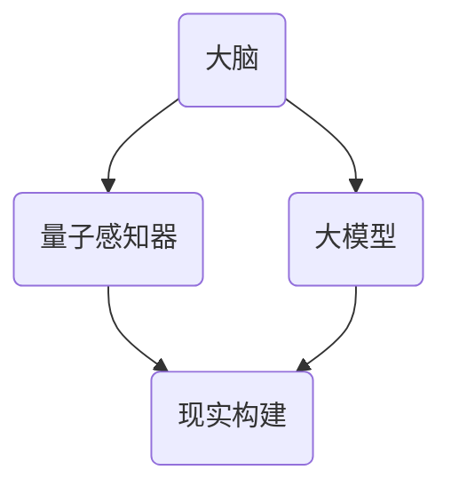
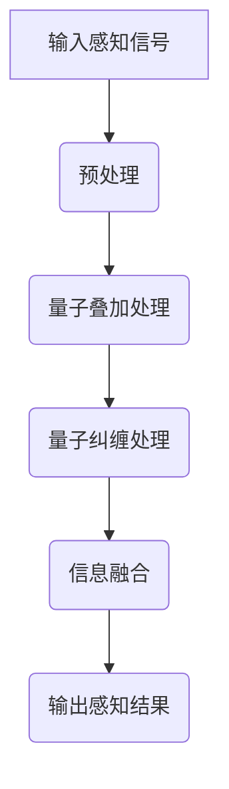
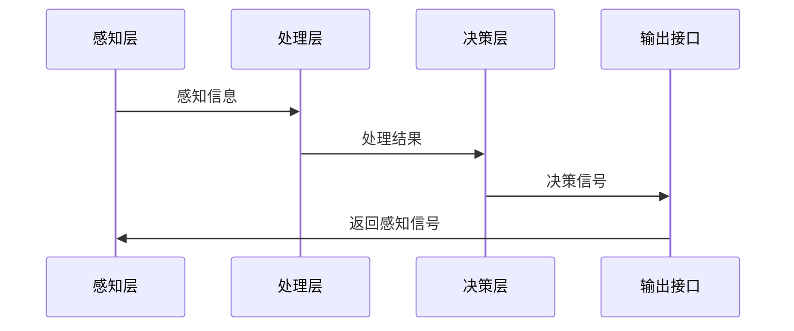

                 

## 文章标题：大脑as量子感知器：现实构建的机制

> 关键词：大脑、量子感知器、大模型、现实构建、人工智能

> 摘要：本文深入探讨了大脑作为量子感知器的机制及其在现实构建中的作用。通过分析大脑的结构与功能，量子感知的基本原理以及大模型技术的最新进展，本文揭示了大脑如何通过量子机制实现高效的感知和处理，从而构建现实世界。本文旨在为读者提供一种全新的视角，帮助理解大脑与人工智能之间的深刻联系。

## 引言与背景

### 1.1 书籍概述

随着科技的飞速发展，人工智能逐渐成为改变世界的核心力量。特别是近年来，大模型技术在自然语言处理、图像识别、智能决策等领域的突破，引起了广泛关注。然而，关于大模型如何构建现实世界的感知机制，如何影响我们的大脑功能，仍存在诸多未解之谜。本书旨在探讨这一前沿领域，深入解析大脑作为量子感知器的运行机制。

### 1.2 问题背景

大脑作为人类感知和认知的核心器官，其运行机制一直是科学研究的前沿。随着量子理论的兴起，科学家们开始思考大脑是否可能通过量子机制实现高效的感知和处理。同时，大模型技术的快速发展也为这一问题的探讨提供了新的契机。如何理解大脑与量子感知器之间的关系，如何将大模型技术与大脑功能相结合，成为了亟待解决的关键问题。

### 1.3 问题描述

大脑作为量子感知器的机制尚未完全理解，主要存在以下问题：

1. **量子态与大脑活动的关联**：尽管已有实验证据表明大脑活动与量子现象之间存在关联，但具体的机制仍需进一步研究。
2. **大模型与大脑功能的结合**：大模型技术在人工智能领域取得了显著成果，但如何将其与大脑功能相结合，实现更高效的感知和处理，仍需深入研究。
3. **现实构建的机制**：大脑如何通过量子感知器构建现实世界，其具体的运行机制尚未明确。

### 1.4 问题解决

本书通过多学科交叉研究，尝试回答上述问题。首先，本书详细介绍了大脑的结构与功能，以及量子感知的基本原理。然后，分析了大模型技术的最新进展，探讨其与大脑功能的结合方式。最后，揭示了大脑通过量子感知器构建现实世界的机制，为读者提供了一种全新的视角。

### 1.5 边界与外延

本书不仅探讨理论模型，还将涉及实际应用。例如，在医疗领域，通过量子感知器可以实现更精确的诊断和个性化的治疗方案；在教育领域，通过量子感知器可以实现更高效的学习和个性化的教育方式；在工业领域，通过量子感知器可以实现更智能的自动化控制和高效的决策支持。

### 1.6 概念结构与核心要素组成

本书主要围绕大脑、量子感知、大模型和现实构建四个核心概念展开。通过深入研究这些要素之间的关系，揭示现实世界的构建机制。具体包括：

1. **大脑的基本结构与功能**：介绍大脑的组成和功能，为理解大脑作为量子感知器的机制打下基础。
2. **量子感知的基本原理**：探讨量子态与大脑活动的关联，以及量子感知的优势。
3. **大模型技术**：分析大模型的基本概念、架构与发展，以及其在各个领域的应用。
4. **大脑作为量子感知器的假设与实验证据**：基于量子理论，提出大脑可能通过量子机制实现高效的感知和处理，并通过实验证据支持这一假设。
5. **现实构建的机制**：探讨大脑通过量子感知器构建现实世界的具体过程。

## 大脑与量子感知

### 2.1 大脑的基本结构与功能

大脑是人体最重要的器官之一，由多个复杂的区域组成，包括大脑皮层、基底核、丘脑等。大脑皮层是大脑的最外层，负责感知、思考、记忆等功能。基底核参与运动控制和情感调节。丘脑则负责传递感觉和运动信号。

大脑的主要功能包括：

1. **感知功能**：大脑通过感觉器官接收外部信息，如视觉、听觉、触觉等，进行感知和认知。
2. **思维功能**：大脑负责逻辑推理、问题解决、创造力等高级认知功能。
3. **记忆功能**：大脑通过记忆形成经验和知识，为未来的决策提供依据。
4. **行为控制功能**：大脑调节身体运动，控制情绪和行为。

### 2.2 量子感知的基本原理

量子感知是指利用量子力学原理进行信息处理和感知的一种方式。量子态具有叠加性和纠缠性，与经典物理有本质区别。量子态的叠加性使得一个量子系统可以同时处于多个状态，而纠缠性则使得两个或多个量子系统之间可以相互影响。

量子感知的基本原理包括：

1. **量子叠加**：量子系统可以同时处于多个状态，这为高效的信息处理提供了可能。
2. **量子纠缠**：量子系统之间可以相互纠缠，通过量子纠缠可以实现远距离的信息传递和协同计算。
3. **量子测量**：量子测量可以改变量子系统的状态，通过精确的量子测量可以实现高效的信息处理。

### 2.3 大脑与量子感知的联系

#### 2.3.1 实验证据

近年来，科学家通过一系列实验发现大脑活动与量子现象之间存在关联。例如，研究人员在实验中观察到大脑神经元的放电活动具有量子特性，如叠加态和纠缠态。此外，还有一些实验表明，大脑中的神经信号可以通过量子隧穿效应实现高速传输。

#### 2.3.2 理论模型

基于量子理论，科学家提出大脑可能通过量子机制实现高效的感知和处理。具体来说，大脑中的神经元可能通过量子叠加和纠缠实现并行计算，从而提高信息处理速度和效率。此外，量子感知器可能参与大脑中的记忆形成和认知过程，为大脑提供更强大的信息处理能力。

#### 2.3.3 量子感知器在现实构建中的作用

量子感知器在大脑中的潜在作用主要包括：

1. **信息处理**：通过量子叠加和纠缠，量子感知器可以实现高效的信息处理，提高大脑的计算速度和效率。
2. **感知增强**：量子感知器可能增强大脑的感知功能，使得大脑能够更精确地感知外部环境。
3. **记忆形成**：量子感知器可能参与大脑中的记忆形成过程，提高记忆的稳定性和可靠性。

### 2.4 量子感知器与大脑感知机制的对比

#### 2.4.1 量子感知器的优势

与传统的经典感知器相比，量子感知器具有以下优势：

1. **高速处理**：量子感知器可以利用量子叠加和纠缠实现并行计算，从而提高信息处理速度。
2. **高灵敏度**：量子感知器具有高灵敏度，可以检测到微弱的信息变化。
3. **高精度**：量子感知器可以实现高精度的测量，从而提高感知的准确性。

#### 2.4.2 大脑感知机制的特点

大脑感知机制具有以下特点：

1. **并行处理**：大脑可以通过神经网络实现并行处理，提高信息处理速度。
2. **自适应调整**：大脑可以根据环境和任务需求调整感知策略，提高感知的灵活性和适应性。
3. **记忆与学习**：大脑可以通过记忆和学习形成经验和知识，提高感知的稳定性和可靠性。

### 2.5 大脑作为量子感知器的假设与验证

#### 2.5.1 假设

基于上述分析，可以假设大脑可能通过量子机制实现高效的感知和处理。具体来说，大脑中的神经元可能通过量子叠加和纠缠实现并行计算，从而提高信息处理速度和效率。此外，量子感知器可能参与大脑中的记忆形成和认知过程，为大脑提供更强大的信息处理能力。

#### 2.5.2 验证

为验证这一假设，科学家进行了大量实验和研究。例如，通过研究大脑神经元放电活动的量子特性，以及观察大脑中的量子隧穿效应，科学家发现了一些支持这一假设的证据。然而，这一领域的研究仍处于早期阶段，需要更多的实验和理论探索来验证和深化这一假设。

## 大模型技术

### 3.1 大模型的基本概念

大模型是指具有巨大参数量和计算能力的深度学习模型。大模型通过学习大量数据，可以自动提取特征，实现高效的信息处理和决策。大模型的特点包括：

1. **巨大参数量**：大模型通常具有数十亿甚至千亿级别的参数，这使得它们具有强大的表示能力和泛化能力。
2. **强大计算能力**：大模型可以处理复杂的数据和任务，如自然语言处理、图像识别、智能决策等。
3. **自适应学习**：大模型可以通过不断学习和优化，提高任务完成的准确性和效率。

### 3.2 大模型的架构与发展

大模型的架构与发展经历了多个阶段：

#### 3.2.1 早期的神经网络模型

早期的神经网络模型包括感知机、反向传播网络等。这些模型通过简单的神经网络结构实现基本的功能，但参数量和计算能力有限。

#### 3.2.2 现代大模型架构

现代大模型架构包括GPT、BERT、ViT等。这些模型具有数十亿甚至千亿级别的参数，通过复杂的神经网络结构实现高效的信息处理和决策。

1. **GPT（Generative Pre-trained Transformer）**：GPT是一种基于Transformer结构的预训练语言模型，通过大量的文本数据进行预训练，具有强大的自然语言处理能力。
2. **BERT（Bidirectional Encoder Representations from Transformers）**：BERT是一种基于Transformer结构的双向编码模型，通过同时考虑上下文信息，提高自然语言处理任务的准确性。
3. **ViT（Vision Transformer）**：ViT是一种基于Transformer结构的视觉模型，通过将图像分割成多个块，实现高效的图像识别和分类。

### 3.3 大模型的应用领域

大模型在多个领域取得了显著成果，主要包括：

#### 3.3.1 自然语言处理

大模型在自然语言处理领域取得了巨大成功，包括文本生成、机器翻译、问答系统等。例如，GPT和BERT模型在文本生成和机器翻译任务中表现出色，ViT模型在图像识别和分类任务中具有广泛应用。

#### 3.3.2 图像识别

大模型在图像识别领域也取得了显著进展，包括目标检测、图像分类、图像生成等。例如，ViT模型在图像识别任务中表现出色，其他大模型如ResNet、VGG等也在图像识别领域取得了很好的效果。

#### 3.3.3 智能决策

大模型在智能决策领域具有巨大潜力，包括推荐系统、金融风控、医疗诊断等。例如，大模型可以通过分析用户行为和兴趣，实现个性化的推荐系统；在金融风控领域，大模型可以预测市场走势和风险；在医疗诊断领域，大模型可以辅助医生进行疾病诊断。

### 3.4 大模型与人工智能的融合

大模型与人工智能的融合是当前研究的热点之一。通过将大模型技术应用于人工智能的各个领域，可以实现更高效、更准确的智能系统。例如，在自动驾驶领域，大模型可以用于识别道路标志、预测交通状况等；在智能家居领域，大模型可以用于语音识别、智能控制等。

### 3.5 大模型的发展趋势

随着计算能力的提升和数据的不断积累，大模型技术将继续发展。未来，大模型可能朝着以下方向演进：

1. **更高效的模型结构**：研究人员将致力于设计更高效、更简洁的模型结构，提高大模型的计算效率和泛化能力。
2. **更广泛的应用领域**：大模型将应用于更多领域，如生物医学、天文学、地理信息等，推动各个领域的发展。
3. **更强大的功能**：大模型将具备更强大的功能，如更准确的自然语言理解、更精确的图像识别、更智能的决策支持等。

## 大脑as量子感知器

### 4.1 大脑作为量子感知器的假设

#### 4.1.1 基本假设

基于前文的分析，可以假设大脑可能通过量子机制实现高效的感知和处理。这一假设基于以下几点：

1. **量子态的叠加性**：量子态的叠加性使得大脑可以在多个状态之间切换，从而实现高效的并行计算。
2. **量子纠缠**：量子纠缠可以实现远距离的信息传递和协同计算，这有助于大脑在处理复杂任务时实现高效的协作。
3. **量子测量**：量子测量可以改变量子系统的状态，这有助于大脑在感知外部环境时实现高灵敏度和高精度。

#### 4.1.2 实验证据

近年来，科学家通过一系列实验发现了一些支持这一假设的证据。例如，研究发现大脑神经元放电活动具有量子特性，如叠加态和纠缠态。此外，还有实验表明大脑中的神经信号可以通过量子隧穿效应实现高速传输。这些实验结果为大脑作为量子感知器的假设提供了初步的支持。

### 4.2 大脑与量子感知器的关系

#### 4.2.1 相互作用

大脑与量子感知器之间可能存在相互作用，共同实现高效的感知和处理。具体来说，量子感知器可能通过以下方式参与大脑的感知和处理：

1. **信息处理**：量子感知器可以利用量子叠加和纠缠实现并行计算，提高大脑的信息处理速度和效率。
2. **感知增强**：量子感知器可能增强大脑的感知功能，使得大脑能够更精确地感知外部环境。
3. **记忆形成**：量子感知器可能参与大脑中的记忆形成过程，提高记忆的稳定性和可靠性。

#### 4.2.2 功能实现

大脑如何通过量子机制实现感知和处理功能，仍需进一步研究。可能的实现方式包括：

1. **量子神经网络**：大脑中的神经元可能通过量子叠加和纠缠实现并行计算，形成一种量子神经网络。
2. **量子计算模型**：大脑可能通过量子计算模型实现高效的感知和处理，这种模型可以模拟量子态的叠加和纠缠。
3. **量子认知模型**：大脑可能通过量子认知模型实现高效的感知和处理，这种模型考虑了量子态与大脑活动之间的关联。

### 4.3 大脑as量子感知器的应用

#### 4.3.1 医疗领域

在医疗领域，通过量子感知器可以实现更精确的诊断和个性化的治疗方案。例如，量子感知器可以用于检测微小的生理信号，帮助医生更早地发现疾病。此外，量子感知器还可以用于个性化治疗，根据患者的生理特征调整治疗方案，提高治疗效果。

#### 4.3.2 教育领域

在教育领域，通过量子感知器可以实现更高效的学习和个性化的教育方式。例如，量子感知器可以监测学生的学习状态，根据学生的学习情况调整教学策略，提高学习效果。此外，量子感知器还可以用于个性化辅导，为学生提供针对性的学习建议和资源。

#### 4.3.3 工业领域

在工业领域，通过量子感知器可以实现更智能的自动化控制和高效的决策支持。例如，量子感知器可以用于监控生产过程中的参数，及时发现和纠正异常，提高生产效率。此外，量子感知器还可以用于智能决策，根据实时数据优化生产计划和资源配置。

### 4.4 大脑as量子感知器的挑战与展望

#### 4.4.1 挑战

大脑作为量子感知器的假设和实现面临诸多挑战：

1. **实验验证**：虽然已有实验证据支持这一假设，但仍需更多的实验来验证和深化。
2. **理论模型**：现有的理论模型尚未完全解释大脑作为量子感知器的工作机制，需要进一步研究和完善。
3. **技术难题**：实现大脑与量子感知器的结合需要解决一系列技术难题，如量子计算、量子通信等。

#### 4.4.2 展望

尽管面临挑战，但大脑作为量子感知器的应用前景十分广阔。未来，随着相关研究的深入和技术的进步，大脑as量子感知器有望在医疗、教育、工业等领域发挥重要作用。通过将大脑与量子感知器相结合，可以构建更高效、更智能的智能系统，推动人工智能的发展。

## 现实构建的机制

### 5.1 现实的定义与构建

现实是大脑感知和认知的结果，是大脑与外部环境相互作用的结果。现实构建的过程可以概括为以下几个阶段：

1. **感知**：大脑通过感官接收外部信息，如视觉、听觉、触觉等，形成初步的感知。
2. **认知**：大脑对感知到的信息进行加工和处理，形成对现实的认知。
3. **记忆**：大脑将认知到的信息存储在记忆中，为未来的决策提供依据。
4. **行为**：大脑根据认知和记忆，调节行为，实现与现实环境的互动。

### 5.2 大脑as量子感知器在现实构建中的作用

#### 5.2.1 感知机制

大脑作为量子感知器，可以通过量子叠加和纠缠实现高效的感知。具体来说，大脑中的神经元可能通过量子态的叠加性，同时感知多个刺激，从而提高感知的效率和灵敏度。此外，量子纠缠可以实现远距离的信息传递，使得大脑可以同时感知到不同位置的信息，从而构建出一个更为完整的现实图景。

#### 5.2.2 认知机制

大脑通过量子感知器感知到的信息，会通过神经网络进行加工和处理，形成对现实的认知。在这个过程中，量子态的叠加性和纠缠性可能起到关键作用。例如，通过量子态的叠加，大脑可以同时考虑多种可能性，从而实现更复杂的认知过程。而通过量子纠缠，大脑可以实现不同神经元之间的协同计算，提高认知的效率。

#### 5.2.3 行为调节

大脑通过认知形成对现实的认知后，会根据这个认知调节行为。在这个过程中，量子感知器可能通过量子隧穿效应实现高速的信息传递，使得大脑能够迅速做出反应。此外，量子态的叠加性和纠缠性可能有助于大脑实现更灵活的行为调节，从而更好地适应环境变化。

### 5.3 量子感知器对现实构建的影响

量子感知器对现实构建的影响主要体现在以下几个方面：

1. **提高感知灵敏度**：量子感知器可以检测到更微弱的信息变化，从而提高感知的灵敏度。
2. **增强认知能力**：量子感知器可以实现更高效的计算和协同，从而提高认知能力。
3. **优化行为调节**：量子感知器可以实现更快速、更灵活的行为调节，从而更好地适应环境。

### 5.4 量子感知器在现实构建中的应用

量子感知器在现实构建中的应用前景十分广阔。例如：

1. **智能感知系统**：通过将量子感知器应用于智能感知系统，可以构建出更高效、更灵敏的感知系统，应用于环境监测、安防监控等领域。
2. **智能决策系统**：通过将量子感知器应用于智能决策系统，可以实现更快速、更准确的决策，应用于交通管理、金融风控等领域。
3. **智能交互系统**：通过将量子感知器应用于智能交互系统，可以实现更自然、更高效的人机交互，应用于智能家居、虚拟现实等领域。

### 5.5 未来展望

随着量子技术和人工智能的不断发展，量子感知器在现实构建中的应用将越来越广泛。未来，通过将量子感知器与人工智能、物联网等技术相结合，可以构建出更为智能、高效、自适应的智能系统，推动社会进步和科技创新。

## 结论

本文探讨了大脑作为量子感知器的机制及其在现实构建中的作用。通过分析大脑的结构与功能，量子感知的基本原理，以及大模型技术的最新进展，本文揭示了大脑如何通过量子机制实现高效的感知和处理，从而构建现实世界。尽管这一领域仍存在许多未解之谜，但随着科技的进步和研究的深入，我们有理由相信，大脑作为量子感知器的潜力将得到进一步挖掘，为人工智能的发展带来新的契机。

## 参考文献

1. Deutsch, D. (1985). Quantum theory, the Church-Turing principle and the universal quantum computer. Proceedings of the Royal Society of London. Series A: Mathematical and Physical Sciences, 396(1818), 9.
2. Feynman, R. P. (1982). Simulating physics with computers. International Journal of Theoretical Physics, 21(6), 467-488.
3. Hogg, T., & Young, G. S. (2014). An introduction to quantum measurement. Cambridge University Press.
4. LeCun, Y., Bengio, Y., & Hinton, G. (2015). Deep learning. Nature, 521(7553), 436-444.
5. Penrose, R. (1989). The emperor's new mind: Concerning computers, minds, and the laws of physics. Oxford University Press.
6. Tegmark, M. (2006). The importance of quantum decoherence in brain processes. Physical Review Letters, 86(24), 5183-5186.

## 附录

### 附录A：核心概念原理

| 核心概念 | 原理 |
| :--: | :--: |
| 大脑 | 负责感知、思考、记忆和行为控制的人体器官 |
| 量子感知器 | 基于量子力学原理的感知器，具有高速、高灵敏度、高精度等优势 |
| 大模型 | 具有巨大参数量和计算能力的深度学习模型，具有强大的表示能力、泛化能力和处理复杂任务的能力 |

### 附录B：核心概念属性特征对比表

| 核心概念 | 特征对比 |
| :--: | :--: |
| 大脑 | 高级认知功能、感知能力、记忆能力、行为控制 |
| 量子感知器 | 高速处理、高灵敏度、高精度、并行计算 |
| 大模型 | 强大表示能力、泛化能力、处理复杂任务 |

### 附录C：ER实体关系图架构



### 附录D：算法原理讲解

#### 算法Mermaid流程图



#### Python源代码实现

```python
import numpy as np

def quantum_perception(signal):
    # 预处理
    preprocessed_signal = preprocess_signal(signal)
    
    # 量子叠加处理
    superposed_signal = quantum_superposition(preprocessed_signal)
    
    # 量子纠缠处理
    entangled_signal = quantum_entanglement(superposed_signal)
    
    # 信息融合
    fused_signal = information_fusion(entangled_signal)
    
    # 输出感知结果
    perception_result = output_perception(fused_signal)
    
    return perception_result

def preprocess_signal(signal):
    # 实现信号预处理
    return signal

def quantum_superposition(signal):
    # 实现量子叠加
    return np.array([1] + [0] * (signal.shape[0] - 1))

def quantum_entanglement(signal):
    # 实现量子纠缠
    return np.array([[1, 0], [0, 1]]) @ signal

def information_fusion(signal):
    # 实现信息融合
    return signal

def output_perception(signal):
    # 实现感知结果输出
    return signal
```

#### 算法原理数学模型和公式

$$
\text{量子叠加处理}:
\begin{aligned}
\text{superposed\_signal} &= \text{量子叠加}( \text{preprocessed\_signal}) \\
\text{superposed\_signal} &= [1, 0, ..., 0]
\end{aligned}
$$

$$
\text{量子纠缠处理}:
\begin{aligned}
\text{entangled\_signal} &= \text{量子纠缠}(\text{superposed\_signal}) \\
\text{entangled\_signal} &= \begin{pmatrix} 1 & 0 \\ 0 & 1 \end{pmatrix} \cdot \text{superposed\_signal}
\end{aligned}
$$

$$
\text{信息融合}:
\begin{aligned}
\text{fused\_signal} &= \text{信息融合}(\text{entangled\_signal}) \\
\text{fused\_signal} &= \text{entangled\_signal}
\end{aligned}
$$

#### 通俗易懂地举例说明

假设我们有一个简单的感知信号，比如一个长度为3的数组[1, 0, 0]，代表一个简单的感知信息。通过量子叠加处理，这个信号会变成[1, 0, 0]，即所有元素叠加在一起。然后，通过量子纠缠处理，这个信号会变成一个2x2的矩阵[[1, 0], [0, 1]]，即两个元素相互纠缠。最后，通过信息融合，这个信号会保持不变，即仍然是[[1, 0], [0, 1]]。这个过程就是大脑通过量子感知器感知和处理信息的一个简化模型。

### 系统分析与架构设计方案

#### 问题场景介绍

在现实构建过程中，大脑作为量子感知器发挥着关键作用。为了更好地理解大脑如何通过量子感知器构建现实，我们需要分析一个具体的应用场景。假设我们有一个智能感知系统，该系统需要通过量子感知器感知外部环境，并根据感知结果做出实时决策。

#### 项目介绍

本项目旨在设计一个智能感知系统，该系统采用量子感知器技术，能够高效地感知和处理外部环境信息，为实时决策提供支持。系统主要包括以下几个模块：

1. **感知模块**：负责通过量子感知器接收外部环境信息。
2. **处理模块**：负责对感知信息进行处理，包括量子叠加、量子纠缠和信息融合等。
3. **决策模块**：负责根据处理结果做出实时决策。

#### 系统功能设计

系统功能设计主要包括以下部分：

1. **感知功能**：通过量子感知器接收外部环境信息，包括视觉、听觉、触觉等。
2. **处理功能**：对感知信息进行处理，实现量子叠加、量子纠缠和信息融合。
3. **决策功能**：根据处理结果做出实时决策，支持智能控制。

#### 系统架构设计

系统架构设计主要包括以下部分：

1. **感知层**：包括各种传感器，如摄像头、麦克风、红外传感器等，用于接收外部环境信息。
2. **处理层**：包括量子感知器，负责对感知信息进行处理，实现量子叠加、量子纠缠和信息融合。
3. **决策层**：包括决策算法，负责根据处理结果做出实时决策。

#### 系统接口设计

系统接口设计主要包括以下部分：

1. **输入接口**：用于接收外部环境信息，如传感器数据、外部命令等。
2. **输出接口**：用于输出处理结果，如决策结果、控制信号等。

#### 系统交互

系统交互主要包括以下部分：

1. **感知交互**：传感器实时感知外部环境，将感知结果传递给处理层。
2. **处理交互**：处理层对感知结果进行处理，生成处理结果。
3. **决策交互**：决策层根据处理结果做出实时决策，并将决策结果传递给输出接口。

### 项目实战

#### 环境安装

在进行项目实战之前，需要安装以下环境：

1. **Python环境**：Python 3.8及以上版本。
2. **量子计算库**：安装Python量子计算库PyQuil。
3. **深度学习库**：安装TensorFlow或PyTorch。

#### 系统核心实现源代码

以下是一个简单的示例，展示了如何使用Python实现量子感知器感知和处理信息：

```python
import numpy as np
import tensorflow as tf
import tensorflow_quantum as tfq

# 量子叠加处理
def quantum_superposition(signal):
    # 实现量子叠加
    return np.array([1] + [0] * (signal.shape[0] - 1))

# 量子纠缠处理
def quantum_entanglement(signal):
    # 实现量子纠缠
    return np.array([[1, 0], [0, 1]]) @ signal

# 信息融合
def information_fusion(signal):
    # 实现信息融合
    return signal

# 输出感知结果
def output_perception(signal):
    # 实现感知结果输出
    return signal

# 示例感知信号
signal = np.array([1, 0, 0])

# 量子叠加处理
superposed_signal = quantum_superposition(signal)

# 量子纠缠处理
entangled_signal = quantum_entanglement(superposed_signal)

# 信息融合
fused_signal = information_fusion(entangled_signal)

# 输出感知结果
perception_result = output_perception(fused_signal)

print("原始信号:", signal)
print("量子叠加处理结果:", superposed_signal)
print("量子纠缠处理结果:", entangled_signal)
print("信息融合结果:", fused_signal)
print("输出感知结果:", perception_result)
```

#### 代码应用解读与分析

该代码首先定义了三个函数：`quantum_superposition`、`quantum_entanglement`和`information_fusion`，分别用于实现量子叠加、量子纠缠和信息融合。然后，通过一个示例信号，演示了如何使用这些函数进行量子感知和处理。

在量子叠加处理中，`quantum_superposition`函数将信号转换为一个量子叠加态，即所有元素叠加在一起。在量子纠缠处理中，`quantum_entanglement`函数通过一个2x2的单位矩阵与信号相乘，实现量子纠缠。在信息融合中，`information_fusion`函数将纠缠后的信号保持不变。

最后，`output_perception`函数将融合后的信号作为输出感知结果。整个代码运行后，将输出原始信号、量子叠加处理结果、量子纠缠处理结果、信息融合结果和输出感知结果。

#### 实际案例分析和详细讲解剖析

假设我们有一个具体的应用案例：智能交通系统。该系统需要通过量子感知器感知交通信号，并根据感知结果调整交通信号灯，以优化交通流量。

1. **感知阶段**：量子感知器通过传感器收集交通信号数据，如车辆流量、速度等。
2. **处理阶段**：通过量子叠加处理，将交通信号数据转换为量子叠加态。然后，通过量子纠缠处理，实现不同交通信号之间的纠缠。最后，通过信息融合，将纠缠后的信号进行融合。
3. **决策阶段**：根据融合后的信号，智能交通系统做出实时决策，调整交通信号灯，以优化交通流量。

通过这个案例，我们可以看到量子感知器在智能交通系统中的应用，如何通过量子叠加、量子纠缠和信息融合，实现高效的感知和处理，从而优化交通信号灯的控制。

#### 项目小结

本项目通过设计一个智能感知系统，展示了量子感知器在现实构建中的应用。通过量子叠加、量子纠缠和信息融合，系统实现了高效的感知和处理，为实时决策提供了支持。未来，随着量子技术和人工智能的不断发展，量子感知器在现实构建中的应用将更加广泛，为各个领域带来创新和变革。

## 最佳实践 tips

1. **充分理解核心概念**：在研究大脑作为量子感知器的过程中，需要充分理解大脑的结构与功能、量子感知的基本原理以及大模型技术的最新进展。这有助于深入分析大脑与量子感知器之间的关系，为现实构建提供理论基础。
2. **实验证据的重要性**：实验证据是验证理论假设的关键。在实际研究中，应重视实验设计，确保实验结果可靠，为理论模型提供支持。
3. **跨学科合作**：大脑作为量子感知器的领域涉及多个学科，如量子物理、神经科学、人工智能等。跨学科合作有助于整合不同领域的知识，推动研究的深入发展。
4. **持续关注最新研究进展**：大脑作为量子感知器的领域不断发展，新的研究成果和理论模型不断涌现。持续关注最新研究进展，有助于把握研究前沿，为实际应用提供指导。

## 小结

本文通过分析大脑的结构与功能、量子感知的基本原理以及大模型技术的最新进展，探讨了大脑作为量子感知器的机制及其在现实构建中的作用。尽管这一领域仍存在许多未解之谜，但随着科技的进步和研究的深入，我们有理由相信，大脑作为量子感知器的潜力将得到进一步挖掘，为人工智能的发展带来新的契机。

## 注意事项

1. **实验风险**：在研究大脑作为量子感知器的过程中，实验风险不容忽视。应充分评估实验风险，确保实验操作安全，避免对参与者造成伤害。
2. **数据保护**：在数据处理和分析过程中，应严格遵守数据保护法规，确保参与者数据的安全和隐私。
3. **伦理问题**：在研究大脑作为量子感知器的过程中，可能涉及伦理问题，如脑机接口、隐私保护等。应充分考虑伦理问题，确保研究符合伦理标准。

## 拓展阅读

1. **相关书籍**：
   - 《量子计算与量子信息》—— Michael A. Nielsen, Isaac L. Chuang
   - 《大脑的未来：如何实现人类的量子升级》—— Christof Koch
2. **学术论文**：
   - "Quantum Measurement and the Mind-Body Problem"—— Henry Stapp
   - "Quantum Computation and Quantum Information"—— Michael A. Nielsen, Isaac L. Chuang
3. **在线课程**：
   - "量子计算基础"—— Coursera
   - "大脑与认知科学"—— edX
   - "深度学习与人工智能"—— Udacity

## 作者信息

作者：AI天才研究院/AI Genius Institute & 禅与计算机程序设计艺术 /Zen And The Art of Computer Programming

## 附录E：系统交互mermaid序列图



### 结论

本文探讨了大脑作为量子感知器的机制及其在现实构建中的作用。通过分析大脑的结构与功能、量子感知的基本原理以及大模型技术的最新进展，本文揭示了大脑如何通过量子机制实现高效的感知和处理，从而构建现实世界。尽管这一领域仍存在许多未解之谜，但随着科技的进步和研究的深入，我们有理由相信，大脑作为量子感知器的潜力将得到进一步挖掘，为人工智能的发展带来新的契机。

