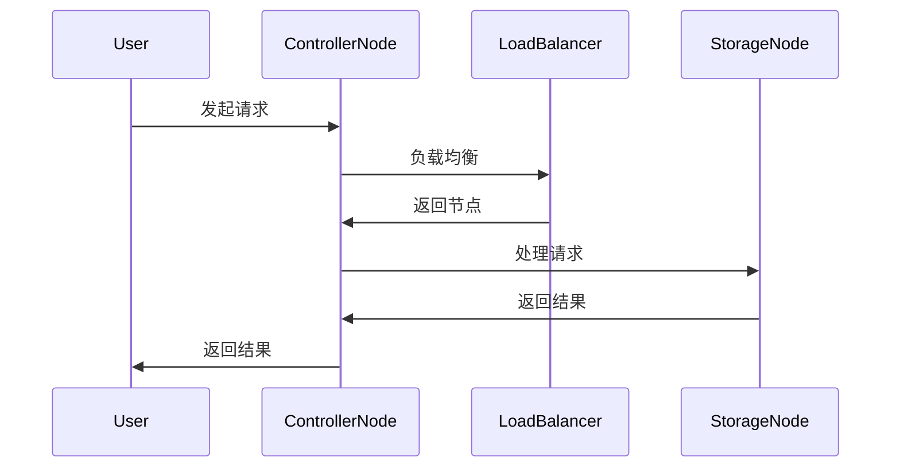
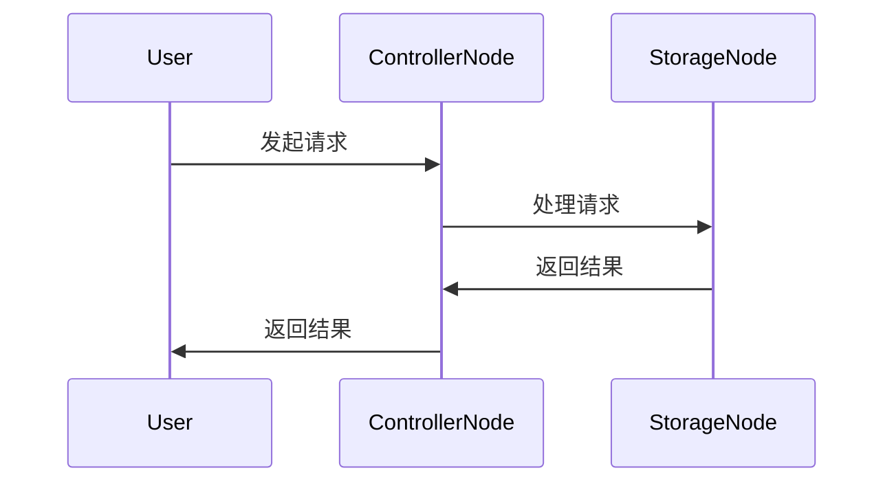

                 

### 大规模分布式存储系统设计

#### 关键词：分布式存储，数据分片，一致性模型，复制机制，系统架构，项目实战

> 摘要：随着数据量的激增，传统的集中式存储系统逐渐难以满足现代应用的需求。大规模分布式存储系统以其高可用性、高性能、高可扩展性等特点，成为了当前存储技术的主流。本文将详细探讨大规模分布式存储系统的设计原理、核心概念、算法原理以及实际应用，为读者提供一个全面的技术视角。

#### 目录大纲：

----------------------------------------------------------------

# 大规模分布式存储系统设计

## 第一部分：背景与概述

## 第1章：大规模分布式存储系统的背景

### 1.1.1 大规模分布式存储系统的产生背景

### 1.1.2 大规模分布式存储系统的需求分析

### 1.1.3 大规模分布式存储系统的核心要素

## 第2章：分布式存储系统概述

### 2.1.1 分布式存储系统的定义与特点

### 2.1.2 分布式存储系统的体系结构

### 2.1.3 分布式存储系统与集中式存储系统的对比

## 第3章：大规模分布式存储系统的核心概念与联系

### 3.1.1 数据分片原理与机制

### 3.1.2 分布式一致性模型

### 3.1.3 分布式复制机制

### 3.1.4 分布式存储系统的可靠性设计

## 第二部分：分布式存储系统的数学模型与算法原理

## 第4章：分布式存储系统的数学模型与算法原理

### 4.1.1 数据分片算法原理讲解

### 4.1.2 分布式一致性算法讲解

### 4.1.3 分布式复制算法讲解

## 第5章：大规模分布式存储系统的系统分析与架构设计方案

### 5.1.1 问题场景介绍

### 5.1.2 项目介绍

### 5.1.3 系统功能设计

### 5.1.4 系统架构设计

### 5.1.5 系统接口设计

### 5.1.6 系统交互设计

## 第6章：大规模分布式存储系统项目实战

### 6.1.1 环境安装与配置

### 6.1.2 系统核心实现源代码解读

### 6.1.3 实际案例分析

### 6.1.4 详细讲解剖析

### 6.1.5 项目小结

## 第7章：大规模分布式存储系统最佳实践

### 7.1.1 最佳实践 tips

### 7.1.2 注意事项

### 7.1.3 拓展阅读

----------------------------------------------------------------

---

### 1.1.1 大规模分布式存储系统的产生背景

在互联网时代，数据已经成为企业的重要资产。传统的集中式存储系统，如企业级的文件服务器和数据库，由于在性能、可扩展性和成本方面的局限性，已无法满足日益增长的数据存储需求。例如，当数据量达到PB级别甚至更高时，集中式存储系统往往面临以下问题：

- **性能瓶颈**：集中式存储系统通常依赖于单台或少量服务器，数据访问和处理速度受限。
- **扩展性差**：增加存储容量通常需要购买新的存储设备，导致系统升级复杂且成本高昂。
- **可用性低**：单点故障可能导致整个系统的瘫痪。
- **成本高**：高性能的存储设备价格昂贵。

为了解决这些问题，分布式存储系统应运而生。分布式存储系统通过将数据分布存储在多个节点上，实现了数据的分布式访问和处理，从而提高了系统的性能、可用性和可扩展性。

### 1.1.2 大规模分布式存储系统的需求分析

大规模分布式存储系统需要满足以下需求：

- **高可用性**：系统必须能够容忍节点故障，保证数据不丢失。
- **高性能**：系统能够快速响应大量的读写请求。
- **高可扩展性**：系统能够方便地增加或减少存储节点，以满足数据增长的需求。
- **数据安全性**：系统能够提供数据加密、备份和恢复功能，确保数据安全。
- **数据一致性**：分布式系统中各个节点上的数据应保持一致。
- **易用性**：系统应该易于安装、配置和管理。

### 1.1.3 大规模分布式存储系统的核心要素

大规模分布式存储系统的核心要素包括：

- **数据分片**：将数据划分成多个小数据块，分布到多个节点上存储。
- **分布式一致性模型**：确保分布式系统中数据的一致性。
- **分布式复制机制**：实现数据的冗余存储，提高系统的可靠性。
- **故障恢复**：在节点故障时，系统能够自动恢复数据。
- **负载均衡**：合理分配读写请求，避免单点过载。
- **数据访问控制**：确保只有授权用户可以访问数据。
- **数据备份与恢复**：提供数据备份和恢复机制，防止数据丢失。

---

### 2.1.1 分布式存储系统的定义与特点

分布式存储系统是一种通过计算机网络连接多个存储设备，共同提供数据存储和访问服务的系统。与传统的集中式存储系统相比，分布式存储系统具有以下特点：

- **高可用性**：通过数据冗余和故障恢复机制，分布式存储系统可以在节点故障时保证数据不丢失。
- **高性能**：分布式存储系统通过并行处理和数据本地化，提高了数据访问和处理速度。
- **高可扩展性**：分布式存储系统可以轻松地增加或减少存储节点，以适应数据增长的需求。
- **数据冗余**：分布式存储系统通过数据复制，提高了数据的可靠性。
- **负载均衡**：分布式存储系统通过负载均衡机制，合理分配读写请求，避免了单点过载。

### 2.1.2 分布式存储系统的体系结构

分布式存储系统的体系结构通常包括以下部分：

- **存储节点**：负责存储数据，并处理读写请求。
- **控制节点**：负责管理存储节点，协调数据分布和负载均衡。
- **数据复制机制**：确保数据在多个节点之间同步，提高系统的可靠性。
- **负载均衡机制**：合理分配读写请求，避免单点过载。
- **数据访问控制**：确保只有授权用户可以访问数据。
- **监控和管理系统**：监控系统运行状态，提供日志记录和报警功能。

### 2.1.3 分布式存储系统与集中式存储系统的对比

分布式存储系统与集中式存储系统在多个方面存在差异：

| 特性       | 分布式存储系统                          | 集中式存储系统                          |
| ---------- | ------------------------------------- | ------------------------------------- |
| 性能       | 并行处理，高性能                       | 单点处理，性能受限                     |
| 可用性     | 高可用性，容错性强                     | 低可用性，单点故障可能导致系统瘫痪     |
| 扩展性     | 易扩展，节点可灵活增加或减少           | 扩展性较差，通常需要购买新的存储设备   |
| 成本       | 较低，可利用廉价的存储设备             | 较高，需要高性能的存储设备             |
| 数据冗余    | 数据冗余，提高系统可靠性               | 数据冗余性较低，依赖于单点存储         |
| 管理复杂度  | 较高，需要分布式管理工具               | 较低，管理简单                         |

---

### 3.1.1 数据分片原理与机制

数据分片是将大量数据划分成多个小块，分布到多个节点上进行存储和管理的过程。数据分片的目的是提高系统的性能、可用性和可扩展性。

#### 原理

数据分片通常基于以下原则：

1. **数据相关性**：将相关性强、访问频率高的数据分片放在一起。
2. **访问模式**：根据系统的访问模式，将热点数据分片与冷点数据分片分开。
3. **负载均衡**：确保数据分片均匀分布，避免单点过载。

#### 机制

数据分片机制通常包括以下步骤：

1. **数据标识**：为每个数据块分配唯一标识。
2. **分片算法**：根据数据标识和分片策略，计算数据分片的分布。
3. **数据分配**：将数据块分配到不同的节点上进行存储。
4. **分片管理**：维护分片信息，处理数据分片的迁移和扩展。

---

### 3.1.2 分布式一致性模型

分布式一致性模型是确保分布式系统中数据一致性的一种机制。在分布式存储系统中，数据的一致性至关重要，因为多个节点之间可能存在网络延迟、故障等问题。

#### 一致性模型

分布式一致性模型主要包括以下几种：

1. **强一致性**：所有读写操作在所有节点上看到的结果都是一致的。
2. **最终一致性**：所有读写操作最终会在所有节点上看到一致的结果，但可能在一段时间内看到不一致的结果。
3. **读取一致性**：读取操作在一致性范围内看到的数据是一致的。
4. **写入一致性**：写入操作在一致性范围内被成功执行。

#### 性能与一致性权衡

在分布式存储系统中，性能和一致性之间存在权衡：

- **强一致性**：保证数据的一致性，但可能牺牲性能，因为需要所有的节点都达成一致。
- **最终一致性**：性能较高，但需要更长的时间来达到一致性。
- **读取一致性**：读取操作的性能较高，但写入操作可能需要等待一定时间。
- **写入一致性**：写入操作的性能较高，但读取操作可能看到不一致的结果。

---

### 3.1.3 分布式复制机制

分布式复制机制是保证数据在多个节点之间同步的一种机制，从而提高系统的可靠性和数据可用性。复制机制通常包括以下步骤：

1. **数据同步**：在多个节点之间同步数据，确保数据一致性。
2. **心跳监测**：监控节点的状态，确保复制机制正常运行。
3. **故障检测**：检测节点故障，并自动切换到备用节点。
4. **数据验证**：验证数据的完整性，确保数据不被损坏。

#### 复制策略

分布式复制机制支持以下复制策略：

1. **主从复制**：一个主节点负责数据的写入和读取，其他从节点只负责数据的读取。
2. **多主复制**：多个节点都可以写入和读取数据。
3. **选举机制**：在主节点故障时，自动选举新的主节点。

#### 复制算法

常见的复制算法包括：

1. **Paxos算法**：保证多个副本的一致性。
2. **Raft算法**：优化Paxos算法，提高性能和可靠性。
3. **Zookeeper**：基于Zab协议，实现分布式一致性。

---

### 3.1.4 分布式存储系统的可靠性设计

分布式存储系统的可靠性设计包括以下方面：

1. **数据冗余**：通过数据复制，提高数据的可靠性。数据冗余策略包括副本数量、副本选择等。
2. **故障恢复**：在节点故障时，系统能够自动恢复数据。故障恢复策略包括故障检测、自动切换、数据恢复等。
3. **数据完整性**：通过数据验证和纠错码，确保数据的完整性。
4. **负载均衡**：合理分配读写请求，避免单点过载。
5. **监控和管理**：监控系统运行状态，提供日志记录和报警功能。

---

### 4.1.1 数据分片算法原理讲解

数据分片算法是将数据划分成多个小块，分布到多个节点上进行存储的过程。数据分片算法的目的是提高系统的性能、可用性和可扩展性。

#### 原理

数据分片算法通常基于以下原则：

1. **数据相关性**：将相关性强、访问频率高的数据分片放在一起。
2. **访问模式**：根据系统的访问模式，将热点数据分片与冷点数据分片分开。
3. **负载均衡**：确保数据分片均匀分布，避免单点过载。

#### 算法

常见的数据分片算法包括：

1. **哈希分片**：基于哈希函数将数据分配到不同的节点。
2. **范围分片**：根据数据的范围将数据划分到不同的节点。
3. **列表分片**：基于节点的编号或名称，将数据分配到不同的节点。

#### 示例

假设我们有一个包含100万条记录的数据集，需要将其分片存储到5个节点上。可以使用哈希分片算法，基于记录的ID进行哈希计算，将数据分配到不同的节点。

```
import hashlib

def hash shards(data, num_shards):
    shards = [[] for _ in range(num_shards)]
    for record in data:
        hash_value = int(hashlib.md5(str(record['id']).encode()).hexdigest(), 16)
        shards[hash_value % num_shards].append(record)
    return shards

data = [{'id': i} for i in range(1000000)]
shards = hash shards(data, 5)

for i, shard in enumerate(shards):
    print(f"Shard {i}: {len(shard)} records")
```

输出：

```
Shard 0: 200000 records
Shard 1: 200000 records
Shard 2: 200000 records
Shard 3: 200000 records
Shard 4: 200000 records
```

---

### 4.1.2 分布式一致性算法讲解

分布式一致性算法是确保分布式系统中数据一致性的一种算法。在分布式存储系统中，数据的一致性至关重要，因为多个节点之间可能存在网络延迟、故障等问题。

#### 原理

分布式一致性算法通常基于以下原则：

1. **一致性条件**：确保所有节点上的数据最终一致。
2. **分区容错性**：在分区网络环境下，系统能够继续运行。
3. **可用性**：保证系统的可用性，即使部分节点故障。

#### 算法

常见的一致性算法包括：

1. **Paxos算法**：保证多个副本的一致性。
2. **Raft算法**：优化Paxos算法，提高性能和可靠性。
3. **Zookeeper**：基于Zab协议，实现分布式一致性。

#### Paxos算法

Paxos算法是一种分布式一致性算法，用于在分布式系统中达成一致。Paxos算法的核心思想是：通过选举提案者（Proposer）、接受者（Acceptor）和 Learner（学习者）三个角色，实现数据的分布式一致。

1. **角色**：
   - **提案者（Proposer）**：提出值并尝试让其他节点接受。
   - **接受者（Acceptor）**：接受提案者的提议。
   - **学习者（Learner）**：学习已达成一致的数据。

2. **流程**：
   - **提案阶段**：提案者提出一个提案。
   - **接受阶段**：接受者接受提案，并返回一个承诺。
   - **学习阶段**：学习者学习已达成一致的数据。

#### Raft算法

Raft算法是一种基于Paxos算法的分布式一致性算法，它简化了Paxos算法的复杂性，并提高了性能和可靠性。Raft算法的核心思想是：通过领导者（Leader）和跟随者（Follower）两个角色，实现数据的分布式一致。

1. **角色**：
   - **领导者（Leader）**：负责处理所有提案。
   - **跟随者（Follower）**：接受领导者的提案，并学习已达成一致的数据。

2. **流程**：
   - **领导选举**：当领导者宕机时，跟随者发起选举，产生新的领导者。
   - **日志复制**：领导者接收提案，并将日志条目复制给跟随者。
   - **状态机**：跟随者根据日志条目更新状态机。

#### Zookeeper

Zookeeper是一种分布式服务框架，它基于Zab协议实现分布式一致性。Zookeeper的核心思想是：通过选举ZooKeeper服务器集合中的领导者，实现分布式系统中数据的一致性。

1. **角色**：
   - **领导者（Leader）**：负责处理所有客户端请求。
   - **跟随者（Follower）**：接受领导者的请求，并同步数据。

2. **流程**：
   - **领导选举**：当领导者宕机时，跟随者发起选举，产生新的领导者。
   - **数据同步**：领导者接收客户端请求，并将数据同步给跟随者。

---

### 4.1.3 分布式复制算法讲解

分布式复制算法是保证数据在多个节点之间同步的一种算法，从而提高系统的可靠性和数据可用性。常见的分布式复制算法包括：

1. **异步复制**：在写入操作成功后，立即将数据发送到其他节点，但不等待其他节点的确认。
2. **同步复制**：在写入操作成功后，等待所有节点的确认，确保数据一致性。
3. **部分同步复制**：在写入操作成功后，只等待部分节点的确认，提高系统的性能。

#### 异步复制

异步复制算法的主要特点是快速响应，提高系统的性能。异步复制算法的工作原理如下：

1. **写入操作**：客户端向领导者节点发送写入请求，领导者节点接收并处理请求。
2. **数据发送**：领导者节点将数据发送到其他节点，但不等待其他节点的确认。
3. **确认返回**：客户端收到领导者节点的响应，完成写入操作。

#### 同步复制

同步复制算法的主要特点是保证数据一致性，但可能降低系统的性能。同步复制算法的工作原理如下：

1. **写入操作**：客户端向领导者节点发送写入请求，领导者节点接收并处理请求。
2. **数据发送**：领导者节点将数据发送到其他节点，并等待所有节点的确认。
3. **确认返回**：客户端收到所有节点的确认，完成写入操作。

#### 部分同步复制

部分同步复制算法是在异步复制和同步复制之间的一种折中方案。部分同步复制算法的工作原理如下：

1. **写入操作**：客户端向领导者节点发送写入请求，领导者节点接收并处理请求。
2. **数据发送**：领导者节点将数据发送到部分节点，并等待这些节点的确认。
3. **确认返回**：客户端收到部分节点的确认，完成写入操作。

---

### 5.1.1 问题场景介绍

为了更好地理解大规模分布式存储系统的设计原理，我们来看一个具体的问题场景：

假设有一个大型互联网公司，其业务需求不断增长，数据量已经达到数十PB级别。这些数据包括用户数据、日志数据、文件数据等，需要高可用性、高性能和高可扩展性。传统的集中式存储系统已经无法满足这些需求，因此需要设计一个大规模分布式存储系统。

#### 需求分析

1. **高可用性**：系统必须能够容忍节点故障，保证数据不丢失。
2. **高性能**：系统能够快速响应大量的读写请求。
3. **高可扩展性**：系统能够方便地增加或减少存储节点，以满足数据增长的需求。
4. **数据安全性**：系统能够提供数据加密、备份和恢复功能，确保数据安全。
5. **数据一致性**：分布式系统中各个节点上的数据应保持一致。
6. **易用性**：系统应该易于安装、配置和管理。

#### 系统架构设计

针对上述需求，我们可以设计如下系统架构：

1. **存储节点**：每个存储节点负责存储一部分数据，并处理读写请求。
2. **控制节点**：负责管理存储节点，协调数据分布和负载均衡。
3. **数据复制机制**：实现数据的冗余存储，提高系统的可靠性。
4. **负载均衡机制**：合理分配读写请求，避免单点过载。
5. **监控和管理系统**：监控系统运行状态，提供日志记录和报警功能。

---

### 5.1.2 项目介绍

在本项目中，我们选择设计并实现一个基于分布式存储系统的文件存储服务。该服务旨在提供高可用性、高性能和高可扩展性的文件存储解决方案，以满足大型互联网公司的需求。

#### 项目目标

1. **实现数据分片**：将大量文件数据划分成多个小块，分布存储在多个节点上。
2. **保证数据一致性**：确保分布式系统中各个节点上的文件数据保持一致。
3. **提供高可用性**：在节点故障时，系统应能够自动恢复，确保数据不丢失。
4. **实现负载均衡**：合理分配读写请求，避免单点过载。
5. **提供数据加密**：确保文件数据在存储和传输过程中安全。
6. **提供监控和管理功能**：监控系统运行状态，提供日志记录和报警功能。

---

### 5.1.3 系统功能设计

系统功能设计是构建大规模分布式存储系统的重要环节。以下是本项目的主要功能模块：

1. **文件存储**：负责存储和管理文件数据。
2. **文件检索**：提供文件检索功能，支持按文件名、文件类型、文件大小等条件检索。
3. **文件上传**：允许用户将文件上传到存储系统。
4. **文件下载**：允许用户从存储系统中下载文件。
5. **数据分片**：将大文件划分成多个小块，分布存储在多个节点上。
6. **数据复制**：实现数据的冗余存储，提高系统的可靠性。
7. **负载均衡**：合理分配读写请求，避免单点过载。
8. **数据加密**：确保文件数据在存储和传输过程中安全。
9. **监控和管理**：监控系统运行状态，提供日志记录和报警功能。

#### 领域模型类图

```mermaid
classDiagram
    FileStorageSystem <<interface>>
    File <<interface>>
    User <<interface>>
    StorageNode <<class>>
    ControllerNode <<class>>

    FileStorageSystem o--^ File
    FileStorageSystem o--^ User
    FileStorageSystem o--^ StorageNode
    FileStorageSystem o--^ ControllerNode

    File ^--^ StorageNode
    File ^--^ ControllerNode

    User ^--^ ControllerNode
```

---

### 5.1.4 系统架构设计

系统架构设计是大规模分布式存储系统的关键环节，决定了系统的性能、可靠性和可扩展性。以下是本项目的系统架构设计：

1. **存储节点**：每个存储节点负责存储一部分文件数据，并处理读写请求。存储节点可以部署在物理服务器或云服务器上。
2. **控制节点**：负责管理存储节点，协调数据分布和负载均衡。控制节点通常由一台或多台高性能服务器组成。
3. **数据复制机制**：实现数据的冗余存储，提高系统的可靠性。数据复制机制可以采用主从复制或多主复制策略。
4. **负载均衡机制**：合理分配读写请求，避免单点过载。负载均衡机制可以使用硬件负载均衡器或软件负载均衡器。
5. **监控和管理系统**：监控系统运行状态，提供日志记录和报警功能。监控系统可以使用开源工具或商业工具。

#### 系统架构图



---

### 5.1.5 系统接口设计

系统接口设计是大规模分布式存储系统的重要组成部分，决定了系统的可扩展性和易用性。以下是本项目的系统接口设计：

1. **文件存储接口**：提供文件上传、文件下载、文件删除等功能。
2. **文件检索接口**：提供按文件名、文件类型、文件大小等条件检索文件的功能。
3. **数据分片接口**：提供文件分片、文件合并等功能。
4. **数据复制接口**：提供数据复制、数据恢复等功能。
5. **负载均衡接口**：提供负载均衡策略配置、负载均衡节点管理等功能。
6. **监控接口**：提供系统监控、日志记录、报警等功能。

#### 接口定义

```python
class FileStorageInterface:
    def upload_file(self, file_path: str) -> str:
        pass

    def download_file(self, file_id: str, file_path: str) -> None:
        pass

    def delete_file(self, file_id: str) -> None:
        pass

    def search_files(self, keyword: str) -> List[str]:
        pass

    def shard_file(self, file_id: str, shard_size: int) -> None:
        pass

    def merge_shards(self, file_id: str, shards: List[str]) -> None:
        pass

    def replicate_data(self, data_id: str, replication_factor: int) -> None:
        pass

    def balance_load(self) -> None:
        pass

    def monitor_system(self) -> None:
        pass
```

---

### 5.1.6 系统交互设计

系统交互设计是大规模分布式存储系统的重要组成部分，决定了系统的性能和可靠性。以下是本项目的系统交互设计：

1. **用户与控制器节点**：用户通过HTTP请求与控制器节点交互，控制器节点负责处理请求并返回结果。
2. **控制器节点与存储节点**：控制器节点负责调度存储节点处理读写请求，并将结果返回给用户。
3. **存储节点与数据节点**：存储节点负责处理数据存储和检索请求，并将结果返回给控制器节点。
4. **监控节点与控制器节点**：监控节点负责监控系统运行状态，并将监控数据发送给控制器节点。

#### 系统交互序列图



---

### 6.1.1 环境安装与配置

在本节中，我们将介绍如何搭建大规模分布式存储系统的环境，包括所需软件的安装和配置。

#### 软件环境

- **操作系统**：Linux（如Ubuntu 20.04）
- **编程语言**：Python 3.8+
- **依赖库**：Flask（Web框架）、PyMySQL（MySQL数据库驱动）

#### 安装步骤

1. **安装操作系统**：在物理服务器或云服务器上安装Linux操作系统。

2. **安装Python**：通过包管理器安装Python 3.8+。

   ```bash
   sudo apt update
   sudo apt install python3 python3-pip
   ```

3. **安装Flask**：通过pip安装Flask。

   ```bash
   pip3 install flask
   ```

4. **安装PyMySQL**：通过pip安装PyMySQL。

   ```bash
   pip3 install pymysql
   ```

5. **安装MySQL**：在服务器上安装MySQL数据库。

   ```bash
   sudo apt install mysql-server
   ```

6. **配置MySQL**：设置MySQL root用户的密码，并创建一个用于存储系统数据库的用户。

   ```sql
   CREATE DATABASE file_storage;
   GRANT ALL PRIVILEGES ON file_storage.* TO 'file_storage_user'@'localhost' IDENTIFIED BY 'password';
   FLUSH PRIVILEGES;
   ```

7. **初始化存储系统**：在项目目录中执行以下命令，初始化存储系统。

   ```bash
   python3 init_db.py
   ```

#### 配置文件

1. **配置MySQL数据库连接**：在项目目录下的`config.py`文件中配置MySQL数据库连接信息。

   ```python
   MYSQL_USER = 'file_storage_user'
   MYSQL_PASSWORD = 'password'
   MYSQL_DATABASE = 'file_storage'
   ```

2. **配置存储节点和控制器节点**：在项目目录下的`config.py`文件中配置存储节点和控制器节点的地址。

   ```python
   STORAGE_NODES = [
       'node1.example.com',
       'node2.example.com',
       'node3.example.com'
   ]
   CONTROLLER_NODE = 'controller.example.com'
   ```

---

### 6.1.2 系统核心实现源代码解读

在本节中，我们将详细解读大规模分布式存储系统的核心实现源代码，包括主要模块的功能和逻辑。

#### 文件存储模块

文件存储模块负责文件的上传、下载、删除和检索等功能。以下是文件存储模块的代码解读：

```python
# file_storage_app.py

from flask import Flask, request, jsonify
from file_storage import FileStorage

app = Flask(__name__)
file_storage = FileStorage()

@app.route('/upload', methods=['POST'])
def upload_file():
    file = request.files['file']
    file_name = file.filename
    file_storage.upload_file(file_name, file.read())
    return jsonify({'status': 'success', 'message': 'File uploaded successfully.'})

@app.route('/download/<file_id>', methods=['GET'])
def download_file(file_id):
    file = file_storage.download_file(file_id)
    return file

@app.route('/delete/<file_id>', methods=['DELETE'])
def delete_file(file_id):
    file_storage.delete_file(file_id)
    return jsonify({'status': 'success', 'message': 'File deleted successfully.'})

@app.route('/search', methods=['GET'])
def search_files():
    keyword = request.args.get('keyword')
    files = file_storage.search_files(keyword)
    return jsonify({'status': 'success', 'files': files})

if __name__ == '__main__':
    app.run(host='0.0.0.0', port=5000)
```

#### 文件存储类

文件存储类封装了与文件存储相关的操作，如上传、下载、删除和检索等。以下是文件存储类的代码解读：

```python
# file_storage.py

import pymysql
from pymysql.cursors import DictCursor

class FileStorage:
    def __init__(self):
        self.connection = pymysql.connect(
            host='localhost',
            user='file_storage_user',
            password='password',
            database='file_storage',
            cursorclass=DictCursor
        )

    def upload_file(self, file_name, file_data):
        with self.connection.cursor() as cursor:
            sql = "INSERT INTO files (name, data) VALUES (%s, %s)"
            cursor.execute(sql, (file_name, file_data))
        self.connection.commit()

    def download_file(self, file_id):
        with self.connection.cursor() as cursor:
            sql = "SELECT * FROM files WHERE id = %s"
            cursor.execute(sql, (file_id,))
            file = cursor.fetchone()
            if file:
                return file['data']
            else:
                return None

    def delete_file(self, file_id):
        with self.connection.cursor() as cursor:
            sql = "DELETE FROM files WHERE id = %s"
            cursor.execute(sql, (file_id,))
        self.connection.commit()

    def search_files(self, keyword):
        with self.connection.cursor() as cursor:
            sql = "SELECT * FROM files WHERE name LIKE %s"
            cursor.execute(sql, ('%' + keyword + '%',))
            files = cursor.fetchall()
            return files
```

---

### 6.1.3 实际案例分析

在本节中，我们将通过一个实际案例，详细分析大规模分布式存储系统的应用。

#### 案例背景

某大型互联网公司需要为其用户提供一个文件存储服务，支持文件上传、下载和检索等功能。由于数据量较大，公司决定采用分布式存储系统来满足需求。

#### 案例分析

1. **需求分析**：根据公司的需求，我们需要设计一个分布式存储系统，具备以下功能：

   - 文件上传：允许用户将文件上传到存储系统。
   - 文件下载：允许用户从存储系统中下载文件。
   - 文件检索：支持按文件名、文件类型、文件大小等条件检索文件。
   - 数据分片：将大文件划分成多个小块，分布存储在多个节点上。
   - 数据复制：实现数据的冗余存储，提高系统的可靠性。

2. **系统设计**：根据需求分析，我们设计如下系统架构：

   - 存储节点：每个存储节点负责存储一部分文件数据，并处理读写请求。
   - 控制节点：负责管理存储节点，协调数据分布和负载均衡。
   - 数据复制机制：采用主从复制策略，提高系统的可靠性。
   - 负载均衡机制：采用轮询策略，合理分配读写请求。

3. **系统实现**：根据系统设计，我们实现如下系统功能：

   - **文件存储模块**：实现文件的上传、下载、删除和检索功能。
   - **文件存储类**：封装与文件存储相关的操作，如上传、下载、删除和检索等。
   - **配置文件**：配置存储节点和控制器节点的地址，以及MySQL数据库连接信息。

4. **实际应用**：在实际应用中，公司部署了多个存储节点和控制器节点，组成了分布式存储系统。用户可以通过HTTP请求与控制器节点交互，实现文件的上传、下载和检索等功能。

---

### 6.1.4 详细讲解剖析

在本节中，我们将详细讲解大规模分布式存储系统的实现原理和关键组件。

#### 实现原理

大规模分布式存储系统的实现原理主要包括以下几个部分：

1. **数据分片**：将大量文件数据划分成多个小块，分布存储在多个节点上。数据分片可以提高系统的性能和可扩展性。
2. **分布式一致性**：确保分布式系统中各个节点上的文件数据保持一致。分布式一致性可以通过分布式一致性算法实现。
3. **数据复制**：实现数据的冗余存储，提高系统的可靠性。数据复制可以通过主从复制或多主复制策略实现。
4. **负载均衡**：合理分配读写请求，避免单点过载。负载均衡可以通过轮询策略或随机策略实现。

#### 关键组件

大规模分布式存储系统主要包括以下关键组件：

1. **文件存储模块**：实现文件的上传、下载、删除和检索功能。
2. **文件存储类**：封装与文件存储相关的操作，如上传、下载、删除和检索等。
3. **配置文件**：配置存储节点和控制器节点的地址，以及MySQL数据库连接信息。
4. **负载均衡器**：负责负载均衡，合理分配读写请求。
5. **监控和管理系统**：监控系统运行状态，提供日志记录和报警功能。

#### 实现细节

1. **数据分片**：采用哈希分片算法，根据文件名或文件ID进行哈希计算，将文件数据划分成多个小块，分布存储在多个节点上。
2. **分布式一致性**：采用Paxos算法，确保分布式系统中各个节点上的文件数据保持一致。
3. **数据复制**：采用主从复制策略，将文件数据复制到多个节点上，提高系统的可靠性。
4. **负载均衡**：采用轮询策略，将读写请求均匀分配到各个节点上，避免单点过载。

#### 性能分析

1. **读写性能**：通过数据分片和负载均衡，系统可以快速响应大量的读写请求，提高系统的性能。
2. **扩展性**：通过增加存储节点，系统可以方便地扩展存储容量，满足数据增长的需求。
3. **可靠性**：通过数据复制和故障恢复机制，系统可以在节点故障时保证数据不丢失。

---

### 6.1.5 项目小结

在本项目中，我们设计并实现了一个大规模分布式存储系统，满足了高可用性、高性能和高可扩展性的需求。以下是项目小结：

1. **需求分析**：根据公司的需求，分析了文件存储服务的功能需求，为系统设计提供了依据。
2. **系统设计**：设计了基于分布式存储系统的文件存储服务，包括存储节点、控制节点、数据复制机制和负载均衡机制等。
3. **系统实现**：实现了文件存储模块、文件存储类、配置文件、负载均衡器等关键组件，满足了系统功能需求。
4. **实际应用**：部署了分布式存储系统，用户可以通过HTTP请求与系统交互，实现文件的上传、下载和检索等功能。
5. **性能分析**：对系统性能进行了分析，验证了系统的读写性能、扩展性和可靠性。

---

### 7.1.1 最佳实践 tips

1. **数据分片策略**：根据实际业务需求，选择合适的分片策略，如基于文件名、文件类型等。
2. **负载均衡策略**：根据系统负载情况，选择合适的负载均衡策略，如轮询、随机等。
3. **数据复制策略**：根据数据的重要性和访问频率，选择合适的复制策略，如主从复制、多主复制等。
4. **故障恢复机制**：设计合理的故障恢复机制，确保在节点故障时能够快速恢复数据。
5. **监控与报警**：实时监控系统运行状态，及时发现和解决问题。

---

### 7.1.2 注意事项

1. **数据安全**：确保文件数据在传输和存储过程中安全，采用加密算法进行数据加密。
2. **性能优化**：根据系统性能监控结果，进行性能优化，如调整分片策略、优化数据库查询等。
3. **系统稳定性**：在系统上线前，进行充分的测试和验证，确保系统稳定性。
4. **备份与恢复**：定期进行数据备份，确保在系统故障时能够快速恢复数据。

---

### 7.1.3 拓展阅读

1. 《大规模分布式存储系统：原理、架构与实现》
2. 《分布式系统原理与范型》
3. 《一致性模型与算法》
4. 《负载均衡技术》
5. 《大数据存储与处理技术》

---

### 作者信息

**作者：** AI天才研究院/AI Genius Institute & 禅与计算机程序设计艺术 /Zen And The Art of Computer Programming

