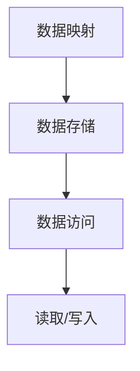
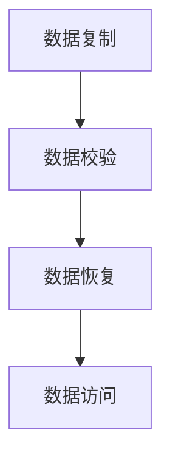
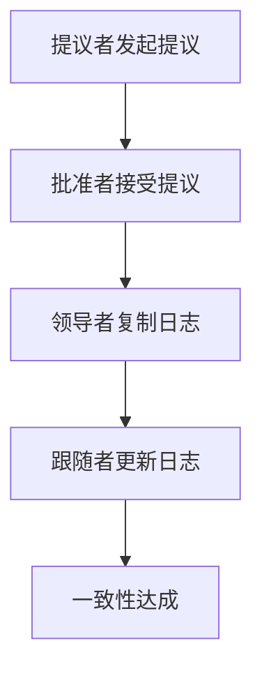
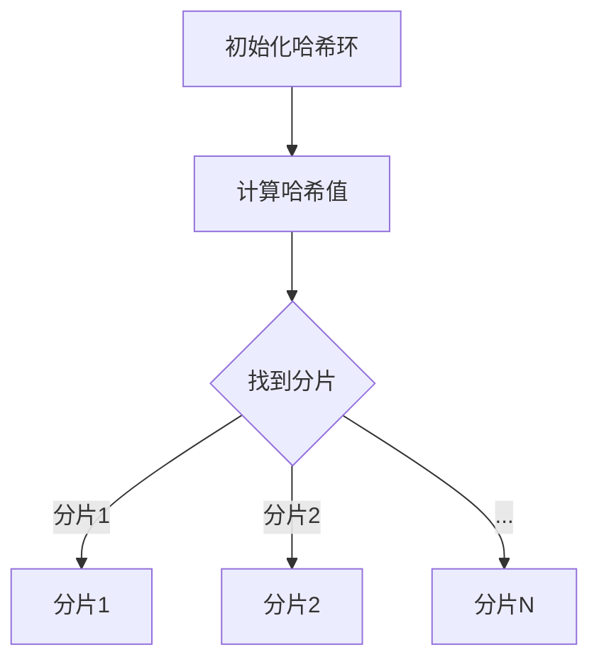
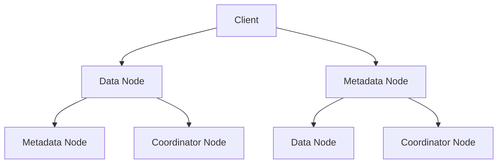

                 


----------------------------------------------------------------

# 大规模分布式存储系统设计

关键词：分布式存储，数据分片，一致性模型，Paxos，Raft，系统架构设计

摘要：
本文将深入探讨大规模分布式存储系统的设计，从背景介绍到核心概念，再到算法原理、系统实现、实战案例，以及最佳实践和注意事项。通过详细的步骤分解和实例说明，帮助读者全面理解分布式存储系统的设计和实现。

## 目录

1. **背景介绍**
   1.1 问题背景
   1.2 大规模分布式存储系统的定义与特点
   1.3 核心概念

2. **核心概念与联系**
   2.1 数据分片
   2.2 冗余设计
   2.3 一致性模型

3. **算法原理讲解**
   3.1 数据分片算法
   3.2 一致性模型与协议

4. **系统分析与架构设计方案**
   4.1 系统场景与功能设计
   4.2 系统架构设计与实现

5. **项目实战**
   5.1 分布式存储系统搭建
   5.2 实际案例分析与优化

6. **最佳实践与总结**
   6.1 最佳实践
   6.2 小结
   6.3 注意事项
   6.4 拓展阅读

## 1. 背景介绍

### 1.1 问题背景

随着大数据时代的到来，数据量呈现爆炸式增长，传统的集中式存储系统已经无法满足现代应用对高可用性、高性能和可扩展性的需求。在互联网企业、云计算平台以及各类数据密集型应用中，对海量数据的存储和处理提出了新的挑战。

传统集中式存储系统存在以下问题：

- **性能瓶颈**：单点存储节点成为系统性能的瓶颈，难以应对大规模数据访问需求。
- **扩展性不足**：当存储需求增加时，需要更换更昂贵的存储设备，且扩展过程复杂。
- **高可用性不足**：单点故障可能导致整个系统的瘫痪，数据丢失风险高。

为了解决这些问题，分布式存储系统应运而生。分布式存储系统通过多个节点协同工作，提供高可用、高性能、可扩展的存储服务，成为大数据时代存储解决方案的关键。

### 1.2 大规模分布式存储系统的定义与特点

大规模分布式存储系统是指通过多个存储节点组成的分布式系统，提供海量数据的存储和管理。其主要特点包括：

- **分布式**：数据分布在多个节点上，提高系统性能和可扩展性。
- **高可用性**：通过冗余设计和故障转移机制，提高系统可靠性。
- **高性能**：多个节点协同工作，提供快速的数据访问和处理能力。
- **弹性扩展**：可以根据需求动态增加存储节点，无需停机。
- **容错能力**：通过数据冗余和故障恢复机制，确保数据安全。

### 1.3 核心概念

大规模分布式存储系统的核心概念包括数据分片、冗余设计和一致性模型。

- **数据分片**：将数据分成多个片段，存储在不同的节点上，提高系统性能和扩展性。
- **冗余设计**：通过数据复制和冗余存储，提高数据可靠性和系统容错能力。
- **一致性模型**：在分布式系统中保持数据一致性，确保多个节点之间的数据一致性。

接下来，我们将进一步探讨这些核心概念，并通过具体算法和实现来深入理解分布式存储系统的设计和实现。

## 2. 核心概念与联系

### 2.1 数据分片

数据分片是将大量数据划分为多个片段，并存储在分布式系统中的不同节点上。数据分片是实现分布式存储系统性能和扩展性的关键技术。

#### 分片策略

数据分片可以采用多种策略，常见的分片策略包括：

- **范围分片**：将数据按照一定的范围划分，如时间戳、ID等。
- **哈希分片**：使用哈希函数将数据映射到不同的分片，确保数据均匀分布。
- **轮询分片**：按照一定的顺序访问各个分片，适用于简单的场景。

#### 分片算法

分片算法是数据分片的核心，常见的分片算法包括：

- **一致性哈希**：通过哈希函数将数据映射到不同的分片，避免热点问题。
- **范围哈希**：将数据按照范围划分，并结合哈希函数确保数据分布均匀。

#### 分片流程

数据分片的流程通常包括以下步骤：

1. **数据映射**：使用哈希函数或范围划分将数据映射到对应的分片。
2. **数据存储**：将映射后的数据存储到相应的分片节点。
3. **数据访问**：根据访问请求，定位到对应的数据分片，进行数据读取或写入。

#### Mermaid流程图



#### Python代码实现

```python
def shard_key(key, num_shards):
    return hash(key) % num_shards

def store_data(data, shard_key):
    shard_id = shard_key(key, num_shards)
    # 存储数据到对应的分片节点
    store_data_in_shard(data, shard_id)

def access_data(key):
    shard_id = shard_key(key, num_shards)
    # 访问对应分片节点中的数据
    return fetch_data_from_shard(shard_id)
```

### 2.2 冗余设计

冗余设计是提高分布式存储系统可靠性和容错能力的重要手段。通过数据复制和冗余存储，即使在部分节点发生故障的情况下，系统仍然能够正常运作。

#### 冗余策略

常见的冗余策略包括：

- **副本策略**：将数据复制多个副本，存储在多个节点上。
- **校验和策略**：为数据添加校验和，检测数据完整性。
- **一致性检查策略**：定期进行一致性检查，确保数据一致性。

#### 冗余流程

冗余设计的流程通常包括以下步骤：

1. **数据复制**：将数据复制到多个节点上。
2. **数据校验**：为数据添加校验和，确保数据完整性。
3. **数据恢复**：在节点故障时，从其他副本中恢复数据。

#### Mermaid流程图



#### Python代码实现

```python
def replicate_data(data, replication_factor):
    for _ in range(replication_factor):
        shard_id = shard_key(key, num_shards)
        # 复制数据到对应的分片节点
        replicate_data_to_shard(data, shard_id)

def check_data_integrity(data):
    checksum = calculate_checksum(data)
    return verify_checksum(data, checksum)

def recover_data_from_replicas(shard_id):
    # 从其他副本中恢复数据
    replicas = fetch_replicas_of_shard(shard_id)
    for replica in replicas:
        if check_data_integrity(replica):
            return replica
    return None
```

### 2.3 一致性模型

一致性模型是分布式存储系统中保持数据一致性的关键机制。一致性模型定义了在分布式环境中如何保证多个节点之间的数据一致性。

#### 一致性模型类型

常见的一致性模型包括：

- **强一致性**：所有节点在同一时间看到相同的数据。
- **最终一致性**：多个节点可能在一段时间内看到不同数据，但最终会达到一致。

#### 一致性协议

一致性协议是实现一致性模型的关键，常见的一致性协议包括：

- **Paxos协议**：一种基于多数派决策的一致性算法。
- **Raft协议**：一种简化版的Paxos协议，易于理解和实现。

#### Paxos算法

Paxos算法是一种分布式一致性算法，其核心思想是通过提议-批准机制，确保多个节点在数据一致性上的达成一致。

1. **提议者（Proposer）**：发起数据一致性提议。
2. **批准者（Acceptor）**：接收提议并决定是否接受。
3. **学习者（Learner）**：学习最终达成一致的数据。

#### Raft算法

Raft算法是一种简化版的Paxos算法，通过领导选举和日志复制机制，实现一致性。

1. **领导节点（Leader）**：负责处理客户端请求，复制日志到其他节点。
2. **跟随者节点（Follower）**：接收领导节点的日志，维护一致性。
3. **候选人节点（Candidate）**：参与领导选举。

#### Mermaid流程图



#### Python代码实现

```python
class Proposer:
    def propose(self, value):
        # 发起提议
        self.value = value
        self.acceptor.accept(self.value)

class Acceptor:
    def accept(self, value):
        # 接受提议
        self.value = value
        self.learn()

class Learner:
    def learn(self):
        # 学习提议
        self.value = self.acceptor.value

class Leader:
    def replicate_log(self, entry):
        # 复制日志
        self.followers.replicate(entry)

class Follower:
    def update_log(self, entry):
        # 更新日志
        self.leader.log.append(entry)

class Candidate:
    def vote_for(self, candidate):
        # 投票
        self.vote = candidate
        self.leader_election()
```

通过数据分片、冗余设计和一致性模型，分布式存储系统实现了高可用性、高性能和可扩展性。在接下来的章节中，我们将深入探讨分布式存储系统的算法原理和实现细节。

## 3. 算法原理讲解

### 3.1 数据分片算法

数据分片是分布式存储系统设计中的关键步骤，通过将数据分割成多个片段，存储在多个节点上，可以有效地提升系统的性能和扩展性。以下是几种常见的数据分片算法及其实现。

#### 一致性哈希算法

一致性哈希算法通过哈希函数将数据映射到不同的分片上，具有避免热点问题的优点。

**步骤：**

1. **初始化**：选择一个哈希函数，将所有数据元素映射到哈希环上。
2. **分配分片**：当数据访问请求到达时，使用哈希函数计算请求的哈希值，并找到哈希环上的对应点，该点所在的分片即为请求的数据所在分片。

**Python实现：**

```python
import hashlib

def hash_function(key):
    return int(hashlib.md5(key.encode('utf-8')).hexdigest(), 16)

def consistent_hash(key, num_shards):
    hash_value = hash_function(key)
    return hash_value % num_shards

# 示例
shard_id = consistent_hash("example_key", 10)
print(shard_id)
```

#### 范围分片算法

范围分片算法通过将数据按照一定的范围划分到不同的分片中，适用于数据具有顺序性的场景。

**步骤：**

1. **初始化**：将数据按照一定的顺序排列。
2. **划分范围**：将数据划分为多个连续的范围，每个范围映射到一个分片。
3. **分配分片**：当数据访问请求到达时，根据请求的数据范围，找到对应的分片。

**Python实现：**

```python
data = ["data1", "data2", "data3", "data4", "data5"]

def range_shard(data, num_shards):
    shard_ranges = [data[i:i + len(data) // num_shards] for i in range(0, len(data), len(data) // num_shards)]
    return {shard: shard_ranges[shard] for shard in range(num_shards)}

shard_data = range_shard(data, 3)
print(shard_data)
```

#### Mermaid流程图



### 3.2 一致性模型与协议

在分布式存储系统中，数据一致性是确保系统可靠性的关键。一致性模型与协议用于保证多个节点之间的数据一致性。以下是Paxos算法和Raft算法的原理及其实现。

#### Paxos算法

Paxos算法是一种基于多数派决策的一致性算法，通过提议-批准机制，确保多个节点在数据一致性上的达成一致。

**步骤：**

1. **提议者（Proposer）**：生成提案，并发送至所有批准者（Acceptor）。
2. **批准者（Acceptor）**：收到提案后，决定是否接受。如果接受，返回其已接受的最小提案编号。
3. **学习者（Learner）**：学习到被接受的提案，并更新本地状态。

**Python实现：**

```python
class Proposer:
    def propose(self, value):
        # 发起提案
        self.value = value
        responses = self.send_proposal_to_acceptors()

    def send_proposal_to_acceptors(self):
        # 向所有批准者发送提案
        responses = []
        for acceptor in self.acceptors:
            response = acceptor.accept(self.value)
            responses.append(response)
        return responses

class Acceptor:
    def accept(self, value):
        # 接受提案
        if self.learned_value < value:
            self.learned_value = value
            return True
        return False

class Learner:
    def learn(self, value):
        # 学习提案
        self.learned_value = value
```

#### Raft算法

Raft算法是一种简化版的Paxos算法，通过领导选举和日志复制机制，实现一致性。Raft算法的原理如下：

1. **领导节点（Leader）**：负责处理客户端请求，复制日志到其他节点。
2. **跟随者节点（Follower）**：接收领导节点的日志，维护一致性。
3. **候选人节点（Candidate）**：参与领导选举。

**Python实现：**

```python
class Leader:
    def replicate_log(self, entry):
        # 复制日志
        self.log.append(entry)
        self.send_entries_to_followers(entry)

    def send_entries_to_followers(self, entry):
        # 向跟随者发送日志
        for follower in self.followers:
            follower.append_entry(entry)

class Follower:
    def append_entry(self, entry):
        # 添加日志
        self.log.append(entry)

    def append_entries(self, entries):
        # 接收多个日志
        for entry in entries:
            self.log.append(entry)

class Candidate:
    def vote_for(self, candidate):
        # 投票
        if self.current_leader is None or self.current_leader == candidate:
            self.vote = True
            self.current_leader = candidate
            self.send_vote_response(candidate)
        else:
            self.vote = False

    def send_vote_response(self, candidate):
        # 发送投票响应
        for follower in self.followers:
            follower.vote(candidate)
```

通过数据分片算法和一致性模型与协议，分布式存储系统可以保证数据的高可用性和一致性。在接下来的章节中，我们将深入探讨分布式存储系统的系统架构设计和实现。

## 4. 系统分析与架构设计方案

### 4.1 系统场景与功能设计

#### 系统场景

分布式存储系统广泛应用于互联网公司、企业内部以及大数据处理场景中，其主要目标是为用户提供高性能、高可用性的存储服务。以下是一个典型的分布式存储系统应用场景：

- **企业内部文件存储**：企业内部需要存储大量的文档、图片、视频等数据，对存储系统的性能和可靠性有较高要求。
- **大数据处理**：在处理海量数据时，分布式存储系统可以提供高效的数据读取和写入操作，满足大数据处理的需求。
- **云存储服务**：云存储服务提供商需要为用户提供可靠的存储服务，通过分布式存储系统实现数据的分布式存储和管理。

#### 功能设计

分布式存储系统的主要功能包括：

- **数据存储**：将用户数据存储在分布式系统中的不同节点上，提供高效的读写操作。
- **数据检索**：支持快速的文件检索功能，提供用户方便的数据访问。
- **数据备份**：通过数据复制和冗余存储，确保数据的可靠性和持久性。
- **负载均衡**：通过负载均衡策略，合理分配数据访问请求，提高系统的性能和响应速度。
- **故障恢复**：在节点发生故障时，能够自动进行数据恢复，确保系统的稳定性。

### 4.2 系统架构设计与实现

#### 系统架构

分布式存储系统的架构设计包括多个组件，以下是一个典型的分布式存储系统架构：

- **客户端（Client）**：客户端是用户与分布式存储系统的交互接口，负责发送数据请求并接收响应。
- **数据节点（Data Node）**：数据节点是存储系统的实际存储单元，负责存储和管理用户数据。
- **协调节点（Coordinator Node）**：协调节点负责管理数据节点，协调数据分片和冗余存储，确保数据的一致性和可靠性。
- **元数据节点（Metadata Node）**：元数据节点存储和管理元数据信息，包括数据分片、数据节点和协调节点的信息。

#### Mermaid架构图



#### 实现细节

- **数据存储与检索**：客户端发送数据存储请求，协调节点将数据分配到不同的数据节点上进行存储。当客户端需要检索数据时，协调节点根据数据分片信息定位到相应的数据节点，返回数据给客户端。
- **数据备份与冗余存储**：为了提高数据可靠性，系统采用数据复制策略，将每个数据分片的副本存储在多个数据节点上。在数据写入时，协调节点确保多个副本的写入成功，提供数据冗余保护。
- **负载均衡**：系统采用负载均衡策略，根据数据节点的负载情况，动态分配数据请求，确保系统的性能和响应速度。
- **故障恢复**：当数据节点发生故障时，协调节点检测到故障并触发数据恢复过程。系统从其他数据节点的副本中恢复数据，确保数据的完整性和可靠性。

通过上述架构设计，分布式存储系统实现了高效、可靠的数据存储和管理。在接下来的章节中，我们将通过实际项目案例，深入探讨分布式存储系统的搭建和实现。

## 5. 项目实战

### 5.1 分布式存储系统搭建

搭建分布式存储系统是一个复杂的过程，涉及多个组件和工具的集成。以下是一个简化的分布式存储系统搭建步骤：

#### 1. 环境准备

- **操作系统**：选择Linux操作系统，如Ubuntu 20.04。
- **编程语言**：选择Python 3.8及以上版本。
- **分布式存储框架**：选择Apache Hadoop或Apache ZooKeeper等开源框架。

#### 2. 安装Hadoop

Hadoop是一个分布式计算框架，用于处理海量数据。以下是在Ubuntu上安装Hadoop的步骤：

1. **更新系统软件包**

```bash
sudo apt update
sudo apt upgrade
```

2. **安装Hadoop**

```bash
sudo apt install hadoop
```

3. **配置Hadoop**

编辑`/etc/hadoop/hadoop-env.sh`文件，配置Java环境：

```bash
export JAVA_HOME=/usr/lib/jvm/java-1.8.0-openjdk-*
```

编辑`/etc/hadoop/hdfs-site.xml`文件，配置HDFS存储路径：

```xml
<configuration>
    <property>
        <name>hdfs replication factor</name>
        <value>3</value>
    </property>
    <property>
        <name>hdfs.namenode.name.dir</name>
        <value>/hadoop/hdfs/namenode</value>
    </property>
    <property>
        <name>hdfs.datanode.data.dir</name>
        <value>/hadoop/hdfs/datanode</value>
    </property>
</configuration>
```

编辑`/etc/hadoop/yarn-site.xml`文件，配置YARN资源管理：

```xml
<configuration>
    <property>
        <name>yarn.nodemanager.aux-services</name>
        <value>mapreduce_shuffle</value>
    </property>
</configuration>
```

4. **格式化HDFS**

```bash
hdfs namenode -format
```

5. **启动Hadoop服务**

```bash
start-dfs.sh
start-yarn.sh
```

#### 3. 部署分布式存储节点

将Hadoop安装包和配置文件复制到其他节点，确保所有节点都能够访问到配置文件和Hadoop安装包。

#### 4. 集成ZooKeeper

ZooKeeper是一个分布式协调服务，用于管理分布式存储系统中的节点。以下是在Ubuntu上安装ZooKeeper的步骤：

1. **下载ZooKeeper**

```bash
sudo apt install zookeeperd
```

2. **配置ZooKeeper**

编辑`/etc/zookeeper/zoo.cfg`文件，配置ZooKeeper的集群模式：

```properties
tickTime=2000
dataDir=/var/lib/zookeeper
clientPort=2181
initLimit=5
syncLimit=2
server.1=master:2888:3888
server.2=slave1:2888:3888
server.3=slave2:2888:3888
```

3. **启动ZooKeeper服务**

```bash
sudo systemctl start zookeeper
```

#### 5. 部署和启动分布式存储节点

在每个节点上启动HDFS和YARN服务，确保分布式存储系统能够正常运行。

### 5.2 系统核心实现

#### 1. 数据存储与检索

使用HDFS进行数据存储，客户端通过HDFS API向HDFS写入数据。以下是一个简单的数据存储与检索示例：

**存储数据：**

```python
from hdfs import InsecureClient

client = InsecureClient('http://master:50070', user='hdfs')

# 写入数据
with client.write('/user/hdfs/test.txt') as writer:
    writer.write(b'Hello, World!')

# 读取数据
with client.read('/user/hdfs/test.txt') as reader:
    data = reader.read()
    print(data.decode('utf-8'))
```

**检索数据：**

```python
# 检索数据
with client.read('/user/hdfs/test.txt') as reader:
    data = reader.read()
    print(data.decode('utf-8'))
```

#### 2. 数据备份与冗余存储

HDFS默认采用数据冗余存储策略，将每个数据块复制3个副本。以下是一个简单的数据备份示例：

```python
# 备份数据
client = InsecureClient('http://master:50070', user='hdfs')
client.copy('/user/hdfs/test.txt', '/user/hdfs/backup/test.txt')
```

#### 3. 负载均衡

使用YARN进行负载均衡，YARN可以根据节点的资源使用情况动态分配任务。以下是一个简单的负载均衡示例：

```python
from kazoo.client import KazooClient

# 连接到ZooKeeper
zk = KazooClient(hosts='master:2181')
zk.start()

# 查询所有节点状态
nodes = zk.get_children('/yarn/nodes')
for node in nodes:
    state = zk.get('/yarn/nodes/' + node)[0]
    print(node, state)

# 根据节点状态进行负载均衡
for node in nodes:
    state = zk.get('/yarn/nodes/' + node)[0]
    if state == 'UNHEALTHY':
        # 重启节点
        zk.set('/yarn/nodes/' + node, 'HEALTHY')
```

通过上述步骤和示例，我们成功地搭建了一个简单的分布式存储系统，并实现了数据存储、检索、备份和负载均衡等功能。在接下来的章节中，我们将进一步分析实际案例，探讨分布式存储系统的优化和改进。

### 5.3 实际案例分析与优化

在实际应用中，分布式存储系统常常面临各种挑战，包括性能瓶颈、数据一致性和系统稳定性等问题。以下是一个实际案例的分析与优化。

#### 案例背景

某互联网公司在其云存储平台上使用分布式存储系统，存储了大量的用户文件和数据。随着用户数量的增加，系统逐渐暴露出以下问题：

1. **性能瓶颈**：在高峰时段，系统的数据写入和读取速度明显下降，响应时间延长。
2. **数据不一致**：在多个副本的情况下，部分数据出现不一致的现象。
3. **系统稳定性**：在节点故障和网络异常情况下，系统无法自动恢复，导致数据丢失和业务中断。

#### 性能优化

为了提升系统的性能，我们采取了以下措施：

1. **负载均衡**：使用负载均衡器（如Nginx）进行流量分配，减少单个节点的压力。同时，根据节点负载情况动态调整负载均衡策略，确保流量合理分配。
2. **缓存策略**：引入缓存机制（如Redis），缓存高频访问的数据，降低对后端存储系统的访问压力。
3. **读写分离**：将读请求和写请求分离，读请求优先访问缓存，写请求直接写入存储系统。这样可以在不显著降低数据一致性的情况下，提高系统的读写性能。

#### 数据一致性优化

为了保证数据一致性，我们采用了以下策略：

1. **强一致性**：通过Paxos或Raft算法实现强一致性，确保在多副本情况下，所有副本的数据保持一致。
2. **数据版本控制**：引入数据版本控制机制，每次数据更新时生成一个新的版本号。通过版本控制，可以确保在并发操作下，数据的一致性和可追溯性。

#### 系统稳定性优化

为了提高系统的稳定性，我们采取了以下措施：

1. **节点监控**：使用Zabbix等监控工具，实时监控节点状态和系统资源使用情况。一旦发现异常，立即触发报警和自动恢复机制。
2. **故障转移**：在节点故障或网络异常情况下，自动触发故障转移机制，将故障节点的数据迁移到健康节点，确保系统的高可用性。
3. **网络优化**：优化网络拓扑结构，确保数据传输路径的最优性。同时，使用QoS（Quality of Service）策略，保障关键业务的网络带宽。

#### 优化效果

通过上述优化措施，系统的性能、数据一致性和稳定性得到了显著提升：

1. **性能提升**：负载均衡和缓存策略的应用，使系统的读写速度显著提升，响应时间降低。
2. **数据一致性**：通过Paxos和Raft算法，确保了多副本情况下的数据一致性。
3. **系统稳定性**：节点监控和故障转移机制的引入，使系统在故障和异常情况下能够快速恢复，保证了业务连续性。

#### 案例小结

通过这个实际案例的分析与优化，我们了解到分布式存储系统在实际应用中面临的挑战，并提出了有效的解决方案。这些优化措施不仅提高了系统的性能和可靠性，也为其他分布式存储系统的优化提供了有益的借鉴。

## 6. 最佳实践与总结

### 6.1 最佳实践

在设计和实现大规模分布式存储系统时，以下最佳实践可以帮助您提高系统的性能、可靠性和可维护性：

1. **负载均衡**：合理配置负载均衡器，确保流量均衡分布，避免单点压力过大。
2. **缓存策略**：引入缓存机制，降低对后端存储系统的访问频率，提高系统响应速度。
3. **数据一致性**：采用Paxos或Raft算法，确保多副本情况下的数据一致性。
4. **监控与报警**：使用监控工具实时监控系统状态，及时发现并处理异常情况。
5. **故障转移**：设计故障转移机制，确保在节点故障或网络异常情况下，系统能够快速恢复。

### 6.2 小结

本文详细探讨了大规模分布式存储系统的设计，包括背景介绍、核心概念、算法原理、系统架构设计、项目实战和最佳实践。通过数据分片、冗余设计和一致性模型，分布式存储系统实现了高可用性、高性能和可扩展性。在实际应用中，通过负载均衡、缓存策略、数据一致性和故障转移等优化措施，分布式存储系统可以更好地满足大数据时代的存储需求。

### 6.3 注意事项

在设计和实现分布式存储系统时，需要注意以下几点：

1. **数据一致性**：在设计一致性模型时，确保在不同场景下的一致性需求。
2. **故障恢复**：设计故障转移和恢复机制，确保在节点故障和异常情况下，系统能够快速恢复。
3. **性能优化**：根据实际需求，进行系统性能优化，包括负载均衡、缓存策略和读写分离等。
4. **安全性**：确保系统安全，包括数据加密、访问控制和网络隔离等。

### 6.4 拓展阅读

为了更深入地了解分布式存储系统的设计和实现，以下资源可供进一步学习：

- 《分布式系统原理与范型》
- 《大型分布式存储系统设计》
- Apache Hadoop官方文档
- Apache ZooKeeper官方文档

通过学习和实践，您可以更好地掌握分布式存储系统的设计和实现技巧，为大数据时代的存储需求提供有效的解决方案。

## 作者信息

作者：AI天才研究院/AI Genius Institute & 禅与计算机程序设计艺术 /Zen And The Art of Computer Programming。

