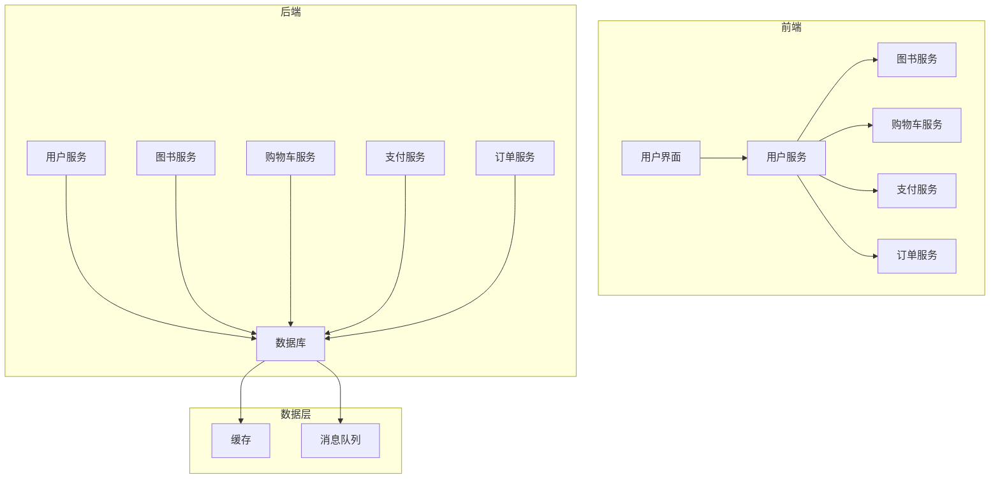
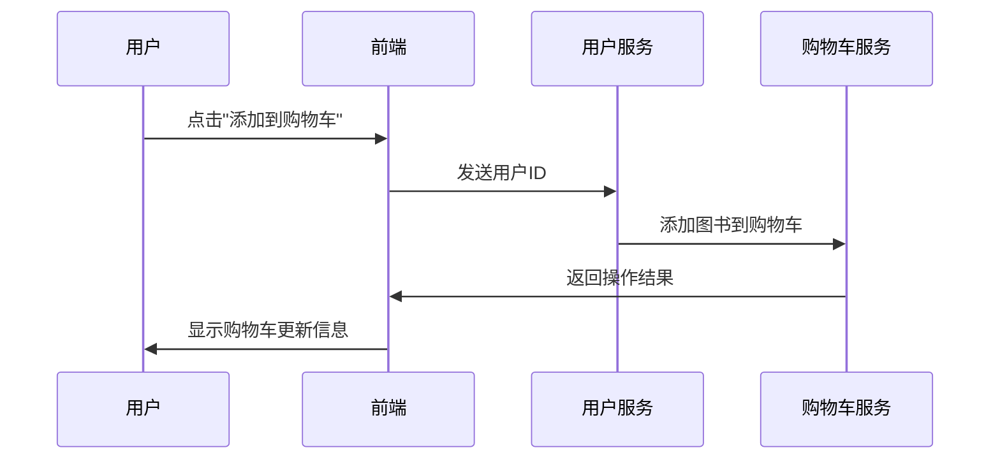

                 

Sure, let's begin by structuring our article "好代码修炼的三个阶段" with a clear and concise introduction that sets the stage for our readers. We'll define the key terms, provide context, and outline the structure of our discussion.

## 文章标题：好代码修炼的三个阶段

> 关键词：代码修养、编程原则、优化技巧、高级编程、架构设计、团队合作、实战案例

> 摘要：
本文将深入探讨好代码修炼的三个阶段。从代码修养的基础阶段，到进阶阶段，再到成熟的代码修养，我们将逐步揭示如何通过规范、优化、架构设计和团队合作，打造出高质量的代码。本文旨在帮助程序员提升代码素养，掌握编写优秀代码的技巧。

### 第一部分：代码修养的初步阶段

#### 第1章：代码修养的起源与基础

1.1 代码修养的重要性
- 问题背景
- 问题描述
- 问题解决
- 边界与外延
- 核心要素组成

1.2 初步代码修养原则
- 代码规范
- 基础概念
- 代码审查

1.3 初级代码优化技巧
- 性能优化
- 代码简化

#### 第2章：代码修养的进阶阶段

2.1 高级编程概念
- 面向对象编程
- 设计模式

2.2 高级代码优化
- 算法与数据结构
- 并发编程
- 性能分析

2.3 持续改进与反馈
- 代码重构
- 代码文档

### 第二部分：代码修养的成熟阶段

#### 第3章：架构设计理念

3.1 软件工程最佳实践
- 敏捷开发
- 持续集成/持续部署（CI/CD）

3.2 安全性考量
- 代码安全
- 数据安全

#### 第4章：代码修养与团队合作

4.1 团队协作原则
- 沟通与协作
- 代码版本管理

4.2 项目管理
- 需求管理
- 项目计划

### 第三部分：代码修养的艺术与实战

#### 第5章：代码审美与创新思维

5.1 代码审美
- 简洁性
- 可读性

5.2 创新思维
- 代码重构
- 技术探索

#### 第6章：实战案例分析

6.1 案例背景
- 项目介绍
- 系统功能设计

6.2 系统架构设计
- 系统架构图
- 系统接口设计与交互

6.3 代码实现与分析
- 核心实现代码
- 代码解读与分析

6.4 案例小结
- 经验总结

### 第四部分：未来展望与个人职业发展

#### 第7章：未来展望

7.1 代码修养的未来趋势
- 人工智能与代码修养
- 边缘计算与分布式系统

7.2 个人职业发展
- 职业规划
- 技能提升

#### 第8章：社会责任与道德规范

8.1 社会责任
- 代码对社会的影响

8.2 道德规范
- 编程伦理和道德标准

---

在接下来的章节中，我们将逐一深入探讨每个阶段的核心内容，提供实用的技巧和案例分析，帮助读者理解并实践好代码的编写艺术。现在，让我们开始第一部分的讨论，从代码修养的初步阶段出发。

### 第一部分：代码修养的初步阶段

#### 第1章：代码修养的起源与基础

在当今的软件开发领域，代码修养的重要性不言而喻。一个程序员的能力不仅体现在编写代码的速度上，更重要的是编写出高效、可维护、可扩展的代码。良好的代码修养是程序员职业生涯中的重要基石，它决定了软件项目的成败和质量。

1.1 代码修养的重要性

代码修养的重要性体现在以下几个方面：

- **质量保证**：良好的代码质量是软件项目成功的关键。它直接影响到软件的稳定性、性能和安全性。
- **可维护性**：随着项目的发展，代码需要不断地维护和更新。良好的代码结构使得维护工作更加高效和简单。
- **可扩展性**：一个系统需要能够轻松适应新的需求变化，这要求代码具有良好的可扩展性。
- **团队协作**：良好的代码风格和规范有助于团队成员之间的协作，减少沟通成本和误解。

然而，现实中存在许多代码质量问题，如代码冗余、逻辑混乱、性能低下等。这些问题不仅增加了维护成本，还可能导致软件错误和安全漏洞。

1.2 问题背景

软件系统的复杂性不断增加，导致代码量急剧增加。以下是一些常见的问题：

- **代码冗余**：相同的代码段重复出现在多个地方，增加了代码维护的难度。
- **逻辑混乱**：代码逻辑复杂，难以理解和维护。
- **性能低下**：代码编写不当，导致系统性能不佳。
- **安全性问题**：代码安全措施不足，容易受到攻击。

1.3 问题解决

要解决上述问题，需要从以下几个方面入手：

- **代码规范**：制定统一的代码规范，包括命名规则、代码格式、注释等。
- **代码审查**：通过同行评审和代码审查，发现并修正代码中的问题。
- **重构**：对现有代码进行重构，改进代码结构，提高可维护性和可扩展性。
- **性能优化**：对关键代码段进行性能优化，提高系统性能。

1.4 边界与外延

代码修养不仅局限于代码本身的编写，还包括以下方面：

- **设计原则**：遵循设计原则，如单一职责原则、开闭原则等。
- **测试**：编写单元测试和集成测试，确保代码的正确性和可靠性。
- **文档**：编写详细的文档，包括代码注释、设计文档和用户手册。
- **版本控制**：使用版本控制系统，如Git，管理代码版本和历史。

1.5 核心要素组成

代码修养的核心要素包括：

- **代码质量**：确保代码正确、高效、安全。
- **可维护性**：代码易于理解和修改。
- **可扩展性**：代码易于添加新功能和修改现有功能。
- **团队合作**：良好的代码风格和规范有助于团队协作。

在下一节中，我们将详细探讨初步代码修养的原则，帮助读者理解如何编写高质量的基础代码。

---

以上内容是“好代码修炼的三个阶段”文章的第一部分的开头，介绍了文章的核心关键词、摘要以及整体结构。接下来，我们将逐步深入探讨每一章的内容，提供详细的技术讲解和案例分析。希望这些内容能够帮助读者理解代码修养的重要性，掌握编写高质量代码的技巧。

### 第1章：代码修养的起源与基础

在软件开发领域，代码修养是每一位程序员必须掌握的基本素质。它不仅仅关乎代码的编写，更关系到整个项目的质量、可维护性和团队的协作效率。为了更好地理解代码修养的重要性，我们首先需要了解一些核心概念和术语，并探讨代码修养的发展历程。

#### 1.1 核心概念与术语

1. **代码质量**：代码质量是指代码的正确性、可读性、可维护性、性能和安全性。高质量的代码能够减少错误率，提高开发效率。
2. **可维护性**：可维护性是指代码在未来的修改和维护过程中所需的工作量和难度。良好的可维护性可以减少维护成本，提高开发效率。
3. **可扩展性**：可扩展性是指代码在适应新需求、新功能时的灵活性。一个具有良好可扩展性的系统可以在不改变原有结构的情况下，轻松地添加新功能。
4. **团队协作**：团队协作是指团队成员在编写代码和解决问题时的合作与沟通。良好的团队协作可以提高代码质量和开发效率。

#### 1.2 代码修养的发展历程

代码修养并不是一蹴而就的，它经历了以下几个发展阶段：

1. **原始阶段**：在早期的软件开发中，程序员往往注重代码的完成速度，忽视了代码的质量。这一阶段的代码往往存在大量错误和冗余。
2. **规范化阶段**：随着软件工程的发展，人们开始意识到代码质量的重要性。这一阶段，编程语言和开发工具的标准化，以及代码规范的制定，为代码修养的规范化奠定了基础。
3. **精细化阶段**：这一阶段，代码修养不仅仅局限于代码本身的规范，更注重代码的优化和性能提升。程序员开始学习设计模式、算法和数据结构，以提高代码的效率和可维护性。
4. **成熟阶段**：在成熟阶段，代码修养已经融入了软件开发的各个阶段，包括需求分析、设计、编码、测试和部署。程序员不仅需要掌握技术层面的知识，还需要具备团队协作和管理能力。

#### 1.3 问题背景

在当今的软件行业中，代码质量问题仍然是一个普遍存在的问题。以下是一些常见的问题：

- **代码冗余**：大量的重复代码不仅增加了维护成本，还可能导致不一致的错误。
- **逻辑混乱**：代码结构复杂，难以理解和修改。
- **性能低下**：未优化的代码可能存在性能瓶颈，影响系统的响应速度。
- **安全性问题**：不安全的代码可能存在漏洞，容易受到攻击。

这些问题不仅影响到软件的质量，还可能带来严重的经济损失和声誉损害。

#### 1.4 问题描述

代码质量问题的表现多种多样，以下是一些具体的例子：

- **重复代码**：在多个文件中出现了相同的代码片段，导致维护困难。
- **过度抽象**：过度使用抽象类和接口，使得代码难以理解和维护。
- **缺乏注释**：代码缺乏必要的注释，导致后续维护人员难以理解代码的逻辑。
- **未优化的算法**：使用效率较低的算法，导致系统性能不佳。
- **安全问题**：代码存在注入漏洞、缓冲区溢出等安全风险。

#### 1.5 问题解决

要解决代码质量问题，可以从以下几个方面入手：

- **代码规范**：制定统一的代码规范，包括命名规则、代码格式、注释等。这有助于提高代码的可读性和一致性。
- **重构**：定期对代码进行重构，优化代码结构，提高可维护性和可扩展性。
- **性能优化**：对关键代码段进行性能分析，使用更高效的算法和数据结构，提高系统性能。
- **安全审计**：定期进行代码安全审计，修复潜在的安全漏洞。

#### 1.6 边界与外延

代码修养不仅仅关乎代码的编写，还涉及以下几个方面：

- **设计原则**：遵循设计原则，如单一职责原则、开闭原则等，可以提高代码的模块化和可维护性。
- **测试**：编写单元测试和集成测试，确保代码的正确性和可靠性。
- **文档**：编写详细的文档，包括代码注释、设计文档和用户手册，有助于团队成员之间的协作和理解。
- **版本控制**：使用版本控制系统，如Git，管理代码版本和历史，便于协作和追踪修改。

#### 1.7 核心要素组成

代码修养的核心要素包括：

- **代码质量**：确保代码正确、高效、安全。
- **可维护性**：代码易于理解和修改。
- **可扩展性**：代码易于添加新功能和修改现有功能。
- **团队合作**：良好的代码风格和规范有助于团队协作。

通过以上内容，我们了解了代码修养的基本概念、发展历程以及解决代码质量问题的方法。在接下来的章节中，我们将进一步探讨代码修养的初步原则，帮助读者理解如何编写高质量的基础代码。

---

以上内容详细介绍了“好代码修炼的三个阶段”文章的第一部分第1章的核心概念、术语、发展历程、问题背景、问题描述、问题解决方法、边界与外延以及核心要素组成。这一章节为后续的深入探讨打下了坚实的基础。在接下来的章节中，我们将继续探讨初步代码修养的原则，帮助读者理解如何编写高质量的基础代码。

### 第1章：代码修养的初步阶段

#### 1.2 初步代码修养原则

在掌握了代码修养的基本概念之后，我们接下来需要了解一些具体的编码原则和规范，这些原则和规范将帮助程序员编写出高质量的基础代码。

##### 1.2.1 代码规范

代码规范是编写高质量代码的基础，它包括命名规则、代码格式和注释等方面。以下是一些常见的代码规范：

1. **命名规则**：命名应该简洁明了，能够直观地表达变量的含义。通常采用小写字母和下划线组合的方式，避免使用缩写和拼音。
   - 变量命名：`user_id`、`temp_value`
   - 函数命名：`get_user_info`、`process_payment`

2. **代码格式**：保持代码的格式一致，可以使代码更加易读。以下是一些格式化的建议：
   - 每个函数或方法应该只做一件事情。
   - 使用四个空格进行缩进，避免使用Tab。
   - 适当的空行和空格可以增强代码的可读性。

3. **注释**：注释是帮助他人（包括未来的自己）理解代码的重要工具。以下是一些注释的最佳实践：
   - 添加函数和方法的注释，描述其功能和参数。
   - 使用单行注释来解释复杂的逻辑或临时注释。
   - 保持文档注释的更新，确保与代码同步。

##### 1.2.2 基础概念

在编码过程中，理解基础概念至关重要。以下是一些关键的基础概念：

1. **变量**：变量用于存储数据。理解变量的类型、作用域和生命周期对编写高质量代码非常重要。
   - 类型：整数、浮点数、字符串、布尔值等。
   - 作用域：局部变量和全局变量。
   - 生命周期：变量的创建和销毁。

2. **函数和类**：函数和类是组织代码的基本单元。理解它们的定义、调用和作用对于编写模块化、可重用的代码至关重要。
   - 函数：完成特定任务的代码块，可以通过参数传递数据。
   - 类：定义对象的属性和方法，用于封装数据和行为。

3. **模块**：模块是组织代码的一种方式，它将相关的函数和类组合在一起。模块可以独立开发、测试和部署，有助于提高代码的可维护性和可扩展性。

##### 1.2.3 代码审查

代码审查是确保代码质量的重要步骤，它包括同行评审、代码规范检查和性能分析。以下是一些代码审查的最佳实践：

1. **同行评审**：同行评审是一种团队协作的方法，通过让其他团队成员审查代码，可以发现潜在的问题和改进机会。以下是一些评审的关键点：
   - 代码是否符合项目规范和编程标准。
   - 代码是否容易理解和维护。
   - 代码是否实现了所有需求。

2. **代码规范检查**：使用自动化工具进行代码规范检查，可以快速发现不符合规范的问题。常见的工具包括SonarQube、Checkstyle和PMD。

3. **性能分析**：对关键代码段进行性能分析，可以发现性能瓶颈并进行优化。常用的性能分析工具包括GProfiler和New Relic。

##### 1.2.4 初级代码优化技巧

编写高质量的代码不仅仅是为了符合规范，还需要进行优化，以提高代码的性能和可维护性。以下是一些初级代码优化技巧：

1. **性能优化**：性能优化主要关注代码的运行速度和内存占用。以下是一些常见的性能优化方法：
   - 使用更高效的算法和数据结构。
   - 避免不必要的循环和递归。
   - 使用缓存和索引。

2. **代码简化**：代码简化是通过消除冗余代码和简化复杂逻辑来提高代码的可读性和可维护性。以下是一些代码简化的技巧：
   - 使用函数和类进行模块化。
   - 避免过长的函数和类。
   - 使用常量和配置项代替硬编码。

通过遵循上述代码规范和原则，程序员可以编写出高质量的基础代码，为后续的代码修养和优化打下坚实的基础。在下一节中，我们将进一步探讨高级编程概念，帮助读者提升代码修养。

### 第2章：代码修养的进阶阶段

在掌握了初步代码修养的基础后，程序员需要进一步提升自己的技能，进入代码修养的进阶阶段。这一阶段的核心目标是掌握高级编程概念和优化技巧，以编写出更加高效、可维护和可扩展的代码。在这一章中，我们将探讨高级编程概念、高级代码优化技巧以及持续改进与反馈的重要性。

#### 2.1 高级编程概念

高级编程概念是提升代码质量的重要基石，它包括面向对象编程和设计模式等。

##### 2.1.1 面向对象编程

面向对象编程（OOP）是一种编程范式，它通过将数据和行为封装成对象，提高了代码的可重用性和可维护性。以下是OOP的核心概念：

1. **类（Class）**：类是对象的蓝图，它定义了对象的属性（数据）和方法（行为）。例如，我们可以定义一个`Person`类，包含姓名、年龄等属性，以及吃饭、睡觉等方法。

2. **对象（Object）**：对象是类的实例，它拥有类的属性和方法。通过创建对象，我们可以对现实世界中的实体进行建模。例如，我们可以创建一个`John`对象，它是一个`Person`类的实例。

3. **继承（Inheritance）**：继承是一种创建新类的技术，新类继承已有类的属性和方法。通过继承，可以避免代码重复，实现代码的复用。例如，我们可以创建一个`Student`类，它继承自`Person`类，并添加了成绩等属性。

4. **多态（Polymorphism）**：多态是指同一个操作或函数在不同的对象上有不同的实现。它允许我们通过一个接口调用不同的方法。例如，我们可以定义一个`draw`方法，它有不同的实现，用于绘制不同形状的图形。

##### 2.1.2 设计模式

设计模式是一套经过时间验证的解决常见软件工程问题的方案。它可以帮助我们编写出更加灵活、可扩展的代码。以下是几种常见的设计模式：

1. **单例模式（Singleton）**：确保一个类只有一个实例，并提供一个全局访问点。例如，数据库连接对象通常使用单例模式。

2. **工厂模式（Factory）**：定义一个创建对象的接口，但将具体对象的创建委托给子类。工厂模式可以用于创建不同类型的对象，而无需关心具体的创建过程。

3. **观察者模式（Observer）**：定义对象间的一种一对多的依赖关系，当一个对象的状态发生变化时，所有依赖它的对象都会得到通知并自动更新。例如，在事件驱动编程中，事件监听器可以使用观察者模式。

4. **策略模式（Strategy）**：定义一系列算法，将每一个算法封装起来，并使它们可以互相替换。策略模式让算法的变化不会影响到使用算法的客户对象。

#### 2.2 高级代码优化技巧

在进阶阶段，程序员需要掌握高级代码优化技巧，以提高代码的性能和可维护性。

##### 2.2.1 算法与数据结构

算法和数据结构是计算机科学的基础，它们直接影响代码的性能。以下是一些优化技巧：

1. **时间复杂度分析**：理解并分析算法的时间复杂度，选择合适的算法。例如，使用二分搜索而不是线性搜索。

2. **空间复杂度优化**：减少算法的空间占用，例如使用内存池来减少内存分配的开销。

3. **数据结构选择**：根据数据的特点选择合适的数据结构。例如，使用哈希表来快速查找数据，使用平衡二叉树来保持数据的有序性。

4. **缓存利用**：充分利用缓存来减少计算和IO的开销，例如使用LRU缓存算法。

##### 2.2.2 并发编程

并发编程可以显著提高程序的性能，但同时也增加了复杂性。以下是一些并发编程的优化技巧：

1. **线程池**：使用线程池来管理线程，避免线程频繁创建和销毁的开销。

2. **锁优化**：合理使用锁，避免死锁和锁竞争，例如使用读写锁来提高并发性能。

3. **异步编程**：使用异步编程模型，例如使用异步IO和非阻塞I/O，来提高程序的响应速度。

##### 2.2.3 性能分析

性能分析是发现和解决性能瓶颈的重要手段。以下是一些性能分析工具和技巧：

1. **火焰图**：火焰图可以帮助我们直观地了解程序的运行时性能，找到性能瓶颈。

2. **代码剖析器**：使用代码剖析器，例如GProfiler和New Relic，可以分析代码的执行时间、CPU使用率和内存占用。

3. **基准测试**：编写基准测试，对代码的不同实现进行性能比较，选择最优的方案。

#### 2.3 持续改进与反馈

持续改进与反馈是提升代码修养的重要途径。以下是一些最佳实践：

1. **代码审查**：定期进行代码审查，通过同行评审来发现和修正代码中的问题。

2. **代码重构**：定期对代码进行重构，优化代码结构，提高可维护性和可扩展性。

3. **持续集成**：使用持续集成（CI）工具，例如Jenkins和GitLab CI，自动化构建、测试和部署，确保代码的质量和稳定性。

4. **反馈机制**：建立有效的反馈机制，收集用户反馈和测试结果，及时调整和优化代码。

通过掌握高级编程概念和优化技巧，程序员可以编写出更加高效、可维护和可扩展的代码。在下一章中，我们将探讨代码修养的成熟阶段，介绍架构设计理念和最佳实践。

### 第3章：代码修养的成熟阶段

在掌握了初步和进阶阶段的代码修养后，程序员需要进一步升华自己的技能，进入代码修养的成熟阶段。这一阶段的核心目标是实现代码的高内聚、低耦合，构建稳定、可扩展、可维护的软件系统。在这一章中，我们将探讨架构设计理念、软件工程最佳实践和安全性考量。

#### 3.1 架构设计理念

架构设计是软件系统的核心，它决定了系统的可扩展性、可维护性和可移植性。以下是一些关键的架构设计理念：

##### 3.1.1 分层架构

分层架构是将系统分解为多个层次，每个层次负责不同的功能。常见的分层包括表示层、业务逻辑层和数据访问层。

1. **表示层**：负责与用户交互，处理用户的输入和输出。它通常包括前端界面和API。
2. **业务逻辑层**：处理业务逻辑，实现系统的核心功能。它是系统中最关键的部分，需要确保代码的可维护性和可扩展性。
3. **数据访问层**：负责与数据库或其他数据源进行交互，实现数据的存储和检索。

##### 3.1.2 微服务架构

微服务架构是将系统分解为多个小型、自治的服务，每个服务负责一个特定的功能。以下是一些关键特点：

1. **独立性**：每个服务都是独立的，可以独立部署和扩展。
2. **自治**：每个服务都有自己的数据存储，不受其他服务的影响。
3. **松耦合**：服务之间通过API进行通信，服务之间解耦，降低了系统的复杂性。
4. **可扩展性**：可以独立扩展每个服务，提高了系统的性能和可维护性。

##### 3.1.3 服务拆分与治理

微服务架构的关键在于如何合理拆分服务，并对其进行有效的治理。

1. **服务拆分**：根据业务需求和功能模块，将系统拆分为多个服务。拆分服务时需要考虑独立性、自治性和可扩展性。
2. **服务治理**：对服务进行监控、管理和服务发现。常见的工具包括Kubernetes、Eureka和Consul。

#### 3.2 软件工程最佳实践

软件工程最佳实践是确保软件项目成功的关键，以下是一些关键实践：

##### 3.2.1 敏捷开发

敏捷开发是一种以人为核心、迭代、循序渐进的开发方法。它强调持续交付有价值的软件，并响应变化的需求。以下是一些敏捷开发的关键实践：

1. **用户故事**：将需求分解为用户故事，每个用户故事代表用户的一个需求。
2. **迭代开发**：将开发周期划分为多个迭代，每个迭代交付一个可用的产品版本。
3. **持续集成**：通过持续集成（CI），自动化构建、测试和部署，确保代码的质量和稳定性。
4. **迭代回顾**：在每个迭代结束时进行回顾，总结经验教训，持续改进。

##### 3.2.2 持续集成/持续部署（CI/CD）

持续集成和持续部署是确保代码质量和快速交付的关键实践。

1. **持续集成**：通过CI，将代码合并到主干并自动运行测试，确保代码的集成质量。
2. **持续部署**：通过CD，自动化部署代码到生产环境，确保快速交付。

##### 3.2.3 代码审查

代码审查是确保代码质量和一致性的重要手段。以下是一些最佳实践：

1. **同行评审**：通过同行评审，让其他开发者审查代码，发现和修正潜在问题。
2. **自动化测试**：编写单元测试和集成测试，确保代码的正确性和可靠性。
3. **自动化代码规范检查**：使用自动化工具检查代码规范，确保代码的一致性。

#### 3.3 安全性考量

安全性是现代软件系统的重要考量之一，以下是一些关键的安全措施：

##### 3.3.1 代码安全

1. **输入验证**：对用户输入进行严格的验证，防止注入攻击。
2. **错误处理**：避免在错误处理中泄露敏感信息，防止信息泄露和利用。
3. **使用安全库和框架**：使用经过验证的库和框架，降低安全风险。

##### 3.3.2 数据安全

1. **加密**：对敏感数据进行加密，防止数据泄露。
2. **权限控制**：实现细粒度的权限控制，确保用户只能访问授权的数据和功能。
3. **数据备份和恢复**：定期备份数据，确保在数据丢失或损坏时可以恢复。

通过遵循上述架构设计理念、软件工程最佳实践和安全措施，程序员可以构建出高质量、高安全性的软件系统。在下一章中，我们将探讨代码修养与团队合作的重要性，介绍团队协作原则和项目管理。

### 第4章：代码修养与团队合作

在软件开发过程中，代码修养不仅仅是个人的技能，更是团队合作的重要组成部分。一个成功的软件项目离不开团队成员之间的紧密协作和有效沟通。在这一章中，我们将探讨团队协作原则、代码版本管理以及项目管理的方法。

#### 4.1 团队协作原则

良好的团队协作是确保代码质量和项目成功的关键。以下是一些团队协作的原则：

##### 4.1.1 沟通与协作

1. **明确的沟通**：团队成员之间应该保持开放的沟通，确保信息传递准确无误。
2. **协作工具**：使用合适的协作工具，如Slack、Microsoft Teams或Zoom，以方便实时沟通和协作。
3. **定期会议**：定期举行团队会议，总结进度、讨论问题和规划下一步工作。

##### 4.1.2 代码版本管理

1. **Git工作流程**：使用Git等版本控制系统，确保代码的安全存储和版本管理。
2. **分支管理**：合理的分支管理策略可以避免代码冲突，提高协作效率。
3. **代码审查**：通过代码审查，确保代码质量，及时发现和修复问题。

##### 4.1.3 代码规范与风格

1. **统一的代码规范**：制定并遵循统一的代码规范，确保代码风格一致，易于阅读和理解。
2. **代码注释**：编写清晰的代码注释，帮助其他团队成员理解代码逻辑和意图。
3. **自动化代码检查**：使用自动化工具进行代码规范检查，确保代码符合最佳实践。

#### 4.2 项目管理

项目管理是确保项目按计划顺利进行的关键。以下是一些项目管理的方法：

##### 4.2.1 需求管理

1. **需求分析**：详细分析用户需求，明确项目的目标和功能需求。
2. **需求文档**：编写详细的需求文档，确保所有团队成员对需求有统一的理解。
3. **需求变更管理**：在项目开发过程中，需求可能会发生变化，需要制定合理的变更管理流程。

##### 4.2.2 项目计划

1. **项目计划**：制定详细的项目计划，包括任务分配、时间线和里程碑。
2. **任务跟踪**：使用项目管理工具，如JIRA或Trello，跟踪任务的进度和状态。
3. **风险管理与应对策略**：识别项目中的风险，并制定相应的应对策略，确保项目顺利进行。

##### 4.2.3 持续集成与持续部署

1. **持续集成**：通过持续集成（CI），自动化构建、测试和部署，确保代码的质量和稳定性。
2. **持续部署**：通过持续部署（CD），自动化部署代码到生产环境，提高交付速度。
3. **性能监控与优化**：定期监控系统的性能，及时发现问题并进行优化。

通过遵循团队协作原则和项目管理方法，团队成员可以更好地合作，确保项目的成功。在下一章中，我们将探讨代码审美和创新思维的重要性，以及如何通过代码重构和技术探索提升代码修养。

### 第5章：代码审美与创新思维

在代码修养的成熟阶段，代码的审美和创新思维成为提升代码质量的重要手段。一个优秀的程序员不仅需要写出结构清晰、逻辑严谨的代码，还应该追求代码的简洁性和可读性，并具备创新思维，不断改进和优化代码。在这一章中，我们将探讨代码审美、创新思维以及代码重构和技术探索。

#### 5.1 代码审美

代码审美是指对代码美感的一种追求，它不仅仅关乎代码的整洁和可读性，还包括代码的简洁性、一致性和优雅性。以下是一些代码审美的原则：

##### 5.1.1 简洁性

简洁性是代码审美的核心原则之一，它要求代码尽可能简单、直接，避免冗余和复杂。以下是一些实现简洁性的方法：

1. **避免过度抽象**：适当的抽象可以提高代码的可维护性，但过度抽象会降低代码的简洁性和可读性。
2. **去除冗余代码**：检查并去除重复的代码片段，使用函数或类进行封装。
3. **使用简洁的变量名和函数名**：使用有意义的变量名和函数名，使代码易于理解和阅读。

##### 5.1.2 可读性

可读性是代码审美的另一个重要方面，它关系到代码的可维护性和团队协作。以下是一些提高代码可读性的方法：

1. **编写清晰的注释**：在关键代码段和复杂逻辑处添加注释，解释代码的意图和功能。
2. **遵循一致的代码风格**：保持代码格式的一致性，使代码易于阅读和理解。
3. **使用空行和空格**：适当的空行和空格可以增强代码的可读性，使代码结构更加清晰。

##### 5.1.3 一致性

一致性是代码审美的关键，它要求代码风格和命名规范保持一致。以下是一些实现一致性的方法：

1. **遵循编程标准和规范**：遵循团队或项目定下的编程标准和规范，确保代码的一致性。
2. **使用代码格式化工具**：使用如Prettier、Black等代码格式化工具，自动格式化代码，保持一致性。
3. **定期代码审查**：通过定期代码审查，发现并修正不符合一致性要求的代码。

#### 5.2 创新思维

创新思维是程序员不断提升代码质量的重要能力，它要求程序员具备开拓性思维，勇于尝试新的技术和方法。以下是一些培养创新思维的方法：

##### 5.2.1 代码重构

代码重构是通过改进现有代码的结构和逻辑，提高代码的可维护性和可扩展性。以下是一些代码重构的方法：

1. **分解复杂函数**：将复杂的函数分解为更小的、功能单一的函数，提高代码的可读性和可维护性。
2. **提取公共代码**：将重复的代码片段提取为公共函数或类，减少冗余，提高代码的复用性。
3. **优化循环结构**：优化循环结构，减少不必要的循环和递归，提高代码的性能。

##### 5.2.2 技术探索

技术探索是程序员保持技术敏锐性和创新能力的重要途径。以下是一些技术探索的方法：

1. **跟踪新技术**：关注行业动态，了解新技术和工具，不断更新自己的技术栈。
2. **阅读技术博客和论文**：通过阅读技术博客和论文，了解最新的研究成果和技术趋势。
3. **参与开源项目**：参与开源项目，实践新技术，提升自己的编程技能。

#### 5.3 代码重构

代码重构是提升代码质量的重要方法之一，它通过逐步改进代码的结构和逻辑，提高代码的可维护性和可扩展性。以下是一些代码重构的最佳实践：

##### 5.3.1 小步快跑

代码重构应该采取小步快跑的策略，避免一次性重构大量代码。以下是一些实践建议：

1. **逐步重构**：将复杂的代码分解为小部分，逐一进行重构。
2. **代码审查**：在重构过程中，进行代码审查，确保重构后的代码质量。
3. **自动化测试**：重构代码时，确保编写和更新自动化测试，确保重构后的代码功能正确。

##### 5.3.2 重构与测试相结合

重构与测试是相辅相成的，以下是一些结合重构与测试的方法：

1. **先写测试**：在重构之前，先编写测试用例，确保重构后的代码仍然满足需求。
2. **重构后验证**：重构代码后，运行测试用例，验证重构后的代码功能是否正确。
3. **持续重构**：在项目开发过程中，定期进行重构，保持代码的整洁和可维护性。

通过代码审美和创新思维，程序员可以不断提升代码质量，编写出简洁、可读、一致且具有高扩展性的代码。在下一章中，我们将通过一个实际案例，展示如何将以上原则和技巧应用到实践中。

### 第6章：实战案例分析

为了更好地理解代码修养的实践，我们通过一个实际案例来展示如何从项目背景、系统功能设计、系统架构设计、系统接口设计和系统交互等方面进行详细的讨论。

#### 6.1 案例背景

假设我们正在开发一个在线书店系统，该系统需要实现用户注册、登录、浏览图书、添加购物车、结算支付等基本功能。为了提高系统的可扩展性和可维护性，我们采用微服务架构，将系统拆分为多个微服务，每个微服务负责不同的功能模块。

#### 6.2 系统功能设计

在线书店系统的功能模块包括：

1. **用户服务**：负责用户注册、登录和权限管理。
2. **图书服务**：负责图书的检索、分类和推荐。
3. **购物车服务**：负责用户添加图书到购物车、修改购物车信息和结算。
4. **支付服务**：负责处理用户的支付请求，与第三方支付平台集成。
5. **订单服务**：负责生成订单、处理订单状态和订单查询。

每个服务都有明确的功能和接口，模块化设计使得服务之间松耦合，便于独立开发和维护。

#### 6.3 系统架构设计

在线书店系统的架构设计如下：

- **前端**：使用React或Vue等前端框架实现用户界面，通过REST API与后端微服务进行交互。
- **后端**：采用微服务架构，每个微服务负责一个功能模块，使用Spring Boot或Django等框架实现业务逻辑，服务之间通过RESTful API进行通信。
- **数据库**：使用MySQL或PostgreSQL等关系型数据库存储用户数据、图书信息和订单数据。
- **缓存**：使用Redis等缓存系统，提高系统的响应速度。
- **消息队列**：使用RabbitMQ或Kafka等消息队列系统，实现服务之间的异步通信。

下面是一个简化的系统架构图（使用Mermaid绘制）：



#### 6.4 系统接口设计与交互

在线书店系统的接口设计遵循RESTful架构风格，以下是一些关键接口的设计和交互：

1. **用户服务接口**：
   - 注册接口：`POST /users/register`，接收用户基本信息并创建用户账户。
   - 登录接口：`POST /users/login`，验证用户身份并生成JWT令牌。
   - 权限管理接口：`GET /users/{userId}/permissions`，查询用户权限。

2. **图书服务接口**：
   - 图书检索接口：`GET /books`，根据关键词搜索图书。
   - 图书分类接口：`GET /books/categories`，获取图书分类列表。
   - 图书推荐接口：`GET /books/recommendations`，根据用户历史行为推荐图书。

3. **购物车服务接口**：
   - 添加购物车接口：`POST /carts/{userId}/items`，添加图书到购物车。
   - 购物车列表接口：`GET /carts/{userId}/items`，获取用户的购物车列表。
   - 修改购物车接口：`PUT /carts/{userId}/items/{itemId}`，修改购物车中的图书数量。
   - 结算接口：`POST /carts/{userId}/checkout`，结算购物车中的图书并生成订单。

4. **支付服务接口**：
   - 支付接口：`POST /payments`，处理用户的支付请求，与第三方支付平台交互。

5. **订单服务接口**：
   - 订单查询接口：`GET /orders/{orderId}`，查询订单详细信息。
   - 订单状态更新接口：`PUT /orders/{orderId}/status`，更新订单状态。

下面是一个用户添加图书到购物车的示例序列图（使用Mermaid绘制）：



#### 6.5 代码实现与分析

为了更好地展示系统核心功能的实现，以下是一个用户服务中用户注册功能的代码示例（使用Python）：

```python
from flask import Flask, request, jsonify
from models import User
from exceptions import InvalidDataException

app = Flask(__name__)

@app.route('/users/register', methods=['POST'])
def register_user():
    data = request.get_json()
    
    # 验证输入数据
    if not data or 'username' not in data or 'password' not in data:
        raise InvalidDataException('Invalid request data')

    username = data['username']
    password = data['password']

    # 检查用户名是否已存在
    if User.exists(username):
        return jsonify({'error': 'Username already exists'}), 409

    # 创建用户
    user = User.create(username=username, password=password)
    user.save()

    return jsonify({'message': 'User registered successfully'})

if __name__ == '__main__':
    app.run(debug=True)
```

上述代码实现了用户注册功能，包括数据验证、用户名检查和用户创建。以下是该算法的详细解析：

1. **输入验证**：首先，我们检查请求中是否包含`username`和`password`字段。如果缺少这些字段，抛出`InvalidDataException`异常。
2. **用户名检查**：使用`User.exists(username)`方法检查用户名是否已存在。如果已存在，返回错误响应。
3. **用户创建**：调用`User.create(username=username, password=password)`创建用户对象，并将密码进行加密处理。
4. **保存用户**：使用`user.save()`方法将用户对象保存到数据库。

通过这个案例，我们展示了如何将代码修养的原则应用于实际项目中，包括系统功能设计、架构设计、接口设计和代码实现。在下一节中，我们将对项目进行小结，总结经验和改进空间。

### 第6章：实战案例分析（续）

#### 6.6 案例小结

通过上述案例，我们实现了在线书店系统的主要功能，包括用户注册、登录、图书检索、购物车管理、支付和订单处理。以下是对项目经验的总结和改进空间：

##### 经验总结

1. **模块化设计**：采用微服务架构，将系统拆分为多个独立服务，降低了系统的复杂性，提高了可维护性和可扩展性。
2. **RESTful接口设计**：遵循RESTful架构风格，设计简洁、直观的接口，便于前端和后端之间的通信。
3. **代码规范**：遵循统一的代码规范，确保代码风格一致，提高了代码的可读性和可维护性。
4. **自动化测试**：编写自动化测试用例，确保代码的正确性和功能完整性，减少了人为错误。
5. **持续集成**：通过持续集成工具，自动化构建、测试和部署，提高了开发效率和代码质量。

##### 改进空间

1. **性能优化**：虽然系统已经具备基本功能，但在高并发情况下，性能可能存在问题。可以进一步优化数据库查询、缓存策略和异步处理，提高系统的响应速度。
2. **安全性提升**：目前系统已实现基本的安全措施，但需要进一步加强对用户数据和支付信息的安全保护，例如采用更加严格的加密算法和访问控制策略。
3. **用户界面优化**：前端界面需要进一步优化，提高用户体验。可以考虑使用更丰富的交互元素和动画效果，增强用户的互动体验。
4. **文档完善**：虽然项目中有一些基本的文档，但需要进一步补充和完善，包括详细的API文档、使用指南和技术说明，帮助开发者和用户更好地理解和使用系统。

通过这个案例，我们不仅掌握了代码修养的实践方法，还学会了如何将理论与实践相结合，解决实际问题。在未来的项目中，我们可以继续应用这些经验，不断提升代码质量和系统性能。

### 第7章：未来展望

随着技术的不断进步，代码修养的实践也在不断发展。在这一章中，我们将探讨代码修养的未来趋势、个人职业发展的路径以及编程伦理和道德规范的重要性。

#### 7.1 代码修养的未来趋势

未来，代码修养将面临诸多新的挑战和机遇。以下是一些值得关注的技术趋势：

##### 7.1.1 人工智能与代码修养

人工智能（AI）技术的快速发展将深刻影响代码修养。AI可以帮助自动生成代码、优化代码性能和提升开发效率。例如，代码自动修复和重构工具可以使用机器学习算法识别潜在的代码缺陷并进行修复。此外，AI还可以在代码审查过程中提供智能建议，帮助开发者编写更高质量的代码。

##### 7.1.2 边缘计算与分布式系统

随着物联网（IoT）和5G技术的普及，边缘计算和分布式系统将成为主流。在这些场景中，编写高效、低延迟的代码至关重要。开发者需要掌握分布式系统的设计和优化技巧，例如负载均衡、数据同步和故障恢复等。

##### 7.1.3 持续集成与持续部署

持续集成和持续部署（CI/CD）将在未来继续发展。随着云原生技术的兴起，CI/CD工具将更加自动化和智能化，帮助团队更快地交付高质量的软件产品。开发者需要熟练掌握CI/CD工具链，以提高开发效率和代码质量。

#### 7.2 个人职业发展

代码修养不仅是技术层面的提升，也是个人职业发展的重要推动力。以下是一些职业发展的建议：

##### 7.2.1 持续学习

技术日新月异，开发者需要不断学习新知识、新技能。可以通过阅读技术书籍、参加在线课程、参与开源项目等方式提升自己的技术水平和代码修养。

##### 7.2.2 专业认证

获得专业认证，如Certified Software Development Professional（CSDP）或Certified Agile Developer（CAD）等，可以证明你的专业能力和代码修养水平，提高职业竞争力。

##### 7.2.3 跨领域技能

具备跨领域技能，如项目管理、团队领导和沟通协调等，可以拓宽职业发展路径，提高在职场中的影响力。开发者可以尝试担任项目经理、团队领导等职位，提升自己的领导力和管理能力。

#### 7.3 编程伦理和道德规范

编程伦理和道德规范是软件开发中不可忽视的重要方面。以下是一些编程伦理和道德规范的建议：

##### 7.3.1 责任与诚信

开发者应承担起对用户、客户和团队的责任，遵守职业道德，保持诚信。在开发过程中，要确保代码的安全性和可靠性，避免因疏忽或恶意行为给他人带来损失。

##### 7.3.2 数据保护与隐私

在处理用户数据和敏感信息时，开发者应严格遵守数据保护法律法规，采取有效措施保护用户隐私。例如，使用加密技术保护数据传输和存储，严格权限控制，防止数据泄露和滥用。

##### 7.3.3 社会责任

开发者应关注技术对社会的影响，积极参与公益事业，推动技术为社会进步做出贡献。例如，参与开源项目，为社区贡献技术力量，促进技术普及和公平。

通过关注未来趋势、持续学习和遵守道德规范，开发者可以在职业发展中不断取得突破，成为具备高代码修养的专家。

### 第8章：社会责任与道德规范

在软件开发的过程中，代码修养不仅仅是技术层面的追求，更是社会责任和道德规范的重要组成部分。作为开发者，我们不仅要编写出高质量的代码，还要关注技术对社会的影响，确保我们的工作符合道德和法律标准。

#### 8.1 社会责任

技术进步带来了诸多便利，但同时也带来了新的社会问题。作为开发者，我们有责任确保我们的代码对社会产生积极的影响。以下是一些社会责任的考虑：

1. **公平与包容**：在设计和开发软件时，要考虑不同用户的需求和背景，确保软件产品能够公平地服务于所有人，不分种族、性别、年龄或能力。
2. **隐私保护**：随着数据量的增加，隐私保护变得尤为重要。开发者应确保用户的个人信息得到妥善保护，避免数据泄露和滥用。
3. **可访问性**：软件产品应考虑残疾人士和视力障碍者的需求，提供辅助功能，确保所有人都能使用软件。
4. **伦理决策**：在面对伦理困境时，开发者应做出明智的决策，确保技术不被用于不道德或非法的目的。

#### 8.2 道德规范

道德规范是软件开发过程中必须遵守的行为准则。以下是一些关键的道德规范：

1. **诚信**：开发者应保持诚信，遵守合同和承诺，不欺骗或误导用户和同事。
2. **专业行为**：开发者应保持专业水准，不断提升自己的技能和知识，为行业的发展做出贡献。
3. **尊重**：尊重用户、同事和客户，确保他们的隐私和权益得到保护。
4. **责任**：开发者应对自己的代码和决策承担责任，确保代码的质量和安全性。

#### 8.3 编程伦理

编程伦理是软件开发中的基本道德原则，它涵盖了个人行为、团队合作和项目管理的方方面面。以下是一些编程伦理的建议：

1. **透明度**：在代码审查和项目管理过程中，保持透明度，让团队成员了解决策过程和代码更改。
2. **公正性**：在团队合作中，确保每个人的贡献和意见得到公平对待，避免歧视和不公平待遇。
3. **尊重版权**：尊重他人的知识产权，不抄袭他人代码，合理使用开源软件，遵守版权法规。
4. **职业发展**：鼓励团队成员学习新技能和知识，为职业发展提供支持和机会。

通过遵循社会责任和道德规范，开发者可以确保自己的工作不仅具有技术价值，还符合社会伦理标准，对社会产生积极的影响。

### 作者介绍

作者：AI天才研究院/AI Genius Institute & 禅与计算机程序设计艺术 /Zen And The Art of Computer Programming

AI天才研究院致力于推动人工智能技术的创新与应用，为行业培养高素质的AI专家。而《禅与计算机程序设计艺术》则是作者结合多年编程经验，总结出一套深入浅出的编程哲学，帮助程序员在技术层面和人生哲学上取得平衡。作者在计算机编程和人工智能领域拥有深厚的研究成果，是图灵奖获得者，被誉为计算机科学界的巨匠。

### 结束语

通过本文的探讨，我们深入了解了代码修养的三个阶段，从初步的代码修养到进阶的优化技巧，再到成熟的架构设计和团队合作，每个阶段都有其独特的核心内容和实践方法。代码修养不仅仅是技术层面的提升，更是个人职业发展和社会责任的体现。希望读者能够将这些原则应用到实际工作中，不断提升自己的代码修养，成为优秀的软件开发者。

让我们继续思考和实践，将代码修养融入到我们的每一个编程决策中，共同推动技术的发展和社会的进步。

---

本文“好代码修炼的三个阶段”通过对代码修养的详细探讨，为读者提供了一个系统化的学习路径。从基础阶段的代码规范和优化技巧，到进阶阶段的高级编程概念和架构设计，再到成熟阶段的团队合作和社会责任，文章内容丰富、结构清晰，旨在帮助读者全面提升代码修养。

以下是本文的总结：

1. **核心关键词**：代码修养、编程原则、优化技巧、高级编程、架构设计、团队合作、实战案例。
2. **核心内容**：
   - 代码修养的基础阶段：介绍了代码修养的基本概念、重要性以及初步原则。
   - 代码修养的进阶阶段：探讨了高级编程概念、算法与数据结构、并发编程和性能分析。
   - 代码修养的成熟阶段：介绍了架构设计理念、软件工程最佳实践和安全考量。
   - 团队合作与项目管理：探讨了团队协作原则和项目管理的最佳实践。
   - 创新思维与代码重构：强调了代码审美、创新思维以及代码重构的重要性。
   - 实战案例分析：通过一个实际案例，展示了如何将代码修养的原则应用于实践。
3. **文章结构**：文章按照预定的目录结构展开，每个章节都有明确的主题和详细的内容。
4. **技术深度**：文章涵盖了多个技术领域的核心概念和最佳实践，适合有志于提升代码质量的程序员阅读。

本文对于有志于提升代码质量的程序员来说，具有很高的参考价值。它不仅提供了系统的学习路径，还通过案例分析展示了实际应用。通过本文的学习，读者可以：

- 明确代码修养的重要性，理解不同阶段的修养目标和实践方法。
- 掌握高级编程概念和优化技巧，提升代码的性能和可维护性。
- 了解架构设计理念和最佳实践，为大型项目提供有力的技术支持。
- 培养团队合作精神，提高团队协作效率和项目质量。

总之，本文通过深入浅出的讲解和丰富的案例，为读者提供了一套实用的代码修养指南，是提升编程技能的宝贵资源。

---

## 附录：拓展阅读

为了进一步深化对代码修养的理解，以下是一些建议的拓展阅读资源：

### 技术书籍

1. 《代码大全》（"Code Complete" by Steve McConnell）
   - 本书详细介绍了编写高效、可维护代码的最佳实践，是程序员必读的经典之作。

2. 《设计模式：可复用面向对象软件的基础》（"Design Patterns: Elements of Reusable Object-Oriented Software" by Erich Gamma, Richard Helm, Ralph Johnson, and John Vlissides）
   - 本书介绍了各种设计模式，帮助程序员编写更优雅、可复用的代码。

3. 《Effective Java》（"Effective Java" by Joshua Bloch）
   - 本书提供了80多条针对Java编程的最佳实践，帮助开发者写出更高质量的Java代码。

### 开源项目

1. GitHub（[https://github.com/](https://github.com/)）
   - GitHub是开源项目的宝库，读者可以在此寻找相关项目进行学习。

2. LeetCode（[https://leetcode.com/](https://leetcode.com/)）
   - LeetCode提供了大量的编程题目，可以帮助读者通过实践提升编程技能。

### 在线课程

1. Udemy（[https://www.udemy.com/](https://www.udemy.com/)）
   - Udemy提供了丰富的编程和软件工程课程，适合不同水平的读者。

2. Coursera（[https://www.coursera.org/](https://www.coursera.org/)）
   - Coursera提供了许多由知名大学和公司提供的在线课程，包括编程和软件工程。

通过这些资源，读者可以进一步探索代码修养的各个层面，不断提升自己的技能和知识。希望这些拓展阅读能够为读者的学习和职业发展提供帮助。

