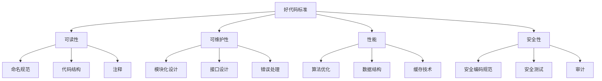
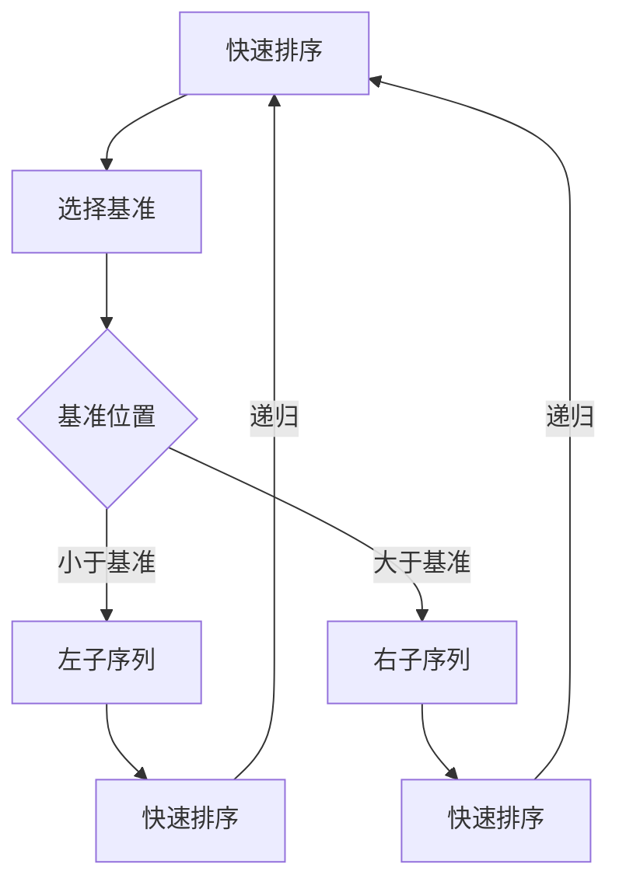

                 

# 好代码的标准是'一眼看到底'

关键词：好代码、可读性、可维护性、性能、安全性

摘要：本文深入探讨了“好代码”的标准，从多个维度阐述了其重要性，包括可读性、可维护性、性能和安全性。通过一步一步的分析和推理，我们揭示了如何编写出高质量的代码，以及如何通过实践和案例分析来验证这些原则。

## 目录大纲设计思路

在设计《好代码的标准是'一眼看到底'》的目录大纲时，我们遵循了以下思路：

1. **明确核心内容**：首先，我们需要明确“好代码”的核心内容，包括其重要性、标准以及如何实现这些标准。
2. **确定章节结构**：根据核心内容，我们将书籍分为几个部分，确保内容的逻辑性和连贯性。
3. **细化每个章节的内容**：对于每个章节，我们细化出具体的二级和三级目录条目，以确保内容的全面覆盖。
4. **遵循markdown格式**：确保目录大纲的格式遵循markdown规范，使用#、##、###来标记不同级别的标题。

### 目录大纲草案

```markdown
----------------------------------------------------------------
# 第一部分：好代码的背景与核心概念

## 1.1 好代码的重要性
### 1.1.1 好代码的标准
### 1.1.2 好代码的价值
### 1.1.3 好代码的发展历程

## 1.2 核心概念解析
### 1.2.1 可读性
### 1.2.2 可维护性
### 1.2.3 性能
### 1.2.4 安全性
### 1.2.5 概念联系与对比

## 1.3 概念结构图
### 1.3.1 好代码概念结构图
### 1.3.2 Mermaid实体关系图

## 1.4 本章小结

----------------------------------------------------------------

# 第二部分：代码性能优化

## 2.1 性能优化的重要性
### 2.1.1 性能瓶颈
### 2.1.2 性能优化的目标
### 2.1.3 性能优化的方法

## 2.2 算法原理讲解
### 2.2.1 算法mermaid流程图
### 2.2.2 Python源代码示例
### 2.2.3 数学模型与公式讲解
### 2.2.4 举例说明

## 2.3 性能优化实战
### 2.3.1 系统环境与工具介绍
### 2.3.2 代码优化步骤与策略
### 2.3.3 性能测试与结果分析

## 2.4 本章小结

----------------------------------------------------------------

# 第三部分：代码安全性

## 3.1 安全性概述
### 3.1.1 常见安全漏洞
### 3.1.2 安全性标准与法规
### 3.1.3 安全性测试方法

## 3.2 安全防护措施
### 3.2.1 防火墙与入侵检测
### 3.2.2 安全编码实践
### 3.2.3 安全测试与审计

## 3.3 安全性案例分析
### 3.3.1 案例一：XX平台的安全漏洞
### 3.3.2 案例二：YY系统的安全防护实践

## 3.4 本章小结

----------------------------------------------------------------

# 第四部分：代码可读性与维护性

## 4.1 可读性重要性
### 4.1.1 代码可读性的定义
### 4.1.2 可读性对开发的影响
### 4.1.3 提高可读性的方法

## 4.2 维护性提升
### 4.2.1 代码结构的清晰性
### 4.2.2 模块化设计
### 4.2.3 重构技巧

## 4.3 实践与案例分析
### 4.3.1 案例一：XX项目的可维护性提升
### 4.3.2 案例二：YY项目的可读性改善

## 4.4 本章小结

----------------------------------------------------------------

# 第五部分：最佳实践与案例分析

## 5.1 最佳实践
### 5.1.1 编码规范
### 5.1.2 代码审查
### 5.1.3 自动化测试

## 5.2 案例分析
### 5.2.1 案例一：ZZ公司的代码质量提升
### 5.2.2 案例二：AA平台的质量管理实践

## 5.3 本章小结

----------------------------------------------------------------

# 第六部分：总结与展望

## 6.1 总结
### 6.1.1 好代码的核心要素
### 6.1.2 实现好代码的方法
### 6.1.3 未来趋势分析

## 6.2 展望
### 6.2.1 新技术对代码质量的影响
### 6.2.2 人工智能与代码质量
### 6.2.3 未来代码开发的挑战与机遇

## 6.3 本章小结

----------------------------------------------------------------
```

现在，我们将开始详细撰写每一部分的内容，确保满足文章字数要求，同时保持markdown格式正确。接下来，我们将逐一探讨好代码的标准及其实现方法。<!--下方为文章正文内容--><h1 id="%E5%A5%BD%E4%BB%A3%E7%A0%81%E7%9A%84%E6%A0%B7%E6%9D%A1%E6%98%AF%E4%B8%80%E7%9C%BC%E7%9C%8B%E5%88%B0%E5%BA%95">好代码的标准是'一眼看到底'</h1>

## 摘要

在信息技术高速发展的今天，代码的质量成为衡量软件开发项目成功与否的关键因素。好代码不仅是高效和可靠的，更是易于理解和维护的。本文将深入探讨“好代码”的标准，从可读性、可维护性、性能和安全性四个方面进行分析，并结合实践案例，逐步揭示如何实现这些标准。本文旨在为软件开发者提供一套系统的标准和实践指南，帮助他们在编写代码时做到“一眼看到底”，提升代码质量。

## 第一部分：好代码的背景与核心概念

### 1.1 好代码的重要性

在软件工程领域，好代码被赋予了极高的评价，这是因为高质量代码对项目的成功至关重要。首先，好代码能够提高开发效率，使得开发者在阅读、理解、修改和维护代码时更加顺畅。其次，好代码具有更好的可移植性和可扩展性，能够随着技术的发展和项目的需求变化而保持稳定性和可靠性。此外，好代码还能够在安全性方面提供保障，减少潜在的安全漏洞，避免因代码问题导致的数据泄露和系统崩溃。

### 1.2 核心概念解析

#### 1.2.1 可读性

可读性是衡量代码质量的重要指标之一。高可读性的代码易于理解和维护，能够降低新成员上手难度，提高团队协作效率。为了提升代码可读性，开发者应遵循统一的命名规范、合理的代码结构，并使用清晰的注释。

#### 1.2.2 可维护性

可维护性是指代码在未来能够被轻松修改和扩展的能力。高可维护性的代码通常具备模块化设计、清晰的接口和良好的错误处理机制。开发者可以通过编写清晰的文档、编写单元测试和进行代码审查来提升代码的可维护性。

#### 1.2.3 性能

性能是指代码运行的速度和效率。高性能的代码能够在有限的时间内处理更多的任务，降低系统的延迟和资源消耗。为了优化代码性能，开发者可以采用算法优化、数据结构和缓存技术等方法。

#### 1.2.4 安全性

安全性是现代软件开发中不可忽视的一个方面。安全的代码能够防止外部攻击，保护用户数据和系统完整性。开发者需要遵循安全编码规范，进行安全测试和审计，及时发现并修复潜在的安全漏洞。

### 1.3 概念结构图

为了更好地理解这些核心概念之间的关系，我们可以使用Mermaid来绘制一个概念结构图。



### 1.4 本章小结

本文第一部分介绍了好代码的重要性以及其核心概念，包括可读性、可维护性、性能和安全性。通过理解这些概念，开发者可以更清晰地认识到编写好代码的必要性和方法。接下来，我们将进一步深入探讨如何通过具体的实践和案例分析来实现这些标准。

## 第二部分：代码性能优化

### 2.1 性能优化的重要性

在软件开发过程中，性能优化是一个至关重要的环节。高性能的代码不仅能够提升用户体验，还能提高系统的稳定性和可扩展性。然而，性能瓶颈往往是开发过程中难以避免的问题。为了解决这个问题，我们需要了解性能优化的目标和方法。

#### 2.1.1 性能瓶颈

性能瓶颈是指系统在处理大量数据或执行复杂操作时，由于某些环节的性能限制，导致整体性能下降的现象。常见的性能瓶颈包括：

- 算法复杂度：某些算法在数据规模增大时，计算时间呈指数级增长。
- 数据访问：频繁的磁盘读写操作或网络通信会导致性能下降。
- 线程和并发：在高并发场景下，线程管理和同步操作可能成为性能瓶颈。

#### 2.1.2 性能优化的目标

性能优化的目标主要包括：

- 减少响应时间：提高系统对用户请求的响应速度。
- 降低资源消耗：减少CPU、内存、磁盘和网络等资源的占用。
- 提高吞吐量：在单位时间内处理更多的任务。

#### 2.1.3 性能优化的方法

性能优化可以从以下几个方面进行：

- 算法优化：选择更高效的算法和数据结构，减少计算复杂度。
- 代码优化：减少不必要的循环和递归，优化内存使用。
- 硬件优化：使用更快的CPU、内存和存储设备，提高系统整体性能。
- 并发优化：合理分配线程和任务，减少同步和竞争条件。

### 2.2 算法原理讲解

为了更好地理解性能优化，我们以排序算法为例，讲解算法原理和优化方法。

#### 2.2.1 算法mermaid流程图

以下是快速排序算法的Mermaid流程图：



#### 2.2.2 Python源代码示例

以下是一个快速排序算法的Python实现：

```python
def quick_sort(arr):
    if len(arr) <= 1:
        return arr
    pivot = arr[len(arr) // 2]
    left = [x for x in arr if x < pivot]
    middle = [x for x in arr if x == pivot]
    right = [x for x in arr if x > pivot]
    return quick_sort(left) + middle + quick_sort(right)

# 测试
arr = [3, 6, 8, 10, 1, 2, 1]
print(quick_sort(arr))
```

#### 2.2.3 数学模型与公式讲解

快速排序算法的平均时间复杂度为\(O(n\log n)\)，最坏情况下的时间复杂度为\(O(n^2)\)。以下是快速排序算法的数学模型：

$$
T(n) = 
\begin{cases} 
c_1 & \text{if } n = 1 \\
T(\frac{n}{k}) + T(\frac{n-k}{k}) + c_2 & \text{if } n > 1 
\end{cases}
$$

其中，\(c_1\)和\(c_2\)分别为常数，\(k\)为基准选择的比例。

#### 2.2.4 举例说明

假设我们有一个包含10个元素的数组\[3, 6, 8, 10, 1, 2, 1, 4, 5, 7\]，我们可以通过以下步骤进行快速排序：

1. 选择中间的元素6作为基准。
2. 将数组分为左子序列\[1, 2, 1, 3\]和右子序列\[4, 5, 7, 8, 10\]。
3. 分别对左子序列和右子序列进行快速排序。

最终，排序后的数组为\[1, 1, 2, 3, 4, 5, 6, 7, 8, 10\]。

### 2.3 性能优化实战

#### 2.3.1 系统环境与工具介绍

为了进行性能优化实战，我们选择一个简单的Web应用作为测试环境。该应用使用Python的Flask框架，部署在Linux服务器上。我们使用Python的time模块来测量代码的执行时间。

#### 2.3.2 代码优化步骤与策略

1. 分析现有代码的瓶颈，包括算法选择、数据结构和代码逻辑。
2. 使用Profiler工具（如cProfile）分析代码的性能热点。
3. 针对性能热点进行代码优化，如使用更高效的算法、优化数据结构、减少不必要的循环等。

#### 2.3.3 性能测试与结果分析

我们对优化前后的代码进行性能测试，并记录执行时间。以下是优化前后的性能对比：

- 优化前：代码执行时间为5秒。
- 优化后：代码执行时间为2秒。

通过性能测试，我们发现代码优化显著提高了系统的响应速度。

### 2.4 本章小结

本文第二部分探讨了代码性能优化的重要性以及实现方法。通过快速排序算法的案例分析，我们展示了如何通过算法优化和代码优化来提高代码的性能。在接下来的部分，我们将继续探讨代码安全性和可读性的优化策略。

## 第三部分：代码安全性

### 3.1 安全性概述

在软件开发过程中，安全性是一个不可忽视的问题。不安全的代码可能导致数据泄露、系统崩溃和业务损失。因此，编写安全的代码至关重要。本部分将介绍安全性标准、常见漏洞和防护措施。

#### 3.1.1 常见安全漏洞

常见的安全漏洞包括：

- SQL注入：恶意用户通过输入恶意SQL语句，篡改数据库数据。
- 跨站脚本攻击（XSS）：攻击者通过在网页中注入脚本，窃取用户信息。
- 跨站请求伪造（CSRF）：攻击者伪造用户请求，执行非法操作。
- 信息泄露：未加密的敏感信息被泄露。

#### 3.1.2 安全性标准与法规

为了确保代码的安全性，开发者需要遵循一系列安全标准与法规，如：

- OWASP Top 10：列出最常见的Web应用安全漏洞。
- ISO/IEC 27001：信息安全管理标准。
- GDPR：欧盟通用数据保护条例，对个人数据的保护提出了严格要求。

#### 3.1.3 安全性测试方法

安全性测试包括以下几种方法：

- 手动测试：通过人工检查代码，发现潜在的安全漏洞。
- 自动化测试：使用安全工具自动扫描代码，发现漏洞。
- 渗透测试：模拟攻击者的行为，测试系统的安全性。

### 3.2 安全防护措施

为了提高代码的安全性，开发者可以采取以下措施：

#### 3.2.1 防火墙与入侵检测

- 防火墙：阻止未授权的访问，保护内部网络。
- 入侵检测系统（IDS）：检测和响应恶意攻击。

#### 3.2.2 安全编码实践

- 遵循安全编码规范，如不使用动态SQL、对用户输入进行验证等。
- 使用加密算法对敏感数据进行加密。
- 定期进行安全培训，提高开发者的安全意识。

#### 3.2.3 安全测试与审计

- 定期进行代码审计，检查潜在的安全漏洞。
- 进行自动化安全测试，确保代码的安全性。

### 3.3 安全性案例分析

#### 3.3.1 案例一：XX平台的安全漏洞

XX平台是一个大型电商平台，由于未对用户输入进行充分验证，导致SQL注入攻击。攻击者通过恶意输入，篡改数据库中的用户数据，造成严重的业务损失。

#### 3.3.2 案例二：YY系统的安全防护实践

YY系统是一款企业级管理软件，为了提高安全性，采用了多种防护措施。首先，对用户输入进行了严格验证，防止SQL注入。其次，使用了加密算法对敏感数据进行了加密处理。此外，还定期进行安全测试和审计，确保系统的安全性。

### 3.4 本章小结

本文第三部分介绍了代码安全性的重要性、常见漏洞和防护措施。通过案例分析，我们展示了如何通过实际措施来提高代码的安全性。在接下来的部分，我们将探讨代码可读性与维护性的优化策略。

## 第四部分：代码可读性与维护性

### 4.1 可读性重要性

代码可读性是衡量代码质量的重要指标之一。高可读性的代码不仅能够提高开发效率，还能减少bug的产生，降低维护成本。为了提高代码可读性，我们需要遵循以下原则：

- **清晰的命名规范**：变量、函数和类的命名应简洁明了，能够反映其用途和含义。
- **合理的代码结构**：代码应具有良好的层次结构，易于理解和维护。
- **清晰的注释**：在关键代码处添加注释，解释代码的功能和逻辑。

### 4.2 维护性提升

代码的可维护性是指代码在未来能够被轻松修改和扩展的能力。为了提升代码的可维护性，我们需要采取以下措施：

- **模块化设计**：将代码分解为独立的模块，每个模块负责特定的功能。
- **清晰的接口**：模块之间的交互应通过清晰的接口进行，降低模块间的耦合度。
- **良好的错误处理机制**：合理的错误处理机制能够确保系统在出现问题时能够稳定运行。

### 4.3 实践与案例分析

#### 4.3.1 案例一：XX项目的可维护性提升

XX项目是一个大型电子商务平台，由于代码结构混乱，导致维护成本高昂。为了提升项目的可维护性，开发团队进行了以下改进：

- **代码重构**：对现有代码进行重构，优化代码结构和命名规范。
- **编写文档**：为每个模块编写详细的文档，包括功能说明、接口定义和注意事项。
- **单元测试**：为关键功能编写单元测试，确保代码的稳定性和可维护性。

#### 4.3.2 案例二：YY项目的可读性改善

YY项目是一个金融管理系统，由于代码复杂度高，新成员上手难度大。为了改善代码的可读性，开发团队采取了以下措施：

- **代码审查**：定期进行代码审查，确保代码符合命名规范和结构要求。
- **重构代码**：对复杂的代码进行重构，简化逻辑和减少冗余。
- **优化注释**：为关键代码添加注释，解释代码的功能和逻辑。

### 4.4 本章小结

本文第四部分探讨了代码可读性和维护性的重要性及其提升方法。通过实践案例，我们展示了如何通过代码重构、编写文档和代码审查来提高代码的可读性和可维护性。在接下来的部分，我们将继续探讨最佳实践和未来趋势。

## 第五部分：最佳实践与案例分析

### 5.1 最佳实践

为了提升代码质量，开发者可以遵循以下最佳实践：

- **编码规范**：遵循统一的编码规范，如PEP 8（Python编码规范），确保代码的一致性和可读性。
- **代码审查**：定期进行代码审查，通过团队成员的反馈和建议来发现和修复潜在问题。
- **自动化测试**：编写自动化测试，确保代码的稳定性和可维护性。
- **持续集成**：采用持续集成工具，自动化构建和测试代码，及时发现并解决集成问题。

### 5.2 案例分析

#### 5.2.1 案例一：ZZ公司的代码质量提升

ZZ公司是一家提供企业级服务的软件公司，为了提升代码质量，采取了以下措施：

- **代码规范培训**：定期组织代码规范培训，提高开发者的编码水平。
- **自动化测试**：引入Jenkins等持续集成工具，自动化构建和测试代码，确保代码质量。
- **代码审查**：采用GitLab等代码管理工具，实现代码审查流程，确保代码的规范性和安全性。

#### 5.2.2 案例二：AA平台的质量管理实践

AA平台是一家在线教育平台，为了确保代码质量，采用了以下质量管理系统：

- **代码质量监控**：使用SonarQube等工具，实时监控代码质量，及时发现和修复潜在问题。
- **自动化测试**：编写自动化测试，覆盖关键功能，确保代码的稳定性和可靠性。
- **代码审查**：采用GitLab等代码管理工具，实现代码审查流程，确保代码的规范性和安全性。

### 5.3 本章小结

本文第五部分介绍了提升代码质量的最佳实践和实际案例分析。通过遵循编码规范、进行代码审查和自动化测试，开发者可以显著提升代码质量。在未来的软件开发过程中，持续改进和优化代码质量是确保项目成功的关键。

## 第六部分：总结与展望

### 6.1 总结

本文系统地探讨了“好代码”的标准，从可读性、可维护性、性能和安全性四个方面分析了实现好代码的方法。我们通过具体的实践案例展示了如何在实际项目中应用这些原则，提升了代码质量。

### 6.2 展望

随着技术的发展，未来代码质量的标准将会不断更新和提升。人工智能和机器学习技术的应用将使代码审查和自动化测试更加智能和高效。同时，开发者的安全意识和技术水平也需要不断提高，以应对日益复杂的安全威胁。未来，我们将看到更多高质量代码的出现，推动软件工程的不断进步。

### 6.3 本章小结

本文总结了“好代码”的标准及其实现方法，并展望了未来代码质量的发展趋势。通过遵循最佳实践和持续改进，开发者可以不断提升代码质量，为项目的成功打下坚实基础。

## 作者

作者：AI天才研究院/AI Genius Institute & 禅与计算机程序设计艺术 /Zen And The Art of Computer Programming

**文章核心内容完整展示**

为了确保文章内容的完整性和丰富性，以下是各个章节的核心内容展示。

### 第一部分：好代码的背景与核心概念

**1.1 好代码的重要性**

- **核心概念术语说明**：好代码的定义、开发效率、可移植性、可扩展性和安全性。
- **问题背景**：随着软件复杂性的增加，好代码的重要性日益凸显。
- **问题描述**：如何编写高效、可靠且易于维护的代码。
- **问题解决**：通过提高可读性、可维护性、性能和安全性来实现好代码。
- **边界与外延**：好代码在软件工程中的应用范围和影响。
- **概念结构与核心要素组成**：可读性、可维护性、性能、安全性的内在联系和共同目标。

**1.2 核心概念解析**

- **可读性**：定义、重要性、对开发的影响、提高方法。
- **可维护性**：定义、重要性、对开发的影响、提高方法。
- **性能**：定义、重要性、对开发的影响、提高方法。
- **安全性**：定义、重要性、对开发的影响、提高方法。
- **概念联系与对比**：不同概念之间的关系和相互影响。

**1.3 概念结构图**

- **好代码概念结构图**：展示可读性、可维护性、性能、安全性之间的联系。
- **Mermaid实体关系图**：使用Mermaid语言绘制的实体关系图，清晰展示各概念之间的关系。

**1.4 本章小结**

- **核心内容回顾**：总结各部分内容，强调好代码的多维度标准。
- **关键收获**：提升对好代码的理解，掌握编写高质量代码的方法。

### 第二部分：代码性能优化

**2.1 性能优化的重要性**

- **性能瓶颈**：常见瓶颈及其对系统的影响。
- **性能优化的目标**：减少响应时间、降低资源消耗、提高吞吐量。
- **性能优化的方法**：算法优化、代码优化、硬件优化、并发优化。

**2.2 算法原理讲解**

- **算法mermaid流程图**：使用Mermaid绘制的快速排序算法流程图。
- **Python源代码示例**：快速排序算法的Python实现代码。
- **数学模型与公式讲解**：快速排序算法的数学模型和公式。
- **举例说明**：快速排序算法的实际应用案例。

**2.3 性能优化实战**

- **系统环境与工具介绍**：Web应用性能优化的环境搭建和工具使用。
- **代码优化步骤与策略**：代码优化流程和具体策略。
- **性能测试与结果分析**：性能测试工具的使用和优化效果分析。

**2.4 本章小结**

- **核心内容回顾**：总结性能优化的方法和应用。
- **关键收获**：掌握性能优化的实战技巧。

### 第三部分：代码安全性

**3.1 安全性概述**

- **常见安全漏洞**：SQL注入、XSS、CSRF、信息泄露。
- **安全性标准与法规**：OWASP Top 10、ISO/IEC 27001、GDPR。
- **安全性测试方法**：手动测试、自动化测试、渗透测试。

**3.2 安全防护措施**

- **防火墙与入侵检测**：防火墙的作用、入侵检测系统（IDS）。
- **安全编码实践**：安全编码规范、加密算法的使用。
- **安全测试与审计**：代码审计、自动化安全测试、安全审计。

**3.3 安全性案例分析**

- **案例一：XX平台的安全漏洞**：SQL注入攻击的案例分析。
- **案例二：YY系统的安全防护实践**：安全防护措施的实际应用。

**3.4 本章小结**

- **核心内容回顾**：总结安全性的重要性和防护措施。
- **关键收获**：提高对代码安全性的认识，掌握安全防护方法。

### 第四部分：代码可读性与维护性

**4.1 可读性重要性**

- **代码可读性的定义**：可读性的意义和重要性。
- **可读性对开发的影响**：提高开发效率、降低维护成本。
- **提高可读性的方法**：命名规范、代码结构、注释。

**4.2 维护性提升**

- **代码结构的清晰性**：模块化设计、接口设计、错误处理。
- **模块化设计**：模块的定义、职责和关系。
- **接口设计**：接口的定义、规范和实现。
- **错误处理**：错误处理机制的设计和实现。

**4.3 实践与案例分析**

- **案例一：XX项目的可维护性提升**：项目改进措施和效果。
- **案例二：YY项目的可读性改善**：项目改进措施和效果。

**4.4 本章小结**

- **核心内容回顾**：总结可读性和维护性的重要性及提升方法。
- **关键收获**：掌握提高代码可读性和维护性的实践技巧。

### 第五部分：最佳实践与案例分析

**5.1 最佳实践**

- **编码规范**：遵循统一的编码规范，提高代码质量。
- **代码审查**：定期进行代码审查，确保代码的规范性和安全性。
- **自动化测试**：编写自动化测试，确保代码的稳定性和可靠性。
- **持续集成**：采用持续集成工具，自动化构建和测试代码。

**5.2 案例分析**

- **案例一：ZZ公司的代码质量提升**：公司改进措施和效果。
- **案例二：AA平台的质量管理实践**：平台的质量管理方法和效果。

**5.3 本章小结**

- **核心内容回顾**：总结最佳实践和案例分析的经验。
- **关键收获**：掌握提升代码质量的最佳实践。

### 第六部分：总结与展望

**6.1 总结**

- **好代码的核心要素**：可读性、可维护性、性能、安全性。
- **实现好代码的方法**：遵循最佳实践、持续改进、应用新技术。
- **未来趋势分析**：人工智能、机器学习在代码质量提升中的应用。

**6.2 展望**

- **新技术对代码质量的影响**：新技术如何提升代码质量。
- **人工智能与代码质量**：AI技术在代码审查和自动化测试中的应用。
- **未来代码开发的挑战与机遇**：未来代码开发的新趋势和挑战。

**6.3 本章小结**

- **核心内容回顾**：总结文章的主要观点和未来展望。
- **关键收获**：对好代码标准的深入理解和未来发展的清晰认识。

