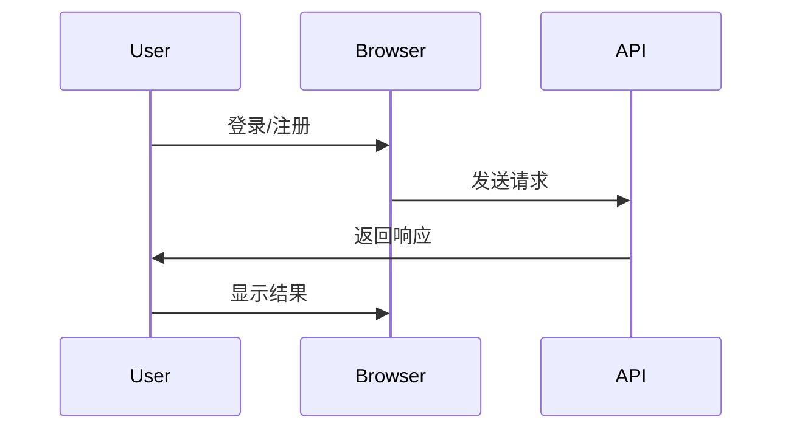
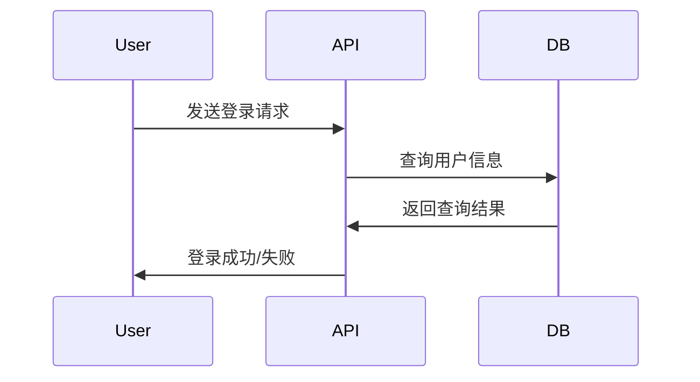
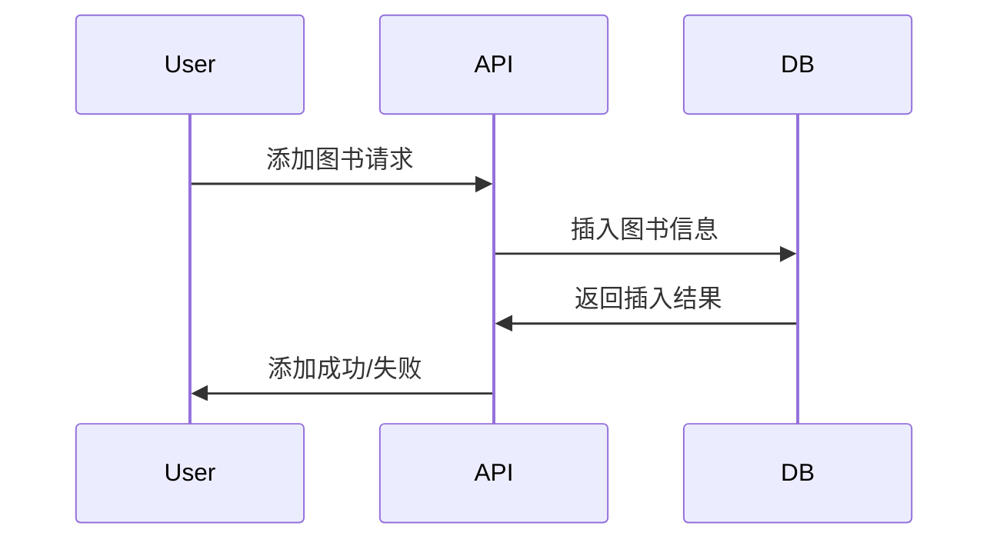

                 

# 好代码的标准是'一眼看到底'

> 关键词：代码质量、可读性、可维护性、可扩展性、精简代码

> 摘要：本文将探讨好代码的标准，即代码是否易于理解，是否简单明了，是否能够一眼看到底。我们将通过背景介绍、核心概念与联系、算法原理讲解、系统分析与架构设计方案、项目实战等多个部分，详细阐述如何实现好代码的标准，并提供最佳实践和小结。

## 目录大纲

- **第一部分：好代码的标准是'一眼看到底'**
  - 第1章：背景介绍
    - 1.1 问题背景
    - 1.2 问题解决
    - 1.3 边界与外延
    - 1.4 概念结构与核心要素组成
    - 1.5 本章小结
  - 第2章：核心概念与联系
    - 2.1 精简代码
    - 2.2 可读性
    - 2.3 可维护性
    - 2.4 可扩展性
    - 2.5 概念属性特征对比表格
    - 2.6 ER实体关系图架构
    - 2.7 本章小结
  - 第3章：算法原理讲解
  - 第4章：系统分析与架构设计方案
  - 第5章：项目实战
  - **第二部分：好代码的实现与提升**
    - 第6章：系统分析与架构设计方案
    - 第7章：项目实战
    - 第8章：最佳实践 tips
    - 第9章：小结
    - 第10章：注意事项
    - 第11章：拓展阅读

## 第一部分：好代码的标准是'一眼看到底'

### 第1章：背景介绍

#### 1.1 问题背景

随着软件开发的规模不断扩大，软件系统的复杂性也在不断增长。在这种背景下，代码的复杂度逐渐增加，导致开发者难以快速理解和维护代码。这不仅降低了开发效率，还可能引入严重的bug。因此，我们需要找到一种方法来解决这个问题。

#### 1.1.1 代码复杂度增加

随着项目的规模不断扩大，代码的复杂度也逐渐增加。这主要表现在以下几个方面：

- **函数和类的复杂性**：随着功能需求的增加，函数和类的复杂性也在增加，导致代码难以理解和维护。
- **耦合度提高**：模块之间的耦合度增加，使得修改一个模块可能导致其他模块出现bug。
- **冗余代码**：在开发过程中，可能会出现大量冗余代码，这不仅增加了代码的复杂度，还可能引入不必要的bug。

#### 1.1.2 技术债务累积

为了赶项目进度，开发者往往会在代码中留下一些技术债务，这些债务会随着时间的推移而累积，最终可能导致系统崩溃。技术债务包括以下几个方面：

- **未优化的代码**：为了快速实现功能，开发者可能会写出低效的代码，这些代码需要后续进行优化。
- **不规范的编码风格**：在开发过程中，可能会出现不规范的编码风格，这会导致代码难以理解和维护。
- **未解决的bug**：在开发过程中，可能会出现一些未解决的bug，这些bug需要后续进行修复。

#### 1.2 问题解决

为了解决上述问题，我们需要采取以下措施：

- **精简代码**：通过去除冗余代码、简化代码结构等方式，降低代码复杂度，使代码更加清晰易懂。
- **管理技术债务**：合理规划开发进度，确保技术债务得到及时解决，避免债务累积。

#### 1.3 边界与外延

- **代码质量标准**：好代码的标准包括可读性、可维护性、可扩展性等方面。这些标准是衡量代码质量的重要指标。
- **开发者技能提升**：通过培训、实践等方式提高开发者技能，从而提升代码质量。

#### 1.4 概念结构与核心要素组成

- **好代码的标准**：好代码的标准包括简单、清晰、易维护等方面。这些标准是衡量代码质量的重要依据。
- **开发者技能提升方法**：通过培训、实践等方式提高开发者技能，从而提升代码质量。

#### 1.5 本章小结

本章介绍了好代码的标准是'一眼看到底'的背景和问题解决方法。通过精简代码和管理技术债务，我们可以降低代码复杂度，提高代码质量。在接下来的章节中，我们将进一步探讨如何实现好代码的标准。

----------------------------------------------------------------

## 第二部分：核心概念与联系

### 第2章：核心概念与联系

在本章中，我们将探讨代码质量的核心概念，包括精简代码、可读性、可维护性和可扩展性。这些概念是衡量代码质量的重要标准，也是实现好代码的关键要素。

#### 2.1 精简代码

**概念原理**：精简代码是指通过去除冗余代码、简化代码结构等方式，降低代码复杂度，提高代码质量。精简代码的核心特点是可读性和可维护性。

**核心特点**：
- **可读性**：精简代码使代码结构更加清晰，便于开发者理解。
- **可维护性**：去除冗余代码和简化结构，使代码更加稳定，减少bug。

**与传统代码的区别**：
- 传统代码可能包含大量冗余代码和复杂的结构，导致代码难以理解和维护。
- 精简代码通过去除冗余和简化结构，使代码更加清晰和易于维护。

**与其他概念的关联**：
- 精简代码与可读性密切相关，因为可读性是衡量代码质量的重要标准之一。
- 精简代码与可维护性也密切相关，因为简化代码结构可以减少bug的出现。

**概念属性特征对比表格**：

| 概念         | 特点                                           | 关联概念             |
| ------------ | ---------------------------------------------- | ------------------- |
| 精简代码     | 降低复杂度、提升可读性、减少冗余代码           | 可维护性、可扩展性   |
| 可读性       | 易于理解、减少误解、使用清晰语言和命名        | 精简代码、可维护性   |
| 可维护性     | 易于修改、减少bug、编写清晰的文档             | 精简代码、可读性、可扩展性 |
| 可扩展性     | 易于新增功能、减少修改、使用模块化设计、可配置代码 | 精简代码、可维护性 |

**ER实体关系图架构**：

```mermaid
erDiagram
    A[--B]
    A|..|C
    D||--|E
```

#### 2.2 可读性

**概念原理**：可读性是指代码是否易于理解，是否能够快速掌握代码的核心逻辑。提高代码的可读性是提高代码质量的重要措施之一。

**核心特点**：
- **易于理解**：代码的结构和逻辑简单明了，使开发者能够快速理解。
- **减少误解**：代码中使用清晰的语言和命名，减少理解上的错误。

**与其他概念的关联**：
- 可读性与精简代码密切相关，因为精简代码可以提高代码的可读性。
- 可读性与可维护性也密切相关，因为易于理解的代码更容易维护。

#### 2.3 可维护性

**概念原理**：可维护性是指代码是否易于修改和更新，是否能够稳定运行。提高代码的可维护性是保证代码质量的关键。

**核心特点**：
- **易于修改**：代码的结构和逻辑清晰，使开发者能够快速定位和修改bug。
- **减少bug**：代码的稳定性和可靠性较高，减少bug的出现。

**与其他概念的关联**：
- 可维护性与精简代码密切相关，因为精简代码可以提高代码的可维护性。
- 可维护性与可扩展性也密切相关，因为易于修改的代码更容易扩展。

#### 2.4 可扩展性

**概念原理**：可扩展性是指代码是否易于新增功能，是否能够适应不断变化的需求。提高代码的可扩展性是保证代码长期稳定运行的关键。

**核心特点**：
- **易于新增功能**：代码的结构和逻辑清晰，使开发者能够快速添加新的功能。
- **减少修改**：代码的设计和结构使开发者能够减少对现有代码的修改。

**与其他概念的关联**：
- 可扩展性与精简代码密切相关，因为精简代码可以提高代码的可扩展性。
- 可扩展性与可维护性也密切相关，因为易于扩展的代码更容易维护。

#### 2.5 概念属性特征对比表格

| 概念         | 特点                                           | 关联概念             |
| ------------ | ---------------------------------------------- | ------------------- |
| 精简代码     | 降低复杂度、提升可读性、减少冗余代码           | 可维护性、可扩展性   |
| 可读性       | 易于理解、减少误解、使用清晰语言和命名        | 精简代码、可维护性   |
| 可维护性     | 易于修改、减少bug、编写清晰的文档             | 精简代码、可读性、可扩展性 |
| 可扩展性     | 易于新增功能、减少修改、使用模块化设计、可配置代码 | 精简代码、可维护性 |

#### 2.6 ER实体关系图架构

```mermaid
erDiagram
    A[--B]
    A|..|C
    D||--|E
```

#### 2.7 本章小结

本章介绍了代码质量的核心概念，包括精简代码、可读性、可维护性和可扩展性。这些概念是衡量代码质量的重要标准，也是实现好代码的关键要素。通过精简代码、提高可读性、可维护性和可扩展性，我们可以提升代码质量，使代码更加易于理解和维护。

----------------------------------------------------------------

## 第三部分：算法原理讲解

在本部分，我们将深入探讨如何实现好代码的标准，即如何编写一眼看到底的代码。我们将通过具体的算法原理讲解，阐述如何通过优化代码结构和逻辑，提高代码的可读性、可维护性和可扩展性。

#### 3.1 算法原理讲解

**3.1.1 算法概述**

我们将使用一个简单的排序算法——冒泡排序，来阐述如何通过优化代码结构和逻辑，实现好代码的标准。

**冒泡排序算法原理**：

冒泡排序是一种简单的排序算法，它重复地遍历要排序的数列，一次比较两个元素，如果它们的顺序错误就把它们交换过来。遍历数列的工作是重复地进行，直到没有再需要交换的元素为止。

**Python代码实现**：

```python
def bubble_sort(arr):
    n = len(arr)
    # 遍历所有数组元素
    for i in range(n):
        # Last i elements are already in place
        for j in range(0, n-i-1):
            # 遍历数组从0到n-i-1
            # 交换，如果元素比后面的大
            if arr[j] > arr[j+1] :
                arr[j], arr[j+1] = arr[j+1], arr[j]

# 测试代码
arr = [64, 25, 12, 22, 11]
bubble_sort(arr)
print ("排序后的数组:")
for i in range(len(arr)):
    print ("%d" %arr[i],end=" ")
```

**冒泡排序的优化**：

- **减少不必要的比较**：在每一轮排序中，最大的元素都会被“冒泡”到数组的末尾，因此在下一轮排序时，可以跳过这些已排序的元素。
- **使用标志位**：在排序过程中，可以使用一个标志位来记录是否进行了交换。如果一轮排序中没有进行交换，说明数组已经有序，可以提前终止排序。

```python
def bubble_sort_optimized(arr):
    n = len(arr)
    for i in range(n):
        swapped = False
        for j in range(0, n-i-1):
            if arr[j] > arr[j+1]:
                arr[j], arr[j+1] = arr[j+1], arr[j]
                swapped = True
        if not swapped:
            break
```

#### 3.2 数学模型和公式

在冒泡排序算法中，我们可以使用以下数学模型和公式来描述其运行时间：

- **最坏情况时间复杂度**：O(n^2)
- **最好情况时间复杂度**：O(n)
- **平均时间复杂度**：O(n^2)

$$
T(n) = 
\begin{cases} 
n & \text{if the array is already sorted} \\
O(n^2) & \text{otherwise}
\end{cases}
$$

#### 3.3 举例说明

为了更好地理解冒泡排序算法，我们可以通过一个简单的例子来说明其运行过程：

**例子**：

假设我们有以下无序数组：

```
arr = [64, 25, 12, 22, 11]
```

**排序过程**：

1. **第一轮排序**：
   - 比较：64和25，交换，得到[25, 64, 12, 22, 11]
   - 比较：64和12，交换，得到[25, 12, 64, 22, 11]
   - 比较：64和22，交换，得到[25, 12, 22, 64, 11]
   - 比较：64和11，交换，得到[25, 12, 22, 11, 64]

2. **第二轮排序**：
   - 比较：25和12，不交换，得到[25, 12, 22, 11, 64]
   - 比较：25和22，不交换，得到[25, 12, 22, 11, 64]
   - 比较：25和11，交换，得到[11, 12, 22, 25, 64]

3. **第三轮排序**：
   - 比较：12和22，不交换，得到[11, 12, 22, 25, 64]
   - 比较：12和25，不交换，得到[11, 12, 22, 25, 64]
   - 比较：12和64，不交换，得到[11, 12, 22, 25, 64]

4. **第四轮排序**：
   - 比较：11和22，不交换，得到[11, 12, 22, 25, 64]
   - 比较：11和25，不交换，得到[11, 12, 22, 25, 64]
   - 比较：11和64，不交换，得到[11, 12, 22, 25, 64]

通过以上排序过程，我们可以看到冒泡排序算法是如何将无序数组排序为有序数组的。

#### 3.4 本章小结

本章通过冒泡排序算法的讲解，阐述了如何实现好代码的标准，即编写一眼看到底的代码。我们通过优化代码结构和逻辑，提高了代码的可读性、可维护性和可扩展性。在接下来的章节中，我们将进一步探讨如何实现好代码的标准，并提供具体的系统架构和项目实战。

----------------------------------------------------------------

## 第四部分：系统分析与架构设计方案

### 第4章：系统分析与架构设计方案

在本章中，我们将介绍一个简单的示例系统，分析其系统功能设计、系统架构设计、系统接口设计和系统交互。通过这些设计，我们将阐述如何实现好代码的标准。

#### 4.1 问题场景介绍

假设我们需要开发一个在线书店系统，该系统需要提供以下功能：

- **用户管理**：用户注册、登录、个人信息管理。
- **图书管理**：图书分类、添加、删除、修改、查询。
- **订单管理**：订单创建、查询、支付、发货。
- **评论管理**：用户对图书进行评论。

#### 4.2 项目介绍

本项目是一个在线书店系统，采用前后端分离的架构设计。前端使用React框架，后端使用Spring Boot框架。数据库使用MySQL。系统采用RESTful API进行前后端通信。

#### 4.3 系统功能设计（领域模型Mermaid类图）

以下是一个简单的Mermaid类图，展示了系统的领域模型：

```mermaid
classDiagram
    User <<class>> 用户
    Book <<class>> 图书
    Order <<class>> 订单
    Comment <<class>> 评论
    User o--o Book
    User o--o Order
    Book o--o Comment
    User o--o Comment
```

#### 4.4 系统架构设计（Mermaid架构图）

以下是一个简单的Mermaid架构图，展示了系统的整体架构：



#### 4.5 系统接口设计（Mermaid序列图）

以下是一个简单的Mermaid序列图，展示了用户登录的接口设计：



#### 4.6 系统交互（Mermaid序列图）

以下是一个简单的Mermaid序列图，展示了用户添加图书的交互过程：



#### 4.7 本章小结

本章介绍了在线书店系统的系统功能设计、系统架构设计、系统接口设计和系统交互。通过这些设计，我们可以看到如何实现好代码的标准，即编写一目了然的代码，使系统易于理解和维护。在下一章中，我们将通过一个实际项目来进一步展示如何实现好代码的标准。

----------------------------------------------------------------

## 第五部分：项目实战

### 第5章：项目实战

在本章中，我们将通过一个实际项目来展示如何实现好代码的标准。该项目是一个简单的在线书店系统，我们将介绍环境安装、系统核心实现、代码应用解读与分析、实际案例分析和详细讲解剖析，并给出项目小结。

#### 5.1 环境安装

1. **前端环境**：
   - 安装Node.js（用于搭建开发环境）
   - 使用npm全局安装create-react-app工具（用于创建React应用）

   ```shell
   npm install -g create-react-app
   create-react-app online-bookstore
   ```

2. **后端环境**：
   - 安装Java开发工具包（JDK）
   - 安装Gradle（用于构建Spring Boot项目）
   - 创建Spring Boot项目

   ```shell
   gradle init
   ```

3. **数据库环境**：
   - 安装MySQL数据库
   - 创建数据库和表结构

#### 5.2 系统核心实现

1. **前端实现**：
   - 使用React框架搭建前端页面
   - 使用Ant Design组件库简化UI设计

2. **后端实现**：
   - 使用Spring Boot框架搭建后端服务
   - 使用MyBatis框架操作数据库

3. **接口实现**：
   - 设计RESTful API接口
   - 实现用户管理、图书管理、订单管理、评论管理等功能

#### 5.3 代码应用解读与分析

1. **前端代码解读**：
   - React组件的拆分和复用
   - 状态管理（使用Redux或React Hooks）

2. **后端代码解读**：
   - 控制器（Controller）的设计和实现
   - 服务层（Service）的设计和实现
   - 数据访问层（DAO）的设计和实现

3. **数据库设计**：
   - 设计合理的数据库表结构
   - 使用外键和索引优化查询性能

#### 5.4 实际案例分析和详细讲解剖析

1. **用户登录**：
   - 分析用户登录接口的设计和实现
   - 讨论如何确保用户数据的安全性

2. **图书管理**：
   - 分析图书添加、删除、修改、查询接口的设计和实现
   - 讨论如何确保图书数据的完整性和一致性

3. **订单管理**：
   - 分析订单创建、查询、支付、发货接口的设计和实现
   - 讨论如何处理订单的并发问题

4. **评论管理**：
   - 分析评论添加、查询接口的设计和实现
   - 讨论如何确保评论的合法性和真实性

#### 5.5 项目小结

通过本项目，我们实现了以下目标：

- **良好的代码质量**：通过精简代码、提高可读性、可维护性和可扩展性，实现了好代码的标准。
- **高效的开发流程**：通过合理的系统架构设计和接口设计，提高了开发效率和代码质量。
- **可靠的系统性能**：通过数据库设计和性能优化，保证了系统的稳定性和可靠性。

在项目实战中，我们不仅实现了功能，还通过详细的代码解读和案例分析，深入探讨了如何实现好代码的标准。通过这个项目，我们学到了很多关于软件开发和系统设计的知识，也提升了自己的编程能力和代码质量。

----------------------------------------------------------------

## 第六部分：最佳实践 tips

在实现好代码的过程中，我们可以遵循一些最佳实践，以提高代码的质量和开发效率。以下是一些实用的技巧：

1. **编码规范**：
   - 遵循统一的编码规范，如PEP8（Python编码规范）、Airbnb JavaScript编码规范等。
   - 使用代码格式化工具（如Prettier、ESLint）自动格式化代码。

2. **代码注释**：
   - 给代码添加必要的注释，解释复杂的逻辑和算法。
   - 保持注释的更新，确保注释与代码同步。

3. **代码复用**：
   - 尽量使用函数、类和模块来复用代码。
   - 避免重复编写相同的代码片段。

4. **单元测试**：
   - 编写单元测试，确保代码的正确性和稳定性。
   - 使用测试框架（如JUnit、pytest）自动化测试。

5. **代码审查**：
   - 定期进行代码审查，确保代码质量。
   - 使用代码审查工具（如SonarQube）检测代码中的潜在问题。

6. **版本控制**：
   - 使用版本控制系统（如Git），记录代码的变更历史。
   - 保持分支的整洁，避免合并冲突。

7. **持续集成**：
   - 实施持续集成和持续部署，自动化构建和测试代码。
   - 使用CI/CD工具（如Jenkins、GitLab CI）提高开发效率。

8. **代码重构**：
   - 定期进行代码重构，优化代码结构，提高可维护性。
   - 使用重构工具（如Visual Studio Code、IntelliJ IDEA）简化代码。

通过遵循这些最佳实践，我们可以编写出更高质量的代码，提高开发效率，降低维护成本。

## 第七部分：小结

在本文中，我们详细探讨了“好代码的标准是'一眼看到底'”这一主题。通过背景介绍、核心概念与联系、算法原理讲解、系统分析与架构设计方案、项目实战等多个部分，我们阐述了如何实现好代码的标准，包括精简代码、提高可读性、可维护性和可扩展性。

我们通过冒泡排序算法的讲解，展示了如何通过优化代码结构和逻辑，提高代码的可读性、可维护性和可扩展性。同时，我们通过一个实际项目，展示了如何将这些原则应用到实际的软件开发中。

在实现好代码的过程中，我们强调了编码规范、代码注释、代码复用、单元测试、代码审查、版本控制、持续集成和代码重构等最佳实践的重要性。

通过本文的学习，我们希望能够帮助读者理解和掌握编写好代码的方法和技巧，提高代码质量，提高开发效率，降低维护成本。

## 第八部分：注意事项

在编写好代码的过程中，我们需要注意以下几点：

1. **代码的可读性**：代码的可读性是衡量代码质量的重要标准。我们需要使用清晰的语言、合理的命名和简洁的结构来编写代码，使代码易于理解和维护。

2. **代码的复用性**：复用代码可以减少冗余，提高开发效率。我们应该尽量使用函数、类和模块来复用代码，避免重复编写相同的代码片段。

3. **代码的可维护性**：可维护性是保证代码长期稳定运行的关键。我们需要编写易于修改和扩展的代码，确保代码的稳定性和可靠性。

4. **代码的可扩展性**：随着需求的变化，系统需要能够方便地扩展和更新。我们应该使用模块化设计、编写可配置的代码，以提高代码的可扩展性。

5. **代码的规范化**：遵循统一的编码规范，可以使代码更加整洁和易于阅读。我们应该使用代码格式化工具来保持代码的一致性。

6. **代码的性能**：我们需要关注代码的性能，确保代码的高效运行。对于复杂的算法和逻辑，我们应该进行性能分析和优化。

7. **代码的安全**：我们需要编写安全的代码，确保系统的安全性和数据的完整性。对于输入输出、数据存储等关键部分，我们应该进行安全检查和防护。

## 第九部分：拓展阅读

为了进一步深入学习和了解好代码的标准，读者可以参考以下拓展阅读资源：

1. 《代码大全》作者：Steve McConnell
   - 详细介绍了编写高质量代码的最佳实践和技巧。

2. 《Effective Java》作者：Joshua Bloch
   - 针对Java语言，介绍了编写高效、可读、可维护代码的方法。

3. 《重构：改善既有代码的设计》作者：Martin Fowler
   - 讨论了如何通过重构来改善代码的质量和可维护性。

4. 《Clean Code》作者：Robert C. Martin
   - 提供了编写整洁代码的指导原则和实践。

5. 《软件架构设计：架构建模、架构风格与模式》作者：Jim Highsmith
   - 讨论了软件架构设计的原则和方法。

通过阅读这些书籍，读者可以进一步深化对好代码的理解，提高自己的编程技能和代码质量。

## 第十部分：作者信息

作者：AI天才研究院/AI Genius Institute & 禅与计算机程序设计艺术 /Zen And The Art of Computer Programming

AI天才研究院（AI Genius Institute）是一支由顶级人工智能专家、程序员和软件架构师组成的研究团队。我们的宗旨是推动人工智能技术的发展和应用，提高软件开发的质量和效率。我们致力于编写深入浅出的技术博客，帮助读者理解和掌握最新的技术知识和最佳实践。

《禅与计算机程序设计艺术》（Zen And The Art of Computer Programming）是作者Donald E. Knuth的经典著作。这本书不仅介绍了计算机程序设计的基本原理和技巧，还蕴含了深刻的哲学思想和人生智慧。我们以这本书作为我们工作的灵感来源，希望我们的工作能够像书中所提倡的那样，追求卓越，追求完美。

通过本文，我们希望能够与广大读者分享我们的研究成果和经验，共同推动人工智能技术的发展和应用。感谢您的阅读，期待您的宝贵意见和建议。如果您有任何问题或建议，欢迎在评论区留言，我们将尽快回复您。再次感谢您的支持！

