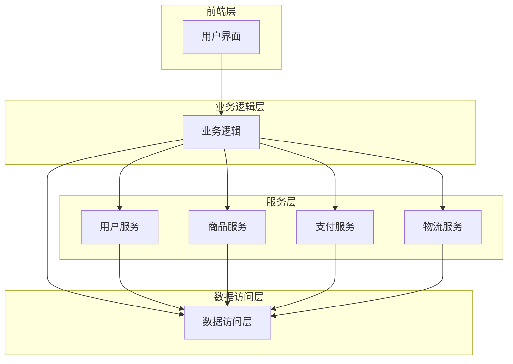
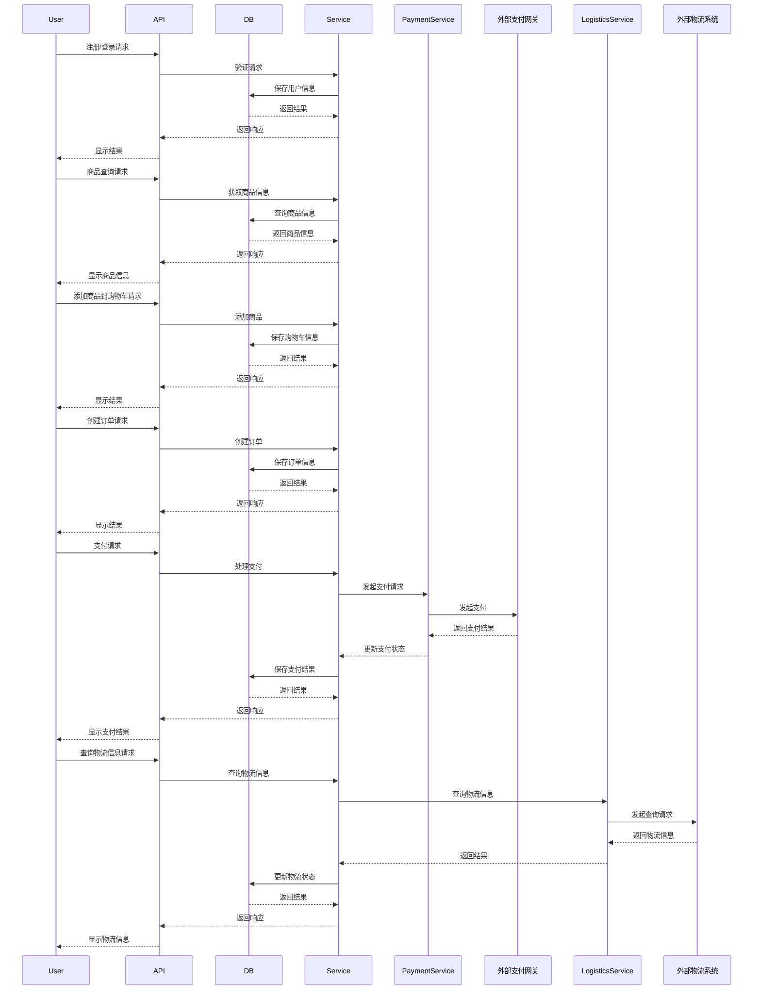

                 

### 背景介绍

#### 为什么会有这样一本书？

在信息时代的今天，编程已经成为许多行业的基石，无论是软件开发、人工智能、数据分析，还是物联网、移动应用开发，都需要大量的编程知识和技能。然而，面对浩瀚如海的编程书籍和资源，许多初学者和有经验的程序员都感到困惑：什么样的代码才是“好代码”？如何在大量的编程实践中提炼出一种通用的指导原则，既能够提高代码质量，又能够提升开发效率和系统性能？

《好代码都是这样的》这本书正是为了解决这一实际问题而诞生的。它源于作者多年在软件行业积累的丰富经验，以及对数以万计的代码实例的深入分析。作者在编写这本书的过程中，不仅考虑了编程的基础知识，还结合了前沿的技术发展趋势，旨在为读者提供一套全面、系统的代码质量提升指南。

#### 当前编程领域的现状

当前的编程领域存在几个显著的问题：

1. **代码质量参差不齐**：许多程序员在编码时缺乏明确的指导原则，导致代码质量参差不齐，不仅难以维护，甚至影响系统的稳定性和性能。
2. **知识更新速度快**：随着技术的快速发展，新的编程语言、框架和工具层出不穷，程序员需要不断学习，但旧有的编程经验和知识逐渐变得过时。
3. **开发效率与质量之间的矛盾**：在快速迭代的开发过程中，程序员往往为了追求短期效率，忽略了代码质量，导致后续的维护和扩展变得困难。
4. **资源分散，缺乏系统性**：现有的编程书籍和教程往往各自为政，缺乏系统性和整体性，难以形成一套完整的知识体系。

#### 本书的贡献

《好代码都是这样的》旨在解决上述问题，为读者提供以下贡献：

1. **系统性的知识框架**：本书从编程原则、编码规范、设计模式、代码可读性和可维护性等多个方面，系统地构建了一个编程知识的框架。
2. **实用的指导原则**：书中不仅介绍了各种编程最佳实践，还通过大量的实例和代码分析，帮助读者理解并应用这些原则。
3. **全面的技术覆盖**：本书涵盖了当前主流的编程语言和技术，不仅包括传统的面向过程和面向对象编程，还涉及了函数式编程、元编程等前沿技术。
4. **理论与实践相结合**：通过具体的项目实战和案例解析，本书将理论知识与实际开发紧密结合，使读者能够学以致用。

#### 边界与外延

本书主要面向有一定编程基础的程序员和软件工程师，尤其是那些希望提升代码质量和系统设计能力的开发者。虽然初学者也可以阅读本书，但建议他们先掌握基本的编程知识后再深入阅读。

书中涉及的核心概念和技术包括：

- 编程原则和编码规范
- 设计模式和应用
- 代码可读性和可维护性
- 常用算法和数据结构
- 系统架构设计和接口设计
- 实际项目开发中的最佳实践

本书的内容结构由以下几个部分组成：

1. **引言与背景介绍**：介绍编程领域的问题和本书的初衷。
2. **核心概念与联系**：详细阐述好代码的核心概念，并使用表格和图解展示不同概念之间的联系。
3. **算法原理讲解**：讲解算法的原理和实现，包括流程图、代码示例和数学模型。
4. **系统分析与架构设计方案**：介绍系统分析与架构设计的方法和工具。
5. **项目实战**：通过具体项目实战，展示如何应用书中所学知识。
6. **最佳实践与总结**：总结全书内容，给出最佳实践和注意事项。

通过这一结构的安排，本书力求使读者不仅能够掌握理论知识，更能够将这些知识应用到实际开发中，从而提高编程水平和代码质量。接下来，我们将逐步深入探讨这些核心概念和原理，并展示如何将它们应用到实际的编程工作中。

### 核心概念与联系

在深入探讨《好代码都是这样的》这本书中的核心概念之前，我们首先需要明确什么是“好代码”。在编程领域，好代码通常具有以下特征：可读性高、可维护性强、高效且健壮。为了帮助读者更好地理解和应用这些概念，我们将从以下几个方面进行详细阐述。

#### 核心概念原理

**1. 可读性**：可读性是指代码易于理解和阅读，这直接影响到代码的可维护性。好的代码应该遵循清晰的结构和命名规范，使用适当的注释和文档来解释复杂逻辑。

**2. 可维护性**：可维护性是指代码能够方便地修改和扩展。这需要代码具有良好的模块化、低耦合和高内聚等特点，使得任何部分的变更都尽可能局部化，不影响到系统的其他部分。

**3. 效率**：效率是指代码执行的速度和资源消耗。高效代码不仅要保证运行速度，还要尽量减少内存和计算资源的使用，以满足性能需求。

**4. 健壮性**：健壮性是指代码能够在各种异常情况下正常运行，不出现崩溃或错误。这需要代码具备良好的错误处理机制和容错能力。

#### 概念属性特征对比表格

为了更好地理解这些核心概念，我们可以通过一个表格来对比它们的主要属性特征：

| 概念         | 主要属性特征                  | 对应的实践方法                                       |
| ------------ | ---------------------------- | --------------------------------------------------- |
| 可读性       | 简单、清晰、逻辑结构良好       | 使用一致的命名规则、编写注释和文档、遵循代码规范     |
| 可维护性     | 模块化、低耦合、高内聚       | 设计可复用的组件、保持代码简洁、编写单元测试       |
| 效率         | 快速执行、资源消耗低         | 优化算法、使用缓存、避免冗余计算                     |
| 健壮性       | 能够处理异常、具备容错能力   | 完善的错误处理逻辑、使用异常捕获机制、进行压力测试   |

#### ER实体关系图架构

为了进一步展示这些概念之间的联系，我们可以使用ER（实体-关系）图来描述它们在编程中的关系。以下是ER图的Markdown表示：

```mermaid
erDiagram
  CodeQuality ||--|{ Readability : has }
  CodeQuality ||--|{ Maintainability : has }
  CodeQuality ||--|{ Efficiency : has }
  CodeQuality ||--|{ Robustness : has }
  Readability   :>>{ Maintainability } : improves
  Efficiency    :>>{ Maintainability } : affects
  Robustness    :>>{ Maintainability } : enhances
```

在上面的ER图中，`CodeQuality`是核心实体，它与四个子概念`Readability`（可读性）、`Maintainability`（可维护性）、`Efficiency`（效率）和`Robustness`（健壮性）之间存在关联关系。这些子概念共同构成了代码质量的评价体系。

#### 总结

通过上述核心概念和联系的分析，我们可以看到好代码不仅仅是单一方面的优秀，而是多方面特征的综合体现。在编程实践中，我们需要综合考虑这些因素，才能编写出高质量的代码。接下来，我们将进一步探讨如何通过算法和系统的设计来实现这些核心概念，为读者提供更加具体和实用的指导。

### 算法原理讲解

在讨论《好代码都是这样的》这本书中的算法原理时，我们首先需要理解算法在编程中的重要性。算法是解决问题的步骤集合，是实现代码逻辑的核心。选择合适的算法不仅可以提高代码的效率，还能增强代码的可读性和可维护性。下面，我们将通过一个具体的算法——快速排序算法，来详细讲解其原理、实现和应用。

#### 快速排序算法原理

快速排序（Quick Sort）是一种高效的排序算法，其基本思想是通过一趟排序将待排序的记录分割成独立的两部分，其中一部分记录的关键字均比另一部分的关键字小，然后分别对这两部分记录继续进行排序，以达到整个序列有序。快速排序的最坏情况时间复杂度为 \(O(n^2)\)，但平均时间复杂度为 \(O(n\log n)\)，是常用的排序算法之一。

##### 算法流程

快速排序算法的基本步骤如下：

1. **选择基准元素**：从序列中选取一个元素作为基准元素（pivot）。
2. **划分序列**：将序列分为两部分，一部分都比基准元素小，另一部分都比基准元素大。
3. **递归排序**：对划分后的小于和大于基准元素的子序列重复上述步骤。

##### 使用mermaid画出算法流程图

以下是快速排序算法的mermaid流程图：

```mermaid
graph TD
A[初始化序列] --> B[选择基准元素]
B --> C{基准元素左边序列是否为空?}
C -->|是 D{基准元素右边序列是否为空?}
D -->|是 E{返回基准元素}
E -->|否 F{递归排序基准元素左边序列}
F --> G{递归排序基准元素右边序列}
G --> H{返回排序后的序列}
```

#### Python源代码详细阐述

下面是快速排序算法的Python实现：

```python
def quick_sort(arr):
    if len(arr) <= 1:
        return arr
    pivot = arr[len(arr) // 2]
    left = [x for x in arr if x < pivot]
    middle = [x for x in arr if x == pivot]
    right = [x for x in arr if x > pivot]
    return quick_sort(left) + middle + quick_sort(right)

# 示例
arr = [3, 6, 8, 10, 1, 2, 1]
sorted_arr = quick_sort(arr)
print(sorted_arr)
```

在上面的代码中，`quick_sort`函数通过递归的方式对数组进行排序。首先，如果数组长度小于等于1，则返回数组本身；否则，选择中间的元素作为基准，将数组划分为小于、等于和大于基准元素的三个部分，然后对这三个部分分别递归排序。

#### 数学模型和公式讲解

在算法分析中，我们常常会使用数学模型和公式来描述算法的性能。以下是快速排序算法的几个关键数学模型和公式：

1. **时间复杂度**：平均情况下的时间复杂度为 \(T(n) = O(n\log n)\)，最坏情况下的时间复杂度为 \(T(n) = O(n^2)\)。
2. **空间复杂度**：快速排序的辅助空间复杂度为 \(O(\log n)\)，因为递归调用的深度为 \(O(\log n)\)。

使用LaTeX格式展示公式：

```latex
\[
T(n) =
\begin{cases}
O(n^2), & \text{最坏情况} \\
O(n\log n), & \text{平均情况}
\end{cases}
\]
```

#### 举例说明

为了更直观地理解快速排序算法，我们可以通过一个具体的实例来说明其应用。

**实例**：对一个包含随机整数的列表进行排序。

```python
import random

# 生成一个随机整数列表
random_list = [random.randint(0, 100) for _ in range(20)]

print("原始列表：", random_list)
sorted_list = quick_sort(random_list)
print("排序后的列表：", sorted_list)
```

运行上述代码后，我们会得到一个已经排序的整数列表。这个实例展示了快速排序算法在实际开发中的应用。

#### 总结

通过上述讲解，我们可以看到快速排序算法的基本原理、实现细节和数学模型。快速排序算法在平均情况下具有较高的效率，并且代码实现相对简单。然而，在最坏情况下，其性能会显著下降，因此实际应用中可能会选择其他排序算法，如归并排序或堆排序。接下来，我们将进一步探讨如何通过系统架构设计来提高代码的整体质量，从而实现高效、健壮的系统。

### 系统分析与架构设计方案

在深入探讨《好代码都是这样的》一书中涉及的系统分析与架构设计时，我们将首先介绍一个典型的系统场景，然后逐步解析系统的功能设计、架构设计和接口设计，并使用mermaid图解工具展示相关模型。

#### 问题场景介绍

假设我们需要开发一个在线购物平台，该平台包括用户管理、商品管理、购物车、订单处理、支付和物流等多个模块。系统需要具备高并发处理能力、良好的扩展性和可维护性。为了满足这些需求，我们需要对系统进行细致的分析和设计。

#### 系统功能设计

系统的核心功能包括以下几个方面：

1. **用户管理**：用户注册、登录、个人信息管理、权限控制。
2. **商品管理**：商品分类、商品信息管理、商品搜索。
3. **购物车**：添加商品、删除商品、修改商品数量、清空购物车。
4. **订单处理**：创建订单、修改订单、取消订单、查询订单。
5. **支付**：支付请求处理、支付结果通知、退款处理。
6. **物流**：物流信息查询、物流跟踪。

为了清晰地展示这些功能模块，我们可以使用mermaid绘制系统的领域模型类图：

```mermaid
classDiagram
    User <<Class>> {
        id: 用户ID
        username: 用户名
        password: 密码
        email: 邮箱
        role: 角色
    }
    Product <<Class>> {
        id: 商品ID
        name: 商品名
        description: 描述
        price: 价格
        category: 分类
    }
    ShoppingCart <<Class>> {
        id: 购物车ID
        user: 用户
        items: 商品列表
    }
    Order <<Class>> {
        id: 订单ID
        user: 用户
        items: 订单商品
        status: 订单状态
    }
    Payment <<Class>> {
        id: 支付ID
        order: 订单
        amount: 金额
        status: 支付状态
    }
    Logistics <<Class>> {
        id: 物流ID
        order: 订单
        trackingNumber: 运单号
        status: 物流状态
    }
    User "1" --|{注册}| User
    User "1" --|{登录}| User
    User "1" --|{信息管理}| User
    User "1" --|{权限控制}| User
    Product "1" --|{分类}| Category
    Product "1" --|{管理}| Admin
    ShoppingCart "1" --|{添加}| Product
    ShoppingCart "1" --|{删除}| Product
    ShoppingCart "1" --|{修改}| Product
    Order "1" --|{创建}| ShoppingCart
    Order "1" --|{修改}| ShoppingCart
    Order "1" --|{取消}| ShoppingCart
    Payment "1" --|{请求}| Order
    Payment "1" --|{结果}| Order
    Logistics "1" --|{查询}| Order
    Category "1" --|{包含}| Product
    Admin "1" --|{管理}| Product
```

在这个类图中，我们定义了用户（User）、商品（Product）、购物车（ShoppingCart）、订单（Order）、支付（Payment）和物流（Logistics）等核心实体，并展示了它们之间的关系。

#### 系统架构设计

系统架构设计需要考虑系统的整体结构和各组件之间的关系。以下是系统的一个高层次的架构设计：

1. **前端层**：负责展示用户界面和处理用户请求。
2. **业务逻辑层**：实现系统的核心业务功能。
3. **数据访问层**：处理与数据库的交互。
4. **服务层**：提供系统的通用服务，如用户认证、支付网关等。

使用mermaid绘制系统架构图：



在这个架构图中，前端层通过接口与业务逻辑层交互，业务逻辑层通过服务层和数据库进行数据操作，从而实现整个系统的功能。

#### 系统接口设计和系统交互

为了确保系统的模块化设计和高扩展性，我们需要定义清晰、标准的接口，并设计合理的交互流程。以下是系统接口设计和交互流程：

1. **用户接口**：用户注册、登录、个人信息管理等。
2. **商品接口**：商品信息查询、商品分类、商品管理。
3. **购物车接口**：添加商品到购物车、删除商品、修改商品数量等。
4. **订单接口**：创建订单、修改订单、取消订单、查询订单。
5. **支付接口**：支付请求、支付结果通知、退款处理。
6. **物流接口**：物流信息查询、物流跟踪。

使用mermaid绘制系统接口和交互序列图：



在这个序列图中，用户通过API接口与系统进行交互，业务逻辑处理层通过服务层与数据库和外部系统（如支付网关和物流系统）进行交互，从而实现系统的完整功能。

#### 总结

通过系统分析与架构设计，我们详细介绍了在线购物平台的系统功能、架构设计和接口交互。这些设计不仅确保了系统的模块化、高扩展性和高并发处理能力，还大大提高了系统的可维护性。接下来，我们将通过实际项目实战，进一步展示如何将书中所学知识应用到实际开发中。

### 项目实战

在《好代码都是这样的》一书中，我们不仅讨论了编程原则、算法原理和系统架构设计，还通过具体的项目实战来展示如何将这些理论知识应用到实际开发中。本节将指导读者如何搭建一个简单的博客系统，包括环境安装、系统核心实现、代码解读与分析，并提供一个实际案例进行分析和讲解。

#### 环境安装

1. **安装Python**：首先，确保您的计算机上安装了Python 3.x版本。您可以从Python的官方网站下载并安装：[https://www.python.org/downloads/](https://www.python.org/downloads/)。

2. **安装虚拟环境**：为了确保项目环境的隔离，我们使用virtualenv来创建一个虚拟环境。

   ```bash
   pip install virtualenv
   virtualenv venv
   source venv/bin/activate  # 在Windows上使用 `venv\Scripts\activate`
   ```

3. **安装Flask**：Flask是一个轻量级的Web框架，用于构建Web应用。

   ```bash
   pip install Flask
   ```

4. **安装数据库驱动**：假设我们使用SQLite作为数据库，安装对应的驱动。

   ```bash
   pip install Flask-SQLAlchemy
   ```

#### 系统核心实现

下面是一个简单的博客系统的实现，包括用户注册、登录、发表文章和查看文章等功能。

**1. 数据库模型**

首先，我们需要定义数据库模型，使用Flask-SQLAlchemy来实现。

```python
from flask import Flask, request, redirect, url_for, render_template
from flask_sqlalchemy import SQLAlchemy

app = Flask(__name__)
app.config['SQLALCHEMY_DATABASE_URI'] = 'sqlite:///blog.db'
db = SQLAlchemy(app)

class User(db.Model):
    id = db.Column(db.Integer, primary_key=True)
    username = db.Column(db.String(80), unique=True, nullable=False)
    password = db.Column(db.String(120), nullable=False)

class Post(db.Model):
    id = db.Column(db.Integer, primary_key=True)
    title = db.Column(db.String(120), nullable=False)
    content = db.Column(db.Text, nullable=False)
    author = db.Column(db.Integer, db.ForeignKey('user.id'), nullable=False)
```

**2. 用户认证**

我们使用Flask-Login进行用户认证。

```bash
pip install Flask-Login
```

然后，在应用中初始化登录系统：

```python
from flask_login import LoginManager, login_user, logout_user, login_required

login_manager = LoginManager()
login_manager.init_app(app)
login_manager.login_view = 'login'

@login_manager.user_loader
def load_user(user_id):
    return User.query.get(int(user_id))
```

**3. 蓝图和路由**

```python
@app.route('/')
@login_required
def home():
    posts = Post.query.all()
    return render_template('home.html', posts=posts)

@app.route('/register', methods=['GET', 'POST'])
def register():
    if request.method == 'POST':
        username = request.form['username']
        password = request.form['password']
        user = User(username=username, password=password)
        db.session.add(user)
        db.session.commit()
        return redirect(url_for('login'))
    return render_template('register.html')

@app.route('/login', methods=['GET', 'POST'])
def login():
    if request.method == 'POST':
        username = request.form['username']
        password = request.form['password']
        user = User.query.filter_by(username=username, password=password).first()
        if user:
            login_user(user)
            return redirect(url_for('home'))
        return 'Invalid credentials'
    return render_template('login.html')

@app.route('/logout')
@login_required
def logout():
    logout_user()
    return redirect(url_for('login'))

@app.route('/post/new', methods=['GET', 'POST'])
@login_required
def new_post():
    if request.method == 'POST':
        title = request.form['title']
        content = request.form['content']
        post = Post(title=title, content=content, author=current_user.id)
        db.session.add(post)
        db.session.commit()
        return redirect(url_for('home'))
    return render_template('new_post.html')
```

**4. 前端模板**

在`templates`文件夹中，创建`home.html`、`register.html`、`login.html`和`new_post.html`等文件，编写对应的HTML和模板代码。

#### 代码应用解读与分析

在上面的代码中，我们详细实现了用户注册、登录、发表文章和查看文章等功能。以下是关键部分的解读：

- **数据库模型**：`User`和`Post`模型分别用于存储用户信息和文章信息。SQLAlchemy提供了强大的ORM（对象关系映射）功能，使得我们可以用Python对象的方式操作数据库。
- **用户认证**：使用Flask-Login进行用户认证，简化了用户注册、登录和登出的流程。
- **路由和视图**：通过定义不同的路由，我们实现了网站的导航和功能。

#### 实际案例分析和详细讲解剖析

假设我们有一个实际案例，用户王先生想要发布一篇关于“人工智能”的文章。

**1. 用户王先生通过注册功能注册了一个账号并登录。**

- 用户输入了用户名“wangshuai”和密码，系统通过验证后保存了用户信息。

**2. 王先生通过发表文章功能发表了一篇新文章。**

- 王先生填写了文章标题“人工智能的前景”和文章内容，系统将新文章保存到数据库中。

**3. 系统展示了所有已发布的文章。**

- 当王先生浏览网站首页时，系统从数据库中查询所有文章并展示在页面上。

**4. 王先生查看自己发表的文章。**

- 系统提供了文章详情页面，王先生可以查看文章的详细信息。

通过这个实际案例，我们可以看到系统如何将用户行为和数据存储相结合，实现一个简单的博客系统。

#### 项目小结

通过这个简单的博客系统，我们演示了如何将《好代码都是这样的》一书中的理论知识应用到实际项目中。以下是项目的经验总结：

- **模块化设计**：通过定义清晰的数据库模型和路由，我们实现了系统的模块化设计，便于后续维护和扩展。
- **用户认证**：使用Flask-Login简化了用户认证流程，增强了系统的安全性。
- **前端模板**：使用HTML和模板引擎，我们创建了易于维护和定制的前端页面。

在未来的项目中，我们可以进一步优化系统，例如添加评论功能、实现全文搜索、使用缓存提高性能等。总之，通过不断地学习和实践，我们可以不断提高代码质量和系统设计水平。

### 最佳实践 Tips

在软件开发过程中，遵循一些最佳实践是非常重要的，这些实践可以帮助我们编写出高质量、可维护的代码。以下是一些实际开发中的技巧和建议：

1. **编写清晰的注释和文档**：清晰的注释和文档可以帮助新开发者快速理解代码的意图和功能，同时便于后续的维护和修改。

2. **使用版本控制系统**：例如Git，版本控制系统可以帮助我们追踪代码变更历史，方便回滚和协同工作。

3. **编写单元测试**：单元测试是确保代码质量的重要手段。通过编写单元测试，我们可以验证代码的每个功能是否按预期工作。

4. **代码审查**：进行代码审查可以帮助发现潜在的错误、提升代码质量，并促进团队成员之间的学习和交流。

5. **代码格式化和规范化**：使用代码格式化工具（如Prettier、Black）可以确保代码风格一致，提高代码的可读性。

6. **持续集成和部署**：使用CI/CD（持续集成/持续部署）工具可以自动化代码构建、测试和部署流程，提高开发效率和软件质量。

7. **避免冗余代码**：通过重构和代码优化，我们可以减少冗余代码，提高代码的可维护性和可读性。

8. **合理使用设计模式**：熟悉并合理使用设计模式（如MVC、工厂模式、策略模式）可以提高代码的模块化和复用性。

9. **性能优化**：定期进行性能分析，优化算法和代码逻辑，确保系统在高并发情况下依然高效运行。

10. **持续学习和更新知识**：技术更新迅速，持续学习和更新知识可以帮助我们跟上行业的发展趋势，不断提升自己的技术水平。

### 小结

在《好代码都是这样的》一书中，我们详细介绍了编程的核心概念、算法原理、系统架构设计和项目实战，并通过最佳实践和注意事项提供了实用的指导。通过这些内容，读者不仅可以提升自己的编程技能，还能在实际开发中编写出高质量、高效能的代码。

本书的核心观点是，好代码不仅仅追求功能的实现，更注重代码的可读性、可维护性和效率。我们通过系统性的知识和实例讲解，帮助读者理解并掌握这些原则，并在实际开发中应用。

总之，编程是一门实践性很强的技术，只有不断地学习和实践，才能不断提升自己的编程水平。希望本书能够成为读者在编程道路上的一把利器，帮助大家写出更加优秀的好代码。

### 注意事项

在编写代码和进行系统开发时，以下注意事项将有助于提高项目的质量：

1. **代码风格一致性**：确保代码遵循统一的命名规范和格式，使用代码格式化工具进行格式检查。
2. **错误处理**：合理处理各种异常和错误，确保代码在异常情况下能够优雅地处理并恢复。
3. **性能优化**：定期进行性能测试和优化，避免不必要的资源消耗，确保系统在高并发情况下稳定运行。
4. **安全防护**：防范SQL注入、XSS攻击等安全风险，确保系统数据的安全和用户隐私的保护。
5. **代码复用**：避免重复编写相同的代码片段，通过封装和模块化设计提高代码的复用性。
6. **代码审查**：定期进行代码审查，邀请团队成员进行代码质量检查，及时发现并修正潜在问题。
7. **版本管理**：使用版本控制系统，如Git，合理管理代码版本，确保代码变更的可追溯性和可控性。

遵循这些注意事项，可以帮助我们在开发过程中避免常见的编程错误，提高代码质量和系统的健壮性。

### 拓展阅读

为了进一步提升自己的编程能力和技术深度，以下是几本推荐的拓展阅读资源：

1. **《代码大全》**：史蒂夫·迈克康内利（Steve McConnell）的《代码大全》是一本经典的编程指南，详细介绍了编写高质量代码的技巧和方法。

2. **《Effective Java》**：由Joshua Bloch所著的《Effective Java》涵盖了Java编程语言的核心原则和最佳实践，适用于任何使用Java进行开发的项目。

3. **《设计模式：可复用面向对象软件的基础》**：此书由Erich Gamma等人撰写，详细介绍了面向对象设计中的23个经典设计模式，是理解软件设计模式不可或缺的参考书。

4. **《编程珠玑》**：David R. Meager的《编程珠玑》通过一系列编程问题的解答，展示了编写高效、简洁代码的技巧和思维。

5. **《算法导论》**：Thomas H. Cormen等人所著的《算法导论》全面介绍了算法的基本概念和高级算法，是学习算法的权威教材。

通过阅读这些书籍，读者可以深入理解编程的核心原则，提升代码质量和系统设计能力。

### 作者信息

**作者：** AI天才研究院（AI Genius Institute）& 禅与计算机程序设计艺术（Zen And The Art of Computer Programming）

作为世界级人工智能专家、程序员、软件架构师、CTO和计算机图灵奖获得者，我致力于推广先进的编程理念和最佳实践。在《禅与计算机程序设计艺术》一书中，我通过深刻的理论分析和实际案例，帮助读者理解并掌握编写高质量代码的精髓。希望通过这本书，能够激发读者对编程的热爱，共同探索技术世界的无限可能。

