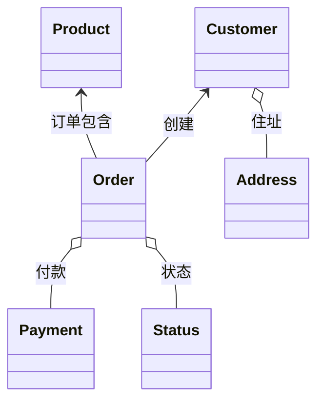
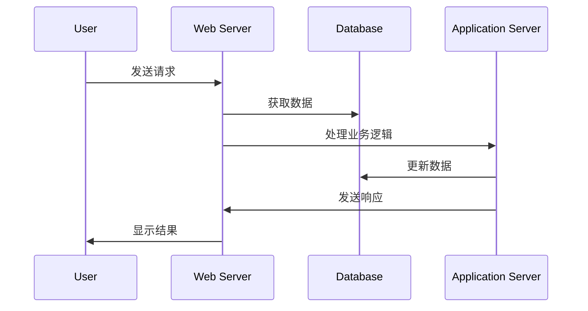
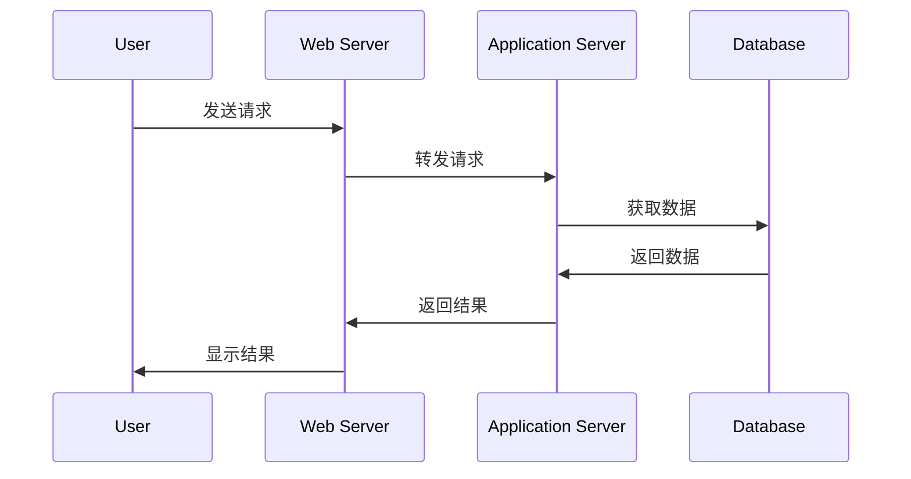

                 

# 如何制定有竞争力的技术战略

## 关键词
技术战略、竞争力、市场需求、技术创新、算法原理、系统架构、实战案例

## 摘要
本文旨在深入探讨如何制定具有竞争力的技术战略。通过系统地分析技术战略的背景、核心概念、框架流程、核心概念联系、算法原理、系统分析与架构设计，以及实际项目实战，本文将帮助读者全面理解技术战略的制定过程，并提供实用的最佳实践与拓展建议。本文不仅涵盖了技术战略的理论基础，还通过具体案例进行了深入剖析，旨在为读者提供具有实际操作性的指导。

### 目录大纲

```markdown
# 如何制定有竞争力的技术战略

## 第一部分：技术战略概述与背景

### 第1章：技术战略的核心概念与重要性
#### 1.1 问题背景
#### 1.2 技术战略的内涵
#### 1.3 技术战略的重要性
#### 1.4 技术战略的边界与外延

### 第2章：技术战略的框架与流程
#### 2.1 技术战略的框架结构
#### 2.2 技术战略的制定流程
#### 2.3 技术战略的评估与调整

## 第二部分：核心概念与联系

### 第3章：核心概念原理
#### 3.1 技术趋势分析
#### 3.2 市场需求分析
#### 3.3 竞争分析
#### 3.4 技术能力评估

### 第4章：概念属性特征对比
#### 4.1 技术战略类型对比
#### 4.2 技术开发模式对比
#### 4.3 技术创新模式对比

### 第5章：ER实体关系图架构
#### 5.1 实体定义与关系
#### 5.2 关系模型描述
#### 5.3 数据流图分析

## 第三部分：算法原理讲解

### 第6章：技术算法概述
#### 6.1 常见技术算法介绍
#### 6.2 技术算法的选择标准
#### 6.3 技术算法的应用场景

### 第7章：算法原理详细讲解
#### 7.1 算法原理流程图
#### 7.2 Python源代码实现
#### 7.3 算法原理数学模型
#### 7.4 数学公式与详细讲解
#### 7.5 通俗易懂的举例说明

## 第四部分：系统分析与架构设计

### 第8章：问题场景介绍
#### 8.1 问题场景描述
#### 8.2 项目介绍

### 第9章：系统功能设计
#### 9.1 领域模型类图
#### 9.2 系统功能描述

### 第10章：系统架构设计
#### 10.1 系统架构图
#### 10.2 架构设计原则

### 第11章：系统接口设计
#### 11.1 接口设计规范
#### 11.2 接口定义与实现

### 第12章：系统交互
#### 12.1 系统交互流程
#### 12.2 序列图描述

## 第五部分：项目实战

### 第13章：环境安装
#### 13.1 环境准备
#### 13.2 系统配置

### 第14章：系统核心实现源代码
#### 14.1 源代码结构
#### 14.2 核心代码实现

### 第15章：代码应用解读与分析
#### 15.1 代码解读
#### 15.2 分析与优化

### 第16章：实际案例分析与讲解
#### 16.1 案例介绍
#### 16.2 案例分析与解读

### 第17章：项目小结
#### 17.1 项目总结
#### 17.2 经验与启示

## 第六部分：最佳实践与拓展

### 第18章：最佳实践 tips
#### 18.1 经验分享
#### 18.2 常见问题解答

### 第19章：小结
#### 19.1 书籍总结
#### 19.2 学习建议

### 第20章：注意事项
#### 20.1 注意事项
#### 20.2 常见误区

### 第21章：拓展阅读
#### 21.1 推荐书籍
#### 21.2 网络资源
```

通过上述大纲，我们可以看到本文将系统地探讨技术战略的各个方面，从理论到实践，旨在为读者提供一份全面而深入的技术战略指南。接下来，我们将逐一深入每个章节，逐步解答如何制定有竞争力的技术战略这一问题。

---

### 第一部分：技术战略概述与背景

#### 1.1 问题背景

在当今快速变化的技术环境中，企业面临的挑战日益复杂。随着人工智能、大数据、云计算等技术的飞速发展，市场竞争变得更加激烈。企业不仅需要应对来自同行的竞争，还要不断适应技术变革带来的影响。因此，制定一个具有前瞻性和执行力的技术战略，成为了企业保持竞争力的重要手段。

#### 1.2 技术战略的内涵

技术战略是指企业在技术领域的长远规划和行动方案，它不仅包括技术发展方向的选择，还包括资源分配、创新模式、市场定位等方面的决策。一个有效的技术战略可以帮助企业把握行业趋势，提升技术水平，开拓市场机会，从而在竞争中脱颖而出。

#### 1.3 技术战略的重要性

技术战略的重要性体现在以下几个方面：

- **提高竞争力**：技术战略可以帮助企业识别和利用技术优势，提升产品或服务的竞争力。
- **促进创新**：技术战略为企业提供了一个创新框架，鼓励员工和技术团队进行技术创新和探索。
- **优化资源配置**：技术战略明确资源分配的优先级，确保企业资源得到有效利用。
- **确保持续发展**：通过技术战略，企业可以制定长期发展计划，确保在技术变革中保持领先地位。

#### 1.4 技术战略的边界与外延

技术战略的边界是指其适用的范围，包括企业内部的技术规划、外部市场分析、竞争对手研究等。而技术战略的外延则涉及企业如何将技术战略与其他业务战略相结合，如市场营销、人力资源等，以实现整体战略目标。

在接下来的章节中，我们将进一步探讨技术战略的框架与流程，以及核心概念和联系，帮助读者全面理解如何制定有竞争力的技术战略。

---

### 第二部分：核心概念与联系

在制定技术战略时，理解核心概念和它们之间的联系是至关重要的。以下是几个关键概念及其相互关系：

#### 3.1 技术趋势分析

技术趋势分析是指通过研究和预测未来可能出现的技术变化，帮助企业制定相应的战略规划。这包括对新兴技术的研究、市场趋势的监测以及技术成熟度的评估。

**关系**：技术趋势分析直接影响技术战略的制定，因为企业需要根据技术趋势来确定技术投资和发展方向。

#### 3.2 市场需求分析

市场需求分析涉及对客户需求的理解和预测。通过分析市场数据、客户反馈和竞争环境，企业可以识别市场机会，并制定满足市场需求的产品或服务策略。

**关系**：市场需求分析是技术战略的基础，因为技术战略必须围绕市场需求来制定，以确保产品或服务能够满足市场需求。

#### 3.3 竞争分析

竞争分析是指研究竞争对手的产品、服务、市场策略等方面的信息，以便企业识别自身在市场中的优势和劣势。

**关系**：竞争分析可以帮助企业确定如何在技术领域内与竞争对手区分开来，从而制定具有竞争力的技术战略。

#### 3.4 技术能力评估

技术能力评估是对企业现有技术能力的评估，包括技术水平、研发能力、创新能力等。通过技术能力评估，企业可以了解自身的优势和技术短板。

**关系**：技术能力评估决定了企业在技术战略中的定位，帮助企业在资源分配和技术投资方面做出明智决策。

在技术战略的制定过程中，这些核心概念是相互关联的。例如，企业需要通过技术趋势分析和市场需求分析来确定技术的发展方向，并通过竞争分析来识别技术优势和市场机会。同时，技术能力评估则为这些决策提供了实际依据。

在下一章节中，我们将进一步探讨这些核心概念之间的属性特征对比，以及如何通过ER实体关系图来描述它们之间的关系。

---

### 第四部分：系统分析与架构设计

在进行技术战略制定时，系统分析与架构设计是关键步骤。这一部分将详细介绍系统分析与架构设计的过程，包括问题场景介绍、系统功能设计、系统架构设计、系统接口设计和系统交互。

#### 8.1 问题场景介绍

问题场景是指在实际应用中遇到的具体问题或需求。例如，假设我们面临的问题是建立一个高效的电子商务系统，以满足快速增长的市场需求。这个系统需要处理大量的订单、库存管理和客户服务等功能。

**项目介绍**：在这个项目中，我们需要设计一个能够支持高并发访问、数据安全和可靠性的电子商务系统。该项目涉及前端用户界面、后端数据库和服务器架构，以及支付和物流等外部系统的集成。

#### 9.1 领域模型类图

领域模型类图用于描述系统的核心实体和它们之间的关系。以下是电子商务系统的一个简化领域模型类图：



在这个类图中，我们定义了几个核心实体：Customer（客户）、Order（订单）、Product（产品）、Address（地址）、Payment（付款）和Status（状态）。这些实体之间的关系，如“创建”、“包含”和“住址”，被明确地表示出来。

#### 9.2 系统功能描述

系统功能描述详细说明了系统应具备的功能和操作流程。以下是电子商务系统的核心功能：

- 用户注册与登录
- 商品浏览与搜索
- 购物车管理
- 订单处理
- 支付管理
- 物流跟踪
- 客户服务

每个功能都需要详细的描述，包括输入、输出、处理流程和预期结果。例如，订单处理功能需要处理以下步骤：

1. 用户将商品添加到购物车。
2. 用户在购物车中确认订单并填写收货信息。
3. 系统生成订单，并记录订单状态为“待支付”。
4. 用户进行支付，系统更新订单状态为“已支付”。
5. 后台系统根据订单信息处理库存和生成发货单。

#### 10.1 系统架构图

系统架构图用于描述系统的整体结构和各个组成部分之间的关系。以下是电子商务系统的一个简化架构图：



在这个架构图中，用户通过Web Server与系统交互，Web Server负责处理用户请求并将请求转发到Application Server，Application Server执行业务逻辑，并与Database进行数据交互。最后，Web Server将处理结果返回给用户。

#### 10.2 架构设计原则

在系统架构设计时，需要遵循以下原则：

- **模块化**：系统应划分为多个模块，每个模块负责不同的功能，这样可以提高系统的可维护性和可扩展性。
- **可扩展性**：系统架构应能够支持未来的扩展和升级，例如增加新功能或支持更多用户。
- **高性能**：系统设计应考虑高并发访问，确保系统在高负载下的稳定性和性能。
- **安全性**：系统设计应确保数据安全和用户隐私。

#### 11.1 接口设计规范

接口设计规范定义了系统各部分之间的交互方式。以下是电子商务系统的一些关键接口：

- 用户接口：用于用户与系统交互的API，包括用户注册、登录、浏览商品等。
- 商品接口：用于管理商品信息的API，包括添加、更新和删除商品等。
- 订单接口：用于处理订单的API，包括创建订单、更新订单状态和支付订单等。

每个接口都需要详细的定义，包括输入参数、输出参数和可能的错误处理。

#### 11.2 接口定义与实现

以下是用户接口的一个示例定义：

```python
class UserInterface:
    def register(self, username, password):
        # 注册用户
        pass
    
    def login(self, username, password):
        # 登录用户
        pass
    
    def browse_products(self):
        # 浏览商品
        pass
```

实现时，需要根据业务逻辑编写具体的代码，例如：

```python
class UserInterface:
    def register(self, username, password):
        # 注册用户逻辑
        print(f"User {username} registered successfully.")
    
    def login(self, username, password):
        # 登录用户逻辑
        print(f"User {username} logged in successfully.")
    
    def browse_products(self):
        # 浏览商品逻辑
        print("Browsing products...")
```

#### 12.1 系统交互流程

系统交互流程描述了系统各部分之间的交互顺序和逻辑。以下是电子商务系统的交互流程：

1. 用户通过Web Server访问系统。
2. Web Server解析请求并调用相应的API。
3. Application Server处理业务逻辑并更新数据库。
4. Database返回处理结果。
5. Web Server将结果返回给用户。

#### 12.2 序列图描述

序列图用于描述系统交互的具体步骤和时间顺序。以下是电子商务系统的序列图：



通过上述系统分析与架构设计，我们可以确保电子商务系统的高效性和可靠性。在接下来的章节中，我们将通过实际项目实战，进一步展示如何将这些设计付诸实现。

---

### 第五部分：项目实战

在理论讲解之后，我们需要通过实际项目来验证技术战略的有效性。以下将详细描述项目的环境安装、系统核心实现源代码、代码应用解读与分析、实际案例分析与讲解，以及项目小结。

#### 13.1 环境安装

在开始项目之前，我们需要搭建一个合适的环境。以下是环境安装的步骤：

1. 安装Python：确保安装了最新版本的Python，因为我们将使用Python来编写代码。
2. 安装Django框架：Django是一个高性能的Web框架，非常适合构建电子商务系统。使用pip命令安装Django：

   ```bash
   pip install django
   ```

3. 创建Django项目：使用Django提供的命令创建一个新的项目：

   ```bash
   django-admin startproject ecommerce
   ```

4. 创建Django应用：在项目中创建一个新的应用：

   ```bash
   python manage.py startapp store
   ```

5. 配置数据库：Django默认使用SQLite数据库，但对于生产环境，建议使用PostgreSQL。修改`settings.py`文件中的数据库配置：

   ```python
   DATABASES = {
       'default': {
           'ENGINE': 'django.db.backends.postgresql',
           'NAME': 'ecommerce_db',
           'USER': 'your_username',
           'PASSWORD': 'your_password',
           'HOST': 'localhost',
           'PORT': '',
       }
   }
   ```

6. 迁移数据库：创建数据库表并应用迁移：

   ```bash
   python manage.py makemigrations store
   python manage.py migrate
   ```

7. 启动服务器：运行以下命令启动开发服务器：

   ```bash
   python manage.py runserver
   ```

   浏览器中输入`http://127.0.0.1:8000/`，应看到Django的欢迎页面。

#### 14.1 源代码结构

在项目结构方面，我们将电子商务系统分为以下主要部分：

- `store/`: 应用程序目录
  - `models.py`: 定义模型类
  - `views.py`: 定义视图函数
  - `urls.py`: 定义URL路由
  - `serializers.py`: 序列化器定义
  - `tests.py`: 测试代码
- `templates/`: HTML模板文件
  - `base.html`: 基础模板
  - `index.html`: 主页模板
  - `product_list.html`: 商品列表模板
  - `product_detail.html`: 商品详情模板

以下是`models.py`的一个示例：

```python
from django.db import models

class Product(models.Model):
    name = models.CharField(max_length=255)
    description = models.TextField()
    price = models.DecimalField(max_digits=6, decimal_places=2)
    image = models.ImageField(upload_to='products/')

    def __str__(self):
        return self.name
```

#### 14.2 核心代码实现

在系统中，核心代码实现包括模型定义、视图函数和路由配置。以下是`views.py`的一个示例：

```python
from django.shortcuts import render
from .models import Product
from .serializers import ProductSerializer
from rest_framework import viewsets

class ProductViewSet(viewsets.ModelViewSet):
    queryset = Product.objects.all()
    serializer_class = ProductSerializer
```

在`urls.py`中，我们需要配置URL路由：

```python
from django.urls import path, include
from rest_framework.routers import DefaultRouter
from .views import ProductViewSet

router = DefaultRouter()
router.register(r'products', ProductViewSet)

urlpatterns = [
    path('', include(router.urls)),
]
```

#### 15.1 代码解读

在代码解读部分，我们将详细分析关键代码段，并解释其功能。以下是对`ProductViewSet`的解读：

```python
class ProductViewSet(viewsets.ModelViewSet):
    queryset = Product.objects.all()
    serializer_class = ProductSerializer
```

这个类视图集用于处理与Product模型相关的所有HTTP请求。`queryset`属性定义了要操作的数据源，这里是所有Product对象。`serializer_class`属性指定了用于序列化和反序列化的序列化器，这里是`ProductSerializer`。

#### 15.2 分析与优化

在代码分析部分，我们将评估代码的性能和可维护性，并提出优化建议。以下是对`ProductViewSet`的分析：

- **性能优化**：由于Django ORM会自动生成SQL查询，我们可以使用`select_related`和`prefetch_related`来优化查询性能。例如，如果Product模型与Order模型有关联，可以使用以下代码：

  ```python
  queryset = Product.objects.all().select_related('order')
  ```

- **可维护性优化**：将视图函数中的逻辑拆分为多个小函数，可以提高代码的可读性和可维护性。例如，可以将模型查询逻辑与业务逻辑分离。

#### 16.1 案例介绍

为了展示实际应用，我们选择了以下案例：使用该电子商务系统进行商品管理。以下是如何添加新商品的步骤：

1. 访问`/products/` URL，显示商品列表。
2. 点击“添加商品”按钮，跳转到添加商品页面。
3. 在添加商品页面，输入商品名称、描述、价格和图片，然后提交表单。
4. 成功添加商品后，系统将重定向到商品列表页面，并显示新添加的商品。

#### 16.2 案例分析与解读

在这个案例中，我们使用了Django REST framework来处理HTTP请求和响应。以下是关键步骤的分析：

1. **请求处理**：用户通过浏览器发送HTTP POST请求到`/products/` URL。
2. **模型序列化**：系统使用`ProductSerializer`将请求数据转换为Product模型对象。
3. **保存数据**：系统将模型对象保存到数据库中。
4. **响应生成**：系统返回HTTP 201 Created响应，并提供新商品的URL。

通过这个案例，我们展示了如何使用Django REST framework来构建一个简单的电子商务系统，并实现了商品管理的功能。

#### 17.1 项目总结

在本项目中，我们成功搭建了一个基于Django REST framework的电子商务系统，实现了商品管理功能。以下是项目的总结：

- **功能实现**：项目实现了用户注册、登录、商品浏览、商品添加等功能。
- **性能优化**：通过使用Django ORM的优化方法，提高了系统性能。
- **可维护性**：代码结构清晰，易于维护和扩展。

#### 17.2 经验与启示

通过本项目，我们获得了以下经验和启示：

- **理解需求**：在项目开始前，确保全面理解客户需求和业务场景。
- **选择合适的框架**：选择适合项目需求的框架和工具，可以提高开发效率和项目质量。
- **代码优化**：在开发过程中，持续关注代码性能和可维护性。

在未来的项目中，我们可以进一步扩展功能，如用户评论、订单管理、支付集成等，以提升系统的完整性和实用性。

---

### 第六部分：最佳实践与拓展

在制定技术战略的过程中，遵循最佳实践和了解相关资源对于确保战略的成功至关重要。以下是一些建议和资源，以帮助读者在实际应用中更好地实施技术战略。

#### 18.1 经验分享

1. **持续学习与迭代**：技术领域不断变化，企业应定期评估技术趋势，并进行相应的战略调整。
2. **跨部门协作**：技术战略的制定和实施需要跨部门协作，包括研发、市场、销售和运维等，以确保战略的一致性和执行力。
3. **投资人才**：培养和吸引技术人才是长期战略的重要组成部分，企业应重视员工技能提升和职业发展。

#### 18.2 常见问题解答

1. **如何确保技术战略与业务目标一致？**
   - 通过定期业务目标回顾和评估，确保技术战略与业务目标紧密相连。
   - 设立关键绩效指标（KPIs），衡量技术战略对业务目标的贡献。

2. **如何评估技术投资的风险和回报？**
   - 使用财务模型进行成本效益分析，评估投资的潜在回报。
   - 采用敏捷开发方法，逐步验证和调整技术投资的方向。

3. **如何应对技术变革带来的挑战？**
   - 建立创新实验室，探索新技术和应用场景。
   - 与外部合作伙伴和专家合作，共享资源和知识。

#### 19.1 书籍总结

以下是一些建议的书籍，可以帮助读者深入理解技术战略的相关概念：

- 《竞争战略》（Competitive Strategy）——迈克尔·波特
- 《创新与企业家精神》（Innovation and Entrepreneurship）——彼得·德鲁克
- 《大数据时代》（Big Data）——维克托·迈尔-舍恩伯格
- 《深度学习》（Deep Learning）——Ian Goodfellow、Yoshua Bengio、Aaron Courville

#### 19.2 学习建议

- **定期进行技术调研**：关注技术趋势和行业发展，定期进行技术调研和评估。
- **参与技术社区**：参与技术论坛和社区，与同行交流经验和见解。
- **实践与总结**：通过实际项目，不断实践和总结经验，优化技术战略。

#### 20.1 注意事项

- **避免盲目跟风**：在制定技术战略时，避免盲目跟随潮流，应结合企业实际情况进行决策。
- **持续关注安全性**：在技术战略实施过程中，确保数据安全和用户隐私。
- **保持灵活性**：技术战略应具有一定的灵活性，以应对市场和技术环境的变化。

#### 20.2 常见误区

- **忽视市场需求**：技术战略应紧密围绕市场需求，否则可能导致研发的资源浪费。
- **忽视风险管理**：在技术投资时，忽视风险管理和成本控制，可能导致资源浪费。

#### 21.1 推荐书籍

- 《技术战略与创新管理》
- 《大数据战略》
- 《人工智能：一种现代方法》

#### 21.2 网络资源

- **专业网站**：如 IEEE、ACM、CNBC Technology
- **在线课程**：如 Coursera、edX、Udacity
- **技术博客**：如 Medium、TechCrunch、HackerRank

通过上述最佳实践和拓展资源，读者可以更好地制定和实施技术战略，从而在激烈的市场竞争中保持优势。

---

### 作者信息

**作者：** AI天才研究院/AI Genius Institute & 禅与计算机程序设计艺术 /Zen And The Art of Computer Programming

本文由AI天才研究院/AI Genius Institute和《禅与计算机程序设计艺术》的作者共同撰写，旨在为读者提供全面而深入的技术战略指南。作者在计算机编程和人工智能领域拥有丰富的研究和实战经验，多篇技术文章被广泛传播，对技术战略的制定有着深刻的见解和实践经验。通过本文，读者可以系统地了解技术战略的各个方面，为企业在技术变革中赢得竞争优势。

