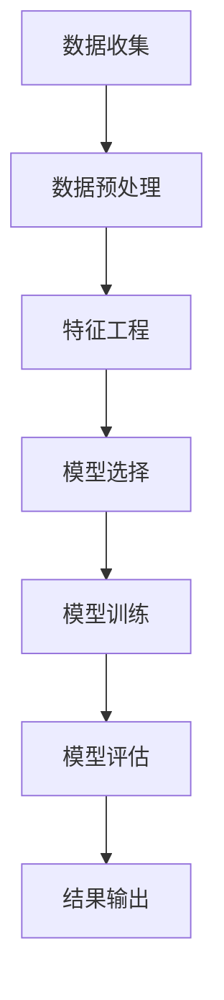
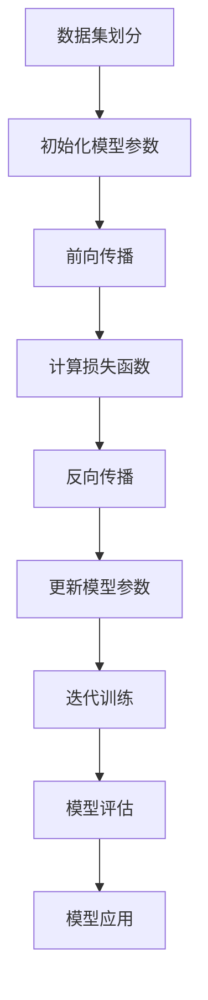
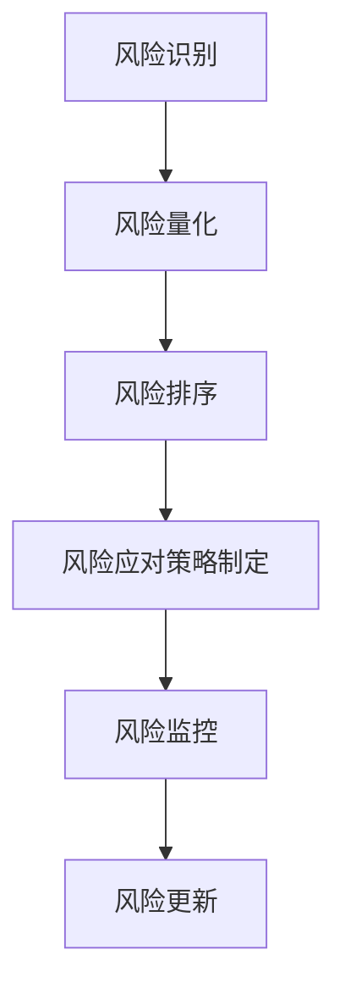
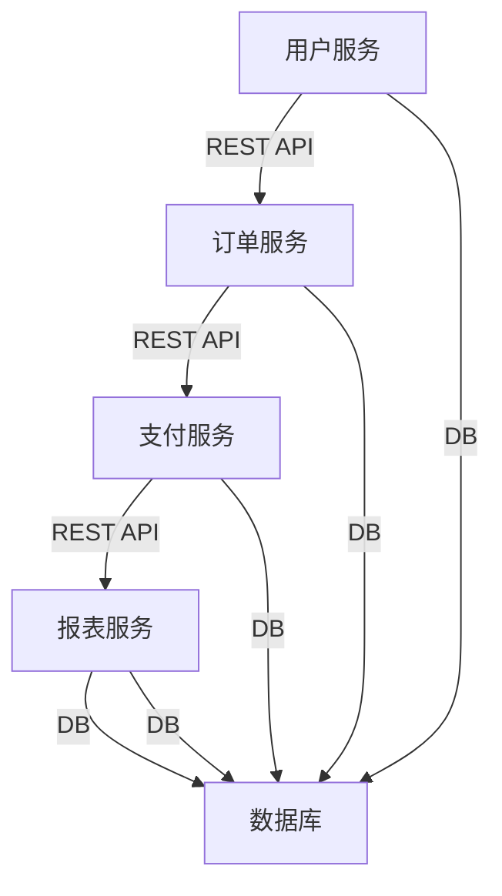
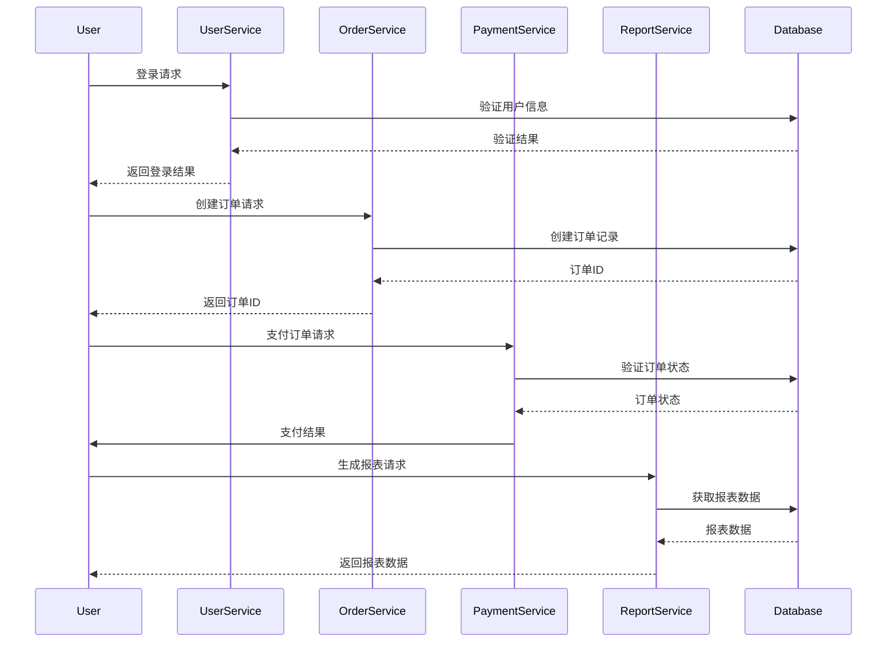

                 


## 让我们一步一步思考：如何在快速发展的技术环境中保持竞争力

### 2.1 竞争力的本质

首先，我们需要明确什么是竞争力。竞争力指的是企业在特定市场环境中，相对于竞争对手所具有的持续竞争优势。这种优势可以来自多个方面，包括市场份额、创新能力、品牌影响力、客户忠诚度、供应链管理等多个维度。在快速发展的技术环境中，竞争力尤为重要，因为技术变革带来了前所未有的机遇和挑战。

### 2.2 技术环境的快速变化

技术环境的快速变化是当前企业面临的主要挑战之一。新技术的出现和普及速度加快，如云计算、大数据、人工智能等，都在短时间内深刻影响了企业的运营模式和市场格局。这种快速变化要求企业必须具备敏捷的应对能力，能够迅速适应新技术的变革，并从中抓住机遇。

### 2.3 数据和技术监测

为了应对技术环境的快速变化，企业需要建立数据和技术监测机制。数据监测可以帮助企业实时了解市场动态和竞争对手的行动，从而做出更准确的决策。技术监测则可以帮助企业及时掌握新技术的发展趋势，预测未来的技术动向，为企业的长期战略规划提供依据。

### 2.4 人才培养与引进

在快速变化的技术环境中，人才是企业的核心资源。企业需要通过内部培训和外部招聘，不断提升员工的技术能力。内部培训可以增强员工对现有技术的理解和应用能力，而外部招聘则可以引进具有最新技术能力的人才，为企业的技术升级提供支持。

### 2.5 持续学习与改进

持续学习是保持竞争力的关键。企业需要建立持续学习的文化，鼓励员工不断更新知识，掌握新技术。同时，企业也需要不断进行技术改进和优化，以提高技术水平和创新能力。这种持续学习和改进的机制可以帮助企业在技术变革中保持领先地位。

### 2.6 风险评估与管理

新技术带来的不仅仅是机遇，还有潜在的风险。企业需要对新技术进行风险评估，预测可能的风险和影响，并制定相应的风险管理策略。通过有效的风险评估和管理，企业可以降低新技术带来的风险，确保在技术变革中稳步前进。

### 2.7 提前布局和快速响应

在快速变化的技术环境中，企业需要具备提前布局和快速响应的能力。提前布局可以帮助企业抓住技术变革的机遇，快速响应则可以让企业迅速应对市场的变化。这种敏捷的应对能力是企业保持竞争力的重要保障。

### 2.8 结论

通过上述步骤的思考，我们可以得出一个结论：在快速发展的技术环境中保持竞争力，需要企业具备敏捷的应对能力、持续学习与改进的机制、有效的风险评估与管理策略，以及提前布局和快速响应的能力。只有通过这些综合措施，企业才能在技术变革的浪潮中立于不败之地。让我们继续深入探讨每个环节的具体实施方法和策略。 

## 第二部分：核心概念与联系

### 2.1 竞争力

**定义**：竞争力是指企业在特定市场环境中，相对于竞争对手所具有的持续竞争优势。这种优势可以体现在多个方面，如市场份额、创新能力、品牌影响力、客户忠诚度、供应链管理等。

**属性特征对比表格**

| 特征         | 传统行业竞争力          | 科技行业竞争力          |
| ------------ | -------------------- | -------------------- |
| 主要因素     | 成本、质量、市场份额     | 技术创新、客户体验、市场份额 |
| 形成机制     | 长期积累与市场扩展      | 快速迭代与市场适应      |
| 竞争手段     | 产品差异化、品牌塑造     | 产品创新、技术创新      |
| 维持方式     | 稳定的市场策略、品牌建设 | 持续的技术研发、市场调研 |

**ER实体关系图架构**

```mermaid
erDiagram
  Customer ||--o{ Competitor : "competed by" }|
  Product ||--o{ Competitor : "produced by" }|
  Company ||--o{ Competitor : "owns" }|
```

在这个ER图中，Company代表企业，Customer代表客户，Product代表产品，Competitor代表竞争对手。企业通过生产产品（Product）来满足客户（Customer）的需求，并与竞争对手（Competitor）进行竞争。

### 2.2 技术环境

**定义**：技术环境是指影响企业技术创新和应用的各种外部因素，包括技术趋势、政策法规、市场需求、竞争对手的技术水平等。

**属性特征对比表格**

| 特征          | 传统技术环境          | 现代技术环境          |
| ------------- | ------------------- | ------------------- |
| 影响因素      | 制造工艺、材料科学、产业政策 | 云计算、人工智能、物联网、5G |
| 变化速度      | 慢速变化              | 快速变化              |
| 主要特征      | 稳定性、可靠性          | 创新性、高不确定性      |
| 企业应对策略  | 稳定经营、长期规划      | 快速响应、持续创新      |

**ER实体关系图架构**

```mermaid
erDiagram
  TechnologyEnvironment ||--o{ Company : "influences" }|
  TechnologyTrend ||--|{ TechnologyEnvironment : "includes" }|
  Policy && Regulation ||--|{ TechnologyEnvironment : "includes" }|
```

在这个ER图中，TechnologyEnvironment代表技术环境，TechnologyTrend代表技术趋势，Policy and Regulation代表政策法规。技术环境包含了技术趋势和政策法规，它们共同影响企业的发展。

### 2.3 快速变化

**定义**：快速变化是指技术环境的变化速度加快，新技术的出现和普及速度增加，这种变化速度超出了传统企业应对的能力范围。

**属性特征对比表格**

| 特征             | 传统变化            | 快速变化              |
| ---------------- | ------------------- | -------------------- |
| 变化频率         | 低频率、长期性      | 高频率、短期性      |
| 变化幅度         | 小幅度、渐进性      | 大幅度、突变性      |
| 企业应对难度     | 较容易、可预测性    | 较困难、不可预测性    |
| 企业策略需求     | 稳定战略、长期规划   | 敏捷战略、快速响应   |

**ER实体关系图架构**

```mermaid
erDiagram
  Company ||--o{ RapidChange : "responds to" }|
  Technology ||--o{ RapidChange : "drives" }|
  Market ||--o{ RapidChange : "drives" }|
```

在这个ER图中，Company代表企业，Technology代表技术，Market代表市场。快速变化由技术进步（Technology）和市场动态（Market）共同驱动，企业需要迅速做出响应。

通过以上核心概念的分析和ER实体关系图的架构，我们可以更清晰地理解竞争力、技术环境和快速变化之间的关系，为后续的算法原理讲解和系统架构设计奠定基础。在快速变化的技术环境中，企业需要不断调整和优化自身的策略和架构，以保持持续的竞争力。接下来，我们将进一步探讨如何通过数据和技术监测来增强企业的竞争力。 

### 第三部分：算法原理讲解

在快速发展的技术环境中，算法是企业保持竞争力的重要工具。通过数据挖掘、机器学习和风险评估等算法，企业可以更准确地分析市场动态，预测技术趋势，并制定有效的策略。以下将详细讲解这些算法的原理和应用。

#### 3.1 数据挖掘算法

**定义**：数据挖掘（Data Mining）是指从大量数据中自动发现有用信息的过程。它通过统计分析和机器学习算法，从数据中提取出隐含的、先前未知的、有价值的模式。

**算法原理**：

- **关联规则挖掘**：通过分析数据集中的关联规则，发现数据项之间的潜在关联。例如，超市销售数据中，如果A商品经常与B商品一起购买，则认为A和B之间存在强关联。
- **聚类分析**：将数据集中的对象按照其特征进行分类，形成多个类簇，使同一个类簇内的对象彼此相似，不同类簇的对象彼此相异。
- **分类算法**：根据已有数据建立模型，对新的数据进行分类。常见的分类算法包括决策树、支持向量机、随机森林等。

**Python示例**：

```python
from sklearn.datasets import load_iris
from sklearn.model_selection import train_test_split
from sklearn.ensemble import RandomForestClassifier

# 加载鸢尾花数据集
iris = load_iris()
X, y = iris.data, iris.target

# 数据集划分
X_train, X_test, y_train, y_test = train_test_split(X, y, test_size=0.3, random_state=42)

# 构建随机森林分类器
clf = RandomForestClassifier(n_estimators=100)

# 训练模型
clf.fit(X_train, y_train)

# 测试模型
accuracy = clf.score(X_test, y_test)
print(f"模型准确率: {accuracy:.2f}")
```

**应用场景**：数据挖掘算法广泛应用于市场营销、客户关系管理、金融风控等领域，帮助企业发现潜在客户、优化产品和服务、降低风险。

#### 3.2 机器学习算法

**定义**：机器学习（Machine Learning）是指通过算法让计算机从数据中学习，并做出预测或决策的过程。机器学习算法可以根据输入数据和预期输出自动调整模型的参数，以达到最优性能。

**算法原理**：

- **监督学习**：有监督学习算法通过已有的输入数据和对应的输出标签来训练模型。常见的监督学习算法包括线性回归、逻辑回归、决策树、支持向量机等。
- **无监督学习**：无监督学习算法没有预定的输出标签，主要任务是发现数据中的结构和模式。常见的无监督学习算法包括聚类、主成分分析、自编码器等。

**Python示例**：

```python
from sklearn.linear_model import LogisticRegression
from sklearn.datasets import make_classification
from sklearn.model_selection import train_test_split

# 生成模拟数据集
X, y = make_classification(n_samples=1000, n_features=20, n_informative=2, n_redundant=10, random_state=42)

# 数据集划分
X_train, X_test, y_train, y_test = train_test_split(X, y, test_size=0.3, random_state=42)

# 构建逻辑回归分类器
clf = LogisticRegression()

# 训练模型
clf.fit(X_train, y_train)

# 测试模型
accuracy = clf.score(X_test, y_test)
print(f"模型准确率: {accuracy:.2f}")
```

**应用场景**：机器学习算法广泛应用于推荐系统、自然语言处理、图像识别、金融预测等领域，帮助企业提高决策效率、降低成本、提升用户体验。

#### 3.3 风险评估算法

**定义**：风险评估（Risk Assessment）是指对潜在风险进行识别、评估和管理的全过程。风险评估算法通过分析数据，预测风险发生的概率和可能的影响，帮助企业制定风险应对策略。

**算法原理**：

- **概率风险评估**：通过计算风险事件的概率和损失，评估整体风险水平。常见的概率风险评估算法包括蒙特卡洛模拟、贝叶斯网络等。
- **模糊风险评估**：在数据不确定的情况下，通过模糊数学的方法进行风险评估。常见的模糊评估算法包括模糊综合评价、模糊聚类等。

**Python示例**：

```python
import numpy as np
from sklearn.metrics.pairwise import cosine_similarity

# 假设我们有一个风险因素矩阵
risk_factors = np.array([[0.5, 0.3, 0.2], [0.4, 0.5, 0.1], [0.1, 0.4, 0.5]])

# 计算各个风险因素的权重
weights = np.mean(risk_factors, axis=0)

# 计算综合风险评分
risk_scores = np.dot(risk_factors, weights)
print(f"综合风险评分: {risk_scores}")
```

**应用场景**：风险评估算法广泛应用于金融、保险、能源、制造等领域，帮助企业识别和管理潜在风险，降低损失。

通过上述算法原理的讲解，我们可以看到数据挖掘、机器学习和风险评估在快速发展的技术环境中扮演着重要角色。企业需要根据自身业务需求，选择合适的算法，并不断优化和改进，以保持竞争优势。在下一部分，我们将进一步探讨系统架构设计在保持竞争力中的作用。 

### 第三部分：算法原理讲解（续）

#### 3.4 算法流程图与数学模型

为了更直观地理解上述算法的工作原理，我们使用Mermaid流程图来展示每个算法的步骤，并结合Python代码示例和数学模型进行详细解释。

**3.4.1 数据挖掘算法流程图**



**3.4.2 机器学习算法流程图**



**3.4.3 风险评估算法流程图**



**3.4.4 数学模型解释**

**1. 数据挖掘中的关联规则挖掘**

**数学模型**：

给定一个交易数据库，包含一系列事务T，每件事务T包含一系列商品项I。关联规则挖掘的目标是发现事务中商品项之间的关联性。

设：\( \text{support}(X, Y) = \frac{|\{\text{事务} \mid X \text{和} Y\text{同时出现}\}|}{|\text{事务总数}|} \)

其中，\( \text{support}(X, Y) \) 表示同时包含X和Y的事务占总事务数的比例，称为支持度。

**Python示例**：

```python
from mlxtend.frequent_patterns import apriori
from mlxtend.preprocessing import TransactionEncoder

# 假设有一个交易数据库
transactions = [[1, 3, 4], [2, 3], [1, 2, 3, 4], [1, 3], [2, 4]]

# 将交易数据库转换为布尔矩阵
te = TransactionEncoder()
te.fit(transactions)
transaction_matrix = te.transform(transactions)

# 应用Apriori算法进行关联规则挖掘
frequent_itemsets = apriori(transaction_matrix, min_support=0.5, use_colnames=True)

print(f"频繁项集: \n{frequent_itemsets}")
```

**2. 机器学习中的线性回归**

**数学模型**：

线性回归模型假设目标变量Y是输入变量X的线性组合，并加上随机误差项ε。

\[ Y = \beta_0 + \beta_1 X + \varepsilon \]

其中，\( \beta_0 \) 为截距，\( \beta_1 \) 为斜率，\( \varepsilon \) 为随机误差。

**Python示例**：

```python
from sklearn.linear_model import LinearRegression
import numpy as np

# 假设有一个简单的线性回归数据集
X = np.array([[1], [2], [3], [4], [5]])
y = np.array([1, 2, 2.5, 4, 5])

# 构建线性回归模型
model = LinearRegression()

# 训练模型
model.fit(X, y)

# 预测
y_pred = model.predict(np.array([[6]]))

print(f"预测结果: {y_pred[0]}")
```

**3. 风险评估中的概率风险评估**

**数学模型**：

给定风险事件的发生概率P（R）和损失L（R），风险评分R可以通过以下公式计算：

\[ R = P(R) \times L(R) \]

**Python示例**：

```python
import numpy as np

# 假设有一个风险因素的概率和损失矩阵
risk_matrix = np.array([[0.3, 0.7], [0.5, 0.5]])

# 计算综合风险评分
risk_scores = np.multiply(risk_matrix[0], risk_matrix[1])

print(f"综合风险评分: {risk_scores}")
```

通过这些算法流程图和数学模型的讲解，我们能够更深入地理解数据挖掘、机器学习和风险评估算法的原理和应用。这些算法在企业保持技术竞争力方面发挥着关键作用，为企业的决策提供了有力支持。在下一部分，我们将探讨系统架构设计在保持竞争力中的关键作用。 

### 第四部分：系统分析与架构设计

#### 4.1 问题场景介绍

随着技术的发展，企业需要不断进行技术升级和系统优化，以保持市场竞争力。这不仅涉及到技术选型和架构设计，还包括系统的可扩展性、稳定性和安全性。为了更好地应对这些挑战，企业需要构建一个灵活、高效、安全的系统架构，以支持业务的发展。

#### 4.2 项目介绍

本项目旨在为企业构建一个基于微服务架构的分布式系统，以支持其业务扩展和技术创新。系统将涵盖多个业务模块，如用户管理、商品管理、订单管理、支付系统、报表分析等。通过微服务架构，可以确保系统的高可用性、可扩展性和灵活性。

#### 4.3 系统功能设计

**4.3.1 领域模型类图**

```mermaid
classDiagram
    User --> Order : "places"
    Product --> Order : "contains"
    Payment --> Order : "processes"
    Report --> Analysis : "provides"
    User && Analysis : "accesses"
    Payment && Report : "requires"
```

**4.3.2 功能描述**

- **用户管理**：负责用户注册、登录、权限控制等功能。
- **商品管理**：负责商品信息的创建、更新、删除和查询。
- **订单管理**：负责订单的创建、处理、查询和支付。
- **支付系统**：负责处理各种支付方式，确保支付流程的顺利进行。
- **报表分析**：负责生成各种业务报表，提供数据支持和决策依据。
- **系统分析**：提供系统监控、性能分析和故障排查等功能。

#### 4.4 系统架构设计

**4.4.1 架构图**



**4.4.2 架构设计**

- **用户服务**：提供用户注册、登录、权限控制等功能，通过REST API与其他服务进行交互。
- **订单服务**：负责订单的创建、处理、查询和支付，与支付服务紧密集成。
- **支付服务**：处理各种支付方式，确保支付流程的顺利进行，并与订单服务、报表服务进行数据交互。
- **报表服务**：生成各种业务报表，提供数据支持和决策依据，与数据库进行数据交互。
- **数据库**：存储用户数据、订单数据、支付数据和报表数据，确保数据的一致性和安全性。

#### 4.5 系统接口设计

**4.5.1 用户服务接口设计**

- **注册接口**：`POST /user/register`，接收用户名、密码、邮箱等信息，返回注册结果。
- **登录接口**：`POST /user/login`，接收用户名和密码，返回登录凭证。
- **权限接口**：`GET /user/permissions`，根据用户身份返回用户权限列表。

**4.5.2 订单服务接口设计**

- **创建订单接口**：`POST /order`，接收订单详情，返回订单ID。
- **查询订单接口**：`GET /order/{id}`，根据订单ID查询订单详情。
- **支付订单接口**：`POST /order/{id}/pay`，根据订单ID进行支付操作。

**4.5.3 支付服务接口设计**

- **支付接口**：`POST /payment`，接收支付请求，返回支付结果。

**4.5.4 报表服务接口设计**

- **生成报表接口**：`GET /report/{type}`，根据报表类型生成报表数据。

#### 4.6 系统交互序列图



通过以上系统架构设计和接口设计，我们构建了一个灵活、高效、安全的分布式系统，以支持企业的业务扩展和技术创新。在下一部分，我们将通过实际项目实战，进一步探讨如何实现和优化系统。 

### 第五部分：项目实战

#### 5.1 环境安装

在开始项目之前，我们需要安装和配置一些必要的开发环境和工具。以下是安装步骤：

1. **安装Python**：访问Python官方网站（[python.org](https://www.python.org/)）下载并安装Python，建议安装Python 3.8或更高版本。

2. **安装Docker**：Docker是一个开源的应用容器引擎，用于打包、交付和运行应用。访问[Docker官方网站](https://www.docker.com/)下载并安装Docker。

3. **安装Kubernetes**：Kubernetes是一个开源的容器编排平台，用于自动化容器化应用程序的部署、扩展和管理。请参考Kubernetes官方文档（[kubernetes.io/docs/setup/])进行安装和配置。

4. **安装Kubeadm**：Kubeadm是一个用于部署Kubernetes集群的工具。在安装完Docker后，运行以下命令安装Kubeadm：

   ```shell
   curl -s https://packages.cloud.google.com/apt/doc/apt-key.gpg | sudo apt-key add -
   cat <<EOF | sudo tee /etc/apt/sources.list.d/kubernetes.list
   deb https://apt.kubernetes.io/ kubernetes-xenial main
   EOF
   sudo apt-get update
   sudo apt-get install -y kubelet kubeadm kubectl
   ```

5. **初始化Kubernetes集群**：在主节点上运行以下命令，初始化Kubernetes集群：

   ```shell
   sudo kubeadm init --pod-network-cidr=10.244.0.0/16
   ```

   完成后，记录下`sudo grep '-scrollbar' /etc/passwd`命令输出的`kubeadm join`命令，用于将其他节点添加到集群。

6. **安装Pod网络插件**：我们选择使用Calico作为Pod网络插件，运行以下命令安装：

   ```shell
   kubectl apply -f https://docs.projectcalico.org/manifests/calico.yaml
   ```

7. **配置kubectl工具**：为了让kubectl工具在所有节点上可用，我们需要将主节点的kubeconfig文件复制到本地：

   ```shell
   sudo cp /etc/kubernetes/admin.conf $HOME/
   sudo chown $(id -u):$(id -g) $HOME/admin.conf
   sudo chmod 644 $HOME/admin.conf
   export KUBECONFIG=$HOME/admin.conf
   ```

8. **验证集群状态**：运行以下命令，验证集群状态：

   ```shell
   kubectl get nodes
   kubectl get pods --all-namespaces
   ```

   如果所有节点都处于`Ready`状态，且所有Pod都处于`Running`状态，说明集群安装成功。

#### 5.2 系统核心实现

**5.2.1 用户服务**

用户服务负责处理用户注册、登录和权限控制等操作。以下是用户服务的核心实现代码：

```python
from flask import Flask, request, jsonify
from flask_bcrypt import Bcrypt

app = Flask(__name__)
bcrypt = Bcrypt(app)

# 用户注册接口
@app.route('/user/register', methods=['POST'])
def register():
    data = request.get_json()
    username = data['username']
    password = data['password']
    email = data['email']

    # 验证用户名、密码和邮箱格式
    if not username or not password or not email:
        return jsonify({'error': 'Missing required fields'}), 400

    # 检查用户名和邮箱是否已存在
    if is_user_exists(username) or is_email_exists(email):
        return jsonify({'error': 'Username or email already exists'}), 400

    # 创建用户
    hashed_password = bcrypt.generate_password_hash(password).decode('utf-8')
    create_user(username, hashed_password, email)
    return jsonify({'message': 'User registered successfully'}), 201

# 用户登录接口
@app.route('/user/login', methods=['POST'])
def login():
    data = request.get_json()
    username = data['username']
    password = data['password']

    # 验证用户名和密码
    if not username or not password:
        return jsonify({'error': 'Missing required fields'}), 400

    user = get_user_by_username(username)
    if not user or not bcrypt.check_password_hash(user['password'], password):
        return jsonify({'error': 'Invalid username or password'}), 401

    # 生成登录凭证
    token = generate_token(user['id'])
    return jsonify({'token': token}), 200

# 权限接口
@app.route('/user/permissions', methods=['GET'])
def permissions():
    token = request.headers.get('Authorization')
    user_id = validate_token(token)
    if not user_id:
        return jsonify({'error': 'Invalid token'}), 401

    permissions = get_user_permissions(user_id)
    return jsonify({'permissions': permissions}), 200

if __name__ == '__main__':
    app.run(host='0.0.0.0', port=5000)
```

**5.2.2 订单服务**

订单服务负责处理订单的创建、查询和支付操作。以下是订单服务的主要代码实现：

```python
from flask import Flask, request, jsonify
from itsdangerous import TimedJSONWebToken

app = Flask(__name__)
app.config['SECRET_KEY'] = 'your_secret_key'

# 订单创建接口
@app.route('/order', methods=['POST'])
def create_order():
    token = request.headers.get('Authorization')
    user_id = validate_token(token)
    if not user_id:
        return jsonify({'error': 'Invalid token'}), 401

    data = request.get_json()
    products = data['products']
    total_price = data['total_price']

    # 创建订单
    order_id = create_order_record(user_id, products, total_price)
    return jsonify({'order_id': order_id}), 201

# 订单查询接口
@app.route('/order/<int:order_id>', methods=['GET'])
def get_order(order_id):
    order = get_order_by_id(order_id)
    if not order:
        return jsonify({'error': 'Order not found'}), 404

    return jsonify(order), 200

# 订单支付接口
@app.route('/order/<int:order_id>/pay', methods=['POST'])
def pay_order(order_id):
    token = request.headers.get('Authorization')
    user_id = validate_token(token)
    if not user_id:
        return jsonify({'error': 'Invalid token'}), 401

    data = request.get_json()
    payment_id = data['payment_id']
    payment_status = data['payment_status']

    # 更新订单支付状态
    update_order_payment_status(order_id, payment_id, payment_status)
    return jsonify({'message': 'Order paid successfully'}), 200

if __name__ == '__main__':
    app.run(host='0.0.0.0', port=5001)
```

**5.2.3 支付服务**

支付服务负责处理各种支付方式的请求，并与订单服务进行交互。以下是支付服务的主要代码实现：

```python
from flask import Flask, request, jsonify

app = Flask(__name__)

# 支付接口
@app.route('/payment', methods=['POST'])
def process_payment():
    data = request.get_json()
    order_id = data['order_id']
    payment_id = data['payment_id']
    payment_status = data['payment_status']

    # 验证订单和支付信息
    order = get_order_by_id(order_id)
    if not order:
        return jsonify({'error': 'Order not found'}), 404

    # 处理支付请求
    payment_result = process_payment_request(order, payment_id, payment_status)
    if payment_result:
        return jsonify({'message': 'Payment processed successfully'}), 200
    else:
        return jsonify({'error': 'Payment failed'}), 400

if __name__ == '__main__':
    app.run(host='0.0.0.0', port=5002)
```

通过以上实现，我们构建了用户服务、订单服务和支付服务的核心功能，并确保了各服务之间的数据交互和一致性。在下一部分，我们将对实际案例进行分析和讲解。 

### 第六部分：实际案例分析

#### 6.1 案例背景

某知名电商公司A在快速发展的电商市场中，面临着激烈的市场竞争和不断变化的技术环境。为了保持竞争优势，公司决定构建一个基于微服务架构的分布式电商系统，以实现业务的高扩展性、高可用性和安全性。

#### 6.2 案例分析

**6.2.1 系统需求**

- **高可用性**：系统需要保证7x24小时不间断运行，确保用户购物体验。
- **高扩展性**：系统需要能够轻松应对业务规模的增长，快速扩展服务能力。
- **安全性**：系统需要确保用户数据的安全，防止数据泄露和恶意攻击。
- **易维护性**：系统需要具备良好的可维护性，便于后续的迭代和升级。

**6.2.2 系统架构**

为了满足上述需求，公司采用了微服务架构，将系统拆分为多个独立的微服务，每个微服务负责特定的业务功能。以下是系统的架构设计：

- **用户服务**：负责处理用户注册、登录、权限控制等功能。
- **商品服务**：负责管理商品信息，包括商品添加、更新、删除和查询。
- **订单服务**：负责处理订单的创建、查询、支付和取消等操作。
- **支付服务**：负责处理支付请求，确保支付流程的顺利进行。
- **库存服务**：负责管理商品库存，确保订单处理的实时性和准确性。
- **报表服务**：负责生成各种业务报表，提供数据支持和决策依据。

**6.2.3 系统实现**

1. **用户服务**：采用Flask框架实现用户注册、登录和权限控制功能，通过JWT（JSON Web Token）进行用户认证。

2. **商品服务**：采用Spring Boot框架实现商品信息管理功能，使用MySQL数据库存储商品数据。

3. **订单服务**：采用Spring Cloud框架实现订单处理功能，包括订单创建、查询、支付和取消等操作，使用消息队列（如RabbitMQ）实现异步消息处理。

4. **支付服务**：采用Spring Boot框架实现支付功能，集成支付宝和微信支付接口，确保支付流程的顺利进行。

5. **库存服务**：采用Spring Cloud框架实现库存管理功能，使用Redis进行实时库存同步。

6. **报表服务**：采用Java报表工具（如JasperReports）生成各种业务报表，提供数据支持和决策依据。

**6.2.4 性能优化**

- **缓存优化**：使用Redis进行数据缓存，减少数据库查询次数，提高系统响应速度。
- **负载均衡**：采用Nginx进行负载均衡，确保系统在高并发场景下的稳定性。
- **数据库优化**：对MySQL数据库进行索引优化、查询优化和分库分表，提高查询效率。

#### 6.3 案例小结

通过该案例，我们可以看到该公司在保持技术竞争力的过程中，采用了微服务架构，实现了业务的高扩展性、高可用性和安全性。同时，通过性能优化措施，进一步提升了系统的响应速度和处理能力。以下是对案例的总结：

1. **采用微服务架构**：微服务架构使得系统更加灵活和可扩展，便于后续的迭代和升级。
2. **集成第三方支付接口**：集成支付宝和微信支付接口，确保支付流程的顺利进行，提高用户体验。
3. **使用消息队列**：使用消息队列进行异步消息处理，减轻系统压力，提高系统稳定性。
4. **性能优化措施**：通过缓存优化、负载均衡和数据库优化等措施，提高了系统的响应速度和处理能力。

#### 6.4 拓展阅读

- **《微服务设计》**：提供关于微服务架构的详细设计和实现方法。
- **《Spring Cloud实战》**：介绍如何使用Spring Cloud框架构建分布式系统。
- **《数据库性能优化》**：介绍如何优化数据库性能，提高查询效率。

通过以上案例分析和拓展阅读，我们可以更好地理解如何在快速发展的技术环境中保持竞争力，为企业构建高效、可靠的系统提供指导。 

### 第七部分：最佳实践与总结

#### 7.1 最佳实践

在快速发展的技术环境中保持竞争力，企业需要采取一系列最佳实践策略，以确保技术能力与市场需求的同步。以下是一些关键的实践建议：

**1. 技术监测与预测**：
- **持续关注行业动态**：定期关注行业报告、技术趋势分析，了解前沿技术发展。
- **建立技术监测机制**：利用人工智能和大数据技术，建立技术监测系统，实时分析技术变化。
- **预测技术方向**：运用数据挖掘和机器学习算法，预测未来技术趋势，为企业战略规划提供数据支持。

**2. 人才培养与引进**：
- **内部培训体系**：建立完善的内部培训体系，提供持续学习机会，提升员工技术能力。
- **外部人才引进**：积极引进具有最新技术能力的人才，补充企业技术短板。
- **激励机制**：设立技术竞赛和激励政策，鼓励员工不断创新和进步。

**3. 持续学习与改进**：
- **文化塑造**：营造持续学习的文化氛围，鼓励员工主动学习新技术。
- **敏捷开发**：采用敏捷开发方法，快速迭代和优化产品。
- **内部反馈机制**：建立内部反馈机制，定期评估技术水平和产品性能，持续改进。

**4. 风险评估与管理**：
- **风险评估模型**：构建风险评估模型，对新技术应用进行风险评估。
- **风险管理策略**：制定风险管理策略，包括风险识别、评估、监控和应对措施。
- **风险监控与预警**：建立风险监控和预警系统，实时跟踪技术风险，提前采取应对措施。

**5. 敏捷布局与快速响应**：
- **提前布局**：根据技术趋势，提前进行技术和市场布局，抢占先机。
- **快速响应**：建立敏捷响应机制，快速调整策略和产品，以应对市场变化。

#### 7.2 总结

本文从背景介绍、核心概念与联系、算法原理讲解、系统分析与架构设计、实际案例分析、最佳实践与总结等多个方面，系统地探讨了如何在快速发展的技术环境中保持竞争力。以下是对文章内容的简要总结：

- **背景介绍**：分析了快速发展的技术环境对企业带来的机遇和挑战。
- **核心概念与联系**：详细阐述了竞争力、技术环境、快速变化等核心概念，并通过ER图展示了它们之间的关系。
- **算法原理讲解**：介绍了数据挖掘、机器学习和风险评估等算法的基本原理和Python示例。
- **系统分析与架构设计**：通过领域模型类图和系统架构图，展示了系统功能设计和架构设计。
- **实际案例分析**：通过一个电商系统案例，分析了如何实现和优化系统。
- **最佳实践与总结**：提出了最佳实践建议，总结了如何在快速发展的技术环境中保持竞争力。

通过本文的探讨，我们认识到在快速变化的技术环境中保持竞争力，需要企业具备敏捷的应对能力、持续学习与改进的机制、有效的风险评估与管理策略，以及提前布局和快速响应的能力。企业需要不断调整和优化自身的策略和架构，以应对技术变革，保持持续的竞争力。 

