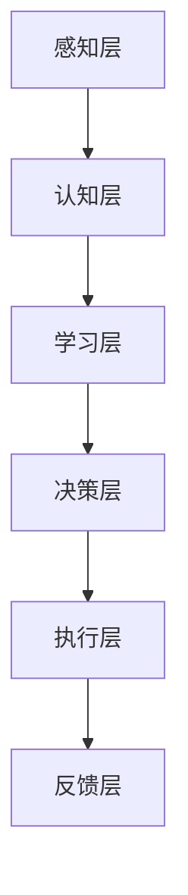
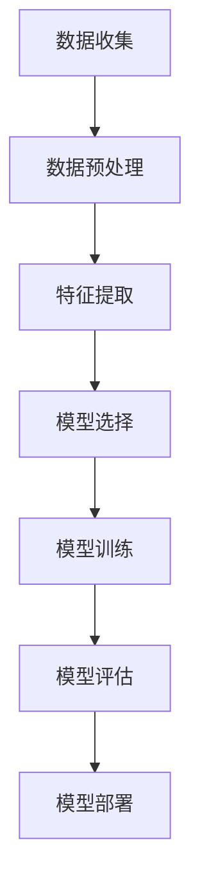
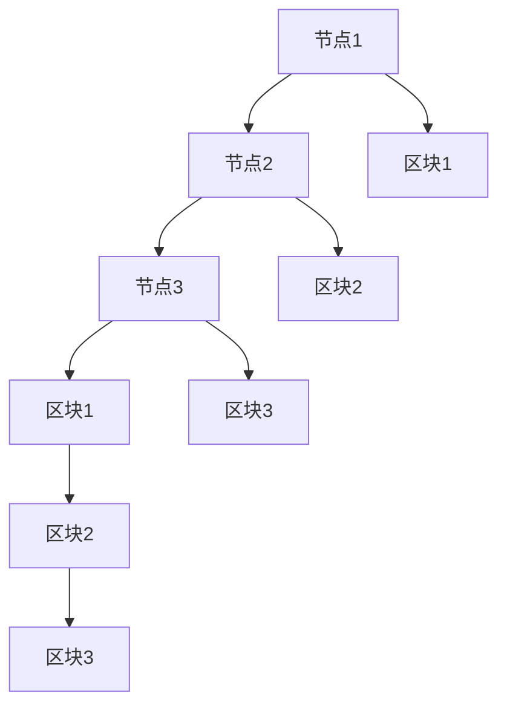
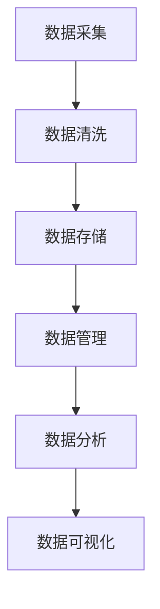
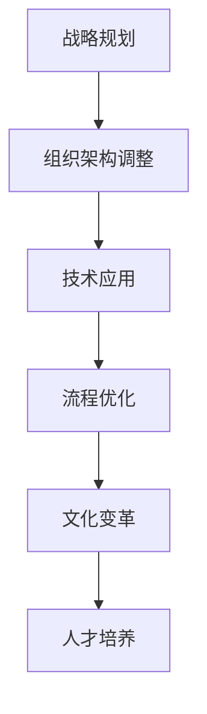
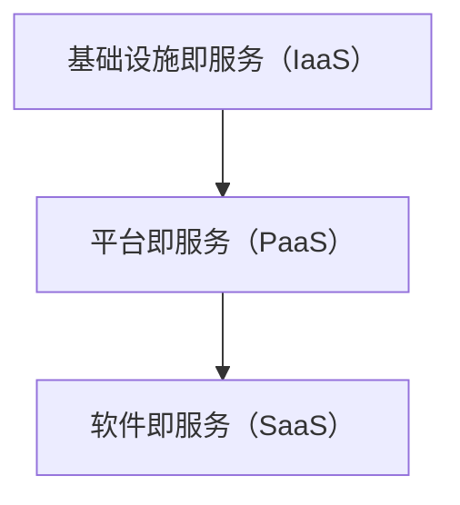

                 

## 如何应对技术变革带来的挑战

### 引言

技术变革正以前所未有的速度和规模影响着我们的生活和各行各业。从互联网的兴起，到移动设备的普及，再到如今的人工智能、区块链、大数据和云计算，技术的每一次飞跃都带来了深刻的变革。对于企业和个人来说，如何应对这些变化，把握机遇，应对挑战，成为了一个至关重要的问题。

本文将详细探讨如何应对技术变革带来的挑战。我们将首先介绍技术变革的背景与影响，分析其中涉及的关键概念，如人工智能、区块链、大数据和数字化转型。接着，我们将探讨组织层面和个人层面的应对策略，包括文化变革、人才战略、技术战略规划、技术创新和流程优化。最后，通过成功企业的案例分析，总结最佳实践，以期为读者提供切实可行的指导。

### 关键词

- 技术变革
- 人工智能
- 区块链
- 大数据
- 云计算
- 数字化转型
- 组织应对策略
- 个人发展

### 摘要

本文旨在探讨技术变革带来的挑战及应对策略。通过分析技术变革的背景与影响，介绍关键概念，探讨组织与个人层面的应对策略，以及通过成功企业的案例分析，总结最佳实践。本文希望为读者提供系统、全面、可操作的指导，帮助他们在技术变革的大潮中稳扎稳打，把握机遇，应对挑战。

### 第一部分：技术变革的背景与影响

#### 第1章：技术变革的背景与现状

### 1.1 技术变革的定义与趋势

#### 1.1.1 技术变革的概念

技术变革，即技术的革新和变革，是指通过引入新的技术、工具或方法，改变现有的生产、管理和运作方式，从而推动社会和经济的发展。它不仅仅是简单的技术更新，更是一次全面的生产力变革和社会变革。

技术变革可以理解为一种持续的、动态的过程，它涉及从基础科学研究到应用开发的各个环节。在这个过程中，技术进步不仅改变了生产工具和生产方式，还改变了人们的思维方式和生活方式。

#### 1.1.2 当前的技术变革趋势

当前，技术变革正以惊人的速度和规模在全球范围内展开。以下是一些主要的技术变革趋势：

1. **人工智能与机器学习**：人工智能（AI）和机器学习（ML）的发展正在引领新一轮的技术革命。通过深度学习、自然语言处理、计算机视觉等技术的应用，AI正逐步从理论研究走向实际应用，如自动驾驶、智能助手、智能医疗等。

2. **区块链技术**：区块链技术以其去中心化、安全透明、不可篡改的特点，正在改变金融、供应链管理、数据存储等多个领域的运作模式。区块链不仅为去中心化应用（DApp）提供了基础设施，还推动了数字货币的发展。

3. **大数据与云计算**：大数据技术的进步和云计算的普及，使得海量数据的存储、处理和分析变得更加高效和便捷。企业可以通过大数据分析获得深度的业务洞察，优化决策过程，提高运营效率。

4. **物联网（IoT）**：物联网技术通过将各种设备连接到互联网，实现了信息的实时传输和智能控制。智能家居、智能城市、智能农业等领域的应用，极大地提高了生活质量和生产效率。

5. **5G通信技术**：5G技术的商用化，为高速、低延迟的通信提供了可能。它不仅支持了物联网的广泛应用，还为虚拟现实（VR）、增强现实（AR）等新兴技术提供了技术支持。

#### 1.1.3 技术变革的影响

技术变革对各个行业产生了深远的影响，既带来了新的机遇，也带来了新的挑战。

1. **制造业**：智能制造技术的应用，使得制造业的生产效率大幅提升，产品质量得到保证。同时，数字化、网络化的生产模式，使得供应链管理更加高效，成本进一步降低。

2. **金融业**：金融科技的兴起，改变了传统金融业的运作方式。区块链技术为金融交易提供了更加安全、透明的解决方案，而大数据分析则帮助金融机构更好地了解客户需求，优化风险管理。

3. **医疗健康行业**：医疗健康领域的技术变革，主要体现在人工智能和大数据的应用上。智能诊断系统、远程医疗、个性化医疗等新兴技术的应用，提高了医疗服务的效率和质量。

4. **教育行业**：在线教育、虚拟课堂、智能学习等技术的应用，打破了传统的教育模式，为学习者提供了更加灵活、个性化的学习体验。

5. **服务业**：服务业通过数字化转型，提升了服务的效率和品质。智能客服系统、线上服务平台的普及，使得服务流程更加高效，客户体验得到提升。

### 1.2 技术变革对各个行业的影响

#### 1.2.1 制造业

在制造业中，技术变革主要表现在以下几个方面：

1. **自动化生产**：通过自动化设备的应用，减少了人工操作的环节，提高了生产效率和产品质量。

2. **智能工厂**：智能工厂通过物联网技术，将各种设备、系统和数据进行连接，实现生产过程的自动化、智能化管理。

3. **精益生产**：通过精益生产技术，优化生产流程，减少浪费，提高生产效率。

#### 1.2.2 金融业

金融业的技术变革主要体现在以下几个方面：

1. **区块链技术**：区块链技术为金融交易提供了安全、透明的解决方案，降低了交易成本，提高了交易效率。

2. **大数据分析**：大数据技术帮助金融机构更好地了解客户需求，优化风险管理，提高业务决策的准确性。

3. **智能投顾**：通过人工智能技术，智能投顾为投资者提供个性化的投资建议，提高投资收益。

#### 1.2.3 医疗健康行业

在医疗健康行业，技术变革主要表现在以下几个方面：

1. **人工智能诊断**：人工智能技术在医疗影像诊断、病理分析等方面的应用，提高了诊断的准确性和效率。

2. **远程医疗**：远程医疗技术的应用，使得患者可以在家中接受专业的医疗咨询和服务，提高了医疗服务的可及性。

3. **个性化医疗**：通过大数据和人工智能技术，个性化医疗方案可以为患者提供更加精准、有效的治疗方案。

#### 1.2.4 教育行业

在教育行业，技术变革主要体现在以下几个方面：

1. **在线教育**：在线教育平台和资源的普及，使得学习者可以随时随地获取知识，学习方式更加灵活。

2. **虚拟课堂**：虚拟课堂技术使得教师和学生可以在不同的地点进行实时互动，提高了教学效果。

3. **智能学习**：通过智能学习系统，学习者可以根据自己的学习进度和需求，定制个性化的学习计划。

#### 1.2.5 服务业

在服务业中，技术变革主要表现在以下几个方面：

1. **智能客服**：智能客服系统的应用，使得客户服务流程更加高效，客户体验得到提升。

2. **线上服务平台**：线上服务平台的普及，使得各种服务可以在线上完成，提高了服务效率和品质。

3. **数据分析**：通过对客户数据的分析，企业可以更好地了解客户需求，优化产品和服务。

### 1.3 技术变革带来的挑战与机遇

#### 1.3.1 挑战分析

技术变革虽然带来了巨大的机遇，但同时也带来了一系列挑战：

1. **技术更新速度**：技术的快速发展使得企业需要不断更新技术，以保持竞争力。这要求企业必须具备快速学习和技术更新的能力。

2. **人才短缺**：技术变革需要大量的技术人才，但现有的教育体系和人才培养模式无法满足快速变化的需求，导致人才短缺。

3. **安全与隐私**：随着技术的普及，数据安全和隐私问题日益突出。如何保护用户数据，防止数据泄露，成为了一个亟待解决的问题。

4. **法律与政策**：技术变革涉及到众多行业和领域，需要相应的法律和政策支持。但当前的法律和政策体系可能无法完全适应技术的快速变革。

#### 1.3.2 机遇展望

尽管技术变革带来了一系列挑战，但同时也带来了巨大的机遇：

1. **商业模式创新**：技术的变革为商业模式的创新提供了可能。企业可以通过技术创新，创造出新的商业模式，实现业务的快速增长。

2. **产业链重构**：技术变革使得产业链得以重构，企业可以更加灵活地配置资源，优化生产流程，提高产业链的整体效率。

3. **产业升级**：技术变革推动传统产业向数字化、智能化方向升级，为传统产业注入新的活力。

4. **国际化发展**：技术变革使得企业可以更加便捷地进入国际市场，开展国际化经营，实现业务的全球化布局。

#### 1.3.3 如何抓住机遇

为了抓住技术变革带来的机遇，企业需要采取一系列策略：

1. **加大研发投入**：企业需要加大研发投入，持续进行技术创新，以保持竞争优势。

2. **人才培养与引进**：企业需要建立完善的人才培养和引进机制，吸引和培养高水平的技术人才。

3. **跨界合作**：企业可以通过跨界合作，与其他行业的企业进行合作，共同探索新的商业模式和业务领域。

4. **数字化转型**：企业需要加速数字化转型，利用大数据、人工智能等技术，提升业务效率和品质。

5. **政策跟进**：政府需要出台相应的政策，支持技术变革，为企业提供法律保障和政策支持。

### 第2章：技术变革中的关键概念

#### 2.1 人工智能与机器学习

#### 2.1.1 人工智能概述

人工智能（Artificial Intelligence，简称AI）是指通过计算机模拟人类的智能行为，使计算机具有感知、思考、学习、决策和行动的能力。人工智能包括多个分支，如机器学习、自然语言处理、计算机视觉、智能语音等。

人工智能的应用范围广泛，从自动驾驶、智能客服，到金融风控、医疗诊断，都在利用人工智能技术提高效率、降低成本、提升用户体验。

#### 2.1.2 机器学习的核心原理

机器学习（Machine Learning，简称ML）是人工智能的一个重要分支，主要研究如何从数据中自动学习规律，进行预测和决策。机器学习的核心原理包括以下几个步骤：

1. **数据收集**：收集大量的数据，作为机器学习的输入。

2. **数据预处理**：对数据进行清洗、归一化等处理，使其符合机器学习的需求。

3. **模型选择**：选择合适的机器学习模型，如线性回归、决策树、神经网络等。

4. **模型训练**：使用训练数据，对模型进行训练，调整模型的参数。

5. **模型评估**：使用测试数据，对模型进行评估，确定模型的性能。

6. **模型部署**：将训练好的模型部署到生产环境中，进行实际的预测和决策。

#### 2.1.3 人工智能的应用领域

人工智能在多个领域都有广泛的应用：

1. **自动驾驶**：通过计算机视觉、自然语言处理等技术，实现无人驾驶汽车的安全驾驶。

2. **智能客服**：通过语音识别、自然语言处理等技术，提供高效的客户服务。

3. **金融风控**：通过大数据分析、机器学习等技术，预测金融风险，提高风险管理效率。

4. **医疗诊断**：通过计算机视觉、自然语言处理等技术，辅助医生进行疾病诊断。

5. **智能家居**：通过物联网、人工智能等技术，实现家电的智能化管理，提高生活质量。

#### 2.2 区块链技术

#### 2.2.1 区块链的基本概念

区块链（Blockchain）是一种分布式数据库技术，通过加密算法和共识机制，实现数据的存储、传输和管理。区块链的特点包括去中心化、安全透明、不可篡改。

区块链的基本结构包括区块、链和节点。每个区块包含一定数量的交易数据，通过加密算法与前面的区块连接，形成一条不可篡改的区块链。节点是区块链网络的组成部分，负责数据的存储、传输和验证。

#### 2.2.2 区块链的核心优势

区块链技术具有以下几个核心优势：

1. **去中心化**：区块链不需要中心化的第三方机构进行协调，降低了交易成本，提高了效率。

2. **安全透明**：区块链的数据存储和传输过程是公开透明的，任何节点都可以查看和验证交易数据。

3. **不可篡改**：区块链的数据一旦被记录，就无法被篡改，保证了数据的完整性和安全性。

4. **智能合约**：区块链技术可以实现智能合约，即自动执行的合同。智能合约通过编程语言编写，可以在满足特定条件时自动执行，提高了交易效率。

#### 2.2.3 区块链的应用案例

区块链技术在多个领域都有应用，以下是一些典型的应用案例：

1. **金融领域**：区块链技术在金融领域的应用包括跨境支付、数字货币、智能投顾等。通过区块链技术，可以实现快速、安全、低成本的金融交易。

2. **供应链管理**：区块链技术可以记录供应链中的每一个环节，确保商品的真实性和可追溯性，提高供应链的透明度和效率。

3. **医疗健康**：区块链技术可以记录患者的医疗数据，确保数据的完整性和安全性，同时为医生提供更全面的诊断信息。

4. **版权保护**：区块链技术可以用于版权保护，确保数字内容的版权归属，防止侵权行为。

#### 2.3 大数据和云计算

#### 2.3.1 大数据的概念与处理

大数据（Big Data）是指数据量巨大、类型繁多、价值密度低的数据集合。大数据的特点包括海量、多样、高速和实时。

大数据的处理主要包括数据的采集、存储、管理和分析。数据采集是通过各种传感器、设备和系统收集数据；数据存储是将海量数据存储在分布式存储系统中；数据管理包括数据清洗、归一化和数据仓库建设；数据分析是通过数据挖掘、机器学习和统计分析等技术，从数据中提取有价值的信息。

#### 2.3.2 云计算的服务模式

云计算（Cloud Computing）是一种通过网络提供计算资源的服务模式。云计算包括基础设施即服务（IaaS）、平台即服务（PaaS）和软件即服务（SaaS）三种模式。

1. **基础设施即服务（IaaS）**：用户通过互联网获取虚拟化的计算资源，如服务器、存储和网络等，可以实现资源的弹性伸缩和按需付费。

2. **平台即服务（PaaS）**：用户可以在云平台上开发、部署和管理应用程序，无需关心底层基础设施的维护。

3. **软件即服务（SaaS）**：用户通过网络访问云计算平台上的应用程序，实现软件的远程使用和更新。

#### 2.3.3 大数据与云计算的结合

大数据与云计算的结合，使得大数据的处理和分析变得更加高效和便捷。大数据与云计算的结合主要体现在以下几个方面：

1. **数据处理能力**：云计算提供了强大的数据处理能力，可以应对海量数据的高并发处理需求。

2. **数据存储与访问**：云计算提供了分布式存储系统，可以实现海量数据的存储和快速访问。

3. **数据分析工具**：云计算平台提供了丰富的数据分析工具，如数据挖掘、机器学习、统计分析等，可以方便地开展大数据分析。

4. **弹性伸缩**：云计算可以根据数据处理的需求，自动调整计算资源，实现弹性伸缩，提高资源利用率。

#### 2.4 数字化转型

#### 2.4.1 数字化转型的定义

数字化转型（Digital Transformation）是指企业利用数字技术，对业务模式、流程和组织结构进行全方位的变革，以实现业务的数字化、智能化和高效化。

数字化转型不仅仅是引入新的数字技术，更是对现有业务模式、流程和组织结构的深刻变革。它涉及到企业的战略、文化、运营等多个层面，需要全员的参与和协同。

#### 2.4.2 数字化转型的步骤

数字化转型通常包括以下几个步骤：

1. **战略规划**：明确数字化的目标和方向，制定数字化转型的战略规划。

2. **组织架构调整**：根据数字化转型的需求，调整组织架构，建立适应数字化发展的组织结构。

3. **技术应用**：引入数字技术，如大数据、人工智能、物联网等，对业务流程进行数字化改造。

4. **流程优化**：通过流程优化，提升业务效率，降低成本，提高客户满意度。

5. **文化变革**：推动企业文化变革，建立支持数字化发展的企业文化。

6. **人才培养**：培养数字化人才，提高员工的数字化技能，以适应数字化发展的需求。

#### 2.4.3 数字化转型的成功案例

以下是一些数字化转型的成功案例：

1. **阿里巴巴**：阿里巴巴通过数字化技术，实现了从传统零售到数字化零售的转型，打造了全球最大的电子商务平台。

2. **华为**：华为通过数字化转型，提升了研发效率，降低了生产成本，实现了全球业务的高效运营。

3. **海尔**：海尔通过数字化转型，构建了全球领先的智能工厂，实现了生产、销售、服务的全流程数字化管理。

### 第二部分：应对技术变革的策略与方法

#### 第3章：组织层面的应对策略

#### 3.1 组织文化变革

#### 3.1.1 组织文化的重要性

组织文化是指企业在长期发展中形成的共同价值观、行为规范和工作氛围。它是企业的灵魂，决定了企业的核心竞争力和发展方向。

组织文化的重要性体现在以下几个方面：

1. **塑造企业品牌**：组织文化是企业品牌的内在体现，良好的组织文化可以提升企业的品牌形象和市场竞争力。

2. **增强团队凝聚力**：组织文化可以激发员工的归属感和责任感，增强团队的凝聚力，提高工作效率。

3. **促进员工发展**：组织文化可以为员工提供成长和发展的平台，激发员工的创造力和创新能力。

4. **提高企业竞争力**：良好的组织文化可以提升企业的创新能力、决策能力和执行力，提高企业的核心竞争力。

#### 3.1.2 变革中的组织文化塑造

在技术变革的过程中，组织文化变革是至关重要的一环。以下是一些塑造变革中组织文化的策略：

1. **领导力塑造**：领导者的行为和价值观直接影响组织文化。领导者需要以身作则，推动组织文化的变革。

2. **沟通与共识**：组织文化变革需要广泛的沟通和共识。企业可以通过内部培训、研讨会等方式，让员工了解变革的必要性和目标。

3. **激励机制**：建立激励机制，鼓励员工积极参与组织文化变革，如设立变革奖项、提供职业发展机会等。

4. **文化传承**：在变革中，要尊重和传承企业原有的优秀文化，使其与新技术、新理念相结合，形成新的组织文化。

#### 3.1.3 如何建立支持技术变革的文化

建立支持技术变革的文化，需要从以下几个方面着手：

1. **开放包容**：鼓励创新思维，接受不同的观点和意见，营造开放包容的氛围。

2. **持续学习**：推动员工持续学习，提升技能和知识水平，以适应技术变革的需求。

3. **敏捷响应**：培养团队的敏捷性和灵活性，使其能够快速适应市场变化和技术变革。

4. **以人为本**：关注员工的需求和感受，建立以人为本的管理理念，提高员工的满意度和忠诚度。

#### 3.2 人才战略与培养

#### 3.2.1 技术人才的需求分析

技术变革对人才的需求提出了新的要求。以下是对当前技术人才需求的分析：

1. **人工智能人才**：随着人工智能技术的快速发展，对人工智能人才的需求大幅增加。这些人才需要具备深度学习、自然语言处理、计算机视觉等专业知识。

2. **区块链人才**：区块链技术的发展，使得对区块链技术人才的需求逐渐增加。这些人才需要掌握区块链的基本原理和应用，了解加密算法和智能合约等关键技术。

3. **大数据人才**：大数据技术的发展，需要大量的数据处理和分析人才。这些人才需要具备大数据技术、统计分析、数据挖掘等技能。

4. **云计算人才**：随着云计算的普及，对云计算人才的需求也在增加。这些人才需要熟悉云计算平台、虚拟化技术、分布式存储等技术。

5. **数字化管理人才**：数字化转型需要大量的数字化管理人才，这些人才需要具备数字化战略规划、流程优化、数据管理等技能。

#### 3.2.2 技术人才培养的策略

为了满足技术变革的需求，企业需要采取一系列技术人才培养策略：

1. **内部培训**：企业可以通过内部培训，提升员工的技术能力和知识水平。培训内容可以包括新技术、新工具、新方法等。

2. **外部招聘**：通过外部招聘，吸引具备先进技术能力和丰富经验的人才。企业可以针对不同的技术领域，制定相应的招聘策略。

3. **校企合作**：与高校和科研机构合作，共同培养技术人才。企业可以参与高校课程设计，提供实习和实践机会，培养符合企业需求的技术人才。

4. **持续学习**：鼓励员工持续学习，提供学习资源和平台，如在线课程、研讨会、工作坊等。

5. **激励机制**：建立激励机制，鼓励员工提升技能和知识水平，如提供培训补贴、晋升机会、奖金等。

#### 3.2.3 人才流动性管理

在技术变革的过程中，人才流动性管理是一个重要的问题。以下是一些管理人才流动性的策略：

1. **职业发展规划**：为员工制定清晰的职业发展规划，使其明确未来的发展方向和目标。

2. **内部调动**：通过内部调动，为员工提供不同的工作机会和发展空间，激发员工的工作热情。

3. **人才储备**：建立人才储备机制，提前选拔和培养潜在的核心人才，以应对突发的人事变动。

4. **激励机制**：通过提供具有竞争力的薪酬和福利待遇，留住核心人才。

5. **工作环境**：营造良好的工作环境，提高员工的工作满意度和忠诚度。

#### 3.3 技术战略规划

#### 3.3.1 技术战略的定义与目标

技术战略是企业为了实现长期发展目标，对技术领域的发展方向、目标和路径进行规划和布局。技术战略的定义包括以下几个方面：

1. **技术领域定位**：明确企业在技术领域的发展方向和定位，如人工智能、区块链、大数据等。

2. **技术目标设定**：设定具体的技术目标，如技术水平、技术能力、市场份额等。

3. **技术路径规划**：规划实现技术目标的具体路径，包括技术研发、技术应用、技术合作等。

技术战略的目标主要包括以下几个方面：

1. **提升技术水平**：通过技术投入和技术研发，提升企业在技术领域的技术水平，保持技术领先。

2. **增强市场竞争力**：通过技术战略的实施，提升企业的市场竞争力，扩大市场份额。

3. **实现业务创新**：通过技术战略的实施，推动企业的业务创新，开拓新的业务领域。

#### 3.3.2 技术选择的评估方法

在制定技术战略时，选择合适的技术是关键。以下是一些技术选择的评估方法：

1. **市场分析**：分析当前市场需求，了解哪些技术更符合市场趋势。

2. **技术评估**：对各种技术进行评估，包括技术成熟度、技术可行性、技术成本等。

3. **风险评估**：评估技术实施过程中可能遇到的风险，如技术风险、市场风险、政策风险等。

4. **成本效益分析**：分析技术投入与预期效益之间的关系，选择成本效益最高的技术。

#### 3.3.3 技术应用的策略制定

在技术战略实施过程中，如何制定技术应用策略也是一个关键问题。以下是一些技术应用策略：

1. **技术研发**：投入研发资源，进行新技术的研究和开发，以保持技术领先。

2. **技术应用**：将新技术应用到现有业务中，提升业务效率和质量。

3. **技术合作**：与其他企业、科研机构等合作，共同推进技术发展。

4. **技术培训**：对员工进行技术培训，提升其技术应用能力。

5. **技术保护**：通过专利、商标等方式，保护企业的技术成果。

### 第三部分：技术变革的最佳实践与案例分析

#### 第4章：成功企业案例分析

#### 4.1 企业A：数字化转型实践

#### 4.1.1 企业背景

企业A是一家拥有几十年历史的大型制造企业，主要从事机械设备的制造和销售。随着市场竞争的加剧和客户需求的不断变化，企业A意识到数字化转型的重要性，决定进行全面的数字化转型。

#### 4.1.2 数字化转型的目标

企业A的数字化转型目标主要包括：

1. **提高生产效率**：通过数字化技术，优化生产流程，提高生产效率。

2. **降低运营成本**：通过数字化技术，降低运营成本，提高盈利能力。

3. **提升客户体验**：通过数字化技术，提供更加个性化的产品和服务，提升客户满意度。

4. **增强创新能力**：通过数字化技术，推动产品创新和服务创新。

#### 4.1.3 数字化转型的过程

企业A的数字化转型过程主要包括以下几个阶段：

1. **战略规划**：企业A制定了详细的数字化转型战略，明确了数字化转型的目标和路径。

2. **组织架构调整**：企业A调整了组织架构，设立了专门的数字化转型部门，负责数字化转型的推进和管理工作。

3. **技术应用**：企业A引入了先进的生产设备、自动化生产线和智能监控系统，对生产流程进行数字化改造。

4. **数据管理**：企业A建立了数据管理平台，对生产数据、销售数据、客户数据进行整合和分析，提供业务决策支持。

5. **员工培训**：企业A对员工进行了数字化技术培训，提高员工的数字化技能。

#### 4.1.4 数字化转型成果分析

企业A的数字化转型取得了显著的成果：

1. **生产效率提升**：通过数字化技术，企业A的生产效率提高了30%，产品合格率提高了20%。

2. **运营成本降低**：通过数字化技术，企业A的运营成本降低了15%，库存周转率提高了20%。

3. **客户满意度提升**：通过数字化技术，企业A能够为客户提供更加个性化的产品和服务，客户满意度提高了10%。

4. **创新能力增强**：通过数字化转型，企业A的创新能力得到了提升，推出了一系列创新产品，市场竞争力得到了增强。

#### 4.2 企业B：人工智能应用实践

#### 4.2.1 企业背景

企业B是一家专注于金融服务的公司，提供信用卡、贷款、投资等多种金融服务。随着金融科技的发展，企业B意识到人工智能技术在金融服务中的应用潜力，决定进行人工智能应用实践。

#### 4.2.2 人工智能应用的领域

企业B在人工智能领域的应用主要包括：

1. **风险管理**：通过人工智能技术，企业B可以更准确地评估贷款申请者的信用风险，降低坏账率。

2. **客户服务**：通过人工智能技术，企业B可以提供24/7的智能客服服务，提高客户服务效率。

3. **投资决策**：通过人工智能技术，企业B可以分析大量的市场数据，提供更加准确的投资建议。

4. **个性化推荐**：通过人工智能技术，企业B可以根据客户的消费习惯和偏好，提供个性化的产品推荐。

#### 4.2.3 人工智能应用的成果

企业B的人工智能应用取得了显著的成果：

1. **风险管理**：通过人工智能技术，企业B的风险管理能力得到了显著提升，坏账率降低了10%。

2. **客户服务**：通过人工智能技术，企业B的客户服务水平得到了提高，客户满意度提高了15%。

3. **投资决策**：通过人工智能技术，企业B的投资决策更加准确，投资回报率提高了5%。

4. **个性化推荐**：通过人工智能技术，企业B的个性化推荐服务得到了客户的认可，产品销售量提高了20%。

#### 4.2.4 人工智能应用的挑战与解决

尽管人工智能应用取得了显著成果，但企业B也遇到了一些挑战：

1. **数据隐私**：人工智能应用需要大量的客户数据，如何保护客户隐私成为一个重要问题。

2. **技术更新**：人工智能技术发展迅速，企业需要不断更新技术，以保持竞争力。

3. **人才短缺**：人工智能技术人才短缺，企业需要投入大量资源进行人才培养。

针对这些挑战，企业B采取了一系列解决方案：

1. **数据安全**：企业B建立了严格的数据安全体系，确保客户数据的安全。

2. **技术更新**：企业B与科技公司合作，共同推进技术更新，保持技术领先。

3. **人才培养**：企业B建立了人才培养机制，通过内部培训和外部招聘，培养了一批高水平的人工智能技术人才。

#### 4.3 企业C：技术创新与业务融合

#### 4.3.1 企业背景

企业C是一家专注于零售业的公司，提供线上线下一体化的零售服务。随着电商的兴起，企业C意识到技术创新与业务融合的重要性，决定进行技术创新与业务融合的实践。

#### 4.3.2 技术创新与业务融合的策略

企业C在技术创新与业务融合方面采取了一系列策略：

1. **平台化**：企业C建立了自己的电商平台，实现线上线下一体化运营。

2. **智能化**：企业C引入人工智能技术，提供智能推荐、智能客服等服务，提升用户体验。

3. **供应链优化**：企业C通过大数据分析和物联网技术，优化供应链管理，提高供应链效率。

4. **业务创新**：企业C不断推动业务创新，如推出会员制、直播带货等新兴业务模式。

#### 4.3.3 技术创新与业务融合的案例

企业C在技术创新与业务融合方面取得了显著成果：

1. **智能推荐**：通过人工智能技术，企业C能够准确推荐商品，提高销售转化率。

2. **会员服务**：通过大数据分析，企业C能够为会员提供个性化的服务，提升会员满意度。

3. **直播带货**：通过直播技术，企业C能够实时互动，提升用户体验，推动销售增长。

4. **供应链优化**：通过大数据分析和物联网技术，企业C能够实时监控供应链，提高供应链效率。

#### 4.3.4 技术创新与业务融合的启示

企业C的技术创新与业务融合实践为企业提供了以下启示：

1. **平台化**：通过建立自己的电商平台，企业可以更好地掌控业务流程，提高运营效率。

2. **智能化**：通过引入人工智能技术，企业可以提升用户体验，提高业务效率。

3. **供应链优化**：通过大数据分析和物联网技术，企业可以优化供应链管理，提高供应链效率。

4. **业务创新**：不断推动业务创新，可以为企业带来新的增长点。

### 第5章：应对技术变革的最佳实践

#### 5.1 文化变革的最佳实践

#### 5.1.1 如何建立支持技术变革的企业文化

建立支持技术变革的企业文化，是确保企业能够顺利应对技术变革的关键。以下是一些具体的建议：

1. **强调持续学习**：企业应该鼓励员工持续学习，提供学习资源和机会，如在线课程、研讨会、工作坊等。通过持续学习，员工可以不断提升技能和知识水平，适应技术变革的需求。

2. **建立创新文化**：企业应该鼓励员工创新思维，提供创新支持，如设立创新奖项、提供创新实验资金等。通过建立创新文化，企业可以激发员工的创造力，推动技术变革。

3. **鼓励团队合作**：技术变革往往需要跨部门、跨职能的协作。企业应该鼓励团队合作，建立跨部门的沟通机制，提高协作效率。

4. **建立透明沟通**：企业应该建立透明沟通机制，让员工了解企业的战略方向、技术变革的进展和成果。通过透明沟通，可以增强员工的归属感和责任感，提高员工的参与度。

#### 5.1.2 案例分析：企业文化变革成功的企业

以下是一些企业文化变革成功的案例：

1. **谷歌**：谷歌以其开放、创新的企业文化著称。谷歌鼓励员工尝试新事物，提供广泛的培训和学习机会，建立透明的沟通机制，确保员工能够了解公司的战略方向和目标。这种企业文化使谷歌能够在技术变革中保持领先地位。

2. **阿里巴巴**：阿里巴巴强调“客户第一、员工第二、股东第三”的理念，鼓励员工以客户为中心，持续创新。阿里巴巴提供丰富的培训和学习资源，建立透明的沟通机制，确保员工能够了解公司的战略方向和目标。这种企业文化使阿里巴巴在数字化转型的过程中取得了巨大成功。

#### 5.1.3 文化变革的注意事项

在进行文化变革时，企业需要注意以下几点：

1. **尊重员工**：文化变革不仅仅是管理层的任务，更需要员工的积极参与。企业应该尊重员工的意见和需求，确保文化变革的过程是员工认可的。

2. **长期投入**：文化变革是一个长期的过程，需要持续的努力和投入。企业应该有耐心，不能期望一夜之间改变企业的文化。

3. **避免形式主义**：文化变革不能仅仅停留在表面，而应该深入到企业的核心价值观和日常运营中。企业需要确保文化变革的措施是真正有效的，而不是形式主义。

#### 5.2 人才战略的最佳实践

#### 5.2.1 如何吸引和留住技术人才

在技术变革的背景下，如何吸引和留住技术人才是企业面临的重要问题。以下是一些最佳实践：

1. **提供具有竞争力的薪酬和福利**：企业应该提供具有竞争力的薪酬和福利，以吸引优秀的技术人才。

2. **提供职业发展机会**：企业应该为员工提供明确的职业发展路径，包括晋升机会、培训和进修等。

3. **建立学习文化**：企业应该鼓励员工学习新技能，提供学习资源和机会，如在线课程、研讨会、工作坊等。

4. **提供良好的工作环境**：企业应该提供良好的工作环境，包括舒适的工作空间、先进的办公设备等。

5. **关注员工成长**：企业应该关注员工的成长，提供职业发展建议，帮助员工不断提升技能和知识水平。

#### 5.2.2 案例分析：人才战略成功的企业

以下是一些人才战略成功的企业案例：

1. **微软**：微软以其独特的人才战略著称。微软提供具有竞争力的薪酬和福利，提供明确的职业发展路径，建立学习文化，关注员工成长。这些措施帮助微软吸引了大量优秀的技术人才，保持了技术领先地位。

2. **苹果**：苹果公司以其独特的企业文化吸引和留住人才。苹果鼓励创新思维，提供丰富的学习资源，建立透明的沟通机制，确保员工能够了解公司的战略方向和目标。这种企业文化使苹果公司吸引了大量优秀的技术人才，推动了公司的持续创新。

#### 5.2.3 技能培训的最佳实践

为了提升员工的技能和知识水平，企业需要采取一系列技能培训的最佳实践：

1. **定制化培训**：企业应该根据员工的职业发展和岗位需求，提供定制化的培训课程。

2. **内部培训师**：企业可以培养内部培训师，提升员工的技能水平。内部培训师对公司的业务和员工需求有更深入的了解，可以提供更有针对性的培训。

3. **外部培训资源**：企业可以利用外部培训资源，如在线课程、行业研讨会等，提升员工的技能水平。

4. **实践机会**：企业应该为员工提供实践机会，如项目参与、实习等，让员工在实际工作中提升技能。

#### 5.3 技术战略规划的最佳实践

#### 5.3.1 如何制定技术战略规划

制定技术战略规划是企业应对技术变革的关键。以下是一些最佳实践：

1. **明确技术目标**：企业应该明确技术目标，包括提升技术水平、增强市场竞争力、实现业务创新等。

2. **分析市场需求**：企业应该分析市场需求，了解哪些技术更符合市场趋势，为技术战略规划提供依据。

3. **评估技术可行性**：企业应该评估技术的可行性，包括技术成熟度、技术成本、技术风险等。

4. **制定实施计划**：企业应该制定详细的实施计划，包括技术研发、技术应用、技术合作等。

5. **持续监控和调整**：企业应该持续监控技术战略规划的执行情况，根据实际情况进行调整。

#### 5.3.2 技术选择的最佳实践

在技术战略规划中，技术选择是一个关键问题。以下是一些技术选择的最佳实践：

1. **市场分析**：企业应该进行市场分析，了解当前市场需求和技术趋势。

2. **技术评估**：企业应该对各种技术进行评估，包括技术成熟度、技术可行性、技术成本等。

3. **风险评估**：企业应该评估技术实施过程中可能遇到的风险，包括技术风险、市场风险、政策风险等。

4. **成本效益分析**：企业应该进行成本效益分析，选择成本效益最高的技术。

#### 5.3.3 技术应用的最佳实践

在技术战略规划中，技术应用是一个关键环节。以下是一些技术应用的最佳实践：

1. **技术研发**：企业应该投入研发资源，进行新技术的研究和开发。

2. **技术应用**：企业应该将新技术应用到现有业务中，提升业务效率。

3. **技术合作**：企业可以与其他企业、科研机构等合作，共同推进技术发展。

4. **技术培训**：企业应该对员工进行技术培训，提升员工的技术应用能力。

### 结论

技术变革正以前所未有的速度和规模影响着我们的生活和各行各业。从互联网的兴起，到移动设备的普及，再到如今的人工智能、区块链、大数据和云计算，技术的每一次飞跃都带来了深刻的变革。对于企业和个人来说，如何应对这些变化，把握机遇，应对挑战，成为了一个至关重要的问题。

本文通过分析技术变革的背景与影响，介绍了人工智能、区块链、大数据和数字化转型等关键概念，探讨了组织与个人层面的应对策略，并通过成功企业的案例分析，总结出了最佳实践。希望本文能够为读者提供系统、全面、可操作的指导，帮助他们在技术变革的大潮中稳扎稳打，把握机遇，应对挑战。

在未来，技术变革将继续加速，企业需要不断调整和优化自己的战略，以适应新的技术环境。个人也需要不断学习和提升自己的技能，以适应职业发展的需求。只有不断变革和进步，才能在技术变革的大潮中立于不败之地。

### 附录

#### 附录A：技术变革相关术语解释

1. **人工智能（AI）**：通过计算机模拟人类的智能行为，使计算机具有感知、思考、学习、决策和行动的能力。

2. **机器学习（ML）**：机器学习是人工智能的一个重要分支，主要研究如何从数据中自动学习规律，进行预测和决策。

3. **区块链（Blockchain）**：区块链是一种分布式数据库技术，通过加密算法和共识机制，实现数据的存储、传输和管理。

4. **大数据（Big Data）**：大数据是指数据量巨大、类型繁多、价值密度低的数据集合。

5. **云计算（Cloud Computing）**：云计算是一种通过网络提供计算资源的服务模式。

6. **数字化转型（Digital Transformation）**：数字化转型是指企业利用数字技术，对业务模式、流程和组织结构进行全方位的变革，以实现业务的数字化、智能化和高效化。

#### 附录B：参考文献

1. **McKinsey & Company.** (2020). **The Race for Digital Transformation.** Retrieved from [https://www.mckinsey.com/featured-insights/digital-transformation/the-race-for-digital-transformation](https://www.mckinsey.com/featured-insights/digital-transformation/the-race-for-digital-transformation)

2. **Gartner.** (2021). **The Gartner Top Strategic Technology Trends for 2021.** Retrieved from [https://www.gartner.com/smarterwithgartner/top-strategic-technology-trends-for-2021/](https://www.gartner.com/smarterwithgartner/top-strategic-technology-trends-for-2021/)

3. **Deloitte.** (2020). **The 2020 Global Blockchain Survey: Accelerating the Evolution.** Retrieved from [https://www2.deloitte.com/global/en/insights/topics/technology/artificial-intelligence/the-2020-global-blockchain-survey-accelerating-the-evolution.html](https://www2.deloitte.com/global/en/insights/topics/technology/artificial-intelligence/the-2020-global-blockchain-survey-accelerating-the-evolution.html)

4. **IBM.** (2021). **The Future of Data: Enabling the Next Wave of Business Value.** Retrieved from [https://www.ibm.com/topics/data-management](https://www.ibm.com/topics/data-management)

5. **McKinsey & Company.** (2018). **The Economics of AI: A Roadmap for Value Creation.** Retrieved from [https://www.mckinsey.com/business-functions/mckinsey-digital-ma](https://www.mckinsey.com/business-functions/mckinsey-digital-ma)

#### 附录C：技术变革相关的Mermaid流程图和类图

1. **人工智能技术架构图**



2. **机器学习流程图**



3. **区块链基本架构图**



4. **大数据处理流程图**



5. **数字化转型流程图**



6. **云计算服务模式图**



#### 附录D：Python代码示例

以下是一个简单的Python代码示例，用于展示如何实现机器学习的算法原理。

```python
# 导入必要的库
import numpy as np
from sklearn.model_selection import train_test_split
from sklearn.linear_model import LinearRegression

# 生成训练数据
X = np.array([[1], [2], [3], [4], [5]])
y = np.array([1, 2, 3, 4, 5])

# 数据集划分
X_train, X_test, y_train, y_test = train_test_split(X, y, test_size=0.2, random_state=0)

# 创建线性回归模型
model = LinearRegression()

# 训练模型
model.fit(X_train, y_train)

# 预测
predictions = model.predict(X_test)

# 打印预测结果
print(predictions)
```

#### 附录E：技术变革相关的数学公式

以下是一些与技术变革相关的数学公式。

1. **线性回归公式**

$$y = wx + b$$

2. **梯度下降算法**

$$w_{t+1} = w_t - \alpha \frac{\partial J(w_t)}{\partial w}$$

其中，$w_t$表示第$t$次迭代的权重，$\alpha$表示学习率，$J(w_t)$表示损失函数。

3. **机器学习评估指标**

$$\text{Accuracy} = \frac{\text{正确预测的数量}}{\text{总预测的数量}}$$

4. **区块链共识算法**

$$\text{Proof of Work (PoW)}$$

$$\text{Proof of Stake (PoS)}$$

5. **大数据处理公式**

$$\text{HDFS} = \text{High Throughput File System$$

$$\text{MapReduce} = \text{Map + Reduce}$$

#### 附录F：技术变革相关的最佳实践

1. **持续学习**：鼓励员工持续学习，提供在线课程、内部培训等。

2. **技术创新**：投入研发资源，推动技术创新，保持技术领先。

3. **人才发展**：建立人才发展体系，提供职业发展机会，提升员工技能。

4. **文化变革**：建立支持创新的企业文化，鼓励员工参与变革。

5. **技术应用**：将新技术应用到业务中，提高业务效率。

6. **风险管理**：评估技术风险，制定风险管理策略。

7. **合作伙伴关系**：与其他企业、科研机构等建立合作伙伴关系，共同推进技术发展。

### 致谢

在此，我要感谢所有提供宝贵意见和建议的读者，感谢您们的关注和支持。您的每一句评论和反馈都是我不断进步的动力。同时，我要感谢我的团队，感谢你们在技术变革的道路上与我并肩作战，共同探索未知的领域。最后，我要特别感谢我的家人，感谢你们在我追求技术梦想的过程中给予的无尽支持和理解。

作者：AI天才研究院/AI Genius Institute & 禅与计算机程序设计艺术 /Zen And The Art of Computer Programming

---

本文旨在为读者提供关于如何应对技术变革带来的挑战的全面、深入的指导。希望本文能够帮助企业和个人在技术变革的大潮中找到自己的定位，把握机遇，应对挑战。在技术变革的旅程中，让我们一起前行，不断探索，不断进步。如果您有任何疑问或建议，欢迎随时与我交流。再次感谢您的阅读和支持！

