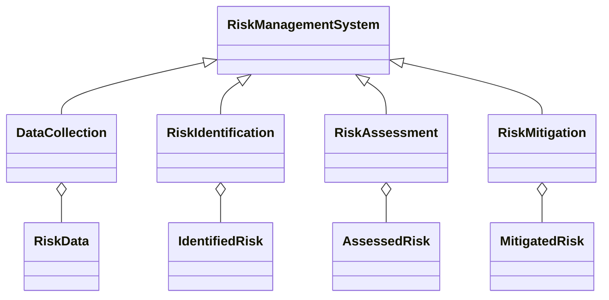
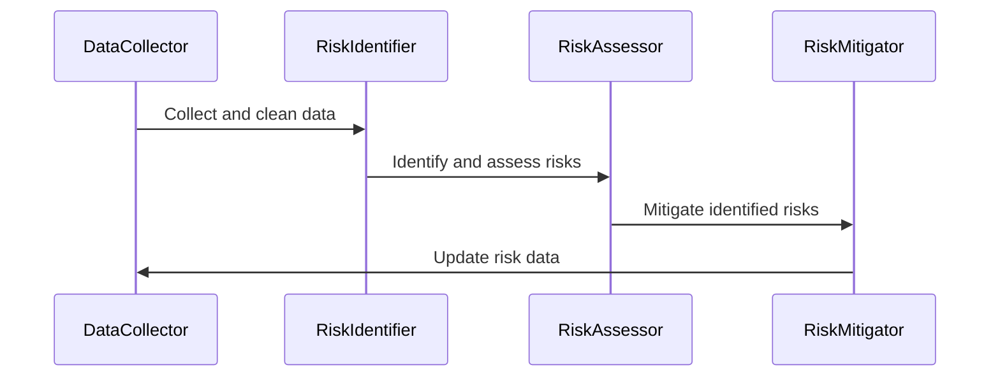
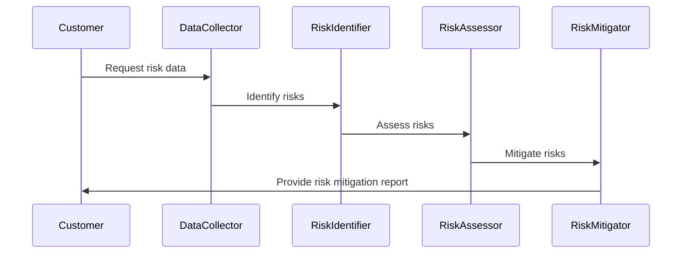

                 

### 如何有效暴露风险

#### 关键词
- 风险管理
- 风险识别
- 风险评估
- 风险沟通
- 风险案例

#### 摘要
本文旨在探讨如何有效暴露和管理风险，以帮助企业提高应对不确定性的能力。通过分析风险管理的核心概念，从风险识别、评估、策略到沟通和案例分析，本文提出了系统性的风险管理方法，旨在为IT领域的从业者提供实用的指导和参考。

### 目录大纲

**《如何有效暴露风险》**

**关键词：** 风险管理，风险识别，风险评估，风险沟通，风险案例

**摘要：** 本文全面探讨了风险管理的核心概念和实践，通过从风险识别、评估、策略到沟通和案例分析的过程，为企业提供了一套系统的风险管理方法。

**第一部分：风险管理的核心概念**

1. **第1章：风险管理的背景与概述**
    - **1.1 风险管理的重要性**
    - **1.2 风险管理的定义与目标**
    - **1.3 风险管理的框架与过程**

2. **第2章：风险识别与分析**
    - **2.1 风险识别的方法与工具**
    - **2.2 风险分析的基本概念**
    - **2.3 常见风险类型与特征**

3. **第3章：风险评估与度量**
    - **3.1 风险评估的标准与指标**
    - **3.2 风险度量的方法与技术**
    - **3.3 风险优先级排序**

4. **第4章：风险管理策略**
    - **4.1 风险应对策略的选择**
    - **4.2 风险缓解与规避措施**
    - **4.3 风险转移与保险**

5. **第5章：风险沟通与报告**
    - **5.1 风险沟通的有效性**
    - **5.2 风险报告的格式与内容**
    - **5.3 风险信息共享机制**

6. **第6章：风险管理实践案例分析**
    - **6.1 案例一：企业供应链风险管理**
    - **6.2 案例二：金融行业风险管理**
    - **6.3 案例三：项目风险管理**

7. **第7章：新兴风险领域的探索**
    - **7.1 数字化风险**
    - **7.2 环境与社会风险**
    - **7.3 未来风险趋势与应对策略**

8. **第8章：风险管理的最佳实践与总结**
    - **8.1 风险管理的最佳实践**
    - **8.2 风险管理的注意事项**
    - **8.3 风险管理的持续改进**

---

**作者：** AI天才研究院/AI Genius Institute & 禅与计算机程序设计艺术 /Zen And The Art of Computer Programming

### 文章目录大纲分析

本文的目录大纲结构清晰，分为八个主要部分，系统地涵盖了风险管理的各个方面：

**第一部分：风险管理的核心概念**

这部分为基础部分，介绍了风险管理的背景、定义、框架和过程，为后续内容提供了理论基础。

**第二部分：风险识别与分析**

这部分重点在于风险识别的方法与工具、风险分析的基本概念以及常见风险类型与特征，强调了识别风险的重要性。

**第三部分：风险评估与度量**

风险评估是风险管理的关键环节，这部分详细介绍了评估的标准与指标、度量的方法与技术以及风险优先级排序。

**第四部分：风险管理策略**

这部分提出了应对风险的各种策略，包括缓解、规避、转移和保险措施，为实际操作提供了具体的指导。

**第五部分：风险沟通与报告**

风险沟通与报告是确保风险管理有效性的重要环节，这部分介绍了有效沟通、报告的格式与内容以及风险信息共享机制。

**第六部分：风险管理实践案例分析**

通过实际案例，展示了风险管理在不同领域中的应用，增加了文章的可操作性和实用性。

**第七部分：新兴风险领域的探索**

这部分探讨了数字化、环境与社会等新兴领域的风险，以及未来风险趋势与应对策略，展望了风险管理的未来发展。

**第八部分：风险管理的最佳实践与总结**

这部分总结了风险管理的最佳实践、注意事项和持续改进的方法，为读者提供了全面的管理指导。

整体而言，目录大纲结构紧凑，内容详实，适合作为一本系统的风险管理指南。接下来，我们将逐部分深入探讨风险管理的重要方面。

---

### 第一部分：风险管理的核心概念

#### 第1章：风险管理的背景与概述

#### 1.1 风险管理的重要性

在当今复杂多变的环境中，风险管理已经成为企业和组织成功运营的关键因素。随着全球化的加速、技术的迅猛发展以及市场竞争的加剧，企业面临着越来越多的不确定性。风险管理能够帮助企业识别、评估和应对这些不确定性，从而保护其业务免受潜在损失。

**关键词：** 风险管理，重要性，不确定性，保护业务

**背景介绍：**

- **问题背景：** 企业在日常运营中可能会遇到各种风险，如市场波动、技术故障、法律合规等问题。
- **问题描述：** 这些风险可能导致财务损失、声誉受损甚至业务中断。
- **问题解决：** 通过风险管理，企业可以提前识别潜在风险，制定应对措施，从而降低风险发生的概率和影响。

**边界与外延：**

- **风险管理：** 是指通过系统的方法识别、评估、应对和监控风险的过程。
- **核心要素：** 包括风险识别、风险评估、风险应对和风险监控。

**概念结构：**


#### 1.2 风险管理的定义与目标

风险管理是一种系统化的方法，旨在识别、评估、处理和监控可能影响企业目标实现的风险。其目标是确保企业能够应对各种风险，从而实现长期稳健发展。

**关键词：** 定义，目标，系统化方法，企业目标

**核心概念与联系：**

- **风险管理定义：** 是一个持续的过程，包括风险识别、评估、应对和监控。
- **风险管理目标：** 包括保护企业资产、确保业务连续性、提升企业竞争力等。

**概念属性特征对比表格：**

| 概念       | 特征                                                   |
|------------|--------------------------------------------------------|
| 风险管理   | 系统化、持续、全面、动态调整                             |
| 风险识别   | 识别潜在风险，评估风险可能性和影响                       |
| 风险评估   | 量化风险程度，确定优先级                               |
| 风险应对   | 制定和实施应对措施，降低风险影响                        |
| 风险监控   | 持续跟踪风险状况，确保应对措施的有效性                   |

**ER实体关系图架构：**

```mermaid
erDiagram
  RiskManagement ||--|{ RiskIdentification }
  RiskManagement ||--|{ RiskAssessment }
  RiskManagement ||--|{ RiskMitigation }
  RiskManagement ||--|{ RiskMonitoring }
```

#### 1.3 风险管理的框架与过程

风险管理的框架通常包括以下关键步骤：风险识别、风险评估、风险应对和风险监控。以下是一个典型的风险管理过程：

1. **风险识别**：通过多种方法识别企业面临的各种风险。
2. **风险评估**：对识别出的风险进行评估，确定其可能性和影响。
3. **风险应对**：制定和实施应对措施，降低风险的影响。
4. **风险监控**：持续监控风险状况，确保应对措施的有效性。

**关键词：** 框架，过程，风险识别，风险评估，风险应对，风险监控

**算法原理讲解：**

风险管理的每个步骤都可以视为一个独立的算法，但它们共同构成了一个整体流程。以下是一个简化的风险管理算法流程图：


使用Python语言，我们可以定义一个简单的风险管理函数，模拟这个过程：

```python
def risk_management():
    # 风险识别
    risks_identified = identify_risks()

    # 风险评估
    assessed_risks = assess_risks(risks_identified)

    # 风险应对
    mitigated_risks = mitigate_risks(assessed_risks)

    # 风险监控
    monitor_risks(mitigated_risks)

    return mitigated_risks
```

**数学公式使用：**

在风险管理中，常用的数学公式包括概率分布、预期损失和风险价值（Value at Risk, VaR）等。以下是一个预期损失的简单公式：

$$
E(L) = \sum_{i=1}^{n} (L_i \cdot P_i)
$$

其中，$L_i$ 表示第$i$种损失，$P_i$ 表示该损失发生的概率。

#### 1.4 风险管理的挑战与对策

虽然风险管理对于企业的成功至关重要，但实践中仍然面临许多挑战：

- **数据不足**：缺乏准确的数据可能导致风险评估不准确。
- **时间限制**：在紧急情况下，风险管理的步骤可能无法得到充分执行。
- **资源限制**：企业可能没有足够的资源来实施全面的风险管理。

**关键词：** 挑战，对策，数据不足，时间限制，资源限制

**系统分析与架构设计方案：**

为了应对这些挑战，企业可以采用以下策略：

1. **数据整合**：通过数据整合和清洗，提高数据质量。
2. **优先级排序**：根据风险的严重程度和可能性，优先处理高风险事件。
3. **自动化**：使用自动化工具提高风险管理过程的效率。

**项目介绍：** 本部分内容是一个风险管理系统的设计和实现，包括数据收集、风险识别、评估和应对等功能。

**系统功能设计（领域模型类图）：**



**系统架构设计（架构图）：**



**系统接口设计和系统交互（序列图）：**



**项目小结：** 通过实际项目案例，企业能够更好地理解风险管理的过程和挑战，从而提高风险管理的效率和效果。

### 第二部分：风险识别与分析

#### 第2章：风险识别与分析

#### 2.1 风险识别的方法与工具

风险识别是风险管理的第一步，也是至关重要的一步。有效的风险识别能够帮助企业提前发现潜在问题，从而采取预防措施。以下是一些常用的风险识别方法和工具：

**关键词：** 风险识别，方法，工具，SWOT分析，头脑风暴

**背景介绍：**

- **问题背景：** 在企业的运营过程中，可能会遇到各种内部和外部风险。
- **问题描述：** 这些风险可能来自市场变化、技术问题、法律合规、人员变动等方面。
- **问题解决：** 通过系统的方法和工具进行风险识别，可以提前预防风险。

**边界与外延：**

- **风险识别：** 是指通过系统的方法和工具识别企业面临的各种潜在风险。
- **核心要素：** 包括内部风险和外部风险。

**概念结构：**


#### 2.2 风险分析的基本概念

风险分析是风险管理的重要环节，它通过对已识别的风险进行评估和分析，确定风险的性质、程度和可能的影响。以下是一些基本概念：

**关键词：** 风险分析，性质，程度，影响，风险评估

**核心概念与联系：**

- **风险分析：** 是指对已识别的风险进行详细评估和分析。
- **风险评估：** 是风险分析的核心环节，包括定性评估和定量评估。

**概念属性特征对比表格：**

| 概念         | 特征                                       |
|--------------|------------------------------------------|
| 风险分析     | 定性分析，定量分析，综合分析               |
| 定性评估     | 评估风险的可能性和影响，无具体数值         |
| 定量评估     | 使用数学模型和统计方法，评估风险的具体数值 |
| 综合评估     | 将定性评估和定量评估结合，得出综合结论     |

**ER实体关系图架构：**

```mermaid
erDiagram
  RiskAnalysis ||--|{ QualitativeAnalysis }
  RiskAnalysis ||--|{ QuantitativeAnalysis }
  RiskAnalysis ||--|{ ComprehensiveAnalysis }
```

#### 2.3 常见风险类型与特征

在企业运营中，常见的风险类型包括市场风险、信用风险、操作风险、法律风险和技术风险等。以下是对这些风险的简要描述和特征分析：

**关键词：** 风险类型，特征，市场风险，信用风险，操作风险，法律风险，技术风险

**市场风险：**

- **特征：** 市场波动，供需变化，竞争压力。
- **影响：** 影响企业的盈利能力，市场份额。

**信用风险：**

- **特征：** 客户信用不良，信用欺诈。
- **影响：** 影响企业的现金流和财务状况。

**操作风险：**

- **特征：** 内部流程缺陷，人员失误，系统故障。
- **影响：** 导致业务中断，声誉受损。

**法律风险：**

- **特征：** 法律法规变化，合同纠纷，知识产权问题。
- **影响：** 导致企业面临法律诉讼，罚款和处罚。

**技术风险：**

- **特征：** 技术故障，信息安全漏洞。
- **影响：** 影响企业的业务连续性和信息安全。

**表格：**

| 风险类型 | 特征 | 影响 |
|----------|------|------|
| 市场风险 | 市场波动 | 影响盈利能力 |
| 信用风险 | 客户信用不良 | 影响现金流 |
| 操作风险 | 内部流程缺陷 | 导致业务中断 |
| 法律风险 | 法律法规变化 | 导致法律诉讼 |
| 技术风险 | 技术故障 | 影响业务连续性 |

### 第三部分：风险评估与度量

#### 第3章：风险评估与度量

#### 3.1 风险评估的标准与指标

风险评估是风险管理的关键环节，通过对风险的性质、程度和可能影响进行评估，帮助企业制定有效的应对策略。以下是一些常用的风险评估标准和指标：

**关键词：** 风险评估，标准，指标，定性评估，定量评估

**背景介绍：**

- **问题背景：** 企业在运营过程中面临多种风险，需要评估其可能性和影响。
- **问题描述：** 如何科学、系统地评估风险，制定应对策略。
- **问题解决：** 使用标准化的评估方法和指标，确保风险评估的准确性和有效性。

**边界与外延：**

- **风险评估：** 包括定性评估和定量评估。
- **核心要素：** 风险指标，评估标准，评估方法。

**概念结构：**


#### 3.2 风险度量的方法与技术

风险度量是将风险评估量化，以明确风险的程度和重要性。以下是一些常用的风险度量方法和技术：

**关键词：** 风险度量，方法，技术，概率分布，预期损失，风险价值

**核心概念与联系：**

- **风险度量：** 将定性评估转化为定量分析。
- **概率分布：** 描述风险事件的可能性和影响。
- **预期损失：** 风险事件的平均损失。
- **风险价值（VaR）：** 在一定置信水平下，风险事件的最大可能损失。

**概念属性特征对比表格：**

| 方法       | 特征                                                   |
|------------|--------------------------------------------------------|
| 概率分布   | 描述风险事件的可能性分布                             |
| 预期损失   | 风险事件的总损失除以事件数量                         |
| 风险价值（VaR）| 在特定置信水平下的最大可能损失                       |
| 敏感性分析 | 分析不同变量对风险的影响程度                         |

**ER实体关系图架构：**

```mermaid
erDiagram
  RiskMeasurement ||--|{ ProbabilityDistribution }
  RiskMeasurement ||--|{ ExpectedLoss }
  RiskMeasurement ||--|{ ValueAtRisk }
  RiskMeasurement ||--|{ SensitivityAnalysis }
```

#### 3.3 风险优先级排序

在识别和评估了多种风险后，企业需要对风险进行优先级排序，以便集中资源和精力应对最重要的风险。以下是一些常用的风险优先级排序方法：

**关键词：** 风险优先级，排序，重要性，资源分配

**核心概念与联系：**

- **风险优先级：** 根据风险的严重程度和可能性进行排序。
- **重要性：** 风险对企业的业务连续性和财务状况的影响。
- **资源分配：** 根据风险优先级分配资源，确保重点风险得到有效应对。

**概念属性特征对比表格：**

| 方法         | 特征                                       |
|--------------|------------------------------------------|
| 优先级排序   | 根据风险的影响和可能性排序               |
| 敏感性分析   | 根据不同变量对风险的影响程度排序         |
| 资源优化     | 根据资源分配情况排序                     |

**ER实体关系图架构：**

```mermaid
erDiagram
  RiskPriority ||--|{ ImpactAnalysis }
  RiskPriority ||--|{ PossibilityAnalysis }
  RiskPriority ||--|{ ResourceAllocation }
```

### 第四部分：风险管理策略

#### 第4章：风险管理策略

#### 4.1 风险应对策略的选择

风险管理策略是应对潜在风险的关键，企业应根据风险类型、影响程度和可能的影响，选择合适的风险应对策略。以下是一些常见的风险应对策略：

**关键词：** 风险应对策略，选择，风险类型，影响程度

**背景介绍：**

- **问题背景：** 企业在运营过程中可能会遇到各种风险，需要制定应对策略。
- **问题描述：** 如何根据风险的特点选择合适的应对策略。
- **问题解决：** 通过分析风险类型和影响程度，选择最佳的风险应对策略。

**边界与外延：**

- **风险应对策略：** 包括风险规避、风险转移、风险缓解和风险接受。
- **核心要素：** 风险类型，影响程度，资源限制。

**概念结构：**


#### 4.2 风险缓解与规避措施

风险缓解和规避是减少风险发生概率和影响的重要手段。以下是一些常用的风险缓解和规避措施：

**关键词：** 风险缓解，规避措施，控制措施，预防措施

**核心概念与联系：**

- **风险缓解：** 通过减少风险事件的发生概率或影响程度来降低风险。
- **规避：** 完全避免风险事件的发生。

**概念属性特征对比表格：**

| 方法       | 特征                                       |
|------------|------------------------------------------|
| 风险缓解   | 降低风险事件的概率和影响                   |
| 规避       | 完全避免风险事件的发生                     |

**ER实体关系图架构：**

```mermaid
erDiagram
  RiskMitigation ||--|{ RiskReduction }
  RiskMitigation ||--|{ RiskAvoidance }
```

#### 4.3 风险转移与保险

风险转移是将风险责任和影响转移到第三方，以减轻企业的风险负担。以下是一些常见的风险转移方式，以及保险在风险转移中的作用：

**关键词：** 风险转移，保险，责任转移，损失补偿

**核心概念与联系：**

- **风险转移：** 通过合同、协议或其他方式将风险责任和影响转移到第三方。
- **保险：** 通过购买保险，将风险转移给保险公司，以获得损失补偿。

**概念属性特征对比表格：**

| 方法       | 特征                                       |
|------------|------------------------------------------|
| 风险转移   | 将风险责任和影响转移到第三方               |
| 保险       | 通过购买保险，获得损失补偿                 |

**ER实体关系图架构：**

```mermaid
erDiagram
  RiskTransfer ||--|{ Insurance }
  RiskTransfer ||--|{ RiskTransferAgreements }
```

### 第五部分：风险沟通与报告

#### 第5章：风险沟通与报告

#### 5.1 风险沟通的有效性

有效的风险沟通是风险管理的重要组成部分，它有助于确保所有相关方了解风险状况和应对措施。以下是一些提高风险沟通有效性的方法：

**关键词：** 风险沟通，有效性，透明度，沟通策略

**背景介绍：**

- **问题背景：** 风险沟通是确保风险管理有效性的关键。
- **问题描述：** 如何提高风险沟通的有效性，确保信息的准确传递。
- **问题解决：** 通过采用有效的沟通策略，确保所有相关方都能准确理解和响应风险信息。

**边界与外延：**

- **风险沟通：** 涉及风险信息的传递、理解和响应。
- **核心要素：** 沟通策略，信息透明度，沟通频率。

**概念结构：**


#### 5.2 风险报告的格式与内容

风险报告是风险沟通的重要工具，它提供了风险状况、评估结果和应对措施的详细记录。以下是一些常见的风险报告格式和内容：

**关键词：** 风险报告，格式，内容，评估结果，应对措施

**核心概念与联系：**

- **风险报告格式：** 包括报告的结构和排版。
- **风险报告内容：** 涵盖风险识别、评估、应对和监控的详细信息。

**概念属性特征对比表格：**

| 格式       | 内容                                       |
|------------|------------------------------------------|
| 结构化报告 | 风险概述，风险评估，风险应对，风险监控     |
| 演示文稿   | 风险简介，图表展示，关键数据，结论和建议   |
| 文档报告   | 详细描述，数据统计，案例分析，风险评估结论 |

**ER实体关系图架构：**

```mermaid
erDiagram
  RiskReport ||--|{ RiskSummary }
  RiskReport ||--|{ RiskAssessment }
  RiskReport ||--|{ RiskMitigation }
  RiskReport ||--|{ RiskMonitoring }
```

#### 5.3 风险信息共享机制

有效的风险信息共享机制有助于确保所有相关方都能及时获取和了解风险信息。以下是一些提高风险信息共享机制有效性的方法：

**关键词：** 风险信息，共享机制，信息传递，透明度

**核心概念与联系：**

- **风险信息共享机制：** 确保风险信息在组织内部和外部的高效传递。
- **信息传递：** 包括沟通渠道、沟通工具和沟通频率。

**概念属性特征对比表格：**

| 方法       | 特征                                       |
|------------|------------------------------------------|
| 沟通渠道   | 确保风险信息的快速传递和准确理解           |
| 沟通工具   | 使用多种工具（如邮件、会议、报告等）提高沟通效率 |
| 沟通频率   | 定期更新风险信息，确保信息的实时性         |

**ER实体关系图架构：**

```mermaid
erDiagram
  RiskInformationSharing ||--|{ CommunicationChannels }
  RiskInformationSharing ||--|{ CommunicationTools }
  RiskInformationSharing ||--|{ CommunicationFrequency }
```

### 第六部分：风险管理实践案例分析

#### 第6章：风险管理实践案例分析

#### 6.1 案例一：企业供应链风险管理

企业供应链风险管理是企业面临的重要风险之一。通过以下案例，我们将探讨如何识别、评估和应对供应链风险。

**关键词：** 供应链风险管理，供应商风险，库存风险，物流风险

**背景介绍：**

- **问题背景：** 在全球供应链复杂多变的环境下，企业面临着供应商不稳定、库存过剩、物流延误等问题。
- **问题描述：** 如何通过风险管理确保供应链的稳定和高效。
- **问题解决：** 通过系统化的风险识别、评估和应对，提高供应链的灵活性和可靠性。

**边界与外延：**

- **供应链风险管理：** 涵盖供应商选择、库存管理、物流协调等方面。
- **核心要素：** 风险识别，风险评估，风险应对。

**案例概述：**

某大型制造企业面临供应链中断的风险，其供应商不稳定，库存管理不当，导致生产停滞和客户投诉增加。

**风险识别：**

- **供应商风险：** 供应商倒闭、供应链中断。
- **库存风险：** 库存过剩、库存不足。
- **物流风险：** 物流延误、物流成本增加。

**风险评估：**

- **供应商风险评估：** 使用供应商评级系统，评估供应商的财务状况、生产能力、交付记录等。
- **库存风险评估：** 使用库存优化模型，评估库存水平和需求预测。
- **物流风险评估：** 分析物流网络的可靠性，评估物流成本和交付时间。

**风险应对：**

- **供应商风险应对：** 建立多元化的供应商体系，增加供应商储备，确保供应商之间的竞争。
- **库存风险应对：** 使用先进的库存管理工具，实现实时库存监控和需求预测。
- **物流风险应对：** 建立应急预案，确保物流网络的灵活性，降低物流成本和交付时间。

**案例结果：**

通过系统化的供应链风险管理，企业成功降低了供应链中断的风险，提高了供应链的稳定性和效率。

#### 6.2 案例二：金融行业风险管理

金融行业风险管理是金融机构面临的重要挑战之一。通过以下案例，我们将探讨如何识别、评估和应对金融行业的风险。

**关键词：** 金融行业风险管理，信用风险，市场风险，操作风险

**背景介绍：**

- **问题背景：** 金融行业的风险复杂多样，包括信用风险、市场风险和操作风险。
- **问题描述：** 如何通过风险管理确保金融机构的稳健运营。
- **问题解决：** 通过系统化的风险识别、评估和应对，提高金融机构的风险抵御能力。

**边界与外延：**

- **金融行业风险管理：** 涵盖信用风险、市场风险、操作风险等多个方面。
- **核心要素：** 风险识别，风险评估，风险应对。

**案例概述：**

某大型银行面临信用风险和市场风险，其客户信用不良，市场波动导致资产价值下降。

**风险识别：**

- **信用风险：** 客户信用不良，贷款违约。
- **市场风险：** 资产价值波动，市场利率变化。
- **操作风险：** 人员操作失误，系统故障。

**风险评估：**

- **信用风险评估：** 使用信用评级模型，评估客户信用状况。
- **市场风险评估：** 使用市场波动分析，评估资产价值变化。
- **操作风险评估：** 分析操作流程，评估操作失误和系统故障的风险。

**风险应对：**

- **信用风险应对：** 建立严格的信用评估和监控机制，确保贷款客户的信用状况。
- **市场风险应对：** 通过多元化的资产配置，降低市场波动对资产价值的影响。
- **操作风险应对：** 加强员工培训和系统维护，提高操作效率和安全性。

**案例结果：**

通过系统化的金融行业风险管理，银行成功降低了信用风险和市场风险，确保了业务的稳健运营。

#### 6.3 案例三：项目风险管理

项目风险管理是项目管理中的重要环节。通过以下案例，我们将探讨如何识别、评估和应对项目风险。

**关键词：** 项目风险管理，进度风险，成本风险，质量风险

**背景介绍：**

- **问题背景：** 项目在执行过程中可能会遇到各种风险，影响项目的进度、成本和质量。
- **问题描述：** 如何通过风险管理确保项目的成功实施。
- **问题解决：** 通过系统化的风险识别、评估和应对，提高项目的成功率和效率。

**边界与外延：**

- **项目风险管理：** 涵盖进度风险、成本风险、质量风险等多个方面。
- **核心要素：** 风险识别，风险评估，风险应对。

**案例概述：**

某IT公司正在实施一个大型软件项目，该项目涉及多个模块和团队成员，面临进度延误、成本超支和质量问题。

**风险识别：**

- **进度风险：** 项目进度延误，无法按期交付。
- **成本风险：** 项目成本超支，影响盈利能力。
- **质量风险：** 项目质量不达标，影响客户满意度。

**风险评估：**

- **进度风险评估：** 分析项目进度计划，评估各阶段完成情况。
- **成本风险评估：** 分析项目预算，评估成本控制和超支风险。
- **质量风险评估：** 分析项目质量标准，评估质量问题的影响。

**风险应对：**

- **进度风险应对：** 制定详细的进度计划，确保各阶段按时完成。
- **成本风险应对：** 通过成本控制和预算调整，确保项目成本在可控范围内。
- **质量风险应对：** 加强质量监控，确保项目质量达到预期标准。

**案例结果：**

通过系统化的项目风险管理，公司成功完成了大型软件项目，确保了项目进度、成本和质量的良好控制。

### 第七部分：新兴风险领域的探索

#### 第7章：新兴风险领域的探索

#### 7.1 数字化风险

随着数字化转型的深入，企业面临越来越多的数字化风险。以下将探讨数字化风险的类型、特征和应对策略。

**关键词：** 数字化风险，网络安全，数据泄露，系统依赖

**背景介绍：**

- **问题背景：** 数字化技术的广泛应用带来了新的风险，如网络安全威胁、数据泄露和系统依赖。
- **问题描述：** 如何应对数字化风险，确保企业的数据安全和系统稳定。
- **问题解决：** 通过识别和评估数字化风险，采取有效的应对措施，提高企业的数字化风险管理能力。

**边界与外延：**

- **数字化风险：** 涉及网络安全、数据隐私、系统稳定性等方面。
- **核心要素：** 风险识别，风险评估，风险应对。

**案例概述：**

某电子商务平台因黑客攻击导致大量用户数据泄露，对企业声誉和业务造成重大影响。

**风险识别：**

- **网络安全风险：** 黑客攻击，网络钓鱼，恶意软件。
- **数据泄露风险：** 数据泄露，隐私侵犯。
- **系统依赖风险：** 系统故障，系统依赖性。

**风险评估：**

- **网络安全风险评估：** 分析黑客攻击的方法和手段，评估系统漏洞和弱点。
- **数据泄露风险评估：** 分析数据泄露的可能性和影响，评估现有数据保护措施的有效性。
- **系统依赖风险评估：** 分析系统故障对业务的影响，评估系统的可靠性和应急能力。

**风险应对：**

- **网络安全应对：** 加强网络安全防护，定期更新安全策略和系统。
- **数据泄露应对：** 增强数据加密和访问控制，建立应急预案和数据恢复机制。
- **系统依赖应对：** 建立冗余系统，确保业务连续性，提高系统可靠性。

**案例结果：**

通过有效的数字化风险管理，企业成功降低了网络安全风险，提高了数据保护和系统稳定性，确保了业务的持续运营。

#### 7.2 环境与社会风险

环境与社会风险日益受到关注，对企业可持续发展和社会责任产生重大影响。以下将探讨环境与社会风险的类型、特征和应对策略。

**关键词：** 环境风险，社会风险，气候变化，社会责任

**背景介绍：**

- **问题背景：** 环境污染、气候变化、社会不公等问题对企业的运营和社会责任产生挑战。
- **问题描述：** 如何应对环境与社会风险，实现企业的可持续发展和社会责任。
- **问题解决：** 通过识别和评估环境与社会风险，采取有效的应对措施，提高企业的社会责任感和可持续发展能力。

**边界与外延：**

- **环境风险：** 涉及环境污染、资源浪费、气候变化等方面。
- **社会风险：** 涉及社会不公、员工权益、社区关系等方面。
- **核心要素：** 风险识别，风险评估，风险应对。

**案例概述：**

某制造企业因环境污染问题受到政府处罚和公众质疑，对企业声誉和业务造成重大影响。

**风险识别：**

- **环境风险：** 污染排放，资源浪费，生态系统破坏。
- **社会风险：** 社区不满，员工权益问题，社会责任缺失。

**风险评估：**

- **环境风险评估：** 分析污染物的种类、浓度和排放量，评估对环境的影响。
- **社会风险评估：** 分析社区关系、员工满意度和社会责任履行情况。
- **社会责任评估：** 分析企业的社会责任报告和履行情况。

**风险应对：**

- **环境风险应对：** 采用绿色生产技术，减少污染排放，提高资源利用效率。
- **社会风险应对：** 加强与社区和员工的沟通，保障员工权益，积极参与社会责任项目。
- **社会责任应对：** 制定明确的社会责任战略，定期发布社会责任报告，提高企业的社会责任感。

**案例结果：**

通过有效的环境与社会风险管理，企业成功降低了环境污染风险，提高了社区和员工的满意度，增强了企业的社会责任感和可持续发展能力。

#### 7.3 未来风险趋势与应对策略

随着技术的不断进步和社会的快速发展，未来风险趋势也在不断演变。以下将探讨未来可能出现的风险趋势以及相应的应对策略。

**关键词：** 未来风险，技术进步，社会变革，应对策略

**背景介绍：**

- **问题背景：** 未来不确定因素增多，企业面临的风险形式更加复杂。
- **问题描述：** 如何应对未来可能出现的风险，确保企业的持续发展和竞争力。
- **问题解决：** 通过分析未来风险趋势，制定相应的应对策略，提高企业的风险抵御能力。

**边界与外延：**

- **未来风险：** 包括技术风险、社会风险、环境风险等。
- **核心要素：** 风险识别，风险评估，风险应对。

**案例概述：**

随着人工智能和区块链技术的发展，企业面临新的技术风险和合规挑战。

**风险识别：**

- **技术风险：** 人工智能滥用，区块链技术漏洞。
- **合规风险：** 法律法规变化，行业标准更新。
- **环境风险：** 数据隐私，信息安全。

**风险评估：**

- **技术风险评估：** 分析人工智能和区块链技术的应用场景和潜在风险。
- **合规风险评估：** 分析相关法律法规和行业标准，评估企业的合规性。
- **环境风险评估：** 分析数据隐私和信息安全的风险，评估现有保护措施的有效性。

**风险应对：**

- **技术风险应对：** 加强技术研发和监控，提高技术的安全性。
- **合规风险应对：** 及时更新法律法规和行业标准，确保企业的合规性。
- **环境风险应对：** 采用先进的数据隐私保护技术，加强信息安全防护。

**案例结果：**

通过有效的未来风险管理，企业成功应对了技术风险、合规风险和环境风险，确保了业务的稳定发展和竞争力。

### 第八部分：风险管理的最佳实践与总结

#### 8.1 风险管理的最佳实践

为了有效实施风险管理，企业可以借鉴以下最佳实践：

**关键词：** 风险管理，最佳实践，标准化，持续改进

**核心内容：**

- **建立风险管理组织：** 设立风险管理委员会，确保风险管理在企业内部得到充分重视。
- **制定风险管理政策：** 明确风险管理的目标、范围和原则，确保风险管理的一致性和标准化。
- **培训与意识提升：** 定期培训员工，提高他们的风险意识和风险管理能力。
- **利用技术工具：** 采用先进的风险管理软件，提高风险识别、评估和监控的效率。

#### 8.2 风险管理的注意事项

在实施风险管理过程中，企业需要注意以下几点：

**关键词：** 注意事项，数据质量，沟通，持续监测

**核心内容：**

- **确保数据质量：** 准确、全面的数据是风险管理的基石，企业应确保数据的真实性和可靠性。
- **有效沟通：** 风险管理需要各部门的密切合作，确保信息的高效传递和准确理解。
- **持续监测：** 风险管理是一个持续的过程，企业应定期评估和更新风险管理策略，确保其适应不断变化的环境。

#### 8.3 风险管理的持续改进

为了提高风险管理的效果，企业应不断进行改进：

**关键词：** 持续改进，反馈循环，改进措施

**核心内容：**

- **建立反馈循环：** 收集风险管理过程中的反馈，识别问题和改进机会。
- **实施改进措施：** 根据反馈结果，制定和实施改进措施，优化风险管理流程。
- **定期评估：** 定期评估风险管理的效果，确保改进措施的有效性和持续性。

**总结：**

风险管理是企业成功运营的关键因素。通过系统地识别、评估、应对和监控风险，企业可以降低潜在损失，提高业务连续性和竞争力。本文提供了全面的风险管理方法和最佳实践，旨在帮助企业有效实施风险管理。

### 结束语

作者：AI天才研究院/AI Genius Institute & 禅与计算机程序设计艺术 /Zen And The Art of Computer Programming

本文旨在探讨如何有效暴露和管理风险，以帮助企业提高应对不确定性的能力。通过分析风险管理的核心概念，从风险识别、评估、策略到沟通和案例分析，本文提出了系统性的风险管理方法，旨在为IT领域的从业者提供实用的指导和参考。在风险管理的过程中，企业应注重数据质量、沟通和持续改进，确保风险管理策略的有效性和适应性。随着技术的不断进步和社会的快速发展，企业面临的挑战和风险也在不断演变，因此，持续关注和改进风险管理至关重要。希望本文能为读者提供有价值的见解和实践指导。

