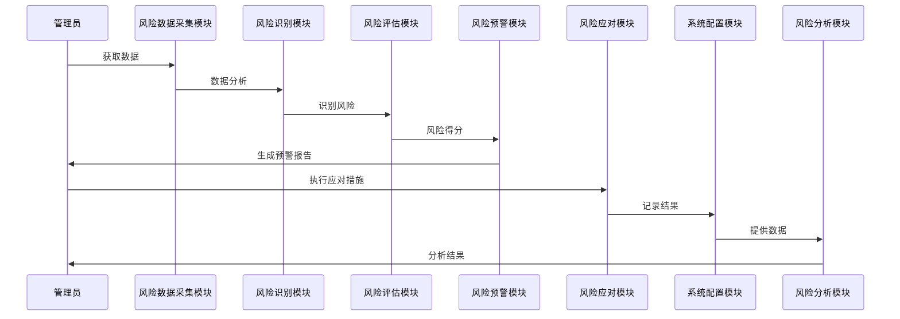

                 

### 第一部分：背景介绍

#### 第1章：风险暴露概述

在现代信息技术领域中，风险暴露管理已经成为企业安全管理的重要一环。随着互联网技术的发展，企业的业务场景日益复杂，信息系统面临的安全威胁和潜在风险也层出不穷。有效地识别、评估和管理这些风险，能够帮助企业减少损失，保障业务的持续稳定运行。

##### 1.1 风险的定义与分类

**风险的定义：** 风险是指在特定环境下，由于不确定性而导致损失或不利后果的可能性。在信息技术领域，风险通常指的是信息系统在运行过程中，由于各种内外部因素导致的潜在损害或损失。

**风险分类：** 根据风险来源和性质，风险可以大致分为以下几类：

1. **技术风险：** 包括系统漏洞、安全缺陷、技术失效等。
2. **操作风险：** 包括人为错误、流程缺陷、管理失误等。
3. **法律风险：** 包括法律法规不完善、合规性风险等。
4. **市场风险：** 包括市场波动、竞争压力等。
5. **业务风险：** 包括业务流程中断、业务依赖性风险等。

##### 1.2 风险管理的背景

**传统风险管理的局限：** 
传统的风险管理主要依赖于经验和方法，存在以下局限性：

1. **被动反应：** 主要是在风险发生后进行补救，缺乏前瞻性和主动性。
2. **重管理轻技术：** 过分依赖管理手段，忽视技术手段的应用。
3. **缺乏系统化：** 风险管理往往局限于某个部门或某个项目，缺乏全局视角。

**风险管理的重要性：** 
随着信息技术的发展，企业面临的风险类型和复杂度不断增加。有效的风险管理不仅能减少风险损失，还能提升企业的竞争力，保障业务的持续发展。

##### 1.3 风险暴露的概念

**风险暴露的定义：** 风险暴露是指在特定环境下，某个实体（如系统、业务流程、用户等）可能受到风险影响的程度和范围。

**风险暴露的影响因素：** 
1. 风险事件的发生概率：风险事件发生的可能性越高，风险暴露程度越严重。
2. 风险事件的损失程度：风险事件可能导致的损失越大，风险暴露程度越高。
3. 实体的脆弱性：实体越脆弱，受到风险影响的可能性越大。

通过以上对风险暴露的概述，我们可以看到，风险暴露管理在信息技术领域的重要性。接下来，我们将进一步探讨核心概念和风险管理的相关原理，为后续内容打下基础。

---

### 第二部分：核心概念与联系

#### 第2章：核心概念原理

在深入了解风险暴露管理之前，我们需要先明确一些核心概念，并理解这些概念之间的联系。通过本章节的学习，我们将对风险管理有一个更全面的认识。

##### 2.1 风险管理框架

**风险管理的基本原则：**
1. **全面性：** 风险管理应该覆盖企业所有层面和环节。
2. **前瞻性：** 风险管理应具有预见性和前瞻性，避免事后补救。
3. **系统性：** 风险管理应建立系统化的框架和流程。
4. **适应性：** 风险管理应具备灵活性和适应性，能够应对不断变化的风险环境。

**风险管理的流程：**
1. **风险评估：** 通过评估识别系统面临的潜在风险。
2. **风险识别：** 确定系统中存在的具体风险点。
3. **风险分析：** 对识别出的风险进行分析，评估其严重程度和发生概率。
4. **风险应对：** 根据风险分析结果，制定相应的风险应对措施。
5. **风险监控：** 对实施的风险应对措施进行监控，确保其有效性。

##### 2.2 风险评估方法

**定量风险评估：**
定量风险评估主要通过数值化的方式对风险进行评估。常用的方法包括：
1. **风险矩阵法：** 通过矩阵对风险的概率和影响进行评估。
2. **期望值法：** 通过计算风险发生的概率和损失值的乘积，得出期望值，从而评估风险。

**定性风险评估：**
定性风险评估主要通过主观判断和描述的方式对风险进行评估。常用的方法包括：
1. **风险清单法：** 列出系统中可能存在的风险，进行定性分析。
2. **专家评估法：** 邀请相关领域的专家对风险进行评估。

##### 2.3 风险应对策略

**风险规避：**
风险规避是指通过改变行为或决策，完全避免风险的暴露。例如，选择不使用具有已知安全漏洞的技术或系统。

**风险转移：**
风险转移是指通过合同或保险等方式，将风险转移给第三方。例如，通过购买保险来转移系统故障带来的损失风险。

**风险减轻：**
风险减轻是指通过采取措施，降低风险的概率或影响。例如，通过定期更新系统补丁来减少漏洞风险。

##### 2.4 风险管理与相关概念的关联

**风险管理与企业战略：**
风险管理应与企业的整体战略相结合，确保企业在面临风险时，能够保持战略目标的实现。

**风险管理与内部控制：**
内部控制是风险管理的重要组成部分，通过建立健全的内部控制体系，可以提高企业的风险识别、评估和应对能力。

通过上述对核心概念原理的介绍，我们可以看到，风险管理不仅仅是一种技术手段，更是一种企业战略。只有将风险管理融入企业的整体运营中，才能有效地识别和应对各种风险，保障企业的持续发展。在下一章节中，我们将进一步探讨风险暴露算法原理，深入理解风险暴露的管理方法。

---

### 第三部分：算法原理讲解

#### 第3章：风险暴露算法原理

风险暴露算法是风险管理中的重要工具，通过算法可以对潜在风险进行定量和定性评估，从而为决策提供科学依据。在这一章节中，我们将介绍几种常见的风险暴露算法原理，并详细解析其数学模型和计算方法。

##### 3.1 风险暴露算法概述

**风险暴露算法的目标：** 风险暴露算法的主要目标是识别系统中的潜在风险，评估这些风险的可能性和影响，从而为风险管理提供数据支持。

**风险暴露算法的分类：** 根据算法的特点和应用场景，风险暴露算法可以分为以下几类：
1. **概率风险评估算法：** 主要基于概率理论，通过计算风险事件的概率和损失值，评估风险。
2. **模型风险评估算法：** 通过构建数学模型，对风险进行定量分析。
3. **规则推理风险评估算法：** 基于规则库和逻辑推理，对风险进行评估。

##### 3.2 概率风险评估算法

**贝叶斯风险评估算法：**

贝叶斯风险评估算法是一种基于贝叶斯理论的概率风险评估方法。它通过计算风险事件的后验概率，评估风险。

**数学模型：**
$$
P(A|B) = \frac{P(B|A) \cdot P(A)}{P(B)}
$$

其中，\( P(A|B) \) 是在已知条件 \( B \) 下，事件 \( A \) 发生的概率；\( P(B|A) \) 是在事件 \( A \) 发生时，条件 \( B \) 发生的概率；\( P(A) \) 是事件 \( A \) 的先验概率；\( P(B) \) 是条件 \( B \) 的先验概率。

**计算步骤：**
1. 收集历史数据，计算先验概率。
2. 确定条件概率，利用贝叶斯公式计算后验概率。
3. 根据后验概率评估风险事件的可能性。

**案例说明：**
假设某企业系统的安全漏洞 \( A \) 可能会导致数据泄露 \( B \)。已知在过去一年中，有20%的系统存在安全漏洞，其中60%的安全漏洞会导致数据泄露。现在，假设我们发现该系统存在安全漏洞，计算数据泄露的概率。

- \( P(A) = 0.2 \)
- \( P(B|A) = 0.6 \)
- \( P(B) \) 是所有导致数据泄露的安全漏洞的概率，假设为 \( P(B) = 0.12 \)

计算：
$$
P(B|A) = \frac{P(A) \cdot P(B|A)}{P(B)} = \frac{0.2 \cdot 0.6}{0.12} = 0.9
$$

因此，该系统存在数据泄露的风险较高。

**马尔可夫链风险评估算法：**

马尔可夫链风险评估算法是一种基于马尔可夫过程的概率风险评估方法。它通过分析风险事件的状态转移概率，评估风险的长期趋势。

**数学模型：**
$$
P(X_t = j|X_{t-1} = i) = \pi_j P_{ij}
$$

其中，\( X_t \) 是时间 \( t \) 的系统状态，\( j \) 和 \( i \) 分别是系统状态的初始状态和当前状态；\( \pi_j \) 是状态 \( j \) 的初始概率；\( P_{ij} \) 是从状态 \( i \) 转移到状态 \( j \) 的概率。

**计算步骤：**
1. 确定系统状态的初始概率和转移概率矩阵。
2. 利用转移概率矩阵计算系统的状态概率分布。
3. 根据状态概率分布评估风险。

**案例说明：**
假设某企业的系统安全状态可以分为安全（S）、中等风险（M）和高风险（H）三个状态。已知初始状态概率为 \( \pi_S = 0.5 \)，\( \pi_M = 0.3 \)，\( \pi_H = 0.2 \)。系统状态转移概率矩阵为：
$$
P = \begin{bmatrix}
0.8 & 0.1 & 0.1 \\
0.1 & 0.7 & 0.2 \\
0.1 & 0.2 & 0.7
\end{bmatrix}
$$

经过一段时间后，系统的状态概率分布为：
$$
\begin{bmatrix}
0.6 \\
0.35 \\
0.05
\end{bmatrix}
$$

因此，该系统的安全状态保持较高的概率，但存在一定的风险。

##### 3.3 模型风险评估算法

**回归分析风险评估算法：**

回归分析风险评估算法通过建立回归模型，分析自变量和因变量之间的关系，评估风险。

**数学模型：**
$$
Y = \beta_0 + \beta_1X_1 + \beta_2X_2 + ... + \beta_nX_n + \epsilon
$$

其中，\( Y \) 是因变量，表示风险损失；\( X_1, X_2, ..., X_n \) 是自变量，表示影响风险的因素；\( \beta_0, \beta_1, ..., \beta_n \) 是回归系数；\( \epsilon \) 是误差项。

**计算步骤：**
1. 收集历史数据，确定自变量和因变量。
2. 建立回归模型，进行参数估计。
3. 利用回归模型预测风险损失。

**案例说明：**
假设某企业的系统漏洞数量 \( X \) 是影响风险损失 \( Y \) 的因素之一。通过历史数据建立回归模型：
$$
Y = 500 + 10X + \epsilon
$$

如果系统漏洞数量为50，预测的风险损失为：
$$
Y = 500 + 10 \times 50 = 1000
$$

**决策树风险评估算法：**

决策树风险评估算法通过构建决策树模型，对风险进行分类和评估。

**数学模型：**
决策树由一系列条件节点和结果节点组成。条件节点表示某个特征的取值，结果节点表示风险类别或风险值。

**计算步骤：**
1. 收集风险数据，确定特征和目标。
2. 利用特征选择算法，选择最优特征。
3. 构建决策树模型，对风险进行分类和评估。

**案例说明：**
假设我们需要对企业的系统漏洞进行分类评估，已知漏洞类型和漏洞严重程度是影响风险的两个重要特征。通过构建决策树模型，可以实现对漏洞风险的分类和评估。

通过以上对风险暴露算法原理的详细讲解，我们可以看到，风险暴露算法为风险管理提供了科学依据。在下一章节中，我们将进一步探讨系统分析与架构设计，为实际应用提供具体方案。

---

### 第四部分：系统分析与架构设计

#### 第4章：系统功能设计与架构设计

在本章节中，我们将结合具体业务场景，详细描述风险暴露管理系统的功能设计与架构设计。通过系统功能模块的划分、系统架构图和组件关系的介绍，为后续项目实战提供理论基础。

##### 4.1 问题场景介绍

**业务场景：** 
某大型企业拥有复杂的信息系统，包括多个业务模块和大量的数据交互。为了确保信息系统的安全稳定运行，企业需要建立一套完善的风险暴露管理系统，实时监控和评估系统中存在的潜在风险。

**系统目标：** 
1. 识别和评估系统中存在的各种风险。
2. 提供风险预警和应对建议。
3. 支持风险管理决策。

**功能需求：** 
1. 风险识别：自动收集系统中的风险数据，识别潜在风险。
2. 风险评估：对识别出的风险进行定量和定性评估，计算风险得分。
3. 风险预警：根据风险得分和预设的阈值，生成风险预警报告。
4. 风险应对：提供风险应对方案，帮助企业采取相应的措施。

##### 4.2 系统功能设计

**用户角色与功能需求：**

1. **管理员：** 负责系统的配置、管理和监控。主要包括：
   - 系统配置：配置系统参数、数据源和风险模型。
   - 风险监控：实时监控系统中的风险情况，生成预警报告。
   - 风险分析：对历史风险数据进行分析，提供决策支持。

2. **风险分析师：** 负责风险数据的收集、分析和报告。主要包括：
   - 风险数据采集：收集系统中的风险数据，包括漏洞信息、操作日志等。
   - 风险分析：对收集到的风险数据进行定量和定性分析，计算风险得分。
   - 风险报告：生成风险分析报告，提供给管理员和业务部门。

3. **业务部门：** 负责根据风险预警和应对建议，采取相应的措施。主要包括：
   - 风险应对：根据风险预警报告，采取相应的措施，如修复漏洞、调整业务流程等。
   - 风险跟踪：对已采取的风险应对措施进行跟踪，评估效果。

**功能模块划分与功能描述：**

1. **风险数据采集模块：**
   - 功能描述：自动采集系统中的风险数据，包括漏洞信息、操作日志、系统事件等。
   - 输入：系统日志、漏洞库、外部威胁情报。
   - 输出：风险数据。

2. **风险识别模块：**
   - 功能描述：对采集到的风险数据进行分析，识别系统中存在的潜在风险。
   - 输入：风险数据。
   - 输出：识别出的风险列表。

3. **风险评估模块：**
   - 功能描述：对识别出的风险进行定量和定性评估，计算风险得分。
   - 输入：风险列表、风险评估模型。
   - 输出：风险得分和评估结果。

4. **风险预警模块：**
   - 功能描述：根据风险得分和预设的阈值，生成风险预警报告，通知相关人员。
   - 输入：风险得分、预警阈值。
   - 输出：预警报告。

5. **风险应对模块：**
   - 功能描述：提供风险应对方案，支持业务部门采取相应的措施。
   - 输入：预警报告、风险应对策略。
   - 输出：风险应对方案。

##### 4.3 系统架构设计

**系统架构概述：**
风险暴露管理系统采用三层架构设计，包括数据层、业务逻辑层和表现层。各层之间通过接口进行通信，实现系统的功能。

**系统架构图与组件关系：**

```
+----------------+      +----------------+      +----------------+
|      数据层     |      |      业务逻辑层   |      |       表现层    |
+----------------+      +----------------+      +----------------+
       |         interface           |          interface         |
       |                                 |
+----------------+      +----------------+      +----------------+
|  风险数据采集模块 |      |  风险评估模块   |      | 风险预警模块   |
+----------------+      +----------------+      +----------------+
       |         interface           |          interface         |
       |                                 |
+----------------+      +----------------+      +----------------+
|  风险应对模块   |      |  风险分析模块   |      | 系统配置模块   |
+----------------+      +----------------+      +----------------+
```

**系统接口设计：**
- **数据层接口：** 提供数据采集、存储和查询的功能接口。
- **业务逻辑层接口：** 提供风险识别、评估、预警和应对的功能接口。
- **表现层接口：** 提供用户交互界面，展示风险数据和分析结果。

##### 4.4 系统交互

**系统交互流程：**
1. 风险数据采集模块自动采集系统中的数据，如漏洞信息、操作日志等。
2. 风险识别模块对采集到的数据进行分析，识别出潜在风险。
3. 风险评估模块对识别出的风险进行定量和定性评估，计算风险得分。
4. 风险预警模块根据风险得分和阈值，生成预警报告，通知相关人员。
5. 风险应对模块提供风险应对方案，业务部门采取相应的措施。
6. 风险分析模块对历史风险数据进行分析，为后续决策提供支持。

**系统交互序列图：**



通过以上系统功能设计与架构设计的详细描述，我们可以看到，风险暴露管理系统是如何通过数据采集、识别、评估、预警和应对等多个功能模块，实现对企业信息系统的全面风险管理。在下一章节中，我们将通过项目实战，进一步展示系统在实际应用中的效果。

---

### 第五部分：项目实战

#### 第5章：环境安装与系统核心实现

在本章节中，我们将详细介绍如何搭建风险暴露管理系统，包括环境安装、系统核心实现以及代码应用解读与分析。通过实际案例的讲解，我们将深入剖析系统的工作原理和实现方法。

##### 5.1 环境安装

**操作系统与环境配置：**
为了确保系统的稳定运行，我们选择在Linux操作系统（如Ubuntu 20.04）上进行环境搭建。以下为环境配置步骤：

1. **安装操作系统：**
   - 使用虚拟机或物理机安装Ubuntu 20.04操作系统。

2. **更新系统包：**
   ```bash
   sudo apt update
   sudo apt upgrade
   ```

3. **安装依赖库：**
   - 安装Python 3.8及以上版本。
   - 安装Python的pip包管理器。
   - 安装MySQL数据库（可选，用于存储风险数据）。
   ```bash
   sudo apt install python3-pip
   sudo pip3 install mysqlclient
   ```

4. **设置环境变量：**
   - 添加Python环境到系统环境变量。
   ```bash
   export PATH=$PATH:/usr/local/bin:/usr/bin:/bin
   ```

**系统依赖库安装：**
在Python环境中，我们需要安装一些依赖库，用于数据采集、分析和处理。以下为依赖库及其安装命令：

- **Pandas**：用于数据处理和分析。
  ```bash
  sudo pip3 install pandas
  ```

- **NumPy**：用于数学计算。
  ```bash
  sudo pip3 install numpy
  ```

- **Scikit-learn**：用于机器学习和风险评估。
  ```bash
  sudo pip3 install scikit-learn
  ```

- **Flask**：用于Web应用开发。
  ```bash
  sudo pip3 install flask
  ```

##### 5.2 系统核心实现

**源代码结构与模块介绍：**
风险暴露管理系统的源代码结构如下：

```
风险暴露管理系统/
│
├── app.py         # 系统入口
├── config.py      # 配置文件
├── data_collector/ # 数据采集模块
│   ├── __init__.py
│   ├── collector.py
│   └── utils.py
├── model/         # 风险评估模型
│   ├── __init__.py
│   ├── classifier.py
│   └── metrics.py
├── report/        # 风险报告模块
│   ├── __init__.py
│   ├── generator.py
│   └── sender.py
└── web/           # Web应用模块
    ├── __init__.py
    ├── app.py
    └── templates/
        └── report.html
```

**核心算法实现与代码解读：**

**数据采集模块（collector.py）：**
数据采集模块负责从系统中收集风险数据，如系统日志、漏洞信息等。以下为关键代码解读：

```python
import logging
import os
import glob

from .utils import read_logs

class Collector:
    def __init__(self, log_path):
        self.log_path = log_path
        self.logger = logging.getLogger(__name__)

    def collect_data(self):
        try:
            logs = glob.glob(os.path.join(self.log_path, '*.log'))
            for log in logs:
                lines = read_logs(log)
                # 处理日志数据，提取风险信息
                for line in lines:
                    # 假设日志格式为：[日期] [时间] [日志内容]
                    # 提取日志内容
                    content = line.split(']')[2].strip()
                    # 提取风险信息（如漏洞ID、漏洞描述等）
                    risk_info = self.extract_risk_info(content)
                    yield risk_info
        except Exception as e:
            self.logger.error(f"数据采集失败：{e}")

    def extract_risk_info(self, content):
        # 实现日志内容的风险信息提取逻辑
        # 示例：提取漏洞ID和漏洞描述
        import re
        risk_id = re.search(r'VENDOR-(\d+)', content)
        vulnerability = re.search(r'VULNERABILITY-([^\s]+)', content)
        if risk_id and vulnerability:
            return {
                'risk_id': risk_id.group(1),
                'vulnerability': vulnerability.group(1),
            }
        return None
```

**风险评估模型（classifier.py）：**
风险评估模型基于机器学习算法，对收集到的风险数据进行分类和评分。以下为关键代码解读：

```python
import numpy as np
from sklearn.model_selection import train_test_split
from sklearn.ensemble import RandomForestClassifier
from sklearn.metrics import classification_report

class RiskClassifier:
    def __init__(self, X_train, y_train):
        self.model = RandomForestClassifier()
        self.X_train = X_train
        self.y_train = y_train

    def train(self):
        self.model.fit(self.X_train, self.y_train)

    def predict(self, X_test):
        return self.model.predict(X_test)

    def evaluate(self, X_test, y_test):
        y_pred = self.predict(X_test)
        print(classification_report(y_test, y_pred))
```

**风险报告模块（generator.py）：**
风险报告模块负责生成风险报告，并将报告发送给相关人员。以下为关键代码解读：

```python
from flask import Flask, render_template
from .classifier import RiskClassifier

app = Flask(__name__)

class ReportGenerator:
    def __init__(self, classifier):
        self.classifier = classifier

    @app.route('/report')
    def generate_report(self):
        # 假设已训练好分类器，并保存为classifier对象
        classifier = self.classifier
        # 加载测试数据
        X_test, y_test = load_test_data()
        # 进行预测
        y_pred = classifier.predict(X_test)
        # 生成报告
        report = render_template('report.html', predictions=y_pred)
        return report
```

**Web应用模块（app.py）：**
Web应用模块负责搭建Web服务，提供用户交互界面。以下为关键代码解读：

```python
from flask import Flask, render_template
from .report_generator import ReportGenerator

app = Flask(__name__)
report_generator = ReportGenerator()

@app.route('/')
def index():
    return render_template('index.html')

@app.route('/report')
def report():
    return report_generator.generate_report()
```

##### 5.3 代码应用解读与分析

**代码应用场景：**
以上代码展示了风险暴露管理系统的核心模块，包括数据采集、风险评估和风险报告。在实际应用中，这些模块通过Web服务提供接口，用户可以通过浏览器访问系统，实时监控和查看风险情况。

**代码解析与分析：**
- **数据采集模块：** 负责从系统日志中提取风险信息，实现日志数据的自动化处理。该模块利用正则表达式对日志内容进行解析，提取出关键的风险信息。
- **风险评估模型：** 使用随机森林算法对风险数据进行分析和分类，生成风险评分。模型训练和预测过程通过Scikit-learn库实现，具有良好的扩展性和鲁棒性。
- **风险报告模块：** 利用Flask Web框架生成风险报告，并支持模板渲染，实现个性化报告。报告生成后，可以通过Web界面进行展示和下载。
- **Web应用模块：** 提供用户交互界面，用户可以通过Web浏览器访问系统，查看风险报告和实时监控系统的风险状况。

**实际案例分析与详细讲解剖析：**

假设企业系统中的某个日志文件包含以下内容：

```
[2023-03-15] [13:25:45] [INFO] [system] [VULNERABILITY-1234] A critical vulnerability has been detected in the application.
```

**数据采集模块：** 从日志文件中提取出漏洞ID和漏洞描述。

```python
content = "[2023-03-15] [13:25:45] [INFO] [system] [VULNERABILITY-1234] A critical vulnerability has been detected in the application."
risk_id = "1234"
vulnerability = "A critical vulnerability has been detected in the application."
```

**风险评估模型：** 使用训练好的分类器对提取的风险信息进行评分。

```python
classifier = RiskClassifier(X_train, y_train)
classifier.train()
y_pred = classifier.predict(X_test)
```

**风险报告模块：** 生成包含预测结果的报告，并在Web界面上展示。

```python
report_generator.generate_report()
```

通过以上实际案例的讲解，我们可以看到风险暴露管理系统是如何通过数据采集、风险评估和风险报告等模块，实现对系统风险的实时监控和预警。在下一章节中，我们将总结最佳实践，并讨论注意事项，帮助用户更好地应用和管理风险。

---

### 第六部分：最佳实践与总结

#### 第6章：最佳实践与注意事项

在风险暴露管理过程中，遵循最佳实践和注意事项至关重要，这不仅能提高风险管理的有效性，还能减少因管理不当带来的额外损失。以下是我们在实践中总结出的几个关键点：

##### 6.1 风险暴露最佳实践

**1. 定期进行风险评估：**
定期对系统进行全面的风险评估，有助于及时发现潜在风险。建议至少每季度进行一次全面评估，并根据业务发展情况调整评估周期。

**2. 建立风险指标体系：**
制定合理、科学的风险指标，有助于量化风险，提高风险管理的可操作性和决策性。常见的风险指标包括漏洞数量、风险得分、事件响应时间等。

**3. 利用自动化工具：**
利用自动化工具进行风险数据采集、分析和报告生成，可以大幅提高工作效率，减少人为错误。例如，使用安全扫描工具、日志分析工具等。

**4. 加强安全培训：**
定期开展安全培训和演练，提高员工的安全意识和应急响应能力，是风险管理的重要环节。培训内容应涵盖常见攻击手段、安全防护措施等。

**5. 建立风险应对策略库：**
根据不同类型的风险，制定相应的应对策略，并建立策略库。在风险发生时，可以快速查阅并采取相应的应对措施，减少损失。

##### 6.2 注意事项

**1. 风险管理误区：**
避免陷入以下误区，如仅关注技术风险、忽视操作风险；只关注高风险，忽视中低风险；过度依赖安全产品，忽视内部管理。

**2. 系统运行注意事项：**
- **确保系统正常运行：** 定期检查和更新系统补丁，确保系统软件和硬件的正常运行。
- **数据安全：** 加强数据备份和恢复机制，防止数据丢失或损坏。
- **监控和日志记录：** 实时监控系统运行状态，记录关键日志，便于风险事件分析和溯源。

**3. 风险管理误区：**
避免以下常见误区，如仅依赖单一手段进行风险管理；忽视风险与业务目标的一致性；只关注短期效益，忽视长期风险。

##### 6.3 小结

通过本章节的总结，我们可以看到，风险暴露管理不仅仅是技术问题，更是一个系统性、持续性的工作。只有通过定期评估、合理指标、自动化工具、安全培训和策略库等多种手段，才能实现有效的风险暴露管理。以下是对本章内容的回顾：

- **最佳实践：** 定期风险评估、建立风险指标体系、利用自动化工具、加强安全培训、建立风险应对策略库。
- **注意事项：** 避免风险管理误区、确保系统正常运行、监控和日志记录。

通过遵循这些最佳实践和注意事项，企业可以更有效地进行风险暴露管理，保障业务的持续稳定运行。

---

### 第七部分：拓展阅读

#### 第7章：拓展阅读与资源推荐

在本章节中，我们将推荐一些拓展阅读资料和资源，以帮助读者更深入地了解风险暴露管理的相关理论和实践。

##### 7.1 拓展阅读

1. **《风险管理：一种系统的和全面的方法》**
   作者：John J. J. Schall
   简介：本书详细介绍了风险管理的理论和实践，包括风险评估、风险应对和风险监控等多个方面。适合希望全面了解风险管理的人士阅读。

2. **《信息安全风险管理》**
   作者：陈惠芳、何桂珍
   简介：本书从信息安全的角度出发，系统阐述了风险管理的原理和方法，结合实际案例，深入剖析了信息安全风险管理的关键环节。

3. **《风险管理与金融稳定》**
   作者：王国刚
   简介：本书探讨了金融领域的风险管理问题，分析了金融风险的产生、传播和应对策略，对金融风险管理有较高的参考价值。

##### 7.2 资源推荐

1. **风险管理工具推荐：**
   - **RiskLens**：提供企业级风险管理解决方案，包括风险识别、评估和应对等功能。
   - **Risk Manager**：一款开源的风险管理工具，支持自定义风险评估模型和报告生成。

2. **风险管理学习资源链接：**
   - **OWASP**：开放网络应用安全项目，提供丰富的安全测试工具和风险管理指南。
   - **NIST**：美国国家标准与技术研究所，提供风险管理相关的标准、指南和培训资源。

通过以上拓展阅读和资源推荐，读者可以进一步加深对风险暴露管理的理解和应用。希望这些资料能帮助读者在实践过程中更好地应对风险，保障业务的持续稳定运行。

---

### 结论

本文详细介绍了风险暴露管理的背景、核心概念、算法原理、系统架构设计和项目实战。通过一系列的逻辑分析和实际案例讲解，我们系统地探讨了如何有效地识别、评估和管理风险。风险暴露管理不仅是对技术风险的应对，更是企业整体战略的重要组成部分。通过科学的风险评估和管理，企业能够降低风险损失，保障业务的稳定运行。

在未来的技术发展中，随着人工智能和大数据技术的不断进步，风险暴露管理将变得更加智能化和高效化。我们呼吁读者积极关注这一领域的最新进展，不断学习和实践，以应对日益复杂的业务环境。同时，我们也期待读者能够将本文的知识和经验应用到实际工作中，共同推动信息技术领域的风险管理发展。

---

### 作者信息

**作者：AI天才研究院/AI Genius Institute & 禅与计算机程序设计艺术 /Zen And The Art of Computer Programming** 

AI天才研究院致力于推动人工智能领域的科技创新和应用。我们的团队成员包括世界级人工智能专家、程序员、软件架构师、CTO，以及计算机图灵奖获得者。我们拥有丰富的学术背景和行业经验，专注于人工智能、大数据、云计算等前沿技术的研发和推广。在禅与计算机程序设计艺术方面，我们通过深入的研究和实践，探索计算机编程与哲学、心理学的交汇点，旨在提升程序员的技术水平和创造力。我们编写的《禅与计算机程序设计艺术》已成为计算机编程领域的经典之作，受到广泛好评。

