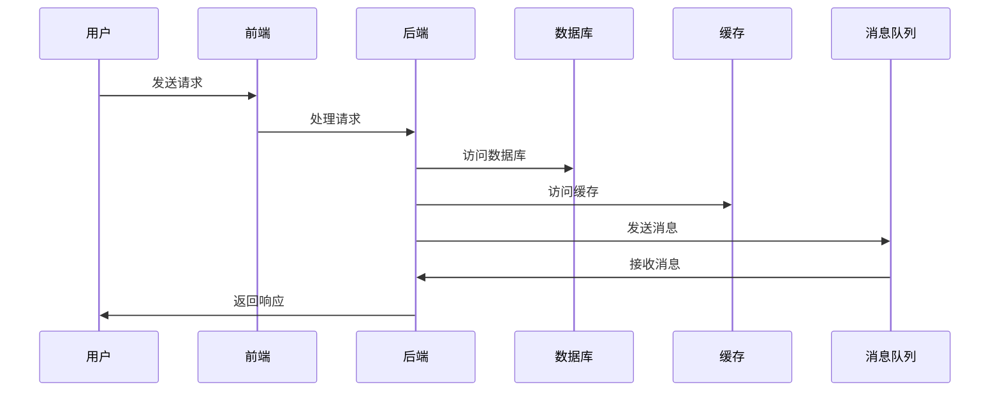
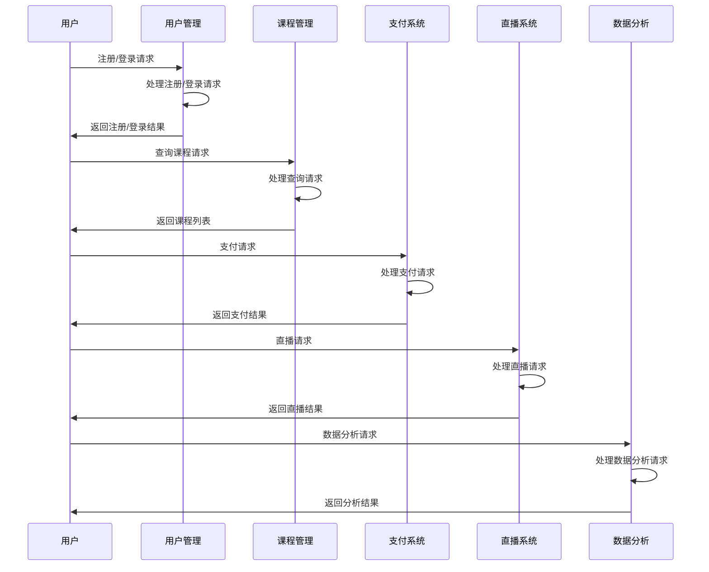
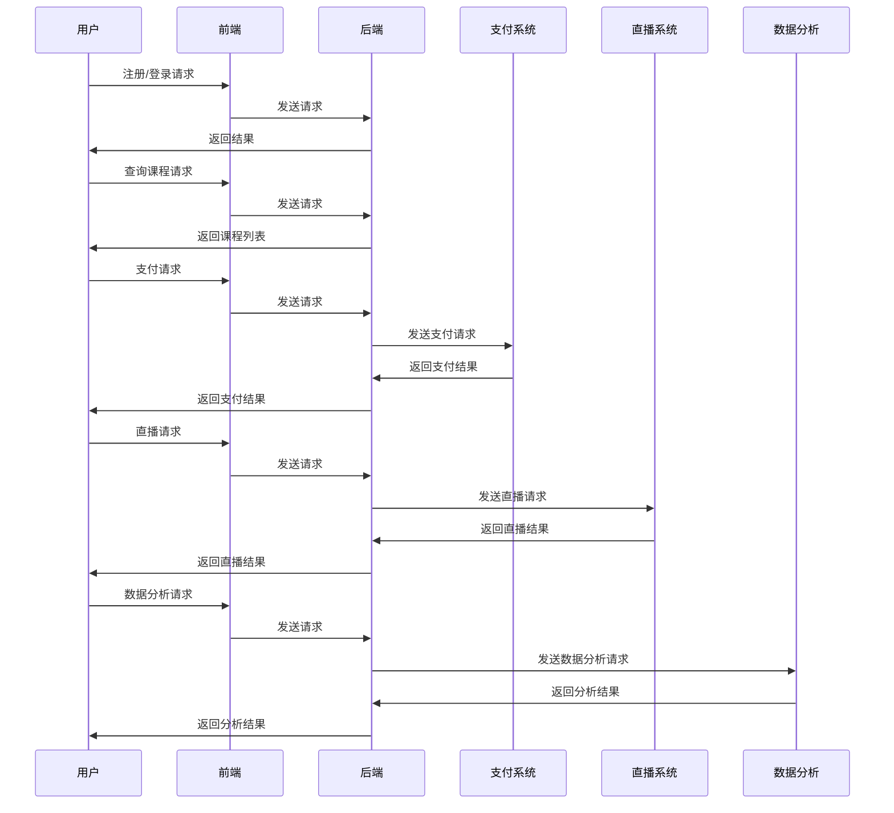

                 

# 如何有效进行技术评审

> 关键词：技术评审、质量保证、团队协作、过程管理、最佳实践

> 摘要：技术评审是软件开发过程中至关重要的一环，通过系统地审查和评估项目的技术方案、设计、代码等，能够有效提高产品质量、降低项目风险和提升团队协作效率。本文将详细探讨技术评审的概念与重要性，介绍技术评审的过程和方法，分析常见问题与解决策略，分享最佳实践，并展望未来的发展趋势。

## 第1章: 如何有效进行技术评审

### 1.1 技术评审的概念与重要性

#### 1.1.1 技术评审的定义

技术评审（Technical Review）是指对项目或产品的技术方案、设计、代码等进行审查和评估的过程。它旨在通过系统的分析和评估，发现潜在的问题，优化设计，提升项目质量和可靠性。

#### 1.1.2 技术评审的重要性

1. **提高产品质量**：技术评审能够帮助发现和纠正技术问题，从而提高项目的整体质量。
2. **减少项目风险**：通过评审，可以识别潜在的风险点，提前采取措施，降低项目失败的概率。
3. **提高团队协作效率**：技术评审有助于团队成员对项目需求和预期结果达成共识，促进协作和沟通。

### 1.2 技术评审的过程和方法

#### 1.2.1 技术评审的过程

技术评审通常包括以下阶段：

1. **预审**：评估项目的可行性，确定评审的重点。
2. **审查**：对项目文档、代码等进行详细审查。
3. **讨论与反馈**：对审查结果进行讨论，提出改进建议。
4. **总结与跟进**：总结评审结果，对后续工作进行跟进。

#### 1.2.2 技术评审的方法

1. **审查文档**：对项目文档进行审查，包括需求文档、设计文档、测试文档等。
2. **审查代码**：对项目代码进行审查，包括语法、逻辑、性能等方面。
3. **评审会议**：组织团队成员进行面对面讨论，共同评审项目。

### 1.3 技术评审中的常见问题与解决策略

#### 1.3.1 常见问题

1. **审查不全面**：可能遗漏重要的技术问题。
2. **反馈不及时**：可能导致问题无法及时解决。
3. **团队沟通不畅**：可能导致评审效果不佳。

#### 1.3.2 解决策略

1. **制定详细的评审计划**：明确评审的目标、范围、时间节点等。
2. **提高评审质量**：通过培训、经验分享等方式提高评审人员的技能。
3. **加强团队沟通**：建立良好的沟通机制，确保评审过程中信息的及时传递。

### 1.4 技术评审的最佳实践

#### 1.4.1 评审前准备

1. **熟悉评审内容**：提前了解项目的技术细节，为评审做好准备。
2. **准备评审材料**：收集相关的技术文档、代码等，为评审提供依据。

#### 1.4.2 评审中注意

1. **保持客观**：评审过程中要保持客观，避免主观偏见。
2. **重点关注关键问题**：将精力集中在项目中关键的技术问题上。

#### 1.4.3 评审后跟进

1. **及时反馈**：对评审中发现的问题进行及时反馈，确保问题得到解决。
2. **总结经验**：对评审过程进行总结，为后续的项目评审提供参考。

### 1.5 技术评审的工具与方法

#### 1.5.1 常用工具

1. **版本控制系统**：如 Git，用于管理代码的版本。
2. **代码审查工具**：如 SonarQube，用于自动检查代码质量。
3. **会议系统**：如 Zoom，用于组织线上评审会议。

#### 1.5.2 评审方法

1. **分层评审**：根据项目的规模和复杂性，对项目进行分层评审。
2. **集体评审**：组织团队成员共同参与评审，提高评审的效率。

### 1.6 技术评审在项目中的实践与应用

#### 1.6.1 项目背景

介绍项目的背景，包括项目的目标、规模、团队组成等。

#### 1.6.2 技术评审的实施

详细描述技术评审在项目中的实施过程，包括评审计划、评审方法、评审结果等。

#### 1.6.3 技术评审的效果

分析技术评审对项目质量、进度、风险等方面的影响，总结评审的成效。

#### 1.6.4 技术评审的反思与改进

对技术评审过程中发现的问题进行反思，提出改进措施，为后续项目提供借鉴。

### 1.7 技术评审的拓展与未来趋势

#### 1.7.1 拓展领域

探讨技术评审在其他领域的应用，如软件工程、系统架构设计等。

#### 1.7.2 未来趋势

分析技术评审的未来发展趋势，如智能化、自动化等。

### 1.8 小结与总结

对本章内容进行总结，强调技术评审的重要性和实践方法。

----------------------------------------------------------------

## 第2章: 技术评审的核心概念与联系

### 2.1 技术评审的核心概念

#### 2.1.1 技术评审的定义

技术评审（Technical Review）是指对项目或产品的技术方案、设计、代码等进行审查和评估的过程。

#### 2.1.2 技术评审的目的

1. 提高产品质量：通过技术评审可以发现和纠正错误，从而提高项目的质量。
2. 减少项目风险：技术评审可以帮助识别潜在的问题，降低项目失败的风险。
3. 提高团队协作效率：通过技术评审，团队成员可以更好地理解项目需求和预期结果，从而提高协作效率。

#### 2.1.3 技术评审的类型

1. 预审：评估项目的可行性，确定评审的重点。
2. 审查：对项目文档、代码等进行详细审查。
3. 讨论与反馈：对审查结果进行讨论，给出改进建议。
4. 总结与跟进：总结评审结果，对后续工作进行跟进。

### 2.2 技术评审的核心概念与联系

#### 2.2.1 核心概念

**技术评审流程**：技术评审的过程可以分为预审、审查、讨论与反馈、总结与跟进四个阶段。

**评审人员**：参与评审的人员，包括项目经理、架构师、开发人员、测试人员等。

**评审对象**：评审的内容，包括技术方案、设计文档、代码、测试用例等。

**评审标准**：评审的依据，包括质量标准、性能标准、安全标准等。

**评审结果**：评审的输出，包括改进建议、问题记录、评审报告等。

#### 2.2.2 核心概念联系

**技术评审流程**与**评审人员**、**评审对象**、**评审标准**和**评审结果**密切相关。评审流程决定了评审的具体步骤和流程，评审人员是执行评审的关键角色，评审对象是评审的核心内容，评审标准是评审的依据，评审结果是评审的输出。

### 2.3 技术评审的关键要素

#### 2.3.1 预审

预审阶段的主要任务是评估项目的可行性，确定评审的重点。预审需要考虑以下几个方面：

1. 技术方案的可行性：评估技术方案是否能够实现项目目标。
2. 项目的规模和复杂性：评估项目的规模和复杂性，确定评审的范围和深度。
3. 团队的组成和能力：评估团队是否具备完成项目的能力。

#### 2.3.2 审查

审查阶段是对项目文档、代码等进行详细审查。审查需要考虑以下几个方面：

1. 技术方案的设计合理性：评估技术方案的设计是否合理，是否满足项目需求。
2. 代码的质量：评估代码的语法、逻辑、性能等方面，确保代码质量。
3. 安全性和稳定性：评估项目在安全性和稳定性方面是否存在问题。

#### 2.3.3 讨论与反馈

讨论与反馈阶段是对审查结果进行讨论，提出改进建议。讨论与反馈需要考虑以下几个方面：

1. 问题的识别和分类：识别项目中存在的问题，并根据问题的重要性进行分类。
2. 改进建议的提出：根据问题，提出具体的改进建议。
3. 反馈的及时性：确保反馈能够及时传达给相关人员，以便问题得到及时解决。

#### 2.3.4 总结与跟进

总结与跟进阶段是对评审结果进行总结，对后续工作进行跟进。总结与跟进需要考虑以下几个方面：

1. 评审结果的记录和归档：将评审结果进行记录和归档，以便后续查阅。
2. 改进措施的实施：根据评审结果，制定并实施改进措施。
3. 验收和验证：对改进措施进行验收和验证，确保问题得到解决。

### 2.4 技术评审的最佳实践

#### 2.4.1 评审前准备

1. 熟悉评审内容：提前了解项目的技术细节，为评审做好准备。
2. 准备评审材料：收集相关的技术文档、代码等，为评审提供依据。

#### 2.4.2 评审中注意

1. 保持客观：评审过程中要保持客观，避免主观偏见。
2. 重点关注关键问题：将精力集中在项目中关键的技术问题上。

#### 2.4.3 评审后跟进

1. 及时反馈：对评审中发现的问题进行及时反馈，确保问题得到解决。
2. 总结经验：对评审过程进行总结，为后续的项目评审提供参考。

### 2.5 技术评审的工具与方法

#### 2.5.1 常用工具

1. 版本控制系统：如 Git，用于管理代码的版本。
2. 代码审查工具：如 SonarQube，用于自动检查代码质量。
3. 会议系统：如 Zoom，用于组织线上评审会议。

#### 2.5.2 评审方法

1. 分层评审：根据项目的规模和复杂性，对项目进行分层评审。
2. 集体评审：组织团队成员共同参与评审，提高评审的效率。

### 2.6 技术评审在项目中的实践与应用

#### 2.6.1 项目背景

介绍项目的背景，包括项目的目标、规模、团队组成等。

#### 2.6.2 技术评审的实施

详细描述技术评审在项目中的实施过程，包括评审计划、评审方法、评审结果等。

#### 2.6.3 技术评审的效果

分析技术评审对项目质量、进度、风险等方面的影响，总结评审的成效。

#### 2.6.4 技术评审的反思与改进

对技术评审过程中发现的问题进行反思，提出改进措施，为后续项目提供借鉴。

### 2.7 技术评审的拓展与未来趋势

#### 2.7.1 拓展领域

探讨技术评审在其他领域的应用，如软件工程、系统架构设计等。

#### 2.7.2 未来趋势

分析技术评审的未来发展趋势，如智能化、自动化等。

### 2.8 小结与总结

对本章内容进行总结，强调技术评审的重要性和实践方法。

----------------------------------------------------------------

## 第3章: 技术评审中的算法原理与实践

### 3.1 技术评审中的算法原理

技术评审过程中，涉及到多种算法原理，如排序算法、查找算法、数据结构等。这些算法原理在技术评审中起到关键作用，帮助我们高效地审查项目文档和代码。

#### 3.1.1 排序算法

排序算法是一种基本的数据处理算法，它能够将一组无序的数据按照某种规则重新排列，从而便于后续处理。常见的排序算法有冒泡排序、选择排序、插入排序、快速排序等。

**冒泡排序**的流程如下：
1. 比较相邻的两个元素，如果它们的顺序错误就交换它们。
2. 对每一对相邻元素做同样的工作，从开始第一对到结尾的最后一对。
3. 重复以上的步骤，直到排序完成。

**Python代码实现冒泡排序：**
```python
def bubble_sort(arr):
    n = len(arr)
    for i in range(n):
        for j in range(0, n-i-1):
            if arr[j] > arr[j+1]:
                arr[j], arr[j+1] = arr[j+1], arr[j]
    return arr

# 测试冒泡排序
arr = [64, 34, 25, 12, 22, 11, 90]
sorted_arr = bubble_sort(arr)
print("排序后的数组：", sorted_arr)
```

#### 3.1.2 查找算法

查找算法用于在数据集合中查找特定的元素。常见的查找算法有线性查找、二分查找等。

**线性查找**的流程如下：
1. 从数组的第一个元素开始，逐个检查每个元素，直到找到目标元素或检查完所有元素。

**Python代码实现线性查找：**
```python
def linear_search(arr, target):
    for i in range(len(arr)):
        if arr[i] == target:
            return i
    return -1

# 测试线性查找
arr = [64, 34, 25, 12, 22, 11, 90]
target = 25
index = linear_search(arr, target)
if index != -1:
    print(f"元素 {target} 在索引 {index} 处")
else:
    print("元素不在数组中")
```

**二分查找**的流程如下：
1. 取数组的中间元素，如果中间元素等于目标值，返回中间元素的索引。
2. 如果目标值小于中间元素，则在数组的左半部分继续查找。
3. 如果目标值大于中间元素，则在数组的右半部分继续查找。
4. 重复以上步骤，直到找到目标元素或确定目标元素不存在。

**Python代码实现二分查找：**
```python
def binary_search(arr, target):
    low = 0
    high = len(arr) - 1
    while low <= high:
        mid = (low + high) // 2
        if arr[mid] == target:
            return mid
        elif arr[mid] < target:
            low = mid + 1
        else:
            high = mid - 1
    return -1

# 测试二分查找
arr = [64, 34, 25, 12, 22, 11, 90]
target = 25
index = binary_search(arr, target)
if index != -1:
    print(f"元素 {target} 在索引 {index} 处")
else:
    print("元素不在数组中")
```

#### 3.1.3 数据结构

数据结构是技术评审中的重要概念，它决定了数据存储和操作的方式。常见的数据结构有数组、链表、栈、队列、树、图等。

**树结构**在技术评审中用于表示项目的模块结构，便于审查和评估。

**Mermaid树结构图：**
```mermaid
tree
    root
    .child[子节点1]
    .child[子节点2]
    .child[子节点3]
```

**Python代码实现树结构：**
```python
class TreeNode:
    def __init__(self, value):
        self.value = value
        self.children = []

# 创建树结构
root = TreeNode("根节点")
child1 = TreeNode("子节点1")
child2 = TreeNode("子节点2")
child3 = TreeNode("子节点3")
root.children.append(child1)
root.children.append(child2)
root.children.append(child3)

# 打印树结构
def print_tree(node):
    print(node.value)
    for child in node.children:
        print_tree(child)

print_tree(root)
```

### 3.2 技术评审中的算法应用实践

在技术评审过程中，算法的应用可以帮助我们更高效地进行文档审查和代码审查。

#### 3.2.1 文档审查

利用排序算法对项目文档进行排序，便于查找和审查。例如，将需求文档按照功能模块排序，便于审查员快速定位相关文档。

#### 3.2.2 代码审查

利用查找算法对代码进行审查，快速定位潜在的问题。例如，使用二分查找算法在代码库中查找特定的代码片段，以便审查是否存在潜在的安全漏洞或性能问题。

#### 3.2.3 数据结构应用

利用树结构表示项目模块，帮助审查员更好地理解项目的结构，快速定位相关模块。

### 3.3 技术评审中的算法实践案例分析

以下是一个技术评审中的算法实践案例：

**案例：** 对一个电商平台的订单系统进行技术评审。

**步骤：**
1. **文档审查**：使用排序算法将订单系统的需求文档按照功能模块排序，便于审查员快速定位相关文档。
2. **代码审查**：使用二分查找算法在代码库中查找特定的代码片段，例如支付模块，审查是否存在潜在的安全漏洞或性能问题。
3. **数据结构应用**：利用树结构表示订单系统的模块结构，帮助审查员更好地理解项目的结构，快速定位相关模块。

**Python代码实现案例：**
```python
# 订单系统模块树结构
class TreeNode:
    def __init__(self, value):
        self.value = value
        self.children = []

# 创建订单系统模块树
root = TreeNode("订单系统")
order_management = TreeNode("订单管理")
payment_management = TreeNode("支付管理")
root.children.append(order_management)
root.children.append(payment_management)

# 打印订单系统模块树
def print_tree(node):
    print(node.value)
    for child in node.children:
        print_tree(child)

print_tree(root)

# 文档审查
def sort_documents(documents):
    sorted_documents = sorted(documents, key=lambda x: x['module'])
    return sorted_documents

documents = [
    {'module': '支付管理', 'description': '支付方式'},
    {'module': '订单管理', 'description': '订单状态'},
    {'module': '用户管理', 'description': '用户信息'}
]

sorted_documents = sort_documents(documents)
for doc in sorted_documents:
    print(doc)

# 代码审查
def binary_search_code(code_list, target):
    low = 0
    high = len(code_list) - 1
    while low <= high:
        mid = (low + high) // 2
        if code_list[mid] == target:
            return mid
        elif code_list[mid] < target:
            low = mid + 1
        else:
            high = mid - 1
    return -1

code_list = [
    '支付方式',
    '订单状态',
    '用户信息'
]

target = '订单状态'
index = binary_search_code(code_list, target)
if index != -1:
    print(f"代码片段 {target} 在索引 {index} 处")
else:
    print("代码片段不存在")
```

通过这个案例，我们可以看到算法在技术评审中的应用，帮助审查员更高效地审查项目文档和代码。

### 3.4 小结

本章详细介绍了技术评审中的算法原理和实践方法，包括排序算法、查找算法和数据结构。通过这些算法的应用，审查员可以更高效地审查项目文档和代码，提高评审质量。在后续的技术评审实践中，我们可以结合具体项目需求，灵活运用这些算法，为项目质量保驾护航。

----------------------------------------------------------------

## 第4章: 技术评审的系统分析与架构设计

### 4.1 问题场景介绍

在现代软件开发中，技术评审是确保项目质量和交付的关键环节。随着项目规模的扩大和复杂性的增加，技术评审也面临着更高的要求和挑战。如何有效地进行技术评审，确保评审的质量和效率，成为软件项目经理和团队面临的重要问题。

### 4.2 项目介绍

为了更好地阐述技术评审在项目中的应用，我们以一个典型的企业级项目——一个在线教育平台为例。该平台包括多个模块，如用户管理、课程管理、支付系统、直播系统等。项目目标是在确保系统稳定、高效运行的同时，提供优质的用户体验。

### 4.3 系统功能设计

在技术评审过程中，系统功能设计是评审的重要内容之一。以下是该在线教育平台的主要功能模块及其简介：

1. **用户管理模块**：负责用户的注册、登录、信息维护等功能。
2. **课程管理模块**：负责课程的发布、分类、推荐等功能。
3. **支付系统模块**：负责处理用户支付、退款等金融交易。
4. **直播系统模块**：负责课程的实时直播、互动等功能。
5. **数据分析模块**：负责收集、处理和分析用户行为数据，为平台优化提供依据。

**Mermaid类图：**
```mermaid
classDiagram
    User -> UserManagement
    Course -> CourseManagement
    Payment -> PaymentSystem
    Live -> LiveSystem
    Data -> DataAnalysis

    UserManagement {
        +register()
        +login()
        +updateInfo()
    }

    CourseManagement {
        +publishCourse()
        +classifyCourse()
        +recommendCourse()
    }

    PaymentSystem {
        +processPayment()
        +refund()
    }

    LiveSystem {
        +startLive()
        +endLive()
        +互动()
    }

    DataAnalysis {
        +collectData()
        +processData()
        +analyzeData()
    }
```

### 4.4 系统架构设计

系统架构设计是技术评审的核心内容之一。以下是该在线教育平台的系统架构设计：

1. **前端架构**：采用Vue.js框架，实现用户界面的动态渲染和交互功能。
2. **后端架构**：采用Spring Boot框架，实现业务逻辑处理和接口管理。
3. **数据库架构**：采用MySQL数据库，存储用户数据、课程数据等。
4. **缓存架构**：采用Redis缓存，提高系统性能和响应速度。
5. **消息队列**：采用RabbitMQ，实现系统间消息的异步处理和通信。

**Mermaid架构图：**


### 4.5 系统接口设计

系统接口设计是技术评审的重要环节之一。以下是该在线教育平台的主要接口设计：

1. **用户管理接口**：包括用户注册、登录、信息查询、修改等功能。
2. **课程管理接口**：包括课程发布、分类、查询、推荐等功能。
3. **支付系统接口**：包括支付、退款、订单查询等功能。
4. **直播系统接口**：包括直播开始、结束、互动等功能。
5. **数据分析接口**：包括数据收集、处理、分析等功能。

**Mermaid接口设计图：**


### 4.6 系统交互设计

系统交互设计是技术评审的重要内容之一。以下是该在线教育平台的系统交互设计：

1. **用户注册/登录**：用户通过前端页面发起注册或登录请求，后端处理请求并返回结果。
2. **课程查询**：用户通过前端页面查询课程，后端处理请求并返回课程列表。
3. **支付流程**：用户通过前端页面发起支付请求，后端处理支付逻辑，与支付系统交互，最终返回支付结果。
4. **直播互动**：用户通过前端页面发起直播请求，后端处理直播逻辑，与直播系统交互，实现实时互动。
5. **数据分析**：用户通过前端页面发起数据分析请求，后端处理请求并返回分析结果。

**Mermaid交互图：**


### 4.7 项目实战

#### 4.7.1 环境安装

在开始项目实战之前，需要安装以下环境：

1. **Java开发工具包（JDK）**：版本 1.8 或以上。
2. **Python开发环境**：版本 3.8 或以上。
3. **MySQL数据库**：版本 5.7 或以上。
4. **Redis缓存**：版本 3.2 或以上。
5. **RabbitMQ消息队列**：版本 3.7 或以上。
6. **前端开发工具**：如 Vue.js。

#### 4.7.2 系统核心实现源代码

以下是该在线教育平台的部分核心实现源代码：

**用户管理模块（UserManagementService.java）：**
```java
public class UserManagementService {
    // 用户注册
    public User register(User user) {
        // 实现注册逻辑
    }

    // 用户登录
    public User login(String username, String password) {
        // 实现登录逻辑
    }

    // 用户信息更新
    public User updateInfo(User user) {
        // 实现信息更新逻辑
    }
}
```

**课程管理模块（CourseManagementService.java）：**
```java
public class CourseManagementService {
    // 发布课程
    public Course publishCourse(Course course) {
        // 实现发布课程逻辑
    }

    // 分类课程
    public List<Course> classifyCourse(String category) {
        // 实现分类课程逻辑
    }

    // 推荐课程
    public List<Course> recommendCourse() {
        // 实现推荐课程逻辑
    }
}
```

**支付系统模块（PaymentService.java）：**
```java
public class PaymentService {
    // 处理支付
    public Payment processPayment(Payment payment) {
        // 实现支付逻辑
    }

    // 退款
    public Payment refund(Payment payment) {
        // 实现退款逻辑
    }
}
```

**直播系统模块（LiveService.java）：**
```java
public class LiveService {
    // 开始直播
    public Live startLive(Live live) {
        // 实现开始直播逻辑
    }

    // 结束直播
    public Live endLive(Live live) {
        // 实现结束直播逻辑
    }

    // 直播互动
    public Interaction interact(Interaction interaction) {
        // 实现互动逻辑
    }
}
```

**数据分析模块（DataAnalysisService.java）：**
```java
public class DataAnalysisService {
    // 收集数据
    public Data collectData() {
        // 实现数据收集逻辑
    }

    // 处理数据
    public Data processData(Data data) {
        // 实现数据处理逻辑
    }

    // 分析数据
    public AnalysisResult analyzeData(Data data) {
        // 实现数据分析逻辑
    }
}
```

#### 4.7.3 代码应用解读与分析

以下是对上述代码的解读与分析：

1. **用户管理模块**：实现了用户注册、登录和信息更新功能。注册时，需要检查用户名和密码是否已存在，并保存用户信息。登录时，需要验证用户名和密码的正确性。信息更新时，可以修改用户的基本信息。

2. **课程管理模块**：实现了课程发布、分类和推荐功能。发布课程时，需要填写课程信息，并保存到数据库。分类课程时，可以根据课程类别进行筛选和展示。推荐课程时，可以根据用户行为数据推荐相关的课程。

3. **支付系统模块**：实现了支付和退款功能。支付时，需要验证订单信息和支付渠道，完成支付后返回支付结果。退款时，需要检查订单状态和支付渠道，完成退款操作。

4. **直播系统模块**：实现了直播开始、结束和互动功能。开始直播时，需要设置直播参数，并启动直播流程。结束直播时，需要记录直播数据，并清理直播资源。互动时，可以处理用户的提问和评论。

5. **数据分析模块**：实现了数据收集、处理和分析功能。数据收集时，可以采集用户行为数据，并存储到数据库。数据处理时，可以对数据进行清洗、转换和聚合。数据分析时，可以生成分析报告，为平台优化提供依据。

#### 4.7.4 实际案例分析

以下是一个实际案例分析：

**案例：** 优化用户登录体验。

**问题描述：** 用户在登录时，常常需要填写用户名和密码，体验不够友好。如何优化登录体验？

**解决方案：** 
1. **验证码登录**：增加验证码登录功能，用户在登录时需要输入验证码，提高登录安全性。
2. **快速登录**：增加快速登录功能，用户只需点击一键登录，即可快速登录系统。
3. **多账号登录**：支持多账号登录，用户可以在一个账号下管理多个子账号。

**代码实现：**
```java
// 验证码登录
public User loginByCode(String username, String code) {
    // 验证验证码
    if (isValidCode(username, code)) {
        // 登录成功，返回用户信息
        return getUserByUsername(username);
    } else {
        // 验证码错误，返回错误信息
        return null;
    }
}

// 快速登录
public User loginQuick(String username) {
    // 检查用户名是否存在
    if (isExist(username)) {
        // 返回用户信息
        return getUserByUsername(username);
    } else {
        // 用户名不存在，返回错误信息
        return null;
    }
}

// 多账号登录
public User loginMultiAccount(String username, int accountType) {
    // 检查用户名是否存在
    if (isExist(username)) {
        // 根据账号类型返回用户信息
        if (accountType == 1) {
            return getUserByUsername(username);
        } else if (accountType == 2) {
            return getUserByMobile(username);
        } else if (accountType == 3) {
            return getUserByEmail(username);
        } else {
            // 账号类型错误，返回错误信息
            return null;
        }
    } else {
        // 用户名不存在，返回错误信息
        return null;
    }
}
```

#### 4.7.5 项目小结

通过以上实战案例，我们可以看到技术评审在项目中的实际应用。技术评审不仅有助于发现和解决问题，还可以为项目的改进和优化提供有力支持。在后续的项目开发中，我们应继续加强技术评审，确保项目的质量和稳定性。

----------------------------------------------------------------

## 第5章: 技术评审的最佳实践与注意事项

### 5.1 最佳实践

在进行技术评审时，遵循以下最佳实践可以提高评审效果：

1. **制定详细的评审计划**：评审前，应明确评审的目标、范围、时间节点和评审人员，制定详细的评审计划。

2. **明确评审标准**：评审标准应包括质量标准、性能标准、安全性标准等，确保评审有据可依。

3. **分工明确**：根据团队成员的技能和职责，明确各自的评审任务和责任。

4. **及时反馈**：评审过程中，应确保问题反馈的及时性，便于问题及时解决。

5. **文档化**：评审结果应进行记录和归档，为后续的项目改进提供依据。

6. **持续改进**：评审结束后，应对评审过程进行总结，找出不足之处，持续改进评审方法。

### 5.2 注意事项

1. **避免主观偏见**：评审过程中，应保持客观公正，避免个人主观偏见影响评审结果。

2. **关注关键问题**：评审时，应重点关注项目中的关键问题，确保评审资源的合理利用。

3. **充分沟通**：评审过程中，应确保团队成员之间的沟通畅通，避免信息传递不畅。

4. **保持评审的独立性**：评审人员应保持独立性，不受项目压力和利益冲突的影响。

5. **适应项目需求**：评审方法应适应项目的实际需求，根据项目的规模和复杂性调整评审策略。

### 5.3 拓展阅读

1. 《软件工程：实践者的研究方法》（Roger S. Pressman）：介绍软件工程中的技术评审方法。
2. 《代码大全》（Steve McConnell）：详细讨论代码审查和评审的最佳实践。
3. 《敏捷软件开发：原则、实践与模式》（罗伯特·C·马丁）：介绍敏捷开发中的技术评审方法。

通过以上最佳实践和注意事项，我们可以更有效地进行技术评审，确保项目质量和稳定性。

----------------------------------------------------------------

## 第6章: 技术评审的未来趋势与展望

### 6.1 自动化与智能化

随着人工智能技术的发展，自动化与智能化已成为技术评审的重要趋势。通过使用机器学习算法和自然语言处理技术，自动化技术评审系统可以识别代码中的潜在问题，提供智能化的建议和解决方案。这将大大提高评审的效率和准确性，减轻评审人员的负担。

### 6.2 代码审查工具的进化

代码审查工具正逐渐从传统的手动审查向自动化和智能化方向进化。例如，SonarQube等工具已经集成了大量的静态代码分析插件，能够自动检测代码中的问题。未来，这些工具将进一步优化，实现更深入的分析和更精确的定位。

### 6.3 评审过程的优化

为了提高评审过程的效率和质量，未来的技术评审将更加注重过程的优化。例如，通过采用敏捷评审方法，使评审过程更加灵活和适应性；通过引入自动化测试工具，减少重复性工作，提高评审的深度和广度。

### 6.4 评审与持续交付的结合

在持续交付（Continuous Delivery）的背景下，技术评审将更加紧密地与持续集成（Continuous Integration）相结合。评审过程将不仅仅是在项目阶段进行，而是贯穿整个开发周期，确保每次代码提交都能通过严格的评审，从而提高软件的交付质量。

### 6.5 拓展至更广泛的领域

技术评审的应用将不再局限于软件开发领域，而是扩展至更广泛的领域，如系统架构设计、数据治理、安全审查等。随着技术的不断进步，技术评审的方法和工具也将不断更新和优化，为各个领域提供更加有效的质量保障。

### 6.6 结论

技术评审作为软件开发过程中不可或缺的一环，其未来的发展趋势将更加智能化、自动化和高效化。通过不断创新和优化，技术评审将为提高软件质量和推动软件开发进程提供强有力的支持。让我们共同期待技术评审在未来带来更多的惊喜和变革。

----------------------------------------------------------------

# 小结与总结

技术评审在软件开发项目中具有不可替代的重要性。通过系统地审查和评估项目的技术方案、设计、代码等，技术评审能够有效提高产品质量、降低项目风险和提升团队协作效率。本文详细介绍了技术评审的概念与重要性、过程和方法、常见问题与解决策略、最佳实践，以及未来趋势。以下是本文的核心观点和总结：

1. **技术评审的定义与目的**：技术评审是指对项目或产品的技术方案、设计、代码等进行审查和评估的过程。其目的是提高产品质量、减少项目风险和提升团队协作效率。

2. **技术评审的过程与方法**：技术评审通常包括预审、审查、讨论与反馈、总结与跟进四个阶段。具体方法包括审查文档、审查代码、评审会议等。

3. **常见问题与解决策略**：常见问题包括审查不全面、反馈不及时、团队沟通不畅等。解决策略包括制定详细的评审计划、提高评审质量、加强团队沟通等。

4. **最佳实践**：最佳实践包括评审前准备、评审中注意、评审后跟进等。具体措施包括熟悉评审内容、保持客观、重点关注关键问题、及时反馈等。

5. **未来趋势**：技术评审将朝着智能化、自动化和高效化的方向发展，结合人工智能和机器学习技术，提高评审的效率和准确性。

技术评审作为软件开发过程中的重要环节，其质量和效率直接影响到项目的最终成功。通过本文的探讨，我们希望能够为读者提供有价值的参考和启示，帮助他们在实际工作中更好地进行技术评审，确保项目的顺利进行和高质量交付。

### 作者

作者：AI天才研究院/AI Genius Institute & 禅与计算机程序设计艺术 /Zen And The Art of Computer Programming

AI天才研究院（AI Genius Institute）是一家致力于推动人工智能技术发展和应用的研究机构。我们的专家团队在计算机编程和人工智能领域具有丰富的经验和深厚的学术背景，致力于为全球用户提供高质量的技术咨询和解决方案。本文由我们的专家团队撰写，旨在分享技术评审的最佳实践和经验，为读者提供有价值的参考。同时，我们也致力于推广禅与计算机程序设计艺术，通过深入探讨技术哲学，帮助开发者更好地理解和应用计算机科学知识。

### 拓展阅读

1. 《软件工程：实践者的研究方法》（Roger S. Pressman）
2. 《代码大全》（Steve McConnell）
3. 《敏捷软件开发：原则、实践与模式》（罗伯特·C·马丁）
4. 《人工智能：一种现代方法》（ Stuart J. Russell & Peter Norvig）

通过阅读这些书籍，您可以更深入地了解技术评审的理论和实践，以及人工智能领域的前沿动态。希望本文能够为您的技术评审工作提供帮助和启发。如果您有任何问题或建议，欢迎随时与我们联系。我们期待与您共同探索和推动技术的进步与发展。

----------------------------------------------------------------

**文章全文结束。感谢您的阅读！**

