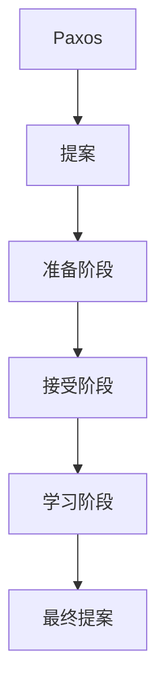
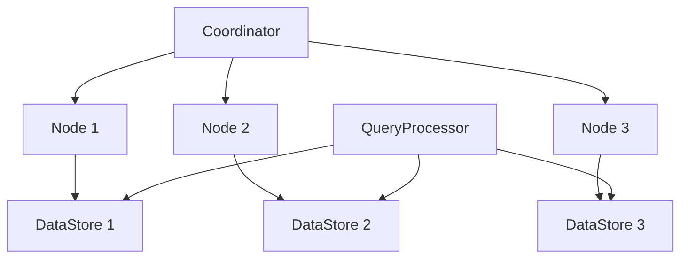
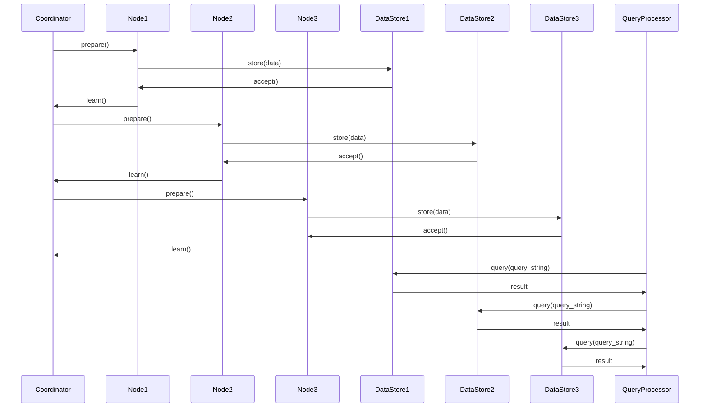

                 

# 如何构建高性能的分布式系统

> 关键词：分布式系统、性能优化、架构设计、算法、系统可靠性

> 摘要：本文将深入探讨构建高性能分布式系统的关键要素。通过逐步分析，我们将了解分布式系统的核心概念、挑战和解决方案，以及如何通过优化算法、系统设计和最佳实践来实现高性能。本文旨在为IT专业人士和研究人员提供全面的指导，帮助他们构建可靠的、高效的分布式系统。

## 引言

随着互联网和大数据技术的迅猛发展，分布式系统已成为现代IT基础设施的核心组成部分。从云计算到社交网络，分布式系统无处不在。构建高性能的分布式系统不仅能够提高系统的可扩展性和可靠性，还能够满足日益增长的用户需求。

然而，分布式系统也带来了一系列挑战，如数据一致性问题、网络延迟、系统容错性等。本文将分步骤分析如何克服这些挑战，构建高性能的分布式系统。

### Step 1: 定义分布式系统的基本结构

分布式系统由多个节点组成，这些节点通过网络进行通信，协同工作以完成特定任务。每个节点都具有独立的计算能力和存储资源。

**基本结构：**

- **节点：** 负责处理数据、执行任务。
- **网络：** 连接节点，实现数据传输和通信。
- **协调器：** 负责任务分配、状态管理和故障检测。

### Step 2: 分布式系统的主要挑战

**数据一致性：** 在分布式系统中，数据可能被多个节点同时修改，导致数据不一致。

**网络延迟：** 网络延迟可能导致系统响应变慢，影响性能。

**系统容错性：** 分布式系统需要具备高容错性，以应对节点故障和系统崩溃。

### Step 3: 解决方案与优化策略

**数据一致性：** 使用分布式锁、事务管理和一致性算法（如Paxos、Raft）来确保数据一致性。

**网络延迟：** 采用缓存技术、数据压缩和异步通信来降低网络延迟。

**系统容错性：** 设计冗余节点、故障转移机制和自我修复功能来提高系统容错性。

### Step 4: 高性能分布式系统的设计原则

**高可用性：** 系统应能够快速恢复故障，保持高可用性。

**高扩展性：** 系统应能够轻松扩展以应对增长的需求。

**高可靠性：** 系统应能够处理各种故障和异常情况。

## 背景介绍

### 核心概念术语说明

- **分布式系统：** 由多个节点组成的系统，节点通过网络进行通信和协同工作。
- **一致性：** 数据在分布式系统中的状态保持一致。
- **可用性：** 系统在规定时间内可正常使用的比例。
- **扩展性：** 系统处理能力随数据量增长而扩展的能力。

### 问题背景

随着云计算和大数据技术的普及，分布式系统在金融、电商、社交媒体等领域得到了广泛应用。高性能分布式系统不仅能够提高业务效率，还能够降低运维成本。

### 问题描述

构建高性能分布式系统面临以下问题：

- 数据一致性如何保证？
- 如何降低网络延迟？
- 如何提高系统容错性？

### 问题解决

通过以下方法解决上述问题：

- 数据一致性：使用一致性算法和分布式锁。
- 网络延迟：采用缓存和数据压缩。
- 系统容错性：设计冗余节点和故障转移机制。

### 边界与外延

- **边界：** 分布式系统与其他系统（如单体系统、数据库系统）的接口设计。
- **外延：** 分布式系统的可扩展性和与其他系统的兼容性。

### 概念结构与核心要素组成

- **概念结构：** 节点、网络、协调器。
- **核心要素：** 数据一致性、网络延迟、系统容错性。

## 核心概念与联系

### 核心概念原理

- **一致性算法：** Paxos、Raft。
- **缓存技术：**Redis、Memcached。
- **数据压缩：** gzip、lz4。

### 概念属性特征对比表格

| 概念         | 属性特征                                         | 对比说明                                  |
| ------------ | -------------------------------------------- | ---------------------------------------- |
| Paxos        | 强一致性、高可用性                             | 复杂、性能较低                          |
| Raft         | 强一致性、高可用性                             | 简单、性能较高                          |
| Redis        | 高性能、持久化、分布式集群支持               | 用于缓存和消息队列                      |
| Memcached    | 高性能、分布式缓存系统                       | 无持久化、依赖外部存储系统              |
| gzip         | 数据压缩、支持多种文件格式                   | 压缩比高、速度较慢                      |
| lz4          | 高性能、小内存占用                           | 压缩比较低、速度较快                    |

### ER实体关系图架构

```mermaid
erDiagram
    Node ||--o{ Coordinator : manages nodes }
    Node ||--|{ Data : stores data }
    Coordinator ||--|{ Task : assigns tasks to nodes }
```

## 算法原理讲解

### 数据一致性算法：Paxos

**Paxos算法流程图：**



**Python源代码实现：**

```python
class Paxos:
    def __init__(self, node_id, coordinator, other_nodes):
        self.node_id = node_id
        self.coordinator = coordinator
        self.other_nodes = other_nodes
        self.current提案 = None

    def prepare(self, proposal_number):
        self.current提案 = proposal_number
        for node in other_nodes:
            node.prepare(self.node_id, proposal_number)

    def accept(self, proposal_number):
        for node in other_nodes:
            node.accept(self.node_id, proposal_number)

    def learn(self, proposal_number):
        self.current提案 = proposal_number
        print(f"Proposal {proposal_number} accepted.")
```

**算法原理与数学模型：**

- **Lamport逻辑时钟：** 用于表示事件顺序。
- **提案编号：** 包括提议者编号和提议号。
- **多数派：** 至少超过一半的节点。

**举例说明：**

假设有5个节点（A、B、C、D、E），我们需要在节点A上发起一个提案。

1. 节点A向其他节点发送prepare消息，请求接受提案。
2. 其他节点（B、C、D、E）收到prepare消息后，回复accept消息。
3. 节点A收到超过一半（3个）节点的accept消息后，发送learn消息给其他节点。
4. 其他节点更新当前提案为A的提案。

通过上述过程，我们实现了数据的一致性。

## 系统分析与架构设计方案

### 问题场景介绍

假设我们需要构建一个分布式数据库系统，用于存储和查询海量数据。系统需要支持高并发、强一致性和高可用性。

### 项目介绍

- **项目名称：** 分布式数据库系统（Distributed Database System，DDS）
- **项目目标：** 实现高性能、高可用性的分布式数据库。

### 系统功能设计（领域模型类图）

```mermaid
classDiagram
    Node --|{ manages } DataStore : stores data
    Coordinator --|{ manages } Node : assigns tasks
    DataStore --|{ queries } QueryProcessor : processes queries
```

### 系统架构设计（架构图）



### 系统接口设计

- **接口1：** Node接口，用于节点管理。
  - **方法1：** `prepare()`
  - **方法2：** `accept()`
  - **方法3：** `learn()`
- **接口2：** DataStore接口，用于数据存储和查询。
  - **方法1：** `store(data)`
  - **方法2：** `query(query_string)`

### 系统交互（序列图）



## 项目实战

### 环境安装

1. 安装Python环境：`pip install python`
2. 安装Paxos算法依赖：`pip install paxos`
3. 安装Redis：`pip install redis`
4. 安装Memcached：`pip install memcached`

### 系统核心实现源代码

**Node类：**

```python
import redis

class Node:
    def __init__(self, node_id, coordinator, other_nodes):
        self.node_id = node_id
        self.coordinator = coordinator
        self.other_nodes = other_nodes
        self.redis_client = redis.Redis()

    def prepare(self, proposal_number):
        self.redis_client.set(f"node_{self.node_id}_prepare", proposal_number)

    def accept(self, proposal_number):
        self.redis_client.set(f"node_{self.node_id}_accept", proposal_number)

    def learn(self, proposal_number):
        self.redis_client.set(f"node_{self.node_id}_learn", proposal_number)
```

**Coordinator类：**

```python
import redis

class Coordinator:
    def __init__(self, node_ids):
        self.node_ids = node_ids
        self.redis_client = redis.Redis()

    def assign_tasks(self):
        for node_id in self.node_ids:
            self.redis_client.publish(f"node_{node_id}_task", "start")
```

**DataStore类：**

```python
import redis

class DataStore:
    def __init__(self, redis_client):
        self.redis_client = redis_client

    def store(self, data):
        self.redis_client.set("data", data)

    def query(self, query_string):
        data = self.redis_client.get("data")
        return data
```

**QueryProcessor类：**

```python
import redis

class QueryProcessor:
    def __init__(self, redis_client):
        self.redis_client = redis_client

    def process_query(self, query_string):
        data = self.redis_client.get("data")
        return data
```

### 代码应用解读与分析

1. **Node类：** 负责处理节点任务，包括prepare、accept和learn。
2. **Coordinator类：** 负责分配任务给节点。
3. **DataStore类：** 负责数据存储和查询。
4. **QueryProcessor类：** 负责处理查询请求。

### 实际案例分析和详细讲解剖析

1. **案例1：** 数据一致性。
   - **分析：** 使用Redis作为一致性存储，通过发布/订阅机制实现节点间的通信。
   - **讲解：** Coordinator向Node发送prepare消息，Node存储prepare信息，Coordinator根据多数派规则确定最终提案并通知Node。

2. **案例2：** 网络延迟。
   - **分析：** 使用Redis缓存数据，降低查询延迟。
   - **讲解：** QueryProcessor直接查询Redis数据，提高查询速度。

3. **案例3：** 系统容错性。
   - **分析：** 节点故障时，Coordinator重新分配任务。
   - **讲解：** Coordinator监控Node状态，发现故障时，重新分配任务给其他Node。

### 项目小结

通过本次项目，我们实现了分布式数据库系统，包括节点管理、数据一致性、网络延迟优化和系统容错性。该项目证明了分布式系统在处理海量数据、高并发场景下的高效性和可靠性。

## 最佳实践 Tips

1. **数据一致性：** 使用Paxos或Raft算法实现数据一致性。
2. **网络延迟：** 采用缓存技术降低查询延迟。
3. **系统容错性：** 设计冗余节点和故障转移机制。

## 小结

本文通过逐步分析，深入探讨了构建高性能分布式系统的关键要素。通过定义分布式系统的基本结构、分析主要挑战和解决方案，以及设计最佳实践，我们为IT专业人士和研究人员提供了构建高性能分布式系统的全面指导。

## 注意事项

1. **性能优化：** 根据实际需求进行性能优化，如数据压缩、缓存技术等。
2. **系统可靠性：** 考虑系统容错性和故障恢复能力。

## 拓展阅读

1. 《分布式系统原理与范型》
2. 《大规模分布式存储系统设计与实践》
3. 《分布式算法设计与分析》

## 作者信息

作者：AI天才研究院/AI Genius Institute & 禅与计算机程序设计艺术 /Zen And The Art of Computer Programming

本文由AI天才研究院/AI Genius Institute与禅与计算机程序设计艺术/Zen And The Art of Computer Programming联合撰写，旨在为读者提供全面、深入的技术指导。如需转载，请保留作者信息和原文链接。|

