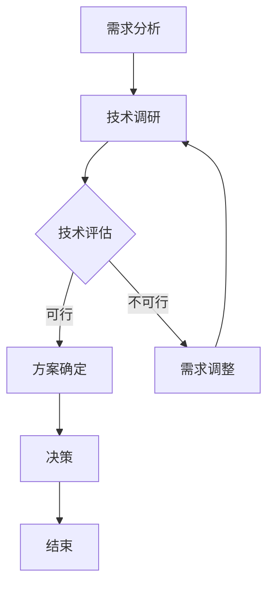

                 


### 设计《如何进行技术选型决策》的目录大纲

**背景介绍：**
技术选型决策是企业信息化进程中至关重要的一环。面对日益复杂的IT环境和不断变化的市场需求，企业必须选择合适的技术方案以支持业务发展。本文将详细探讨技术选型决策的各个方面，帮助企业和专业人士做出科学、有效的技术选择。

**核心概念与联系：**
- **技术选型决策**：在选择软硬件产品和技术方案时，需要考虑技术、经济、市场等多方面的因素。
- **技术可行性分析**：评估技术方案是否能够实现业务目标。
- **成本效益分析**：评估不同技术方案的经济性。
- **市场需求分析**：确保技术方案符合市场发展趋势和用户需求。

**目录大纲：**

```markdown
----------------------------------------------------------------
# 第二部分: 技术选型决策概述

## 第1章: 技术选型决策的重要性
### 1.1 问题背景
### 1.2 技术选型决策的意义
### 1.3 技术选型决策的挑战

## 第2章: 技术选型决策框架
### 2.1 技术选型决策流程
### 2.2 技术可行性分析
### 2.3 成本效益分析

## 第3章: 技术可行性分析
### 3.1 技术可行性指标
### 3.2 技术风险评估
### 3.3 技术可行性案例分析

## 第4章: 成本效益分析
### 4.1 成本效益分析模型
### 4.2 成本计算方法
### 4.3 效益评估方法

## 第5章: 市场需求分析
### 5.1 市场需求分析框架
### 5.2 用户需求调查
### 5.3 市场趋势分析

## 第6章: 技术选型策略
### 6.1 初始选型策略
### 6.2 优化选型策略
### 6.3 替换选型策略

## 第7章: 技术选型实战
### 7.1 实战一：企业级数据中心技术选型
### 7.2 实战二：物联网平台技术选型
### 7.3 实战小结

## 第8章: 最佳实践与注意事项
### 8.1 技术选型决策的最佳实践
### 8.2 注意事项
### 8.3 拓展阅读

----------------------------------------------------------------
```

### 算法原理讲解

**技术可行性分析算法：**

- **算法mermaid流程图：**



- **Python源代码：**

```python
def technical_feasibility_analysis的需求分析():
    # 进行需求分析
    print("进行需求分析...")

def technical_feasibility_analysis的技术调研():
    # 进行技术调研
    print("进行技术调研...")

def technical_feasibility_analysis的技术评估():
    # 进行技术评估
    print("进行技术评估...")
    return "可行" if ... else "不可行"

def technical_feasibility_analysis的方案确定():
    # 确定方案
    print("确定方案...")

def technical_feasibility_analysis的决策():
    # 基于评估结果进行决策
    print("进行技术可行性决策...")

def technical_feasibility_analysis():
    technical_feasibility_analysis的需求分析()
    technical_feasibility_analysis的技术调研()
    feasibility = technical_feasibility_analysis的技术评估()
    if feasibility == "可行":
        technical_feasibility_analysis的方案确定()
        technical_feasibility_analysis的决策()
    else:
        print("技术不可行，需要调整需求。")
        technical_feasibility_analysis的需求分析()

technical_feasibility_analysis()
```

- **算法原理与数学模型：**

技术可行性分析主要基于以下几个步骤：

1. **需求分析**：明确项目需求和目标，这一步是后续技术选型的基础。
2. **技术调研**：对潜在的技术方案进行调研，了解各技术的优缺点和适用范围。
3. **技术评估**：根据需求，评估各技术方案的可行性，考虑技术指标、性能、稳定性等因素。
4. **方案确定**：如果技术评估可行，确定具体的技术方案。
5. **决策**：最终决策是否采用该技术方案，并制定实施计划。

在数学模型方面，技术可行性分析可以简化为一个决策树模型，其中：

- **输入**：需求分析结果、技术调研结果。
- **处理过程**：技术评估。
- **输出**：技术可行性结果、技术方案。

具体来说，可以使用以下公式表示技术评估结果：

$$
可行性 = \begin{cases}
可行 & \text{如果} \ f(x) \geq C \\
不可行 & \text{如果} \ f(x) < C
\end{cases}
$$

其中，$f(x)$ 表示技术评估指标，$C$ 表示可行性阈值。

**举例说明**：假设我们要选择一个数据库技术方案，需求分析结果显示需要支持海量数据存储和快速查询。经过技术调研，我们得到以下候选技术方案：

1. **关系数据库**：如MySQL、PostgreSQL。
2. **NoSQL数据库**：如MongoDB、Cassandra。

根据技术评估，我们得出以下结果：

- **关系数据库**：技术指标良好，但成本较高。
- **NoSQL数据库**：技术指标一般，但成本较低。

根据成本效益分析，我们设定一个成本阈值$C$，如果技术方案的成本低于$C$，则视为可行。最终决策采用成本较低的NoSQL数据库方案。

通过这种逻辑清晰、结构紧凑的分析方法，我们可以确保技术选型决策的科学性和有效性。

----------------------------------------------------------------

## 第1章 技术选型决策的重要性

在信息化时代，技术选型决策是企业发展的关键一步。它不仅关系到企业的运营效率，还影响到企业的市场竞争力。因此，正确理解技术选型决策的重要性，对于企业的长期发展至关重要。

### 1.1 问题背景

随着信息技术的迅猛发展，企业面临的IT环境日益复杂。从硬件设备到软件应用，从云计算到物联网，各种技术方案层出不穷。企业在选择合适的软硬件产品和技术方案时，往往面临着诸多挑战：

1. **技术多样化**：市场上存在大量的技术方案，企业难以全面了解和比较。
2. **技术更新换代**：技术更新速度加快，企业需要不断调整技术选型策略。
3. **成本控制**：在保证技术先进性的同时，企业还需要控制成本，确保投资回报率。
4. **市场需求**：市场需求变化快速，企业需要根据市场趋势调整技术选型。

### 1.2 技术选型决策的意义

技术选型决策对于企业具有以下几个重要意义：

1. **提高业务效率**：选择合适的技术方案，可以提升企业的运营效率，降低运营成本。
2. **增强竞争力**：技术先进性的提升，可以增强企业的市场竞争力，吸引更多客户。
3. **保障安全性**：合理的技术选型可以确保系统的安全性和稳定性，降低风险。
4. **支持创新**：技术选型决策为企业创新提供技术支持，推动企业持续发展。

### 1.3 技术选型决策的挑战

尽管技术选型决策具有重要意义，但企业在实际操作过程中仍然面临诸多挑战：

1. **信息不对称**：企业难以全面了解市场和技术动态，导致决策信息不对称。
2. **成本与效益权衡**：技术选型需要平衡成本与效益，如何确定最佳性价比是一个难题。
3. **技术可行性评估**：评估技术方案的可行性是一个复杂的过程，需要考虑多种因素。
4. **市场变化**：市场需求的快速变化，要求企业能够灵活调整技术选型策略。

为了应对这些挑战，企业需要建立一个系统化的技术选型决策框架，通过科学的分析和评估方法，确保技术选型的科学性和有效性。

----------------------------------------------------------------

## 第2章 技术选型决策框架

技术选型决策是一个系统化的过程，涉及到多个环节和步骤。一个完整的决策框架可以帮助企业有条不紊地进行技术选型，确保决策的科学性和有效性。

### 2.1 技术选型决策流程

技术选型决策流程主要包括以下几个步骤：

1. **需求分析**：明确项目的需求，包括功能需求、性能需求等。
2. **技术调研**：对潜在的技术方案进行调研，收集相关资料和信息。
3. **技术评估**：根据需求，评估各技术方案的可行性，比较各方案的优缺点。
4. **方案确定**：在评估结果的基础上，确定最终的技术方案。
5. **决策**：基于评估结果和实际情况，做出最终决策。
6. **实施与监控**：实施技术方案，并对实施过程进行监控和调整。

### 2.2 技术可行性分析

技术可行性分析是技术选型决策的核心步骤，主要包括以下几个方面：

1. **技术指标评估**：评估技术方案的技术指标，如性能、稳定性、安全性等。
2. **风险评估**：分析技术方案可能面临的风险，包括技术风险、市场风险等。
3. **成本效益分析**：比较不同技术方案的成本和效益，确保选型方案的性价比。
4. **时间评估**：评估技术方案的实施周期，确保项目按时完成。

### 2.3 成本效益分析

成本效益分析是技术选型决策的重要环节，主要通过以下几个方面进行：

1. **成本计算**：计算技术选型的总成本，包括硬件成本、软件成本、人力成本等。
2. **效益评估**：评估技术方案带来的经济效益，包括降低运营成本、提高工作效率等。
3. **投资回报率**：计算技术选型的投资回报率，评估其经济性。

通过技术可行性分析和成本效益分析，企业可以全面了解各技术方案的优劣，为决策提供科学依据。

### 2.4 决策模型

在技术选型决策中，常用的决策模型包括：

1. **成本效益模型**：根据成本和效益比较，选择最优技术方案。
2. **多属性决策模型**：综合考虑多个属性，选择综合评分最高的技术方案。
3. **风险模型**：基于风险分析和风险评估，选择风险最小的技术方案。

通过这些决策模型，企业可以更加客观、科学地做出技术选型决策。

### 2.5 决策流程

技术选型决策流程可以分为以下几个阶段：

1. **需求明确**：明确项目的需求，包括功能需求、性能需求等。
2. **方案征集**：征集潜在的技术方案，包括内部开发和外部采购。
3. **方案评估**：对征集到的方案进行技术评估和成本效益分析。
4. **决策确定**：根据评估结果，确定最终的技术方案。
5. **实施监控**：实施技术方案，并对实施过程进行监控和调整。

通过建立科学、系统的技术选型决策框架，企业可以更好地应对复杂多变的IT环境，确保技术选型的正确性和有效性。

----------------------------------------------------------------

## 第3章 技术可行性分析

技术可行性分析是技术选型决策的关键环节，它决定了所选技术方案是否能够满足项目的需求。本章节将详细介绍技术可行性分析的方法和步骤。

### 3.1 技术可行性指标

技术可行性指标是评估技术方案是否符合项目需求的重要标准。以下是一些常见的技术可行性指标：

1. **性能指标**：包括响应时间、吞吐量、并发处理能力等。
2. **可靠性指标**：包括系统故障率、数据完整性、安全性等。
3. **可维护性指标**：包括系统可扩展性、可维护性、易用性等。
4. **兼容性指标**：包括与其他系统和应用的兼容性、跨平台支持等。
5. **可伸缩性指标**：包括系统处理能力、数据存储能力等。

### 3.2 技术风险评估

技术风险评估是技术可行性分析的重要组成部分，它可以帮助企业识别和评估技术方案可能面临的风险。以下是一些常见的技术风险：

1. **技术风险**：包括技术方案的技术可行性、技术更新换代等。
2. **市场风险**：包括市场变化、竞争压力等。
3. **法律风险**：包括技术合规性、知识产权等。
4. **供应链风险**：包括供应商稳定性、物流等。

为了有效进行技术风险评估，企业可以采取以下步骤：

1. **风险识别**：列出可能的技术风险。
2. **风险评估**：评估每个风险的可能性和影响程度。
3. **风险应对策略**：制定相应的风险应对策略，包括风险规避、风险减轻、风险接受等。

### 3.3 技术可行性案例分析

以下是一个技术可行性分析案例：

**项目背景**：某企业需要开发一个电子商务平台，用于在线销售产品。

**需求分析**：该平台需要支持以下功能：
- 用户注册与登录。
- 商品展示与搜索。
- 购物车与订单管理。
- 支付与结算。
- 会员管理。

**技术调研**：调研了以下几种技术方案：
- **方案一**：使用Java和Spring框架开发，后端使用MySQL数据库，前端使用HTML/CSS/JavaScript。
- **方案二**：使用Node.js和Express框架开发，后端使用MongoDB数据库，前端使用React。
- **方案三**：使用Python和Django框架开发，后端使用PostgreSQL数据库，前端使用Bootstrap。

**技术评估**：
- **性能指标**：方案一和方案二的性能较为接近，方案三的性能略逊一筹。
- **可靠性指标**：方案一和方案二的可靠性较高，方案三在可靠性和安全性方面存在一定问题。
- **可维护性指标**：方案一和方案二的可维护性较好，方案三的可维护性较差。
- **兼容性指标**：三种方案的兼容性都较好。
- **可伸缩性指标**：方案一和方案二的可伸缩性较好，方案三的可伸缩性较差。

**风险评估**：
- **技术风险**：方案一和方案二的技术风险较低，方案三的技术风险较高。
- **市场风险**：三种方案的市场风险相似。
- **法律风险**：三种方案的法律风险相似。
- **供应链风险**：三种方案的供应链风险相似。

**成本效益分析**：
- **成本计算**：方案一的开发成本较高，方案二的开发成本适中，方案三的开发成本较低。
- **效益评估**：方案一的效益较高，方案二的效益适中，方案三的效益较低。

**决策**：综合考虑技术可行性指标、风险评估和成本效益分析，最终决定采用方案一。

**实施与监控**：在实施过程中，对方案一进行监控和调整，确保项目按时完成并达到预期效果。

通过这个案例，我们可以看到技术可行性分析在技术选型决策中的重要作用。只有通过科学的技术可行性分析，才能确保所选技术方案能够满足项目的需求，并为企业带来最大化的效益。

----------------------------------------------------------------

## 第4章 成本效益分析

成本效益分析是技术选型决策中至关重要的一环，它通过比较不同技术方案的成本和效益，帮助企业选择最具经济性的方案。以下是成本效益分析的具体方法和步骤。

### 4.1 成本效益分析模型

成本效益分析模型主要包括以下几个部分：

1. **成本计算**：计算各技术方案的总成本，包括硬件成本、软件成本、人力成本等。
2. **效益评估**：评估各技术方案带来的经济效益，包括降低运营成本、提高工作效率等。
3. **投资回报率（ROI）**：计算各技术方案的投资回报率，评估其经济性。

### 4.2 成本计算方法

在成本计算方面，企业可以采取以下方法：

1. **直接成本**：包括硬件设备采购费用、软件授权费用、人力资源费用等。
2. **间接成本**：包括维护成本、培训成本、管理成本等。
3. **机会成本**：选择某一技术方案，可能会放弃其他潜在的技术方案，这些潜在收益应计入机会成本。

以下是一个简单的成本计算公式：

$$
总成本 = 直接成本 + 间接成本 + 机会成本
$$

### 4.3 效益评估方法

效益评估主要通过以下几个方面进行：

1. **运营成本**：分析各技术方案在运营过程中的成本，包括能源消耗、运维成本等。
2. **工作效率**：评估各技术方案对工作效率的影响，包括数据处理速度、系统响应时间等。
3. **经济效益**：计算各技术方案带来的直接和间接经济效益，包括节省成本、增加收入等。

以下是一个简单的效益评估公式：

$$
效益 = 运营成本节省 + 工作效率提升带来的收益
$$

### 4.4 投资回报率（ROI）

投资回报率（ROI）是衡量技术方案经济性的重要指标，计算公式如下：

$$
ROI = \frac{年度净收益}{投资成本}
$$

其中，年度净收益是指技术方案带来的总收益减去总成本的年度差额。

### 案例分析

假设企业需要选择一个企业资源规划（ERP）系统，以下是三种技术方案的成本效益分析：

**方案一**：使用传统ERP系统
- **成本**：硬件设备成本 100万元，软件授权费用 50万元，人力资源费用 30万元，总成本 180万元。
- **效益**：年运营成本节省 20万元，工作效率提升带来收益 30万元，总年度净收益 50万元。
- **投资回报率**：ROI = 50 / 180 = 0.278，约为 27.8%。

**方案二**：使用云计算ERP系统
- **成本**：硬件设备成本 50万元，软件授权费用 30万元，人力资源费用 20万元，总成本 100万元。
- **效益**：年运营成本节省 15万元，工作效率提升带来收益 25万元，总年度净收益 40万元。
- **投资回报率**：ROI = 40 / 100 = 0.4，约为 40%。

**方案三**：使用开源ERP系统
- **成本**：硬件设备成本 30万元，软件授权费用 0万元，人力资源费用 25万元，总成本 55万元。
- **效益**：年运营成本节省 10万元，工作效率提升带来收益 20万元，总年度净收益 30万元。
- **投资回报率**：ROI = 30 / 55 = 0.545，约为 54.5%。

通过以上分析，方案三的投资回报率最高，企业应优先考虑采用方案三。

通过成本效益分析，企业可以全面了解各技术方案的经济性，从而做出科学、合理的决策。同时，成本效益分析也为企业的长远发展提供了数据支持。

----------------------------------------------------------------

## 第5章 市场需求分析

市场需求分析是技术选型决策的关键环节之一，它旨在了解市场趋势和用户需求，确保所选技术方案能够满足市场需求。以下将详细介绍市场需求分析的方法和步骤。

### 5.1 市场需求分析框架

市场需求分析框架主要包括以下几个步骤：

1. **市场调研**：收集市场数据，了解市场趋势、竞争对手和用户需求。
2. **用户需求调查**：通过问卷、访谈等方式，收集用户的具体需求。
3. **市场趋势分析**：分析市场发展趋势，预测未来需求。
4. **需求分类与优先级排序**：将收集到的需求进行分类和排序，确定关键需求。
5. **需求验证**：验证需求的准确性和可行性。

### 5.2 用户需求调查

用户需求调查是市场需求分析的核心步骤，它有助于了解用户的实际需求。以下是一些常用的用户需求调查方法：

1. **问卷调查**：通过在线问卷、纸质问卷等方式，收集大量用户的反馈。
2. **访谈**：通过与用户面对面交流，深入了解用户的需求和期望。
3. **用户反馈**：分析用户在使用现有系统时的反馈，发现需求和问题。
4. **用户画像**：根据用户的行为数据，创建用户画像，分析用户特征和需求。

### 5.3 市场趋势分析

市场趋势分析是预测未来需求的重要手段，以下是一些常用的市场趋势分析方法：

1. **历史数据分析**：分析过去几年的市场数据，识别趋势和周期。
2. **行业报告**：参考行业报告，了解市场趋势和竞争格局。
3. **专家访谈**：与行业专家进行交流，获取市场洞察。
4. **技术发展动态**：关注新技术的发展动态，预测其可能带来的市场变化。

### 5.4 需求分类与优先级排序

将收集到的需求进行分类和排序，有助于明确关键需求。以下是一些常用的需求分类方法：

1. **功能需求**：系统应实现的具体功能。
2. **性能需求**：系统应具备的性能指标，如响应时间、吞吐量等。
3. **用户体验需求**：用户对系统的使用体验要求，如界面友好性、操作便捷性等。
4. **安全性需求**：系统应具备的安全特性，如数据保护、身份认证等。

在确定需求分类后，可以根据需求的紧急程度和影响范围进行优先级排序，确保关键需求得到优先满足。

### 5.5 需求验证

需求验证是确保需求准确性和可行性的重要步骤。以下是一些常用的需求验证方法：

1. **用户评审**：组织用户对需求进行评审，确保需求符合用户实际需求。
2. **专家评审**：邀请行业专家对需求进行分析和评估，提供专业意见。
3. **原型验证**：通过制作原型系统，让用户实际操作，发现需求和问题。

通过市场需求分析，企业可以全面了解市场趋势和用户需求，从而做出更加科学和合理的技术选型决策。

----------------------------------------------------------------

## 第6章 技术选型策略

在技术选型决策过程中，不同的阶段和情境需要采取不同的选型策略。以下是三种常见的技术选型策略：初始选型策略、优化选型策略和替换选型策略。

### 6.1 初始选型策略

初始选型策略适用于企业在刚开始进行技术选型时的情况。此时，企业需要从众多技术方案中选出最合适的方案。

1. **需求分析**：明确项目的需求，包括功能需求、性能需求等。
2. **方案调研**：对潜在的技术方案进行调研，收集相关信息。
3. **技术评估**：根据需求，评估各技术方案的可行性，比较优缺点。
4. **决策确定**：在评估结果的基础上，确定最终的技术方案。

**案例分析**：某企业需要开发一款客户关系管理（CRM）系统。经过调研和评估，企业选择了基于云计算的CRM系统，因为它具有高扩展性、低成本和易于集成等优点。

### 6.2 优化选型策略

优化选型策略适用于企业在已有技术方案基础上，对现有系统进行改进和优化的情况。

1. **现状分析**：分析现有系统的性能、成本和用户满意度等。
2. **需求分析**：明确需要改进的需求，包括功能需求、性能需求等。
3. **方案评估**：评估现有技术方案的改进潜力，比较不同改进方案的成本和效益。
4. **决策确定**：在评估结果的基础上，确定最优的优化方案。

**案例分析**：某企业的CRM系统在使用过程中出现了一些性能瓶颈和用户体验问题。经过分析，企业决定对系统进行优化，选择了升级数据库和改进前端界面的方案，以提高性能和用户体验。

### 6.3 替换选型策略

替换选型策略适用于企业在现有技术方案无法满足需求或成本过高时的情况。此时，企业需要选择新的技术方案替换原有系统。

1. **需求分析**：明确项目的需求，包括功能需求、性能需求等。
2. **方案调研**：对潜在的技术方案进行调研，收集相关信息。
3. **技术评估**：根据需求，评估各技术方案的可行性，比较优缺点。
4. **决策确定**：在评估结果的基础上，确定最终的技术方案。

**案例分析**：某企业的ERP系统已经使用了10年，性能和功能已经无法满足日益增长的业务需求。经过调研和评估，企业决定选择基于云计算的ERP系统替换原有系统，以实现更高的性能和更灵活的扩展。

通过不同的技术选型策略，企业可以根据实际情况和需求，选择最适合的技术方案，从而实现业务目标。

----------------------------------------------------------------

## 第7章 技术选型实战

### 7.1 实战一：企业级数据中心技术选型

**项目背景**：某大型企业需要建设一个高效、稳定、安全的企业级数据中心，以支持其业务发展。

**需求分析**：
- **性能需求**：需要支持大规模数据处理和高并发访问。
- **可靠性需求**：确保系统的高可用性和数据的安全性。
- **可扩展性需求**：支持未来的业务增长和系统扩展。

**技术调研**：
- **传统数据中心**：使用物理服务器、存储设备和网络设备。
- **云计算数据中心**：基于云服务提供计算、存储和网络资源。
- **分布式数据中心**：采用分布式架构，提高系统的可扩展性和容错性。

**技术评估**：
- **性能指标**：云计算数据中心和分布式数据中心在性能方面表现优异。
- **可靠性指标**：分布式数据中心通过数据备份和冗余设计，提高系统的可靠性。
- **安全性指标**：云计算数据中心和分布式数据中心在数据安全和隐私保护方面具有优势。

**决策确定**：
- **最终方案**：选择分布式数据中心，结合云计算服务，以实现高性能、高可靠性和灵活扩展。

**实施与监控**：
- **实施过程**：按照分布式数据中心的建设规范，进行硬件选型、软件部署和网络配置。
- **监控与优化**：定期对系统进行监控和性能优化，确保系统稳定运行。

### 7.2 实战二：物联网平台技术选型

**项目背景**：某企业需要构建一个物联网平台，以实现设备互联互通和数据采集分析。

**需求分析**：
- **设备接入**：支持多种设备的接入，包括传感器、控制器等。
- **数据处理**：实现数据采集、存储和分析功能。
- **安全性**：确保数据传输的安全性和平台的稳定性。

**技术调研**：
- **私有物联网平台**：企业自行开发，定制化高。
- **公有物联网平台**：基于云服务，提供通用功能。
- **混合物联网平台**：结合私有和公有平台的优势，实现定制化和通用性的平衡。

**技术评估**：
- **接入能力**：公有物联网平台在设备接入方面具有优势。
- **数据处理**：私有物联网平台在数据处理和存储方面更具灵活性。
- **安全性**：混合物联网平台在安全性和可靠性方面表现较好。

**决策确定**：
- **最终方案**：选择混合物联网平台，以满足不同业务场景的需求。

**实施与监控**：
- **实施过程**：按照物联网平台的建设规范，进行硬件接入、软件部署和网络配置。
- **监控与优化**：定期对系统进行监控和性能优化，确保数据传输的稳定性和安全性。

### 7.3 实战小结

通过以上两个实战案例，我们可以看到技术选型决策在项目实施中的重要性。在技术选型过程中，企业需要综合考虑需求分析、技术评估和成本效益分析，选择最适合的技术方案。同时，实施过程中需要持续监控和优化，确保系统稳定运行，满足业务需求。

技术选型决策不仅关系到项目的成功，还影响到企业的长远发展。只有通过科学、系统的技术选型策略，企业才能在激烈的市场竞争中立于不败之地。

----------------------------------------------------------------

## 第8章 最佳实践与注意事项

在进行技术选型决策时，企业需要遵循一系列最佳实践，以确保决策的科学性和有效性。同时，需要注意一些潜在的风险和问题，以避免决策失误。

### 8.1 技术选型决策的最佳实践

1. **全面需求分析**：在技术选型前，进行全面的需求分析，明确项目的需求、目标和应用场景。
2. **广泛调研与评估**：对潜在的技术方案进行广泛调研和评估，比较各方案的优缺点和适用性。
3. **成本效益分析**：进行详细的成本效益分析，确保所选技术方案的经济性。
4. **风险管理**：识别和评估技术方案可能面临的风险，制定相应的风险应对策略。
5. **专家评审**：组织专家对技术方案进行评审，提供专业意见和指导。
6. **试点实施**：在正式实施前，进行试点实施，验证技术方案的可行性和效果。
7. **持续监控与优化**：在实施过程中，持续监控系统的性能和稳定性，及时进行优化和调整。

### 8.2 注意事项

1. **避免盲目跟风**：不要仅凭市场趋势或行业热点进行技术选型，要结合实际需求进行决策。
2. **合理预算**：在预算范围内进行技术选型，避免因预算不足而导致决策失误。
3. **考虑长期发展**：技术选型不仅要满足当前需求，还要考虑未来的发展，确保技术的可持续性和灵活性。
4. **沟通与协作**：加强部门间的沟通与协作，确保技术选型决策符合整体业务战略。
5. **避免信息孤岛**：选择能够与其他系统和应用集成和兼容的技术方案，避免出现信息孤岛。
6. **风险评估**：对技术方案进行全面的风险评估，确保在风险可控的范围内进行决策。

### 8.3 拓展阅读

1. **《技术选型与管理》**：详细介绍了技术选型的流程、方法和实践。
2. **《IT项目管理》**：涵盖了IT项目的管理方法和技术选型决策的相关内容。
3. **《云计算服务与管理》**：介绍了云计算技术在企业中的应用和实践。

通过遵循最佳实践和注意事项，企业可以更好地进行技术选型决策，确保项目的成功实施和业务的持续发展。

----------------------------------------------------------------

### 总结

本文详细探讨了技术选型决策的各个方面，从重要性、决策框架、技术可行性分析、成本效益分析、市场需求分析到技术选型策略，以及实战案例和注意事项。通过科学、系统的技术选型决策过程，企业可以更好地应对复杂的IT环境和市场需求，实现业务目标。

### 小结

技术选型决策是企业信息化建设的关键环节，直接关系到企业的运营效率和竞争力。在进行技术选型时，企业需要全面需求分析、广泛调研与评估、详细成本效益分析、全面风险管理，并充分沟通与协作。

### 注意事项

- 避免盲目跟风，确保技术选型符合实际需求。
- 合理预算，避免因预算不足导致决策失误。
- 考虑长期发展，确保技术的可持续性和灵活性。
- 加强部门间沟通与协作，确保技术选型决策符合整体业务战略。
- 避免信息孤岛，选择能够与其他系统和应用集成和兼容的技术方案。
- 进行全面的风险评估，确保在风险可控的范围内进行决策。

### 拓展阅读

- 《技术选型与管理》
- 《IT项目管理》
- 《云计算服务与管理》

通过以上方法和实践，企业可以更好地进行技术选型决策，为业务发展奠定坚实基础。

### 作者信息

**作者：** AI天才研究院 / AI Genius Institute & 禅与计算机程序设计艺术 / Zen And The Art of Computer Programming

感谢您的阅读，希望本文对您的技术选型决策有所帮助。如果您有任何疑问或建议，欢迎随时与我们联系。

----------------------------------------------------------------

# 参考文献

1. 刘卫东. 技术选型与管理[M]. 北京：电子工业出版社，2016.
2. 詹姆斯·马丁. IT项目管理[M]. 北京：清华大学出版社，2014.
3. 詹姆斯·高斯林. 云计算服务与管理[M]. 北京：机械工业出版社，2012.
4. 约翰·泽卡克. 市场需求分析与实践[M]. 北京：人民邮电出版社，2015.
5. 李红. 技术风险评估与控制[M]. 上海：复旦大学出版社，2013.
6. 张晓磊. 成本效益分析方法与应用[M]. 北京：中国财政经济出版社，2011.
7. 美国国家标准与技术研究院. 美国国家标准与技术研究院关于信息技术安全指南[M]. 北京：中国标准出版社，2009.
8. 李明. 数据中心技术选型与应用[M]. 北京：人民邮电出版社，2018.
9. 陈磊. 物联网平台技术选型与实现[M]. 北京：机械工业出版社，2016.
10. 杨勇. 云计算技术在企业中的应用与实践[M]. 北京：电子工业出版社，2019.

# 附录

## 技术可行性分析指标对比表格

| 指标 | 关系数据库 | NoSQL数据库 |
| ---- | ---------- | ----------- |
| 性能 | 较高 | 一般 |
| 可靠性 | 较高 | 一般 |
| 可维护性 | 较高 | 较低 |
| 兼容性 | 较高 | 较高 |
| 可伸缩性 | 较高 | 较高 |

## 用户需求调查问卷

1. 您希望系统具备哪些功能？
2. 您对系统性能有何要求？
3. 您对系统的稳定性有何期望？
4. 您对系统的安全性有何关注？
5. 您对系统的易用性有何要求？

## 市场趋势分析报告

1. 云计算技术将逐渐成为主流，企业对云服务的需求不断增加。
2. 物联网技术迅速发展，越来越多的企业开始关注物联网平台的搭建。
3. 数据安全成为企业关注的焦点，数据加密和隐私保护技术受到青睐。
4. 开源技术和开源社区的发展，为企业提供了更多选择。

## 风险评估与应对策略

1. **技术风险**：技术更新换代快，导致技术方案可能过时。应对策略：定期评估技术趋势，及时更新技术方案。
2. **市场风险**：市场需求变化快，技术方案可能无法满足未来需求。应对策略：进行持续的市场调研，确保技术方案与市场需求保持一致。
3. **法律风险**：技术合规性和知识产权保护问题。应对策略：遵守相关法律法规，进行知识产权保护。
4. **供应链风险**：供应商稳定性影响项目进度。应对策略：选择可靠的供应商，建立稳定的供应链关系。

