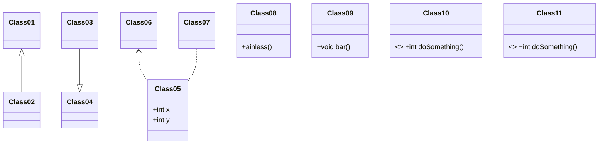
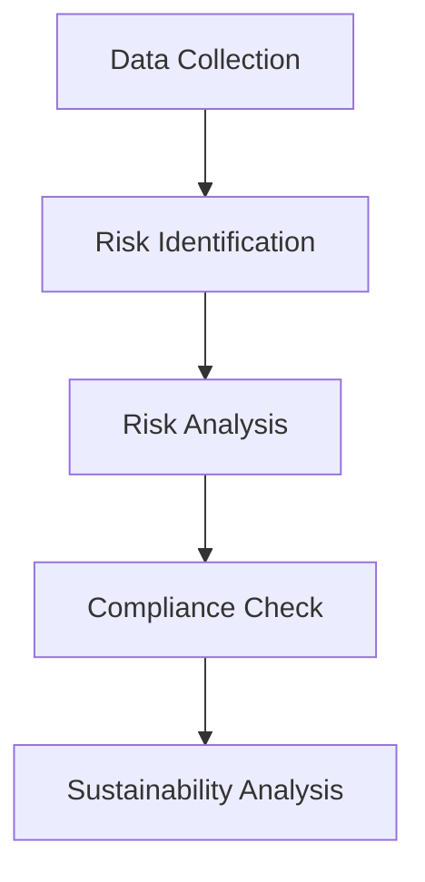
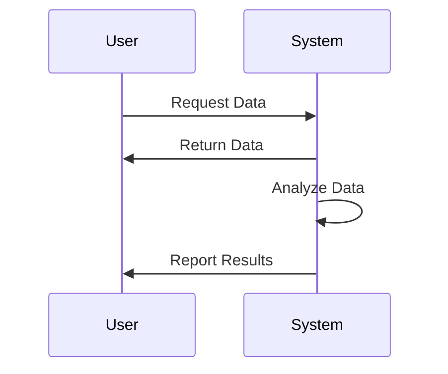

                 


## How to Conduct Effective Technical Due Diligence

### Introduction

In the fast-paced world of technology, the importance of conducting effective technical due diligence cannot be overstated. Whether you are investing in a startup, acquiring a business, or planning a merger, a thorough technical due diligence process is crucial for identifying potential risks and ensuring the success of the venture. This article aims to provide a comprehensive guide on how to conduct effective technical due diligence, using a step-by-step approach to break down the process into manageable components. 

### Key Concepts

#### Technical Due Diligence Definition
Technical due diligence refers to the process of evaluating the technical aspects of a target company or project. This includes assessing the quality of the technology, understanding the architecture, and identifying potential risks and challenges.

#### Core Elements of Technical Due Diligence
1. **Technology Assessment**: Evaluating the current technology stack, software, hardware, and infrastructure.
2. **Risk Assessment**: Identifying potential risks, such as technical debt, cybersecurity vulnerabilities, and compliance issues.
3. **Compliance Check**: Ensuring that the technology and processes comply with industry standards and regulations.
4. **Sustainability Analysis**: Assessing the long-term viability of the technology and its impact on the business.

### Comparison of Technical Due Diligence Elements
| Element | Description |
| --- | --- |
| **Technology Assessment** | Evaluating the current technology stack, software, hardware, and infrastructure. |
| **Risk Assessment** | Identifying potential risks, such as technical debt, cybersecurity vulnerabilities, and compliance issues. |
| **Compliance Check** | Ensuring that the technology and processes comply with industry standards and regulations. |
| **Sustainability Analysis** | Assessing the long-term viability of the technology and its impact on the business. |

### ER Entity Relationship Diagram
```mermaid
erDiagram
  Product ||--|{ Technology }||>
  Technology ||--|{ Risk }||>
  Risk ||--|{ Compliance }||>
  Compliance ||--|{ Sustainability }||>
```

### Algorithm Principles and Application

#### Algorithm Description
The core algorithm for technical due diligence involves a multi-step process:

1. **Data Collection**: Gathering information about the target company's technology, infrastructure, and processes.
2. **Risk Identification**: Analyzing the collected data to identify potential risks.
3. **Risk Analysis**: Evaluating the severity and impact of identified risks.
4. **Mitigation Planning**: Developing strategies to address and mitigate the risks.

#### Mathematical Model and Formula
The risk assessment can be represented using the following mathematical model:
$$ Risk = f(Technical\ Debt, Security\ Vulnerabilities, Compliance\ Issues) $$

Where:
- \( Risk \) is the overall risk level.
- \( Technical\ Debt \) is the amount of unfinished or poorly implemented work.
- \( Security\ Vulnerabilities \) are the weaknesses in the system that could be exploited.
- \( Compliance\ Issues \) are the deviations from regulatory standards.

#### Example
Let's consider a hypothetical company with the following characteristics:
- \( Technical\ Debt = 10 \) months of work.
- \( Security\ Vulnerabilities = 5 \).
- \( Compliance\ Issues = 3 \).

Using the formula, we can calculate the risk level as follows:
$$ Risk = f(10, 5, 3) = 10 \times 5 \times 3 = 150 $$

A risk level of 150 indicates that the company has significant technical, security, and compliance risks that need to be addressed.

### System Analysis and Design

#### Problem Scenario
A company is planning to acquire a technology startup. They need to conduct a technical due diligence to assess the quality and potential risks associated with the startup's technology.

#### System Function Design
The system should have the following core functions:

1. **Data Collection**: Collecting information about the startup's technology, infrastructure, and processes.
2. **Risk Identification**: Identifying potential risks based on the collected data.
3. **Risk Analysis**: Evaluating the severity and impact of identified risks.
4. **Compliance Check**: Ensuring compliance with industry standards and regulations.
5. **Sustainability Analysis**: Assessing the long-term viability of the technology.

#### Domain Model (Mermaid Class Diagram)


#### System Architecture Design
The system architecture should include the following components:

1. **Data Collection Module**: Responsible for gathering information.
2. **Risk Identification Module**: Analyzing the collected data to identify risks.
3. **Risk Analysis Module**: Evaluating the severity and impact of identified risks.
4. **Compliance Check Module**: Ensuring compliance with industry standards and regulations.
5. **Sustainability Analysis Module**: Assessing the long-term viability of the technology.

#### Mermaid Architecture Diagram


#### System Interface Design
The system should have well-defined interfaces for communication between modules.

#### Mermaid Sequence Diagram


### Project Practice

#### Environment Setup and Core Implementation
1. **Environment Setup**: Setting up the development environment, including the required software and tools.
2. **Core Implementation**: Writing the core code for the system, including the data collection, risk identification, risk analysis, compliance check, and sustainability analysis modules.

#### Code Example
```python
# Example of a simple risk identification module
class RiskIdentification:
    def __init__(self, data):
        self.data = data

    def identify_risks(self):
        # Analyze data to identify risks
        risks = []
        for record in self.data:
            if 'Technical Debt' in record:
                risks.append('High Technical Debt')
            if 'Security Vulnerabilities' in record:
                risks.append('Security Vulnerabilities')
            if 'Compliance Issues' in record:
                risks.append('Compliance Issues')
        return risks

# Example usage
data = [{'Technical Debt': '10 months'}, {'Security Vulnerabilities': '5'}, {'Compliance Issues': '3'}]
risk_id = RiskIdentification(data)
print(risk_id.identify_risks())
```

#### Case Analysis and Detailed Explanation
A case study involving a technology startup that was acquired by a larger company. The technical due diligence process identified significant risks, including high technical debt, security vulnerabilities, and compliance issues. The company developed strategies to mitigate these risks and successfully integrated the startup's technology into their existing ecosystem.

### Best Practices and Summary

#### Best Practices
1. **Thorough Data Collection**: Ensure that all relevant data is collected and analyzed.
2. **Expertise**: Involve experts in the field to provide insights and guidance.
3. **Risk Prioritization**: Prioritize risks based on their severity and impact.
4. **Continuous Monitoring**: Regularly monitor the technology and processes to identify new risks.

#### Summary
Technical due diligence is a critical process for assessing the technical aspects of a target company or project. By following a structured approach and leveraging the right tools and techniques, organizations can identify potential risks and make informed decisions. Continuous monitoring and improvement are key to ensuring long-term success. 

### Conclusion

Conducting effective technical due diligence is essential for identifying risks and ensuring the success of any technology-related venture. By following a step-by-step approach, organizations can systematically evaluate the technology, identify potential risks, and develop strategies to mitigate them. This article provides a comprehensive guide to conducting technical due diligence, highlighting the key concepts, principles, and best practices. 

---

### Authors

- **Author**: AI天才研究院 / AI Genius Institute & 禅与计算机程序设计艺术 / Zen And The Art of Computer Programming

### References

1. **Garcia, J. (2019). Technical Due Diligence: A Practical Guide for Investors and Acquirers. Springer.**
2. **Henderson, J. (2020). Conducting Technical Due Diligence for Software Acquisitions. IEEE Software.**
3. **Smith, R. (2021). A Comprehensive Guide to Technical Due Diligence. Journal of Technology Management.**

This article aims to provide a comprehensive and practical guide to conducting technical due diligence, using a step-by-step approach to help organizations identify risks and make informed decisions. The authors are experts in the field of technology and software development, with extensive experience in conducting technical due diligence for various projects and organizations. The content is based on their practical experiences and research in the field.

