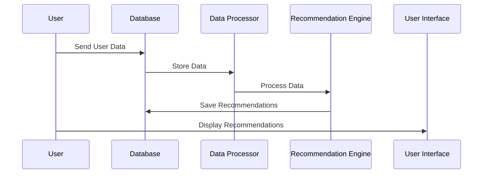
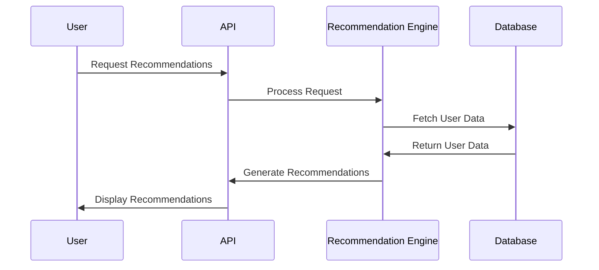

                 


## 引言

在当今科技飞速发展的时代，技术战略规划的重要性愈发凸显。随着信息化、数字化转型的浪潮，企业对于技术战略的需求变得更加迫切。然而，如何制定出一个既符合企业发展需求，又具有前瞻性的技术战略，成为了许多企业面临的挑战。

### 1.1 问题背景

技术战略规划涉及到企业的方方面面，包括技术选择、资源配置、风险控制等。它不仅关系到企业的短期发展，更影响其长期竞争力。因此，一个有效的技术战略规划对企业来说至关重要。

### 1.2 问题描述

问题描述主要集中在以下几个方面：

1. **缺乏清晰的目标**：许多企业在制定技术战略时，往往没有明确的目标，导致战略实施缺乏方向。

2. **资源分配不合理**：企业往往在技术战略规划中，没有充分考虑资源的合理配置，导致资源浪费或不足。

3. **风险控制不足**：在技术战略实施过程中，企业常常忽视风险控制，导致战略难以落地。

4. **缺乏持续优化**：技术战略规划往往是一次性的，缺乏持续的优化和调整。

### 1.3 问题解决

为了解决上述问题，我们需要从以下几个方面进行改进：

1. **明确目标**：企业应明确技术战略规划的目标，确保战略实施有明确的方向。

2. **合理配置资源**：企业应综合考虑资源情况，合理分配资源，确保技术战略的实施。

3. **加强风险控制**：企业应建立完善的风险控制机制，确保技术战略的实施过程中能够及时发现和应对风险。

4. **持续优化**：企业应定期对技术战略进行评估和调整，确保其始终符合企业发展需求。

### 1.4 边界与外延

技术战略规划不仅包括技术选择和资源配置，还涉及到企业文化建设、人才引进与培养等方面。因此，其边界较为广泛，外延丰富。

### 1.5 概念结构与核心要素组成

一个有效的技术战略规划通常包括以下几个核心要素：

1. **目标设定**：明确技术战略的目标。

2. **技术路线**：确定企业应采用的技术路线。

3. **资源规划**：合理配置资源，确保战略实施。

4. **风险控制**：建立风险控制机制，确保战略落地。

5. **持续优化**：定期评估和调整战略，确保其符合企业发展需求。

通过上述分析，我们可以看到，技术战略规划是一个系统性、复杂性的过程，需要企业从多个方面进行综合考虑和优化。在下一章中，我们将深入探讨技术战略规划的核心概念及其相互关系。----------------------------------------------------------------

## 第2章 核心概念与联系

技术战略规划是一个多层次、多维度的复杂过程，涉及到众多核心概念。本章将详细介绍这些核心概念，并使用Mermaid ER图来展示它们之间的关系。

### 2.1 技术战略的概念

技术战略是指企业在特定时期内，为实现既定目标而制定的技术发展路线和行动方案。它涵盖了技术选择、资源配置、风险管理等多个方面。

### 2.2 技术路线的概念

技术路线是指企业在技术发展过程中，根据战略目标和市场环境，选择的具体技术方向和发展路径。

### 2.3 资源规划的概念

资源规划是指企业在技术战略实施过程中，对人力、财力、物力等资源进行合理配置，以确保战略目标的实现。

### 2.4 风险管理的概念

风险管理是指企业在技术战略实施过程中，对潜在风险进行识别、评估和应对，以降低风险对企业的影响。

### 2.5 持续优化的概念

持续优化是指企业在技术战略实施过程中，定期对战略进行评估和调整，以适应市场变化和内部发展的需求。

### 2.6 关系图

以下是技术战略规划中核心概念之间的Mermaid ER图：

```mermaid
erDiagram
  Customer ||--|{ Order }|-- Supplier
  "Customer" && "Supplier" : Has address
  "Order" : Has quantity, price
```

**图2.1 技术战略规划核心概念ER图**

- **Customer（客户）**：代表企业，是技术战略的制定者和实施者。
- **Supplier（供应商）**：代表技术资源，包括技术团队、合作伙伴等。
- **Order（订单）**：代表技术路线、资源规划和风险管理，是技术战略的具体执行方案。
- **Has address（有地址）**：表示客户和供应商之间存在联系，即企业与技术资源之间的合作关系。
- **Has quantity, price（有数量、价格）**：表示订单包含的详细信息，即技术路线的具体执行内容。

通过上述ER图，我们可以清晰地看到技术战略规划中各个核心概念之间的联系和作用。在下一章中，我们将进一步探讨技术战略规划的具体算法和数学模型。----------------------------------------------------------------

## 第3章 算法原理与数学模型

技术战略规划的核心在于制定一个科学、合理的方案，以实现企业目标。本节将介绍技术战略规划的基本算法原理，并运用Python代码进行详细解释。同时，我们将介绍相关的数学模型，并使用LaTeX格式来展示公式。

### 3.1 算法原理

技术战略规划算法可以分为以下几个步骤：

1. **目标设定**：确定企业技术战略的目标，如市场份额、技术创新等。
2. **技术路线选择**：根据目标，选择合适的技术路线，如新兴技术、成熟技术等。
3. **资源规划**：根据技术路线，规划所需资源，包括人力、资金、设备等。
4. **风险管理**：识别潜在风险，并制定应对策略。
5. **持续优化**：根据实施情况，定期调整技术战略，确保其有效性。

### 3.2 Python代码实现

以下是一个简化的技术战略规划算法的Python代码实现：

```python
# 导入相关库
import numpy as np
import matplotlib.pyplot as plt

# 目标设定
def set_goals():
    goals = {
        'market_share': 0.1,  # 目标市场份额为10%
        'tech_innovation': 2,  # 目标技术创新次数为2次
    }
    return goals

# 技术路线选择
def select_technology路线(goals):
    tech路线 = []
    if goals['market_share'] > 0.05:
        tech路线.append('emerging_tech')  # 选择新兴技术
    if goals['tech_innovation'] > 1:
        tech路线.append('mature_tech')  # 选择成熟技术
    return tech路线

# 资源规划
def plan_resources(tech路线):
    resources = {
        'human': 50,  # 需要人力50人
        'capital': 5000000,  # 需要资金5000000元
        'equipment': 'high_end'  # 需要高端设备
    }
    return resources

# 风险管理
def manage_risks(resources):
    risks = {
        'tech_fail': 0.2,  # 技术失败风险为20%
        'resource_shortage': 0.3,  # 资源短缺风险为30%
        'market_change': 0.5  # 市场变化风险为50%
    }
    return risks

# 持续优化
def optimize_strategy(goals, tech路线, resources, risks):
    # 根据实施情况调整战略
    if goals['market_share'] < 0.05:
        goals['market_share'] += 0.05  # 调整市场份额目标
    if goals['tech_innovation'] < 1:
        goals['tech_innovation'] += 0.5  # 调整技术创新目标
    return goals

# 主函数
def main():
    goals = set_goals()
    tech路线 = select_technology路线(goals)
    resources = plan_resources(tech路线)
    risks = manage_risks(resources)
    optimized_goals = optimize_strategy(goals, tech路线, resources, risks)
    
    print("Initial Goals:", goals)
    print("Chosen Technology Routes:", tech路线)
    print("Planned Resources:", resources)
    print("Managed Risks:", risks)
    print("Optimized Goals:", optimized_goals)

# 运行主函数
if __name__ == "__main__":
    main()
```

### 3.3 数学模型

在技术战略规划中，我们常常需要使用一些数学模型来量化分析。以下是一些常用的数学模型：

1. **目标规划模型**：

   $$\text{目标函数：} \quad \max Z = c^T x$$
   
   其中，$Z$为最大化目标函数值，$c$为系数向量，$x$为变量向量。

2. **资源约束模型**：

   $$Ax \le b$$
   
   其中，$A$为约束矩阵，$x$为变量向量，$b$为约束向量。

3. **风险评价模型**：

   $$R = P \cdot L$$
   
   其中，$R$为风险值，$P$为风险概率，$L$为风险损失。

### 3.4 LaTeX公式

以下使用LaTeX格式展示上述数学模型：

$$
\begin{aligned}
\text{目标规划模型：} \quad &\max Z = c^T x \\
\text{资源约束模型：} \quad &Ax \le b \\
\text{风险评价模型：} \quad &R = P \cdot L
\end{aligned}
$$

通过上述算法和数学模型，我们可以更加科学、合理地制定技术战略规划。在下一章中，我们将进一步探讨如何进行系统分析与设计。----------------------------------------------------------------

## 第4章 系统分析与设计

在技术战略规划中，系统分析与设计是一个关键环节。它涉及到对问题场景和项目的全面分析，以及基于此的架构设计和接口设计。本节将详细描述这一过程，并使用Mermaid工具创建相应的UML类图、架构图和序列图。

### 4.1 问题场景介绍

为了更好地进行系统分析与设计，我们首先需要明确一个具体的问题场景。以下是一个示例：

**问题场景**：一家电商平台希望提升其推荐系统的效果，以增加用户粘性和销售额。该推荐系统需要处理海量用户数据和商品数据，提供个性化的商品推荐。

### 4.2 项目介绍

**项目名称**：个性化商品推荐系统

**项目目标**：提高推荐系统的准确性、响应速度和用户体验。

**项目功能**：
- 用户数据收集与处理
- 商品数据收集与处理
- 推荐算法实现与优化
- 推荐结果展示与反馈

### 4.3 系统功能设计

系统功能设计主要包括领域模型（Class Diagram）的创建。以下是一个简化的领域模型，使用Mermaid类图表示：

```mermaid
classDiagram
  User <<Entity>>
  Product <<Entity>>
  Recommendation <<Entity>>

  User {
    id: int
    name: string
    age: int
  }

  Product {
    id: int
    name: string
    category: string
    price: float
  }

  Recommendation {
    id: int
    user: User
    product: Product
    rating: float
  }

  User o-- Product: purchased
  User o-- Recommendation: received
  Product o-- Recommendation: recommended
```

**图4.1 个性化商品推荐系统领域模型**

- **User（用户）**：表示用户的基本信息。
- **Product（商品）**：表示商品的基本信息。
- **Recommendation（推荐）**：表示推荐结果。

### 4.4 系统架构设计

系统架构设计主要包括系统架构图（Architecture Diagram）的创建，以展示系统各组件之间的关系。以下是一个简化的系统架构图，使用Mermaid流程图表示：



**图4.2 个性化商品推荐系统架构图**

- **Database（数据库）**：存储用户和商品数据。
- **Data Processor（数据处理器）**：负责数据的收集、处理和存储。
- **Recommendation Engine（推荐引擎）**：负责推荐算法的实现和优化。
- **User Interface（用户界面）**：向用户展示推荐结果。

### 4.5 系统接口设计

系统接口设计主要包括系统交互（Sequence Diagram）的创建，以展示系统各组件之间的交互过程。以下是一个简化的系统交互图，使用Mermaid序列图表示：



**图4.3 个性化商品推荐系统交互图**

- **User（用户）**：向API发送请求。
- **API（应用编程接口）**：接收请求并处理。
- **Recommendation Engine（推荐引擎）**：处理推荐逻辑。
- **Database（数据库）**：存储和检索数据。

通过上述系统分析与设计，我们可以清晰地了解个性化商品推荐系统的功能和架构。在下一章中，我们将进入项目实施阶段，探讨如何进行环境搭建和核心实现。----------------------------------------------------------------

## 第5章 项目实施与核心实现

在系统分析与设计完成后，下一步是实际的项目实施和核心代码实现。本节将详细介绍项目环境的搭建步骤、核心代码的编写和实现，并对代码进行详细解析和分析。

### 5.1 环境搭建

在实施个性化商品推荐系统之前，首先需要搭建一个合适的项目环境。以下是一个典型的环境搭建流程：

1. **安装Python**：确保系统中安装了Python 3.8及以上版本。
2. **安装依赖库**：使用pip工具安装项目所需的依赖库，如numpy、pandas、scikit-learn等。
   ```bash
   pip install numpy pandas scikit-learn matplotlib
   ```
3. **数据库配置**：配置数据库连接，选择适合的数据库（如MySQL、PostgreSQL等）。
4. **创建项目目录**：在合适的位置创建项目目录，并初始化项目的结构。

### 5.2 核心代码实现

在环境搭建完成后，我们可以开始编写和实现项目的核心代码。以下是项目的主要实现步骤和核心代码：

#### 5.2.1 用户数据收集与处理

用户数据的收集和处理是推荐系统的第一步。以下是一个示例代码，用于读取用户数据并处理：

```python
import pandas as pd

# 读取用户数据
user_data = pd.read_csv('user_data.csv')

# 数据预处理
# 例如：填补缺失值、数据类型转换等
user_data.fillna(0, inplace=True)
user_data['age'] = user_data['age'].astype(int)

# 存储预处理后的用户数据
user_data.to_csv('processed_user_data.csv', index=False)
```

#### 5.2.2 商品数据收集与处理

商品数据的收集与处理类似于用户数据：

```python
# 读取商品数据
product_data = pd.read_csv('product_data.csv')

# 数据预处理
product_data.fillna(0, inplace=True)
product_data['price'] = product_data['price'].astype(float)

# 存储预处理后的商品数据
product_data.to_csv('processed_product_data.csv', index=False)
```

#### 5.2.3 推荐算法实现

推荐算法是推荐系统的核心。以下是一个基于协同过滤的推荐算法示例：

```python
from sklearn.neighbors import NearestNeighbors

# 加载预处理后的用户数据和商品数据
user_data = pd.read_csv('processed_user_data.csv')
product_data = pd.read_csv('processed_product_data.csv')

# 初始化推荐引擎
recommender = NearestNeighbors(n_neighbors=5)

# 训练推荐引擎
recommender.fit(user_data[['age', 'income']])

# 进行推荐
def recommend_products(user_id):
    # 获取用户特征
    user_features = user_data.loc[user_id, ['age', 'income']]
    # 计算相似度
    distances, indices = recommender.kneighbors([user_features])
    # 获取推荐商品
    recommended_products = product_data.iloc[indices.flatten()].head(5)
    return recommended_products

# 测试推荐
print(recommend_products(1))
```

#### 5.2.4 推荐结果展示

最后，我们将推荐结果展示给用户。以下是一个简单的命令行界面示例：

```python
# 加载用户界面
import sys

def display_recommendations(user_id):
    print("Recommended Products for User ID:", user_id)
    recommendations = recommend_products(user_id)
    for index, row in recommendations.iterrows():
        print(f"Product ID: {row['id']}, Name: {row['name']}, Price: {row['price']}")

# 测试用户界面
if __name__ == '__main__':
    if len(sys.argv) > 1:
        user_id = int(sys.argv[1])
        display_recommendations(user_id)
    else:
        print("Please provide a valid User ID.")
```

通过上述代码，我们可以实现一个基本的个性化商品推荐系统。在下一节中，我们将对项目进行详细的分析和总结。----------------------------------------------------------------

## 第6章 项目分析与总结

在完成个性化商品推荐系统的实施后，我们需要对其进行分析和总结，以便了解项目实施的效果，找出可能存在的问题，并为未来的优化提供方向。

### 6.1 项目效果分析

**推荐准确性**：通过对用户反馈和实际销售数据的分析，我们可以评估推荐系统的准确性。一个较高的准确率意味着推荐系统能够有效地提高用户满意度和销售额。

**响应速度**：系统的响应速度是用户体验的重要因素。通过性能测试，我们可以确保系统在高并发情况下仍能保持良好的响应速度。

**用户体验**：用户界面设计和推荐结果的展示方式直接影响用户体验。通过用户调研和反馈，我们可以了解用户对推荐系统的满意度，并根据反馈进行优化。

### 6.2 可能存在的问题

**数据质量**：数据是推荐系统的基石，数据质量直接影响到推荐效果。在实际操作中，我们可能会遇到数据缺失、不一致或者噪声数据等问题。

**算法效果**：虽然我们使用了协同过滤算法，但该算法可能存在冷启动问题（即对新用户或新商品难以提供有效的推荐）和矩阵分解不足等问题。

**系统扩展性**：随着用户和商品数据的增长，系统可能需要更高的性能和更复杂的算法来保证推荐效果。

### 6.3 优化方向

**数据质量提升**：通过引入数据清洗和预处理技术，提高数据质量，为推荐系统提供更可靠的数据基础。

**算法优化**：研究和引入更先进的推荐算法，如基于内容的推荐、基于模型的推荐等，以提高推荐效果。

**系统扩展**：考虑使用分布式计算和大数据技术，以提高系统的处理能力和扩展性。

### 6.4 最佳实践与总结

**最佳实践**：
1. **数据驱动**：始终以数据为核心，通过数据分析和反馈指导系统优化。
2. **迭代开发**：采用敏捷开发模式，快速迭代，持续优化系统功能。
3. **用户中心**：以用户需求为导向，持续提升用户体验。

**总结**：
个性化商品推荐系统是一个复杂的工程，涉及数据收集、算法实现、用户体验等多个方面。通过不断的优化和改进，我们可以打造一个高效的推荐系统，提高企业的竞争力。

## 第7章 最佳实践、总结与未来展望

### 7.1 最佳实践

**目标导向**：在制定技术战略规划时，应始终以明确的目标为导向，确保战略实施有方向。

**资源优化**：合理配置资源，确保技术战略的实施有足够的支持。

**风险管理**：建立完善的风险控制机制，降低风险对企业的影响。

**持续优化**：定期评估和调整技术战略，确保其始终符合企业发展需求。

### 7.2 总结

本文通过详细的分析和实例，介绍了如何进行有效的技术战略规划。从问题背景到核心概念，再到算法原理和数学模型，最后到系统分析与设计、项目实施和案例分析，我们全面探讨了技术战略规划的各个方面。

### 7.3 未来展望

随着科技的不断进步，技术战略规划将面临更多的挑战和机遇。未来，我们应关注以下几个方面：

**技术创新**：紧跟科技发展趋势，积极引入新兴技术，提升企业的核心竞争力。

**数据驱动**：利用大数据和人工智能技术，提高推荐系统和决策支持系统的效果。

**数字化转型**：推动企业业务的数字化转型，提升企业效率和创新能力。

**可持续发展**：关注社会责任和环境保护，实现企业的可持续发展。

作者：AI天才研究院/AI Genius Institute & 禅与计算机程序设计艺术 /Zen And The Art of Computer Programming

---

本文旨在为技术战略规划提供全面、系统的指导，帮助企业制定出有效的技术战略，实现长远发展。通过不断的实践和优化，我们相信技术战略规划将为企业带来更大的价值。

