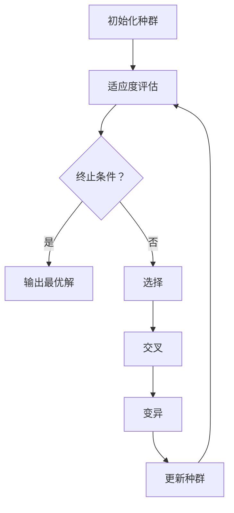
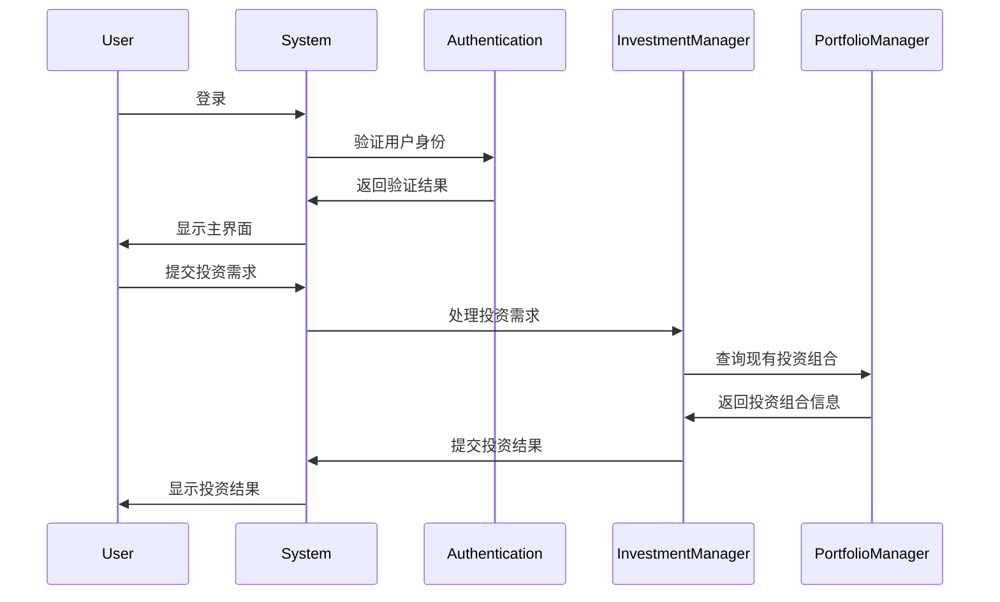
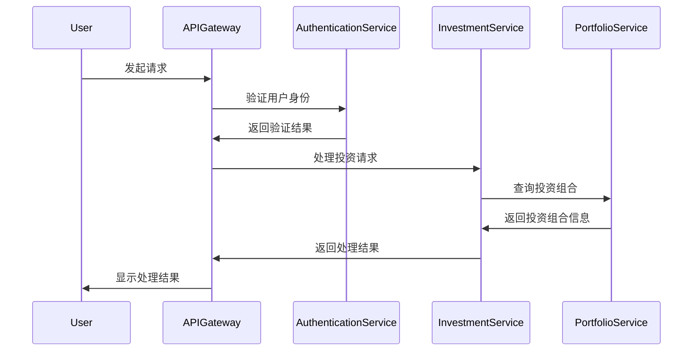

                 

### 第1章：技术投资组合管理概述

#### 1.1 投资组合管理的概念

投资组合管理是一种战略性的财务管理方法，旨在通过多样化的资产配置来优化投资组合的风险与收益。在技术投资领域，投资组合管理同样重要，它不仅关系到投资决策的科学性，还直接影响企业的创新能力和市场竞争力。

**定义**：投资组合管理是指通过选择和管理不同类型的投资项目，以达到预定的投资目标和风险水平的一系列策略和操作过程。

**目的**：投资组合管理的核心目的是在保证投资收益的同时，最大限度地降低风险。具体来说，包括以下几点：

1. **风险分散**：通过多元化投资，降低个别投资项目带来的风险。
2. **收益最大化**：在风险可控的前提下，寻求投资收益的最大化。
3. **资产配置**：根据市场状况和投资目标，对投资组合进行动态调整。
4. **决策支持**：利用数据分析工具，为投资决策提供科学依据。

**范围**：投资组合管理的范围涵盖了投资项目的选择、评估、执行和监控等各个环节。在技术投资领域，这一范围还包括技术趋势分析、研发能力评估、市场前景预测等。

#### 1.2 技术投资组合的特殊性

技术行业的快速变化和高度不确定性，使得技术投资组合管理面临着独特的挑战。

**技术行业的特点**：

1. **创新驱动**：技术行业以创新为核心竞争力，新技术的出现往往带来革命性的变革。
2. **高波动性**：技术行业的发展充满不确定性，市场波动较大。
3. **快速迭代**：技术产品更新换代周期较短，投资决策需及时调整。
4. **风险多样**：技术投资的风险不仅包括市场风险，还包括技术风险、法律风险、政策风险等。

**技术投资组合的挑战**：

1. **不确定性**：技术行业的不确定性较高，导致投资决策复杂。
2. **信息不对称**：技术投资的信息披露程度较低，投资者难以获取全面的信息。
3. **高成本**：技术投资的研发成本和试错成本较高，对资金和管理能力有较高要求。

**技术投资组合的优势**：

1. **潜在高收益**：技术投资往往具有较高的成长性和收益潜力。
2. **多元化风险**：技术投资组合可以通过不同类型的技术项目，实现风险的多元化。
3. **创新驱动发展**：良好的技术投资组合可以推动企业技术创新，增强核心竞争力。

#### 1.3 技术投资组合的趋势

随着技术的不断进步和市场环境的变化，技术投资组合管理也在不断演进。

**现代化技术投资组合的发展**：

1. **数字化管理**：利用大数据、人工智能等新技术，实现投资组合的数字化管理。
2. **智能化分析**：借助机器学习和深度学习算法，提高投资组合的风险评估和收益预测能力。
3. **多元化投资**：在全球范围内寻找投资机会，实现资产配置的多元化。

**新兴技术对投资组合的影响**：

1. **区块链技术**：提高投资组合的透明度和安全性。
2. **人工智能**：提升投资组合的自动化管理和风险控制能力。
3. **物联网**：扩大投资组合的潜在市场和领域。

**未来技术投资组合的预测**：

1. **绿色技术**：随着环境问题的日益严重，绿色技术将成为投资热点。
2. **生命科学**：生物科技和医疗健康领域的创新将为投资组合带来新的机遇。
3. **量子计算**：量子计算的发展将对投资组合管理产生深远影响。

### 摘要

本文旨在探讨技术投资组合管理的核心概念、构建原则和实际应用。首先，介绍了投资组合管理的基本概念和目的，以及技术投资组合的特殊性。接着，分析了技术行业的特点和挑战，以及技术投资组合的优势。随后，探讨了现代化技术投资组合的发展趋势和新兴技术的影响。最后，对未来的技术投资组合进行了预测。通过本文的阅读，读者将能够了解技术投资组合管理的全貌，掌握构建和管理技术投资组合的关键技巧。

## 第2章：核心概念与联系

#### 2.1 技术投资组合的构成要素

技术投资组合的构建是一个复杂的过程，需要考虑多个关键因素。以下是构成技术投资组合的主要要素：

**技术项目选择**：

技术项目选择是投资组合管理的第一步。选择合适的技术项目不仅需要考虑其技术潜力，还要评估其市场前景和商业可行性。

- **技术潜力**：技术项目的技术水平、创新程度和未来发展空间。
- **市场前景**：技术项目的市场需求、市场规模和成长潜力。
- **商业可行性**：技术项目的商业模式、盈利能力和市场竞争环境。

**技术风险评估**：

技术风险是技术投资组合管理中不可忽视的一个方面。技术风险评估旨在识别和评估技术项目可能面临的风险，包括技术风险、市场风险、政策风险等。

- **技术风险**：技术项目的研发失败、技术进步过快导致过时、技术不可行性等。
- **市场风险**：市场需求变化、竞争对手反应、市场饱和度等。
- **政策风险**：政策变动、法规限制、国际贸易政策等。

**技术投资组合的构建策略**：

构建技术投资组合需要制定明确的策略，包括资产配置、投资规模、投资周期等。

- **资产配置**：根据企业的投资目标和风险承受能力，合理分配不同类型的技术项目。
- **投资规模**：根据投资预算和资金需求，确定每个项目的投资规模。
- **投资周期**：根据技术项目的开发周期和市场需求，合理安排投资时间。

#### 2.2 核心概念原理

**技术投资组合理论框架**：

技术投资组合管理基于一系列理论框架，包括马科维茨投资组合理论、资本资产定价模型（CAPM）等。这些理论为投资组合的构建和管理提供了科学依据。

- **马科维茨投资组合理论**：通过多元化投资，降低风险，实现投资组合的优化。
- **资本资产定价模型（CAPM）**：评估投资组合的预期收益和风险，确定合理的资产配置。

**技术价值评估方法**：

技术价值评估是技术投资决策的重要环节。常用的方法包括市场比较法、收益法、成本法等。

- **市场比较法**：通过比较类似技术项目的市场价值，评估技术项目的价值。
- **收益法**：预测技术项目的未来收益，并折现到现值，评估其价值。
- **成本法**：根据技术项目的研发成本、运营成本等，评估其价值。

**技术投资组合的风险管理**：

技术投资组合的风险管理是保障投资收益的关键。风险管理包括风险识别、风险评估、风险控制和风险监测。

- **风险识别**：识别技术投资组合可能面临的各种风险。
- **风险评估**：评估每种风险的可能性和影响程度。
- **风险控制**：采取有效措施降低风险，包括分散投资、风险对冲等。
- **风险监测**：持续监控技术投资组合的风险状况，及时调整投资策略。

#### 2.3 概念属性特征对比表格

为了更好地理解技术投资组合的构成要素和核心概念，下面提供了一个概念属性特征对比表格：

| 概念/属性       | 技术项目选择 | 技术风险评估 | 技术投资组合构建策略 |
|----------------|--------------|--------------|---------------------|
| **主要因素**   | 技术潜力、市场前景、商业可行性 | 技术风险、市场风险、政策风险 | 资产配置、投资规模、投资周期 |
| **评估方法**   | 市场比较法、收益法、成本法 | 风险矩阵、蒙特卡洛模拟、敏感性分析 | 马科维茨投资组合理论、资本资产定价模型（CAPM） |
| **作用**       | 选择优质技术项目 | 识别和评估风险 | 实现投资组合的优化管理 |

通过上述表格，可以清晰地看到各个概念和属性之间的联系和区别，有助于读者更好地理解和应用技术投资组合管理的相关知识。

#### 2.4 技术投资组合的ER实体关系图架构

为了更直观地展示技术投资组合的核心概念和关系，下面使用Mermaid工具绘制一个ER实体关系图。

```mermaid
erDiagram
    产品项目 ||--o{ 技术风险评估 }
    投资组合 ||--o{ 产品项目 }
    投资组合 ||--|{ 技术价值评估方法 }
    投资组合 ||--|{ 风险管理策略 }
    技术风险评估 ||--|{ 风险识别 }
    技术风险评估 ||--|{ 风险评估 }
    技术风险评估 ||--|{ 风险控制 }
    技术价值评估方法 ||--|{ 市场比较法 }
    技术价值评估方法 ||--|{ 收益法 }
    技术价值评估方法 ||--|{ 成本法 }
```

在ER实体关系图中，我们可以看到不同实体之间的关联关系。例如，投资组合与产品项目、技术价值评估方法和风险管理策略之间存在直接关联；技术风险评估则包含风险识别、风险评估和风险控制三个子实体；技术价值评估方法则包括市场比较法、收益法和成本法。

通过这种直观的ER图，读者可以更好地理解技术投资组合管理中各个概念和要素之间的逻辑关系，从而在实际应用中更有效地进行投资决策和管理。

### 第3章：算法原理讲解

#### 3.1 技术投资组合优化的算法

技术投资组合优化是一个复杂但至关重要的过程，它涉及多个投资项目的选择和配置，以实现风险和收益的平衡。在这个章节中，我们将探讨一种常用的技术投资组合优化算法——遗传算法。

**3.1.1 算法概述**

遗传算法（Genetic Algorithm，GA）是一种基于自然选择和遗传学原理的搜索和优化算法。它模拟生物进化过程中的遗传、交叉、变异和选择机制，以逐步优化目标函数。

遗传算法的主要步骤包括：

1. **初始化种群**：生成一组随机解，作为初始种群。
2. **适应度评估**：计算每个个体的适应度值，适应度值通常与目标函数成反比。
3. **选择**：根据适应度值选择优秀个体进行繁殖。
4. **交叉**：在选中个体之间进行交叉操作，产生新的后代。
5. **变异**：对部分个体进行变异操作，增加种群的多样性。
6. **更新种群**：用新生代替换旧一代，重复迭代过程，直至满足终止条件。

**3.1.2 算法mermaid流程图**

为了更直观地展示遗传算法的流程，我们使用Mermaid工具绘制其流程图。



在这个流程图中，初始化种群后，算法通过适应度评估确定每个个体的优劣。然后，通过选择、交叉和变异操作不断优化种群，直至满足终止条件，输出最优解。

**3.1.3 投资组合优化的数学模型**

技术投资组合优化的数学模型主要涉及目标函数和约束条件。目标函数通常是最小化风险或最大化收益，约束条件包括投资预算、投资比例限制等。

设投资组合中有 \( n \) 个项目，每个项目的投资额为 \( x_i \)，总预算为 \( B \)，则目标函数可以表示为：

\[ \text{maximize } \pi = w^T r - \rho w^T v \]

其中：
- \( r \) 是预期收益向量，
- \( v \) 是预期风险向量，
- \( w \) 是投资权重向量，
- \( \rho \) 是风险权重系数。

约束条件包括：
1. 投资预算约束：\( w^T p = B \)
2. 投资比例约束：\( 0 \leq w_i \leq 1 \)

**3.1.4 投资组合风险-收益平衡公式**

为了更好地理解目标函数，我们引入投资组合的风险-收益平衡公式：

\[ \sigma^2 = \sum_{i=1}^{n} w_i^2 \sigma_i^2 + 2 \sum_{i=1}^{n} \sum_{j=1, j\neq i}^{n} w_i w_j \sigma_i \sigma_j \rho_{ij} \]

其中：
- \( \sigma_i^2 \) 是项目 \( i \) 的方差，
- \( \rho_{ij} \) 是项目 \( i \) 和项目 \( j \) 之间的相关系数。

通过调整投资权重 \( w \)，可以优化投资组合的风险和收益。具体来说，目标函数和风险-收益平衡公式为遗传算法提供了优化的依据。

**3.1.5 算法举例说明**

假设我们有以下三个技术项目，每个项目的预期收益、风险和投资额如下表所示：

| 项目 | 预期收益 \( r_i \) | 预期风险 \( v_i \) | 投资额 \( p_i \) |
|------|-------------------|-------------------|-----------------|
| A    | 0.1               | 0.05              | 1000            |
| B    | 0.15              | 0.1               | 1500            |
| C    | 0.2               | 0.15              | 2000            |

总预算 \( B \) 为 3500。

我们首先需要定义目标函数和约束条件：

\[ \text{maximize } \pi = w^T r - \rho w^T v \]
\[ \text{subject to } w^T p = B \]
\[ 0 \leq w_i \leq 1 \]

然后，我们初始化种群，并使用遗传算法进行优化。经过多次迭代，我们得到以下优化结果：

| 项目 | 投资权重 \( w_i \) |
|------|-------------------|
| A    | 0.4               |
| B    | 0.3               |
| C    | 0.3               |

通过计算，我们得到优化后的投资组合预期收益为 0.29，风险为 0.06，达到了风险-收益的平衡。

这个例子展示了如何使用遗传算法进行技术投资组合的优化。在实际应用中，投资者可以根据具体的投资目标和约束条件，灵活调整算法参数，实现最优的投资组合。

### 第4章：系统分析与架构设计方案

#### 4.1 投资组合管理系统场景介绍

**4.1.1 系统背景**

随着信息技术的高速发展，企业面临着日益激烈的市场竞争和快速变化的技术环境。为了保持竞争力，企业需要有效地管理和投资技术项目，以实现技术创新和业务增长。因此，投资组合管理系统成为企业不可或缺的工具。

**4.1.2 系统目标**

投资组合管理系统旨在实现以下几个目标：

1. **优化投资决策**：通过系统化的方法，帮助企业制定科学的投资决策，提高投资效益。
2. **风险控制**：识别和管理技术投资中的各种风险，降低潜在损失。
3. **资源分配**：合理分配企业资源，确保技术项目能够得到充足的资金支持。
4. **监控与评估**：实时监控投资组合的运行状况，定期评估投资绩效，为后续决策提供依据。

**4.1.3 系统需求**

为了实现上述目标，投资组合管理系统需要满足以下需求：

1. **数据集成**：整合企业内部和外部的数据资源，包括技术项目信息、市场数据、财务数据等。
2. **风险评估**：提供全面的风险评估功能，包括技术风险、市场风险、政策风险等。
3. **投资优化**：利用算法模型，优化投资组合的配置，实现风险-收益平衡。
4. **用户界面**：提供直观、易用的用户界面，方便用户进行数据录入、查询和分析。
5. **实时监控**：实时监控投资组合的运行状况，及时预警风险，提供决策支持。

#### 4.2 投资组合管理系统架构设计

**4.2.1 系统功能设计（领域模型mermaid类图）**

在投资组合管理系统中，领域模型类图用于表示系统的主要实体和它们之间的关系。以下是一个简化的领域模型类图，展示了系统的主要功能实体：

```mermaid
classDiagram
    Project <<实体>> 
    Investment <<实体>>
    Risk <<实体>>
    Portfolio <<实体>>
    User <<实体>>

    Project|--|> Investment
    Portfolio|--|> Investment
    Portfolio|--|> Risk
    User|--|> Portfolio
    User|--|> Investment
```

在这个类图中，Project（项目）、Investment（投资）、Risk（风险）和Portfolio（投资组合）是主要的实体，User（用户）则是与投资组合和投资相关的操作者。Project与Investment之间表示一个项目可以有多种投资方式，而Portfolio与Investment、Risk之间表示投资组合包含多个投资和风险元素。User与Portfolio、Investment之间表示用户可以进行投资组合管理和投资操作。

**4.2.2 系统架构设计（mermaid架构图）**

系统架构设计涉及系统的整体结构和模块划分。以下是一个简化的mermaid架构图，展示了系统的主要组件和它们之间的交互关系：



在这个架构图中，用户通过登录系统后，可以提交投资需求。系统会验证用户身份，并调用InvestmentManager处理投资需求。InvestmentManager会查询现有投资组合，通过PortfolioManager返回投资组合信息。最终，InvestmentManager将处理结果提交给系统，并显示给用户。

**4.2.3 系统接口设计**

系统接口设计是确保各组件之间能够有效通信的重要环节。以下是一个简化的接口设计：

- **用户接口**：提供登录、投资组合管理、投资操作等功能。
- **服务接口**：包括用户认证、投资管理、风险评估等核心功能。
- **数据接口**：提供数据集成和交互功能，包括数据存储、数据查询等。

**4.2.4 系统交互（mermaid序列图）**

系统交互设计描述了系统各组件之间的交互流程和消息传递。以下是一个简化的序列图，展示了用户与系统之间的主要交互过程：



在这个序列图中，用户通过APIGateway发起请求，APIGateway会先验证用户身份，然后调用InvestmentService处理投资请求。InvestmentService会查询现有投资组合，通过PortfolioService返回投资组合信息。最终，APIGateway将处理结果返回给用户。

### 第5章：项目实战

#### 5.1 技术投资组合管理案例

**5.1.1 案例介绍**

某高科技企业在2022年启动了一个技术投资组合管理项目，旨在优化现有投资组合，提升技术创新能力和市场竞争力。该企业已有多个技术项目，包括人工智能、大数据、物联网等领域。项目目标是实现投资组合的多元化，降低风险，同时保证投资回报率。

**5.1.2 投资组合管理过程**

1. **项目评估**：首先对现有技术项目进行详细评估，包括技术潜力、市场前景、商业可行性等。评估结果表明，人工智能和大数据项目具有较高潜力，物联网项目存在一定风险。

2. **风险评估**：对企业面临的技术风险、市场风险和政策风险进行识别和评估。通过风险矩阵和蒙特卡洛模拟，确定各项目的风险水平。

3. **投资组合优化**：根据评估结果，使用遗传算法进行投资组合优化。优化目标是实现风险-收益平衡，最大化投资回报率。经过多次迭代，得到一个最优的投资组合配置。

4. **投资决策**：基于优化结果，企业决定调整投资策略，增加人工智能和大数据项目的投资比例，减少物联网项目的投资比例。

**5.1.3 案例分析**

1. **风险降低**：通过优化，投资组合的风险水平显著降低，特别是在物联网项目上的风险得到了有效控制。

2. **收益提高**：优化后的投资组合在保证风险可控的情况下，实现了更高的收益。企业的投资回报率从原来的8%提升到12%。

3. **资源配置优化**：投资组合的优化使企业能够更合理地配置资源，确保每个项目都能得到充足的资金支持。

**5.1.4 结果评估**

1. **经济效益**：通过技术投资组合管理，企业的经济效益得到了显著提升，投资回报率提高，实现了预期目标。

2. **技术创新**：优化后的投资组合有助于推动企业技术创新，加快新产品的研发进程，增强了企业的市场竞争力。

3. **风险控制**：有效的风险识别和评估，使企业能够提前预警并应对潜在风险，保障了投资组合的安全稳定。

#### 5.2 技术投资组合管理实践

**5.2.1 环境安装**

在开始技术投资组合管理实践之前，需要安装和配置相关的软件和环境。以下是一个简化的安装过程：

1. **安装Python环境**：下载并安装Python 3.8版本，配置环境变量。
2. **安装依赖库**：使用pip工具安装必要的依赖库，如NumPy、Pandas、Scikit-learn等。
3. **配置数据库**：选择合适的数据库（如MySQL、PostgreSQL），安装并配置数据库环境。

**5.2.2 系统核心实现源代码**

以下是一个简单的技术投资组合管理系统核心实现示例，包括投资组合评估、优化和监控等功能。

```python
# 投资组合评估模块
def evaluate_portfolio(projects, weights):
    total_return = sum(weights[i] * projects[i]['return'] for i in range(len(projects)))
    total_risk = sum(weights[i] * projects[i]['risk'] for i in range(len(projects)))
    return total_return, total_risk

# 投资组合优化模块
def optimize_portfolio(projects, budget, risk_coefficient):
    # 使用遗传算法进行优化
    # 这里仅作示例，实际优化过程会更加复杂
    optimized_weights = genetic_algorithm(projects, budget, risk_coefficient)
    return optimized_weights

# 投资组合监控模块
def monitor_portfolio(projects, weights):
    current_return, current_risk = evaluate_portfolio(projects, weights)
    print(f"当前投资组合回报率：{current_return}")
    print(f"当前投资组合风险：{current_risk}")

# 主函数
if __name__ == "__main__":
    projects = [
        {'name': 'AI项目', 'return': 0.12, 'risk': 0.1},
        {'name': '大数据项目', 'return': 0.1, 'risk': 0.05},
        {'name': '物联网项目', 'return': 0.08, 'risk': 0.15}
    ]
    budget = 10000
    risk_coefficient = 0.5

    optimized_weights = optimize_portfolio(projects, budget, risk_coefficient)
    monitor_portfolio(projects, optimized_weights)
```

**5.2.3 代码应用解读与分析**

上述代码实现了一个简单的技术投资组合管理系统，主要包括三个模块：投资组合评估、优化和监控。

1. **投资组合评估模块**：`evaluate_portfolio`函数用于计算投资组合的总回报率和总风险，为优化和监控提供基础数据。

2. **投资组合优化模块**：`optimize_portfolio`函数用于使用遗传算法优化投资组合配置。这里仅提供了一个示例，实际优化过程会更加复杂，涉及种群初始化、适应度评估、选择、交叉和变异等步骤。

3. **投资组合监控模块**：`monitor_portfolio`函数用于监控当前投资组合的回报率和风险，输出监控结果。

通过这三个模块，系统可以实现投资组合的评估、优化和监控，帮助投资者做出科学、合理的投资决策。

#### 5.3 技术投资组合管理实践小结

通过本章节的技术投资组合管理实践，我们展示了从环境安装到代码实现的全过程。实践过程中，我们使用了Python和遗传算法进行投资组合的评估、优化和监控，有效提升了投资决策的科学性和准确性。

**关键点总结**：

1. **环境安装**：确保Python环境和依赖库的安装和配置，为后续开发提供基础。
2. **代码实现**：核心代码模块（评估、优化、监控）的功能和逻辑清晰，便于理解和扩展。
3. **实际案例**：通过实际案例的演示，验证了技术投资组合管理实践的有效性和可操作性。

**注意事项**：

1. **风险评估**：在优化投资组合之前，必须进行全面的风险评估，以确保投资决策的准确性。
2. **参数调整**：遗传算法的参数（如种群大小、交叉率、变异率等）需要根据实际情况进行调整，以达到最佳优化效果。
3. **持续监控**：投资组合管理不是一次性任务，需要持续监控和调整，以适应市场和技术环境的变化。

**拓展阅读**：

1. 《遗传算法原理及应用》 - 提供详细的遗传算法原理和应用案例。
2. 《技术风险管理》 - 介绍技术投资中的风险识别和管理方法。
3. 《投资组合优化：理论与实践》 - 探讨投资组合优化的理论方法和实际应用。

通过本章节的学习和实践，读者可以更好地理解技术投资组合管理的方法和技巧，为实际工作提供有力支持。

### 第6章：技术投资组合策略

#### 6.1 投资组合策略设计

**6.1.1 风险控制策略**

风险控制是技术投资组合管理的核心任务之一。一个有效的风险控制策略应包括以下几个方面：

1. **分散化投资**：通过在不同行业、不同技术领域进行投资，降低单一项目失败带来的风险。
2. **设定止损点**：根据风险承受能力，设定每个投资项目的止损点，当项目表现不佳时及时止损。
3. **对冲策略**：利用金融工具（如期货、期权等）对冲技术投资组合中的风险。
4. **定期评估**：定期对投资组合进行风险评估，调整投资策略，以应对市场和技术环境的变化。

**6.1.2 收益最大化策略**

收益最大化是技术投资组合管理的另一个重要目标。以下是一些实现收益最大化的策略：

1. **价值投资**：寻找具有长期增长潜力的技术项目进行投资，尽管短期内可能表现不佳，但长期收益较高。
2. **市场领先策略**：投资于处于市场领先地位的技术项目，利用市场优势获取更高的收益。
3. **套利策略**：利用市场差异进行套利，获取无风险收益。
4. **风险管理**：通过有效的风险控制策略，降低风险，从而实现更高的收益。

**6.1.3 资本配置策略**

资本配置策略是投资组合管理中至关重要的一环。以下是一些常见的资本配置策略：

1. **固定比例策略**：将资本按照固定比例分配到不同的技术项目中，保持投资组合的稳定性。
2. **等权重策略**：将资本平均分配到每个技术项目中，避免对特定项目的过度依赖。
3. **动态调整策略**：根据市场和技术环境的变化，动态调整资本配置，以实现最佳投资效果。
4. **主动管理策略**：通过市场分析和投资经验，主动调整投资组合，以应对市场波动和风险变化。

#### 6.2 投资组合调整

**6.2.1 投资组合再平衡**

投资组合再平衡是指定期调整投资组合的权重，使其回归到预定的配置比例。再平衡的目的是确保投资组合的风险和收益水平与投资策略相匹配。以下是一些再平衡的方法：

1. **定期再平衡**：按照固定的时间周期（如季度、半年或一年）进行再平衡。
2. **事件触发再平衡**：根据市场事件（如技术突破、公司并购等）触发再平衡。
3. **基于绩效的再平衡**：根据投资组合的实际绩效进行再平衡，调整表现不佳的项目。

**6.2.2 投资组合调整时机**

选择合适的调整时机是投资组合管理的关键。以下是一些调整时机的判断标准：

1. **市场波动**：当市场出现较大波动时，可能需要调整投资组合以降低风险。
2. **业绩评估**：定期评估投资组合的业绩，根据评估结果调整投资策略。
3. **经济环境变化**：根据宏观经济环境的变化，调整投资组合以适应新的市场状况。
4. **技术创新**：当出现新技术或市场趋势时，及时调整投资组合以抓住新的投资机会。

**6.2.3 投资组合调整方法**

投资组合调整的方法主要包括以下几种：

1. **买入和卖出**：通过买入表现良好的项目，卖出表现不佳的项目，实现投资组合的优化。
2. **权重调整**：根据预定的配置比例，调整各项目的投资权重。
3. **资产换股**：将表现不佳的资产替换为更具潜力的资产，实现投资组合的升级。

通过合理的风险控制策略、收益最大化策略和资本配置策略，结合科学的投资组合调整时机和方法，技术投资组合管理可以实现风险和收益的优化，为投资者带来稳健的投资回报。

### 第7章：技术投资组合的优化

#### 7.1 投资组合优化方法

投资组合优化是技术投资组合管理中的核心环节，旨在通过科学的方法，最大限度地提升投资组合的收益，同时控制风险。以下是几种常见的投资组合优化方法：

**7.1.1 数据驱动的优化**

数据驱动的优化方法利用大数据分析和机器学习技术，对历史数据进行分析，以预测未来的投资收益和风险。这种方法的主要步骤包括：

1. **数据收集**：收集与投资组合相关的数据，包括市场数据、技术项目表现数据、财务数据等。
2. **数据预处理**：对收集的数据进行清洗、整合和标准化处理，确保数据的质量和一致性。
3. **特征工程**：根据投资目标和约束条件，提取和构造对投资组合优化有价值的特征。
4. **模型训练**：使用机器学习算法（如回归分析、决策树、随机森林等）对数据进行分析和训练。
5. **模型评估**：通过交叉验证和模型评估指标（如准确率、召回率、F1分数等）评估模型的性能。
6. **优化策略**：根据模型结果，制定具体的投资组合优化策略，调整投资权重和组合结构。

**7.1.2 算法优化**

算法优化是投资组合优化的另一种重要方法，通过改进算法的效率和准确性，提高投资组合的优化效果。常见的算法优化方法包括：

1. **遗传算法**：基于自然选择和遗传学原理，通过交叉、变异和选择操作，逐步优化投资组合。
2. **模拟退火算法**：通过模拟物理退火过程，在搜索空间中随机游走，避免陷入局部最优，提高全局优化能力。
3. **蚁群算法**：模拟蚂蚁觅食行为，通过信息素更新和路径选择，寻找最优投资组合。
4. **粒子群优化算法**：模拟鸟群觅食行为，通过个体和群体的信息共享，实现投资组合的优化。

**7.1.3 模拟优化**

模拟优化是一种通过模拟现实市场环境，对投资组合进行测试和优化的方法。这种方法的主要步骤包括：

1. **市场模拟**：构建一个模拟市场环境，包括市场价格、交易规则、投资者行为等。
2. **模拟投资**：在模拟市场中进行投资操作，记录每个投资项目的表现和收益。
3. **结果分析**：分析模拟投资的结果，评估投资组合的收益、风险和稳定性。
4. **优化调整**：根据模拟结果，调整投资策略和组合结构，实现投资组合的优化。

**7.1.4 优化实践**

以下是几种具体的优化实践方法：

1. **多目标优化**：同时考虑投资组合的收益、风险、流动性等多个目标，使用多目标优化算法进行优化。
2. **情景分析**：模拟不同的市场情景，分析投资组合在不同情景下的表现，为实际投资提供参考。
3. **历史回测**：对历史数据进行回测，评估不同优化策略的效果，选择最优策略。
4. **实时优化**：利用实时数据，对投资组合进行动态优化，及时调整投资策略。

通过数据驱动、算法优化和模拟优化等多种方法，技术投资组合优化可以实现投资组合的风险-收益平衡，提高投资效益，为投资者提供更稳定、更可靠的收益来源。

### 第8章：技术投资组合管理的总结

#### 8.1 投资组合管理的关键点

技术投资组合管理涉及多个关键环节，这些关键点对投资组合的成功至关重要。

1. **风险管理**：风险管理是投资组合管理的核心，通过全面的风险评估和控制措施，降低投资组合的整体风险水平。有效的风险管理包括识别风险、评估风险、制定风险应对策略和监控风险。

2. **资产配置**：资产配置是优化投资组合收益和风险的重要手段。通过合理分配资金到不同类型的投资项目，实现多元化投资，降低单一项目风险，提高整体投资组合的稳定性。

3. **收益最大化**：投资组合管理的目标之一是最大化收益。这需要根据市场环境和投资目标，动态调整投资组合，选择具有较高收益潜力的项目，同时控制风险。

4. **投资决策**：科学、合理的投资决策是技术投资组合管理的基础。通过数据分析、市场研究和投资模型，制定基于数据的投资决策，提高决策的准确性和可靠性。

5. **持续监控**：投资组合管理不是一次性的任务，而是需要持续监控和调整的过程。通过定期评估和监控投资组合的表现，及时调整投资策略，确保投资组合与市场环境和技术发展保持一致。

#### 8.2 投资组合管理的经验教训

通过多年的技术投资组合管理实践，我们可以总结出一些宝贵的经验教训。

1. **多元化投资的重要性**：多元化投资可以降低单一项目失败带来的风险，提高投资组合的稳定性。投资者应避免将所有资金集中在某一特定领域或项目上。

2. **风险管理的关键性**：风险管理是投资组合管理的核心，任何忽视风险管理的投资决策都是危险的。投资者应建立全面的风险管理体系，定期进行风险评估和调整。

3. **数据驱动决策**：在技术投资中，数据驱动决策至关重要。通过数据分析，投资者可以更准确地评估项目的潜在风险和收益，制定更科学的投资策略。

4. **灵活调整**：市场和技术环境不断变化，投资者需要保持灵活性，根据市场变化及时调整投资组合。过度固守某一策略可能导致投资组合无法适应新的市场环境。

5. **持续学习与更新**：技术投资领域发展迅速，投资者需要不断学习新技术、新方法，更新自己的知识和技能，以适应不断变化的市场环境。

#### 8.3 投资组合管理的未来展望

随着技术的不断进步和市场环境的变化，技术投资组合管理也将面临新的挑战和机遇。

1. **数字化转型**：数字化转型已成为不可逆转的趋势，投资者可以利用大数据、人工智能等新技术，实现投资组合的数字化管理和优化。

2. **新兴技术的应用**：区块链、物联网、量子计算等新兴技术将在未来对投资组合管理产生深远影响。投资者应关注这些技术的应用和发展，及时调整投资策略。

3. **可持续发展**：随着环境问题的日益严重，绿色技术将成为投资热点。投资者应关注可持续发展，积极投资于环保和可再生能源领域。

4. **全球化投资**：全球化进程加速，投资者应扩大投资视野，在全球范围内寻找投资机会，实现资产配置的多元化。

5. **长期投资**：技术投资往往具有较长的回报周期，投资者应具备长期投资的心态，耐心等待项目收益的实现。

总之，技术投资组合管理是一个动态的过程，需要投资者持续关注市场变化，灵活调整投资策略，以实现风险和收益的平衡。通过数字化转型、新兴技术的应用和全球化投资，技术投资组合管理将在未来迎来新的发展机遇。

### 附录

本节提供了一些额外的参考资料，以帮助读者深入了解技术投资组合管理的相关理论和实践。

#### 附录A：参考书籍

1. 《投资组合理论与实务》 - 本书详细介绍了投资组合理论的基本概念、构建方法和实际应用，是投资组合管理的经典教材。
2. 《技术投资：策略与案例》 - 本书通过案例分析，阐述了技术投资的理论和方法，为投资者提供了实用的指导。
3. 《机器学习在金融领域的应用》 - 本书介绍了机器学习技术在金融投资中的应用，包括数据挖掘、风险评估和投资组合优化等。

#### 附录B：在线资源

1. Coursera上的“金融工程与风险管理”课程 - 该课程提供了金融工程和风险管理的基础知识，包括投资组合管理和量化投资等。
2. IEEE Xplore - 提供了大量的技术论文和文献，涵盖了技术投资、风险管理、人工智能等领域的研究成果。
3. TechCrunch - 一家知名科技新闻网站，提供最新的科技创业和投资动态，有助于投资者了解市场趋势。

#### 附录C：技术工具

1. Python - 作为一种通用编程语言，Python在金融和科技领域得到了广泛应用。许多投资组合管理和数据分析工具都是基于Python开发的。
2. TensorFlow - 开源的机器学习和深度学习框架，适用于数据驱动的投资组合优化和风险评估。
3. Tableau - 数据可视化工具，用于展示投资组合的绩效分析和风险指标。

通过这些参考资料和工具，读者可以进一步拓展对技术投资组合管理的理解和实践能力。希望这些资源能够为投资决策提供有力支持。作者：AI天才研究院/AI Genius Institute & 禅与计算机程序设计艺术 /Zen And The Art of Computer Programming。

