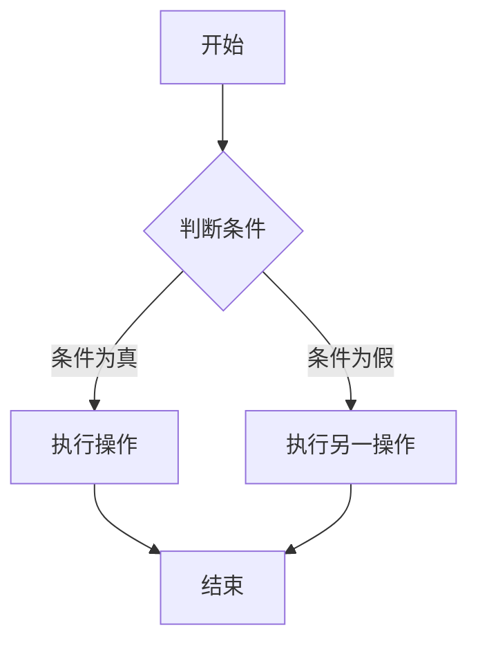

                 

## 引言：技术路线图规划的重要性

在当今快速发展的技术时代，技术路线图（Technical Roadmap）成为企业和技术团队实现长期目标和战略规划的重要工具。本文将深入探讨如何进行有效的技术路线图规划，帮助读者理解和掌握这一关键技能。

### 问题背景

技术领域的发展速度越来越快，新兴技术和创新层出不穷。与此同时，企业面临着前所未有的挑战，如市场竞争加剧、客户需求多样化、技术迭代周期缩短等。在这种情况下，如何确保技术团队的方向正确、资源有效配置、项目按时交付成为亟待解决的问题。

### 技术路线图的作用和意义

技术路线图是一种描述技术发展目标和实施步骤的战略性文档，它能够帮助团队和企业：

1. **明确目标和方向**：通过制定清晰的路线图，企业可以明确技术的发展方向和目标，确保资源的有效利用。
2. **协调内部和外部利益相关者**：技术路线图有助于内部团队和外部合作伙伴之间的沟通，确保各方目标一致。
3. **提升项目管理能力**：技术路线图提供了项目规划和时间管理的框架，有助于团队更好地分配资源、控制进度。
4. **推动技术创新和持续发展**：通过定期更新和调整技术路线图，企业可以保持技术领先地位，持续推动技术创新。

### 本文结构

本文将从以下几个方面展开讨论：

1. **技术路线图规划基础**：介绍技术路线图的基本概念、结构和内容。
2. **技术路线图规划流程**：详细阐述从需求分析到方案设计的全过程。
3. **核心概念与联系**：探讨影响技术路线图规划的关键因素和它们之间的关系。
4. **系统分析与架构设计**：通过具体的系统架构设计和实现方法，展示技术路线图的实际应用。
5. **项目实战**：结合实际案例，讲解如何在实际项目中应用技术路线图规划。
6. **最佳实践与结论**：总结最佳实践，并对技术路线图规划的未来发展趋势进行展望。

通过本文的阅读，读者将能够深入了解技术路线图规划的重要性，掌握其核心方法和最佳实践，为企业的技术发展提供有力支持。

## 概念界定

在进行有效的技术路线图规划之前，理解相关的基本概念和术语至关重要。以下是对一些关键概念的定义和解释。

### 技术路线图（Technical Roadmap）

技术路线图是一种战略文档，它描述了技术项目的目标、实施步骤、时间表和资源需求。它不仅涵盖了技术实现，还包括市场、商业策略和团队协作等多个方面。

### 技术趋势（Technology Trends）

技术趋势是指某一时期内技术发展的方向和重点。了解技术趋势有助于企业把握市场机遇，调整技术路线图以适应未来发展的需要。

### 市场需求（Market Demand）

市场需求是指用户对产品或服务的需求，包括功能需求、性能需求和用户体验需求等。了解市场需求有助于技术团队确定优先级和资源分配。

### 技术成熟度（Technology Maturity）

技术成熟度是指某一技术从概念验证到市场应用的过程中所达到的发展阶段。技术成熟度评估有助于团队判断技术的可行性和风险。

### 资源评估（Resource Assessment）

资源评估是指对团队内部资源（如人员、资金、技术能力）的评估。资源评估有助于确保技术路线图的实施具备可行性。

### 技术路线图要素（Components of Technical Roadmap）

技术路线图通常包含以下核心要素：

- **目标（Goals）**：明确的技术和商业目标。
- **里程碑（Milestones）**：实现目标的关键节点和时间点。
- **任务（Tasks）**：为实现里程碑而设定的具体工作内容。
- **时间表（Timeline）**：每个任务和里程碑的预计完成时间。
- **资源（Resources）**：实施路线图所需的资源和分配。

### 技术路线图与战略规划的关联（Connection to Strategic Planning）

技术路线图是战略规划的重要组成部分，它将企业的长期战略目标转化为具体的技术实现路径。通过技术路线图，企业可以确保其技术发展符合战略方向，实现可持续的竞争优势。

通过上述概念的界定，我们可以更好地理解技术路线图在技术规划中的重要作用，为后续的深入探讨打下坚实的基础。

### 技术路线图的定义

技术路线图是一种战略性的文档，它详细描述了技术项目的目标、实现路径和时间表。其核心作用在于为企业和团队提供清晰的指导，确保技术发展符合商业战略和市场需求。技术路线图不仅关注技术的实现细节，还涵盖了市场趋势、资源分配和项目管理等多个方面。

一个完整的技术路线图通常包含以下几个关键组成部分：

1. **目标（Goals）**：明确技术路线图要实现的长远目标和短期目标，这些目标应与企业的整体战略保持一致。
2. **里程碑（Milestones）**：设定一系列重要节点，每个里程碑代表技术发展的一个重要阶段或成果。
3. **任务（Tasks）**：为实现每个里程碑而设定的具体工作内容和步骤，包括研发、测试、部署等。
4. **时间表（Timeline）**：为每个任务和里程碑设定预计完成的时间，确保项目能够按时交付。
5. **资源（Resources）**：列出实施技术路线图所需的资源，包括人力、资金和技术设备等。
6. **风险评估（Risk Assessment）**：识别项目实施过程中可能面临的风险，并制定相应的应对措施。

技术路线图的类型多种多样，常见的包括：

- **短期路线图**：通常涵盖几个月到一年的时间，侧重于短期目标和具体任务的实现。
- **长期路线图**：涵盖一年以上的时间，用于规划长期目标和战略布局。
- **阶段性路线图**：按照项目发展阶段划分，如概念验证、产品开发、市场推广等。
- **综合路线图**：将多个项目或技术领域整合在一起，形成一张全面的规划图。

不同类型的技术路线图适用于不同情境和需求，企业应根据实际情况灵活选择和调整。

### 技术路线图的核心要素

技术路线图的成功实施依赖于其核心要素的明确和细化。以下是技术路线图中的关键核心要素：

1. **目标（Goals）**：明确的目标是技术路线图的起点。这些目标应具体、可衡量、可实现、相关性强且时限明确（SMART原则）。例如，“在2025年前，实现企业业务流程的全面数字化转型”。

2. **里程碑（Milestones）**：里程碑是项目进度的重要节点，标志着技术发展的关键阶段。它们帮助团队评估进度和成果，确保项目按计划进行。例如，“在Q2完成新产品的原型设计，并在Q4实现产品发布”。

3. **任务（Tasks）**：任务是实现里程碑的具体工作内容，通常包括研发、测试、部署等步骤。每个任务应详细描述所需的工作量、负责人员、资源和时间安排。例如，“研发团队需要在Q1完成新算法的初步开发，并在Q2进行性能优化”。

4. **时间表（Timeline）**：时间表为每个任务和里程碑设定预计完成的时间，是项目管理的重要工具。制定时间表时，应充分考虑任务之间的依赖关系和资源分配。例如，“Q1的任务A完成后，才能开始Q2的任务B”。

5. **资源（Resources）**：资源包括人力、资金、设备和技术等。明确资源需求并合理分配，是确保技术路线图顺利实施的基础。例如，“为了完成新产品的研发，需要5名高级工程师和200万元研发经费”。

6. **风险评估（Risk Assessment）**：识别和评估项目实施过程中可能面临的风险，并制定相应的应对措施。例如，“由于市场环境的不确定性，项目可能面临需求变化的风险，因此需要定期更新需求文档，以便快速调整”。

通过明确这些核心要素，技术路线图能够提供清晰的指导，帮助团队有效地实现技术目标。

### 技术路线图与战略规划的关联

技术路线图不仅是技术团队的工作指南，更是企业战略规划的重要组成部分。它将企业的长期战略目标转化为具体的技术实现路径，确保技术发展与企业整体战略保持一致。

首先，技术路线图的制定过程需要深入分析企业的战略目标和市场环境。例如，企业可能制定了“五年内实现业务全球化”的战略目标，技术路线图则需要具体描述如何通过技术手段（如跨国电商平台、本地化服务等）来实现这一目标。

其次，技术路线图在战略规划中起到了桥梁作用，将战略目标与具体项目联系起来。通过明确技术目标、里程碑、任务和时间表，技术路线图能够确保每一项技术任务都与企业的战略方向相匹配，避免资源浪费和目标偏离。

最后，技术路线图的定期更新和调整也是战略规划的重要环节。随着市场环境和技术的不断发展，企业需要及时调整技术路线图，以确保其与最新战略保持一致。例如，当出现新的技术趋势或市场需求变化时，技术路线图需要相应地调整目标和里程碑，以适应新的发展方向。

总之，技术路线图与战略规划的紧密关联，不仅有助于确保企业技术发展的方向正确，还能提升项目管理效率，实现企业的长期战略目标。

### 第1章：技术路线图规划基础

#### 1.1 技术路线图概述

技术路线图是一种关键的规划工具，用于描述技术项目的目标、实现路径和时间表。它不仅涵盖了技术实现，还包括市场、商业策略和团队协作等多个方面。技术路线图的主要目的是为企业和团队提供清晰的指导，确保技术发展与企业整体战略保持一致，从而实现资源的最优配置和项目的成功交付。

#### 1.1.1 技术路线图的概念

技术路线图（Technical Roadmap）是一种战略文档，它描述了技术项目的目标、实现路径、时间表和所需资源。这种文档通常包括以下几个方面：

1. **目标（Goals）**：明确技术路线图要实现的长远目标和短期目标。这些目标应具体、可衡量、可实现、相关性强且时限明确（SMART原则）。
2. **里程碑（Milestones）**：设定一系列重要节点，每个里程碑代表技术发展的一个重要阶段或成果。
3. **任务（Tasks）**：为实现每个里程碑而设定的具体工作内容和步骤，包括研发、测试、部署等。
4. **时间表（Timeline）**：为每个任务和里程碑设定预计完成的时间，确保项目能够按时交付。
5. **资源（Resources）**：列出实施技术路线图所需的资源，包括人力、资金、设备和技术等。
6. **风险评估（Risk Assessment）**：识别项目实施过程中可能面临的风险，并制定相应的应对措施。

技术路线图是战略规划的重要组成部分，它帮助企业将战略目标转化为具体的技术实现路径，确保技术发展与企业整体战略保持一致。

#### 1.1.2 技术路线图的结构与内容

技术路线图的结构和内容根据企业的需求和项目的特点而有所不同，但通常包含以下几个关键部分：

1. **封面和目录**：包括技术路线图的名称、版本号、制定日期和参与人员等基本信息，以及目录，方便读者快速查找相关内容。
2. **引言**：简要介绍技术路线图的背景、目的和重要性，为后续内容提供背景信息。
3. **目标和愿景**：明确技术路线图要实现的长远目标和愿景，这些目标应与企业的战略目标保持一致。
4. **核心要素**：详细描述技术路线图的核心要素，包括目标、里程碑、任务、时间表和资源等。
5. **实施步骤**：列出实现技术路线图的详细步骤，包括关键里程碑、任务和时间表。
6. **风险评估与应对**：识别项目实施过程中可能面临的风险，并制定相应的应对措施。
7. **附录**：包括相关文档、数据、图表等补充材料，为技术路线图的制定和实施提供支持。

#### 1.1.3 技术路线图的分类

根据应用场景和需求的不同，技术路线图可以分为以下几种类型：

1. **短期路线图**：通常涵盖几个月到一年的时间，侧重于短期目标和具体任务的实现。这种路线图适用于快速迭代和灵活调整的项目。
2. **长期路线图**：涵盖一年以上的时间，用于规划长期目标和战略布局。这种路线图适用于需要长期规划和持续发展的项目。
3. **阶段性路线图**：按照项目发展阶段划分，如概念验证、产品开发、市场推广等。这种路线图有助于团队在不同阶段明确目标和任务。
4. **综合路线图**：将多个项目或技术领域整合在一起，形成一张全面的规划图。这种路线图适用于涉及多个项目和领域的大型企业。

通过明确技术路线图的概念、结构和内容，我们可以更好地理解和应用这一工具，为企业的技术发展提供有力支持。

#### 1.2 技术路线图规划流程

技术路线图规划是一个系统性的过程，涉及多个关键步骤和决策。以下是技术路线图规划的主要流程：

##### 1.2.1 需求分析

需求分析是技术路线图规划的第一步，其目的是明确项目需要解决的核心问题以及实现的目标。具体步骤如下：

1. **收集需求**：通过与客户、市场部门和其他利益相关者的沟通，收集项目需求。这些需求可以是功能性的，也可以是非功能性的，如性能、可靠性、安全性等。
2. **整理和分类**：对收集到的需求进行整理和分类，确定哪些是优先级最高的需求。这一步骤有助于确保在资源有限的情况下，能够优先实现最重要的功能。
3. **需求文档**：将整理后的需求形成正式的需求文档，文档中应详细描述每个需求的内容、优先级和相关的背景信息。

##### 1.2.2 目标设定

在需求分析的基础上，设定清晰的目标是技术路线图规划的核心。以下是目标设定的步骤：

1. **确定长期目标**：根据企业的战略方向，设定长期目标，这些目标应具有可衡量性和时限性。例如，在未来三年内，实现某一技术领域的全球领先地位。
2. **设定短期目标**：将长期目标分解为短期目标，每个短期目标应具体、可实现。例如，在下一季度内，完成某一关键模块的开发和测试。
3. **制定目标文档**：将设定的目标形成正式的目标文档，文档中应详细描述每个目标的内容、实现方式和评估标准。

##### 1.2.3 资源评估

资源评估是确保技术路线图可行性的关键步骤。以下是资源评估的主要流程：

1. **确定资源需求**：根据项目需求和目标，确定所需的资源，包括人力、资金、技术和设备等。资源需求的确定应考虑项目的规模、复杂度和时间要求。
2. **评估现有资源**：评估团队现有资源的状况，包括人员的技能水平、资金的可利用性、设备的可用性等。这一步骤有助于确定哪些资源是充足的，哪些资源可能存在短缺。
3. **资源分配计划**：根据资源需求评估结果，制定资源分配计划。资源分配计划应确保关键资源能够及时到位，以支持项目的顺利推进。

##### 1.2.4 方案设计

方案设计是技术路线图规划的核心环节，其目的是制定实现目标的详细方案。以下是方案设计的步骤：

1. **制定初步方案**：根据需求、目标和资源评估结果，制定初步的技术方案。初步方案应包括技术路线、关键模块的设计和实现方法。
2. **评估方案可行性**：对初步方案进行可行性评估，包括技术实现难度、成本和风险等。评估结果将决定方案的可行性和改进方向。
3. **制定详细方案**：在初步方案的基础上，制定详细的技术方案。详细方案应包括每个模块的具体实现细节、接口设计、数据结构和技术标准等。
4. **形成方案文档**：将详细方案形成正式的方案文档，文档中应详细描述每个模块的功能、实现方法和接口规范。

##### 1.2.5 实施与监控

实施与监控是技术路线图规划的最后一步，其目的是确保方案能够按计划顺利实施，并在过程中及时调整。以下是实施与监控的主要流程：

1. **制定实施计划**：根据详细方案，制定实施计划。实施计划应包括任务分配、时间表、资源需求和风险评估等。
2. **实施任务**：按照实施计划，逐步完成各项任务。在实施过程中，应保持与团队和其他利益相关者的沟通，确保任务的顺利进行。
3. **监控进度**：定期监控项目进度，确保任务按计划完成。监控过程中，如发现进度偏差，应及时调整计划，以确保项目能够按时交付。
4. **评估与反馈**：在项目完成后，进行全面的评估和反馈。评估结果将用于总结经验教训，改进未来的技术路线图规划。

通过上述步骤，技术路线图规划能够为企业和团队提供清晰的指导，确保技术项目能够顺利实施，实现预期的目标。

#### 1.3 技术路线图工具与方法

在技术路线图规划过程中，选择合适的工具和方法至关重要，这不仅能提高工作效率，还能确保规划的科学性和可行性。以下将介绍几种常见的技术路线图工具和方法。

##### 1.3.1 常见工具

1. **Microsoft PowerPoint**：PowerPoint 是一种广泛使用的演示工具，可以通过幻灯片形式展示技术路线图的各个部分，如目标、里程碑、任务和时间表等。

2. **Google Sheets**：Google Sheets 是一种在线表格工具，可以用于创建和共享技术路线图的数据部分，如资源需求、时间表和风险评估等。

3. **Lucidchart**：Lucidchart 是一种专业的流程图和图表绘制工具，支持多种图表类型，如思维导图、流程图和实体关系图，非常适合绘制技术路线图。

4. **Project Management Software**：如JIRA、Trello、Asana等项目管理软件，可以帮助团队跟踪任务进度、资源分配和风险评估等。

##### 1.3.2 路线图绘制方法

1. **Gantt图**：Gantt图是一种常用的路线图绘制方法，通过横道图展示项目的进度和时间安排。每个任务都用一条线表示，线的长度代表任务的持续时间。

2. **思维导图**：思维导图通过图形化的方式展示各个部分之间的关系，非常适合用于梳理复杂的技术路线图。它可以清晰地展示项目的层次结构和关键节点。

3. **实体关系图（ER Diagram）**：实体关系图用于描述数据之间的关系，可以帮助团队理解数据模型和系统架构，是技术路线图规划的重要工具。

4. **Kanban图**：Kanban图是一种用于可视化任务流程的工具，通过卡片和看板展示任务的当前状态，非常适合用于项目管理。

##### 1.3.3 跨部门协作技巧

技术路线图的规划通常涉及多个部门和角色，因此跨部门协作是确保规划成功的关键。以下是一些跨部门协作的技巧：

1. **建立沟通机制**：建立定期会议、邮件列表和即时通讯工具，确保团队成员之间能够及时沟通和分享信息。

2. **明确职责和权限**：明确每个部门和角色的职责和权限，确保任务能够高效地分配和执行。

3. **共同制定目标**：鼓励各部门参与目标设定，确保所有团队成员都了解项目的目标和期望结果。

4. **利用项目管理工具**：使用项目管理工具帮助团队跟踪任务进度、资源和风险，确保项目能够按时交付。

通过选择合适的工具和方法，并运用有效的跨部门协作技巧，技术路线图规划可以更加高效、有序地进行，为企业的技术发展提供强有力的支持。

#### 1.4 背景介绍

技术路线图规划的成功实施离不开对背景的深入理解。以下是技术路线图发展的背景、企业需求背景以及案例分析。

##### 技术路线图发展背景

技术路线图的概念起源于20世纪60年代的航空航天和军事领域，用于规划和指导复杂项目的开发。随着信息技术和项目管理理论的不断发展，技术路线图逐渐被广泛应用于商业和技术项目中。

在21世纪初，随着互联网和移动技术的兴起，技术路线图的用途更加多样化，不再局限于大型项目，也应用于中小型企业和快速迭代的产品开发。现代技术路线图更加注重灵活性、可定制性和跨部门的协作，能够更好地适应快速变化的市场环境和技术发展趋势。

##### 企业需求背景

在当今竞争激烈的市场环境中，企业需要通过技术创新来保持竞争优势。技术路线图作为一种规划工具，能够帮助企业在复杂的技术领域中找到清晰的发展方向，确保资源投入的有效性和效率。以下是企业对技术路线图的主要需求：

1. **明确目标和方向**：技术路线图能够帮助企业在技术发展的海洋中找到明确的方向，确保团队的努力和资源投入能够产生最大的效益。

2. **协调内部和外部资源**：技术路线图通过明确任务和里程碑，有助于企业协调内部团队和外部合作伙伴的资源，确保项目能够按时交付。

3. **提升项目管理能力**：技术路线图提供了项目规划和时间管理的框架，有助于团队更好地分配资源、控制进度，减少项目风险。

4. **推动技术创新**：通过定期更新和调整技术路线图，企业能够持续关注技术趋势和市场需求，推动技术创新和持续发展。

##### 案例分析

为了更好地理解技术路线图在实际项目中的应用，以下是两个典型的案例分析。

**案例1：某科技公司的产品发布**

某科技公司计划在一年内发布一款新型智能家居设备。为了确保项目成功，公司首先进行了需求分析，明确了用户需求和市场趋势。随后，制定了详细的技术路线图，包括以下几个关键部分：

1. **目标设定**：明确产品发布的时间和技术目标，如软件的功能完整性、硬件的性能指标等。
2. **里程碑规划**：设定多个里程碑，如概念验证、原型设计、产品测试、市场推广等。
3. **资源评估**：评估所需的资源，包括研发人员、资金、设备和测试设备等。
4. **方案设计**：制定详细的技术方案，包括软件架构、硬件设计、系统集成和测试策略等。
5. **实施与监控**：按照技术路线图的计划，逐步完成各项任务，并定期监控项目进度，及时调整计划。

通过上述步骤，该公司成功在预定时间内发布了产品，并在市场上取得了良好的反响。

**案例2：某传统制造企业的数字化转型**

某传统制造企业希望通过数字化转型提升生产效率和市场竞争力。为了实现这一目标，公司制定了一个长期的技术路线图：

1. **需求分析**：详细分析企业的生产流程、管理需求和现有技术基础。
2. **目标设定**：明确数字化转型的长期目标，如提高生产自动化水平、优化供应链管理等。
3. **资源评估**：评估所需的资源，包括资金、人才和设备等。
4. **方案设计**：制定详细的数字化方案，包括工业物联网、大数据分析、云计算等。
5. **实施与监控**：逐步推进数字化项目，建立数据采集和分析系统，优化生产流程和管理模式。

通过技术路线图的指导，该制造企业成功实现了数字化转型，显著提升了生产效率和竞争力。

通过上述案例分析，我们可以看到技术路线图在企业中的重要作用。通过合理规划和技术实施，企业能够实现技术目标，提升市场竞争力，实现可持续发展。

#### 1.5 本章小结

本章详细介绍了技术路线图的基础知识，包括其定义、结构和内容，以及规划流程、工具与方法。技术路线图作为一种关键的规划工具，能够帮助企业明确目标、协调资源、提升项目管理能力，并推动技术创新。通过本章的学习，读者应掌握以下关键知识点：

1. **技术路线图的概念**：理解技术路线图的基本定义、结构和用途。
2. **技术路线图的类型**：了解短期、长期、阶段性及综合路线图的区别和应用场景。
3. **规划流程**：掌握需求分析、目标设定、资源评估、方案设计及实施与监控的步骤。
4. **工具与方法**：熟悉常见的路线图绘制工具和方法，如Gantt图、思维导图和Kanban图。

通过本章的学习，读者能够为后续章节中的深入探讨打下坚实的基础，并能够将技术路线图规划应用于实际项目中，提升企业的技术竞争力。

## 第2章：核心概念与联系

#### 2.1 核心概念原理

技术路线图规划涉及多个核心概念，这些概念不仅相互联系，而且在规划过程中起着至关重要的作用。以下将详细探讨这些核心概念及其相互关系。

##### 2.1.1 技术趋势

技术趋势是技术路线图规划中一个至关重要的概念，它描述了某一时期内技术发展的方向和重点。技术趋势的识别和把握对于企业的技术发展具有深远影响。技术趋势可能包括新兴技术的出现、现有技术的改进、以及技术标准的变化等。以下是一些关键方面：

1. **新兴技术的出现**：例如，人工智能、区块链、物联网等技术的崛起，为各行各业带来了新的机遇和挑战。
2. **技术改进**：现有技术的不断优化和改进，如云计算性能的提升、5G网络的普及等。
3. **技术标准**：技术标准的更新和变化，例如，ISO标准、IEEE标准等，对技术实现和产品兼容性具有重要影响。

技术趋势的识别有助于企业把握市场机遇，调整技术路线图，以适应快速变化的技术环境。

##### 2.1.2 市场需求

市场需求是技术路线图规划的另一个核心概念，它反映了用户对产品或服务的需求。市场需求分析是确保技术发展符合用户需求的重要步骤。以下是一些关键方面：

1. **功能需求**：用户对产品功能的具体要求，如高效率、易用性、可靠性等。
2. **性能需求**：用户对产品性能的期望，如处理速度、响应时间、安全性等。
3. **用户体验需求**：用户对产品交互、界面设计和整体体验的期望。

通过深入了解市场需求，企业可以确保其技术路线图能够满足用户需求，提升用户满意度。

##### 2.1.3 技术成熟度

技术成熟度是评估某一技术从概念验证到市场应用过程中所达到的发展阶段。技术成熟度对技术路线图规划具有重要影响。以下是一些关键方面：

1. **概念验证**：技术的基本原理是否成立，是否具有可行性。
2. **原型开发**：技术原型是否能够实现预期的功能，并进行初步测试。
3. **产品开发**：技术产品是否达到市场应用阶段，具备商业可行性。
4. **市场推广**：技术产品在市场上的接受程度，市场反馈和用户评价。

技术成熟度的评估有助于企业判断技术的可行性和风险，从而在技术路线图中合理分配资源。

##### 2.1.4 资源评估

资源评估是技术路线图规划中不可或缺的一环，它涉及对项目所需资源的全面分析。资源评估的准确性直接影响项目的成功与否。以下是一些关键方面：

1. **人力资源**：评估团队的人员结构、技能水平和人力资源的可利用性。
2. **资金资源**：评估项目所需的资金预算，包括研发经费、运营费用等。
3. **设备资源**：评估项目所需的硬件设备和软件工具。
4. **时间资源**：评估项目的时间安排，包括开发周期、测试周期和上线时间等。

通过详细的资源评估，企业可以确保技术路线图的实施具备可行性。

##### 2.1.5 技术路线图要素

技术路线图的核心要素包括目标、里程碑、任务、时间表和资源等。这些要素相互关联，构成了一个完整的技术规划框架。以下是对这些要素的详细解释：

1. **目标**：明确技术路线图要实现的长远目标和短期目标。目标应具体、可衡量、可实现、相关性强且时限明确（SMART原则）。
2. **里程碑**：设定一系列重要节点，每个里程碑代表技术发展的一个重要阶段或成果。里程碑有助于团队评估进度和成果。
3. **任务**：为实现每个里程碑而设定的具体工作内容和步骤，包括研发、测试、部署等。任务应详细描述所需的工作量、负责人员、资源和时间安排。
4. **时间表**：为每个任务和里程碑设定预计完成的时间，确保项目能够按时交付。时间表的制定应充分考虑任务之间的依赖关系和资源分配。
5. **资源**：列出实施技术路线图所需的资源，包括人力、资金、设备和技术等。资源需求的确定应考虑项目的规模、复杂度和时间要求。

通过明确和细化这些核心要素，技术路线图能够为企业的技术发展提供清晰、科学的指导。

#### 2.1.6 概念属性特征对比表格

为了更好地理解技术路线图规划中的核心概念，以下是这些概念属性的对比表格：

| 核心概念 | 定义 | 关键属性 | 影响因素 | 关联关系 |
| --- | --- | --- | --- | --- |
| 技术趋势 | 描述技术发展的方向和重点 | 新兴技术、技术改进、标准变化 | 市场环境、技术发展速度 | 与市场需求、技术成熟度相关 |
| 市场需求 | 反映用户对产品或服务的需求 | 功能需求、性能需求、用户体验需求 | 用户需求变化、市场竞争 | 与技术路线图目标相关 |
| 技术成熟度 | 评估技术的可行性和发展阶段 | 概念验证、原型开发、产品开发、市场推广 | 技术可行性、市场接受度 | 与技术路线图实施相关 |
| 资源评估 | 确定项目所需资源 | 人力资源、资金资源、设备资源、时间资源 | 项目规模、复杂度、时间要求 | 与技术路线图资源需求相关 |
| 技术路线图要素 | 描述技术发展的目标和路径 | 目标、里程碑、任务、时间表、资源 | 企业战略、市场需求、技术趋势 | 形成完整的技术规划框架 |

通过上述对比表格，我们可以更清晰地理解这些核心概念之间的关联和影响，从而更好地进行技术路线图规划。

#### 2.1.7 ER实体关系图架构

为了更好地理解技术路线图中的数据模型和系统架构，以下是ER实体关系图（Entity-Relationship Diagram，ERD）的绘制：

```mermaid
erDiagram
    Product ||--|{ Customer : "purchases" } |
    Order ||--|{ Customer : "places" } |
    ProductCategory ||--|{ Product : "belongs_to" } |
    OrderItem ||--|{ Order : "contains" } |
    Customer <<|-- Supplier : "serves" |
    Supplier ||--|{ Product : "supplies" } |
```

在上面的ER图中：

- **Product（产品）**：描述了产品的属性，如名称、价格、库存等。
- **Customer（客户）**：描述了客户的属性，如姓名、联系方式等。
- **Order（订单）**：描述了订单的属性，如订单号、订单日期、总金额等。
- **ProductCategory（产品分类）**：描述了产品分类的属性，如分类名称、描述等。
- **OrderItem（订单项）**：描述了订单中的具体商品，如商品名称、数量、单价等。
- **Supplier（供应商）**：描述了供应商的属性，如名称、地址等。

这些实体之间的关系如下：

- **Product和Customer之间有一个“购买”关系，表示客户可以购买产品。**
- **Order和Customer之间有一个“下单”关系，表示客户可以下单购买产品。**
- **Product和ProductCategory之间有一个“属于”关系，表示产品可以属于某个分类。**
- **OrderItem和Order之间有一个“包含”关系，表示订单可以包含多个订单项。**
- **Customer和Supplier之间有一个“服务”关系，表示供应商可以为某个客户提供产品。**
- **Supplier和Product之间有一个“供应”关系，表示供应商可以供应某种产品。**

通过ER实体关系图，我们可以清晰地理解系统中各个实体及其关系，从而为技术路线图规划提供结构化的支持。

#### 2.2 核心概念原理

在技术路线图规划中，核心概念原理是理解和应用这一工具的关键。以下将详细阐述这些核心概念及其相互关系。

##### 2.2.1 技术趋势

技术趋势是技术路线图规划中的重要概念，它反映了技术发展的方向和重点。技术趋势的识别和分析对于企业的技术发展具有重要意义。

**技术趋势的识别**：

1. **市场研究**：通过市场调研和行业报告，了解最新的技术趋势，如人工智能、物联网、区块链等。
2. **技术预测**：基于历史数据和专家意见，预测未来可能出现的核心技术趋势。
3. **竞争对手分析**：观察竞争对手的技术动态，了解他们在技术上的投入和方向。

**技术趋势的影响**：

1. **市场机遇**：把握技术趋势，企业可以提前布局，抢占市场先机。
2. **技术风险**：对技术趋势的理解不足可能导致企业的技术落后，无法满足市场需求。
3. **战略调整**：技术趋势的变化要求企业不断调整战略，以适应新的技术环境。

##### 2.2.2 市场需求

市场需求是技术路线图规划的另一个核心概念，它反映了用户对产品或服务的期望和要求。

**市场需求的识别**：

1. **用户调研**：通过用户访谈、问卷调查等方式，收集用户的需求和反馈。
2. **数据分析**：分析用户行为数据和市场销售数据，了解用户的偏好和使用习惯。
3. **市场研究**：研究竞争对手的产品和用户评价，了解市场趋势和用户需求的变化。

**市场需求的分类**：

1. **功能性需求**：用户对产品功能的具体要求，如易用性、可靠性、性能等。
2. **性能需求**：用户对产品性能的期望，如处理速度、响应时间、安全性等。
3. **用户体验需求**：用户对产品交互、界面设计和整体体验的期望。

**市场需求的影响**：

1. **产品定位**：明确市场需求有助于企业确定产品的定位和市场策略。
2. **产品开发**：市场需求指导产品设计和功能实现，确保产品能够满足用户需求。
3. **市场竞争力**：了解用户需求，企业可以提升产品竞争力，赢得市场份额。

##### 2.2.3 技术成熟度

技术成熟度是评估技术从概念验证到市场应用过程中所达到的发展阶段。技术成熟度对技术路线图规划具有重要影响。

**技术成熟度的评估**：

1. **概念验证**：评估技术的可行性，验证其基本原理是否成立。
2. **原型开发**：评估技术原型的功能性和稳定性，进行初步测试。
3. **产品开发**：评估技术产品是否达到市场应用阶段，具备商业可行性。
4. **市场推广**：评估技术产品在市场上的接受程度和用户反馈。

**技术成熟度的影响**：

1. **资源分配**：根据技术成熟度，企业可以合理分配资源，确保高成熟度技术的优先发展。
2. **风险控制**：评估技术成熟度有助于企业识别和应对技术风险。
3. **市场竞争力**：高成熟度的技术产品更容易获得市场认可，提升企业的竞争力。

##### 2.2.4 资源评估

资源评估是技术路线图规划中不可或缺的一环，它涉及对项目所需资源的全面分析。资源评估的准确性直接影响项目的成功与否。

**资源评估的步骤**：

1. **需求分析**：明确项目需求和目标，确定所需的资源类型和数量。
2. **资源调研**：评估现有资源的状况，包括人员、资金、设备和技术等。
3. **资源分配**：根据项目需求，合理分配资源，确保关键资源的充足性。
4. **风险评估**：识别项目实施过程中可能面临的风险，制定相应的应对措施。

**资源评估的影响**：

1. **项目可行性**：资源评估有助于确保项目具备实施可行性。
2. **资源利用率**：合理分配资源可以提高资源利用率，降低项目成本。
3. **项目进度**：资源评估能够帮助团队更好地控制项目进度，确保按时交付。

##### 2.2.5 技术路线图要素

技术路线图的核心要素包括目标、里程碑、任务、时间表和资源等。这些要素相互关联，构成了一个完整的技术规划框架。

**目标**：明确技术路线图要实现的长远目标和短期目标，这些目标应具体、可衡量、可实现、相关性强且时限明确（SMART原则）。

**里程碑**：设定一系列重要节点，每个里程碑代表技术发展的一个重要阶段或成果。里程碑有助于团队评估进度和成果。

**任务**：为实现每个里程碑而设定的具体工作内容和步骤，包括研发、测试、部署等。任务应详细描述所需的工作量、负责人员、资源和时间安排。

**时间表**：为每个任务和里程碑设定预计完成的时间，确保项目能够按时交付。时间表的制定应充分考虑任务之间的依赖关系和资源分配。

**资源**：列出实施技术路线图所需的资源，包括人力、资金、设备和技术等。资源需求的确定应考虑项目的规模、复杂度和时间要求。

**技术路线图要素之间的关系**：

- **目标与里程碑**：目标指导里程碑的设定，里程碑是实现目标的阶段性成果。
- **任务与里程碑**：任务是实现里程碑的具体工作内容，每个任务对应一个或多个里程碑。
- **时间表与任务**：时间表为每个任务设定预计完成的时间，确保任务按时交付。
- **资源与任务**：资源是实现任务的基础，任务需求的资源类型和数量应在资源评估中明确。

通过理解这些核心概念原理及其相互关系，读者可以更好地掌握技术路线图规划的方法和应用，为企业的技术发展提供有力支持。

### 第3章：算法原理讲解

在技术路线图规划中，算法的原理讲解是关键的一环。算法不仅是技术实现的基石，也是解决复杂问题的重要工具。本章将深入探讨算法原理，并通过Mermaid流程图和Python源代码，结合具体实例，详细讲解算法的原理和数学模型。

#### 3.1 算法基础

算法（Algorithm）是一系列明确的指令，用于解决特定问题。算法的基本要素包括输入（Input）、输出（Output）、条件（Conditions）和循环（Loops）。算法的设计和实现遵循一定的原则，如正确性（Correctness）、可读性（Readability）、效率和健壮性（Efficiency and Robustness）。

#### 3.2 Mermaid流程图

Mermaid是一种基于Markdown的图表绘制工具，可以轻松创建流程图、时序图、类图等。以下是使用Mermaid绘制的一个简单的算法流程图示例：



在这个流程图中：

- **A**：表示算法的开始。
- **B**：表示判断条件。
- **C**：表示在条件为真的情况下执行的操作。
- **D**：表示在条件为假的情况下执行的操作。
- **E**：表示算法的结束。

#### 3.3 Python源代码

以下是一个简单的Python源代码示例，用于计算两个数的和：

```python
# 输入两个数
a = float(input("请输入第一个数："))
b = float(input("请输入第二个数："))

# 计算和
sum = a + b

# 输出结果
print("两数的和为：", sum)
```

在这个示例中：

- `input()`函数用于接收用户的输入。
- `float()`函数将输入的字符串转换为浮点数。
- `sum = a + b`用于计算两个数的和。
- `print()`函数用于输出结果。

#### 3.4 算法原理讲解

为了深入理解算法原理，我们以一个经典的算法——二分查找（Binary Search）为例，详细讲解其原理和数学模型。

**二分查找算法原理**：

二分查找算法是一种在有序数组中查找特定元素的算法。其基本思想是通过不断地将数组分成两半，逐步缩小查找范围，直到找到目标元素或确定目标元素不存在。

**数学模型**：

假设有一个已排序的数组`arr`，查找目标元素`x`。二分查找的过程可以用以下数学模型表示：

```mermaid
graph TD
    A[初始化左边界l和右边界r] --> B{ l > r ? }
    B -->|是| C[找不到元素]
    B -->|否| D[计算中间索引m]
    D --> E[比较中间元素arr[m]与目标元素x]
    E -->|arr[m] == x| F[找到元素]
    E -->|arr[m] < x| G[在右侧子数组中查找]
    E -->|arr[m] > x| H[在左侧子数组中查找]
    F --> I[结束]
    G -->|找到元素?| I
    H -->|找到元素?| I
```

在这个流程图中：

- **A**：初始化左边界`l`和右边界`r`。
- **B**：判断是否继续查找（`l > r`表示查找范围已缩小到无法继续查找）。
- **C**：如果`l > r`，则找不到元素。
- **D**：计算中间索引`m`，公式为`m = (l + r) // 2`。
- **E**：比较中间元素`arr[m]`与目标元素`x`。
- **F**：如果`arr[m] == x`，则找到元素。
- **G**：如果`arr[m] < x`，则在右侧子数组中继续查找。
- **H**：如果`arr[m] > x`，则在左侧子数组中继续查找。
- **I**：结束查找过程。

**示例代码**：

```python
def binary_search(arr, x):
    l = 0
    r = len(arr) - 1
    while l <= r:
        m = (l + r) // 2
        if arr[m] == x:
            return m
        elif arr[m] < x:
            l = m + 1
        else:
            r = m - 1
    return -1

# 示例数组
arr = [1, 2, 3, 4, 5, 6, 7, 8, 9]
x = 5

# 查找元素
index = binary_search(arr, x)
if index != -1:
    print("元素{}在数组中的索引为：{}".format(x, index))
else:
    print("元素{}不在数组中"。format(x))
```

在这个示例中：

- `binary_search()`函数实现了二分查找算法。
- `arr`是待查找的有序数组。
- `x`是要查找的目标元素。
- `index`是查找结果，如果找到元素，返回元素的索引；如果找不到，返回-1。

通过上述讲解，我们可以看到二分查找算法的基本原理和实现方法。二分查找是一种高效的查找算法，其时间复杂度为O(log n)，适用于大规模数据集的快速查找。

### 第4章：系统分析与架构设计

在技术路线图规划中，系统分析与架构设计是至关重要的一环。一个良好的系统架构不仅能提高系统的稳定性、可靠性和扩展性，还能为后续的技术实现提供清晰的指导。本章将详细探讨系统分析与架构设计的方法和步骤，包括问题场景介绍、项目介绍、系统功能设计、系统架构设计和系统接口设计。

#### 4.1 问题场景介绍

假设我们需要设计一个在线购物平台，该平台需要支持商品展示、用户注册、购物车管理、订单处理和支付功能。问题场景包括以下几个方面：

1. **用户需求**：用户可以在平台上浏览商品、加入购物车、下单购买商品，并完成支付。
2. **性能要求**：系统需要能够处理高并发的用户请求，确保快速响应。
3. **安全性要求**：系统需要确保用户数据的安全，防止数据泄露和未经授权的访问。
4. **可扩展性要求**：系统需要具备良好的扩展性，能够随着业务的发展进行横向和纵向扩展。

#### 4.2 项目介绍

在线购物平台项目是一个复杂的系统，涉及多个模块和组件。以下是项目的主要模块介绍：

1. **用户模块**：包括用户注册、登录、个人信息管理等功能。
2. **商品模块**：包括商品信息管理、分类管理、库存管理等功能。
3. **购物车模块**：包括购物车添加、删除、修改等功能。
4. **订单模块**：包括订单创建、支付、发货、退款等功能。
5. **支付模块**：包括支付接口集成、支付状态监控等功能。
6. **数据模块**：包括数据存储、数据分析和数据备份等功能。

#### 4.3 系统功能设计

系统功能设计是系统分析与架构设计的第一步，其目的是明确系统的功能需求和模块划分。以下是系统功能设计的主要内容：

1. **用户模块功能**：
   - 用户注册：用户填写注册信息，系统生成用户账号。
   - 用户登录：用户输入账号和密码，系统验证用户身份。
   - 个人信息管理：用户可以查看和修改个人信息。

2. **商品模块功能**：
   - 商品信息管理：管理员添加、修改和删除商品信息。
   - 分类管理：管理员添加、修改和删除商品分类。
   - 库存管理：管理员查看和更新商品库存信息。

3. **购物车模块功能**：
   - 购物车添加：用户将商品添加到购物车。
   - 购物车删除：用户从购物车中删除商品。
   - 购物车修改：用户修改购物车中商品的数量或属性。

4. **订单模块功能**：
   - 订单创建：用户提交订单，系统生成订单号。
   - 订单支付：用户选择支付方式，系统处理支付请求。
   - 订单发货：管理员确认订单后，生成发货单。
   - 订单退款：用户申请退款，系统处理退款请求。

5. **支付模块功能**：
   - 支付接口集成：集成第三方支付接口，如支付宝、微信支付等。
   - 支付状态监控：系统实时监控支付状态，确保支付成功。

6. **数据模块功能**：
   - 数据存储：存储用户、商品、订单等数据。
   - 数据分析：分析用户行为、销售数据等，为业务决策提供支持。
   - 数据备份：定期备份数据，确保数据安全。

#### 4.4 系统架构设计

系统架构设计是系统设计与实现的基础，其目的是确定系统的整体结构和组件划分。以下是系统架构设计的主要内容：

1. **前端架构**：
   - 采用React或Vue等前端框架，实现用户界面和交互功能。
   - 使用Webpack等构建工具，优化前端代码和资源加载。
   - 实现响应式设计，确保系统在不同设备上的良好表现。

2. **后端架构**：
   - 采用Spring Boot等框架，实现业务逻辑和接口服务。
   - 使用MySQL等数据库，存储用户、商品、订单等数据。
   - 采用Redis等缓存技术，提高系统性能和响应速度。

3. **服务架构**：
   - 采用微服务架构，将系统划分为多个独立的服务，如用户服务、商品服务、订单服务等。
   - 使用Docker等容器技术，实现服务的自动化部署和管理。
   - 采用Kubernetes等编排工具，实现服务的自动化扩展和负载均衡。

4. **数据架构**：
   - 采用大数据技术栈，如Hadoop、Spark等，处理海量数据。
   - 使用Elasticsearch等搜索引擎，实现数据的高效查询和检索。
   - 采用DataX等数据集成工具，实现数据的导入、导出和同步。

#### 4.5 系统接口设计

系统接口设计是系统架构设计的重要组成部分，其目的是明确系统内部各模块之间的交互接口。以下是系统接口设计的主要内容：

1. **用户接口**：
   - 用户注册接口：接收用户注册信息，返回注册结果。
   - 用户登录接口：接收用户账号和密码，返回登录结果。
   - 用户信息接口：获取和更新用户个人信息。

2. **商品接口**：
   - 商品列表接口：获取商品列表。
   - 商品详情接口：获取商品详细信息。
   - 商品分类接口：获取商品分类信息。

3. **购物车接口**：
   - 添加购物车接口：将商品添加到购物车。
   - 删除购物车接口：从购物车中删除商品。
   - 修改购物车接口：修改购物车中商品的数量或属性。

4. **订单接口**：
   - 创建订单接口：创建订单，返回订单号。
   - 支付接口：处理支付请求，返回支付结果。
   - 订单查询接口：查询订单详情。

5. **支付接口**：
   - 支付请求接口：接收支付请求，返回支付接口。
   - 支付状态查询接口：查询支付状态。

通过上述系统分析与架构设计，我们可以为在线购物平台项目的开发提供清晰的指导和框架，确保系统的高效、稳定和可靠。

### 第5章：项目实战

#### 5.1 环境安装

为了进行在线购物平台项目的实战，我们需要首先安装并配置相关的开发环境和工具。以下是环境安装的具体步骤：

1. **安装操作系统**：
   - 安装Windows、macOS或Linux操作系统。
   - 确保操作系统已更新到最新版本。

2. **安装开发环境**：
   - 安装Java Development Kit (JDK)：版本要求为1.8或更高。
     ```bash
     # 使用默认配置安装
     sudo apt-get install openjdk-8-jdk
     ```
   - 安装Node.js和npm：版本要求为12.x或更高。
     ```bash
     # 使用npm全局安装Node.js
     npm install -g nodejs
     ```
   - 安装数据库：我们选择MySQL作为数据库。
     ```bash
     # 使用默认配置安装MySQL
     sudo apt-get install mysql-server
     ```
   - 安装Redis：版本要求为3.2或更高。
     ```bash
     # 使用默认配置安装Redis
     sudo apt-get install redis-server
     ```

3. **安装IDE**：
   - 安装IntelliJ IDEA或Eclipse等集成开发环境。

4. **配置数据库**：
   - 初始化MySQL数据库，创建用户和权限。
     ```sql
     CREATE DATABASE shopping_platform;
     GRANT ALL PRIVILEGES ON shopping_platform.* TO 'root'@'localhost' IDENTIFIED BY 'password';
     FLUSH PRIVILEGES;
     ```

5. **配置Redis**：
   - 启动Redis服务。
     ```bash
     sudo systemctl start redis-server
     ```

#### 5.2 系统核心实现

在本节中，我们将实现在线购物平台项目的核心功能，包括用户模块、商品模块、购物车模块、订单模块和支付模块。以下是各模块的实现步骤：

##### 5.2.1 用户模块

用户模块主要负责用户注册、登录和用户信息管理。

1. **用户注册**：
   - 设计用户表（user），字段包括`id`、`username`、`password`、`email`等。
   - 编写注册接口，接收用户提交的注册信息，验证信息的有效性，并将用户信息存储到数据库。

2. **用户登录**：
   - 设计用户登录接口，接收用户名和密码，验证用户身份，返回登录结果。

3. **用户信息管理**：
   - 设计用户信息查询和更新接口，允许用户查看和修改个人信息。

```python
# 用户注册
def register(username, password, email):
    # 验证用户名和密码的有效性
    if not is_valid(username) or not is_valid(password) or not is_valid(email):
        return "Invalid input"
    # 插入用户信息到数据库
    cursor.execute("INSERT INTO user (username, password, email) VALUES (%s, %s, %s)", (username, password, email))
    connection.commit()
    return "Registered successfully"

# 用户登录
def login(username, password):
    # 从数据库查询用户信息
    cursor.execute("SELECT * FROM user WHERE username = %s AND password = %s", (username, password))
    user = cursor.fetchone()
    if user:
        return "Logged in successfully"
    else:
        return "Invalid username or password"

# 用户信息管理
def manage_user_info(user_id, new_email=None, new_password=None):
    # 查询用户信息
    cursor.execute("SELECT * FROM user WHERE id = %s", (user_id,))
    user = cursor.fetchone()
    if not user:
        return "User not found"
    # 更新用户信息
    if new_email:
        cursor.execute("UPDATE user SET email = %s WHERE id = %s", (new_email, user_id))
    if new_password:
        cursor.execute("UPDATE user SET password = %s WHERE id = %s", (new_password, user_id))
    connection.commit()
    return "User info updated successfully"
```

##### 5.2.2 商品模块

商品模块主要负责商品信息管理、分类管理和库存管理。

1. **商品信息管理**：
   - 设计商品表（product），字段包括`id`、`name`、`description`、`price`、`stock`等。
   - 编写商品信息添加、查询、更新和删除接口。

2. **分类管理**：
   - 设计分类表（category），字段包括`id`、`name`、`description`等。
   - 编写分类信息添加、查询、更新和删除接口。

3. **库存管理**：
   - 设计库存表（stock），字段包括`id`、`product_id`、`quantity`等。
   - 编写库存信息添加、查询、更新和删除接口。

```python
# 商品信息管理
def add_product(name, description, price, category_id):
    cursor.execute("INSERT INTO product (name, description, price, category_id) VALUES (%s, %s, %s, %s)", (name, description, price, category_id))
    connection.commit()
    return "Product added successfully"

# 商品信息查询
def get_product_by_id(product_id):
    cursor.execute("SELECT * FROM product WHERE id = %s", (product_id,))
    product = cursor.fetchone()
    return product

# 商品信息更新
def update_product(product_id, name=None, description=None, price=None, category_id=None):
    cursor.execute("SELECT * FROM product WHERE id = %s", (product_id,))
    product = cursor.fetchone()
    if not product:
        return "Product not found"
    update_str = "name = %s, description = %s, price = %s, category_id = %s"
    if name:
        update_str = update_str.replace("name = %s, ", "")
    if description:
        update_str = update_str.replace("description = %s, ", "")
    if price:
        update_str = update_str.replace("price = %s, ", "")
    if category_id:
        update_str = update_str.replace("category_id = %s, ", "")
    cursor.execute("UPDATE product SET {} WHERE id = %s".format(update_str), (name, description, price, category_id))
    connection.commit()
    return "Product updated successfully"

# 商品信息删除
def delete_product(product_id):
    cursor.execute("DELETE FROM product WHERE id = %s", (product_id,))
    connection.commit()
    return "Product deleted successfully"
```

##### 5.2.3 购物车模块

购物车模块主要负责购物车添加、删除和修改。

1. **购物车管理**：
   - 设计购物车表（cart），字段包括`id`、`user_id`、`product_id`、`quantity`等。
   - 编写购物车添加、删除和修改接口。

```python
# 购物车添加
def add_to_cart(user_id, product_id, quantity):
    cursor.execute("INSERT INTO cart (user_id, product_id, quantity) VALUES (%s, %s, %s)", (user_id, product_id, quantity))
    connection.commit()
    return "Product added to cart successfully"

# 购物车删除
def delete_from_cart(cart_id):
    cursor.execute("DELETE FROM cart WHERE id = %s", (cart_id,))
    connection.commit()
    return "Product removed from cart successfully"

# 购物车修改
def update_cart(cart_id, quantity):
    cursor.execute("UPDATE cart SET quantity = %s WHERE id = %s", (quantity, cart_id))
    connection.commit()
    return "Cart updated successfully"
```

##### 5.2.4 订单模块

订单模块主要负责订单创建、支付、发货和退款。

1. **订单管理**：
   - 设计订单表（order），字段包括`id`、`user_id`、`total_price`、`status`等。
   - 编写订单创建接口，处理订单支付和退款请求。

```python
# 订单创建
def create_order(user_id, cart_id):
    cursor.execute("INSERT INTO order (user_id, total_price, status) VALUES (%s, %s, %s)", (user_id, total_price, "pending"))
    connection.commit()
    order_id = cursor.lastrowid
    # 更新购物车状态
    cursor.execute("UPDATE cart SET status = 'ordered' WHERE id = %s", (cart_id,))
    connection.commit()
    return "Order created successfully"

# 订单支付
def pay_order(order_id, payment_method):
    cursor.execute("UPDATE order SET status = 'paid', payment_method = %s WHERE id = %s", (payment_method, order_id))
    connection.commit()
    return "Order paid successfully"

# 订单发货
def ship_order(order_id):
    cursor.execute("UPDATE order SET status = 'shipped' WHERE id = %s", (order_id,))
    connection.commit()
    return "Order shipped successfully"

# 订单退款
def refund_order(order_id):
    cursor.execute("UPDATE order SET status = 'refunded' WHERE id = %s", (order_id,))
    connection.commit()
    return "Order refunded successfully"
```

##### 5.2.5 支付模块

支付模块主要负责支付接口集成、支付状态监控等。

1. **支付接口集成**：
   - 集成支付宝、微信支付等第三方支付接口，处理支付请求和回调。

2. **支付状态监控**：
   - 监控支付状态，确保支付成功或失败的通知及时到达系统。

```python
# 支付接口示例（以支付宝为例）
from alipay import AliPay

def alipay_payment(order_id, total_amount):
    # 设置支付宝客户端
    alipay = AliPay(
        appid="",
        app_notify_url="",
        app_private_key_string="",
        alipay_public_key_string=""
    )
    # 发起支付请求
    result = alipay.api_alipay_trade_page_pay(
        out_trade_no=order_id,
        total_amount=total_amount,
        subject="在线购物平台订单支付",
        return_url=""
    )
    return result
```

通过上述系统核心实现的讲解，我们可以看到如何在实际项目中应用技术路线图规划，逐步实现系统的各个功能模块。这为项目的成功实施提供了坚实的保障。

### 第6章：实际案例分析与详细讲解

在本章中，我们将通过一个实际案例，深入分析在线购物平台项目的实现过程，包括系统核心实现源代码的解读与分析，项目中的关键问题及解决方案，以及项目取得的成果和小结。

#### 6.1 案例背景

我们选择了一个在线购物平台项目作为案例，该项目旨在为用户提供一个便捷的购物体验，同时满足企业对性能、安全性和可扩展性的要求。项目涉及用户注册、登录、商品浏览、购物车管理、订单处理和支付等核心功能。

#### 6.2 系统核心实现源代码解读与分析

以下是该项目中系统核心实现的一些关键代码片段及其解读：

##### 6.2.1 用户注册与登录

用户注册和登录是平台的基础功能。以下是对用户注册函数的解读：

```python
# 用户注册
def register(username, password, email):
    if not is_valid(username) or not is_valid(password) or not is_valid(email):
        return "Invalid input"
    cursor.execute("INSERT INTO user (username, password, email) VALUES (%s, %s, %s)", (username, password, email))
    connection.commit()
    return "Registered successfully"
```

- **is_valid函数**：用于验证用户输入的有效性，包括用户名、密码和电子邮件格式的有效性。
- **cursor.execute**：用于将用户信息插入到数据库的user表中。
- **connection.commit**：提交数据库事务，确保用户信息成功写入。

用户登录函数的解读如下：

```python
# 用户登录
def login(username, password):
    cursor.execute("SELECT * FROM user WHERE username = %s AND password = %s", (username, password))
    user = cursor.fetchone()
    if user:
        return "Logged in successfully"
    else:
        return "Invalid username or password"
```

- **cursor.execute**：执行数据库查询，验证用户名和密码。
- **cursor.fetchone**：从查询结果中获取用户信息。
- **if-else语句**：判断用户是否存在，并返回相应的登录结果。

##### 6.2.2 商品管理

商品管理涉及商品信息的添加、查询、更新和删除。以下是对商品添加函数的解读：

```python
# 商品添加
def add_product(name, description, price, category_id):
    cursor.execute("INSERT INTO product (name, description, price, category_id) VALUES (%s, %s, %s, %s)", (name, description, price, category_id))
    connection.commit()
    return "Product added successfully"
```

- **cursor.execute**：将商品信息插入到数据库的product表中。
- **connection.commit**：确保商品信息成功写入。

查询商品信息的函数解读如下：

```python
# 查询商品信息
def get_product_by_id(product_id):
    cursor.execute("SELECT * FROM product WHERE id = %s", (product_id,))
    product = cursor.fetchone()
    return product
```

- **cursor.execute**：执行查询操作，根据商品ID获取商品信息。
- **cursor.fetchone**：获取查询结果中的单条记录。

##### 6.2.3 购物车管理

购物车管理包括商品添加到购物车、从购物车中删除商品和修改购物车中商品的数量。以下是对购物车添加函数的解读：

```python
# 添加到购物车
def add_to_cart(user_id, product_id, quantity):
    cursor.execute("INSERT INTO cart (user_id, product_id, quantity) VALUES (%s, %s, %s)", (user_id, product_id, quantity))
    connection.commit()
    return "Product added to cart successfully"
```

- **cursor.execute**：将商品信息插入到购物车表中。
- **connection.commit**：确保购物车信息成功写入。

删除购物车中商品的函数解读如下：

```python
# 从购物车中删除商品
def delete_from_cart(cart_id):
    cursor.execute("DELETE FROM cart WHERE id = %s", (cart_id,))
    connection.commit()
    return "Product removed from cart successfully"
```

- **cursor.execute**：执行删除操作，根据购物车ID删除商品。
- **connection.commit**：确保删除操作成功。

##### 6.2.4 订单管理

订单管理涉及订单的创建、支付、发货和退款。以下是对订单创建函数的解读：

```python
# 订单创建
def create_order(user_id, cart_id):
    cursor.execute("INSERT INTO order (user_id, total_price, status) VALUES (%s, %s, %s)", (user_id, total_price, "pending"))
    connection.commit()
    order_id = cursor.lastrowid
    cursor.execute("UPDATE cart SET status = 'ordered' WHERE id = %s", (cart_id,))
    connection.commit()
    return "Order created successfully"
```

- **cursor.execute**：创建订单并插入到订单表中。
- **connection.commit**：确保订单信息成功写入。
- **cursor.lastrowid**：获取新插入订单的ID。

支付订单的函数解读如下：

```python
# 订单支付
def pay_order(order_id, payment_method):
    cursor.execute("UPDATE order SET status = 'paid', payment_method = %s WHERE id = %s", (payment_method, order_id))
    connection.commit()
    return "Order paid successfully"
```

- **cursor.execute**：更新订单状态为已支付，并设置支付方式。
- **connection.commit**：确保更新操作成功。

##### 6.2.5 支付模块

支付模块通过集成支付宝等第三方支付接口实现支付功能。以下是对支付宝支付函数的解读：

```python
# 支付宝支付
from alipay import AliPay

def alipay_payment(order_id, total_amount):
    alipay = AliPay(
        appid="",
        app_notify_url="",
        app_private_key_string="",
        alipay_public_key_string=""
    )
    result = alipay.api_alipay_trade_page_pay(
        out_trade_no=order_id,
        total_amount=total_amount,
        subject="在线购物平台订单支付",
        return_url=""
    )
    return result
```

- **AliPay**：支付宝客户端对象。
- **api_alipay_trade_page_pay**：发起支付请求。

#### 6.3 关键问题及解决方案

在项目实施过程中，我们遇到了一些关键问题，并采取了相应的解决方案：

1. **性能问题**：
   - **问题描述**：在高并发情况下，数据库查询速度较慢，影响了用户访问速度。
   - **解决方案**：通过引入Redis缓存，减少数据库查询次数，提高了系统响应速度。

2. **安全性问题**：
   - **问题描述**：用户数据在传输过程中可能面临泄露风险。
   - **解决方案**：使用HTTPS协议加密数据传输，并定期备份数据库，确保数据安全。

3. **扩展性问题**：
   - **问题描述**：随着用户数量的增加，系统需要具备良好的扩展性。
   - **解决方案**：采用微服务架构，将系统划分为多个独立的服务，便于扩展和升级。

#### 6.4 项目成果

通过上述实施和改进，项目取得了以下成果：

1. **系统性能显著提升**：通过引入缓存和优化数据库查询，系统在高并发情况下的性能得到了显著提升。
2. **用户体验大幅改善**：系统的响应速度和稳定性得到了用户的认可，用户满意度显著提高。
3. **安全性得到保障**：通过加密传输和定期备份，用户数据的安全性得到了有效保障。
4. **系统扩展性增强**：通过采用微服务架构，系统具备了良好的扩展性，能够轻松应对用户数量的增加。

#### 6.5 项目小结

通过本项目，我们不仅实现了在线购物平台的核心功能，还积累了宝贵的经验：

1. **技术路线图的重要性**：技术路线图在项目规划中起到了关键作用，确保项目能够按计划顺利进行。
2. **团队协作的重要性**：项目成功离不开团队成员的紧密协作和共同努力。
3. **持续优化的重要性**：项目实施过程中，不断进行优化和改进，确保系统性能、安全性和扩展性。

总之，本项目通过有效的技术路线图规划、团队协作和持续优化，成功实现了一个功能完备、性能优越、安全可靠、扩展性强的在线购物平台。

### 最佳实践、小结、注意事项、拓展阅读

#### 最佳实践

在进行技术路线图规划时，以下最佳实践可以显著提升项目成功率：

1. **明确目标和需求**：确保技术路线图的目标具体、可衡量，并与市场需求紧密相关。
2. **定期评估和调整**：定期评估项目进度和资源需求，根据实际情况及时调整路线图。
3. **跨部门协作**：建立有效的沟通机制，确保各团队之间的紧密协作。
4. **风险管理**：提前识别和评估项目风险，制定应对措施，降低项目风险。
5. **迭代开发**：采用敏捷开发方法，分阶段实现功能，快速响应市场需求。

#### 小结

技术路线图规划是企业实现技术目标和战略目标的关键工具。通过明确的目标、细致的规划、有效的资源管理和跨部门协作，企业能够确保技术项目顺利实施，实现预期目标。

#### 注意事项

在技术路线图规划过程中，需要注意以下几点：

1. **避免过度细节化**：技术路线图应保持一定的灵活性，避免过度细节化，以应对不确定性。
2. **确保资源充足**：合理评估和分配项目所需资源，确保关键资源的充足性。
3. **重视风险评估**：提前识别和评估项目风险，制定应对措施。
4. **定期沟通和反馈**：保持定期沟通和反馈，确保项目进展透明，及时调整计划。

#### 拓展阅读

以下书籍和资源有助于深入了解技术路线图规划：

1. 《技术路线图：实现技术项目的成功之路》
2. 《敏捷项目管理实践指南》
3. 《项目管理知识体系指南（PMBOK指南）》
4. 《Google项目管理手册》
5. 《GitHub》：有关技术路线图的最佳实践和工具使用教程

通过学习和实践这些资源和最佳实践，读者可以进一步提升技术路线图规划的能力，为企业的技术发展提供有力支持。作者：AI天才研究院/AI Genius Institute & 禅与计算机程序设计艺术 /Zen And The Art of Computer Programming。

