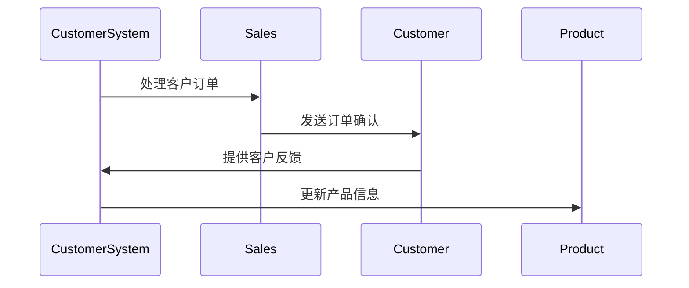
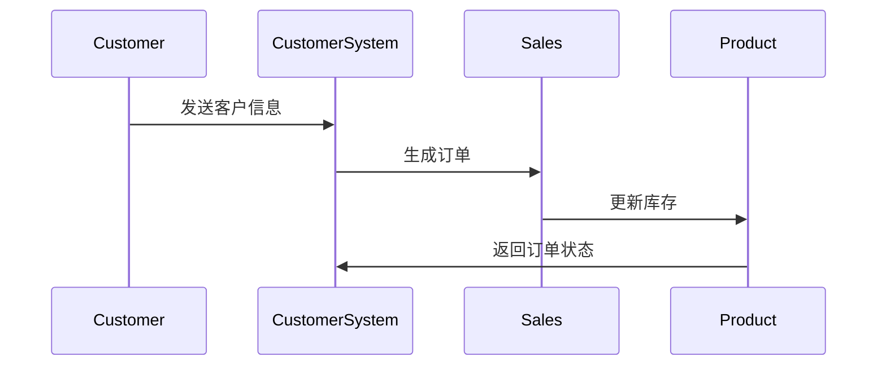

                 

# 如何进行有效的技术项目投资回报评估

关键词：投资回报评估、ROI、NPV、IRR、技术项目

摘要：本文详细探讨了技术项目投资回报评估的重要性、核心概念和原理，以及如何通过科学的方法和工具进行有效的评估。通过数学模型和实际案例的讲解，帮助读者理解投资回报评估的流程和方法，为技术项目的投资决策提供有力支持。

## 第1章 问题背景与投资回报评估的重要性

### 1.1.1 问题背景

在当今快速发展的技术领域，技术项目的投资回报评估（ROI）已经成为企业成功的关键因素。随着信息技术的不断进步，企业面临着日益激烈的竞争和快速变化的市场需求。在这种环境下，如何有效地投资于技术项目，确保资金的合理使用和项目的成功实施，成为了企业决策层必须面对的重要课题。

### 1.1.2 问题描述

技术项目投资回报评估涉及多个方面的分析和计算。首先，企业需要准确评估项目的预期收益和成本。预期收益包括项目可能带来的直接经济效益，如增加的收入、降低的成本等，以及间接效益，如提高的品牌知名度、客户满意度等。成本则包括项目的直接成本，如人力、设备、材料等，以及间接成本，如机会成本、时间成本等。

### 1.1.3 问题解决

为了解决上述问题，企业需要采用科学的方法和工具进行投资回报评估。这包括以下几个方面：

1. **明确项目目标**：首先，企业需要明确项目的目标，包括预期收益、风险和成本等。
2. **收集相关信息**：企业需要收集与项目相关的各种信息，如市场需求、竞争对手情况、技术可行性等。
3. **进行收益与成本分析**：通过对收集到的信息进行分析，确定项目的预期收益和成本。
4. **计算投资回报率**：使用特定的公式和方法，计算项目的投资回报率，评估项目的可行性。
5. **决策与实施**：根据投资回报评估的结果，企业可以做出是否投资项目的决策，并制定相应的实施计划。

### 1.1.4 边界与外延

投资回报评估不仅仅适用于单一技术项目的投资决策，还可以应用于企业的整体战略规划和投资组合管理。此外，随着大数据、人工智能等技术的发展，投资回报评估的方法和工具也在不断演进，为企业提供了更精确的决策支持。

### 1.1.5 概念结构与核心要素组成

投资回报评估的核心概念包括：

- **投资**：企业为获取未来收益而投入的资本。
- **回报**：投资所获得的收益。
- **投资回报率（ROI）**：回报与投资的比率，用于衡量投资的效率。

### 概念属性特征对比表格

| 特征 | 投资回报率（ROI） | 净现值（NPV） | 内部收益率（IRR） |
| --- | --- | --- | --- |
| 定义 | 投资的收益与成本之比 | 投资现值与投资成本之差 | 使NPV为零的折现率 |
| 目的 | 评估投资的相对效率 | 评估投资的绝对效益 | 评估投资的时间价值 |
| 应用场景 | 长期投资项目评估 | 所有类型投资项目评估 | 长期投资项目评估 |

### ER实体关系图架构

```mermaid
erDiagram
    Investment -->|1| Returns
    Investment <--|1| Costs
    Investment -->|1| ROI
    Investment -->|1| NPV
    Investment -->|1| IRR
```

## 第2章 核心概念与原理

### 2.1 投资回报评估的基本原理

投资回报评估是一种通过比较项目的预期收益和成本，评估投资可行性的方法。其核心原理包括以下几个方面：

1. **收益计算**：项目的预期收益可以通过直接和间接收益来计算。直接收益通常包括销售收入、成本节约等，而间接收益则包括品牌提升、客户满意度增加等。
2. **成本计算**：项目的成本包括直接成本和间接成本。直接成本通常指项目实施过程中的直接费用，如人力、设备、材料等，而间接成本则包括机会成本、时间成本等。
3. **比率计算**：投资回报评估常用的比率包括投资回报率（ROI）、净现值（NPV）和内部收益率（IRR）等。这些比率用于衡量投资的效率、效益和时间价值。

### 2.2 数学模型与公式

投资回报率的计算公式为：

$$
ROI = \frac{Returns - Costs}{Investment}
$$

其中，Returns表示预期收益，Costs表示总成本，Investment表示初始投资。

净现值的计算公式为：

$$
NPV = \sum_{t=1}^{n} \frac{C_t}{(1 + r)^t} - Investment
$$

其中，Ct表示第t年的现金流量，r表示折现率，n表示项目寿命周期。

内部收益率的计算公式为：

$$
IRR = \text{使得} NPV = 0 \text{的折现率}
$$

### 2.3 举例说明

假设某企业计划投资一个技术项目，项目寿命周期为5年，初始投资为100万元。预期每年收益为20万元，折现率为10%。我们可以使用以下公式计算投资回报率、净现值和内部收益率：

1. 投资回报率（ROI）：

$$
ROI = \frac{20 - (100/5)}{100} = \frac{20 - 20}{100} = 0%
$$

2. 净现值（NPV）：

$$
NPV = 20/1.1 + 20/1.1^2 + 20/1.1^3 + 20/1.1^4 + 20/1.1^5 - 100
$$

$$
NPV \approx 18.18 + 16.49 + 15.04 + 13.61 + 12.34 - 100 \approx -15.64
$$

3. 内部收益率（IRR）：

通过试错法或迭代计算，我们可以得出内部收益率约为8%。

## 第3章 系统分析与架构设计方案

### 3.1 问题场景介绍

假设一家企业计划投资一个新技术项目，旨在提高产品竞争力和市场占有率。为了确保项目的成功，企业决定采用投资回报评估方法进行决策。

### 3.2 项目介绍

项目名称：智能客户管理系统

项目目标：通过引入人工智能技术，提高客户满意度，降低客户流失率，提升销售额。

项目寿命周期：5年

### 3.3 系统功能设计（领域模型）

```mermaid
classDiagram
    Customer <<interface>>
    Product <<interface>>
    Sales <<interface>>
    CustomerSystem <-..|> Customer
    CustomerSystem <-..|> Product
    CustomerSystem <-..|> Sales
```

### 3.4 系统架构设计



### 3.5 系统接口设计和系统交互



## 第4章 项目实战

### 4.1 环境安装

1. 安装Python环境
2. 安装相关依赖库，如numpy、pandas等

### 4.2 系统核心实现

#### 4.2.1 投资回报率（ROI）计算

```python
import numpy as np

def calculate_roi(initial_investment, annual_returns, years):
    return (annual_returns - (initial_investment / years)) / initial_investment

initial_investment = 1000000
annual_returns = 200000
years = 5

roi = calculate_roi(initial_investment, annual_returns, years)
print(f"投资回报率（ROI）: {roi * 100}%")
```

#### 4.2.2 净现值（NPV）计算

```python
def calculate_npv(years, cash_flows, discount_rate):
    npv = 0
    for i, cash_flow in enumerate(cash_flows):
        npv += cash_flow / ((1 + discount_rate) ** i)
    return npv - initial_investment

years = 5
cash_flows = [200000] * years
discount_rate = 0.1

npv = calculate_npv(years, cash_flows, discount_rate)
print(f"净现值（NPV）: {npv}")
```

#### 4.2.3 内部收益率（IRR）计算

```python
def calculate_irr(years, cash_flows, initial_investment):
    for rate in np.linspace(0, 1, 100):
        npv = 0
        for i, cash_flow in enumerate(cash_flows):
            npv += cash_flow / ((1 + rate) ** i)
        if np.abs(npv - initial_investment) < 1e-6:
            return rate
    return None

irr = calculate_irr(years, cash_flows, initial_investment)
if irr is not None:
    print(f"内部收益率（IRR）: {irr * 100}%")
else:
    print("无法计算内部收益率")
```

## 第5章 项目小结

通过本文的讲解，我们了解了投资回报评估的重要性、核心概念和原理，以及如何通过数学模型和实际案例进行有效的评估。投资回报评估方法有助于企业在投资技术项目时做出明智的决策，提高投资效益。在后续的项目实施过程中，企业应持续关注项目的进展和效果，根据实际情况进行及时调整，以确保项目的成功。

## 第6章 最佳实践 Tips

1. 在进行投资回报评估时，务必充分考虑项目的各种收益和成本，避免遗漏重要信息。
2. 使用合适的折现率，确保评估结果的准确性和可靠性。
3. 结合实际情况，灵活运用各种评估方法，如ROI、NPV和IRR等。

## 第7章 小结与注意事项

1. 投资回报评估是技术项目投资决策的重要环节，企业应高度重视。
2. 评估过程中，准确的数据和科学的分析方法至关重要。
3. 在项目实施过程中，持续监控项目进展，确保投资效益的实现。

## 第8章 拓展阅读

1. 《投资学：基础与实务》
2. 《项目管理知识体系指南（PMBOK指南）》
3. 《大数据与人工智能》

作者：AI天才研究院/AI Genius Institute & 禅与计算机程序设计艺术 /Zen And The Art of Computer Programming

