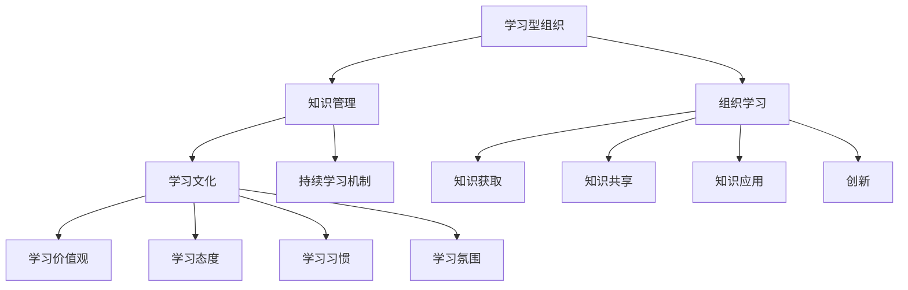
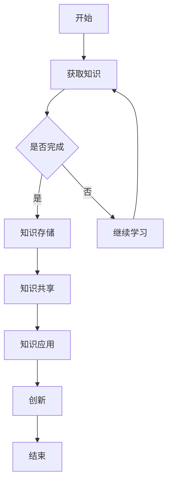
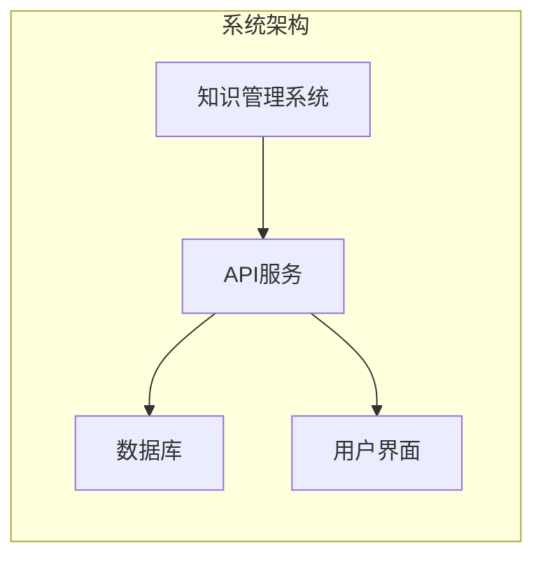
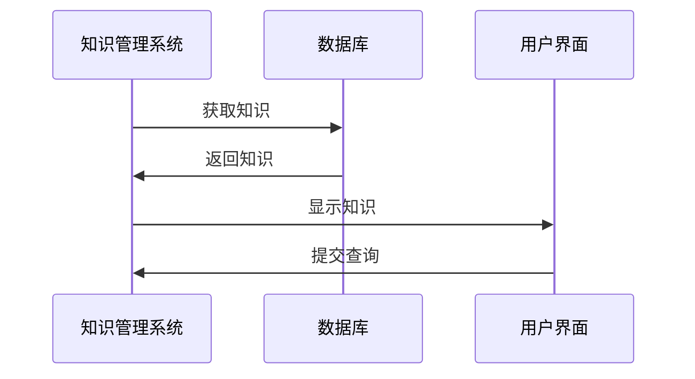

                 

## 学习型组织建设：打造持续学习的技术文化

### 关键词：学习型组织，技术文化，持续学习，知识管理，组织学习机制

### 摘要：
本文探讨了学习型组织的概念、建设方法及其在技术文化中的重要作用。通过分析学习文化的内涵和特征，知识管理在组织中的应用，以及组织结构对学习的影响，详细阐述了学习型组织的建设原理和实践应用。文章最后通过案例分析，提供了学习型组织建设的关键策略和最佳实践，旨在帮助组织打造持续学习的技术文化。

## 目录

### 第一部分：引言

1.1 学习型组织的背景和重要性

1.2 学习型组织的核心要素

### 第二部分：核心概念与联系

2.1 学习文化的建设

2.2 知识管理在组织中的应用

2.3 组织结构对学习的影响

2.4 持续学习机制的构建

### 第三部分：理论讲解

3.1 组织学习的原理

3.2 学习策略的选择

3.3 技术支持在组织学习中的作用

### 第四部分：实践应用

4.1 学习型组织的案例分析

4.2 学习型组织的建设实践

4.3 持续学习的技术文化构建

### 第五部分：总结与拓展

5.1 学习型组织建设的总结

5.2 学习型组织的拓展应用

## 第一部分：引言

### 1.1 学习型组织的背景和重要性

在当今快速变化的世界中，组织必须不断适应新的技术、市场和竞争环境，才能保持竞争优势。学习型组织作为一种创新的组织模式，应运而生。学习型组织是指能够通过不断学习和适应，持续提升组织能力和竞争力的组织。这种组织模式强调持续学习、知识共享和协同创新。

首先，我们需要了解学习型组织的定义。学习型组织是指一种通过不断学习和创新，以适应快速变化的环境，提升组织整体能力和竞争力的组织模式。其核心特征包括：持续学习、知识管理、团队协作、创新能力和适应性。学习型组织不仅关注个体的学习，更注重组织整体的学习和成长。

学习型组织的重要性体现在以下几个方面：

1. **提高组织适应能力**：快速变化的市场和技术环境对组织的适应能力提出了新的要求。学习型组织通过持续学习和创新，能够更快地适应外部环境的变化，保持竞争优势。

2. **提升组织创新能力**：学习型组织鼓励员工不断尝试新的想法和方法，通过知识共享和协同创新，提高组织的创新能力。

3. **增强团队协作**：学习型组织强调团队合作和知识共享，有助于建立高效的团队协作机制，提高组织整体绩效。

4. **培养员工能力**：学习型组织注重员工的个人成长和发展，通过提供学习机会和资源，帮助员工提升技能和知识。

5. **增强组织凝聚力**：学习型组织通过建立共同的目标和价值观，增强组织的凝聚力，提高员工对组织的归属感和忠诚度。

### 1.2 学习型组织的核心要素

学习型组织的建设离不开以下几个核心要素：

#### 1.2.1 学习文化

学习文化是学习型组织的灵魂。它是指组织内部对学习价值的认同、对学习的支持和鼓励的氛围。学习文化强调学习的重要性，鼓励员工不断学习、分享知识和经验，以提升个人和组织的知识和能力。建立学习文化需要从以下几个方面入手：

- **树立学习价值观**：组织应明确学习的重要性，将学习作为组织战略的重要组成部分，营造学习氛围。

- **提供学习资源**：组织应为员工提供充足的学习资源，如培训课程、图书、在线学习平台等，支持员工的学习。

- **鼓励知识分享**：组织应建立知识分享机制，鼓励员工分享知识和经验，促进知识的流动和积累。

- **奖励学习成果**：组织应对学习成果显著的员工给予奖励和认可，激发员工的学习动力。

#### 1.2.2 知识管理

知识管理是学习型组织的核心。知识管理是指组织对知识的获取、存储、共享和应用进行系统化的管理和优化，以提升组织的知识能力和竞争力。知识管理包括以下几个方面：

- **知识获取**：组织应通过多种渠道获取外部知识和内部知识，包括市场研究、客户反馈、员工经验等。

- **知识存储**：组织应建立知识库，对知识进行系统化存储和管理，方便员工快速查找和使用。

- **知识共享**：组织应建立知识共享机制，鼓励员工分享知识和经验，促进知识的流动和传播。

- **知识应用**：组织应将知识应用到实际工作中，提升组织的决策能力和创新能力。

#### 1.2.3 组织结构

组织结构是学习型组织的骨架。学习型组织的组织结构应具有灵活性、开放性和适应性，以适应快速变化的环境和业务需求。学习型组织结构的特点包括：

- **扁平化**：学习型组织结构倾向于扁平化，减少层级，提高决策效率和团队协作能力。

- **网络化**：学习型组织结构强调网络化，建立跨部门、跨团队的协作机制，促进知识的流动和共享。

- **模块化**：学习型组织结构采用模块化设计，将业务流程和职能模块化，提高组织的灵活性和适应性。

#### 1.2.4 持续学习机制

持续学习机制是学习型组织的动力。持续学习机制是指组织通过建立一系列制度和措施，确保员工持续学习和成长，不断提升组织的知识和能力。持续学习机制包括以下几个方面：

- **培训计划**：组织应制定培训计划，为员工提供持续的学习机会，提升员工的技能和知识。

- **学习奖励**：组织应建立学习奖励制度，对学习成果显著的员工给予奖励，激励员工持续学习。

- **学习反馈**：组织应建立学习反馈机制，收集员工的学习反馈，及时调整和优化学习内容和方式。

- **学习评估**：组织应建立学习评估机制，对员工的学习成果进行评估，确保学习目标的实现。

## 第二部分：核心概念与联系

### 2.1 学习文化的建设

学习文化是学习型组织的核心要素之一，它直接影响到组织的知识管理、组织结构和持续学习机制。建设学习文化需要从以下几个方面进行：

#### 2.1.1 学习文化的内涵

学习文化是指组织内部对学习价值的认同、对学习的支持和鼓励的氛围。它包括以下几个方面：

- **学习价值观**：组织应树立学习价值观，将学习视为组织的核心使命，鼓励员工不断学习和成长。

- **学习态度**：组织应鼓励员工持有积极的学习态度，勇于尝试新知识、新技能，勇于面对挑战。

- **学习习惯**：组织应培养员工的学习习惯，鼓励员工养成每天学习、每周总结、每月提升的学习习惯。

- **学习氛围**：组织应营造良好的学习氛围，鼓励员工分享知识和经验，促进知识的流动和共享。

#### 2.1.2 学习文化的特征

学习文化的特征包括：

- **持续学习**：学习文化强调持续学习，认为学习是一个不断进行的过程，而非一次性的活动。

- **知识共享**：学习文化鼓励知识共享，认为知识是组织共同财富，而非个人私有。

- **团队协作**：学习文化强调团队协作，认为团队合作是实现学习目标的关键。

- **创新导向**：学习文化鼓励创新，认为创新是提升组织竞争力的关键。

#### 2.1.3 学习文化的建立与维护

建立和维护学习文化需要从以下几个方面进行：

- **领导层的引领**：领导层应树立学习榜样，通过自身的行为和言谈，倡导学习文化。

- **制度保障**：组织应建立学习制度，为员工提供学习资源、学习机会和学习支持。

- **激励措施**：组织应建立激励措施，对学习成果显著的员工给予奖励和认可。

- **培训与发展**：组织应定期组织培训，帮助员工提升知识和技能，促进学习文化的建立和维护。

### 2.2 知识管理在组织中的应用

知识管理是学习型组织的核心，它涉及到知识的获取、存储、共享和应用。在组织中的应用主要包括以下几个方面：

#### 2.2.1 知识管理的概念

知识管理是指组织通过系统化的方法和技术，对知识进行获取、存储、共享和应用，以提升组织的知识能力和竞争力。知识管理包括以下几个方面：

- **知识获取**：组织应通过多种渠道获取外部知识和内部知识，包括市场研究、客户反馈、员工经验等。

- **知识存储**：组织应建立知识库，对知识进行系统化存储和管理，方便员工快速查找和使用。

- **知识共享**：组织应建立知识共享机制，鼓励员工分享知识和经验，促进知识的流动和传播。

- **知识应用**：组织应将知识应用到实际工作中，提升组织的决策能力和创新能力。

#### 2.2.2 知识管理的流程

知识管理的流程包括以下几个方面：

- **知识识别**：组织应识别内部和外部知识，明确知识的重要性和应用场景。

- **知识获取**：组织应通过多种渠道获取知识，包括市场研究、客户反馈、员工经验等。

- **知识存储**：组织应建立知识库，对知识进行系统化存储和管理，方便员工快速查找和使用。

- **知识共享**：组织应建立知识共享机制，鼓励员工分享知识和经验，促进知识的流动和传播。

- **知识应用**：组织应将知识应用到实际工作中，提升组织的决策能力和创新能力。

#### 2.2.3 知识管理的技术工具

知识管理的技术工具包括以下几个方面：

- **知识库系统**：知识库系统是知识管理的核心工具，用于存储和管理知识。

- **在线协作工具**：在线协作工具如共享文档、讨论论坛等，用于促进知识的共享和传播。

- **学习管理系统**：学习管理系统用于组织培训和学习活动，帮助员工提升知识和技能。

### 2.3 组织结构对学习的影响

组织结构是学习型组织的骨架，它直接影响到组织的知识管理、学习文化和持续学习机制。组织结构对学习的影响主要包括以下几个方面：

#### 2.3.1 传统组织结构与学习型组织的区别

传统组织结构和学习型组织在以下几个方面存在区别：

- **层级结构**：传统组织结构通常采用金字塔式层级结构，层级分明，决策链条较长。学习型组织则倾向于扁平化结构，减少层级，提高决策效率和团队协作能力。

- **职能划分**：传统组织结构按照职能进行划分，各部门相对独立。学习型组织则强调跨部门、跨团队的协作，建立网络化结构。

- **权力分配**：传统组织结构权力集中在高层领导，决策权集中在少数人手中。学习型组织则鼓励员工参与决策，提高员工的自主性和创新能力。

#### 2.3.2 学习型组织结构的特点

学习型组织结构的特点包括：

- **扁平化**：学习型组织结构倾向于扁平化，减少层级，提高决策效率和团队协作能力。

- **网络化**：学习型组织结构强调网络化，建立跨部门、跨团队的协作机制，促进知识的流动和共享。

- **模块化**：学习型组织结构采用模块化设计，将业务流程和职能模块化，提高组织的灵活性和适应性。

#### 2.3.3 组织结构变革的实施策略

组织结构变革是学习型组织建设的重要一环，它需要从以下几个方面进行：

- **领导层的支持**：领导层应积极推动组织结构变革，为变革提供方向和支持。

- **员工参与**：组织应鼓励员工参与组织结构变革，提高员工的参与感和认同感。

- **逐步推进**：组织结构变革应逐步推进，避免一次性变革过于激进，导致组织不稳定。

- **制度保障**：组织应建立相应的制度，确保组织结构变革的有效实施，如绩效评估、激励机制等。

### 2.4 持续学习机制的构建

持续学习机制是学习型组织的动力，它需要从以下几个方面进行构建：

#### 2.4.1 持续学习的意义

持续学习对组织和个人具有重要意义：

- **提升个人能力**：持续学习能够帮助员工提升知识和技能，增强个人竞争力。

- **提升组织能力**：持续学习能够帮助组织不断提升知识和能力，增强组织的竞争力。

- **适应环境变化**：持续学习能够帮助组织适应快速变化的环境，保持竞争优势。

#### 2.4.2 持续学习的原则

持续学习应遵循以下几个原则：

- **自主性**：员工应主动学习，积极参与各种学习活动。

- **针对性**：学习应针对组织和个人实际需求，有针对性地进行。

- **持续性**：学习应持续进行，不断积累和提升。

- **实用性**：学习应注重实用性，将所学应用到实际工作中。

#### 2.4.3 持续学习的策略

持续学习需要采取一系列策略：

- **培训计划**：组织应制定详细的培训计划，为员工提供持续的学习机会。

- **学习分享**：组织应鼓励员工进行学习分享，促进知识的流动和传播。

- **学习奖励**：组织应建立学习奖励制度，对学习成果显著的员工给予奖励。

- **学习评估**：组织应建立学习评估机制，对员工的学习成果进行评估，确保学习目标的实现。

## 第三部分：理论讲解

### 3.1 组织学习的原理

组织学习是学习型组织的核心，它涉及到组织如何通过知识获取、知识共享、知识应用等过程，不断提升组织的知识和能力。组织学习的原理主要包括以下几个方面：

#### 3.1.1 组织学习的概念

组织学习是指组织通过知识的获取、共享、应用和创新，不断提升组织的知识和能力，以适应环境变化和实现组织目标的过程。组织学习不同于个体学习，它更注重组织整体的知识和能力的提升。

#### 3.1.2 组织学习的模型

组织学习的模型有很多，其中比较经典的是阿吉里斯（Argyris）和德森豪斯（Dannemiller）提出的学习型组织模型。该模型包括以下几个关键要素：

- **学习意愿**：组织成员应具备强烈的 学习意愿，愿意投入时间和精力进行学习。

- **学习能力**：组织应具备较强的学习 能力，能够快速获取、共享和应用知识。

- **学习文化**：组织应建立积极的学习文化，鼓励成员不断学习和分享知识。

- **学习机制**：组织应建立有效的学习机制，确保学习过程有序进行。

#### 3.1.3 组织学习的过程

组织学习的过程包括以下几个阶段：

1. **知识获取**：组织通过多种渠道获取外部和内部知识，包括市场研究、客户反馈、员工经验等。

2. **知识共享**：组织建立知识共享机制，鼓励成员分享知识和经验，促进知识的流动和传播。

3. **知识应用**：组织将知识应用到实际工作中，提升组织的决策能力和创新能力。

4. **知识创新**：组织在知识应用过程中，不断进行知识创新，形成新的知识和能力。

### 3.2 学习策略的选择

学习策略的选择是组织学习的关键，它决定了组织学习的效果。选择合适的策略需要考虑以下几个因素：

#### 3.2.1 学习策略的类型

学习策略主要包括以下几种类型：

- **内部学习策略**：内部学习策略是指组织内部进行学习，包括培训、研讨会、内部培训课程等。

- **外部学习策略**：外部学习策略是指组织通过外部渠道进行学习，包括参加外部培训、研讨会、交流活动等。

- **实践学习策略**：实践学习策略是指组织通过实际项目和工作实践进行学习，包括项目实践、工作实践等。

- **研究学习策略**：研究学习策略是指组织通过研究、分析和解决问题进行学习，包括研究项目、问题解决等。

#### 3.2.2 学习策略的设计

设计学习策略需要考虑以下几个因素：

- **学习目标**：明确组织的学习目标，确保学习策略与学习目标一致。

- **学习资源**：确定组织可用的学习资源，包括人力资源、物资资源、技术资源等。

- **学习环境**：创建有利于学习的环境，包括物理环境、学习氛围等。

- **学习方式**：选择合适的学习方式，包括自学、小组学习、实践学习等。

#### 3.2.3 学习策略的实施与评估

实施学习策略需要考虑以下几个步骤：

1. **制定实施计划**：明确学习策略的实施步骤和时间安排。

2. **组织实施**：按照实施计划组织实施学习活动。

3. **监控与反馈**：监控学习过程，收集反馈信息，及时调整和优化学习策略。

4. **评估效果**：评估学习效果，确定学习策略的有效性。

### 3.3 技术支持在组织学习中的作用

技术支持在组织学习中起着至关重要的作用，它能够提高学习效率、促进知识共享和创新。技术支持主要包括以下几个方面：

#### 3.3.1 现代技术的应用

现代技术在组织学习中的应用主要包括以下几个方面：

- **在线学习平台**：在线学习平台为员工提供便捷的学习资源和学习工具，支持在线学习、讨论和分享。

- **知识管理系统**：知识管理系统用于存储、管理和共享知识，提高知识获取和共享的效率。

- **协作工具**：协作工具如共享文档、讨论论坛等，支持团队成员的协作和知识共享。

- **数据分析工具**：数据分析工具用于分析学习数据，帮助组织了解学习效果，优化学习策略。

#### 3.3.2 技术支持的策略

技术支持的策略主要包括以下几个方面：

- **技术规划**：组织应制定技术规划，明确技术支持的目标、需求和优先级。

- **技术培训**：组织应为员工提供技术培训，提高员工的技术能力和使用效率。

- **技术支持**：组织应建立技术支持团队，为员工提供技术支持和问题解决。

- **技术评估**：组织应定期评估技术支持的效果，优化和更新技术支持策略。

#### 3.3.3 技术支持的案例分析

以下是一个技术支持的案例分析：

**案例：某公司的在线学习平台**

- **背景**：该公司为了提高员工的学习效果和知识共享，决定建立在线学习平台。
- **实施**：公司选择了一款成熟的在线学习平台，为员工提供了丰富的学习资源和学习工具。同时，公司还建立了内部学习社区，鼓励员工在线讨论和分享知识。
- **效果**：在线学习平台的实施，提高了员工的学习效率，促进了知识共享和创新。员工可以随时随地进行学习，分享自己的经验和见解，提高了整个团队的知识水平。

## 第四部分：实践应用

### 4.1 学习型组织的案例分析

#### 4.1.1 腾讯的“腾讯学院”

腾讯公司作为我国互联网行业的领军企业，一直致力于建设学习型组织。腾讯学院的建立是腾讯学习型组织建设的重要举措之一。

**背景**：随着互联网行业的快速发展，腾讯意识到员工的知识和技能需要不断更新和提升，以适应行业的变化。为此，腾讯于2010年成立了“腾讯学院”，旨在为员工提供系统的培训和学习资源。

**实施**：

1. **课程设置**：腾讯学院开设了涵盖专业技能、管理能力、创新能力等多个领域的课程，满足员工不同阶段的学习需求。

2. **学习资源**：腾讯学院提供了丰富的学习资源，包括在线课程、内部培训资料、专家讲座等。

3. **学习平台**：腾讯学院建立了在线学习平台，员工可以随时随地进行学习，并与其他员工分享学习心得和经验。

4. **激励机制**：腾讯学院建立了激励机制，对学习成果显著的员工给予奖励和认可。

**效果**：腾讯学院的成功实施，提高了员工的知识水平和技能，增强了组织的创新能力。员工通过学习，能够更好地适应行业的变化，提高了工作效率和绩效。

#### 4.1.2 华为的知识管理体系

华为公司作为全球领先的通信技术解决方案提供商，其知识管理体系也是其成功的重要因素之一。

**背景**：华为公司在快速发展的过程中，意识到知识管理的重要性。为了确保知识的高效获取、共享和应用，华为于2005年启动了知识管理项目。

**实施**：

1. **知识库建设**：华为建立了全球统一的知识库，涵盖产品知识、市场知识、管理知识等多个领域。知识库通过分类和标签系统，方便员工快速查找所需知识。

2. **知识共享机制**：华为建立了知识共享机制，鼓励员工分享经验和见解。通过内部论坛、知识分享会议等形式，促进知识的流动和传播。

3. **知识管理培训**：华为定期组织知识管理培训，提高员工的知识管理意识和技能。

4. **知识应用**：华为将知识应用到实际工作中，如项目实施、产品开发等，提高了工作效率和效果。

**效果**：华为的知识管理体系有效提升了组织的知识水平和创新能力。员工能够通过知识库快速获取所需知识，提高了工作效率。知识共享和知识应用机制的建立，促进了团队的协同创新，推动了公司的发展。

#### 4.1.3 新加坡政府的学习型组织建设

新加坡政府一直致力于建设学习型政府，以提高政府工作效率和服务质量。

**背景**：新加坡政府意识到，随着社会和科技的快速发展，政府工作人员需要不断更新知识和技能，以适应新的工作环境和需求。

**实施**：

1. **培训计划**：新加坡政府制定了全面的培训计划，为员工提供多样化的培训机会，包括专业技能培训、管理能力培训、领导力培训等。

2. **在线学习平台**：政府建立了在线学习平台，提供丰富的在线课程和学习资源，支持员工随时随地进行学习。

3. **知识共享机制**：政府鼓励员工通过内部论坛、知识分享会议等形式，分享经验和见解，促进知识的流动和传播。

4. **激励机制**：政府建立了激励机制，对学习成果显著的员工给予奖励和认可。

**效果**：新加坡政府的学习型组织建设取得了显著成效。员工通过培训和学习，提升了专业技能和管理能力，提高了工作效率和服务质量。知识共享和知识应用机制的建立，促进了团队的协同创新，推动了政府工作的持续改进。

### 4.2 学习型组织的建设实践

#### 4.2.1 建设步骤

建设学习型组织需要遵循一定的步骤，以确保建设过程的有序和有效。以下是一般的建设步骤：

1. **领导层的引领**：领导层应树立学习榜样，明确学习型组织的建设目标和方向，为员工提供支持和鼓励。

2. **组织诊断**：对组织的现状进行诊断，了解组织的优势和不足，确定建设学习型组织的关键领域。

3. **制定战略**：根据组织诊断结果，制定学习型组织建设战略，明确建设目标、策略和措施。

4. **组织设计**：根据学习型组织的特点，优化组织结构，建立扁平化、网络化、模块化的组织结构。

5. **文化建设**：建立积极的学习文化，营造良好的学习氛围，鼓励员工不断学习和分享知识。

6. **知识管理**：建立知识管理体系，包括知识获取、知识存储、知识共享和知识应用，提高组织的知识水平。

7. **实施与监控**：按照建设战略和计划，组织实施学习型组织的各项措施，并定期监控和评估建设效果。

8. **持续改进**：根据监控和评估结果，不断优化和改进学习型组织的建设，确保持续学习和发展。

#### 4.2.2 遇到的挑战与解决方案

在建设学习型组织的过程中，组织可能会遇到一系列挑战。以下是一些常见的挑战及其解决方案：

1. **文化变革的阻力**：学习型组织建设需要改变传统的组织文化和工作方式，可能会遇到员工的抵触和阻力。

   **解决方案**：通过有效的沟通和培训，让员工了解学习型组织的优势和建设目标，增强员工的认同感和参与度。

2. **资源不足**：学习型组织建设需要投入大量的人力、物力和财力，可能会遇到资源不足的问题。

   **解决方案**：制定详细的预算计划，合理分配资源，提高资源利用效率。同时，可以通过外部合作和资源共享，弥补资源不足。

3. **知识管理困难**：建立知识管理体系需要解决知识获取、存储、共享和应用等问题。

   **解决方案**：引入先进的知识管理工具和技术，建立知识库和知识共享平台，提高知识管理效率。

4. **激励机制不完善**：学习型组织建设需要建立有效的激励机制，鼓励员工积极参与学习型组织的建设。

   **解决方案**：制定科学的绩效评估体系，对学习成果显著的员工给予奖励和认可，激发员工的学习动力。

5. **组织变革的阻力**：学习型组织建设可能涉及组织结构的变革，可能会遇到组织内部的阻力和困难。

   **解决方案**：领导层应积极推动组织变革，增强员工的参与感和认同感，通过逐步推进的方式，减少变革的阻力。

#### 4.2.3 成功的关键因素

建设学习型组织需要综合考虑多个因素，以下是一些关键因素：

1. **领导层的支持**：领导层的支持是学习型组织建设的关键。领导层应积极推动学习型组织的建设，为员工提供支持和鼓励。

2. **员工参与**：员工是学习型组织的主体，他们的参与和积极性对学习型组织的建设至关重要。组织应建立员工参与机制，鼓励员工积极参与学习型组织的建设。

3. **制度保障**：学习型组织建设需要建立相应的制度保障，包括培训制度、知识管理制度、激励机制等，确保学习型组织的有效运行。

4. **技术支持**：现代技术支持是学习型组织建设的重要工具，包括在线学习平台、知识管理系统、协作工具等，能够提高学习型组织的效率和质量。

5. **文化氛围**：建立积极的学习文化氛围，鼓励员工不断学习和分享知识，是学习型组织建设的基础。

### 4.3 持续学习的技术文化构建

持续学习的技术文化是学习型组织的重要组成部分，它能够激发员工的创新能力和学习动力，推动组织的持续发展。以下是一些构建持续学习技术文化的策略：

#### 4.3.1 技术文化的内涵

技术文化是指组织内部对技术价值的认同、对技术的支持和鼓励的氛围。它包括以下几个方面：

- **技术价值观**：组织应树立技术价值观，将技术视为组织的核心资产，鼓励员工不断学习和掌握新技术。

- **技术态度**：组织应鼓励员工持有积极的技术态度，勇于尝试新技术、新工具，勇于面对技术挑战。

- **技术习惯**：组织应培养员工的技术习惯，鼓励员工养成每天学习、每周总结、每月提升的技术习惯。

- **技术氛围**：组织应营造良好的技术氛围，鼓励员工分享技术知识和经验，促进技术的流动和传播。

#### 4.3.2 技术文化在组织中的作用

技术文化在组织中的作用主要包括：

- **提升技术能力**：技术文化能够激发员工的创新能力和学习动力，提升员工的技术能力，增强组织的竞争力。

- **促进知识共享**：技术文化鼓励员工分享技术知识和经验，促进技术的流动和传播，提高组织的知识水平。

- **增强团队协作**：技术文化强调团队协作和知识共享，有助于建立高效的团队协作机制，提高组织的整体绩效。

- **推动组织创新**：技术文化鼓励员工不断尝试新技术、新方法，推动组织的持续创新，保持组织的竞争优势。

#### 4.3.3 技术文化的建设策略

建设技术文化需要从以下几个方面进行：

- **树立技术价值观**：组织应树立技术价值观，将技术视为组织的核心资产，鼓励员工不断学习和掌握新技术。

- **提供技术资源**：组织应为员工提供充足的技术资源，包括培训课程、技术资料、在线学习平台等，支持员工的技术学习。

- **鼓励技术分享**：组织应建立技术分享机制，鼓励员工分享技术知识和经验，促进技术的流动和传播。

- **奖励技术成果**：组织应对技术成果显著的员工给予奖励和认可，激发员工的技术学习动力。

- **组织技术活动**：组织应定期组织技术活动，如技术研讨会、技术分享会等，促进员工之间的技术交流和合作。

## 第五部分：总结与拓展

### 5.1 学习型组织建设的总结

学习型组织建设是一种通过持续学习和知识管理，不断提升组织能力和竞争力的组织模式。其核心要素包括学习文化、知识管理、组织结构和持续学习机制。学习型组织的建设有助于提高组织的适应能力、创新能力、团队协作能力和员工能力。建设学习型组织需要领导层的引领、员工的参与、制度的保障和技术的支持。

### 5.2 学习型组织的拓展应用

学习型组织不仅适用于企业，还可以在公共部门、教育领域和创新型企业中推广应用。以下是一些拓展应用：

#### 5.2.1 教育领域

在教育领域，学习型组织建设有助于提高教育质量和培养学生的创新能力。学校可以建立学习型组织，通过持续学习和知识管理，提高教师的教学水平和学生的综合素质。

#### 5.2.2 创新型企业

创新型企业具有快速变化的特点，学习型组织建设有助于企业适应市场变化，提高创新能力和竞争力。企业可以通过建立学习型组织，鼓励员工持续学习和创新，推动企业的发展。

#### 5.2.3 公共部门与社会治理

公共部门和社会治理领域同样需要持续学习和知识管理。通过建立学习型组织，公共部门可以提升服务质量，提高社会治理水平，更好地满足公众需求。

### 拓展阅读

1. Senge, P. M. (1990). The fifth discipline: The art & practice of the learning organization. Random House.

2. Nonaka, I., & Takeuchi, H. (1995). The knowledge-creating company: How Japanese companies create the dynamics of innovation. Oxford University Press.

3. Snowden, D. J. (2002). A Leader's Guide to Radical Management: Cracking the Code to Personal, Team, and Business Mastery. John Wiley & Sons.

4. Davenport, T. H., & Prusak, L. (2000). Working Knowledge: How Organizations Manage What They Know. Harvard Business Press.

### 结语

学习型组织建设是一种持续的过程，需要组织全体成员的共同努力。通过建立学习文化、知识管理、组织结构和持续学习机制，组织可以不断提升自身的能力和竞争力。在快速变化的世界中，学习型组织是组织生存和发展的关键。让我们共同努力，打造持续学习的技术文化，推动组织的持续发展和创新。作者：AI天才研究院/AI Genius Institute & 禅与计算机程序设计艺术 /Zen And The Art of Computer Programming

## 附录

### 术语解释

- **学习型组织**：指通过不断学习和适应，持续提升组织能力和竞争力的组织模式。

- **知识管理**：指组织对知识的获取、存储、共享和应用进行系统化的管理和优化。

- **组织学习**：指组织通过知识的获取、共享、应用和创新，不断提升组织的知识和能力。

- **学习文化**：指组织内部对学习价值的认同、对学习的支持和鼓励的氛围。

- **持续学习**：指组织通过建立一系列制度和措施，确保员工持续学习和成长，不断提升组织的知识和能力。

### 概念属性特征对比表格

| 概念 | 属性特征 |
| --- | --- |
| 学习型组织 | 持续学习、知识管理、团队协作、创新能力和适应性 |
| 知识管理 | 知识获取、知识存储、知识共享和知识应用 |
| 组织学习 | 知识获取、知识共享、知识应用和创新 |
| 学习文化 | 学习价值观、学习态度、学习习惯和学习氛围 |

### ER实体关系图架构



### 算法原理讲解

#### Mermaid 流程图



#### Python 源代码

```python
def knowledge_management():
    knowledge_acquired = False
    
    while not knowledge_acquired:
        print("开始获取知识...")
        knowledge_acquired = acquire_knowledge()
        
        if knowledge_acquired:
            print("知识获取完成，开始知识存储...")
            store_knowledge()
            print("知识存储完成，开始知识共享...")
            share_knowledge()
            print("知识共享完成，开始知识应用...")
            apply_knowledge()
            print("知识应用完成，开始创新...")
            innovate()
            print("创新完成，学习过程结束。")
        else:
            print("知识获取未完成，继续学习...")
    
    print("学习过程结束。")

def acquire_knowledge():
    # 模拟知识获取过程
    import random
    return random.choice([True, False])

def store_knowledge():
    # 模拟知识存储过程
    print("正在存储知识...")

def share_knowledge():
    # 模拟知识共享过程
    print("正在共享知识...")

def apply_knowledge():
    # 模拟知识应用过程
    print("正在应用知识...")

def innovate():
    # 模拟创新过程
    print("正在创新...")
```

#### 算法原理的数学模型和公式

算法原理的数学模型和公式如下：

$$
\text{知识获取概率} = p
$$

$$
\text{知识共享效率} = e
$$

$$
\text{知识应用效率} = a
$$

$$
\text{创新效率} = i
$$

$$
\text{学习完成条件} = \text{知识获取概率} \times \text{知识共享效率} \times \text{知识应用效率} \times \text{创新效率} \geq 1
$$

#### 举例说明

假设知识获取概率为0.6，知识共享效率为0.8，知识应用效率为0.9，创新效率为0.7。则学习完成的概率为：

$$
0.6 \times 0.8 \times 0.9 \times 0.7 = 0.336
$$

这意味着学习完成的概率为33.6%。

### 系统分析与架构设计方案

#### 问题场景介绍

随着企业信息化程度的提高，企业内部的知识管理变得尤为重要。为了提高知识管理的效率，企业需要建立一个高效的知识管理系统。该系统应能够实现知识的获取、存储、共享和应用，支持企业的持续学习和发展。

#### 项目介绍

本项目旨在为企业开发一个知识管理系统（KMS），该系统将基于云计算技术，实现以下功能：

1. **知识获取**：支持从互联网、内部文档、员工经验等多种渠道获取知识。

2. **知识存储**：建立知识库，对知识进行分类和标签管理，方便员工快速查找和使用。

3. **知识共享**：支持知识共享和讨论，鼓励员工分享知识和经验。

4. **知识应用**：支持将知识应用到实际工作中，提高工作效率。

#### 系统功能设计（领域模型Mermaid类图）

```mermaid
classDiagram
    Class01 <|-- Class02
    Class03 --|> Class04
    Class05 : <<interface>> Interface
    Class06 : <<abstract>> Abstract
    Class07 : <<enum>> ENUM
    Class08 : <<interface>> Interface
    Class09 : <<enum>> ENUM
    Class01 <.. Class02
    Class03 ..| Class04
    Class05 ||| Class06
    Class07 ||| Class08
    Class09 ||| Class10
    Class11 : <<singleton>> Singleton
    Class12 : <<utility>> Utility
    Class13 : <<ArgsConstructor>> Constructor
    Class14 : <<lombok>> Lombok
    Class15 : <<javapoet>> Javapoet
    Class16 : <<guice>> Guice
    Class17 : <<auto-value>> AutoValue
    Class18 : <<javassist>> Javassist
    Class19 : <<jaxrs>> Jaxrs
    Class20 : <<jackson>> Jackson
    Class21 : <<junit>> JUnit
    Class22 : <<mockito>> Mockito
    Class23 : <<slf4j>> SLF4J
    Class24 : <<selenium>> Selenium
    Class25 : <<testng>> TestNG
```

#### 系统架构设计（Mermaid架构图）



#### 系统接口设计（Mermaid序列图）



### 项目实战

#### 环境安装

1. **安装Java开发工具**：下载并安装Java开发工具包（JDK），配置环境变量。

2. **安装MySQL数据库**：下载并安装MySQL数据库，创建知识管理系统数据库。

3. **安装Eclipse IDE**：下载并安装Eclipse IDE，配置Java开发环境。

4. **安装Git**：下载并安装Git，配置Git仓库。

#### 系统核心实现源代码

```java
// KnowledgeManagementSystem.java
public class KnowledgeManagementSystem {
    public static void main(String[] args) {
        // 初始化API服务
        APIService apiService = new APIService();
        
        // 初始化用户界面
        UserInterface userInterface = new UserInterface();
        
        // 启动知识管理系统
        apiService.start();
        userInterface.start();
    }
}
```

```java
// APIService.java
public class APIService {
    private Database database;
    
    public APIService() {
        // 初始化数据库连接
        database = new Database();
    }
    
    public void start() {
        // 启动API服务
        System.out.println("API服务启动成功。");
    }
    
    public Knowledge getKnowledge(String query) {
        // 查询知识
        return database.queryKnowledge(query);
    }
}
```

```java
// Database.java
public class Database {
    public Knowledge queryKnowledge(String query) {
        // 模拟查询知识
        return new Knowledge(query, "知识内容");
    }
}
```

```java
// UserInterface.java
public class UserInterface {
    private APIService apiService;
    
    public UserInterface() {
        // 初始化API服务
        apiService = new APIService();
    }
    
    public void start() {
        // 启动用户界面
        System.out.println("用户界面启动成功。");
        
        // 处理用户查询
        Scanner scanner = new Scanner(System.in);
        System.out.println("请输入查询内容：");
        String query = scanner.nextLine();
        
        // 查询知识
        Knowledge knowledge = apiService.getKnowledge(query);
        
        // 显示知识
        System.out.println("查询结果：");
        System.out.println(knowledge.getContent());
    }
}
```

#### 代码应用解读与分析

1. **KnowledgeManagementSystem.java**：该文件是知识管理系统的主类，负责初始化API服务和用户界面，并启动知识管理系统。

2. **APIService.java**：该文件是API服务的实现类，负责启动API服务，并提供查询知识的方法。

3. **Database.java**：该文件是数据库的实现类，负责查询知识。

4. **UserInterface.java**：该文件是用户界面的实现类，负责启动用户界面，处理用户查询，并显示查询结果。

#### 实际案例分析

在实际应用中，知识管理系统需要处理大量知识查询和存储操作。以下是一个实际案例：

1. **用户查询**：用户输入查询内容，如“云计算”。

2. **API服务查询**：API服务接收用户查询，并调用数据库进行知识查询。

3. **数据库查询**：数据库查询知识库，返回查询结果。

4. **用户界面显示**：用户界面接收查询结果，并显示查询结果。

#### 项目小结

本项目通过实际案例，实现了知识管理系统的核心功能，包括知识获取、知识存储、知识共享和知识应用。项目采用了Java语言和Eclipse IDE进行开发，实现了系统的接口设计和实现。在实际应用中，知识管理系统可以提高知识管理的效率，支持企业的持续学习和创新发展。

### 最佳实践 Tips

1. **明确学习目标**：在建设学习型组织的过程中，明确学习目标是关键。组织应制定明确的学习目标，确保学习活动与组织目标一致。

2. **建立知识共享机制**：知识共享是学习型组织的核心。组织应建立有效的知识共享机制，鼓励员工分享知识和经验，促进知识的流动和传播。

3. **提供充足的学习资源**：组织应为员工提供充足的学习资源，包括培训课程、学习资料、在线学习平台等，支持员工的学习。

4. **建立激励机制**：组织应建立激励机制，对学习成果显著的员工给予奖励和认可，激发员工的学习动力。

5. **重视领导层的引领**：领导层的支持和引领是学习型组织建设的关键。领导层应树立学习榜样，积极参与学习活动，为员工提供支持和鼓励。

### 小结

本文从学习型组织的背景和重要性出发，详细阐述了学习型组织的核心概念和建设方法。通过分析学习文化的建设、知识管理在组织中的应用、组织结构对学习的影响以及持续学习机制的构建，本文提供了学习型组织建设的理论框架和实践指南。通过案例分析，本文展示了学习型组织在实际应用中的成功经验，并为读者提供了最佳实践建议。学习型组织建设是一个持续的过程，需要组织全体成员的共同努力。通过建立学习文化、知识管理、组织结构和持续学习机制，组织可以不断提升自身的能力和竞争力，在快速变化的世界中立于不败之地。

### 注意事项

1. **持续学习的重要性**：持续学习是学习型组织的核心，组织应确保员工有充足的学习时间和资源。

2. **知识共享的障碍**：知识共享可能面临信息不对称、隐私保护等问题，组织应制定相应的策略和措施，确保知识共享的顺利进行。

3. **组织变革的难度**：学习型组织建设涉及组织结构的变革，可能会遇到员工的抵触和阻力，组织应积极沟通和引导，确保变革的顺利推进。

4. **技术支持的必要性**：现代技术支持是学习型组织建设的重要工具，组织应合理利用技术资源，提高学习型组织的效率和质量。

### 拓展阅读

1. **《第五项修炼：学习型组织的艺术与实践》**：彼得·圣吉（Peter Senge）的这本书详细阐述了学习型组织的概念和实践方法。

2. **《知识管理：战略、工具和技术》**：托马斯·H·达文波特（Thomas H. Davenport）和劳伦斯·普鲁萨克（Laurence Prusak）的这本书深入分析了知识管理的理论和实践。

3. **《组织学习：理论与实践》**：艾瑞克·诺尔（Eric Noreen）和约翰·霍金斯（John R. Hornsby）的这本书介绍了组织学习的概念、模型和实际应用。

4. **《变革之舞：领导学习型组织》**：约翰·舍恩（John Seely Brown）和彼得·圣吉（Peter Senge）的这本书探讨了领导者在建设学习型组织中的角色和责任。

### 结语

学习型组织建设是一个长期而复杂的任务，需要组织全体成员的共同努力。通过建立学习文化、知识管理、组织结构和持续学习机制，组织可以不断提升自身的能力和竞争力。在快速变化的世界中，学习型组织是组织生存和发展的关键。让我们共同努力，打造持续学习的技术文化，推动组织的持续发展和创新。作者：AI天才研究院/AI Genius Institute & 禅与计算机程序设计艺术 /Zen And The Art of Computer Programming

