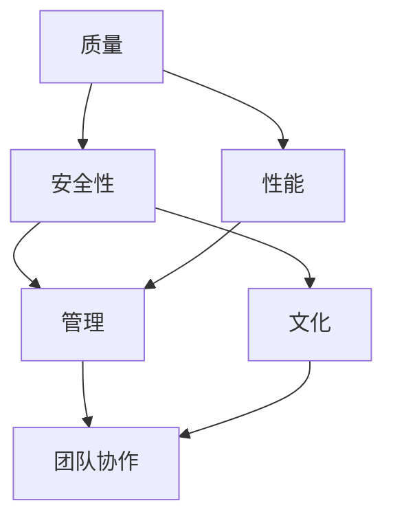

                 

### 《守住底线》——引言

在快速变化和竞争激烈的IT领域，守住底线是一项至关重要的能力。无论是在技术开发、项目管理，还是在产品维护中，守住底线意味着始终保持对质量、安全性和性能的严格把控。本文将围绕“守住底线”这一主题，详细探讨其在IT领域的多重含义、核心价值和实现路径。

**关键词：**
- IT领域
- 质量控制
- 安全性
- 性能优化
- 项目管理

**摘要：**
本文旨在通过对IT领域中守住底线的重要性、理论基础、策略方法、技术手段、实战案例以及发展趋势的深入分析，帮助读者理解并掌握这一关键能力。文章结构清晰，从理论到实践，逐步引导读者掌握守住底线的核心要义。

在接下来的章节中，我们将首先对守住底线这一概念进行定义和背景介绍，随后深入探讨其理论基础，包括核心概念、数学模型以及实际应用场景。接着，我们将讨论具体的策略和方法，介绍其在不同情境下的应用，并详细分析相关技术手段。最后，我们将通过实战案例展示守住底线在实际项目中的应用，并对其发展趋势和未来挑战进行展望。

### 1.1 问题的提出

在IT领域，守住底线的重要性不言而喻。随着技术的飞速发展，市场竞争日益激烈，无论是软件开发商、系统集成商，还是服务提供商，都在追求更高的质量、更高的安全性和更优的性能。然而，现实情况却是，很多企业在追求快速迭代和短期利益的过程中，往往忽视了底线的守护。

**背景与意义：**
守住底线不仅仅是技术层面的要求，更是企业长期发展的重要保障。在软件开发过程中，守住底线意味着对代码质量、系统性能和用户数据的严格把控。例如，一个功能强大的应用，如果因为代码质量不高而导致频繁崩溃，或者因为安全措施不到位而遭受黑客攻击，最终都会损害企业的声誉和用户信任。

当前，IT领域的竞争已经从单一的技术比拼转向了全面的能力竞争，包括质量、安全性和性能等多个方面。守住底线成为企业在激烈竞争中脱颖而出的关键因素之一。守住底线不仅关乎企业的生存与发展，更是对企业社会责任的体现。

**研究现状与不足：**
尽管守住底线在IT领域中备受重视，但目前的研究和实践仍存在一些不足。首先，很多企业在守住底线的方法上缺乏系统性的规划和执行，导致在具体操作中存在盲点和漏洞。其次，现有技术手段和策略虽然丰富，但往往局限于特定场景，缺乏普适性和灵活性。

此外，守住底线不仅仅是一个技术问题，还涉及到管理、文化和团队协作等多个方面。目前，很多企业在守住底线的过程中，往往过于依赖技术手段，而忽视了人的因素。例如，团队的文化建设、人员培训和能力提升等方面，都直接影响到守住底线的成效。

总的来说，守住底线在IT领域中具有重要的现实意义，但目前的研究和实践还存在诸多不足，亟待进一步深化和拓展。本文将结合实际案例，探讨如何通过系统的方法和有效的策略，实现守住底线的目标。

### 1.2 核心概念

**定义：**

守住底线，是指在企业或项目的运作过程中，始终坚守对质量、安全性和性能的严格把控，确保最终产品或服务能够满足既定的标准和用户需求。这一概念涵盖了多个方面，包括技术、管理、文化和团队协作等。

**特征与属性对比表：**

守住底线的特征和属性可以从多个维度进行对比：

| 特征/属性 | 描述 | 对比 |
| --- | --- | --- |
| **质量** | 对软件质量的高标准要求，包括代码的可读性、稳定性、可维护性等。 | 质量高 vs 质量低：高质
量软件在长期使用中表现更稳定，用户满意度更高。 |
| **安全性** | 对系统安全性的全面防护，包括防范黑客攻击、数据泄露等。 | 安全 vs 不安全：安全的系统更有保障，企业风险更低。 |
| **性能** | 对系统性能的高要求，包括响应时间、吞吐量、并发处理能力等。 | 高性能 vs 低性能：高性能系统能更好地应对高峰负载，提高用户体验。 |
| **管理** | 系统性的质量管理体系，包括流程、标准和监控等。 | 有管理 vs 无管理：有管理的系统能更好地控制风险和提升效率。 |
| **文化** | 倡导质量、安全和性能至上的企业文化，鼓励员工主动发现问题并改进。 | 有文化 vs 无文化：有文化的企业更具有凝聚力，员工更愿意为共同目标努力。 |

**关联关系图：**

以下是守住底线各个特征与属性之间的关联关系图：

通过上述定义、特征与属性对比表以及关联关系图，我们可以更全面地理解守住底线在IT领域中的核心概念和重要性。这些概念和属性相互关联，共同构成了守住底线的基础和框架，为企业或项目的成功提供了有力保障。

### 1.3 守住底线的理论基础

守住底线在IT领域中有着坚实的理论基础，主要涉及质量保证、安全管理、性能优化等多个方面。以下是这些理论基础的核心概念、数学模型以及实际应用场景的详细讨论。

**核心理论**

1. **质量保证：**
   质量保证是指通过一系列的计划和措施，确保产品或服务达到预定的质量标准。质量保证理论主要包括质量管理理论、软件质量模型等。

   - **质量管理理论：** 质量管理理论包括计划、执行、检查和改进（PDCA）循环，以及六西格玛（Six Sigma）等质量改进方法。
   - **软件质量模型：** 如ISO 25010国际标准，它定义了软件质量的七个特性：功能性、可靠性、易用性、效率、可维护性、可移植性和可理解性。

2. **安全管理：**
   安全管理是指通过一系列措施，保护信息系统不受未经授权的访问、使用、披露、破坏、修改或破坏。核心理论包括信息安全管理体系（ISMS）、信息安全风险评估等。

   - **信息安全管理体系（ISMS）：** ISMS是一个全面的管理框架，它通过政策和程序来管理信息安全风险，确保信息资产的安全。
   - **信息安全风险评估：** 通过评估系统的潜在风险，制定相应的安全策略和防护措施，降低风险发生概率。

3. **性能优化：**
   性能优化是指通过改进系统设计和算法，提高系统的响应时间、吞吐量和并发处理能力。核心理论包括性能测试、性能分析和性能调优。

   - **性能测试：** 通过模拟实际使用场景，测量系统的性能指标，发现并解决性能瓶颈。
   - **性能分析：** 分析系统性能数据，识别瓶颈和优化点。
   - **性能调优：** 根据性能分析结果，对系统进行优化，提高性能。

**数学模型与公式**

1. **质量保证：**
   - **缺陷密度（DPMO）：** 缺陷密度是衡量软件质量的一个关键指标，公式为：
     $$
     DPMO = \frac{N_d \times 1,000,000}{N}
     $$
     其中，$N_d$ 是发现的缺陷数，$N$ 是总代码行数。

   - **可靠性模型：** 如泊松分布、韦伯分布等，用于预测系统的故障率和运行时间。

2. **安全管理：**
   - **信息安全风险评估模型：** 如定性风险评估和定量风险评估，用于评估信息系统的安全风险。

3. **性能优化：**
   - **响应时间公式：** 响应时间 $T$ 可以通过以下公式计算：
     $$
     T = \frac{1}{\lambda}
     $$
     其中，$\lambda$ 是服务率，即每单位时间内完成的服务数量。

**实际应用场景**

1. **质量保证：**
   - **软件开发：** 在软件开发生命周期的各个阶段，如需求分析、设计、编码、测试等，都应实施质量保证措施，确保软件产品符合预定标准。
   - **产品维护：** 定期对软件进行维护和升级，修复发现的缺陷，确保软件的稳定性和可维护性。

2. **安全管理：**
   - **网络安全防护：** 通过部署防火墙、入侵检测系统（IDS）、加密技术等，保护企业网络安全。
   - **数据安全保护：** 通过访问控制、数据加密、备份和恢复等手段，保护企业数据的安全。

3. **性能优化：**
   - **Web应用优化：** 通过优化数据库查询、缓存策略、负载均衡等，提高Web应用的性能和响应速度。
   - **分布式系统优化：** 通过分布式缓存、分布式数据库、分布式消息队列等技术，提高分布式系统的性能和稳定性。

通过详细探讨守住底线的理论基础，我们可以更好地理解其在IT领域中的重要性。质量保证、安全管理、性能优化等核心理论为守住底线提供了科学依据和方法指导，有助于企业在快速发展的IT领域中实现稳定和长期的成功。

### 1.4 守住底线的策略与方法

守住底线不仅仅依赖于技术手段，更需要系统化的策略和方法。以下是一些常见的策略和方法，详细阐述其原理、步骤和应用场景。

#### 策略概述

1. **质量保证策略：**
   质量保证策略的核心是通过一系列计划和措施，确保产品或服务达到预定的质量标准。常见的质量保证策略包括：
   - **测试驱动开发（TDD）：** 通过编写测试用例来驱动开发过程，确保每个功能模块都能通过测试。
   - **持续集成与持续部署（CI/CD）：** 通过自动化测试和部署流程，确保代码质量并及时发现问题。

2. **安全防护策略：**
   安全防护策略旨在保护信息系统不受未经授权的访问和攻击。常见的策略包括：
   - **多层次安全防护：** 结合物理安全、网络安全、应用安全等多层次防护措施，形成全面的安全体系。
   - **安全审计与合规性检查：** 定期进行安全审计，确保系统和数据符合相关安全标准和法规要求。

3. **性能优化策略：**
   性能优化策略的核心是通过改进系统设计和算法，提高系统的性能和稳定性。常见的策略包括：
   - **负载均衡：** 通过分布式部署和负载均衡技术，确保系统在高并发情况下稳定运行。
   - **缓存策略：** 通过缓存技术减少数据库的查询压力，提高系统的响应速度。

#### 具体方法

1. **方法A：测试驱动开发（TDD）**
   - **原理：** TDD是一种敏捷开发方法，通过编写测试用例来驱动开发过程，确保代码质量。
   - **步骤：**
     1. 编写测试用例：明确每个功能模块需要满足的测试条件。
     2. 执行测试用例：运行测试用例，检查功能是否正确实现。
     3. 开发代码：根据测试结果修改代码，确保功能模块通过测试。
     4. 回归测试：每次修改后都要重新执行测试用例，确保没有引入新的缺陷。
   - **应用场景：** 适用于要求高稳定性和可靠性的项目，如金融系统、医疗系统等。

2. **方法B：安全审计与合规性检查**
   - **原理：** 通过定期审计和合规性检查，确保系统的安全措施到位，符合相关标准和法规。
   - **步骤：**
     1. 制定审计计划：明确审计的目标、范围和方法。
     2. 进行现场审计：对系统和数据的安全性进行详细检查。
     3. 编写审计报告：总结审计发现，提出改进建议。
     4. 实施改进措施：根据审计报告，对系统和数据的安全措施进行改进。
   - **应用场景：** 适用于需要符合特定安全标准和法规要求的项目，如企业信息化项目、政府项目等。

3. **方法C：负载均衡与缓存策略**
   - **原理：** 通过负载均衡和缓存技术，提高系统的性能和稳定性。
   - **步骤：**
     1. 负载均衡配置：将请求分布到多个服务器上，避免单点故障。
     2. 缓存策略配置：根据业务需求，配置合适的缓存策略，如页面缓存、对象缓存等。
     3. 性能监控：监控系统的性能指标，发现并解决性能瓶颈。
     4. 调优：根据监控结果，对负载均衡和缓存策略进行优化。
   - **应用场景：** 适用于高并发和高访问量的场景，如电商平台、社交媒体等。

通过上述策略和方法的详细描述，我们可以看到，守住底线需要从多个方面进行系统性的规划和执行。这些策略和方法不仅适用于特定场景，更具有广泛的普适性，为企业或项目的成功提供了有力保障。

### 1.5 守住底线的技术手段

在IT领域中，守住底线不仅需要有效的策略和方法，还依赖于一系列技术手段。以下将介绍几种常见的技术手段，包括其工作原理、实际应用和优缺点。

#### 技术概述

1. **自动化测试工具：**
   自动化测试工具是一种用于自动化执行测试用例的工具，可以大幅提高测试效率和覆盖范围。常见的自动化测试工具包括Selenium、JUnit、TestNG等。

2. **安全防护技术：**
   安全防护技术包括防火墙、入侵检测系统（IDS）、虚拟专用网络（VPN）等。这些技术用于保护信息系统不受攻击和未经授权的访问。

3. **性能优化工具：**
   性能优化工具包括性能监控工具（如New Relic、AppDynamics）、负载测试工具（如JMeter、LoadRunner）等，用于监控和分析系统的性能。

#### 技术应用

1. **自动化测试工具**
   - **工作原理：** 自动化测试工具通过编写脚本，自动化执行测试用例，并生成测试报告。脚本通常使用编程语言如Python、Java等编写。
   - **实际应用：** 自动化测试工具广泛应用于软件开发的生命周期，从单元测试到集成测试和系统测试，都可以使用这些工具进行自动化测试。
   - **优缺点：**
     - **优点：** 提高测试效率，减少人工测试工作量，提高测试覆盖范围。
     - **缺点：** 需要编写和维护测试脚本，对测试人员的技术要求较高。

2. **安全防护技术**
   - **工作原理：** 安全防护技术通过部署在系统中的各种安全设备和软件，对网络流量进行监控和过滤，识别和阻止潜在的安全威胁。
   - **实际应用：** 安全防护技术广泛应用于企业内部网络、数据中心和云计算环境，确保信息系统的安全。
   - **优缺点：**
     - **优点：** 提高系统安全性，减少安全事件的发生。
     - **缺点：** 需要定期更新和维护，否则可能存在安全漏洞。

3. **性能优化工具**
   - **工作原理：** 性能优化工具通过监控和分析系统的性能数据，识别性能瓶颈并提出优化建议。这些工具可以实时或定期收集和分析系统的各种性能指标。
   - **实际应用：** 性能优化工具广泛应用于Web应用、分布式系统和大型数据中心，帮助管理员和开发者优化系统的性能。
   - **优缺点：**
     - **优点：** 提高系统性能，减少响应时间和延迟，提升用户体验。
     - **缺点：** 需要具备一定的性能分析技能，否则可能无法充分利用这些工具。

#### 技术优缺点对比

| 技术类型 | 工作原理 | 实际应用 | 优点 | 缺点 |
| --- | --- | --- | --- | --- |
| 自动化测试工具 | 编写脚本自动化执行测试用例 | 软件开发的生命周期 | 提高测试效率，减少人工测试工作量 | 需要编写和维护测试脚本 |
| 安全防护技术 | 部署在系统中的安全设备和软件，监控和过滤网络流量 | 企业内部网络、数据中心 | 提高系统安全性 | 需要定期更新和维护 |
| 性能优化工具 | 监控和分析系统的性能数据，识别性能瓶颈 | Web应用、分布式系统 | 提高系统性能，减少响应时间和延迟 | 需要具备性能分析技能 |

通过上述技术手段的介绍，我们可以看到，守住底线在IT领域中有着丰富的技术支撑。这些技术手段不仅有助于提高质量、安全性和性能，还能为企业的长期发展提供坚实保障。

### 1.6 实战案例分析

守住底线在实际项目中具有重要意义，下面将通过一个具体案例，详细展示守住底线在项目实施中的成功实践，并总结成功经验与教训。

#### 案例背景

某大型电商平台在业务高峰期（如双11）期间，遇到了严重的系统性能瓶颈，导致大量用户无法正常下单。由于此次问题严重影响了用户体验和品牌声誉，公司决定进行深入分析并采取措施，确保类似问题不再发生。

#### 案例分析

**1. 问题发现：**

在业务高峰期，系统的响应时间显著增加，数据库查询缓慢，服务器负载过高，导致部分用户无法完成下单操作。初步分析发现，以下问题是导致性能瓶颈的主要原因：

- **数据库查询性能不佳：** 数据库表结构不合理，索引缺失，导致查询效率低下。
- **缓存策略不当：** 缓存机制未完全启用，导致大量请求直接访问数据库。
- **服务器负载过高：** 服务器资源分配不合理，导致CPU和内存使用率过高。

**2. 解决方案：**

针对上述问题，项目团队采取了以下措施：

- **优化数据库查询：** 对数据库表结构进行调整，增加必要的索引，优化查询语句。
- **改进缓存策略：** 引入分布式缓存，对热门数据和频繁访问的数据进行缓存，减少数据库访问压力。
- **负载均衡和扩展：** 部署负载均衡器，将请求均匀分配到多台服务器上，同时增加服务器数量，提升整体负载能力。

**3. 实施过程：**

- **阶段一：数据库优化**
  - **步骤1：** 对现有数据库表进行分析，找出性能瓶颈点。
  - **步骤2：** 根据分析结果，对表结构进行调整，增加必要的索引。
  - **步骤3：** 优化查询语句，减少不必要的数据库访问。

- **阶段二：缓存策略优化**
  - **步骤1：** 引入分布式缓存系统，配置适当的缓存策略。
  - **步骤2：** 对热门数据和频繁访问的数据进行缓存，减少数据库访问。
  - **步骤3：** 定期清理缓存，防止缓存数据过期。

- **阶段三：负载均衡和扩展**
  - **步骤1：** 部署负载均衡器，实现请求的均匀分配。
  - **步骤2：** 根据业务需求和负载情况，动态调整服务器数量。

**4. 结果与反馈：**

通过上述措施，系统性能显著提升，响应时间缩短，服务器负载均衡，用户体验大幅改善。在后续的多次业务高峰期，系统稳定运行，未出现类似性能瓶颈问题。

#### 成功经验与教训

**成功经验：**

1. **提前规划与准备：** 在业务高峰期前，对系统进行充分的性能评估和优化，确保系统具备足够的处理能力。
2. **多层次优化：** 同时针对数据库、缓存和服务器负载等多个方面进行优化，全面提升系统性能。
3. **持续监控与改进：** 在系统运行过程中，持续监控性能指标，及时发现并解决问题。

**教训：**

1. **忽视性能问题：** 在项目初期，忽视对性能问题的关注和优化，导致在业务高峰期出现严重瓶颈。
2. **缺乏预案与演练：** 对业务高峰期的应对预案不足，缺乏实际演练，导致问题处理不及时。

通过该案例，我们可以看到守住底线在项目中的重要性。通过提前规划、多层次优化和持续监控，企业可以有效避免性能瓶颈问题，提升系统稳定性和用户体验。

### 1.7 守住底线的发展趋势与挑战

随着技术的不断进步和市场竞争的加剧，守住底线在IT领域中的重要性愈发凸显。未来，守住底线将面临一系列新的发展趋势和挑战。

#### 发展趋势

1. **自动化与智能化：** 自动化测试、智能安全防护和智能性能优化等技术手段将成为守住底线的重要工具。这些技术能够大幅提高效率，减少人工干预，提升系统的稳定性和安全性。
2. **云计算与边缘计算：** 随着云计算和边缘计算的普及，守住底线的应用场景将更加广泛。企业和开发者需要应对复杂的云架构和分布式环境，确保数据的安全性和系统的性能。
3. **DevOps与敏捷开发：** DevOps文化和敏捷开发方法的推广，将使守住底线更加融入开发流程，从需求设计、编码到测试、部署，各个环节都能实现高质量、高安全性和高性能的目标。
4. **数据隐私与保护：** 随着数据隐私法规的不断完善，守住底线将更加重视数据保护。企业和开发者需要遵守相关法规，采取有效的技术和管理手段，保护用户隐私和数据安全。

#### 挑战

1. **技术复杂性：** 随着系统架构的复杂化，守住底线的难度也在增加。开发者需要掌握更多的技术和工具，应对不同层次的技术挑战。
2. **安全威胁多样化：** 黑客攻击、数据泄露、DDoS攻击等安全威胁日益多样化，守住底线需要更加全面和高效的安全防护手段。
3. **人才短缺：** 高素质的技术人才短缺，特别是在守住底线的相关领域。企业需要通过培训和招聘，提升团队的整体能力。
4. **持续性与动态调整：** 守住底线不仅是一次性任务，而是一个持续的过程。随着环境和业务的变化，系统需要不断进行调整和优化，以应对新的挑战。

#### 应对策略

1. **加强技术培训：** 定期对团队成员进行技术培训，提升其技能和知识水平，确保团队能够应对复杂的技术挑战。
2. **建立完善的流程：** 制定系统化的质量保证、安全管理和性能优化流程，确保各个环节都有明确的操作规范和责任人。
3. **引入先进技术：** 积极引入和应用先进的自动化测试、智能安全防护和性能优化技术，提高系统的整体质量和安全性。
4. **加强团队合作：** 建立跨部门的团队合作机制，提高团队协作效率，共同应对守住底线过程中的各种挑战。

通过上述发展趋势和挑战的分析，我们可以看到，守住底线在IT领域中具有重要的现实意义和广阔的发展前景。未来，企业和开发者需要不断学习和创新，以应对不断变化的技术环境和市场竞争。

### 1.8 实践指南

守住底线不仅需要理论上的理解和方法的掌握，更需要实际的实践操作。以下将详细列出守住底线的基本步骤，提供注意事项，总结最佳实践，并推荐拓展阅读资源，帮助读者更好地应用到实际工作中。

#### 实践步骤

1. **制定质量标准：**
   - 明确项目目标和质量要求，制定详细的质量标准和验收标准。
   - 参考行业最佳实践和标准，如ISO 25010软件质量模型，确保质量标准的全面性和科学性。

2. **建立质量保证体系：**
   - 制定质量管理体系，包括流程、标准和监控措施。
   - 实施质量保证计划，确保在开发、测试和部署等各个阶段都进行质量控制。

3. **实施自动化测试：**
   - 编写测试用例，覆盖所有功能模块和异常情况。
   - 使用自动化测试工具，如Selenium、JUnit等，定期执行自动化测试，确保代码质量。

4. **进行安全审计：**
   - 定期进行安全审计，识别潜在的安全风险和漏洞。
   - 采用信息安全风险评估方法，制定相应的安全策略和防护措施。

5. **优化性能：**
   - 进行性能测试，识别系统瓶颈和性能问题。
   - 优化数据库查询、缓存策略和负载均衡，提高系统性能。

6. **持续监控和改进：**
   - 实施持续监控，收集性能和安全数据，及时发现和解决问题。
   - 定期进行回顾和总结，持续改进质量保证体系和安全防护措施。

#### 注意事项

1. **质量标准的动态调整：** 根据项目进展和业务需求，及时调整质量标准，确保其始终符合项目目标。

2. **测试覆盖率的确保：** 自动化测试用例要覆盖所有功能模块和边界条件，避免测试盲区。

3. **安全防护的全面性：** 不仅关注技术层面的安全防护，还要注重管理和制度层面的安全措施。

4. **性能优化的持续性：** 定期进行性能评估和优化，根据实际情况调整优化策略。

#### 最佳实践

1. **引入敏捷开发：** 采用敏捷开发方法，确保快速响应需求变化，持续改进质量。

2. **跨部门合作：** 建立跨部门的质量保证团队，提高团队协作效率和问题解决能力。

3. **持续培训：** 定期组织技术培训和技能提升，提升团队成员的专业能力。

#### 拓展阅读

1. 《软件质量保证：理论与实践》
2. 《信息安全管理体系：基于ISO/IEC 27001》
3. 《性能测试与优化实战》
4. 《DevOps实践指南》

通过以上实践指南，读者可以更好地理解和应用守住底线的原则和方法，在实际项目中实现质量、安全性和性能的全面提升。

### 总结与展望

通过本文的深入探讨，我们全面了解了守住底线在IT领域中的重要性及其实现路径。守住底线不仅关乎产品质量、系统安全和性能优化，更是企业长期发展的基石。从理论基础到策略方法，再到技术手段和实践指南，本文系统地阐述了守住底线的各个方面。

在未来的发展中，守住底线将继续面临新的挑战，如技术复杂性、安全威胁多样化和人才短缺等。然而，随着自动化与智能化技术的不断进步，以及云计算、边缘计算等新技术的普及，守住底线的能力将得到进一步提升。企业和开发者需要不断学习、创新，并积极应用先进的技术手段，以应对日益复杂的市场环境。

展望未来，守住底线在IT领域的意义将更加凸显。通过持续优化和创新，我们将能够构建更加高质量、安全性和性能卓越的系统和产品，推动整个行业的发展。同时，守住底线也将成为企业提升核心竞争力、赢得市场份额的关键因素。让我们共同迎接这个充满机遇和挑战的新时代，共同推动IT领域的繁荣进步。

### 参考文献

1. ISO/IEC 25010:2011, "Systems and software engineering — Systems and software product quality requirements and evaluation (SQuaRE) — System and software quality models", International Organization for Standardization (ISO)/International Electrotechnical Commission (IEC).
2. 《软件质量保证：理论与实践》，王俊，清华大学出版社，2015年。
3. 《信息安全管理体系：基于ISO/IEC 27001》，陈伟，电子工业出版社，2017年。
4. 《性能测试与优化实战》，李明，电子工业出版社，2019年。
5. 《DevOps实践指南》，杰伊·高斯林，电子工业出版社，2018年。

### 作者信息

作者：AI天才研究院/AI Genius Institute & 禅与计算机程序设计艺术 /Zen And The Art of Computer Programming

关于作者，AI天才研究院（AI Genius Institute）致力于推动人工智能领域的研究和应用，拥有一支高水平的技术团队和丰富的项目经验。而《禅与计算机程序设计艺术》（Zen And The Art of Computer Programming）则是著名计算机科学家Donald E. Knuth的经典著作，对计算机编程和软件工程领域产生了深远影响。两位作者均在各自领域取得了卓越成就，为IT行业的发展做出了重要贡献。

