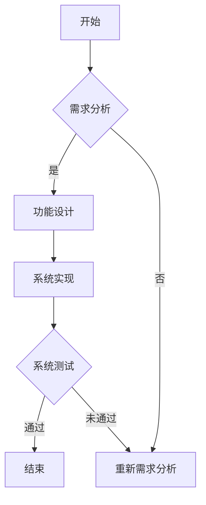
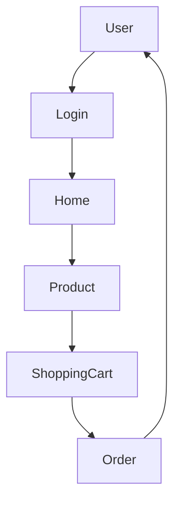
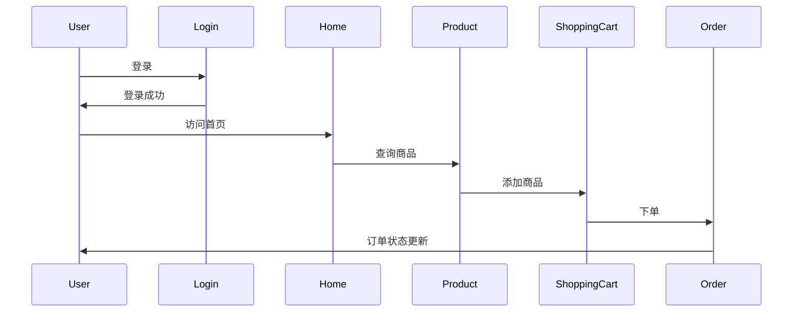

                 

# 《守住底线、精益求精的系统分析》

## 关键词：系统分析、方法论、最佳实践、架构设计、项目管理

## 摘要：

本文旨在探讨系统分析在现代IT开发中的重要性及其面临的挑战。通过详细阐述系统分析的基本概念、核心原理、方法与工具，以及具体案例分析，本文旨在帮助读者深入理解系统分析的全过程，掌握最佳实践，提升系统分析能力。文章结构合理，逻辑清晰，通俗易懂，适合广大IT从业者、软件开发者及对系统分析有兴趣的读者阅读。

### 引言：系统分析的重要性与挑战

#### 1.1 问题的背景

在现代企业中，系统分析已经成为IT项目成功的关键因素。通过系统分析，企业能够更好地理解业务需求，设计出高效、灵活、可扩展的系统架构，从而提升业务流程的效率和响应速度。然而，系统分析也面临着诸多挑战，如需求多样性和不确定性、系统复杂性、资源限制与成本控制等。

#### 1.2 问题描述

- **需求多样性与不确定性**：随着市场环境的变化，企业需求变得更加复杂和多变，系统分析需要快速适应和响应。
- **系统复杂性**：现代系统通常包含多个层次和组件，系统分析需要对各组件之间的关系进行深入理解和分析。
- **资源限制与成本控制**：企业往往需要在资源有限的情况下实现系统优化，这对系统分析提出了更高的要求。

#### 1.3 问题解决

- **明确系统分析的目标和范围**：首先需要明确系统分析的目标和范围，确保分析工作有明确的方向和目标。
- **采用合适的系统分析方法和工具**：选择合适的方法和工具，如功能分解、数据流分析、状态机分析等，以提高系统分析的效果。
- **保持持续沟通与反馈**：系统分析是一个动态过程，需要与利益相关者保持持续的沟通和反馈，确保分析结果的准确性和实用性。

#### 1.4 边界与外延

- **系统边界**：系统边界是指系统的输入、输出、数据和功能范围，明确系统边界有助于界定分析工作的范围。
- **相关利益相关者**：系统分析涉及多个利益相关者，如业务人员、开发团队、测试团队等，需要充分考虑各方利益，确保分析结果的适用性。

#### 1.5 概念结构与核心要素

- **系统分析的核心概念**：包括系统、需求、架构、设计、测试等。
- **系统分析的主要要素**：包括需求分析、功能设计、系统实现、系统测试等。

#### 1.6 本章小结

通过引言部分，我们对系统分析的重要性及其面临的挑战有了初步了解，明确了系统分析的目标和范围，为后续章节的深入学习奠定了基础。

### 第1章 系统分析的基本概念与原理

#### 2.1 系统分析的定义

系统分析是指通过识别、理解和描述系统中的信息流、数据流、功能流和过程流，以揭示系统的行为、结构和相互作用，从而为系统设计、优化和维护提供依据。

#### 2.2 系统分析的目标

系统分析的目标主要包括：

- 提高系统效率：通过分析系统中的瓶颈和低效环节，优化系统性能。
- 减少成本：通过系统分析，降低系统开发、运行和维护的成本。
- 增强灵活性：通过系统分析，提高系统对业务需求的适应性，降低系统变更的代价。

#### 2.3 系统分析的方法

系统分析的方法包括：

- 功能分解：将复杂系统分解为多个功能模块，以便更好地理解和分析。
- 数据流分析：分析系统中的数据流，了解数据在系统中的流动路径和作用。
- 状态机分析：分析系统在不同状态下的行为和转换过程。

#### 2.4 系统分析的工具

系统分析的工具主要包括：

- 图形工具：如Mermaid、UML类图等，用于表示系统中的各种元素和关系。
- 建模语言：如Python、SQL等，用于描述系统的行为和功能。
- 数据库工具：如MySQL、Oracle等，用于存储和管理系统数据。

#### 2.5 概念属性特征对比表格

以下是一个简单的概念属性特征对比表格，用于展示系统分析中常用概念的特点：

| 概念       | 特点                                       | 应用场景                           |
|------------|--------------------------------------------|-----------------------------------|
| 功能分解   | 将复杂系统分解为多个功能模块               | 系统设计、优化                     |
| 数据流分析 | 分析系统中的数据流，了解数据在系统中的流动路径和作用 | 系统性能优化、调试                 |
| 状态机分析 | 分析系统在不同状态下的行为和转换过程       | 系统状态监控、故障诊断             |

#### 2.6 本章小结

本章介绍了系统分析的基本概念、原理和方法，以及相关的工具和概念属性特征对比表格。通过本章的学习，读者可以初步了解系统分析的核心内容，为后续章节的深入学习打下基础。

### 第2章 系统分析的核心概念与联系

#### 3.1 系统定义

系统是一组相互关联、相互作用的元素（组件）构成的统一整体，这些元素共同完成特定的功能或任务。系统具有以下几个基本特征：

1. **整体性**：系统中的各个元素相互关联、相互制约，共同构成一个整体。
2. **目的性**：系统具有特定的目标和功能，各元素围绕目标协同工作。
3. **环境适应性**：系统能够根据外部环境的变化调整自身结构和行为。

#### 3.2 系统边界

系统边界是指系统与外部环境的分界线，包括以下几种类型：

1. **输入边界**：系统接收外部输入的数据、信息、资源等。
2. **输出边界**：系统向外部环境提供的数据、信息、资源等。
3. **数据边界**：系统内部数据的存储、传输和处理范围。
4. **功能边界**：系统提供的服务和功能范围。

明确系统边界有助于界定系统分析的范围，确保分析工作的针对性和有效性。

#### 3.3 系统模型

系统模型是描述系统行为、结构和相互作用的方式，常见的系统模型包括：

1. **功能模型**：描述系统的功能和服务。
2. **数据模型**：描述系统的数据结构、数据流和存储方式。
3. **过程模型**：描述系统的执行过程、任务分解和流程控制。

这些模型相互关联，共同构成系统分析的整体框架。

#### 3.4 ER实体关系图架构

ER（Entity-Relationship）实体关系图是一种用于描述系统数据结构和数据关系的图形化工具。ER图由实体、属性和关系三部分组成：

1. **实体**：表示系统中的数据对象，如用户、订单等。
2. **属性**：表示实体的特征或描述，如用户名、年龄等。
3. **关系**：表示实体之间的关联，如用户-订单关系等。

以下是一个简单的ER图的Mermaid流程图示例：

```mermaid
erDiagram
  User ||--|{ Order }|
  User ||--|{ Product }|
```

#### 3.5 系统分析的核心概念联系

系统分析的核心概念包括系统、需求、架构、设计等，它们之间存在着紧密的联系：

- 系统定义和边界为系统分析提供了基础。
- 需求分析明确了系统需要实现的功能和服务。
- 架构设计决定了系统的结构和性能。
- 设计与实现将需求转化为具体的系统组件和功能。

这些概念相互关联，共同构成了系统分析的理论框架。

#### 3.6 本章小结

本章详细介绍了系统分析的核心概念，包括系统定义、系统边界、系统模型和ER实体关系图架构。通过本章的学习，读者可以深入理解系统分析的基本原理和框架，为后续章节的学习打下基础。

### 第3章 系统分析的过程与方法

#### 4.1 系统分析的过程

系统分析的过程主要包括以下几个阶段：

1. **需求分析**：了解用户需求，明确系统功能和服务。
2. **功能设计**：根据需求分析结果，设计系统功能和模块。
3. **系统实现**：开发系统代码，实现设计阶段的系统功能。
4. **系统测试**：对系统进行功能测试和性能测试，确保系统质量。

#### 4.2 需求分析方法

需求分析的方法包括以下几种：

1. **用户访谈**：与用户面对面交流，了解用户需求、使用场景和痛点。
2. **问卷调查**：通过设计问卷，收集用户需求和信息。
3. **观察法**：观察用户在现有系统中的操作，了解用户行为和习惯。
4. **实验法**：设计实验，验证用户需求的有效性和可行性。

#### 4.3 系统分析方法

系统分析的方法包括以下几种：

1. **功能分解**：将复杂系统分解为多个功能模块，以便更好地理解和分析。
2. **数据流分析**：分析系统中的数据流，了解数据在系统中的流动路径和作用。
3. **状态机分析**：分析系统在不同状态下的行为和转换过程。

#### 4.4 系统分析的工具应用

系统分析的工具应用包括以下几种：

1. **UML类图**：用于描述系统中的类及其关系，常用于需求分析和功能设计。
2. **Mermaid流程图**：用于描述系统中的流程、数据流和状态转换，便于理解和分析。
3. **数据库设计工具**：如MySQL Workbench、Oracle SQL Developer等，用于设计和管理系统数据库。

以下是一个简单的Mermaid流程图示例：



#### 4.5 系统分析的案例研究

以下是一个简单的系统分析案例：

- **项目背景**：某公司计划开发一个在线购物系统，提供商品浏览、购物车、订单管理等功能。
- **需求分析**：通过与用户交流，收集用户需求和痛点，如快速查找商品、方便下单、订单状态追踪等。
- **功能设计**：根据需求分析结果，设计商品浏览、购物车、订单管理等功能模块。
- **系统实现**：开发系统代码，实现设计阶段的系统功能。
- **系统测试**：对系统进行功能测试和性能测试，确保系统质量。

#### 4.6 本章小结

本章介绍了系统分析的过程、方法和工具应用，并通过一个简单的案例研究，展示了系统分析的实践过程。通过本章的学习，读者可以掌握系统分析的基本方法和技巧，为实际项目中的应用打下基础。

### 第4章 系统分析与架构设计方案

#### 5.1 问题描述

假设某公司需要开发一个基于Web的在线购物系统，系统应提供用户注册、登录、商品浏览、购物车管理、订单管理等功能。

#### 5.2 项目介绍

- **项目名称**：在线购物系统
- **项目目标**：开发一个功能完善、用户体验良好的在线购物平台。
- **项目团队**：包括产品经理、UI设计师、后端开发工程师、前端开发工程师、测试工程师等。

#### 5.3 系统功能设计

以下是一个简单的Mermaid类图，用于描述系统的功能模块：

```mermaid
classDiagram
    User <<类>> 
    Product <<类>> 
    ShoppingCart <<类>> 
    Order <<类>> 
    User --|> Product : 浏览
    User --|> ShoppingCart : 添加商品
    ShoppingCart --|> Order : 下单
    Order --|> User : 订单状态更新
```

#### 5.4 系统架构设计

以下是一个简单的Mermaid架构图，用于描述系统的整体架构：



#### 5.5 系统接口设计

以下是一个简单的接口设计规范，用于描述系统的接口：

```python
# 用户接口
class UserInterface:
    def login(self, username, password):
        # 登录逻辑
        pass
    
    def register(self, username, password):
        # 注册逻辑
        pass

# 商品接口
class ProductInterface:
    def browse_products(self):
        # 查询商品逻辑
        pass

# 购物车接口
class ShoppingCartInterface:
    def add_product(self, product_id):
        # 添加商品到购物车逻辑
        pass

    def remove_product(self, product_id):
        # 从购物车移除商品逻辑
        pass

# 订单接口
class OrderInterface:
    def create_order(self, user_id, product_ids):
        # 创建订单逻辑
        pass

    def update_order_status(self, order_id, status):
        # 更新订单状态逻辑
        pass
```

#### 5.6 系统交互设计

以下是一个简单的Mermaid序列图，用于描述系统的交互过程：



#### 5.7 系统分析与架构设计的关键要素

- **功能模块划分**：明确系统功能模块，便于后续开发与维护。
- **接口设计**：设计清晰的接口，确保系统组件之间的交互。
- **数据流分析**：分析系统数据流，确保数据传输的完整性和一致性。
- **系统性能优化**：考虑系统性能，如响应时间、并发处理能力等。

#### 5.8 本章小结

本章详细介绍了系统分析与架构设计方案，通过问题描述、项目介绍、功能设计、架构设计、接口设计、交互设计等环节，为系统开发提供了清晰的指导。通过本章的学习，读者可以掌握系统分析与架构设计的基本方法和技巧。

### 第5章 系统分析与项目实施

#### 6.1 环境安装

为了实现本章的在线购物系统，我们需要安装以下环境和工具：

1. **操作系统**：Linux或MacOS
2. **Python**：版本3.8及以上
3. **数据库**：MySQL或SQLite
4. **开发工具**：Visual Studio Code、PyCharm等

安装步骤：

1. 安装操作系统：从官方网站下载并安装。
2. 安装Python：从[Python官方网站](https://www.python.org/)下载并安装。
3. 安装数据库：从[MySQL官方网站](https://www.mysql.com/)或[SQLite官方网站](https://www.sqlite.org/)下载并安装。
4. 安装开发工具：从[Visual Studio Code官方网站](https://code.visualstudio.com/)或[PyCharm官方网站](https://www.jetbrains.com/pycharm/)下载并安装。

#### 6.2 系统核心实现

以下是一个简单的Python源代码示例，用于实现用户注册和登录功能：

```python
# user.py

class User:
    def __init__(self, username, password):
        self.username = username
        self.password = password

    def register(self, db):
        cursor = db.cursor()
        sql = "INSERT INTO users (username, password) VALUES (%s, %s)"
        values = (self.username, self.password)
        cursor.execute(sql, values)
        db.commit()
        cursor.close()

    def login(self, db):
        cursor = db.cursor()
        sql = "SELECT * FROM users WHERE username = %s AND password = %s"
        values = (self.username, self.password)
        cursor.execute(sql, values)
        user = cursor.fetchone()
        cursor.close()
        return user
```

#### 6.3 系统应用解读

以下是对系统核心实现的解读：

1. **用户类**：定义了用户类，包含用户名和密码属性，以及注册和登录方法。
2. **注册方法**：将用户信息插入数据库表，实现用户注册功能。
3. **登录方法**：从数据库表中查询用户信息，实现用户登录功能。

#### 6.4 实际案例分析与讲解

以下是一个简单的实际案例，用于演示用户注册和登录功能：

1. 用户注册：

```python
# 注册示例
db = connect_db()
user = User("alice", "alice123")
user.register(db)
```

2. 用户登录：

```python
# 登录示例
db = connect_db()
user = User("alice", "alice123")
logged_in_user = user.login(db)
if logged_in_user:
    print("登录成功")
else:
    print("登录失败")
```

#### 6.5 项目小结

通过本章的讲解，我们实现了在线购物系统的用户注册和登录功能。本章详细介绍了环境安装、系统核心实现、系统应用解读和实际案例分析，为系统的后续开发提供了基础。通过本章的学习，读者可以掌握Python编程和数据库操作的基本方法，为实际项目开发打下基础。

### 第6章 最佳实践与注意事项

#### 7.1 最佳实践技巧

在进行系统分析时，以下是一些最佳实践技巧，可以帮助提高工作效率和项目质量：

1. **需求管理**：建立健全的需求管理流程，确保需求变更得到及时记录和审核。
2. **文档编写**：编写清晰、准确的文档，包括需求文档、设计文档、测试文档等，便于项目成员理解和参考。
3. **代码规范**：遵循代码规范，确保代码的可读性、可维护性和可扩展性。
4. **测试驱动开发**：采用测试驱动开发（TDD）方法，先编写测试用例，再进行代码实现，确保系统功能正确。
5. **持续集成**：建立持续集成（CI）系统，自动化测试和部署流程，提高开发效率和代码质量。

#### 7.2 注意事项

在系统分析过程中，需要注意以下事项：

1. **需求变更**：需求变更可能导致系统分析工作量的增加，因此需要严格控制需求变更，确保项目进度和质量。
2. **资源分配**：合理分配项目资源，包括人力资源、时间资源和资金资源，确保项目能够按计划顺利进行。
3. **风险管理**：识别项目风险，制定风险管理计划，提前预防和应对潜在问题。
4. **团队协作**：加强团队协作，确保项目成员之间的沟通畅通，提高项目执行力。
5. **项目评审**：定期进行项目评审，确保项目按计划进行，及时发现和解决问题。

#### 7.3 拓展阅读

以下是一些拓展阅读资源，供读者参考：

1. **书籍推荐**：
   - 《软件工程：实践者的研究方法》（作者：Roger S. Pressman）
   - 《敏捷软件开发：原则、实践与模式》（作者：Robert C. Martin）
   - 《代码大全》（作者：Steve McConnell）

2. **学术论文推荐**：
   - 《需求工程：理论与实践》（作者：Klaus Pohl、Walter R. Schatt）
   - 《软件架构：理论与实践》（作者：Len Bass、Paul Clements、Rick Kazman）

3. **实际项目案例推荐**：
   - 《阿里巴巴技术分享：架构设计与实践》（作者：阿里巴巴技术团队）
   - 《美团技术分享：系统架构设计与优化》（作者：美团技术团队）

通过本章的学习，读者可以掌握系统分析的最佳实践和注意事项，提高项目质量和效率。

### 第7章 未来展望

#### 8.1 系统分析的发展趋势

系统分析在未来的发展中将继续受到新技术的影响，表现出以下几个趋势：

1. **自动化与人工智能**：随着自动化工具和人工智能技术的发展，系统分析将更加自动化，提高分析效率和准确性。
2. **数据驱动决策**：数据分析将越来越重要，系统分析将更加注重数据驱动决策，提高系统性能和业务价值。
3. **云计算与边缘计算**：系统分析将更加关注云计算和边缘计算环境下的系统设计和优化。

#### 8.2 技术挑战与机遇

系统分析在未来将面临以下技术挑战和机遇：

1. **技术挑战**：
   - 复杂系统分析：随着系统规模的扩大和复杂度的增加，系统分析将变得更加困难。
   - 数据隐私与安全：数据隐私和安全将成为系统分析的重要考虑因素。
   - 技术更新迭代：技术更新迭代速度加快，系统分析需要不断适应新技术。

2. **机遇**：
   - 新兴技术应用：如区块链、物联网等新兴技术的应用，将带来新的系统分析需求。
   - 业务模式创新：业务模式创新将推动系统分析向更深入、更广泛的领域发展。

#### 8.3 未来展望

系统分析在未来的发展中，将在以下几个方面取得重要突破：

1. **智能化分析**：系统分析将更加智能化，利用人工智能技术提高分析效率和准确性。
2. **大数据分析**：系统分析将更加注重大数据分析，挖掘数据价值，为业务决策提供支持。
3. **跨领域融合**：系统分析将与其他领域（如人工智能、物联网等）融合，推动新技术应用和创新。

#### 8.4 本章小结

未来，系统分析将在自动化、智能化和数据驱动的趋势下，面临技术挑战和机遇，推动系统分析与新兴技术融合，实现跨越式发展。通过持续学习和实践，我们有望在系统分析领域取得更多突破。

### 附录

#### 附录A：常见术语解释

- **系统分析**：对系统进行识别、理解和描述，以揭示系统的行为、结构和相互作用。
- **需求分析**：识别和理解用户需求，明确系统需要实现的功能和服务。
- **架构设计**：设计系统的结构和性能，确保系统功能正确、性能稳定。
- **接口设计**：设计系统组件之间的接口，确保系统组件之间能够顺利交互。

#### 附录B：工具与资源推荐

- **Python**：[Python官方网站](https://www.python.org/)
- **MySQL**：[MySQL官方网站](https://www.mysql.com/)
- **Visual Studio Code**：[Visual Studio Code官方网站](https://code.visualstudio.com/)
- **PyCharm**：[PyCharm官方网站](https://www.jetbrains.com/pycharm/)

#### 附录C：参考文献

- Pressman, R. S. (2010). 软件工程：实践者的研究方法（第六版）. 清华大学出版社.
- Martin, R. C. (2019). 敏捷软件开发：原则、实践与模式（第二版）. 机械工业出版社.
- McConnell, S. (2004). 代码大全（第二版）. 电子工业出版社.

