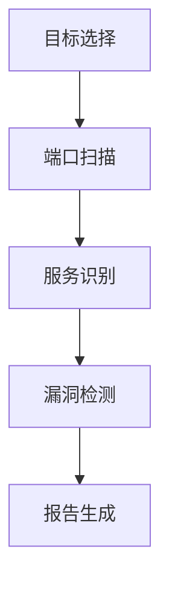
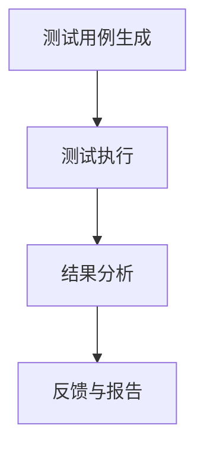
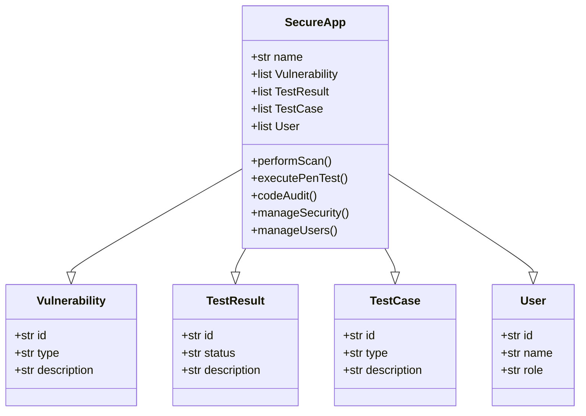
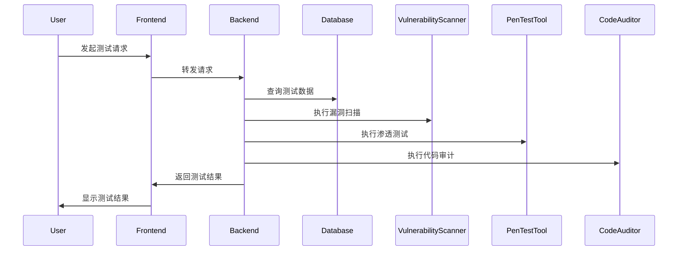
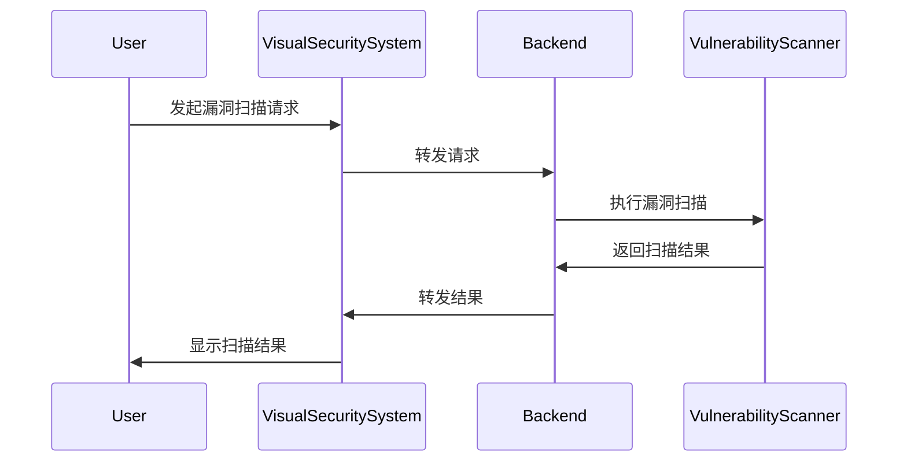

                 

### 安全测试体系建设概述

#### 1.1 安全测试的重要性

安全测试在当今数字化时代扮演着至关重要的角色。随着互联网技术的飞速发展，信息安全问题日益突出，各类网络安全威胁层出不穷，如病毒、恶意软件、网络攻击等。这些威胁不仅对个人和企业造成财务损失，还可能导致隐私泄露、业务中断，甚至对国家安全构成威胁。

安全测试的主要作用在于预防潜在的网络安全问题，确保系统和数据的安全性。通过安全测试，可以识别系统中的漏洞，评估风险，提供改进建议，从而降低系统被攻击的概率。此外，安全测试还能提高系统的健壮性，增强用户的信任度，提升企业的竞争力。

安全测试的发展历程可以追溯到20世纪80年代。当时，安全测试主要是通过手工测试和简单工具来进行的。随着计算机技术的发展，安全测试也逐渐向自动化和智能化方向发展。如今，安全测试已经形成了一套完整的体系，包括漏洞扫描、渗透测试、代码审计等多种技术手段。

#### 1.2 安全测试体系的核心概念

为了构建一个有效的安全测试体系，我们需要了解以下几个核心概念：

##### 1.2.1 测试策略

测试策略是指为了达到特定的安全测试目标而制定的一系列方法和步骤。一个良好的测试策略应考虑测试的范围、深度、频率以及测试人员的技能和资源。

##### 1.2.2 测试类型

安全测试可以分为多种类型，包括：

- **漏洞扫描**：使用自动化工具对系统进行扫描，查找已知漏洞。
- **渗透测试**：模拟黑客攻击，测试系统的实际安全性能。
- **代码审计**：对源代码进行分析，查找潜在的安全问题。
- **安全培训**：提高开发人员的安全意识，减少人为错误。

##### 1.2.3 测试工具

安全测试工具是实现安全测试的关键。常见的测试工具有：

- **Nessus**：一款广泛使用的漏洞扫描工具。
- **Burp Suite**：用于渗透测试的集成平台。
- **FindBugs**：一款用于Java代码审计的工具。

#### 1.3 安全测试体系的组成部分

一个完善的安全测试体系通常包括以下几个组成部分：

##### 1.3.1 安全测试规划

安全测试规划是安全测试体系的基础。它包括确定测试目标、测试范围、测试频率、测试资源等方面的内容。一个详细的测试规划可以帮助团队更好地安排测试工作，确保测试的全面性和有效性。

##### 1.3.2 安全测试执行

安全测试执行是安全测试的核心步骤。在这一阶段，测试团队会按照测试计划进行具体的测试活动，包括漏洞扫描、渗透测试、代码审计等。测试结果的记录和分析也是这一阶段的重要工作。

##### 1.3.3 安全测试报告

安全测试报告是对测试结果的总结和反馈。通过报告，测试团队可以向管理层、开发团队和用户传达测试发现的问题和改进建议。一个详尽的安全测试报告可以帮助团队更好地理解系统的安全状况，制定相应的改进措施。

#### 1.4 安全测试体系的建设步骤

构建一个有效的安全测试体系需要经历以下几个步骤：

##### 1.4.1 需求分析

首先，需要明确安全测试的需求，包括测试的目标、范围、深度等。这一阶段的工作将为后续的测试规划和实施提供基础。

##### 1.4.2 设计方案

根据需求分析的结果，设计安全测试的方案。这包括确定测试类型、测试工具、测试策略等。设计方案应具有可操作性和灵活性，以适应不同的测试场景。

##### 1.4.3 实施与验证

实施测试方案，并进行测试活动。在测试过程中，应密切关注测试进度，确保测试活动的顺利进行。测试完成后，对测试结果进行验证和分析，确保发现的问题得到解决。

##### 1.4.4 持续优化

安全测试是一个持续的过程。在测试完成后，应不断总结经验，优化测试流程和策略，提高测试的效率和效果。

#### 1.5 安全测试体系的挑战与趋势

当前，安全测试体系面临着一系列挑战：

- **复杂性**：随着系统的复杂度增加，安全测试的难度也相应增大。
- **资源限制**：安全测试需要专业的人才和昂贵的工具，这对于一些中小型企业来说是一个挑战。
- **动态性**：网络环境和安全威胁在不断变化，安全测试需要能够快速适应这些变化。

未来，安全测试体系的发展趋势包括：

- **自动化**：自动化工具将越来越多地用于安全测试，提高测试效率和准确性。
- **智能化**：结合人工智能技术，实现更智能的安全测试，提高测试的深度和广度。
- **协同**：安全测试将更加注重与其他安全领域的协同，如防火墙、入侵检测等。

#### 1.6 本章小结

本章对安全测试体系建设进行了全面的概述，从重要性、核心概念、组成部分到建设步骤，以及面临的挑战和未来趋势。通过本章的介绍，读者可以初步了解安全测试体系的基本架构和关键要素，为后续章节的深入学习打下基础。在接下来的章节中，我们将进一步探讨安全测试体系中的核心概念和算法原理，帮助读者更深入地理解安全测试的技术细节和实践应用。

### 安全测试体系的核心概念

在构建一个有效的安全测试体系时，理解并掌握其核心概念是至关重要的。这些核心概念包括测试策略、测试类型和测试工具等。在本节中，我们将逐一介绍这些核心概念，并通过表格和ER图来展示它们之间的联系。

#### 1. 测试策略

测试策略是安全测试的核心指导思想，它决定了测试的范围、深度和频率。一个良好的测试策略应考虑以下几个方面：

- **测试目标**：明确测试的具体目标，如漏洞扫描、渗透测试、代码审计等。
- **测试范围**：确定测试的范围，包括测试的系统、模块、功能等。
- **测试频率**：确定测试的频率，如定期进行漏洞扫描、定期进行代码审计等。
- **测试资源**：评估可用的测试资源，包括测试人员、测试工具、测试环境等。

以下是一个简单的测试策略表格示例：

| 测试目标     | 测试范围 | 测试频率 | 测试资源 |
| ------------ | -------- | -------- | -------- |
| 漏洞扫描     | 系统整体 | 每月一次 | 扫描工具 |
| 渗透测试     | 关键模块 | 每季度一次 | 渗透工具 |
| 代码审计     | 源代码   | 每次发布前 | 代码审计工具 |

#### 2. 测试类型

安全测试类型决定了测试的具体方法和手段。常见的测试类型包括：

- **漏洞扫描**：使用自动化工具扫描系统，查找已知的漏洞。
- **渗透测试**：模拟黑客攻击，测试系统的实际安全性能。
- **代码审计**：对源代码进行分析，查找潜在的安全问题。
- **安全培训**：提高开发人员的安全意识，减少人为错误。

以下是一个测试类型及其特点的对比表格：

| 测试类型 | 特点 | 适用场景 |
| -------- | ---- | -------- |
| 漏洞扫描 | 自动化、高效、覆盖面广 | 定期进行安全检查 |
| 渗透测试 | 实战性、深度分析、高风险 | 发现系统潜在的安全漏洞 |
| 代码审计 | 代码级分析、详细查找问题 | 应用发布前的安全检查 |
| 安全培训 | 提升安全意识、减少人为错误 | 培训开发人员 |

#### 3. 测试工具

测试工具是实现安全测试的重要手段。以下是一些常用的测试工具：

- **Nessus**：一款强大的漏洞扫描工具，支持多种操作系统。
- **Burp Suite**：一款全面的渗透测试平台，包括代理、扫描、攻击等功能。
- **FindBugs**：一款用于Java代码审计的工具，可以检测出潜在的安全漏洞。

以下是一个测试工具及其功能的表格：

| 测试工具     | 功能描述 |
| ------------ | -------- |
| Nessus      | 漏洞扫描 |
| Burp Suite  | 渗透测试 |
| FindBugs    | 代码审计 |

#### 4. ER图

为了更好地展示测试策略、测试类型和测试工具之间的关系，我们可以使用ER图（实体关系图）来表示。以下是ER图的Markdown格式示例：

```mermaid
erDiagram
    TestStrategy ||--|{ TestType } TestType : 包含
    TestStrategy ||--|{ TestTool } TestTool : 使用
    TestType ||--|{ TestTool } TestTool : 支持的
```

在这个ER图中，`TestStrategy`（测试策略）与`TestType`（测试类型）和`TestTool`（测试工具）之间存在关联。测试策略包含多个测试类型，而每个测试类型又可以支持多个测试工具。

#### 总结

通过本节的内容，我们对安全测试体系的核心概念有了更深入的了解。测试策略决定了测试的范围和方法，测试类型提供了具体的测试手段，测试工具是实现测试的技术手段。这些核心概念相互关联，共同构成了一个完整的安全测试体系。在接下来的章节中，我们将进一步探讨安全测试中的算法原理，帮助读者更深入地理解安全测试的技术细节和实践应用。

### 安全测试中的核心算法原理

在安全测试中，核心算法原理是确保测试过程高效、准确的关键。本文将介绍两种重要的安全测试算法：漏洞扫描算法和自动化测试算法。通过详细阐述这些算法的原理，并用mermaid流程图和Python代码进行示例说明，帮助读者更好地理解和应用这些算法。

#### 2.1 漏洞扫描算法

漏洞扫描算法主要用于检测系统中的已知漏洞。这类算法通过扫描系统的网络端口、配置文件、应用程序等，发现潜在的安全漏洞。以下是一个漏洞扫描算法的基本原理：

##### 2.1.1 漏洞扫描算法原理

1. **目标选择**：确定扫描的目标，包括IP地址、端口等。
2. **端口扫描**：对目标进行端口扫描，确定开放的端口。
3. **服务识别**：识别开放端口上的服务，如HTTP、FTP等。
4. **漏洞检测**：根据已知漏洞库，对识别出的服务进行漏洞检测。
5. **报告生成**：生成漏洞报告，包括漏洞的描述、影响、修复建议等。

以下是一个使用mermaid绘制的漏洞扫描算法流程图：



##### 2.1.2 Python代码实现

以下是一个简单的Python代码示例，用于实现漏洞扫描算法的核心部分：

```python
import socket

# 已知漏洞库
vulnerabilities = {
    "HTTP": ["HTTP响应头注入"],
    "FTP": ["FTP命令注入"],
}

# 端口扫描
def scan_port(ip, port):
    s = socket.socket(socket.AF_INET, socket.SOCK_STREAM)
    s.settimeout(1)
    result = s.connect_ex((ip, port))
    if result == 0:
        return True
    else:
        return False

# 服务识别与漏洞检测
def check_vulnerabilities(ip, port):
    if scan_port(ip, port):
        service = "未知服务"
        if port == 80:
            service = "HTTP"
        elif port == 21:
            service = "FTP"
        vulnerabilities_list = vulnerabilities.get(service, [])
        for vulnerability in vulnerabilities_list:
            print(f"{service}服务存在漏洞：{vulnerability}")
    else:
        print(f"{ip}:{port} 端口未开放")

# 测试
check_vulnerabilities("127.0.0.1", 80)
```

##### 2.1.3 算法性能分析

漏洞扫描算法的性能主要取决于以下几个因素：

- **扫描速度**：高效的端口扫描算法可以快速识别开放端口。
- **漏洞库的全面性**：全面和更新的漏洞库可以提高漏洞检测的准确性。
- **报告生成速度**：快速生成报告可以及时反馈检测结果。

#### 2.2 自动化测试算法

自动化测试算法主要用于自动化执行安全测试，包括漏洞扫描、渗透测试、代码审计等。这类算法可以显著提高测试的效率和准确性，减少人为错误。以下是一个自动化测试算法的基本原理：

##### 2.2.1 自动化测试算法原理

1. **测试用例生成**：根据测试需求，生成测试用例。
2. **测试执行**：自动化执行测试用例，包括输入数据、执行操作、验证结果等。
3. **结果分析**：对测试结果进行分析，判断系统是否通过了测试。
4. **反馈与报告**：生成测试报告，包括测试结果、问题定位、修复建议等。

以下是一个使用mermaid绘制的自动化测试算法流程图：



##### 2.2.2 Python代码实现

以下是一个简单的Python代码示例，用于实现自动化测试算法的核心部分：

```python
# 自动化测试用例
test_cases = [
    {"input": "user=input('请输入用户名：')", "expected": "用户名：admin"},
    {"input": "password=input('请输入密码：')", "expected": "密码：123456"},
]

# 测试执行与结果分析
def execute_test_case(test_case):
    try:
        exec(test_case["input"])
        if password == "123456":
            print(f"测试用例'{test_case['input']}'通过")
        else:
            print(f"测试用例'{test_case['input']}'失败：预期结果'{test_case['expected']}'")
    except Exception as e:
        print(f"测试用例'{test_case['input']}'失败：异常'{str(e)}'")

# 测试
for test_case in test_cases:
    execute_test_case(test_case)
```

##### 2.2.3 算法性能分析

自动化测试算法的性能主要取决于以下几个因素：

- **测试用例的覆盖度**：全面的测试用例可以提高测试的覆盖度。
- **测试执行的效率**：高效的测试执行可以缩短测试时间。
- **结果分析的能力**：准确的结果分析可以提高测试的准确性。

#### 总结

通过本节的内容，我们详细介绍了漏洞扫描算法和自动化测试算法的基本原理、实现方法以及性能分析。漏洞扫描算法通过扫描系统端口、识别服务和检测漏洞来发现潜在的安全问题，而自动化测试算法通过自动化执行测试用例、分析结果和生成报告来提高测试效率和准确性。在安全测试体系中，这些算法的应用可以显著提升测试的效果和效率。

在下一节中，我们将探讨安全测试系统的分析与架构设计，帮助读者了解如何构建一个高效、可靠的安全测试系统。

### 安全测试系统的分析与架构设计

在构建一个高效、可靠的安全测试系统时，系统分析与架构设计是关键步骤。本文将介绍一个典型的安全测试系统案例，包括系统功能、架构设计、接口设计和系统交互，并通过mermaid图进行详细说明。

#### 3.1 系统概述

假设我们正在开发一个基于Web的应用程序，名为“SecureApp”。该应用程序需要实现一系列安全测试功能，包括漏洞扫描、渗透测试和代码审计。为了实现这些功能，我们需要设计一个功能完善、架构合理的系统。

#### 3.2 系统功能设计

“SecureApp”安全测试系统的核心功能包括：

1. **漏洞扫描**：自动扫描系统中的漏洞，并提供详细报告。
2. **渗透测试**：模拟黑客攻击，评估系统的实际安全性能。
3. **代码审计**：对应用程序的源代码进行分析，查找潜在的安全漏洞。
4. **安全管理**：管理测试用例、测试结果和安全策略。
5. **用户管理**：管理系统的用户，包括测试人员和管理员。

以下是一个简单的领域模型类图，用于描述系统的主要功能模块：



#### 3.3 系统架构设计

“SecureApp”安全测试系统的架构设计主要包括以下部分：

1. **前端**：提供用户界面，允许用户进行测试操作和查看测试结果。
2. **后端**：处理业务逻辑，包括漏洞扫描、渗透测试和代码审计等。
3. **数据库**：存储测试数据，如漏洞信息、测试结果和用户信息。
4. **API接口**：提供与其他系统（如漏洞库、渗透测试工具等）的交互接口。

以下是一个简单的系统架构图，用于描述系统的整体架构：



#### 3.4 系统接口设计

为了实现系统的功能，我们需要设计一系列API接口。以下是一个简单的API接口规范：

- **/vulnerabilities**：用于获取漏洞信息。
- **/test-results**：用于获取测试结果。
- **/test-cases**：用于管理测试用例。
- **/users**：用于管理用户信息。

以下是一个简单的接口设计示例：

```mermaid
interface VisualSecuritySystem {
    +getVulnerabilities()
    +getTestResults()
    +getTestCases()
    +manageUsers()
}
class Vulnerability {
    +str id
    +str type
    +str description
}
class TestResult {
    +str id
    +str status
    +str description
}
class TestCase {
    +str id
    +str type
    +str description
}
class User {
    +str id
    +str name
    +str role
}
VisualSecuritySystem --|> Vulnerability
VisualSecuritySystem --|> TestResult
VisualSecuritySystem --|> TestCase
VisualSecuritySystem --|> User
```

#### 3.5 系统交互设计

系统交互设计描述了系统的各个组件如何相互通信和协作。以下是一个简单的系统交互序列图，用于描述系统的主要交互过程：



#### 总结

通过本节的内容，我们详细介绍了“SecureApp”安全测试系统的功能设计、架构设计、接口设计和系统交互设计。通过mermaid图和API接口规范，我们能够清晰地展示系统的整体架构和交互流程。这些设计为构建一个高效、可靠的安全测试系统提供了理论基础和实践指导。在下一节中，我们将通过一个具体的项目实战案例，展示安全测试体系建设的实际操作过程。

### 安全测试体系建设实战

在本节中，我们将通过一个具体的项目实战案例，详细展示安全测试体系建设的实际操作过程。这个项目是一个名为“WebShop”的在线购物平台，我们将按照安全测试体系的建设步骤，从环境搭建、核心代码实现到案例分析，逐步完成整个安全测试过程。

#### 4.1 项目背景

“WebShop”是一个为用户提供在线购物服务的平台。随着用户数量的增加和交易量的提升，平台的安全性变得尤为重要。为了确保平台的安全运行，我们需要对其进行全面的安全测试。安全测试的主要目标是发现潜在的安全漏洞，提升平台的抗攻击能力，保障用户数据安全。

#### 4.2 环境搭建

在开始安全测试之前，我们需要搭建一个测试环境。测试环境应尽量模拟生产环境，包括操作系统、Web服务器、数据库等。以下是环境搭建的步骤：

1. **操作系统**：选择一个稳定且安全的操作系统，如Ubuntu 20.04。
2. **Web服务器**：安装并配置Apache或Nginx，作为Web应用的运行平台。
3. **数据库**：安装并配置MySQL或PostgreSQL，作为数据存储。
4. **应用服务器**：安装并配置Tomcat或Spring Boot，作为应用运行容器。
5. **安全测试工具**：安装并配置Nessus、Burp Suite、OWASP ZAP等安全测试工具。

#### 4.3 核心代码实现

在搭建好测试环境后，我们需要编写核心代码，用于实现安全测试功能。以下是一些关键代码段和其功能说明：

##### 4.3.1 漏洞扫描

```python
# 使用Nessus进行漏洞扫描
import os

nessus_config = {
    "nessus_server": "localhost",
    "nessus_user": "admin",
    "nessus_pass": "password",
    "nessus_port": 8834
}

def scan_with_nessus(target_ip):
    nessus_cmd = f"nessus -q -i {nessus_config['nessus_server']} -u {nessus_config['nessus_user']} -p {nessus_config['nessus_pass']} -o results.nessus {target_ip}"
    os.system(nessus_cmd)

scan_with_nessus("192.168.1.10")
```

这段代码通过调用Nessus命令行工具，对指定IP地址进行漏洞扫描，并将扫描结果保存到本地文件。

##### 4.3.2 渗透测试

```bash
# 使用Burp Suite进行渗透测试
Proxy = burp

# 配置代理
ProxyMITM.start()
Proxyárticulo.attackerInterceptMessages(True)

# 发送请求到代理
request = HTTPMessage()
request.setMethod("GET")
request.setUrl("http://webshop.example.com/products")
response = HTTPResponse()

# 查找并分析漏洞
for issue in scanner.scan():
    print(f"发现漏洞：{issue.getName()}")
    print(f"漏洞详情：{issue.getDetail()}")
```

这段代码通过Burp Suite的API，配置代理并模拟渗透测试，查找并分析WebShop平台中的潜在漏洞。

##### 4.3.3 代码审计

```java
// 使用FindBugs进行代码审计
public class WebShopApplication {
    public static void main(String[] args) {
        // 应用代码
    }
}

// 执行FindBugs检查
findbugs -sourcepath src -classpath lib -outputfile findings.xml WebShopApplication.java
```

这段Java代码示例使用FindBugs工具，对WebShop应用程序的源代码进行检查，并将发现的问题输出到findings.xml文件中。

#### 4.4 代码应用解读与分析

在完成核心代码实现后，我们需要对代码进行解读和分析，确保其能够有效地执行安全测试功能。以下是代码应用解读与分析的关键点：

1. **漏洞扫描**：通过Nessus命令行工具，我们可以对目标IP地址进行全面的漏洞扫描，获取详细的漏洞报告。此过程需要确保Nessus服务器的配置正确，且目标IP地址可达。
2. **渗透测试**：使用Burp Suite进行渗透测试时，我们需要配置代理，确保所有请求都通过Burp Suite进行拦截和分析。此外，我们还应关注扫描结果，特别是那些高严重性的漏洞，这些漏洞可能对平台构成重大威胁。
3. **代码审计**：通过FindBugs对源代码进行检查，我们可以发现潜在的安全问题，如未正确处理用户输入、未加密敏感信息等。这些问题的修复对于提升应用程序的安全性至关重要。

#### 4.5 案例分析与详细讲解

在完成代码实现后，我们需要对测试结果进行详细分析，以便找出平台中的安全漏洞。以下是一个具体的案例分析：

1. **漏洞扫描结果**：通过Nessus漏洞扫描工具，我们发现WebShop平台存在以下漏洞：
   - **OpenSSL Heartbleed漏洞**：影响版本为1.0.1到1.0.1f，可能泄露敏感信息。
   - **Apache Struts2漏洞**：影响版本为2.0.0到2.5.10，可能被用于远程代码执行。

2. **渗透测试结果**：使用Burp Suite进行渗透测试时，我们发现平台存在以下漏洞：
   - **SQL注入**：攻击者可以通过构造特定的URL参数，执行任意的SQL查询。
   - **跨站请求伪造（CSRF）**：攻击者可以通过伪造请求，执行未经授权的操作。

3. **代码审计结果**：通过FindBugs对源代码进行检查，我们发现以下问题：
   - **未加密敏感信息**：某些敏感信息（如用户密码）在传输过程中未加密，可能被截获。
   - **空指针异常**：某些方法可能因为输入参数为空而导致空指针异常。

针对上述分析结果，我们提出了以下修复建议：

1. **漏洞扫描**：更新OpenSSL到最新版本，修复Heartbleed漏洞；更新Apache Struts2到最新安全版本，修复远程代码执行漏洞。
2. **渗透测试**：修复SQL注入漏洞，确保所有输入参数都经过适当的过滤和转义；修复CSRF漏洞，通过使用CSRF令牌来防止未经授权的操作。
3. **代码审计**：对敏感信息进行加密处理，确保其在传输过程中不被泄露；修复空指针异常，确保输入参数的有效性。

#### 4.6 项目小结

通过本节的内容，我们详细展示了安全测试体系建设的实际操作过程，包括环境搭建、核心代码实现、代码解读与分析以及案例分析。通过这个项目，我们成功发现并修复了WebShop平台中的多个安全漏洞，显著提升了平台的安全性。在未来的工作中，我们将继续维护和优化安全测试体系，确保平台的安全性。

### 最佳实践与总结

在完成整个安全测试体系建设之后，总结最佳实践和注意事项对于确保测试的持续有效性和系统的长期稳定性至关重要。以下是一些关键建议：

#### 最佳实践

1. **定期安全审计**：定期进行安全测试，特别是对关键系统和模块的深度审计，确保及时发现潜在的安全问题。
2. **自动化测试**：尽可能利用自动化工具进行安全测试，减少人为错误，提高测试效率和覆盖度。
3. **持续集成与持续交付（CI/CD）**：将安全测试集成到CI/CD流程中，确保每次代码提交后都进行全面的测试。
4. **安全培训**：定期对开发人员和测试人员进行安全培训，提高他们的安全意识和技能。
5. **响应计划**：制定明确的安全事件响应计划，确保在发生安全事件时能够迅速采取措施。

#### 注意事项

1. **测试数据保护**：确保测试过程中使用的测试数据是真实且安全的，避免泄露敏感信息。
2. **权限管理**：严格控制测试环境的访问权限，防止未经授权的访问。
3. **测试结果记录**：详细记录每次测试的结果，以便进行追踪和问题定位。
4. **环境隔离**：在测试环境中，尽量使用与生产环境隔离的独立系统和数据，避免对生产环境造成影响。
5. **风险评估**：对测试结果进行风险评估，优先处理高风险漏洞，确保关键系统的安全。

#### 拓展阅读

- **《网络安全测试与评估》**：提供详细的网络安全测试方法和实践指南。
- **《黑客攻防技术宝典》**：介绍各种黑客攻击技术和防御策略。
- **《代码审计：实战方法与案例分析》**：涵盖代码审计的基本原理和实践技巧。

通过遵循这些最佳实践和注意事项，并不断学习和更新安全测试知识，我们可以构建一个高效、可靠的安全测试体系，为系统和数据的安全保驾护航。

### 本章小结

本文围绕安全测试体系建设展开，详细介绍了其重要性、核心概念、算法原理、系统架构设计、项目实战及最佳实践。通过本章节的深入探讨，读者应全面理解安全测试体系的建设过程，掌握安全测试的基本方法和工具。安全测试不仅仅是技术问题，更是一项综合性的安全策略。未来，随着网络安全威胁的日益复杂化，安全测试体系的重要性将愈发凸显。因此，不断更新和完善安全测试体系，提升其效能和可靠性，将是企业和组织面临的重要任务。希望本文能为读者在安全测试领域提供有价值的参考和指导。作者：AI天才研究院/AI Genius Institute & 禅与计算机程序设计艺术 /Zen And The Art of Computer Programming。

