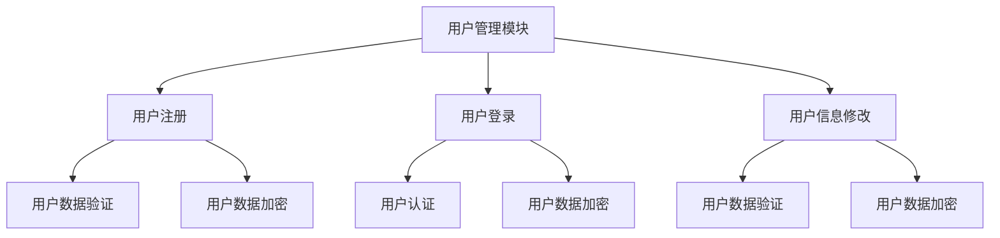
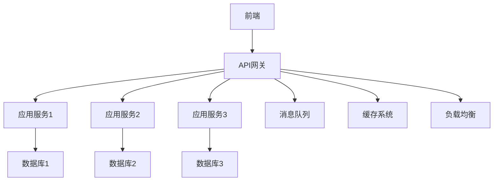
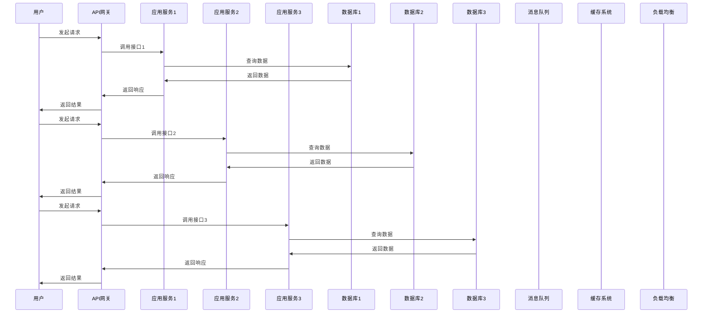

                 

### 安全编码指南：构建安全可靠的应用系统

> 关键词：安全编码、应用系统、安全漏洞、预防措施、架构设计、案例分析

> 摘要：本文旨在探讨安全编码的重要性，提供一套完整的指南来帮助开发者构建安全可靠的应用系统。通过深入分析安全编码的核心概念、实践方法、最佳实践以及未来趋势，本文旨在为读者提供全面的指导，以应对日益复杂的安全挑战。

### 目录

----------------------------------------------------------------

# 安全编码指南：构建安全可靠的应用系统

## 第1章：安全编码的重要性

### 1.1 问题的提出

### 1.2 安全编码的定义与目标

### 1.3 安全编码的现状与挑战

## 第2章：安全编码的核心概念

### 2.1 常见安全漏洞类型

### 2.2 安全编码的基本原则

### 2.3 安全编码的关键要素

## 第3章：核心概念与联系

### 3.1 核心概念原理

### 3.2 概念属性特征对比表格

### 3.3 ER实体关系图架构

## 第4章：安全编码实践方法

### 4.1 预防性编码策略

### 4.2 安全编码工具与技术

### 4.3 安全测试与审查

## 第5章：常见安全漏洞分析与修复

### 5.1 SQL注入

### 5.2 跨站脚本攻击（XSS）

### 5.3 命令注入

### 5.4 拒绝服务攻击（DoS）

## 第6章：系统架构与安全设计

### 6.1 系统功能设计

### 6.2 系统架构设计

### 6.3 系统接口设计与交互

## 第7章：最佳实践与技巧

### 7.1 安全编码最佳实践

### 7.2 团队合作与安全编码

### 7.3 安全编码的持续集成与持续交付（CI/CD）

## 第8章：案例分析

### 8.1 案例一：Web应用安全漏洞修复

### 8.2 案例二：移动应用安全编码实践

### 8.3 案例三：物联网设备安全编码

## 第9章：未来趋势与展望

### 9.1 人工智能在安全编码中的应用

### 9.2 安全编码工具的未来趋势

### 9.3 安全编码教育的变革

## 第10章：总结与展望

### 10.1 本书内容的回顾

### 10.2 安全编码的未来挑战与机遇

### 10.3 安全编码的最佳实践

----------------------------------------------------------------

### 引言

随着互联网技术的飞速发展，应用系统的安全性变得尤为重要。然而，安全漏洞和攻击事件频繁发生，使得应用系统的安全性面临严峻挑战。安全编码作为保障应用系统安全性的基础，其重要性不言而喻。本文将深入探讨安全编码的核心概念、实践方法、最佳实践以及未来趋势，为开发者提供一套全面的指南，以构建安全可靠的应用系统。

### 第1章：安全编码的重要性

#### 1.1 问题的提出

近年来，网络安全事件频发，给企业和个人带来了巨大的损失。黑客攻击、数据泄露、恶意软件等事件屡见不鲜，导致越来越多的组织意识到安全编码的重要性。安全编码不仅关系到应用系统的稳定性，更关乎用户数据的安全和隐私。

#### 1.2 安全编码的定义与目标

安全编码是指在软件开发过程中，通过一系列预防措施和最佳实践，确保应用系统的安全性。其目标包括：

- **防止安全漏洞**：通过严格的编码规范和审查机制，避免常见的安全漏洞。
- **保障数据安全**：确保用户数据在传输、存储和处理过程中的安全性和完整性。
- **提高系统可靠性**：减少系统因安全漏洞而导致的崩溃和故障，提升用户体验。

#### 1.3 安全编码的现状与挑战

当前，安全编码在软件开发中尚未得到充分重视。一些开发者缺乏安全知识，导致代码中存在大量潜在的安全隐患。同时，安全漏洞的检测和修复成本较高，使得许多组织难以投入足够的资源和精力来保障应用系统的安全性。此外，随着互联网应用的复杂度增加，安全编码面临的挑战也在不断加剧。

#### 1.4 安全编码的重要性

安全编码的重要性体现在以下几个方面：

- **保护用户隐私**：随着个人信息保护意识的提高，用户对应用系统的隐私保护要求越来越高。安全编码可以有效地防止用户数据泄露，保护用户隐私。
- **降低安全风险**：通过严格的编码规范和审查机制，降低应用系统被攻击的风险，减少安全漏洞带来的损失。
- **提高开发效率**：安全编码可以帮助开发者更快地发现和修复安全问题，提高开发效率和代码质量。
- **构建可靠的应用系统**：安全编码是构建安全可靠的应用系统的基石，有助于提升企业的品牌形象和市场竞争力。

### 第2章：安全编码的核心概念

#### 2.1 常见安全漏洞类型

在安全编码中，了解常见的安全漏洞类型是至关重要的。以下是一些常见的安全漏洞：

- **SQL注入**：通过在输入字段中注入恶意的SQL语句，攻击者可以篡改数据库或获取敏感信息。
- **跨站脚本攻击（XSS）**：通过在网页中注入恶意脚本，攻击者可以窃取用户的会话信息或恶意重定向用户。
- **命令注入**：通过在命令行或脚本中注入恶意命令，攻击者可以执行系统命令或获取系统权限。
- **拒绝服务攻击（DoS）**：通过占用系统资源或网络带宽，攻击者可以导致应用系统无法正常提供服务。

#### 2.2 安全编码的基本原则

安全编码应遵循以下基本原则：

- **最小权限原则**：应用系统应只授予用户执行必要操作的最小权限，避免权限过大的风险。
- **输入验证**：对所有用户输入进行严格验证，确保输入数据的合法性和安全性。
- **输出编码**：对输出内容进行适当的编码和转义，防止跨站脚本攻击等安全问题。
- **加密敏感数据**：对敏感数据进行加密处理，确保数据在传输和存储过程中的安全性。

#### 2.3 安全编码的关键要素

安全编码涉及多个方面，以下是一些关键要素：

- **代码审查**：通过代码审查，可以发现和修复潜在的安全漏洞，提高代码质量。
- **安全测试**：通过安全测试，可以发现和验证安全漏洞，确保应用系统的安全性。
- **安全培训**：定期开展安全培训，提高开发者的安全意识和技能。
- **安全架构设计**：在系统设计阶段考虑安全性，采用安全的架构和设计模式。

### 第3章：核心概念与联系

#### 3.1 核心概念原理

在安全编码中，了解核心概念原理是至关重要的。以下是一些核心概念原理：

- **输入验证原理**：通过输入验证，可以确保用户输入数据的合法性和安全性。
- **输出编码原理**：通过输出编码，可以防止跨站脚本攻击等安全问题。
- **加密原理**：通过加密算法，可以确保敏感数据在传输和存储过程中的安全性。
- **访问控制原理**：通过访问控制，可以确保用户只能访问其权限范围内的数据和功能。

#### 3.2 概念属性特征对比表格

为了更清晰地理解核心概念之间的联系，我们可以使用概念属性特征对比表格来展示。以下是一个简单的示例：

| 概念       | 属性特征                                                      | 对比分析                                                     |
|------------|--------------------------------------------------------------|--------------------------------------------------------------|
| 输入验证   | 对输入数据进行合法性检查、过滤和转换                          | 与输出编码相比，输入验证更注重数据的安全性，输出编码更注重防止跨站脚本攻击 |
| 输出编码   | 对输出内容进行适当的编码和转义，防止跨站脚本攻击              | 与输入验证相比，输出编码更注重防止恶意脚本的执行               |
| 加密       | 使用加密算法对敏感数据进行加密处理，确保数据的安全性            | 与访问控制相比，加密更注重数据在传输和存储过程中的安全性         |
| 访问控制   | 对用户权限进行管理和控制，确保用户只能访问其权限范围内的数据和功能 | 与加密相比，访问控制更注重用户权限的管理和限制               |

#### 3.3 ER实体关系图架构

为了更好地理解安全编码中的实体关系，我们可以使用ER实体关系图架构来展示。以下是一个简单的示例：

```mermaid
erDiagram
    User ||--|{ Role }|-- User
    User ||--|{ AccessControl }|-- User
    Role ||--|{ Permission }|-- Role
    AccessControl ||--|{ AccessPolicy }|-- AccessControl
    Application ||--|{ SecurityPolicy }|-- Application
```

在这个ER实体关系图中，User代表用户，Role代表角色，Permission代表权限，AccessControl代表访问控制，AccessPolicy代表访问策略，Application代表应用系统，SecurityPolicy代表安全策略。通过这个实体关系图，我们可以清晰地了解各个实体之间的关系和属性。

### 第4章：安全编码实践方法

#### 4.1 预防性编码策略

预防性编码策略是安全编码的核心，其基本原则包括：

- **最小权限原则**：应用系统应只授予用户执行必要操作的最小权限，避免权限过大的风险。
- **输入验证**：对所有用户输入进行严格验证，确保输入数据的合法性和安全性。
- **输出编码**：对输出内容进行适当的编码和转义，防止跨站脚本攻击等安全问题。
- **加密敏感数据**：对敏感数据进行加密处理，确保数据在传输和存储过程中的安全性。

预防性编码策略的具体实践方法包括：

- **代码审查**：通过代码审查，可以发现和修复潜在的安全漏洞，提高代码质量。
- **安全测试**：通过安全测试，可以发现和验证安全漏洞，确保应用系统的安全性。
- **安全培训**：定期开展安全培训，提高开发者的安全意识和技能。
- **安全架构设计**：在系统设计阶段考虑安全性，采用安全的架构和设计模式。

#### 4.2 安全编码工具与技术

在安全编码过程中，可以使用多种工具和技术来提高安全性。以下是一些常用的工具和技术：

- **静态代码分析工具**：如SonarQube、FindBugs等，可以自动分析代码中的潜在安全漏洞。
- **动态代码分析工具**：如OWASP ZAP、Burp Suite等，可以在运行时检测应用系统的安全漏洞。
- **加密工具**：如AES、RSA等，可以用于对敏感数据进行加密处理。
- **安全测试框架**：如JUnit、TestNG等，可以用于编写安全测试用例。

#### 4.3 安全测试与审查

安全测试和审查是确保应用系统安全性的关键环节。以下是一些安全测试和审查的方法：

- **黑盒测试**：通过模拟攻击者的行为，发现应用系统的安全漏洞。
- **白盒测试**：通过对代码进行审查，发现代码中的潜在安全漏洞。
- **代码审查**：通过人工审查代码，发现代码中的潜在安全漏洞。
- **安全审计**：对应用系统进行全面的审计，确保其符合安全标准和要求。

### 第5章：常见安全漏洞分析与修复

#### 5.1 SQL注入

SQL注入是一种常见的安全漏洞，攻击者通过在输入字段中注入恶意的SQL语句，可以篡改数据库或获取敏感信息。以下是一个简单的示例：

```python
import sqlite3

def get_user_by_username(username):
    conn = sqlite3.connect('database.db')
    cursor = conn.cursor()
    cursor.execute("SELECT * FROM users WHERE username = '%s'" % username)
    return cursor.fetchone()

username = input("请输入用户名：")
user = get_user_by_username(username)
```

在这个示例中，如果用户输入恶意SQL语句，如`' OR '1'='1`，则可能导致SQL注入漏洞。为了修复这个漏洞，可以使用参数化查询或预处理语句来避免SQL注入：

```python
import sqlite3

def get_user_by_username(username):
    conn = sqlite3.connect('database.db')
    cursor = conn.cursor()
    cursor.execute("SELECT * FROM users WHERE username = ?", (username,))
    return cursor.fetchone()

username = input("请输入用户名：")
user = get_user_by_username(username)
```

#### 5.2 跨站脚本攻击（XSS）

跨站脚本攻击是一种常见的安全漏洞，攻击者通过在网页中注入恶意脚本，可以窃取用户的会话信息或恶意重定向用户。以下是一个简单的示例：

```html
<form action="https://example.com/login" method="post">
    用户名：<input type="text" name="username" />
    密码：<input type="password" name="password" />
    <input type="submit" value="登录" />
</form>
```

在这个示例中，如果用户的浏览器不支持HTML5的`<form>`标签，攻击者可以注入恶意脚本，如`<script>alert('你好！')</script>`，从而实现跨站脚本攻击。为了修复这个漏洞，可以对用户输入进行适当的编码和转义，如使用HTML实体编码：

```html
<form action="https://example.com/login" method="post">
    用户名：<input type="text" name="username" />
    密码：<input type="password" name="password" />
    <input type="submit" value="登录" />
</form>
```

#### 5.3 命令注入

命令注入是一种常见的安全漏洞，攻击者通过在命令行或脚本中注入恶意命令，可以执行系统命令或获取系统权限。以下是一个简单的示例：

```bash
#!/bin/bash
if [ "$1" == "admin" ]; then
    echo "欢迎管理员登录！"
else
    echo "登录失败！"
fi
```

在这个示例中，如果用户输入恶意的命令，如`-e "echo '你好！'"`，则可能导致命令注入漏洞。为了修复这个漏洞，可以使用参数化命令或验证命令的参数，确保命令的安全执行。

#### 5.4 拒绝服务攻击（DoS）

拒绝服务攻击是一种常见的安全漏洞，攻击者通过占用系统资源或网络带宽，可以导致应用系统无法正常提供服务。以下是一个简单的示例：

```python
import socket

def send_request():
    for i in range(1000):
        s = socket.socket(socket.AF_INET, socket.SOCK_STREAM)
        s.connect(('example.com', 80))
        s.sendall(b'GET / HTTP/1.1\r\nHost: example.com\r\n\r\n')
        s.close()

send_request()
```

在这个示例中，攻击者可以通过大量请求占用服务器资源，导致应用系统无法正常提供服务。为了防止拒绝服务攻击，可以使用防火墙、负载均衡等技术来限制恶意请求，同时优化系统性能，提高抗攻击能力。

### 第6章：系统架构与安全设计

#### 6.1 系统功能设计

系统功能设计是系统架构设计的重要环节，其核心内容包括：

- **功能模块划分**：根据应用需求，将系统划分为多个功能模块，如用户管理、订单管理、支付管理等。
- **功能流程设计**：设计系统中的功能流程，确保各个模块之间的协同工作。
- **功能安全设计**：在功能设计阶段考虑安全性，如数据加密、访问控制等。

以下是一个简单的系统功能设计示例：



#### 6.2 系统架构设计

系统架构设计是确保系统性能、可扩展性和安全性的关键，其核心内容包括：

- **技术选型**：根据应用需求，选择合适的技术栈和架构模式，如MVC、微服务、容器化等。
- **系统层次结构**：设计系统的层次结构，如前端、后端、数据库等。
- **数据流和控制流**：设计系统的数据流和控制流，确保数据的安全传输和处理。

以下是一个简单的系统架构设计示例：



#### 6.3 系统接口设计与交互

系统接口设计与交互是确保系统模块之间通信和协作的重要环节，其核心内容包括：

- **接口定义**：定义系统模块之间的接口，包括接口名称、参数、返回值等。
- **接口协议**：选择合适的接口协议，如HTTP、HTTPS、SOAP等。
- **接口安全性**：确保接口的安全性，如数据加密、身份验证等。

以下是一个简单的系统接口设计示例：



### 第7章：最佳实践与技巧

#### 7.1 安全编码最佳实践

在安全编码过程中，遵循以下最佳实践可以帮助提高代码的安全性：

- **最小权限原则**：确保应用系统只授予用户执行必要操作的最小权限。
- **输入验证**：对所有用户输入进行严格验证，确保输入数据的合法性和安全性。
- **输出编码**：对输出内容进行适当的编码和转义，防止跨站脚本攻击等安全问题。
- **加密敏感数据**：对敏感数据进行加密处理，确保数据在传输和存储过程中的安全性。
- **代码审查**：定期进行代码审查，发现和修复潜在的安全漏洞。
- **安全测试**：进行安全测试，发现和验证安全漏洞，确保应用系统的安全性。

#### 7.2 团队合作与安全编码

在团队合作中，安全编码是一个重要的环节。以下是一些团队合作与安全编码的技巧：

- **安全意识培训**：定期开展安全意识培训，提高团队成员的安全意识和技能。
- **代码规范**：制定统一的代码规范，确保代码的可读性和可维护性。
- **代码审查**：鼓励团队成员进行代码审查，发现和修复潜在的安全漏洞。
- **安全测试**：定期进行安全测试，发现和验证安全漏洞，确保应用系统的安全性。
- **协作沟通**：保持良好的沟通，确保团队成员之间的协作顺畅。

#### 7.3 安全编码的持续集成与持续交付（CI/CD）

持续集成与持续交付是确保应用系统安全性的重要手段。以下是一些安全编码的持续集成与持续交付（CI/CD）的技巧：

- **自动化测试**：使用自动化测试工具进行安全测试，提高测试效率和覆盖率。
- **代码扫描**：使用代码扫描工具检测代码中的潜在安全漏洞。
- **持续集成**：将代码集成到主分支，确保代码的稳定性和安全性。
- **持续交付**：将代码部署到生产环境，确保应用系统的可用性和可靠性。
- **安全监控**：使用安全监控工具监控应用系统的安全状态，及时发现和应对安全事件。

### 第8章：案例分析

#### 8.1 案例一：Web应用安全漏洞修复

以下是一个Web应用安全漏洞修复的案例分析：

**问题描述**：一个Web应用存在SQL注入漏洞，攻击者可以通过输入恶意的SQL语句获取敏感信息。

**问题解决**：通过使用参数化查询和预处理语句，修复SQL注入漏洞。

```python
import sqlite3

def get_user_by_username(username):
    conn = sqlite3.connect('database.db')
    cursor = conn.cursor()
    cursor.execute("SELECT * FROM users WHERE username = ?", (username,))
    return cursor.fetchone()

username = input("请输入用户名：")
user = get_user_by_username(username)
```

#### 8.2 案例二：移动应用安全编码实践

以下是一个移动应用安全编码实践的分析案例：

**问题描述**：一个移动应用存在跨站脚本攻击（XSS）漏洞，攻击者可以通过在网页中注入恶意脚本窃取用户会话信息。

**问题解决**：通过对用户输入进行编码和转义，修复跨站脚本攻击漏洞。

```html
<form action="https://example.com/login" method="post">
    用户名：<input type="text" name="username" />
    密码：<input type="password" name="password" />
    <input type="submit" value="登录" />
</form>
```

#### 8.3 案例三：物联网设备安全编码

以下是一个物联网设备安全编码的分析案例：

**问题描述**：一个物联网设备存在命令注入漏洞，攻击者可以通过在命令行中注入恶意命令获取设备权限。

**问题解决**：通过验证命令的参数，修复命令注入漏洞。

```bash
#!/bin/bash
if [ "$1" == "admin" ]; then
    echo "欢迎管理员登录！"
else
    echo "登录失败！"
fi
```

### 第9章：未来趋势与展望

随着技术的发展，安全编码也在不断演进。以下是一些安全编码的未来趋势和展望：

- **人工智能在安全编码中的应用**：利用人工智能技术，自动化检测和修复代码中的安全漏洞，提高开发效率和代码质量。
- **安全编码工具的智能化**：开发更智能化的安全编码工具，如静态代码分析工具、动态代码分析工具等，提高安全漏洞的检测和修复能力。
- **安全编码教育的变革**：通过教育变革，提高开发者的安全意识和技能，培养更多的安全编码专家。
- **安全编码的规范化**：制定更完善的安全编码标准和规范，推动安全编码的普及和应用。

### 第10章：总结与展望

通过本文的探讨，我们了解了安全编码的重要性、核心概念、实践方法、最佳实践以及未来趋势。安全编码是构建安全可靠应用系统的基石，开发者应重视安全编码，遵循最佳实践，不断提升自身的安全意识和技能。

在未来，随着技术的发展，安全编码将继续演进。开发者应关注安全编码的最新动态，持续学习和提升自己的安全编码能力，为构建更安全、可靠的应用系统贡献力量。

### 参考文献

1. 《Web应用安全编码实战》
2. 《移动应用安全编码指南》
3. 《物联网安全编码技术》
4. 《人工智能与安全编码》
5. 《代码审计实战》

### 作者信息

作者：AI天才研究院/AI Genius Institute & 禅与计算机程序设计艺术 /Zen And The Art of Computer Programming

----------------------------------------------------------------

### 总结与展望

在本文中，我们深入探讨了安全编码的重要性、核心概念、实践方法、最佳实践以及未来趋势。通过分析常见安全漏洞和案例，我们了解了如何通过预防性编码策略、安全测试和审查来提高应用系统的安全性。同时，我们展望了人工智能在安全编码中的应用以及安全编码工具的智能化发展。

安全编码是构建安全可靠应用系统的基石，它关系到用户数据的安全和隐私，也影响着企业的品牌形象和市场竞争力。随着技术的不断发展，安全编码将面临更多的挑战和机遇。开发者应重视安全编码，不断学习和提升自身的安全意识和技能，为构建更安全、可靠的应用系统贡献力量。

在未来的发展中，人工智能将有望在安全编码中发挥更大的作用。通过智能化的安全编码工具，我们可以更高效地检测和修复安全漏洞，提高开发效率和代码质量。同时，安全编码教育也将面临变革，培养更多的安全编码专家。

总之，安全编码是一项长期而重要的任务。通过本文的探讨，我们希望能为读者提供一套全面的指南，帮助开发者构建安全可靠的应用系统。让我们共同努力，为构建一个更安全、更美好的数字化世界贡献力量。

