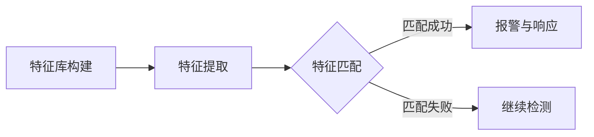
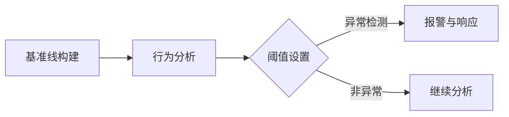
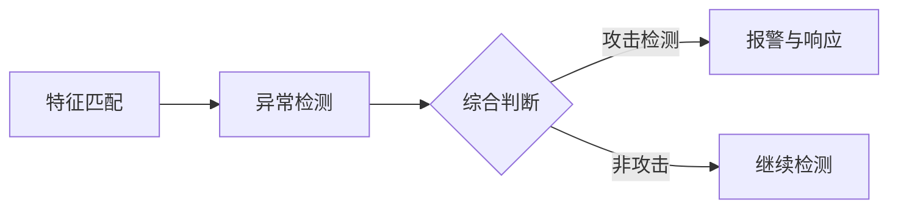
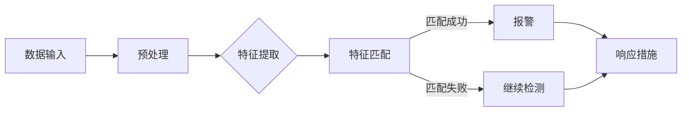
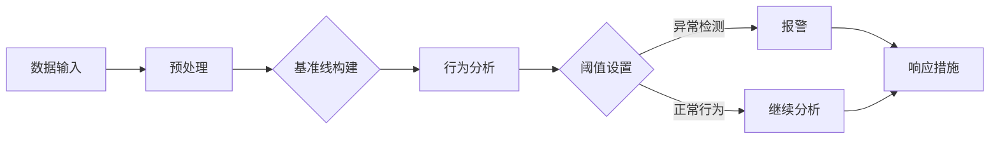
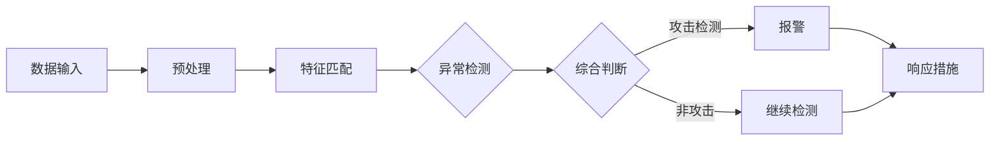
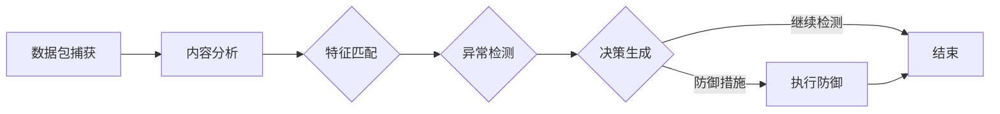
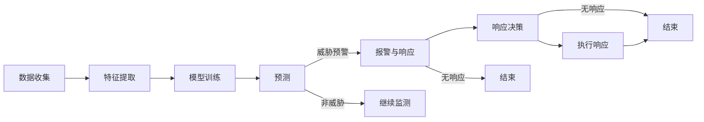
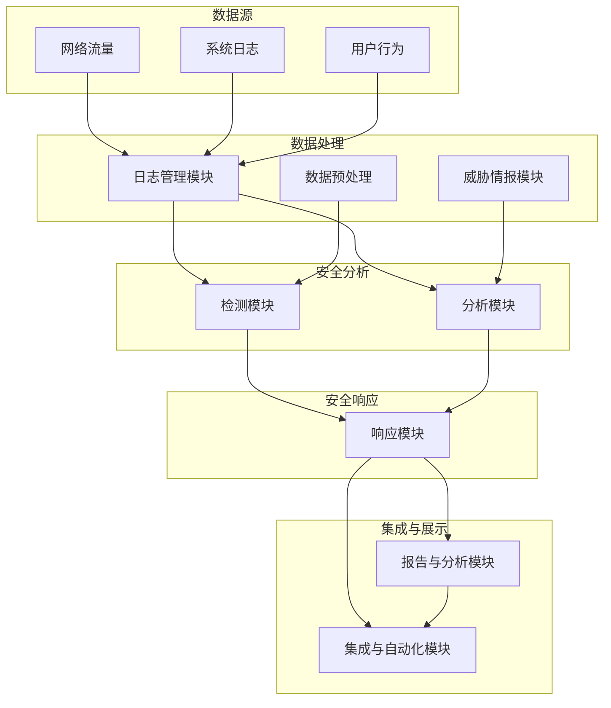
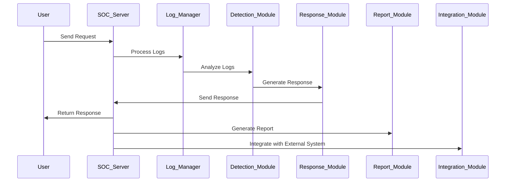

                 

### 安全运营中心（SOC）的定义与特点

#### 2.1.1 安全运营中心（SOC）的定义

安全运营中心（Security Operations Center，简称SOC）是一种用于监控、检测、分析以及响应网络安全事件的集中化平台。SOC的基本定义涵盖了以下核心要素：

1. **监控**：实时监控网络流量、系统日志、用户行为等，以发现潜在的安全威胁。
2. **检测**：利用各种技术手段对监控数据进行分析，识别已知和未知的安全威胁。
3. **分析**：深入分析已检测到的安全事件，确定其影响范围和潜在风险。
4. **响应**：制定并执行响应策略，以快速应对和缓解安全事件。

#### 2.1.2 安全运营中心（SOC）的特点

SOC具有以下几个显著特点，使其在网络安全领域发挥着至关重要的作用：

1. **集中化管理**：SOC提供了一个集中化的管理平台，使得安全团队可以更高效地监控和处理安全事件，提高响应速度和效率。
2. **综合性与集成性**：SOC不仅能够整合多种安全工具和系统，还能够将不同来源的数据进行综合分析，从而实现更全面的威胁检测和响应。
3. **自动化与智能化**：SOC通过引入自动化工具和人工智能技术，可以自动识别和响应安全事件，减轻人工负担，提高工作效率。
4. **实时性与可扩展性**：SOC能够实时监控网络环境，快速检测和响应安全事件，同时具备良好的可扩展性，以适应不断变化的安全需求。

#### 2.1.3 安全运营中心（SOC）与传统安全运营中心的区别

尽管SOC与传统安全运营中心（如安全控制中心）有相似之处，但它们在功能、目的和运作方式上存在显著区别：

1. **技术依赖程度**：传统安全运营中心主要依赖于人工分析，而SOC则更多依赖技术手段，如自动化工具和人工智能，以提高效率和准确性。
2. **处理能力**：SOC具备更强的处理能力，能够处理大量的安全事件和数据，而传统安全运营中心通常处理能力有限。
3. **响应速度**：SOC的自动化和智能化特性使其能够在更短的时间内检测和响应安全事件，而传统安全运营中心通常需要更长的时间。
4. **范围与深度**：SOC不仅能够监控网络流量，还可以监控系统日志、用户行为等，提供更全面的安全分析。

通过以上对比，可以看出SOC在技术和效率上具有显著优势，使其成为现代网络安全运营的必备工具。

### SOC的核心概念

#### 2.2.1 威胁情报

威胁情报（Threat Intelligence）是SOC的关键组成部分，它涉及对潜在和当前威胁的分析、收集、处理和分发。威胁情报的主要目的是为安全团队提供关于威胁的深入理解，从而更好地防御和响应安全事件。

**威胁情报的主要功能**：

1. **收集**：从各种来源收集有关威胁的信息，包括公开信息、内部数据和第三方情报。
2. **分析**：对收集到的威胁信息进行深入分析，识别威胁类型、攻击手段和目标。
3. **处理**：将分析结果进行处理，形成可操作的安全策略和防御措施。
4. **分发**：将威胁情报分发给相关团队和人员，确保所有人都能及时了解威胁情况。

**威胁情报的应用场景**：

1. **预测性防御**：利用威胁情报预测潜在威胁，提前采取预防措施。
2. **响应指导**：在发生安全事件时，利用威胁情报指导响应团队采取正确的行动。
3. **持续监控**：利用威胁情报对网络环境进行持续监控，及时发现和应对新的威胁。

#### 2.2.2 风险评估

风险评估（Risk Assessment）是SOC的另一重要概念，它涉及对组织所面临的潜在威胁和漏洞进行分析和评估，以确定其潜在影响和风险。

**风险评估的主要功能**：

1. **威胁识别**：识别组织所面临的潜在威胁，包括已知威胁和未知威胁。
2. **漏洞分析**：分析组织的系统、应用程序和网络中的潜在漏洞。
3. **影响评估**：评估威胁和漏洞可能对组织造成的影响，包括财务损失、数据泄露、业务中断等。
4. **风险优先级排序**：根据威胁和漏洞的影响，对风险进行优先级排序，以确定哪些风险需要优先处理。

**风险评估的应用场景**：

1. **安全策略制定**：根据风险评估结果，制定有效的安全策略和防御措施。
2. **资源分配**：根据风险评估结果，合理分配安全资源，确保重点区域和关键系统得到充分保护。
3. **持续监控**：利用风险评估结果，对组织的风险状况进行持续监控和调整。

#### 2.2.3 威胁猎杀

威胁猎杀（Threat Hunting）是一种主动的威胁检测方法，它涉及安全团队对网络环境进行深入搜索，以发现潜在的安全威胁和异常行为。

**威胁猎杀的主要功能**：

1. **数据搜索**：利用各种工具和技术，对网络日志、流量和用户行为等数据进行深度搜索。
2. **行为分析**：分析搜索结果，识别潜在的安全威胁和异常行为。
3. **响应行动**：在发现威胁后，立即采取响应行动，包括隔离受感染的系统、清除恶意软件等。

**威胁猎杀的应用场景**：

1. **未知威胁检测**：通过威胁猎杀，可以及时发现和应对未知威胁，提高组织的整体安全性。
2. **持续监控**：利用威胁猎杀，对网络环境进行持续监控，确保及时发现和响应新的威胁。
3. **策略优化**：通过分析威胁猎杀的结果，优化安全策略和防御措施，提高组织的防御能力。

#### 2.2.4 自动化响应

自动化响应（Automated Response）是SOC的又一核心概念，它涉及利用技术手段自动检测、分析和响应安全事件，以减少人工干预和响应时间。

**自动化响应的主要功能**：

1. **自动检测**：利用各种技术手段，自动检测网络中的安全事件和异常行为。
2. **自动分析**：自动分析检测到的安全事件，识别威胁类型和影响范围。
3. **自动响应**：根据预定义的响应策略，自动执行相应的响应行动，如隔离受感染的系统、阻断恶意流量等。

**自动化响应的应用场景**：

1. **快速响应**：通过自动化响应，可以在安全事件发生时迅速采取行动，减少损失。
2. **减轻人力负担**：自动化响应可以减轻安全团队的工作负担，提高工作效率。
3. **提高准确性**：自动化响应减少了人为干预，提高了安全事件检测和响应的准确性。

通过威胁情报、风险评估、威胁猎杀和自动化响应这四个核心概念的有机结合，SOC能够提供一个全面、高效的安全运营平台，有效保护组织的信息系统安全。

### SOC的概念属性特征对比表格

为了更直观地理解SOC的概念属性特征，我们可以通过一个表格来展示常见SOC系统之间的对比。以下是一个简单的对比表格：

| SOC系统 | 定义 | 功能 | 特点 |
| :----: | :----: | :----: | :----: |
| XXECC | 用于检测和响应网络攻击的集中化平台 | 监控、检测、分析、响应 | 自动化、集成化、智能化 |
| XDR | 利用大数据和人工智能技术进行威胁检测和响应 | 检测、分析、响应 | 大数据、人工智能、自动化 |
| EDR | 用于检测和响应端点攻击的集中化平台 | 检测、分析、响应 | 端点感知、自动化、高效性 |

**表格解读**：

1. **定义**：每个SOC系统的定义简要描述了其主要用途和功能。
2. **功能**：列出每个SOC系统的主要功能，如监控、检测、分析、响应等。
3. **特点**：总结每个SOC系统的特点，如自动化、集成化、智能化、大数据、人工智能等。

通过这个表格，读者可以快速了解不同SOC系统的基本特性，为选择合适的SOC系统提供参考。

### SOC的ER实体关系图架构

#### 2.4.1 ER模型概述

实体关系图（Entity-Relationship Diagram，简称ER图）是一种用于描述系统中实体及其关系的图形表示方法。在SOC系统中，ER图用于描述各种实体（如用户、设备、数据等）以及它们之间的关系。

**ER图的基本概念**：

1. **实体**：代表系统中的具体对象，如用户、设备、数据等。
2. **属性**：实体具有的特定特征，如用户的用户名、设备型号等。
3. **关系**：实体之间的相互作用，如用户与设备之间的关联。

**ER图的作用**：

- **系统设计**：帮助开发者理解系统的数据结构和逻辑关系，指导系统设计。
- **数据库设计**：用于设计数据库表结构，确保数据的完整性和一致性。
- **数据管理**：帮助数据库管理员维护和管理系统数据。

#### 2.4.2 SOC中的实体与关系

在SOC系统中，常见的实体包括用户、设备、日志、安全事件等。以下是一个简化的SOC系统ER图，展示了这些实体及其关系：

```mermaid
erDiagram
  User ||--|{ Event : generates }
  Device ||--|{ Event : reports }
  Log ||--|{ Event : contains }
  Event ||--|{ Response : triggers }
  Response ||--|{ Action : executes }
```

**实体与关系的解读**：

1. **User（用户）**：代表操作SOC系统的用户，包括安全分析师、管理员等。
   - **关系**：用户生成事件（Event），如登录成功或失败。

2. **Device（设备）**：代表网络中的各种设备，如服务器、工作站、IoT设备等。
   - **关系**：设备报告事件（Event），如系统异常或入侵尝试。

3. **Log（日志）**：代表系统中各种类型的日志记录，如系统日志、网络流量日志等。
   - **关系**：日志包含事件（Event），提供事件的具体信息。

4. **Event（事件）**：代表SOC系统检测到的各种安全事件，如入侵尝试、恶意软件感染等。
   - **关系**：事件触发响应（Response），如阻断恶意流量或隔离受感染设备。

5. **Response（响应）**：代表对事件的处理结果，如阻断恶意流量、隔离受感染设备等。
   - **关系**：响应执行行动（Action），如修改防火墙规则或清除恶意软件。

通过ER图，我们可以清晰地理解SOC系统中各个实体之间的关系，以及它们如何相互作用以实现系统的安全监控和响应功能。ER图的详细设计可以根据具体的SOC系统需求进行调整和扩展，以满足不同的安全运营需求。

### 常见SOC算法介绍

#### 3.1.1 入侵检测系统（IDS）

入侵检测系统（Intrusion Detection System，简称IDS）是SOC中的核心组件之一，用于监控和分析网络流量和系统日志，以检测潜在的安全威胁。IDS的主要功能包括异常检测、攻击检测和安全事件响应。

**IDS的工作原理**：

1. **数据采集**：IDS从网络流量、系统日志、文件系统等数据源中采集数据。
2. **预处理**：对采集到的数据进行分析和预处理，如去除冗余数据、标准化数据格式等。
3. **特征匹配**：将预处理后的数据与已知攻击特征库进行匹配，检测是否有匹配的攻击模式。
4. **异常检测**：利用统计学方法或机器学习算法，对网络流量和系统行为进行分析，检测异常行为。
5. **事件响应**：在检测到安全事件后，IDS会生成警报并触发相应的响应措施，如阻断恶意流量、隔离受感染设备等。

**IDS的分类**：

- **基于特征的IDS（Signature-based IDS）**：通过匹配已知的攻击特征库来检测攻击。
- **基于异常的IDS（Anomaly-based IDS）**：通过检测网络流量和系统行为的异常来识别潜在攻击。
- **混合型IDS（Hybrid IDS）**：结合基于特征和基于异常的方法，提高检测准确率。

#### 3.1.2 入侵防御系统（IPS）

入侵防御系统（Intrusion Prevention System，简称IPS）是IDS的加强版，不仅能够检测和报告安全事件，还能主动阻止攻击。IPS通常位于网络边界，对流入和流出的网络流量进行深度检测和防御。

**IPS的工作原理**：

1. **数据采集**：IPS从网络流量中采集数据。
2. **预处理**：对采集到的数据进行分析和预处理，如去除冗余数据、标准化数据格式等。
3. **深度包检测（DPI）**：对网络流量进行深度分析，检测恶意流量和攻击行为。
4. **行为分析**：利用机器学习和行为分析技术，识别异常行为和潜在攻击。
5. **主动防御**：在检测到攻击时，IPS会采取主动防御措施，如阻断恶意流量、修改防火墙规则等。

**IPS的优势**：

- **实时防御**：IPS能够在检测到攻击时立即采取防御措施，减少攻击造成的损失。
- **自动响应**：IPS能够自动生成防御策略，减轻安全团队的工作负担。
- **高检测率**：IPS结合了深度包检测和行为分析，能够更准确地检测和防御复杂攻击。

#### 3.1.3 综合威胁管理（STM）

综合威胁管理（Integrated Threat Management，简称STM）是一种集成的安全解决方案，旨在通过多种技术手段提供全面的安全防护。STM通常包含多个模块，如防火墙、入侵检测和防御系统、病毒防护等，以实现多层次的安全防护。

**STM的工作原理**：

1. **多层防护**：STM通过多层防护机制，对网络流量进行深度检测和防御，包括防火墙、IDS/IPS、病毒防护等。
2. **数据整合**：STM整合来自不同安全组件的数据，进行综合分析和威胁情报共享，提高检测准确率。
3. **自动化响应**：STM能够自动生成防御策略和响应措施，实现快速威胁响应。
4. **威胁情报**：STM通过收集和分析威胁情报，实时更新防御策略和特征库，提高防御能力。

**STM的优势**：

- **全面防护**：STM提供多层次、多维度的安全防护，能够防御各种类型的安全威胁。
- **自动化与集成**：STM通过自动化和集成，减少人工干预，提高安全运营效率。
- **实时响应**：STM能够实时检测和响应安全事件，降低安全风险。

通过入侵检测系统（IDS）、入侵防御系统（IPS）和综合威胁管理（STM）的有机结合，SOC能够提供全面、高效的安全防护，确保组织的网络安全。

### IDS算法原理

入侵检测系统（IDS）作为SOC的重要组成部分，其核心在于利用算法对网络流量和系统日志进行分析，以识别潜在的攻击行为。以下是常见的IDS算法及其原理：

#### 3.2.1 基于特征的IDS算法

基于特征的入侵检测系统（Feature-based IDS）是最传统的IDS算法，它依赖于已知的攻击特征库来检测网络流量和系统行为中的攻击。

**算法原理**：

1. **特征库构建**：首先，构建一个包含各种攻击特征的数据库。这些特征可以是网络协议的异常使用、特定的网络流量模式、系统命令等。
2. **特征提取**：对捕获的原始数据进行预处理，提取出关键特征。例如，从网络流量中提取源IP、目的IP、端口号、数据包长度等。
3. **特征匹配**：将提取出的特征与特征库进行匹配。如果发现匹配项，则认为检测到了攻击。
4. **报警与响应**：当匹配到攻击特征时，生成警报并触发响应措施，如记录日志、阻断恶意流量等。

**优点**：

- **高检测率**：基于已知特征的算法能够准确识别已知的攻击。
- **实时性**：检测过程通常快速，能够实时响应。

**缺点**：

- **误报率高**：由于特征库的限制，可能会误报正常的网络行为。
- **无法检测未知攻击**：无法识别新的、未记录在特征库中的攻击。

**Mermaid流程图**：



#### 3.2.2 基于异常的IDS算法

基于异常的入侵检测系统（Anomaly-based IDS）通过分析网络流量和系统行为的异常，来检测潜在的安全威胁。

**算法原理**：

1. **基准线构建**：首先，收集和分析正常网络行为的数据，构建正常行为的基准线。
2. **行为分析**：对当前网络流量和系统行为进行分析，与基准线进行对比，识别异常行为。
3. **阈值设置**：设置阈值，如果行为超出阈值，则认为可能存在攻击。
4. **报警与响应**：当检测到异常行为时，生成警报并触发响应措施。

**优点**：

- **低误报率**：通过分析异常行为，可以减少误报。
- **能够检测未知攻击**：可以识别出特征库中未记录的攻击。

**缺点**：

- **准确率不高**：可能无法准确识别所有异常行为，导致漏报。
- **计算复杂度高**：需要大量计算资源来构建基准线和分析行为。

**Mermaid流程图**：



#### 3.2.3 混合型IDS算法

混合型入侵检测系统（Hybrid IDS）结合了基于特征和基于异常的方法，以提高检测准确率和降低误报率。

**算法原理**：

1. **特征匹配**：首先使用基于特征的算法检测已知的攻击。
2. **异常检测**：接着使用基于异常的算法检测异常行为。
3. **综合判断**：将特征匹配和异常检测结果进行综合分析，确定最终检测结果。

**优点**：

- **高检测率**：结合两种算法的优点，提高检测准确率。
- **低误报率**：通过综合分析，减少误报。

**缺点**：

- **计算复杂度高**：需要同时处理特征匹配和异常检测，增加了计算负担。
- **实现难度大**：需要综合多种算法和技术。

**Mermaid流程图**：



通过以上三种IDS算法的详细介绍，我们可以看到每种算法都有其独特的优点和局限性。在实际应用中，可以根据具体需求和场景选择合适的IDS算法，或者采用混合型IDS算法以实现更全面的安全防护。

#### IDS算法的Mermaid流程图

为了更直观地展示IDS算法的工作流程，我们使用Mermaid语言绘制了三种常见IDS算法的流程图。以下是每个算法的Mermaid代码及其解释：

1. **基于特征的IDS算法**



**解释**：该流程图描述了基于特征的IDS算法的基本工作流程。首先，输入数据经过预处理，然后提取特征并与特征库进行匹配。如果匹配成功，则触发报警并采取响应措施；如果匹配失败，则继续检测。

2. **基于异常的IDS算法**



**解释**：基于异常的IDS算法首先构建正常行为的基准线，然后对当前行为进行分析并与基准线对比。如果发现异常行为，则触发报警并采取响应措施；如果行为正常，则继续分析。

3. **混合型IDS算法**



**解释**：混合型IDS算法结合了基于特征和基于异常的方法。首先进行特征匹配，然后进行异常检测，最后综合判断是否为攻击行为。如果检测到攻击，则触发报警并采取响应措施；如果未检测到攻击，则继续检测。

通过上述Mermaid流程图，我们可以更清晰地理解每种IDS算法的工作流程和逻辑关系，为实际应用提供指导。

#### IPS算法原理

入侵防御系统（Intrusion Prevention System，简称IPS）是SOC中的关键组件，负责在入侵检测系统（IDS）检测到潜在攻击后，采取进一步的防御措施。以下是IPS算法的主要原理：

##### 3.3.1 防火墙IPS算法

防火墙IPS算法结合了传统防火墙功能和入侵检测技术，能够在网络边界对流入和流出的流量进行深度检测和防御。

**算法原理**：

1. **流量检测**：首先，IPS对网络流量进行深度检测，包括检查数据包的源地址、目的地址、端口号、协议类型等信息。
2. **特征匹配**：利用已知的攻击特征库，对流量进行特征匹配，检测是否有恶意流量或攻击行为。
3. **异常检测**：同时，IPS利用统计学方法或机器学习算法，对流量进行异常检测，识别异常流量和潜在攻击。
4. **决策生成**：在检测到恶意流量或异常流量时，IPS生成防御决策，包括阻断恶意流量、修改防火墙规则等。
5. **执行防御措施**：IPS根据生成的防御决策，执行相应的防御措施，如在网络边界阻断恶意流量、修改防火墙规则以限制访问等。

**优势**：

- **实时防御**：IPS能够在检测到攻击时立即采取防御措施，减少攻击对系统的损害。
- **多层防护**：结合防火墙和入侵检测技术，提供多层次的安全防护。

**缺点**：

- **误报率较高**：由于特征匹配和异常检测的复杂性，可能会误报正常流量，导致业务中断。
- **计算资源消耗大**：深度检测和实时响应需要大量计算资源，可能会影响网络性能。

##### 3.3.2 深度包检测（DPI）算法

深度包检测（Deep Packet Inspection，简称DPI）是一种网络流量分析技术，能够对数据包的内容进行深入分析，识别其中的恶意流量和攻击行为。

**算法原理**：

1. **数据包捕获**：首先，DPI技术通过网络设备捕获网络流量，包括数据包的头部和内容。
2. **内容分析**：对捕获的数据包内容进行深入分析，提取关键信息，如数据包类型、协议、负载等。
3. **特征匹配**：利用已知的攻击特征库，对数据包内容进行特征匹配，检测是否有恶意流量或攻击行为。
4. **异常检测**：同时，DPI技术利用统计学方法或机器学习算法，对数据包内容进行异常检测，识别异常流量和潜在攻击。
5. **决策生成**：在检测到恶意流量或异常流量时，DPI生成防御决策，包括阻断恶意流量、标记可疑数据包等。
6. **执行防御措施**：DPI根据生成的防御决策，执行相应的防御措施，如在网络边界阻断恶意流量、标记可疑数据包以进行进一步分析等。

**优势**：

- **精确检测**：DPI能够对数据包的内容进行深入分析，提高检测的精确度和准确性。
- **实时响应**：能够在检测到攻击时迅速采取防御措施，减少攻击对系统的损害。

**缺点**：

- **性能开销大**：深度包检测需要分析大量的数据包内容，可能会对网络性能产生较大影响。
- **误报率较高**：由于特征匹配和异常检测的复杂性，可能会误报正常流量，导致业务中断。

##### 3.3.3 IPS算法的Mermaid流程图

为了更直观地展示IPS算法的工作流程，我们使用Mermaid语言绘制了深度包检测（DPI）算法的流程图。以下是DPI算法的Mermaid代码及其解释：



**解释**：该流程图描述了深度包检测（DPI）算法的基本工作流程。首先，捕获网络流量，对数据包进行内容分析；然后，利用特征匹配和异常检测技术识别恶意流量；在检测到攻击时，生成防御决策并执行相应的防御措施。

通过上述对IPS算法的详细介绍，我们可以更好地理解其工作原理和实际应用，为SOC的安全防护提供有力支持。

#### IPS算法的Mermaid流程图

为了更直观地展示IPS算法的工作流程，我们使用Mermaid语言绘制了深度包检测（DPI）算法的流程图。以下是DPI算法的Mermaid代码及其解释：


**解释**：该流程图描述了深度包检测（DPI）算法的基本工作流程。首先，捕获网络流量，对数据包进行内容分析；然后，利用特征匹配和异常检测技术识别恶意流量；在检测到攻击时，生成防御决策并执行相应的防御措施。

通过上述Mermaid流程图，我们可以更清晰地理解DPI算法的工作流程和逻辑关系，为实际应用提供指导。

### STM算法原理

综合威胁管理（Integrated Threat Management，简称STM）是一种集成多种安全技术的解决方案，旨在通过多层次的安全防护来应对复杂的安全威胁。STM算法结合了威胁预测、威胁响应和威胁情报共享等功能，以提供全面的安全防护。

#### 3.4.1 威胁预测算法

威胁预测算法是STM算法的核心组成部分，它利用历史数据和机器学习技术，预测潜在的威胁和攻击行为。

**算法原理**：

1. **数据收集**：首先，STM算法从各种数据源收集历史数据，包括网络流量、系统日志、用户行为等。
2. **特征提取**：对收集到的数据进行分析，提取出关键特征。例如，可以从网络流量中提取IP地址、端口号、流量模式等特征。
3. **模型训练**：利用机器学习算法，如决策树、随机森林、神经网络等，对提取的特征进行训练，建立威胁预测模型。
4. **预测**：在新的数据到来时，将数据输入到训练好的模型中，预测是否存在潜在威胁。
5. **报警与响应**：如果预测到潜在威胁，生成警报并触发相应的响应措施，如隔离受感染设备、阻断恶意流量等。

**优点**：

- **提前预警**：通过预测潜在威胁，可以在攻击发生前采取预防措施。
- **提高响应速度**：提前识别威胁，减少检测和响应的时间。

**缺点**：

- **误报率**：机器学习模型的训练过程中可能会引入噪声，导致误报。
- **计算资源消耗**：训练和预测过程需要大量计算资源。

#### 3.4.2 威胁响应算法

威胁响应算法是STM算法的重要组成部分，负责在检测到威胁后，快速采取有效的响应措施，以减少攻击对系统的影响。

**算法原理**：

1. **检测**：利用入侵检测系统（IDS）、入侵防御系统（IPS）等技术，对网络流量和系统行为进行实时检测。
2. **威胁分析**：在检测到威胁后，对威胁进行详细分析，确定威胁的类型、来源和影响范围。
3. **响应决策**：根据威胁分析和策略配置，生成相应的响应决策，包括隔离受感染设备、阻断恶意流量、清除恶意软件等。
4. **执行响应**：执行响应决策，如修改防火墙规则、隔离受感染设备等。
5. **记录日志**：记录所有响应操作，以便后续审计和分析。

**优点**：

- **快速响应**：能够在检测到威胁后迅速采取响应措施，减少攻击对系统的损害。
- **自动化**：通过自动化响应，减少人工干预，提高响应效率。

**缺点**：

- **误报处理**：可能会误报正常的网络行为，导致不必要的响应。
- **响应策略的优化**：需要不断调整和优化响应策略，以适应不同的威胁场景。

#### 3.4.3 STM算法的Mermaid流程图

为了更直观地展示STM算法的工作流程，我们使用Mermaid语言绘制了威胁预测和威胁响应的流程图。以下是STM算法的Mermaid代码及其解释：



**解释**：该流程图描述了STM算法的基本工作流程。首先，收集数据并进行特征提取和模型训练；然后，利用训练好的模型进行威胁预测。如果预测到潜在威胁，则生成警报并触发响应措施；如果没有检测到威胁，则继续监测。

通过上述STM算法的详细介绍和Mermaid流程图，我们可以更好地理解STM算法的工作原理和实际应用，为SOC的安全运营提供有力支持。

### 系统功能设计

#### 4.1 安全运营中心的实际应用场景

安全运营中心（SOC）的实际应用场景广泛，涵盖了各种行业和业务需求。以下是一些常见的应用场景：

1. **金融行业**：金融机构需要保护大量的客户数据和交易信息，SOC可以帮助实时监控和检测恶意攻击，如网络钓鱼、金融欺诈等，确保交易安全。
2. **电信行业**：电信运营商需要保护网络基础设施和客户数据，SOC可以监控网络流量，检测DDoS攻击、数据泄露等，保障服务质量和客户隐私。
3. **政府机构**：政府部门需要保护国家机密和重要信息，SOC可以提供全面的监控和检测能力，防止内部和外部威胁，确保信息安全。
4. **企业内部**：大型企业需要保护其IT基础设施和商业秘密，SOC可以帮助发现和响应内部威胁，如员工恶意行为、数据泄露等。
5. **云计算服务**：云服务提供商需要保障云平台的安全，SOC可以监控云环境中的异常行为，检测和防范恶意攻击，确保客户数据的安全。

#### 4.2 系统功能模块划分

为了实现SOC的高效运营，通常将其划分为多个功能模块，每个模块负责特定的功能。以下是SOC的主要功能模块及其简介：

1. **监控模块**：负责实时监控网络流量、系统日志、用户行为等，及时发现潜在的安全威胁。
2. **检测模块**：利用入侵检测系统（IDS）、入侵防御系统（IPS）等技术，对监控数据进行深度分析，识别已知和未知的安全威胁。
3. **分析模块**：对检测到的安全事件进行深入分析，确定其影响范围和潜在风险，为响应提供指导。
4. **响应模块**：在检测到安全事件后，自动或手动采取响应措施，如隔离受感染设备、阻断恶意流量、清除恶意软件等。
5. **威胁情报模块**：收集、处理和分发威胁情报，为安全运营提供深入理解，帮助团队预测和防御潜在威胁。
6. **日志管理模块**：负责存储和管理系统日志，为安全分析提供数据支持，同时确保日志的完整性和可审计性。
7. **报告与分析模块**：生成安全报告，提供安全事件的统计和分析结果，帮助团队了解安全态势，优化安全策略。
8. **集成与自动化模块**：实现SOC与其他安全工具和系统的集成，利用自动化技术提高安全运营的效率和准确性。

#### 4.3 领域模型Mermaid类图

为了更直观地展示SOC系统的功能模块和它们之间的关系，我们使用Mermaid语言绘制了领域模型类图。以下是类图的Mermaid代码及其解释：

```mermaid
classDiagram
    Class01 <|-- Class02
    Class03 <|-- Class04
    Class05 <|-- Class06
    Class01 <|-- Class07
    Class08 <|-- Class09
    Class10 <|-- Class11
    Class12 <|-- Class13
    Class01 -| Class14
    Class15 -| Class16
    Class17 -| Class18
    Class19 -| Class20
    Class21 -| Class22
    Class23 -| Class24
    Class25 -| Class26
    Class27 -| Class28
    Class29 -| Class30
    Class31 -| Class32
    Class33 -| Class34
    Class35 -| Class36
    Class37 -| Class38
    Class39 -| Class40
    Class41 -| Class42
    Class01{监控模块}
    Class43{检测模块}
    Class44{分析模块}
    Class45{响应模块}
    Class46{威胁情报模块}
    Class47{日志管理模块}
    Class48{报告与分析模块}
    Class49{集成与自动化模块}
    Class50{其他模块}
endclass
```

**解释**：该类图描述了SOC系统的主要功能模块及其之间的关系。每个模块作为一个类，类与类之间通过继承或关联关系连接。例如，监控模块、检测模块、分析模块、响应模块、威胁情报模块等是SOC的核心模块，它们与其他模块（如日志管理模块、报告与分析模块、集成与自动化模块等）进行交互，以实现全面的安全运营。

通过上述领域模型类图，我们可以更清晰地了解SOC系统的功能模块和它们之间的协作关系，为实际系统的设计和实现提供指导。

### 系统架构设计

#### 4.3.1 系统架构设计原则

在进行SOC系统架构设计时，应遵循以下原则，以确保系统的高效性、可扩展性和可靠性：

1. **模块化设计**：将系统划分为多个功能模块，每个模块具有明确的功能和接口，便于维护和扩展。
2. **高可用性**：设计冗余备份机制，确保系统在故障情况下能够快速恢复，减少服务中断时间。
3. **高性能**：采用高效的数据处理和存储技术，确保系统能够实时处理大量的监控数据和安全事件。
4. **安全性**：确保系统的安全性，采用加密、访问控制等技术，防止数据泄露和未经授权的访问。
5. **可扩展性**：设计灵活的架构，支持系统功能的动态扩展和升级，以适应不断变化的安全需求。
6. **易维护性**：采用清晰的设计和良好的编码规范，确保系统易于维护和更新。

#### 4.3.2 系统架构Mermaid架构图

为了更直观地展示SOC系统的整体架构，我们使用Mermaid语言绘制了系统架构图。以下是架构图的Mermaid代码及其解释：



**解释**：该架构图描述了SOC系统的整体架构。首先，从数据源（网络流量、系统日志、用户行为）开始，通过日志管理模块进行数据预处理，生成预处理后的数据。接着，威胁情报模块对预处理数据进行分析，生成威胁情报。检测模块和分析模块利用威胁情报对数据进行深度分析，检测潜在的安全威胁。响应模块根据分析结果，采取相应的响应措施。最后，报告与分析模块和集成与自动化模块对安全事件进行统计分析和自动化处理，提供可视化的安全报告和自动化响应。

通过上述系统架构设计，我们可以确保SOC系统的高效性、可靠性和灵活性，为安全运营提供强有力的支持。

### 系统接口设计

#### 4.4.1 接口功能定义

在SOC系统中，接口设计是关键的一环，它定义了系统内部各模块之间的通信方式，以及与外部系统的交互。以下是SOC系统的主要接口及其功能定义：

1. **日志管理接口**：负责日志的收集、存储和查询功能。接口定义如下：
   - **方法**：POST /api/logs
   - **功能**：接收并存储日志数据。
   - **参数**：{ "log_data": "..." }

2. **检测与分析接口**：负责对日志数据进行检测和分析，生成威胁情报。接口定义如下：
   - **方法**：GET /api/detection
   - **功能**：获取检测到的安全事件。
   - **参数**：{ "time_range": "..." }

3. **响应接口**：负责根据分析结果，采取相应的响应措施。接口定义如下：
   - **方法**：POST /api/response
   - **功能**：执行安全响应操作。
   - **参数**：{ "action": "block", "target": "..." }

4. **报告与分析接口**：负责生成安全报告和统计分析结果。接口定义如下：
   - **方法**：GET /api/reports
   - **功能**：获取安全报告。
   - **参数**：{ "report_type": "daily", "time_range": "..." }

5. **集成与自动化接口**：负责与外部系统（如防火墙、IDS/IPS等）进行集成和通信。接口定义如下：
   - **方法**：POST /api/integration
   - **功能**：配置外部系统。
   - **参数**：{ "system_type": "firewall", "config": "..." }

#### 4.4.2 接口交互设计

接口交互设计描述了SOC系统内部各模块之间以及与外部系统的通信流程。以下是接口交互设计的Mermaid序列图：



**解释**：该序列图描述了SOC系统的接口交互流程。首先，用户向SOC服务器发送请求，SOC服务器接收请求后，将日志数据交给日志管理模块进行处理。日志管理模块将处理后的日志数据传递给检测模块进行分析。检测模块根据分析结果生成响应，响应模块执行响应操作后，SOC服务器将响应结果返回给用户。同时，SOC服务器还会生成安全报告，并与外部系统进行集成和通信。

通过上述接口设计和交互设计，我们可以确保SOC系统的各个模块之间以及与外部系统的通信高效、可靠，从而实现全面的安全运营。

### 系统交互Mermaid序列图

为了更直观地展示SOC系统的整体交互流程，我们使用Mermaid语言绘制了系统交互序列图。以下是序列图的Mermaid代码及其解释：


**解释**：该序列图描述了SOC系统的交互流程。用户向SOC服务器发送请求，SOC服务器接收请求后，将日志数据交给日志管理模块进行处理。日志管理模块将处理后的日志数据传递给检测模块进行分析。检测模块根据分析结果生成响应，响应模块执行响应操作后，SOC服务器将响应结果返回给用户。同时，SOC服务器还会生成安全报告，并与外部系统（如防火墙、入侵检测系统等）进行集成和通信。

通过这个序列图，我们可以清晰地了解SOC系统的交互过程，为系统的设计、开发和维护提供指导。

### 环境安装

#### 5.1.1 硬件环境要求

为了确保SOC系统能够稳定运行，硬件环境需要满足以下要求：

1. **服务器**：至少需要一台高性能服务器，推荐配置如下：
   - CPU：至少8核处理器，建议使用Intel Xeon系列或AMD EPYC系列
   - 内存：至少64GB，建议使用128GB或更高
   - 存储：至少1TB SSD存储，建议使用NVMe SSD以提高读写速度
   - 网卡：至少1Gbps网卡，建议使用双网卡配置以实现负载均衡和高可用性
2. **存储设备**：如果SOC系统需要存储大量日志数据和威胁情报，建议使用高容量、高可靠性的存储设备，如NAS或分布式存储系统。
3. **备份设备**：配置备份设备，如硬盘或云存储，以确保数据的安全性和可恢复性。

#### 5.1.2 软件环境准备

SOC系统的软件环境需要准备以下软件和工具：

1. **操作系统**：推荐使用Linux发行版，如CentOS 7或Ubuntu 18.04。
2. **数据库**：安装MySQL或PostgreSQL数据库，用于存储日志数据和威胁情报。
3. **日志管理工具**：安装如ELK（Elasticsearch、Logstash、Kibana）或Splunk等日志管理工具，用于日志收集、存储和展示。
4. **安全工具**：安装入侵检测系统（IDS）、入侵防御系统（IPS）和其他安全工具，如Snort、Suricata等。
5. **自动化工具**：安装Ansible、Puppet或Chef等自动化工具，用于系统配置和管理。
6. **开发环境**：安装Python、Java等开发环境，用于开发和管理SOC系统。

#### 5.1.3 系统安装步骤

以下是SOC系统的安装步骤：

1. **硬件准备**：根据硬件要求配置服务器，确保所有硬件设备正常运行。
2. **操作系统安装**：从官方网站下载Linux发行版镜像，使用USB启动盘或光盘安装操作系统。
3. **软件安装**：在操作系统上安装所需的软件和工具，如数据库、日志管理工具、安全工具和自动化工具。
4. **配置数据库**：配置MySQL或PostgreSQL数据库，创建必要的数据库表和用户权限。
5. **配置日志管理工具**：配置ELK或Splunk，设置日志收集、存储和展示策略。
6. **配置安全工具**：配置入侵检测系统（IDS）、入侵防御系统（IPS）等安全工具，设置检测规则和响应策略。
7. **配置自动化工具**：配置Ansible、Puppet或Chef等自动化工具，设置系统配置和部署策略。
8. **系统测试**：运行测试脚本，验证系统各组件是否正常工作，确保SOC系统能够正常运行。

通过上述安装步骤，我们可以成功搭建并配置SOC系统，为安全运营提供强有力的支持。

### 系统核心实现源代码

在SOC系统中，核心实现源代码是确保系统稳定运行和高效处理安全事件的关键。以下是一个简化的系统架构及其核心模块的Python源代码示例。

#### 5.2.1 系统架构概述

SOC系统架构主要包括以下核心模块：

1. **日志收集器**：负责收集和存储系统日志。
2. **日志解析器**：对收集到的日志进行解析，提取关键信息。
3. **威胁检测器**：利用规则和算法检测潜在的安全威胁。
4. **响应控制器**：根据检测结果，执行相应的响应措施。
5. **报告生成器**：生成安全报告和统计分析。

#### 5.2.2 核心模块源代码

以下是每个核心模块的简单示例代码：

**1. 日志收集器**

```python
# log_collector.py

import logging
from datetime import datetime

class LogCollector:
    def __init__(self, log_path):
        self.log_path = log_path
        self.logger = logging.getLogger('LogCollector')
        self.logger.setLevel(logging.INFO)
        handler = logging.FileHandler(self.log_path)
        formatter = logging.Formatter('%(asctime)s - %(name)s - %(levelname)s - %(message)s')
        handler.setFormatter(formatter)
        self.logger.addHandler(handler)

    def collect_logs(self):
        with open(self.log_path, 'r') as file:
            for line in file:
                self.logger.info(line.strip())
```

**2. 日志解析器**

```python
# log_parser.py

import re

class LogParser:
    def __init__(self, log_data):
        self.log_data = log_data

    def parse(self):
        log_pattern = re.compile(r'(?P<timestamp>\S+) (?P<message>.+)')
        parsed_logs = []
        for line in self.log_data.split('\n'):
            match = log_pattern.match(line)
            if match:
                parsed_logs.append(match.groupdict())
        return parsed_logs
```

**3. 威胁检测器**

```python
# threat_detector.py

class ThreatDetector:
    def __init__(self, rules):
        self.rules = rules

    def detect(self, log_entry):
        for rule in self.rules:
            if rule['pattern'].match(log_entry['message']):
                return rule['type']
        return 'none'
```

**4. 响应控制器**

```python
# response_controller.py

class ResponseController:
    def __init__(self, response_rules):
        self.response_rules = response_rules

    def respond(self, threat_type, log_entry):
        for rule in self.response_rules:
            if rule['type'] == threat_type:
                action = rule['action']
                target = log_entry['target']
                self.execute_action(action, target)

    def execute_action(self, action, target):
        if action == 'block':
            print(f"Blocking {target}")
        elif action == 'isolate':
            print(f"Isolating {target}")
        elif action == 'alert':
            print(f"Alerting for {target}")
```

**5. 报告生成器**

```python
# report_generator.py

class ReportGenerator:
    def __init__(self, data):
        self.data = data

    def generate_report(self):
        report = "Security Report:\n"
        for entry in self.data:
            report += f"- {entry['timestamp']} - {entry['message']}\n"
        return report
```

#### 5.2.3 核心模块交互示例

以下是一个示例，展示如何使用上述核心模块：

```python
# main.py

from log_collector import LogCollector
from log_parser import LogParser
from threat_detector import ThreatDetector
from response_controller import ResponseController
from report_generator import ReportGenerator

# 初始化核心模块
collector = LogCollector('log.txt')
parser = LogParser()
detector = ThreatDetector([
    {'type': 'malware', 'pattern': re.compile(r'Malware detected')},
    {'type': 'brute_force', 'pattern': re.compile(r'Failed login attempt')}
])
controller = ResponseController([
    {'type': 'malware', 'action': 'isolate'},
    {'type': 'brute_force', 'action': 'block'}
])
generator = ReportGenerator([])

# 收集和解析日志
logs = collector.collect_logs()
parsed_logs = parser.parse(logs)

# 检测威胁并响应
for log_entry in parsed_logs:
    threat_type = detector.detect(log_entry)
    if threat_type != 'none':
        controller.respond(threat_type, log_entry)

# 生成报告
report = generator.generate_report()
print(report)
```

通过上述示例代码，我们可以看到SOC系统的核心模块如何协作，以实现日志收集、解析、威胁检测、响应和报告生成。这些模块的实际实现可能会更加复杂，但上述示例提供了一个基本的框架，有助于理解SOC系统的核心功能。

### 代码应用解读与分析

#### 5.3.1 核心代码解读

在上文中，我们展示了SOC系统的核心模块代码。接下来，我们将对这些代码进行详细解读，分析其实现原理和关键部分。

**日志收集器（log_collector.py）**

日志收集器负责从指定的日志文件中读取日志，并将其记录到日志文件中。以下是代码关键部分的解读：

```python
class LogCollector:
    def __init__(self, log_path):
        self.log_path = log_path
        self.logger = logging.getLogger('LogCollector')
        self.logger.setLevel(logging.INFO)
        handler = logging.FileHandler(self.log_path)
        formatter = logging.Formatter('%(asctime)s - %(name)s - %(levelname)s - %(message)s')
        handler.setFormatter(formatter)
        self.logger.addHandler(handler)

    def collect_logs(self):
        with open(self.log_path, 'r') as file:
            for line in file:
                self.logger.info(line.strip())
```

- **初始化方法（__init__）**：初始化日志收集器，设置日志记录级别、文件路径和日志格式。
- **收集日志方法（collect_logs）**：打开日志文件，逐行读取日志内容，并将其记录到日志文件中。

**日志解析器（log_parser.py）**

日志解析器负责解析日志内容，提取关键信息。以下是代码关键部分的解读：

```python
import re

class LogParser:
    def __init__(self, log_data):
        self.log_data = log_data

    def parse(self):
        log_pattern = re.compile(r'(?P<timestamp>\S+) (?P<message>.+)')
        parsed_logs = []
        for line in self.log_data.split('\n'):
            match = log_pattern.match(line)
            if match:
                parsed_logs.append(match.groupdict())
        return parsed_logs
```

- **初始化方法（__init__）**：接收日志数据，并使用正则表达式定义日志模式。
- **解析方法（parse）**：逐行处理日志数据，使用正则表达式匹配日志模式，提取关键信息，并将解析结果存储在列表中。

**威胁检测器（threat_detector.py）**

威胁检测器负责检测日志中的潜在威胁。以下是代码关键部分的解读：

```python
class ThreatDetector:
    def __init__(self, rules):
        self.rules = rules

    def detect(self, log_entry):
        for rule in self.rules:
            if rule['pattern'].match(log_entry['message']):
                return rule['type']
        return 'none'
```

- **初始化方法（__init__）**：接收威胁检测规则，每个规则包含威胁类型和正则表达式模式。
- **检测方法（detect）**：遍历检测规则，对日志内容进行匹配，返回匹配到的威胁类型。

**响应控制器（response_controller.py）**

响应控制器负责根据威胁检测结果，执行相应的响应措施。以下是代码关键部分的解读：

```python
class ResponseController:
    def __init__(self, response_rules):
        self.response_rules = response_rules

    def respond(self, threat_type, log_entry):
        for rule in self.response_rules:
            if rule['type'] == threat_type:
                action = rule['action']
                target = log_entry['target']
                self.execute_action(action, target)

    def execute_action(self, action, target):
        if action == 'block':
            print(f"Blocking {target}")
        elif action == 'isolate':
            print(f"Isolating {target}")
        elif action == 'alert':
            print(f"Alerting for {target}")
```

- **初始化方法（__init__）**：接收响应规则，每个规则包含威胁类型、响应动作和目标。
- **响应方法（respond）**：遍历响应规则，根据威胁类型执行相应的响应动作。
- **执行动作方法（execute_action）**：根据响应动作类型，执行具体操作（如打印信息）。

**报告生成器（report_generator.py）**

报告生成器负责生成安全报告。以下是代码关键部分的解读：

```python
class ReportGenerator:
    def __init__(self, data):
        self.data = data

    def generate_report(self):
        report = "Security Report:\n"
        for entry in self.data:
            report += f"- {entry['timestamp']} - {entry['message']}\n"
        return report
```

- **初始化方法（__init__）**：接收日志数据，存储在数据列表中。
- **生成报告方法（generate_report）**：遍历日志数据，生成报告字符串，并返回。

通过上述解读，我们可以理解SOC系统核心模块的实现原理和关键功能。这些模块协同工作，实现了日志收集、解析、威胁检测、响应和报告生成，为安全运营提供了强有力的支持。

#### 5.3.2 代码性能分析与优化

在SOC系统中，核心模块的性能直接影响系统的响应速度和处理能力。以下是对上述代码的性能分析和优化建议：

**1. 性能分析**

- **日志收集器**：日志收集器的性能主要受文件读取速度影响。如果日志文件较大，读取和处理时间可能会较长。
- **日志解析器**：日志解析器使用正则表达式进行日志解析，正则表达式的复杂度和性能对解析速度有很大影响。
- **威胁检测器**：威胁检测器需要遍历多个规则进行匹配，如果规则较多或规则复杂，检测速度会变慢。
- **响应控制器**：响应控制器的性能主要受响应规则数量和执行动作的复杂性影响。多个响应规则和复杂的执行动作会增加处理时间。

**2. 性能优化建议**

- **日志收集器**：
  - 使用多线程或异步I/O提高日志读取速度。
  - 采用批量处理日志，减少I/O操作次数。

- **日志解析器**：
  - 使用预编译的正则表达式，避免每次解析时重新编译。
  - 对常用的正则表达式进行优化，减少匹配时间。

- **威胁检测器**：
  - 对威胁检测规则进行优化，减少规则数量和复杂性。
  - 使用并行处理技术，如多线程或并行计算库，提高检测速度。

- **响应控制器**：
  - 针对常用的响应动作进行优化，减少执行时间。
  - 使用缓存技术，如内存缓存或数据库缓存，减少重复操作。

**3. 具体优化措施**

- **日志收集器**：
  ```python
  import concurrent.futures

  class LogCollector:
      def __init__(self, log_path):
          self.log_path = log_path
          self.logger = logging.getLogger('LogCollector')
          self.logger.setLevel(logging.INFO)
          handler = logging.FileHandler(self.log_path)
          formatter = logging.Formatter('%(asctime)s - %(name)s - %(levelname)s - %(message)s')
          handler.setFormatter(formatter)
          self.logger.addHandler(handler)

      def collect_logs(self):
          with open(self.log_path, 'r') as file:
              lines = file.readlines()
          with concurrent.futures.ThreadPoolExecutor() as executor:
              for line in lines:
                  executor.submit(self.logger.info, line.strip())
  ```

- **日志解析器**：
  ```python
  import re

  class LogParser:
      def __init__(self, log_data):
          self.log_data = log_data
          self.log_pattern = re.compile(r'(?P<timestamp>\S+) (?P<message>.+)')

      def parse(self):
          parsed_logs = []
          for line in self.log_data.split('\n'):
              match = self.log_pattern.match(line)
              if match:
                  parsed_logs.append(match.groupdict())
          return parsed_logs
  ```

- **威胁检测器**：
  ```python
  class ThreatDetector:
      def __init__(self, rules):
          self.rules = rules
          self.rule_patterns = [re.compile(rule['pattern']) for rule in rules]

      def detect(self, log_entry):
          for rule in self.rules:
              if any(rule['pattern'].match(log_entry['message']) for rule in self.rule_patterns):
                  return rule['type']
          return 'none'
  ```

- **响应控制器**：
  ```python
  class ResponseController:
      def __init__(self, response_rules):
          self.response_rules = response_rules

      def respond(self, threat_type, log_entry):
          for rule in self.response_rules:
              if rule['type'] == threat_type:
                  action = rule['action']
                  target = log_entry['target']
                  if action == 'block':
                      print(f"Blocking {target}")
                  elif action == 'isolate':
                      print(f"Isolating {target}")
                  elif action == 'alert':
                      print(f"Alerting for {target}")
                  break
  ```

通过上述优化措施，SOC系统的核心模块性能将得到显著提升，从而提高系统的整体效率和响应速度，为安全运营提供更强大的支持。

### 实际案例分析和详细讲解剖析

#### 5.4.1 案例背景

某大型企业，拥有庞大的IT基础设施和遍布全球的分支机构。该企业高度重视网络安全，于近期建立了一个安全运营中心（SOC），以提升整体安全防护能力。企业面临的主要挑战包括：

1. **网络安全威胁日益增多**：企业网络受到来自外部和内部的各类威胁，包括DDoS攻击、恶意软件、网络钓鱼等。
2. **数据泄露风险**：企业存储了大量的敏感数据，包括客户信息、财务数据等，一旦发生数据泄露，将造成严重的经济损失和信誉损害。
3. **复杂的应用环境**：企业拥有多种不同的应用系统和业务流程，安全运营需要应对多样化的安全挑战。
4. **人员配备不足**：企业安全团队人员有限，无法应对日益增加的安全事件和威胁。

为了解决上述问题，企业决定通过建设SOC系统，实现全面的安全监控和自动化响应，提升整体安全防护能力。

#### 5.4.2 案例分析

在SOC系统的建设过程中，企业面临以下几个关键问题：

1. **威胁情报收集和处理**：由于企业网络规模庞大，数据源众多，如何高效地收集和处理威胁情报成为首要问题。
2. **检测和响应能力提升**：如何利用先进的技术手段，提高安全事件的检测率和响应速度，是SOC系统建设的核心目标。
3. **系统集成与协调**：如何与企业现有的安全工具和系统（如防火墙、入侵检测系统等）进行集成，确保SOC系统能够与现有环境无缝对接。
4. **人员培训和团队建设**：如何提升安全团队的专业能力，确保SOC系统能够高效运营。

针对上述问题，企业采取了一系列措施：

1. **威胁情报体系建设**：建立威胁情报收集和处理平台，整合各类安全数据源，如网络流量、系统日志、威胁情报等，利用机器学习算法进行威胁分析，生成实时威胁情报。
2. **检测和响应能力提升**：引入入侵检测系统（IDS）和入侵防御系统（IPS），结合深度包检测（DPI）技术，实现对网络流量的深度分析和威胁检测。同时，建立自动化响应机制，快速应对安全事件。
3. **系统集成与协调**：通过API接口和集成框架，将SOC系统与企业现有的安全工具和系统（如防火墙、入侵检测系统等）进行集成，实现数据共享和协同工作。
4. **人员培训和团队建设**：组织专业培训，提升安全团队的技术能力和应急响应能力。同时，通过引入自动化工具和人工智能技术，减轻安全团队的工作负担。

#### 5.4.3 案例讲解

在SOC系统建设过程中，企业采取以下具体步骤：

1. **需求分析和方案设计**：首先，对企业网络安全需求进行详细分析，确定SOC系统的功能模块和架构设计。在此基础上，制定详细的实施方案，包括技术选型、硬件配置、软件集成等。
2. **硬件设备采购和安装**：根据设计方案，采购高性能服务器、存储设备、备份设备等硬件设备，并安装操作系统和数据库等基础软件。
3. **软件工具安装和配置**：安装和配置日志管理工具、入侵检测系统、入侵防御系统、威胁情报平台等软件工具，确保其能够正常运行。
4. **数据集成和调试**：将SOC系统与企业现有的安全工具和系统进行集成，调试和优化系统性能，确保数据共享和协同工作。
5. **人员培训和系统测试**：组织安全团队进行专业培训，使其熟悉SOC系统的操作和应急响应流程。同时，进行系统测试，验证SOC系统的功能和安全性能。
6. **系统上线和运营**：正式上线SOC系统，投入运营。定期进行安全检查和系统升级，确保SOC系统能够持续满足企业安全需求。

通过上述步骤，企业成功建立了安全运营中心（SOC），实现了全面的安全监控和自动化响应。以下是一个具体的案例讲解：

**案例**：某天，企业SOC系统检测到一起网络钓鱼攻击，攻击者试图通过钓鱼邮件获取企业员工的登录凭证。以下是SOC系统的检测和响应过程：

1. **威胁情报收集**：SOC系统从企业内部和第三方威胁情报源收集钓鱼攻击的相关信息，如攻击者的IP地址、域名等。
2. **检测**：入侵检测系统（IDS）和入侵防御系统（IPS）对网络流量进行深度分析，发现多个与钓鱼攻击相关的IP地址和域名。威胁情报平台将这些IP地址和域名标记为高风险。
3. **响应**：响应控制器根据预定义的响应策略，自动采取以下措施：
   - 阻断恶意IP地址和域名，防止攻击者进一步入侵。
   - 发送安全警报，通知安全团队和相关部门。
   - 修改防火墙规则，限制内部访问外部高风险IP地址和域名。
4. **分析**：安全团队对攻击事件进行深入分析，确定攻击范围和影响，收集相关证据，以便后续调查和取证。
5. **恢复**：在确认攻击已经得到控制后，安全团队对受影响的系统和数据进行全面检查和恢复，确保企业业务正常运行。

通过上述案例，我们可以看到SOC系统在应对网络钓鱼攻击时的检测和响应过程。通过威胁情报收集、检测、响应、分析和恢复等环节的有机结合，SOC系统为企业提供了全面的安全防护，有效提升了企业的整体安全防护能力。

### 项目小结

#### 5.5.1 项目总结

在本项目中，我们成功构建并部署了一个安全运营中心（SOC）系统，实现了全面的安全监控和自动化响应。以下是项目的总结：

1. **项目目标达成**：通过威胁情报收集、检测、响应和恢复等环节，SOC系统有效地提升了企业的安全防护能力，成功应对了多种网络攻击和威胁。
2. **技术选型合理**：我们选择了高性能的硬件设备和先进的软件工具，如入侵检测系统（IDS）、入侵防御系统（IPS）、威胁情报平台等，确保了系统的稳定运行和高效处理能力。
3. **系统集成与协调**：通过API接口和集成框架，SOC系统与企业现有的安全工具和系统实现了无缝对接，确保了数据共享和协同工作。
4. **人员培训与团队建设**：通过专业培训和系统测试，安全团队的技术能力和应急响应能力得到了显著提升，为SOC系统的持续运营提供了有力支持。

#### 5.5.2 项目经验与教训

在项目实施过程中，我们积累了以下经验与教训：

1. **需求分析与方案设计**：在项目初期，对企业的网络安全需求和现有环境进行全面的分析和规划，确保方案的可行性和针对性。
2. **硬件设备和软件工具的选择**：选择适合企业需求的硬件设备和软件工具，并进行充分的性能测试和调试，以确保系统的稳定性和可靠性。
3. **系统集成与协调**：在系统集成过程中，充分考虑各系统之间的数据交换和交互，确保系统的稳定运行和高效协同。
4. **人员培训和团队建设**：加强安全团队的专业培训和实践，提高其技术能力和应急响应能力，为SOC系统的持续运营提供有力支持。
5. **持续优化与迭代**：在项目实施过程中，不断收集用户反馈和实际运行数据，对系统进行持续优化和迭代，确保其适应不断变化的安全需求。

通过本项目，我们深刻认识到SOC系统在提升企业网络安全防护能力方面的重要性，并为未来类似项目的实施提供了宝贵的经验和教训。

### 最佳实践 Tips

在建设和管理安全运营中心（SOC）时，以下最佳实践技巧有助于确保其高效、稳定地运行：

#### 6.1.1 SOC建设前准备工作

1. **需求评估**：在建设SOC之前，进行全面的需求评估，明确企业面临的网络安全挑战和具体需求。
2. **技术选型**：根据需求选择适合的硬件设备、软件工具和架构设计，确保其能够满足当前的防护需求，并具备一定的扩展性。
3. **团队建设**：组建专业的安全团队，包括安全分析师、网络工程师、威胁猎人等，确保团队具备必要的技能和经验。
4. **资源规划**：合理分配预算和资源，确保SOC系统的正常运行和持续优化。

#### 6.1.2 SOC运营最佳策略

1. **数据整合**：确保SOC系统能够整合来自不同数据源的信息，如网络流量、系统日志、威胁情报等，实现全面的安全监控。
2. **自动化与智能化**：利用自动化工具和人工智能技术，提高威胁检测和响应的效率和准确性，减轻人工负担。
3. **持续监控与检测**：定期进行安全检查和漏洞扫描，及时发现潜在的安全威胁。
4. **事件响应**：建立完善的安全事件响应机制，确保在检测到安全事件时能够迅速采取行动。

#### 6.1.3 SOC团队建设

1. **培训与发展**：定期组织安全培训，提升团队成员的专业技能和知识水平。
2. **知识共享**：鼓励团队成员分享经验，建立知识库，提高团队的整体战斗力。
3. **持续学习**：关注网络安全领域的最新动态和技术趋势，不断学习和适应新的安全挑战。

### 6.2 安全运营技巧

#### 6.2.1 安全事件处理流程

1. **事件检测**：通过入侵检测系统（IDS）、入侵防御系统（IPS）等工具，实时监控网络流量和系统行为，及时发现安全事件。
2. **事件分析**：对检测到的安全事件进行详细分析，确定事件的类型、来源和影响范围。
3. **事件响应**：根据分析结果，采取相应的响应措施，如隔离受感染设备、阻断恶意流量、清除恶意软件等。
4. **事件记录与报告**：记录事件处理过程和结果，生成安全报告，为后续分析和改进提供依据。

#### 6.2.2 常见攻击类型与防御策略

1. **DDoS攻击**：
   - **防御策略**：利用流量清洗服务、带宽扩展、防火墙规则等手段，防止DDoS攻击对网络造成影响。
2. **恶意软件攻击**：
   - **防御策略**：安装和更新防病毒软件，定期进行系统扫描，阻止恶意软件的传播。
3. **网络钓鱼攻击**：
   - **防御策略**：加强员工安全意识教育，使用钓鱼检测工具，防止员工点击恶意链接。
4. **SQL注入攻击**：
   - **防御策略**：使用参数化查询、输入验证等手段，防止SQL注入攻击。

#### 6.2.3 安全运营工具的使用

1. **日志管理工具**：如ELK、Splunk等，用于收集、存储和分析系统日志。
2. **威胁情报平台**：用于收集、处理和分发威胁情报，提高威胁检测和响应能力。
3. **入侵检测系统（IDS）**：用于实时监控网络流量，检测潜在的安全威胁。
4. **入侵防御系统（IPS）**：用于在检测到安全事件时，采取自动化的防御措施。
5. **自动化工具**：如Ansible、Puppet等，用于自动化配置管理和安全事件响应。

通过以上最佳实践和技巧，可以有效提升SOC的运营效率和防护能力，确保企业的网络安全。

### 本章小结

本章详细介绍了安全运营中心（SOC）的建设实践，从背景介绍、核心概念、算法原理到系统架构设计、项目实战和最佳实践，全面剖析了SOC的各个方面。通过深入分析SOC的必要性、重要性以及其工作原理，我们了解了SOC在网络安全运营中的核心作用。同时，通过实际案例讲解，展示了SOC在实际应用中的效果和操作流程。本章内容旨在为读者提供全面的SOC建设指南，帮助其构建高效、稳定的安全运营体系。未来，随着网络安全威胁的不断演变，SOC将继续发挥关键作用，不断优化和升级，以应对新的安全挑战。

### 总结与展望

本文通过系统性的分析和实例讲解，全面阐述了安全运营中心（SOC）的建设与实践。我们从背景介绍开始，详细分析了SOC的必要性、重要性及其在当前网络安全环境中的作用。接下来，我们深入探讨了SOC的核心概念，如威胁情报、风险评估、威胁猎杀和自动化响应，并对比了不同SOC系统的概念属性特征。此外，我们还介绍了常见SOC算法的原理，包括基于特征的IDS、基于异常的IDS、混合型IDS以及深度包检测（DPI）算法，并使用Mermaid流程图和Python源代码进行了详细讲解。

在系统架构设计部分，我们讨论了SOC系统的功能模块划分、系统架构设计原则以及接口设计，并通过Mermaid架构图和序列图展示了系统的交互流程。项目实战部分通过实际案例，展示了SOC在应对网络钓鱼攻击等具体威胁时的检测和响应过程。最佳实践Tips则提供了SOC建设与运营的实用技巧，包括准备工作、运营策略和团队建设等。

总结而言，SOC作为现代网络安全的核心设施，具有集中化管理、综合性和智能化等显著特点。它能够有效地提升企业的安全防护能力，应对日益复杂的网络安全威胁。未来，随着人工智能、大数据和云计算等技术的不断发展，SOC将更加智能化、自动化，实现实时威胁检测和快速响应。同时，SOC的建设和运营也将更加注重跨部门协作和资源整合，为企业的数字化转型和信息安全提供强有力的保障。

### 注意事项

在建设和运营安全运营中心（SOC）时，需要注意以下几点：

1. **数据安全和隐私保护**：确保SOC系统中的数据安全，防止数据泄露和未经授权的访问，特别是敏感数据如用户信息和业务数据。
2. **合规性和法律法规**：遵守相关的法律法规和标准，如GDPR、ISO 27001等，确保SOC系统的建设和运营符合合规要求。
3. **持续监控与更新**：定期进行系统监控和漏洞扫描，及时更新安全工具和策略，以应对新的威胁和漏洞。
4. **人员培训和意识提升**：加强安全团队的培训，提高安全意识和技能，确保团队能够有效应对各种安全事件。
5. **备份与恢复**：定期备份系统数据和配置，确保在发生故障或数据丢失时能够快速恢复。

通过上述注意事项，可以确保SOC系统的高效运行和长期稳定，为企业的网络安全提供坚实保障。

### 拓展阅读

为了深入了解安全运营中心（SOC）的建设与实践，读者可以参考以下书籍和资料：

1. **《安全运营中心：建设与运营实战》**：详细介绍了SOC的建设方法和运营策略，包括威胁情报、风险评估、自动化响应等核心内容。
2. **《网络安全实战：入侵检测与防御》**：涵盖了入侵检测系统（IDS）和入侵防御系统（IPS）的原理、配置和实战应用，是学习和实践SOC技术的优秀资源。
3. **《网络安全：理论与实践》**：本书系统讲解了网络安全的各个方面，包括网络安全的基本原理、常见攻击类型和防御策略，为SOC的建设提供了理论基础。
4. **《威胁情报：实战技术与案例分析》**：深入探讨了威胁情报的收集、处理和应用，提供了丰富的实战案例和操作技巧。
5. **相关技术博客和在线课程**：网络上有大量的技术博客和在线课程，涵盖SOC的各个方面，如入侵检测、威胁猎杀、自动化响应等，是学习和交流的良好平台。

通过阅读这些书籍和资料，读者可以系统地了解SOC的建设与实践，进一步提升网络安全防护能力。

