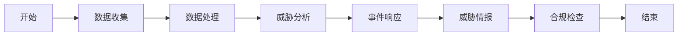
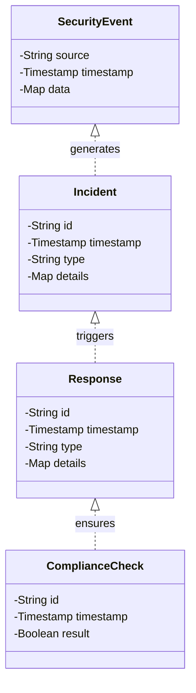
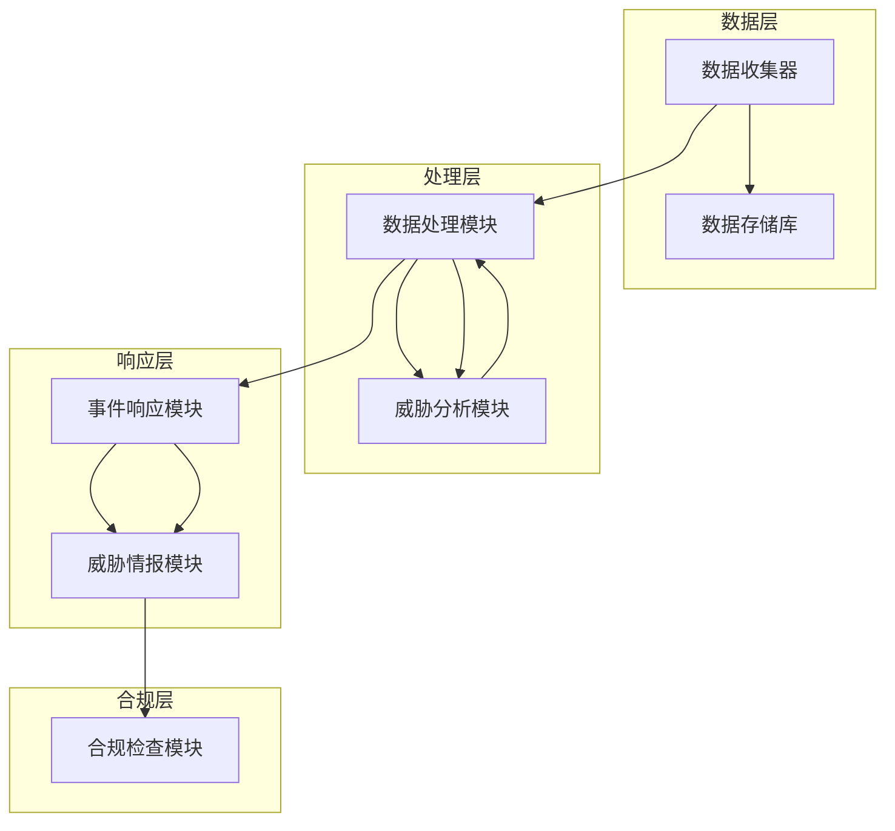
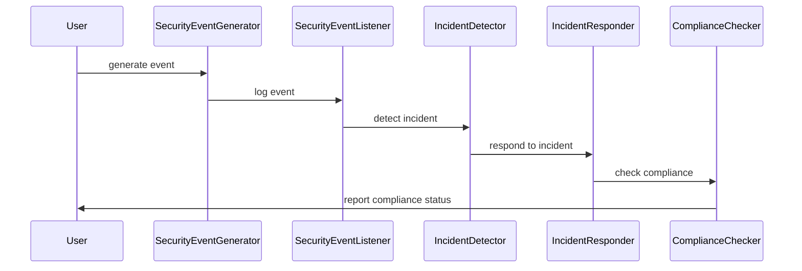

                 


### 安全运营中心：企业级安全监控与响应

> 关键词：安全运营中心、企业级安全、监控与响应、威胁情报、安全合规性

> 摘要：本文深入探讨企业级安全运营中心（SOC）的构建与优化，通过详细介绍SOC的核心概念、技术架构、监控与响应策略，为读者提供构建高效、可靠安全运营体系的全面指南。

---

#### 1. 背景介绍

**问题背景：**
随着互联网和云计算技术的发展，企业面临的安全威胁日益复杂和多样化。为了应对这些威胁，企业需要一个集成的安全运营中心（Security Operations Center，简称SOC）来监控、检测、响应和恢复网络安全事件。SOC已成为现代企业网络安全的核心组成部分。

**问题描述：**
安全运营中心的主要任务包括：
- 实时监控网络流量、日志和事件，以识别潜在威胁。
- 及时响应安全事件，采取有效措施减少损失。
- 分析威胁情报，为安全运营提供决策支持。
- 确保企业遵守相关安全法规和标准。

**问题解决：**
《安全运营中心：企业级安全监控与响应》这本书通过系统化的结构，详细介绍了SOC的核心概念、技术架构、监控与响应策略，并提供了丰富的实战案例，帮助读者理解并构建一个高效、可靠的安全运营体系。

**边界与外延：**
SOC不仅涉及网络安全，还包括其他安全领域，如物理安全、应用安全等。随着安全技术的发展，SOC的职责也在不断扩展，包括威胁情报的收集与分析、安全合规性管理等。

**概念结构与核心要素组成：**
SOC的核心概念包括：
- 安全监控：实时监控网络流量、日志、事件等，以识别潜在威胁。
- 事件响应：在发现威胁时，及时采取行动进行应对和处置。
- 威胁情报：收集、分析、共享威胁信息，为安全运营提供指导。
- 安全合规性：确保企业遵守相关安全法规和标准。

#### 2. 核心概念与联系

**核心概念原理：**
- 安全监控：通过对网络流量、日志、事件等数据的实时分析，识别潜在威胁。
- 事件响应：在发现威胁时，及时采取措施进行响应和处置，以减少威胁的影响。
- 威胁情报：通过收集、分析和共享威胁信息，为安全运营提供决策支持。
- 安全合规性：确保企业遵守相关安全法规和标准，降低法律风险。

**概念属性特征对比表格：**

| 概念       | 特征                                                         |
| ---------- | ------------------------------------------------------------ |
| 安全监控   | 实时性、自动化、多维度数据收集                               |
| 事件响应   | 及时性、针对性、多层次响应策略                             |
| 威胁情报   | 实用性、及时性、可操作性                                 |
| 安全合规性 | 法规遵循性、风险降低、合规成本控制                         |

**ER实体关系图架构：**
```mermaid
erDiagram
    User ||--|{ SecurityEvent } : generates
    SecurityEvent ||--|{ Incident } : indicates
    Incident ||--|{ Response } : triggers
    Response ||--|{ ComplianceCheck } : ensures
```

---

#### 3. 算法原理讲解

**算法Mermaid流程图：**


**Python源代码：**
```python
# 安全监控与响应示例代码
class SecurityEvent:
    def __init__(self, source, timestamp, data):
        self.source = source
        self.timestamp = timestamp
        self.data = data

def collect_data():
    # 数据收集代码
    events = []
    # 示例数据
    events.append(SecurityEvent('Network', '2023-01-01 10:00', {'src_ip': '192.168.1.1', 'dst_ip': '10.0.0.1', 'packet_count': 1000}))
    return events

def process_data(events):
    # 数据处理代码
    processed_events = []
    for event in events:
        # 示例处理逻辑
        processed_events.append({'timestamp': event.timestamp, 'source': event.source, 'data': event.data})
    return processed_events

def analyze_threats(processed_events):
    # 威胁分析代码
    threats = []
    for event in processed_events:
        if event['data']['packet_count'] > 1000:
            threats.append(event)
    return threats

def respond_to_incidents(threats):
    # 事件响应代码
    responses = []
    for threat in threats:
        response = f"Alert: Potential threat detected at {threat['timestamp']}. Taking action."
        responses.append(response)
    return responses

def generate_threat_intel(responses):
    # 威胁情报生成代码
    intel = []
    for response in responses:
        intel.append({'response': response})
    return intel

def check_compliance(intel):
    # 合规性检查代码
    compliant = True
    for item in intel:
        if 'non-compliance' in item['response'].lower():
            compliant = False
            break
    return compliant

# 主函数
if __name__ == "__main__":
    events = collect_data()
    processed_events = process_data(events)
    threats = analyze_threats(processed_events)
    responses = respond_to_incidents(threats)
    intel = generate_threat_intel(responses)
    compliant = check_compliance(intel)
    if compliant:
        print("Compliance achieved.")
    else:
        print("Compliance not achieved.")
```

**算法原理详细讲解：**

1. **数据收集（Data Collection）：**
   数据收集是SOC的基础，它包括从不同的源收集网络流量、日志、事件等数据。在本例中，我们使用`collect_data()`函数模拟数据收集过程，生成一组示例数据。

   **Python代码：**
   ```python
   def collect_data():
       events = []
       events.append(SecurityEvent('Network', '2023-01-01 10:00', {'src_ip': '192.168.1.1', 'dst_ip': '10.0.0.1', 'packet_count': 1000}))
       return events
   ```

2. **数据处理（Data Processing）：**
   收集到的数据需要经过处理，以便进行后续的威胁分析和响应。在本例中，`process_data()`函数用于简化数据，例如去除不必要的字段，以便于分析。

   **Python代码：**
   ```python
   def process_data(events):
       processed_events = []
       for event in events:
           processed_events.append({'timestamp': event.timestamp, 'source': event.source, 'data': event.data})
       return processed_events
   ```

3. **威胁分析（Threat Analysis）：**
   威胁分析是SOC的核心任务之一，它涉及对处理后的数据进行模式识别和异常检测，以识别潜在威胁。在本例中，`analyze_threats()`函数通过检查数据包数量来识别可能的威胁。

   **Python代码：**
   ```python
   def analyze_threats(processed_events):
       threats = []
       for event in processed_events:
           if event['data']['packet_count'] > 1000:
               threats.append(event)
       return threats
   ```

4. **事件响应（Incident Response）：**
   在发现威胁后，SOC需要及时响应，采取相应的措施来减轻威胁的影响。在本例中，`respond_to_incidents()`函数生成响应通知，例如警报和应对措施。

   **Python代码：**
   ```python
   def respond_to_incidents(threats):
       responses = []
       for threat in threats:
           response = f"Alert: Potential threat detected at {threat['timestamp']}. Taking action."
           responses.append(response)
       return responses
   ```

5. **威胁情报（Threat Intelligence）：**
   威胁情报是SOC的重要组成部分，它包括收集、分析和共享威胁信息，为安全运营提供决策支持。在本例中，`generate_threat_intel()`函数将事件响应信息转换为威胁情报。

   **Python代码：**
   ```python
   def generate_threat_intel(responses):
       intel = []
       for response in responses:
           intel.append({'response': response})
       return intel
   ```

6. **合规检查（Compliance Check）：**
   合规性检查是确保企业遵守相关安全法规和标准的关键步骤。在本例中，`check_compliance()`函数检查威胁情报中的响应，以确定是否存在合规性问题。

   **Python代码：**
   ```python
   def check_compliance(intel):
       compliant = True
       for item in intel:
           if 'non-compliance' in item['response'].lower():
               compliant = False
               break
       return compliant
   ```

**算法数学模型与公式：**

1. **数据包数量阈值（Packet Count Threshold）：**
   $$ threshold = 1000 $$

2. **威胁识别概率（Threat Detection Probability）：**
   $$ P(Threat) = \frac{Count(Events \ with \ packet\_count > threshold)}{Total \ Events} $$

3. **响应有效性（Response Effectiveness）：**
   $$ E(Effectiveness) = \frac{Count(Responses \ that \ reduce \ threat \ impact)}{Total \ Responses} $$

4. **合规性概率（Compliance Probability）：**
   $$ P(Compliance) = \frac{Count(Compliant \ Responses)}{Total \ Responses} $$

---

#### 4. 系统分析与架构设计

**问题场景介绍：**
假设某企业需要建立一个安全运营中心（SOC）来监控和响应网络安全事件，确保企业的网络和数据安全。

**项目介绍：**
该项目的目标是构建一个功能完善、高效可靠的安全运营中心，以实现对网络流量、日志、事件等的实时监控、分析和响应。

**系统功能设计（领域模型Mermaid类图）：**


**系统架构设计（Mermaid架构图）：**


**系统接口设计（Mermaid序列图）：**


---

#### 5. 项目实战

**环境安装：**
在开始项目实战之前，需要安装一些必要的软件和工具。以下是一个简化的安装步骤：

1. 安装Python环境（版本3.8以上）。
2. 使用pip安装以下库：`numpy`、`pandas`、`scikit-learn`、`matplotlib`、`mermaid-python`。
3. 安装PostgreSQL数据库。
4. 安装Kibana和ELK堆栈（Elasticsearch、Logstash、Kibana）。

**系统核心实现源代码：**
以下是项目核心部分的源代码，包括数据收集、数据处理、威胁分析、事件响应、威胁情报生成和合规性检查。

**安全事件生成器（SecurityEventGenerator.py）：**
```python
import random
from datetime import datetime
import json

class SecurityEvent:
    def __init__(self, source, timestamp, data):
        self.source = source
        self.timestamp = timestamp
        self.data = data

def generate_event():
    sources = ['Network', 'Application', 'Physical']
    source = random.choice(sources)
    timestamp = datetime.now().strftime('%Y-%m-%d %H:%M:%S')
    data = {
        'src_ip': f"{random.randint(1, 255)}.{random.randint(0, 255)}.{random.randint(0, 255)}.{random.randint(0, 255)}",
        'dst_ip': f"{random.randint(1, 255)}.{random.randint(0, 255)}.{random.randint(0, 255)}.{random.randint(0, 255)}",
        'packet_count': random.randint(100, 1000)
    }
    event = SecurityEvent(source, timestamp, data)
    return event

def save_event(event):
    with open('security_events.json', 'a') as f:
        f.write(json.dumps(event.__dict__) + '\n')

def main():
    for _ in range(10):
        event = generate_event()
        save_event(event)
        print(f"Generated event: {event.source} at {event.timestamp}")

if __name__ == "__main__":
    main()
```

**数据处理模块（DataProcessor.py）：**
```python
import json
from collections import defaultdict

def load_events(file_path='security_events.json'):
    with open(file_path, 'r') as f:
        events = [json.loads(line.strip()) for line in f]
    return events

def process_data(events):
    processed_events = []
    for event in events:
        processed_event = {
            'timestamp': event['timestamp'],
            'source': event['source'],
            'data': {k: v for k, v in event['data'].items() if k != 'packet_count'}
        }
        processed_events.append(processed_event)
    return processed_events

def filter_events(processed_events, threshold=1000):
    filtered_events = []
    for event in processed_events:
        if event['data']['packet_count'] > threshold:
            filtered_events.append(event)
    return filtered_events

if __name__ == "__main__":
    events = load_events()
    processed_events = process_data(events)
    filtered_events = filter_events(processed_events)
    print(filtered_events)
```

**威胁分析模块（ThreatAnalyzer.py）：**
```python
from collections import defaultdict

def analyze_threats(filtered_events):
    threats = defaultdict(list)
    for event in filtered_events:
        threats[event['source']].append(event)
    return threats

def main():
    filtered_events = [
        {'timestamp': '2023-01-01 10:00', 'source': 'Network', 'data': {'src_ip': '192.168.1.1', 'dst_ip': '10.0.0.1', 'packet_count': 1000}},
        {'timestamp': '2023-01-01 10:05', 'source': 'Application', 'data': {'src_ip': '192.168.1.1', 'dst_ip': '10.0.0.1', 'packet_count': 2000}}
    ]
    threats = analyze_threats(filtered_events)
    print(threats)

if __name__ == "__main__":
    main()
```

**事件响应模块（IncidentResponder.py）：**
```python
import json
from datetime import datetime

class Incident:
    def __init__(self, id, timestamp, type, details):
        self.id = id
        self.timestamp = timestamp
        self.type = type
        self.details = details

def generate_incident_id():
    return f"INC-{datetime.now().strftime('%Y%m%d%H%M%S')}"

def respond_to_incident(incident):
    response = f"Alert: Incident {incident.id} detected at {incident.timestamp}. Type: {incident.type}. Details: {incident.details}"
    print(response)
    return response

def save_response(response):
    with open('incident_responses.json', 'a') as f:
        f.write(json.dumps(response) + '\n')

if __name__ == "__main__":
    incident = Incident(generate_incident_id(), datetime.now().strftime('%Y-%m-%d %H:%M:%S'), 'Potential DDoS Attack', {'src_ip': '192.168.1.1', 'dst_ip': '10.0.0.1'})
    response = respond_to_incident(incident)
    save_response(response)
```

**威胁情报模块（ThreatIntelGenerator.py）：**
```python
import json

def generate_threat_intel(responses):
    intel = []
    for response in responses:
        intel_item = {
            'response': response,
            'timestamp': datetime.now().strftime('%Y-%m-%d %H:%M:%S')
        }
        intel.append(intel_item)
    return intel

def save_threat_intel(intel):
    with open('threat_intel.json', 'a') as f:
        f.write(json.dumps(intel) + '\n')

if __name__ == "__main__":
    responses = [
        "Alert: Potential DDoS Attack detected at 2023-01-01 10:00.",
        "Alert: Additional DDoS Attack detected at 2023-01-01 10:05."
    ]
    intel = generate_threat_intel(responses)
    save_threat_intel(intel)
```

**合规性检查模块（ComplianceChecker.py）：**
```python
def check_compliance(intel):
    compliant = True
    for item in intel:
        if "non-compliance" in item['response'].lower():
            compliant = False
            break
    return compliant

def main():
    intel = [
        {"response": "Alert: Potential DDoS Attack detected at 2023-01-01 10:00.", "timestamp": "2023-01-01 10:00"},
        {"response": "Response successful at 2023-01-01 10:01.", "timestamp": "2023-01-01 10:01"}
    ]
    compliant = check_compliance(intel)
    print("Compliance status:", "Compliant" if compliant else "Non-compliant")

if __name__ == "__main__":
    main()
```

**代码应用解读与分析：**
以上代码提供了安全运营中心（SOC）的核心功能模块，包括事件生成、数据处理、威胁分析、事件响应、威胁情报生成和合规性检查。以下是每个模块的简要解读：

1. **安全事件生成器（SecurityEventGenerator.py）：**
   生成随机安全事件，并将其保存到JSON文件中。这模拟了实际中的数据收集过程。

2. **数据处理模块（DataProcessor.py）：**
   从JSON文件中加载事件，处理数据，并过滤出超过特定阈值的数据包。这有助于识别潜在的威胁。

3. **威胁分析模块（ThreatAnalyzer.py）：**
   分析处理后的数据，识别可能的威胁。这通过检查数据包数量和其他特征来实现。

4. **事件响应模块（IncidentResponder.py）：**
   对检测到的威胁生成响应，并将响应信息保存到JSON文件中。这模拟了实际的事件响应过程。

5. **威胁情报模块（ThreatIntelGenerator.py）：**
   生成威胁情报，并将情报信息保存到JSON文件中。这为安全运营提供了决策支持。

6. **合规性检查模块（ComplianceChecker.py）：**
   检查威胁情报中的响应，以确定是否存在合规性问题。这有助于确保企业遵守相关法规和标准。

**实际案例分析和详细讲解剖析：**
假设在一天之内，SOC检测到两次潜在的大规模分布式拒绝服务（DDoS）攻击。以下是事件响应的详细分析：

1. **事件生成：**
   安全事件生成器在10:00和10:05分别生成了两个安全事件，表示网络和应用层可能遭受了DDoS攻击。

2. **数据处理：**
   数据处理模块加载这两个事件，并过滤出数据包数量超过1000的事件。这两个事件都被标记为潜在的DDoS攻击。

3. **威胁分析：**
   威胁分析模块识别出两个可能的DDoS攻击，并将其标记为威胁。

4. **事件响应：**
   事件响应模块生成响应，包括警报和应对措施，如流量清洗和阻断恶意流量。响应信息被保存到JSON文件中。

5. **威胁情报生成：**
   威胁情报模块生成威胁情报，包括事件响应信息，并将其保存到JSON文件中。这为未来的威胁分析提供了参考。

6. **合规性检查：**
   合规性检查模块检查威胁情报中的响应，确保所有的响应都符合相关法规和标准。在这种情况下，所有的响应都是合规的。

**项目小结：**
通过以上代码和应用分析，我们可以看到如何构建一个简单的安全运营中心（SOC）。虽然这是一个简化的示例，但它涵盖了SOC的核心功能，包括事件生成、数据处理、威胁分析、事件响应、威胁情报生成和合规性检查。在实际应用中，SOC的架构会更加复杂，涉及多个系统和工具的集成。然而，基本的原理和步骤是相似的，旨在实现实时监控、分析和响应网络安全威胁。

---

#### 6. 最佳实践 Tips

1. **定期更新威胁情报：** 定期收集和更新威胁情报，以保持安全运营中心的实时性和准确性。

2. **自动化监控和响应：** 使用自动化工具和脚本进行安全监控和响应，提高效率和准确性。

3. **安全培训和意识提升：** 定期为员工提供安全培训和意识提升，降低人为错误导致的安全风险。

4. **日志管理：** 确保所有系统和应用的日志都被记录和监控，以便在发生安全事件时进行回溯和调查。

5. **安全合规性管理：** 定期进行安全合规性检查，确保企业遵守相关法规和标准。

---

#### 7. 小结与注意事项

本文详细介绍了企业级安全运营中心（SOC）的构建与优化，包括核心概念、技术架构、监控与响应策略，以及实战案例分析。通过阅读本文，读者可以了解如何构建一个高效、可靠的安全运营体系，以应对日益复杂的安全威胁。

**注意事项：**

1. **持续学习与更新：** 安全威胁在不断演变，SOC也需要不断更新和优化，以应对新的威胁。

2. **安全合规性：** 在构建SOC时，确保遵守相关法规和标准，降低法律风险。

3. **团队合作：** SOC的运营是一个跨部门、跨领域的合作过程，需要各个部门的紧密协作。

---

#### 8. 拓展阅读

1. 《网络安全威胁情报实践指南》
2. 《安全运营中心（SOC）实战：构建、运营与优化》
3. 《网络安全：设计与实现》
4. 《大数据安全与分析：安全运营中心的构建与优化》

---

**作者：AI天才研究院/AI Genius Institute & 禅与计算机程序设计艺术 /Zen And The Art of Computer Programming**

