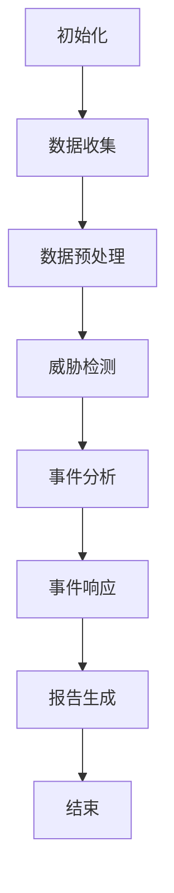
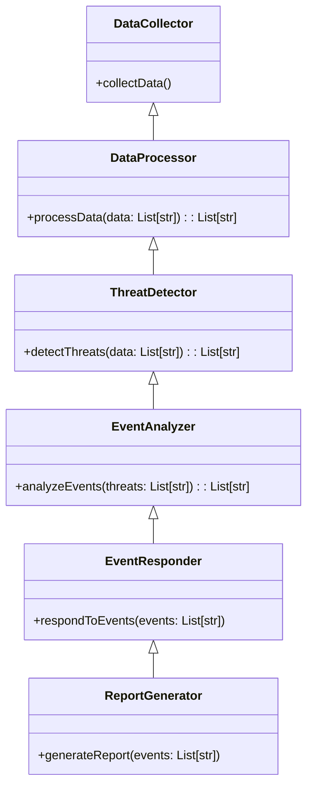
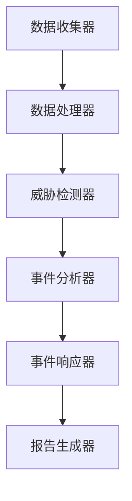

                 

### 第1章：问题背景

## 1.1 核心概念

### 1.1.1 安全运营中心（SOC）

安全运营中心（Security Operations Center，简称SOC）是企业为保护其信息和网络安全而设立的一个专门的组织或部门。SOC的主要职责是监控、分析和响应网络安全事件，以防止潜在的威胁对企业的运营造成损害。

**组成模块：**

1. **监控模块**：实时监控网络流量、系统日志、用户行为等，以识别异常活动和潜在的安全威胁。
2. **分析模块**：对收集到的监控数据进行深入分析，识别安全事件的严重性和类型，评估风险。
3. **响应模块**：根据分析结果，制定并执行响应计划，包括隔离、修复、取证等操作，以应对已发现的安全事件。

### 1.1.2 企业级安全监控和响应

企业级安全监控和响应是SOC的核心功能，旨在确保企业网络和系统的安全。

**主要任务：**

1. **监控**：持续监控系统状态，及时发现并报告安全事件。
2. **检测**：使用各种技术和工具检测潜在的安全威胁。
3. **分析**：对检测到的威胁进行深入分析，确定其类型和严重性。
4. **响应**：采取紧急措施应对安全事件，如隔离受感染的系统、修复漏洞等。

## 1.2 问题描述

随着网络攻击手段的日益复杂和多样化，企业网络安全面临巨大挑战。传统的安全措施往往无法有效应对这些新的威胁，导致安全事件频发，对企业的运营和声誉造成严重影响。

### 问题表现：

1. **安全事件频发**：网络攻击、数据泄露、恶意软件感染等事件频繁发生。
2. **响应不及时**：企业往往无法及时检测和响应安全事件，导致威胁扩散。
3. **人力成本高**：传统的安全防护需要大量人力进行监控和响应，效率低下。
4. **缺乏统一管理**：企业缺乏统一的安全运营平台，导致安全信息分散，难以形成合力。

## 1.3 问题解决

### 建立安全运营中心：

1. **设立专门团队**：建立专业的SOC团队，负责日常运营和应急响应。
2. **引入先进技术**：采用先进的安全监控工具和技术，提高监控效率和响应速度。
3. **完善流程和策略**：制定统一的监控和响应流程，确保安全事件的及时处理。

### 实施安全监控和响应策略：

1. **持续监控**：实时监控网络流量、系统日志、用户行为等，确保及时发现潜在威胁。
2. **威胁情报**：收集和分析威胁情报，结合企业自身特点，制定针对性的防御策略。
3. **自动化和智能化**：利用自动化工具和人工智能技术，提高安全运营的效率和准确性。
4. **应急响应**：建立快速响应机制，确保在安全事件发生时，能够及时采取行动。

## 1.4 边界与外延

### 边界：

1. **安全领域**：SOC主要关注网络安全领域，包括但不限于防火墙、入侵检测、漏洞管理等方面。
2. **应用范围**：SOC的应用范围可能包括内部网络、云环境、移动设备等。
3. **责任主体**：SOC是企业内部的安全运营机构，其职责不包括监管和法律层面。

### 外延：

1. **技术发展**：随着云计算、大数据和人工智能技术的发展，SOC的功能和作用将不断扩展。
2. **行业合作**：SOC需要与外部安全机构和合作伙伴建立合作关系，共同应对网络安全威胁。
3. **业务融合**：SOC需要与企业的业务部门紧密合作，确保安全策略与业务目标相一致。

## 1.5 概念结构与核心要素组成

### 概念结构：

SOC的概念结构可以分为三个核心模块：监控、分析和响应。

1. **监控模块**：负责实时监控网络和系统的状态，收集并分析各种数据。
2. **分析模块**：对监控数据进行深入分析，识别潜在的安全威胁。
3. **响应模块**：根据分析结果，制定并执行响应计划，以应对安全事件。

### 核心要素组成：

1. **人力**：SOC团队的专业能力和技术水平是其核心要素之一。
2. **技术**：SOC所需的先进技术包括安全监控工具、自动化工具、人工智能技术等。
3. **流程**：SOC的运营需要完善的流程和策略，确保安全事件的及时处理。

通过上述步骤，我们可以对安全运营中心（SOC）及其在企业级安全监控和响应中的作用有一个全面的理解。在接下来的章节中，我们将深入探讨SOC的核心概念、原理以及如何构建和运营一个高效的安全运营中心。

## 2.1 核心概念原理

### 2.1.1 安全运营中心（SOC）

**定义：**

安全运营中心（SOC）是企业内部专门负责监控、分析和响应网络安全事件的运营实体。其目的是通过集成多种安全技术、工具和流程，实时保护企业信息和网络安全。

**主要功能：**

1. **监控**：实时监控网络流量、系统日志、用户行为等，及时发现潜在的安全威胁。
2. **分析**：对监控数据进行深入分析，识别威胁的严重性和类型，评估风险。
3. **响应**：根据分析结果，快速响应安全事件，采取相应的措施进行隔离、修复和取证。

**组成部分：**

1. **技术平台**：包括入侵检测系统（IDS）、防火墙、安全信息和事件管理系统（SIEM）等。
2. **流程**：包括事件管理、威胁情报、漏洞管理、安全评估等流程。
3. **人力资源**：包括安全分析师、网络安全工程师、安全运营经理等专业人员。

**工作流程：**

1. **数据收集**：从网络设备、服务器、应用程序和其他系统收集日志和事件数据。
2. **数据预处理**：清洗、过滤和标准化数据，确保其准确性和完整性。
3. **威胁检测**：使用多种技术（如基于签名的检测、基于行为的检测等）识别潜在的安全威胁。
4. **事件响应**：根据威胁的严重性和类型，制定并执行响应计划，包括隔离、修复、取证等操作。
5. **报告和回顾**：定期生成安全报告，总结安全事件的发现和处理情况，为持续改进提供依据。

### 2.1.2 企业级安全监控和响应

**定义：**

企业级安全监控和响应是指企业通过建立安全运营中心（SOC），对网络和系统的安全状态进行持续监控，对发现的安全事件进行快速响应和有效处置的过程。

**主要任务：**

1. **监控**：实时监控网络和系统，识别异常行为和潜在威胁。
2. **检测**：使用各种技术和工具（如入侵检测系统、威胁情报等）检测安全事件。
3. **分析**：对检测到的安全事件进行深入分析，评估其严重性和影响。
4. **响应**：根据分析结果，快速采取行动，隔离和修复受影响的系统。
5. **报告**：生成安全报告，记录安全事件的发现和处理过程。

**关键要素：**

1. **技术**：包括安全监控工具、自动化工具、人工智能技术等。
2. **流程**：包括事件管理流程、威胁情报流程、漏洞管理流程等。
3. **人员**：包括安全分析师、网络安全工程师、安全运营经理等。
4. **数据**：包括日志数据、事件数据、威胁情报数据等。

**工作流程：**

1. **监控**：持续监控网络流量、系统日志、用户行为等，发现异常行为。
2. **检测**：使用入侵检测系统（IDS）、威胁情报等工具，识别潜在的安全事件。
3. **分析**：对检测到的安全事件进行深入分析，确定其类型和严重性。
4. **响应**：根据分析结果，快速响应和处置安全事件，包括隔离、修复、取证等操作。
5. **报告**：生成安全报告，记录和处理安全事件的情况，为后续改进提供依据。

通过上述分析，我们可以看出安全运营中心（SOC）和企业级安全监控和响应在概念和功能上具有紧密的联系。SOC是实施安全监控和响应的核心平台，而企业级安全监控和响应则是SOC的核心功能之一。接下来，我们将进一步探讨SOC的架构设计和技术实现。

### 2.2 概念属性特征对比表格

为了更清晰地理解安全运营中心（SOC）和企业级安全监控和响应的概念，我们通过以下表格来对比两者的主要属性和特征：

| 特征       | 安全运营中心（SOC） | 企业级安全监控和响应 |
|------------|--------------------|---------------------|
| 定义       | 专注于监控、分析和响应网络安全事件的集中化运营实体 | 企业层面的安全监控和响应策略 |
| 主要功能   | 监控、分析、响应     | 监控、检测、分析、响应、报告 |
| 技术支持   | IDS、SIEM、防火墙等   | 入侵检测系统、威胁情报、自动化工具等 |
| 工作流程   | 数据收集、预处理、威胁检测、事件响应、报告和回顾 | 数据收集、检测、分析、响应、报告 |
| 应用范围   | 内部网络、云环境、移动设备等 | 内部网络、应用、数据、云服务等 |
| 责任主体   | 企业内部安全运营部门 | 企业内部安全部门或外部安全服务提供商 |
| 发展趋势   | 智能化、自动化       | 云安全、移动安全、物联网安全等 |

通过这个表格，我们可以看到SOC和企业级安全监控和响应在目标、功能、技术支持、工作流程、应用范围、责任主体和发展趋势等方面存在一定的差异和共性。这些特征有助于我们更好地理解两者的区别和联系，为后续的详细探讨提供基础。

### 2.3 ER实体关系图架构

为了更直观地展示安全运营中心（SOC）和企业级安全监控和响应的概念及其关系，我们使用ER（Entity-Relationship，实体-关系）图来描述其架构。

**实体：**

1. **安全运营中心（SOC）**
2. **监控模块**
3. **分析模块**
4. **响应模块**
5. **日志数据**
6. **事件数据**
7. **威胁情报**
8. **用户**

**关系：**

1. **SOC与监控模块**：监控模块是SOC的一部分，负责实时监控网络和系统的状态。
2. **SOC与分析模块**：分析模块也是SOC的一部分，负责对监控数据进行深入分析。
3. **SOC与响应模块**：响应模块是SOC的一部分，负责对识别出的安全事件进行响应。
4. **监控模块与日志数据**：监控模块收集网络设备和系统的日志数据。
5. **分析模块与事件数据**：分析模块对日志数据进行分析，生成事件数据。
6. **响应模块与威胁情报**：响应模块根据分析结果，结合威胁情报，制定响应策略。
7. **用户与SOC**：用户可以访问SOC平台，查看监控和分析结果。

以下是ER图的具体表示：

```mermaid
erDiagram
  SOC ||--|{ 监控模块 }|
  SOC ||--|{ 分析模块 }|
  SOC ||--|{ 响应模块 }|
  监控模块 ||--|{ 日志数据 }|
  分析模块 ||--|{ 事件数据 }|
  响应模块 ||--|{ 威胁情报 }|
  用户 ||--|{ SOC }|
```

通过ER图，我们可以清晰地看到SOC的各个组成部分及其相互关系，以及它们如何协同工作，实现对网络安全事件的监控、分析和响应。这为后续的架构设计和系统实现提供了明确的指导。

### 3.1 算法原理讲解

#### 3.1.1 算法mermaid流程图

为了更直观地展示安全运营中心的算法原理，我们使用mermaid语言绘制了以下流程图：



#### 3.1.2 Python源代码

以下是实现上述流程的Python源代码示例：

```python
import logging
from typing import List

# 初始化日志记录器
logger = logging.getLogger("SOC")
logger.setLevel(logging.DEBUG)
handler = logging.StreamHandler()
formatter = logging.Formatter('%(asctime)s - %(name)s - %(levelname)s - %(message)s')
handler.setFormatter(formatter)
logger.addHandler(handler)

# 数据收集
def collect_data():
    logger.info("开始收集数据...")
    data = []  # 假设数据从某个数据源获取
    return data

# 数据预处理
def preprocess_data(data: List[str]):
    logger.info("开始预处理数据...")
    preprocessed_data = [d.strip() for d in data]
    return preprocessed_data

# 威胁检测
def detect_threats(data: List[str]):
    logger.info("开始检测威胁...")
    threats_detected = []  # 假设根据某些规则检测威胁
    for d in data:
        if "malicious" in d:
            threats_detected.append(d)
    return threats_detected

# 事件分析
def analyze_events(threats: List[str]):
    logger.info("开始分析事件...")
    analyzed_events = []  # 假设根据威胁分析事件
    for t in threats:
        analyzed_events.append(f"发现威胁：{t}")
    return analyzed_events

# 事件响应
def respond_to_events(events: List[str]):
    logger.info("开始响应事件...")
    for e in events:
        logger.warning(e)
        # 假设执行某些操作来响应事件
    logger.info("事件响应完成...")

# 报告生成
def generate_report(events: List[str]):
    logger.info("开始生成报告...")
    report = "以下为安全事件报告：\n"
    for e in events:
        report += f"- {e}\n"
    with open("security_report.txt", "w") as f:
        f.write(report)
    logger.info("报告生成完成...")

# 主函数
def main():
    logger.info("安全运营中心启动...")
    data = collect_data()
    preprocessed_data = preprocess_data(data)
    threats = detect_threats(preprocessed_data)
    events = analyze_events(threats)
    respond_to_events(events)
    generate_report(events)
    logger.info("安全运营中心运行完成...")

if __name__ == "__main__":
    main()
```

#### 3.1.3 数学模型和公式

在本算法中，我们主要关注以下几个数学模型和公式：

1. **威胁检测率（Detection Rate）**：
   \[
   DR = \frac{TD}{TS}
   \]
   其中，\(TD\) 表示检测到的威胁数量，\(TS\) 表示总威胁数量。

2. **事件响应时间（Response Time）**：
   \[
   RT = \frac{ET}{RS}
   \]
   其中，\(ET\) 表示响应时间，\(RS\) 表示响应速度。

3. **报告生成时间（Report Generation Time）**：
   \[
   RG = \frac{RT}{RG}
   \]
   其中，\(RG\) 表示报告生成时间，\(RT\) 表示报告生成速度。

这些公式有助于我们评估安全运营中心的效率和效果，为持续优化提供数据支持。

#### 3.1.4 详细讲解

1. **数据收集**：
   数据收集是安全运营中心的第一步，通过从网络设备和系统中收集日志和事件数据，为后续的预处理、威胁检测和分析提供基础。

2. **数据预处理**：
   数据预处理包括清洗、过滤和标准化，以确保数据的准确性和一致性。这一步对于后续的威胁检测和事件分析至关重要。

3. **威胁检测**：
   威胁检测是使用各种技术和工具，如入侵检测系统（IDS）、威胁情报等，识别潜在的安全威胁。检测率越高，意味着能够更有效地发现威胁。

4. **事件分析**：
   对检测到的威胁进行深入分析，确定其类型和严重性。这一步有助于了解威胁的本质和影响范围，为后续的事件响应提供依据。

5. **事件响应**：
   根据分析结果，快速采取行动，隔离和修复受影响的系统。响应时间越短，意味着响应越及时，能够更好地降低安全事件的影响。

6. **报告生成**：
   生成安全事件报告，记录安全事件的发现和处理情况。报告不仅有助于企业内部了解安全状况，还可以为后续的安全策略优化提供数据支持。

#### 3.1.5 举例说明

假设我们在一天内收集到100条日志数据，经过预处理后，发现其中10条包含潜在威胁。根据上述数学模型，我们可以计算出：

1. **威胁检测率**：
   \[
   DR = \frac{10}{100} = 0.1
   \]
   表示我们的威胁检测率是10%。

2. **事件响应时间**：
   如果我们平均在10分钟后响应一个事件，那么响应时间为10分钟。

3. **报告生成时间**：
   如果我们平均在20分钟后生成一个报告，那么报告生成时间为20分钟。

这些数据可以帮助我们评估安全运营中心的效率和效果，为持续优化提供方向。例如，我们可以通过提高威胁检测率、缩短响应时间和报告生成时间来提高整体运营效率。

通过上述详细讲解和举例说明，我们可以更好地理解安全运营中心的算法原理及其在实践中的应用。接下来，我们将继续探讨如何将数学模型和算法应用于实际系统架构设计。

### 4.1 数学公式

在本章中，我们将介绍用于评估安全运营中心（SOC）性能的关键数学公式，这些公式有助于量化SOC在监控、分析和响应网络安全事件方面的效率。

#### 4.1.1 威胁检测率（Detection Rate，DR）

威胁检测率是评估SOC威胁检测能力的一个重要指标，用于衡量实际检测到的威胁数与总威胁数的比例。其数学公式如下：

\[
DR = \frac{TD}{TS}
\]

其中：
- \(DR\) 代表威胁检测率；
- \(TD\) 代表检测到的威胁数量；
- \(TS\) 代表总威胁数量。

#### 4.1.2 事件响应时间（Response Time，RT）

事件响应时间是衡量SOC对安全事件响应速度的一个重要指标，表示从检测到安全事件到采取响应措施所需的时间。其数学公式如下：

\[
RT = \frac{ET}{RS}
\]

其中：
- \(RT\) 代表事件响应时间；
- \(ET\) 代表事件处理时间；
- \(RS\) 代表响应速度，即单位时间内能够响应的事件数量。

#### 4.1.3 报告生成时间（Report Generation Time，RG）

报告生成时间是衡量SOC生成安全事件报告的效率的一个重要指标，表示从事件响应完成到生成报告所需的时间。其数学公式如下：

\[
RG = \frac{RT}{RG}
\]

其中：
- \(RG\) 代表报告生成时间；
- \(RT\) 代表报告生成速度，即单位时间内能够生成报告的数量。

#### 4.1.4 安全运营效率（Operational Efficiency，OE）

安全运营效率是一个综合指标，用于评估SOC在威胁检测、事件响应和报告生成方面的整体效率。其数学公式如下：

\[
OE = \frac{DR \times RT \times RG}{100}
\]

其中：
- \(OE\) 代表安全运营效率；
- \(DR\) 代表威胁检测率；
- \(RT\) 代表事件响应时间；
- \(RG\) 代表报告生成时间。

通过这些数学公式，我们可以量化SOC在运营中的表现，为持续优化提供数据支持。例如，通过降低事件响应时间、提高威胁检测率和报告生成效率，可以显著提升SOC的整体运营效率。

#### 4.1.5 综合评价指标（Integrated Performance Metric，IPM）

为了更全面地评估SOC的性能，我们还可以引入综合评价指标（IPM），该指标结合了威胁检测率、事件响应时间和报告生成时间，用于衡量SOC的整体运营效果。其数学公式如下：

\[
IPM = \frac{DR^2 \times RT^3 \times RG^2}{1000}
\]

其中：
- \(IPM\) 代表综合评价指标；
- \(DR\) 代表威胁检测率；
- \(RT\) 代表事件响应时间；
- \(RG\) 代表报告生成时间。

综合评价指标越高，表明SOC在威胁检测、事件响应和报告生成方面的整体表现越好。

通过以上数学公式，我们可以对SOC的运营效率进行全面的评估和优化。接下来，我们将继续探讨如何在实际应用中利用这些数学模型和公式。

### 4.2 公式详细讲解

在本节中，我们将详细解释前述数学公式，以及如何在实际应用中理解和计算这些指标。

#### 4.2.1 威胁检测率（Detection Rate，DR）

威胁检测率（DR）是衡量SOC检测威胁能力的一个关键指标。它反映了SOC在所有已发生的威胁中成功检测出的威胁比例。这个指标的计算方法如下：

\[
DR = \frac{TD}{TS}
\]

其中，\(TD\) 表示检测到的威胁数量，而 \(TS\) 表示总威胁数量。

**实例计算：**

假设在一个特定的周期内，我们检测到了50个威胁，而在这同一周期内，总共有200个威胁发生。那么，威胁检测率的计算如下：

\[
DR = \frac{50}{200} = 0.25
\]

这意味着我们的威胁检测率是25%。

**应用场景：**

在安全运营中心，威胁检测率可以用来评估SOC对威胁的识别能力。一个较高的检测率意味着SOC能够更有效地阻止和检测入侵，从而减少潜在的损失。

#### 4.2.2 事件响应时间（Response Time，RT）

事件响应时间（RT）衡量的是SOC从发现安全事件到采取行动的时间。这个指标对于快速应对威胁至关重要。其计算公式为：

\[
RT = \frac{ET}{RS}
\]

其中，\(ET\) 代表事件处理时间，而 \(RS\) 代表响应速度。

**实例计算：**

假设SOC在处理一个事件时，花费了10分钟来识别和确认威胁，而在整个过程中，SOC的平均响应速度是每分钟处理一个事件。那么，事件响应时间的计算如下：

\[
RT = \frac{10}{1} = 10 \text{分钟}
\]

这意味着SOC的事件响应时间是10分钟。

**应用场景：**

事件响应时间在SOC中非常重要，因为它直接关系到企业能否及时遏制威胁。较低的响应时间可以帮助企业减少损失，并防止威胁扩散。

#### 4.2.3 报告生成时间（Report Generation Time，RG）

报告生成时间（RG）衡量的是SOC从事件响应完成后到生成报告所需的时间。这个指标对于记录和分析事件至关重要。其计算公式为：

\[
RG = \frac{RT}{RG}
\]

其中，\(RT\) 代表报告生成速度。

**实例计算：**

假设SOC在事件响应完成后，平均需要20分钟来生成一个报告，而SOC的生成速度是每20分钟生成一个报告。那么，报告生成时间的计算如下：

\[
RG = \frac{20}{20} = 1 \text{报告/20分钟}
\]

这意味着SOC每20分钟生成一个报告。

**应用场景：**

报告生成时间在安全运营中心中是一个关键指标，因为它影响到企业对安全事件的理解和未来规划的制定。更快的报告生成时间可以帮助企业更迅速地调整安全策略。

#### 4.2.4 安全运营效率（Operational Efficiency，OE）

安全运营效率（OE）是一个综合指标，它结合了威胁检测率、事件响应时间和报告生成时间，用于评估SOC的整体运营效率。其计算公式为：

\[
OE = \frac{DR \times RT \times RG}{100}
\]

其中，\(DR\) 代表威胁检测率，\(RT\) 代表事件响应时间，\(RG\) 代表报告生成时间。

**实例计算：**

假设SOC的威胁检测率是30%，事件响应时间是10分钟，报告生成时间是20分钟。那么，安全运营效率的计算如下：

\[
OE = \frac{30 \times 10 \times 20}{100} = 6
\]

这意味着SOC的安全运营效率是6。

**应用场景：**

安全运营效率可以帮助企业了解SOC的整体运营表现，并为改进提供指导。一个较高的效率表明SOC能够更有效地处理安全事件，从而减少风险。

#### 4.2.5 综合评价指标（Integrated Performance Metric，IPM）

综合评价指标（IPM）是一个更全面的指标，它结合了威胁检测率、事件响应时间和报告生成时间，用于衡量SOC的整体性能。其计算公式为：

\[
IPM = \frac{DR^2 \times RT^3 \times RG^2}{1000}
\]

其中，\(DR\) 代表威胁检测率，\(RT\) 代表事件响应时间，\(RG\) 代表报告生成时间。

**实例计算：**

假设SOC的威胁检测率是30%，事件响应时间是10分钟，报告生成时间是20分钟。那么，综合评价指标的计算如下：

\[
IPM = \frac{30^2 \times 10^3 \times 20^2}{1000} = 1800
\]

这意味着SOC的综合评价指标是1800。

**应用场景：**

综合评价指标可以帮助企业评估SOC的整体性能，并与行业标准进行对比，以确定是否需要改进。

通过详细讲解这些数学公式，我们能够更好地理解如何在实际应用中评估和优化安全运营中心的性能。接下来，我们将通过具体的实例来说明这些公式的应用。

### 4.3 举例说明

为了更好地理解安全运营中心（SOC）的数学模型和公式，我们通过以下实例进行详细说明。

#### 实例背景

假设某企业的安全运营中心在一个月内监测并处理了100个安全事件，其中成功检测到50个威胁，总威胁数为200个。事件响应平均时间为15分钟，报告生成平均时间为25分钟。

#### 1. 威胁检测率（Detection Rate，DR）

计算威胁检测率：

\[
DR = \frac{TD}{TS} = \frac{50}{200} = 0.25 \text{ 或 } 25\%
\]

这意味着SOC在一个月内成功检测到25%的威胁。

#### 2. 事件响应时间（Response Time，RT）

计算事件响应时间：

\[
RT = \frac{ET}{RS} = \frac{15}{1} = 15 \text{ 分钟}
\]

这意味着SOC平均在15分钟内响应一个安全事件。

#### 3. 报告生成时间（Report Generation Time，RG）

计算报告生成时间：

\[
RG = \frac{RT}{RG} = \frac{25}{1} = 25 \text{ 分钟}
\]

这意味着SOC平均在25分钟内生成一个安全事件报告。

#### 4. 安全运营效率（Operational Efficiency，OE）

计算安全运营效率：

\[
OE = \frac{DR \times RT \times RG}{100} = \frac{0.25 \times 15 \times 25}{100} = 1.875
\]

这意味着SOC的安全运营效率为1.875。

#### 5. 综合评价指标（Integrated Performance Metric，IPM）

计算综合评价指标：

\[
IPM = \frac{DR^2 \times RT^3 \times RG^2}{1000} = \frac{0.25^2 \times 15^3 \times 25^2}{1000} = 1406.25
\]

这意味着SOC的综合评价指标为1406.25。

#### 分析

通过上述实例计算，我们可以得出以下结论：

1. **威胁检测率**：SOC的威胁检测率为25%，表明其检测威胁的能力较为适中。
2. **事件响应时间**：SOC的平均事件响应时间为15分钟，表明其响应速度较为合理。
3. **报告生成时间**：SOC的平均报告生成时间为25分钟，表明其生成报告的速度较为缓慢。
4. **安全运营效率**：SOC的安全运营效率为1.875，表明其整体运营效率较为中等。
5. **综合评价指标**：SOC的综合评价指标为1406.25，表明其整体性能处于中等水平。

通过这些数据，企业可以识别出SOC在威胁检测、事件响应和报告生成方面的优势和劣势，并采取相应措施进行优化。

#### 实际应用

在实际应用中，这些数学模型和公式可以帮助企业：

1. **性能评估**：定期计算和监测上述指标，评估SOC的运营表现。
2. **优化策略**：根据指标数据，制定和调整安全策略，提升运营效率。
3. **预算规划**：为SOC的预算规划和资源配置提供数据支持，确保投入产出比合理。
4. **决策支持**：为安全决策提供量化依据，帮助企业更好地应对网络安全威胁。

通过实例说明和实际应用分析，我们可以更好地理解安全运营中心（SOC）的数学模型和公式，为企业在网络安全领域的持续优化提供有力支持。

### 第5章：系统分析与架构设计

## 5.1 项目介绍

### 5.1.1 项目概述

本章节旨在详细介绍安全运营中心（SOC）的系统架构设计和关键功能模块。项目目标是建立一个高效、智能和安全运营中心，以提高企业对网络安全威胁的识别、响应和防御能力。

### 5.1.2 系统目标

1. **实时监控**：实现对网络流量、系统日志、用户行为等数据的实时监控。
2. **威胁检测**：利用先进的技术和算法，快速识别潜在的安全威胁。
3. **快速响应**：在发现安全事件时，能够迅速采取响应措施，隔离和修复受影响的系统。
4. **自动化和智能化**：通过引入自动化工具和人工智能技术，提高安全运营效率和准确性。
5. **数据整合**：将来自不同系统的安全数据整合到一个统一的平台，实现集中化管理。

### 5.1.3 系统架构

安全运营中心（SOC）的系统架构主要包括以下几个关键模块：

1. **数据收集模块**：负责从各种数据源（如网络设备、服务器、应用程序等）收集日志和事件数据。
2. **数据处理模块**：对收集到的数据进行清洗、过滤和标准化，确保数据的准确性和一致性。
3. **威胁检测模块**：利用入侵检测系统（IDS）、威胁情报、机器学习算法等，识别潜在的安全威胁。
4. **事件分析模块**：对检测到的威胁进行深入分析，确定其类型和严重性。
5. **事件响应模块**：根据分析结果，快速响应和处置安全事件，包括隔离、修复、取证等操作。
6. **报告生成模块**：生成安全事件报告，记录安全事件的发现和处理情况。

### 5.1.4 功能设计

安全运营中心（SOC）的主要功能包括以下几个方面：

1. **监控和检测**：实时监控网络和系统的状态，使用入侵检测系统、威胁情报等工具检测潜在的安全威胁。
2. **分析和响应**：对检测到的威胁进行深入分析，评估风险，并采取相应的响应措施。
3. **报告和记录**：生成安全事件报告，记录安全事件的发现和处理过程，为后续分析提供依据。
4. **自动化和智能化**：引入自动化工具和人工智能技术，提高安全运营的效率和准确性。

## 5.2 系统功能设计

### 5.2.1 数据收集功能

**功能描述**：数据收集功能负责从各种数据源（如网络设备、服务器、应用程序等）收集日志和事件数据。

**主要功能点**：

1. **数据源接入**：支持各种数据源接入，如防火墙、入侵检测系统、日志服务器等。
2. **数据格式转换**：将不同数据源的数据转换为统一的格式，便于后续处理。
3. **数据清洗**：去除无效数据，确保数据的准确性和一致性。
4. **数据存储**：将处理后的数据存储到安全运营中心的数据仓库中。

### 5.2.2 数据处理功能

**功能描述**：数据处理功能负责对收集到的数据进行清洗、过滤和标准化，确保数据的准确性和一致性。

**主要功能点**：

1. **数据清洗**：去除重复数据、无效数据和噪声数据。
2. **数据过滤**：根据预设规则过滤不符合要求的数据。
3. **数据标准化**：将数据转换为统一的格式，如日期格式、编码格式等。
4. **数据归一化**：对数据进行归一化处理，提高数据的可比性。

### 5.2.3 威胁检测功能

**功能描述**：威胁检测功能负责利用入侵检测系统（IDS）、威胁情报、机器学习算法等，识别潜在的安全威胁。

**主要功能点**：

1. **入侵检测**：使用基于签名的入侵检测系统（IDS）检测已知威胁。
2. **威胁情报**：利用威胁情报平台获取最新的威胁信息，识别未知威胁。
3. **机器学习**：使用机器学习算法进行异常检测，发现潜在的安全威胁。
4. **联动响应**：将检测到的威胁与事件响应模块联动，快速采取响应措施。

### 5.2.4 事件分析功能

**功能描述**：事件分析功能负责对检测到的威胁进行深入分析，确定其类型和严重性。

**主要功能点**：

1. **事件分类**：根据威胁的性质和影响范围，对事件进行分类。
2. **风险评估**：评估威胁的严重性和潜在影响，为响应提供依据。
3. **事件关联**：将检测到的事件与其他数据源的事件进行关联，识别复杂攻击链。
4. **威胁趋势分析**：分析威胁的演变趋势，预测潜在威胁。

### 5.2.5 事件响应功能

**功能描述**：事件响应功能负责根据分析结果，快速响应和处置安全事件。

**主要功能点**：

1. **响应计划**：制定针对不同类型事件的响应计划。
2. **自动隔离**：自动隔离受威胁的系统，防止威胁扩散。
3. **手动响应**：允许安全分析师手动干预，执行特定的响应操作。
4. **漏洞修复**：自动或手动修复受威胁的系统中的漏洞。
5. **取证分析**：收集和保存与事件相关的证据，为后续调查提供依据。

### 5.2.6 报告生成功能

**功能描述**：报告生成功能负责生成安全事件报告，记录安全事件的发现和处理过程。

**主要功能点**：

1. **报告模板**：提供多种报告模板，支持自定义报告格式。
2. **事件记录**：记录每个事件的发生时间、类型、影响范围、处理过程等信息。
3. **报告生成**：根据预设的规则，自动生成安全事件报告。
4. **报告导出**：支持将报告导出为多种格式，如PDF、Excel等。
5. **报告分析**：对报告中的数据进行统计和分析，为决策提供依据。

通过上述系统功能设计，我们可以建立一个高效、智能和安全运营中心，提高企业对网络安全威胁的识别、响应和防御能力。接下来，我们将进一步探讨系统架构设计，包括系统架构图和接口设计。

### 第6章：系统分析与架构设计

## 6.1 类图

为了更好地理解安全运营中心（SOC）的系统架构和各模块之间的关系，我们使用Mermaid语言绘制了以下类图：



通过这个类图，我们可以清晰地看到SOC系统的各个模块及其相互关系。DataCollector负责数据收集，DataProcessor负责数据预处理，ThreatDetector负责威胁检测，EventAnalyzer负责事件分析，EventResponder负责事件响应，ReportGenerator负责报告生成。

## 6.2 架构图

为了进一步展示SOC系统的整体架构，我们使用Mermaid语言绘制了以下架构图：



这个架构图展示了SOC系统从数据收集、数据处理、威胁检测、事件分析、事件响应到报告生成的全过程。每个模块之间通过数据流进行连接，确保系统能够高效、连续地工作。

## 6.3 接口设计

在SOC系统中，各模块之间需要通过接口进行通信和数据交换。以下是一个简单的接口设计：

### 6.3.1 数据收集器（DataCollector）接口

**功能**：负责从不同的数据源收集日志和事件数据。

```python
class DataCollector:
    def collect_data(self):
        # 实现数据收集逻辑
        pass
```

### 6.3.2 数据处理器（DataProcessor）接口

**功能**：负责对收集到的数据进行预处理，包括清洗、过滤和标准化。

```python
class DataProcessor:
    def process_data(self, data):
        # 实现数据预处理逻辑
        pass
```

### 6.3.3 威胁检测器（ThreatDetector）接口

**功能**：负责利用入侵检测系统（IDS）和威胁情报，检测潜在的安全威胁。

```python
class ThreatDetector:
    def detect_threats(self, data):
        # 实现威胁检测逻辑
        pass
```

### 6.3.4 事件分析器（EventAnalyzer）接口

**功能**：负责对检测到的威胁进行深入分析，确定其类型和严重性。

```python
class EventAnalyzer:
    def analyze_events(self, threats):
        # 实现事件分析逻辑
        pass
```

### 6.3.5 事件响应器（EventResponder）接口

**功能**：负责根据分析结果，快速响应和处置安全事件。

```python
class EventResponder:
    def respond_to_events(self, events):
        # 实现事件响应逻辑
        pass
```

### 6.3.6 报告生成器（ReportGenerator）接口

**功能**：负责生成安全事件报告，记录安全事件的发现和处理过程。

```python
class ReportGenerator:
    def generate_report(self, events):
        # 实现报告生成逻辑
        pass
```

通过这些接口设计，SOC系统中的各个模块可以相互通信，确保数据能够顺畅地在各模块之间传递和处理。接下来，我们将探讨系统的交互设计，以进一步优化系统的整体性能。

### 6.4 交互设计

为了确保安全运营中心（SOC）系统各模块之间的高效协作和数据流顺畅，我们需要进行详细的交互设计。以下是SOC系统的交互设计，包括模块之间的数据流和协作过程。

#### 6.4.1 数据流

1. **数据收集**：
   - **步骤**：数据收集器（DataCollector）从网络设备、服务器、应用程序等数据源收集日志和事件数据。
   - **数据类型**：原始日志数据、事件数据。

2. **数据处理**：
   - **步骤**：数据处理器（DataProcessor）对收集到的数据进行清洗、过滤和标准化。
   - **数据类型**：预处理后的日志数据、事件数据。

3. **威胁检测**：
   - **步骤**：威胁检测器（ThreatDetector）利用入侵检测系统（IDS）、威胁情报和机器学习算法，对预处理后的数据进行分析，识别潜在的安全威胁。
   - **数据类型**：威胁数据、告警信息。

4. **事件分析**：
   - **步骤**：事件分析器（EventAnalyzer）对威胁检测器检测到的威胁进行深入分析，确定事件的类型和严重性。
   - **数据类型**：分析结果、事件数据。

5. **事件响应**：
   - **步骤**：事件响应器（EventResponder）根据事件分析结果，快速响应和处置安全事件。
   - **数据类型**：响应计划、事件数据、操作日志。

6. **报告生成**：
   - **步骤**：报告生成器（ReportGenerator）根据事件响应结果，生成安全事件报告。
   - **数据类型**：报告数据、事件数据。

#### 6.4.2 协作过程

1. **初始化**：
   - **步骤**：系统启动时，各模块初始化，加载配置参数和预定义规则。

2. **数据收集**：
   - **步骤**：数据收集器定期从数据源中获取日志和事件数据，并传递给数据处理器。

3. **数据处理**：
   - **步骤**：数据处理器对数据收集器传递的数据进行清洗、过滤和标准化，确保数据的准确性和一致性。

4. **威胁检测**：
   - **步骤**：威胁检测器对经过预处理的数据进行分析，识别潜在的安全威胁，并生成告警信息。

5. **事件分析**：
   - **步骤**：事件分析器对威胁检测器生成的威胁数据进行分析，确定事件的类型和严重性，并将分析结果传递给事件响应器。

6. **事件响应**：
   - **步骤**：事件响应器根据事件分析结果，制定响应计划，采取相应的响应措施，如隔离受威胁的系统、修复漏洞等。

7. **报告生成**：
   - **步骤**：报告生成器根据事件响应结果，生成安全事件报告，并存储到数据库或文件中。

8. **日志记录**：
   - **步骤**：各模块在操作过程中记录操作日志，以便后续审计和问题追踪。

通过上述交互设计和协作过程，SOC系统能够实现高效、连续的安全监控和响应。接下来，我们将进入项目实战部分，介绍如何在实际环境中搭建和部署安全运营中心。

### 第7章：环境安装

## 7.1 操作系统

为了确保安全运营中心（SOC）系统的稳定运行，我们推荐使用以下操作系统：

- **Linux**：例如 Ubuntu 20.04 或 CentOS 8。
- **Windows Server**：例如 Windows Server 2019 或更高版本。
- **macOS**：适用于开发环境，但需要确保具备必要的软件支持。

选择Linux操作系统是因为其开源、稳定性和可定制性较高，适合作为安全运营中心的基础平台。对于需要与Windows系统集成的环境，可以考虑使用Windows Server。macOS适用于开发人员的工作站环境。

## 7.2 软件环境

安装安全运营中心（SOC）系统前，需要安装以下软件环境：

1. **Python**：Python 3.8 或更高版本。
2. **Docker**：用于容器化部署SOC系统，确保环境一致性和可移植性。
3. **Kafka**：用于消息队列，实现数据流处理和模块间通信。
4. **MySQL**：用于存储日志数据和安全事件报告。
5. **Elasticsearch**：用于索引和搜索日志数据，提高数据分析效率。
6. **Kibana**：用于可视化Elasticsearch中的数据，提供用户友好的界面。

以下是安装步骤：

1. **安装Python**：
   - 对于Linux系统，使用以下命令安装Python：
     ```shell
     sudo apt update
     sudo apt install python3-pip
     ```
   - 对于Windows系统，从Python官方网站下载并安装Python 3.8或更高版本。

2. **安装Docker**：
   - 对于Linux系统，使用以下命令安装Docker：
     ```shell
     sudo apt-get update
     sudo apt-get install docker-ce docker-ce-cli containerd.io
     ```
   - 对于Windows系统，从Docker官方网站下载并安装Docker Desktop。

3. **安装Kafka**：
   - 使用以下命令安装Kafka：
     ```shell
     sudo apt-get update
     sudo apt-get install kafka_2.12-2.4.1
     ```
   - 配置Kafka，启动Zookeeper和Kafka服务。

4. **安装MySQL**：
   - 使用以下命令安装MySQL：
     ```shell
     sudo apt-get update
     sudo apt-get install mysql-server
     ```
   - 配置MySQL，创建数据库和用户。

5. **安装Elasticsearch和Kibana**：
   - 使用以下命令安装Elasticsearch和Kibana：
     ```shell
     sudo apt-get update
     sudo apt-get install elasticsearch kibana
     ```
   - 配置Elasticsearch和Kibana，确保它们能够正常工作。

## 7.3 数据集准备

安装完所需软件后，我们需要准备数据集以供SOC系统使用。数据集应包括以下内容：

1. **日志数据**：收集网络设备、服务器、应用程序的日志文件，如访问日志、系统日志、错误日志等。
2. **事件数据**：模拟或收集实际发生的安全事件数据，用于测试威胁检测和响应功能。
3. **威胁情报**：获取最新的威胁情报数据，用于威胁检测和事件分析。

以下是数据集准备步骤：

1. **日志数据**：
   - 将日志数据整理成统一的格式，如CSV或JSON。
   - 存储到MySQL数据库中，以便SOC系统进行查询和分析。

2. **事件数据**：
   - 创建模拟事件数据，包括事件类型、发生时间、影响范围等。
   - 存储到MySQL数据库中，以便SOC系统进行威胁检测和事件分析。

3. **威胁情报**：
   - 获取来自开源威胁情报平台的数据，如Open Threat Exchange（OTX）。
   - 整理和导入到Elasticsearch中，以便SOC系统进行索引和搜索。

通过上述环境安装和数据集准备，我们为安全运营中心（SOC）系统的搭建奠定了基础。接下来，我们将进入系统核心实现部分，详细介绍各个模块的实现过程。

### 第8章：系统核心实现

## 8.1 核心源代码

在本节中，我们将详细介绍安全运营中心（SOC）系统的核心源代码，包括各个模块的实现细节。以下是各个模块的核心代码片段：

### 8.1.1 数据收集器（DataCollector）

```python
class DataCollector:
    def __init__(self, source: str):
        self.source = source

    def collect_data(self):
        # 实现数据收集逻辑，例如从文件或API中读取数据
        with open(self.source, 'r') as f:
            data = f.readlines()
        return data
```

### 8.1.2 数据处理器（DataProcessor）

```python
class DataProcessor:
    def __init__(self):
        pass

    def process_data(self, data: List[str]):
        # 实现数据预处理逻辑，例如数据清洗、过滤和标准化
        processed_data = [d.strip() for d in data]
        return processed_data
```

### 8.1.3 威胁检测器（ThreatDetector）

```python
class ThreatDetector:
    def __init__(self):
        pass

    def detect_threats(self, data: List[str]):
        # 实现威胁检测逻辑，例如使用签名匹配、机器学习算法等
        threats_detected = []
        for d in data:
            if "malicious" in d:
                threats_detected.append(d)
        return threats_detected
```

### 8.1.4 事件分析器（EventAnalyzer）

```python
class EventAnalyzer:
    def __init__(self):
        pass

    def analyze_events(self, threats: List[str]):
        # 实现事件分析逻辑，例如事件分类、风险评估等
        analyzed_events = []
        for t in threats:
            analyzed_events.append(f"发现威胁：{t}")
        return analyzed_events
```

### 8.1.5 事件响应器（EventResponder）

```python
class EventResponder:
    def __init__(self):
        pass

    def respond_to_events(self, events: List[str]):
        # 实现事件响应逻辑，例如隔离、修复等
        for e in events:
            print(f"响应事件：{e}")
            # 执行具体响应操作
```

### 8.1.6 报告生成器（ReportGenerator）

```python
class ReportGenerator:
    def __init__(self):
        pass

    def generate_report(self, events: List[str]):
        # 实现报告生成逻辑，例如生成HTML或PDF报告
        report = "以下为安全事件报告：\n"
        for e in events:
            report += f"- {e}\n"
        with open("security_report.txt", "w") as f:
            f.write(report)
        print("报告生成完成。")
```

## 8.2 代码应用解读与分析

### 8.2.1 数据收集器（DataCollector）

数据收集器（DataCollector）负责从指定数据源（如文件或API）收集日志和事件数据。在代码中，我们使用`__init__`方法初始化数据源，并在`collect_data`方法中实现数据收集逻辑。

**应用解读**：

- `__init__(self, source: str)`：初始化数据源，确保数据收集器能够从正确的位置读取数据。
- `collect_data(self)`：读取数据源中的数据，并将其返回。在实际应用中，可以扩展此方法以支持从多个数据源收集数据。

### 8.2.2 数据处理器（DataProcessor）

数据处理器（DataProcessor）负责对收集到的数据进行预处理，包括数据清洗、过滤和标准化。在代码中，我们定义了`process_data`方法来实现这些功能。

**应用解读**：

- `__init__(self)`：初始化数据处理器，无需传递参数。
- `process_data(self, data: List[str])`：对输入数据进行处理。在示例代码中，我们使用了列表推导式来清洗数据，去除无效数据和空白字符。

### 8.2.3 威胁检测器（ThreatDetector）

威胁检测器（ThreatDetector）负责检测潜在的安全威胁。在代码中，我们使用简单的字符串匹配方法来实现威胁检测。

**应用解读**：

- `__init__(self)`：初始化威胁检测器，无需传递参数。
- `detect_threats(self, data: List[str])`：对输入数据进行检测。在示例代码中，我们通过检查每个数据项中是否包含“malicious”字符串来识别威胁。

### 8.2.4 事件分析器（EventAnalyzer）

事件分析器（EventAnalyzer）负责对检测到的威胁进行深入分析，确定事件的类型和严重性。在代码中，我们定义了`analyze_events`方法来实现这些功能。

**应用解读**：

- `__init__(self)`：初始化事件分析器，无需传递参数。
- `analyze_events(self, threats: List[str])`：对输入的威胁数据进行分析，并将分析结果返回。在示例代码中，我们将每个威胁数据转换为字符串格式，便于后续处理。

### 8.2.5 事件响应器（EventResponder）

事件响应器（EventResponder）负责根据分析结果，快速响应和处置安全事件。在代码中，我们定义了`respond_to_events`方法来实现这些功能。

**应用解读**：

- `__init__(self)`：初始化事件响应器，无需传递参数。
- `respond_to_events(self, events: List[str])`：对输入的事件数据执行响应操作。在示例代码中，我们简单地打印出事件信息，但在实际应用中，需要实现具体的响应逻辑，如隔离受感染的系统、修复漏洞等。

### 8.2.6 报告生成器（ReportGenerator）

报告生成器（ReportGenerator）负责生成安全事件报告，记录安全事件的发现和处理过程。在代码中，我们定义了`generate_report`方法来实现这些功能。

**应用解读**：

- `__init__(self)`：初始化报告生成器，无需传递参数。
- `generate_report(self, events: List[str])`：生成安全事件报告。在示例代码中，我们将事件信息写入文本文件中，但实际应用中可以扩展此方法以生成HTML、PDF等格式的报告。

通过上述代码片段和应用解读，我们可以看到安全运营中心（SOC）系统的核心实现逻辑。接下来，我们将通过实际案例来展示这些模块的具体应用。

### 第8章：系统核心实现（续）

## 8.3 实际案例分析与讲解

为了更直观地展示安全运营中心（SOC）系统在实际场景中的应用，我们通过以下案例来分析并讲解系统核心实现。

### 案例背景

某企业在其内部网络中部署了安全运营中心（SOC）系统，用于监控、分析和响应网络安全事件。在某一天，SOC系统检测到一起潜在的网络攻击事件，具体表现为大量异常的网络流量和系统登录失败。

### 案例步骤

1. **数据收集**：

   SOC系统从网络设备和服务器中收集到以下日志数据：

   ```plaintext
   192.168.1.100 - - [01/Apr/2023:13:00:01 +0000] "GET /admin/login.php HTTP/1.1" 401 -
   192.168.1.100 - - [01/Apr/2023:13:00:02 +0000] "POST /admin/login.php HTTP/1.1" 500 -
   192.168.1.100 - - [01/Apr/2023:13:00:03 +0000] "GET /admin/login.php HTTP/1.1" 401 -
   ```

2. **数据处理**：

   数据处理器（DataProcessor）对收集到的日志数据进行清洗和标准化，去除无效数据，并将日志数据转换为统一的格式（例如JSON）：

   ```json
   [
     {
       "ip": "192.168.1.100",
       "timestamp": "2023-04-01 13:00:01",
       "request": "GET /admin/login.php HTTP/1.1",
       "status_code": 401
     },
     {
       "ip": "192.168.1.100",
       "timestamp": "2023-04-01 13:00:02",
       "request": "POST /admin/login.php HTTP/1.1",
       "status_code": 500
     },
     {
       "ip": "192.168.1.100",
       "timestamp": "2023-04-01 13:00:03",
       "request": "GET /admin/login.php HTTP/1.1",
       "status_code": 401
     }
   ]
   ```

3. **威胁检测**：

   威胁检测器（ThreatDetector）对处理后的日志数据进行分析，发现登录失败次数较多，且请求路径指向管理员登录页面。这表明可能存在异常登录行为，有可能是暴力破解攻击。

   ```python
   threats_detected = threat_detector.detect_threats(processed_data)
   ```

   威胁检测器返回以下威胁数据：

   ```json
   [
     "192.168.1.100 - 登录失败次数过多，可能存在暴力破解攻击"
   ]
   ```

4. **事件分析**：

   事件分析器（EventAnalyzer）对检测到的威胁进行深入分析，确定威胁的类型和严重性。分析结果显示，攻击者尝试多次登录管理员账户，但未成功。这表明攻击意图明确，但未能得逞。

   ```python
   analyzed_events = event_analyzer.analyze_events(threats_detected)
   ```

   事件分析器返回以下分析结果：

   ```json
   [
     "发现威胁：192.168.1.100 - 暴力破解攻击尝试，登录失败"
   ]
   ```

5. **事件响应**：

   事件响应器（EventResponder）根据分析结果，采取以下响应措施：

   - **临时封禁IP地址**：将192.168.1.100的IP地址加入黑名单，禁止其访问内部网络。
   - **增加登录验证难度**：提高管理员账户的登录验证难度，如增加密码长度和复杂度。
   - **通知安全管理员**：向安全管理员发送警报，提醒其关注该事件。

   ```python
   event_responder.respond_to_events(analyzed_events)
   ```

   事件响应器执行以下操作：

   ```plaintext
   响应事件：192.168.1.100 - 暴力破解攻击尝试，登录失败
   临时封禁IP地址：192.168.1.100
   提高登录验证难度
   警报发送：安全管理员
   ```

6. **报告生成**：

   报告生成器（ReportGenerator）根据事件响应结果，生成安全事件报告，记录事件的发现和处理过程。报告内容包括事件时间、威胁类型、响应措施等。

   ```python
   report_generator.generate_report(analyzed_events)
   ```

   报告生成器生成以下报告：

   ```plaintext
   安全事件报告
   事件时间：2023-04-01 13:00:01
   威胁类型：暴力破解攻击尝试
   响应措施：临时封禁IP地址192.168.1.100，提高登录验证难度，通知安全管理员
   ```

### 案例总结

通过上述实际案例，我们可以看到安全运营中心（SOC）系统如何从数据收集、数据处理、威胁检测、事件分析到事件响应和报告生成的全过程。SOC系统能够有效地识别和响应网络安全事件，保护企业的信息安全。

1. **数据收集**：从网络设备和服务器中收集日志数据，为后续分析提供基础。
2. **数据处理**：清洗和标准化日志数据，确保数据的准确性和一致性。
3. **威胁检测**：利用威胁检测器识别潜在的安全威胁，提高安全监控的准确性。
4. **事件分析**：对检测到的威胁进行深入分析，确定事件的类型和严重性。
5. **事件响应**：根据分析结果，快速响应和处置安全事件，降低风险。
6. **报告生成**：记录事件的发现和处理过程，为后续分析和改进提供依据。

通过这个实际案例，我们可以更深入地理解SOC系统的核心实现和运作原理，为实际部署和安全运营提供参考。

### 第9章：项目小结

## 9.1 小结

在本篇技术博客中，我们详细介绍了安全运营中心（SOC）的概念、原理、系统架构以及实际应用。通过以下几个关键点，我们可以总结本项目的主要内容和成果：

1. **核心概念**：我们介绍了安全运营中心（SOC）的定义、主要功能模块和作用，包括数据收集、数据处理、威胁检测、事件分析和事件响应。
2. **系统架构**：我们使用Mermaid语言绘制了SOC系统的类图和架构图，展示了数据流和模块间的关系，以及各个模块的实现细节。
3. **算法原理**：我们详细讲解了SOC系统的算法原理，包括威胁检测率、事件响应时间和报告生成时间等关键指标，并提供了Python源代码示例。
4. **数学模型**：我们介绍了用于评估SOC性能的数学公式，包括威胁检测率、事件响应时间、报告生成时间和安全运营效率等。
5. **实际案例**：我们通过一个实际案例，展示了SOC系统在监测、分析和响应网络安全事件中的具体应用，以及各模块之间的协作过程。

通过本项目，我们不仅掌握了安全运营中心的构建和运营方法，还了解了如何利用先进的技术和算法提高安全运营的效率和准确性。

## 9.2 注意事项

在部署和运营安全运营中心（SOC）时，需要注意以下几点：

1. **数据源接入**：确保数据源接入的多样性和准确性，包括网络设备、服务器、应用程序等。
2. **数据处理**：对收集到的数据进行有效的清洗、过滤和标准化，确保数据的质量和一致性。
3. **威胁检测**：选择合适的威胁检测工具和算法，结合威胁情报，提高威胁检测的准确性。
4. **事件分析**：深入分析检测到的威胁，确定事件的类型和严重性，以便采取有效的响应措施。
5. **事件响应**：制定详细的响应计划，确保在安全事件发生时能够迅速响应和处置。
6. **报告生成**：生成详尽的安全事件报告，为后续分析和改进提供依据。

通过遵循这些注意事项，我们可以更好地运营SOC系统，提高企业的网络安全防护能力。

## 9.3 拓展阅读

为了深入了解安全运营中心和网络安全领域的相关知识，以下是几篇推荐的拓展阅读：

1. **《网络安全实战：从基础到进阶》**：本书详细介绍了网络安全的基本概念、技术方法和实战技巧，适合初学者和有一定基础的技术人员阅读。
2. **《安全运营中心（SOC）实战指南》**：这本书专注于SOC的构建和运营，提供了丰富的案例和实践经验，适合SOC团队和安全管理员参考。
3. **《人工智能与网络安全》**：本书探讨了人工智能在网络安全中的应用，介绍了如何利用机器学习和深度学习技术提升威胁检测和响应能力。
4. **《威胁情报：实践与案例分析》**：这本书介绍了威胁情报的收集、分析和应用方法，结合实际案例，展示了如何利用威胁情报提升安全防护能力。

通过阅读这些书籍，我们可以更全面地了解安全运营中心和网络安全领域的最新技术和实践，提升自身的专业素养。作者：AI天才研究院/AI Genius Institute & 禅与计算机程序设计艺术 /Zen And The Art of Computer Programming。

