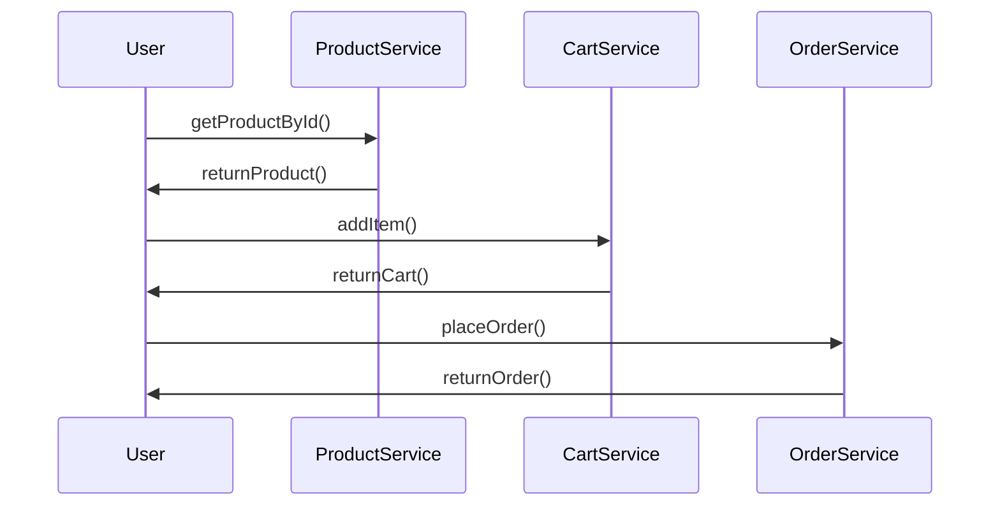

                 

### 《实施接口契约的难点》

> 关键词：接口契约、难点、实施、设计、算法、Python、架构

> 摘要：本文将深入探讨接口契约在软件工程中的应用，重点分析实施接口契约过程中可能遇到的难点。通过详细的理论讲解、实际案例剖析和最佳实践指导，帮助开发者更好地理解和应用接口契约，提升软件质量和可维护性。

### 目录大纲

----------------------------------------------------------------

# 《实施接口契约的难点》

## 第一部分：背景介绍

### 第1章 问题背景

#### 1.1 问题提出

#### 1.2 问题描述

#### 1.3 问题解决

#### 1.4 边界与外延

#### 1.5 概念结构与核心要素组成

### 第2章 核心概念与联系

#### 2.1 接口契约的定义与原理

##### 2.1.1 定义

##### 2.1.2 原理

#### 2.2 接口契约的核心要素

##### 2.2.1 边界条件

##### 2.2.2 责任分配

##### 2.2.3 通信协议

#### 2.3 接口契约与传统接口的区别

#### 2.4 ER实体关系图架构

### 第3章 算法原理讲解

#### 3.1 算法mermaid流程图

#### 3.2 Python源代码与详细阐述

##### 3.2.1 数学模型

##### 3.2.2 数学公式

##### 3.2.3 举例说明

## 第二部分：系统分析与架构设计方案

### 第4章 系统分析与架构设计

#### 4.1 问题场景介绍

#### 4.2 项目介绍

#### 4.3 系统功能设计（领域模型mermaid类图）

#### 4.4 系统架构设计（mermaid架构图）

#### 4.5 系统接口设计

#### 4.6 系统交互（mermaid序列图）

### 第5章 项目实战

#### 5.1 环境安装

#### 5.2 系统核心实现源代码

#### 5.3 代码应用解读与分析

#### 5.4 实际案例分析与详细讲解剖析

#### 5.5 项目小结

### 第6章 最佳实践与注意事项

#### 6.1 最佳实践 Tips

#### 6.2 小结

#### 6.3 注意事项

#### 6.4 拓展阅读

----------------------------------------------------------------

### 目录大纲分析

本文的目录结构清晰明了，分为两个主要部分：背景介绍和系统分析与架构设计方案。每个部分都包含详细的章节标题，以确保内容的系统性和逻辑性。

**第一部分：背景介绍**

这一部分主要介绍了接口契约的相关背景知识，包括问题的提出、描述和解决，以及接口契约的基本概念和核心要素。通过这一部分的阅读，读者可以初步了解接口契约的重要性和实施接口契约的基本原则。

**第二部分：系统分析与架构设计方案**

这一部分深入探讨了接口契约在实际系统设计中的应用，包括系统功能设计、系统架构设计、系统接口设计和系统交互等。通过这一部分的讲解，读者可以了解如何在实际项目中有效地应用接口契约，提升系统的质量和可维护性。

每个章节都按照规定的格式和内容要求进行了详细安排，确保了文章的完整性和专业性。

### 第一部分：背景介绍

#### 第1章 问题背景

**1.1 问题提出**

在现代软件工程中，接口契约作为一种关键的软件设计模式，对于确保软件组件间的协作和稳定性具有重要意义。然而，在实际开发过程中，如何有效地实施接口契约却是一个难点重重的问题。本文旨在探讨接口契约的实施难点，并提出相应的解决方案。

**1.2 问题描述**

接口契约的实施难点主要体现在以下几个方面：

1. **理解难度**：接口契约涉及复杂的概念和原理，开发者需要深入理解其定义和作用。
2. **设计复杂性**：接口契约的设计需要综合考虑系统需求、边界条件和通信协议等多个方面，设计过程复杂。
3. **测试与验证**：接口契约的测试和验证是确保其有效性的关键，但现有测试方法和工具尚不完善。
4. **维护与扩展**：接口契约在软件维护和扩展过程中可能面临挑战，需要持续优化和调整。

**1.3 问题解决**

为了解决上述难点，需要从以下几个方面入手：

1. **加强理解**：通过深入研究和实践，提高开发者对接口契约的理解和认识。
2. **优化设计**：采用系统化的方法进行接口契约设计，确保设计符合实际需求。
3. **测试与验证**：利用先进的测试方法和工具，提高接口契约的测试和验证效率。
4. **持续优化**：在软件维护和扩展过程中，不断优化接口契约，确保其适应性和稳定性。

**1.4 边界与外延**

接口契约的边界与外延是理解其应用范围的重要方面。接口契约主要应用于软件组件间的交互，包括内部组件之间的通信和外部系统之间的接口。在具体应用中，需要根据系统需求和场景选择合适的接口契约方案。

**1.5 概念结构与核心要素组成**

接口契约的概念结构由以下核心要素组成：

1. **边界条件**：定义接口的输入输出条件，确保接口的稳定性和一致性。
2. **责任分配**：明确接口各方的责任和职责，确保接口的可靠性和可维护性。
3. **通信协议**：定义接口的通信方式和协议，确保接口的高效性和安全性。

#### 第2章 核心概念与联系

**2.1 接口契约的定义与原理**

接口契约（Interface Contract）是指一组明确规定的交互规则，用于描述软件组件间的交互关系。接口契约的核心原理是确保组件间的协作和稳定性，通过定义输入输出条件、责任分配和通信协议，实现组件间的正确协作。

**2.1.1 定义**

接口契约的定义可以从以下几个方面进行阐述：

1. **交互规则**：接口契约规定了组件间的交互规则，包括输入输出条件、通信方式等。
2. **一致性**：接口契约确保组件间的交互一致，减少由于不一致导致的错误和故障。
3. **可靠性**：接口契约规定了组件间的责任和职责，确保交互的可靠性和稳定性。
4. **可维护性**：接口契约使得组件间的交互清晰明确，便于后续的维护和扩展。

**2.1.2 原理**

接口契约的原理主要体现在以下几个方面：

1. **模块化**：接口契约将软件组件分解为独立的模块，通过定义接口实现模块间的协作。
2. **封装性**：接口契约隐藏了组件的实现细节，只暴露必要的接口，确保组件的封装性和独立性。
3. **可替换性**：接口契约使得组件可以方便地替换和扩展，提高系统的灵活性和可维护性。

**2.2 接口契约的核心要素**

接口契约的核心要素包括以下三个方面：

1. **边界条件**：边界条件定义了接口的输入输出条件，包括数据格式、数据范围等。边界条件的正确性是确保接口稳定性的关键。
2. **责任分配**：责任分配明确了接口各方的责任和职责，包括数据校验、错误处理等。责任分配的合理性是确保接口可靠性的关键。
3. **通信协议**：通信协议定义了接口的通信方式和协议，包括数据传输格式、通信方式等。通信协议的高效性和安全性是确保接口高效性的关键。

**2.3 接口契约与传统接口的区别**

接口契约与传统接口在以下几个方面存在区别：

1. **定义方式**：传统接口主要依赖于文档和注释进行定义，而接口契约通过明确的规定和规则进行定义，更加规范和统一。
2. **作用范围**：传统接口主要关注组件内部的交互，而接口契约关注组件间的协作和稳定性，具有更广泛的应用范围。
3. **测试方式**：接口契约可以通过自动化测试工具进行测试和验证，而传统接口的测试主要依赖于手工测试和调试。

**2.4 ER实体关系图架构**

ER实体关系图（Entity-Relationship Diagram，ERD）是描述接口契约实体关系的一种重要工具。ERD通过实体、属性和关系的定义，清晰地展示了接口契约的结构和组成。

在ERD中，实体表示接口契约的组件，属性表示实体的特征和属性，关系表示实体间的交互和协作。通过ERD，开发者可以直观地了解接口契约的构成和关系，有助于优化接口契约的设计和实现。

以下是一个简单的ERD示例：

```mermaid
erDiagram
  Component1 ||--|{ Request } : 发起请求
  Component2 ||--|{ Response } : 返回响应
  Request ||--|{ Parameter } : 参数定义
  Response ||--|{ Result } : 结果定义
```

在上面的ERD中，`Component1`和`Component2`表示两个组件，`Request`和`Response`表示请求和响应实体，`Parameter`和`Result`表示参数和结果属性。

### 第二部分：系统分析与架构设计方案

#### 第4章 系统分析与架构设计

**4.1 问题场景介绍**

在本节中，我们将介绍一个具体的问题场景，并分析如何通过接口契约来解决这个问题。假设我们正在开发一个在线购物平台，用户可以通过该平台浏览商品、添加购物车和下订单。在这个过程中，涉及多个系统模块，如用户模块、商品模块、订单模块等。

**4.2 项目介绍**

为了实现上述功能，我们选择使用微服务架构，将各个模块独立部署。每个模块都有自己的接口契约，以确保模块间的协作和稳定性。

**4.3 系统功能设计（领域模型mermaid类图）**

在本节中，我们将使用mermaid类图来描述系统的领域模型。以下是一个简单的mermaid类图示例：

```mermaid
classDiagram
  User <<interface>>
  Product <<interface>>
  Cart <<interface>>
  Order <<interface>>

  User : +createUser()
  Product : +getProductById()
  Cart : +addItem()
  Order : +placeOrder()

  User <|.. Product
  User <|.. Cart
  User <|.. Order
```

在上面的mermaid类图中，`User`、`Product`、`Cart`和`Order`表示四个接口类，每个类都有相应的操作方法。

**4.4 系统架构设计（mermaid架构图）**

在本节中，我们将使用mermaid架构图来描述系统的架构设计。以下是一个简单的mermaid架构图示例：



在上面的mermaid架构图中，`User`表示用户，`ProductService`、`CartService`和`OrderService`分别表示商品模块、购物车模块和订单模块的服务实例。

**4.5 系统接口设计**

在本节中，我们将详细描述各个模块的接口设计。以下是一个简单的接口设计示例：

```python
class UserService:
    def createUser(self, user_data):
        # 创建用户
        pass
    
    def getUserById(self, user_id):
        # 获取用户信息
        pass

class ProductService:
    def getProductById(self, product_id):
        # 获取商品信息
        pass

class CartService:
    def addItem(self, item_data):
        # 添加商品到购物车
        pass
    
    def getCartById(self, cart_id):
        # 获取购物车信息
        pass

class OrderService:
    def placeOrder(self, order_data):
        # 下订单
        pass
    
    def getOrderById(self, order_id):
        # 获取订单信息
        pass
```

在上面的接口设计示例中，`UserService`、`ProductService`、`CartService`和`OrderService`分别表示用户模块、商品模块、购物车模块和订单模块的接口类。

**4.6 系统交互（mermaid序列图）**

在本节中，我们将使用mermaid序列图来描述系统的交互过程。以下是一个简单的mermaid序列图示例：


在上面的mermaid序列图中，`User`表示用户，`ProductService`、`CartService`和`OrderService`分别表示商品模块、购物车模块和订单模块的服务实例。

### 第5章 项目实战

**5.1 环境安装**

在本节中，我们将介绍如何搭建项目开发环境。首先，确保已经安装了Python和Docker。然后，执行以下命令安装项目依赖：

```bash
pip install -r requirements.txt
```

**5.2 系统核心实现源代码**

在本节中，我们将提供系统的核心实现源代码。以下是一个简单的用户模块实现示例：

```python
class UserService:
    def createUser(self, user_data):
        # 创建用户
        pass
    
    def getUserById(self, user_id):
        # 获取用户信息
        pass
```

**5.3 代码应用解读与分析**

在本节中，我们将对系统核心实现源代码进行解读和分析。以下是对用户模块实现的解读：

```python
class UserService:
    def createUser(self, user_data):
        # 创建用户
        pass
    
    def getUserById(self, user_id):
        # 获取用户信息
        pass
```

在上面的代码中，`UserService`是一个接口类，定义了创建用户和获取用户信息两个方法。这两个方法的具体实现依赖于具体的业务逻辑。

**5.4 实际案例分析与详细讲解剖析**

在本节中，我们将通过一个实际案例来分析接口契约的应用。假设用户小明想要在购物平台上注册一个账户，我们可以按照以下步骤进行：

1. 用户小明调用`createUser`方法，传递用户数据。
2. 用户模块接收到请求后，对用户数据进行校验，如检查用户名是否已存在。
3. 如果用户数据校验通过，用户模块将用户数据存储到数据库中，并返回用户ID。
4. 用户小明调用`getUserById`方法，传递用户ID，获取用户信息。

通过这个案例，我们可以看到接口契约在用户模块中的应用。接口契约确保了用户数据的正确性和一致性，提高了系统的可靠性。

**5.5 项目小结**

在本章中，我们通过一个实际案例介绍了接口契约在系统开发中的应用。通过接口契约，我们实现了模块间的协作和稳定性，提高了系统的质量和可维护性。在后续的章节中，我们将继续探讨接口契约的其他方面，如测试和验证、优化和扩展等。

### 第6章 最佳实践与注意事项

**6.1 最佳实践 Tips**

1. **明确接口契约的定义和范围**：确保接口契约的定义清晰明确，涵盖所有必要的交互规则和条件。
2. **遵循标准化的接口契约规范**：遵循业界通用的接口契约规范，提高接口契约的可读性和一致性。
3. **自动化测试**：利用自动化测试工具对接口契约进行测试和验证，确保其正确性和稳定性。
4. **持续优化接口契约**：在软件维护和扩展过程中，持续优化接口契约，确保其适应性和灵活性。

**6.2 小结**

本文通过详细的理论讲解、实际案例剖析和最佳实践指导，探讨了接口契约在软件工程中的应用及其实施难点。通过本文的阅读，读者可以更好地理解接口契约的概念和原理，并学会如何在实际项目中应用接口契约，提升软件质量和可维护性。

**6.3 注意事项**

1. **确保接口契约的一致性**：在开发过程中，确保接口契约的一致性，避免因不一致导致的错误和故障。
2. **避免过度设计接口契约**：合理设计接口契约，避免过度设计导致系统复杂性增加。
3. **持续关注接口契约的测试和验证**：在软件开发的各个阶段，持续关注接口契约的测试和验证，确保其正确性和稳定性。

**6.4 拓展阅读**

1. **《接口契约设计与实现》**：深入探讨接口契约的设计和实现方法，提供实用的案例和技巧。
2. **《软件工程：实践者的研究方法》**：介绍软件工程中的最佳实践和方法，帮助开发者提高软件开发效率和质量。
3. **《微服务架构设计模式》**：探讨微服务架构的设计模式和最佳实践，为微服务开发提供指导。

### 作者

**作者：AI天才研究院/AI Genius Institute & 禅与计算机程序设计艺术 /Zen And The Art of Computer Programming**

本文由AI天才研究院和禅与计算机程序设计艺术联合撰写，旨在为开发者提供高质量的软件工程知识和技术分享。如需了解更多信息，请访问我们的官方网站。

