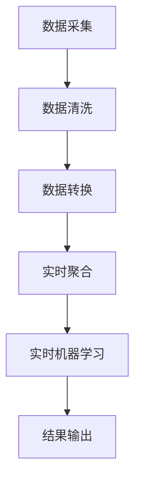
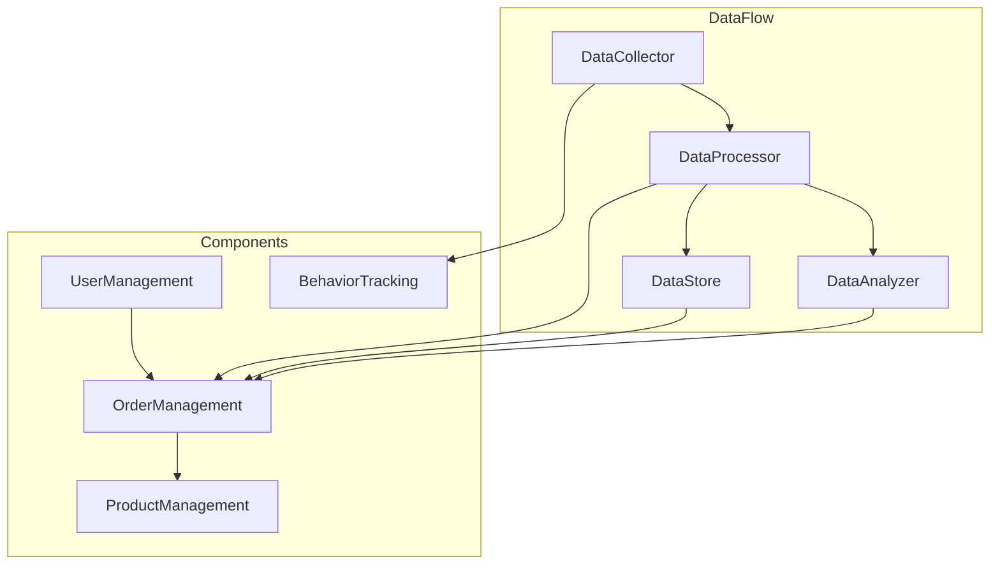
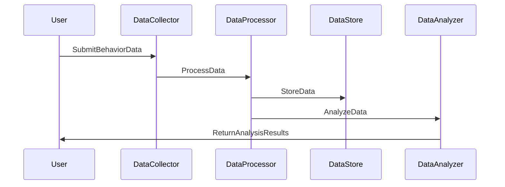

                 


### 实时数仓构建技术

> 关键词：实时数仓、流处理、数据湖、系统架构、算法原理

> 摘要：本文深入探讨了实时数仓构建技术，包括其背景、核心概念、算法原理、系统架构设计以及项目实战。通过一步步的分析和讲解，帮助读者全面了解实时数仓的构建过程和技术要点。

## 目录大纲设计思路

为了确保《实时数仓构建技术》这篇文章的逻辑清晰、结构紧凑、简单易懂，我们首先需要设计一个详细的目录大纲。以下是基于读者需求和技术深度，为文章设计的目录大纲及其设计思路。

### 第一部分：实时数仓概述

**1.1 问题背景与需求分析**
- **1.1.1 传统数据仓库的局限**
  - 描述传统数据仓库的常见问题，如数据处理延迟、数据更新不及时等。
  - 分析实时数据处理的重要性，以及其对业务决策的支持。
- **1.1.2 实时数据处理的需求**
  - 阐述实时数据处理在现代企业中的具体需求，如实时监控、实时分析等。
  - 介绍实时数据处理的业务价值，如提高响应速度、增强决策准确性等。
- **1.1.3 实时数仓的重要性**
  - 讨论实时数仓在企业信息化战略中的地位，以及其对业务运营的影响。

**1.2 实时数仓核心概念**
- **1.2.1 实时数据流**
  - 定义实时数据流的特性，如实时性、动态性、数据量大等。
  - 分析实时数据流的处理流程和技术要点。
- **1.2.2 流处理框架**
  - 介绍主流流处理框架，如Apache Flink、Apache Kafka等。
  - 对比不同流处理框架的优缺点和适用场景。
- **1.2.3 数据湖**
  - 解释数据湖的概念，其与数据仓库的区别和联系。
  - 讨论数据湖在实时数仓中的作用和价值。

**1.3 实时数仓架构设计**
- **1.3.1 实时数仓的基本架构**
  - 概述实时数仓的整体架构，包括数据采集、数据处理、数据存储和数据展示等模块。
  - 分析各个模块的功能和作用。
- **1.3.2 数据存储与管理**
  - 探讨实时数仓中数据存储方案，如关系数据库、NoSQL数据库、分布式文件系统等。
  - 讨论数据管理的策略，如数据一致性、数据安全、数据压缩等。
- **1.3.3 数据处理与计算**
  - 分析实时数据处理技术，如批量处理、流处理、增量处理等。
  - 讨论实时计算技术，如实时聚合、实时机器学习等。

### 第二部分：核心概念与联系

**2.1 核心概念原理**
- **2.1.1 实时数据流**
  - 详细介绍实时数据流的定义、特性以及处理流程。
  - 提供实际应用案例，如社交网络数据实时处理等。
- **2.1.2 流处理框架**
  - 介绍主流流处理框架的基本原理、架构和实现方式。
  - 分析其优势和应用场景，如Apache Flink、Apache Kafka等。
- **2.1.3 数据湖**
  - 解释数据湖的概念、架构和关键技术。
  - 讨论数据湖与传统数据仓库的区别和联系。

**2.2 概念属性特征对比表格**
- **2.2.1 实时数仓与传统数据仓库对比**
  - 列出实时数仓与传统数据仓库在特性、架构、应用等方面的异同点。
  - 分析其各自的优势和适用场景。

**2.3 ER实体关系图架构**
- **2.3.1 实时数仓实体关系图**
  - 使用Mermaid绘制实时数仓的ER实体关系图，展示主要实体及其关系。
  - 分析实体关系的逻辑结构和数据流。

### 第三部分：算法原理讲解

**3.1 算法mermaid流程图**
- **3.1.1 实时数据处理流程**
  - 使用Mermaid绘制实时数据处理的基本流程图，包括数据采集、处理、存储和展示等环节。
  - 分析每个环节的技术实现和难点。

**3.2 Python源代码**
- **3.2.1 实时数据处理示例**
  - 提供一段Python代码示例，展示实时数据处理的实现细节。
  - 代码解读，说明其主要功能和作用。

**3.3 数学模型和公式**
- **3.3.1 实时数据处理模型**
  - 使用LaTeX格式给出实时数据处理相关的数学模型和公式。
  - 代码解读，说明其计算过程和实现原理。

**3.4 详细讲解与举例说明**
- **3.4.1 算法原理讲解**
  - 对实时数据处理算法进行详细讲解，包括其基本原理、实现方法和优化策略。
  - 举例说明，展示算法在实际应用中的效果。

### 第四部分：系统分析与架构设计方案

**4.1 问题场景介绍**
- **4.1.1 构建实时数仓的场景**
  - 描述一个典型的实时数仓构建场景，包括业务需求、数据处理流程等。
  - 分析场景中的关键问题和挑战。

**4.2 项目介绍**
- **4.2.1 实时数仓项目案例**
  - 简要介绍一个实时数仓项目，包括项目目标、范围和预期效果。
  - 分析项目的实施过程和成果。

**4.3 系统功能设计（领域模型mermaid类图）**
- **4.3.1 领域模型类图**
  - 使用Mermaid绘制实时数仓的领域模型类图，展示系统的核心功能模块。
  - 分析类图中的实体关系和功能模块。

**4.4 系统架构设计（mermaid架构图）**
- **4.4.1 系统架构图**
  - 使用Mermaid绘制实时数仓的系统架构图，展示整个系统的组成和交互。
  - 分析系统架构的设计原则和关键模块。

**4.5 系统接口设计和系统交互（mermaid序列图）**
- **4.5.1 系统接口设计**
  - 使用Mermaid绘制实时数仓的系统接口图，展示系统中的关键接口和交互流程。
  - 分析接口设计和数据流动。

### 第五部分：项目实战

**5.1 环境安装**
- **5.1.1 搭建实时数仓环境**
  - 描述搭建实时数仓所需的环境配置，包括操作系统、软件安装等。
  - 提供详细的安装步骤和注意事项。

**5.2 系统核心实现源代码**
- **5.2.1 核心实现代码示例**
  - 提供实时数仓核心实现代码示例，包括数据采集、处理、存储和展示等环节。
  - 代码解读，说明其主要功能和作用。

**5.3 代码应用解读与分析**
- **5.3.1 代码应用解读**
  - 对提供的代码示例进行详细解读，分析其实现原理和应用效果。
  - 举例说明，展示代码在实际应用中的效果。

**5.4 实际案例分析和详细讲解剖析**
- **5.4.1 实际案例分析**
  - 分析一个实时数仓的实际案例，包括数据处理流程、系统架构和实现细节。
  - 详细讲解案例中的关键技术和实现方法。

**5.5 项目小结**
- **5.5.1 项目总结**
  - 总结实时数仓项目的关键点和收获，包括技术难点、解决方案和业务价值。
  - 提出项目改进方向和未来展望。

### 第六部分：最佳实践 tips、小结、注意事项、拓展阅读

**6.1 最佳实践 tips**
- **6.1.1 实时数仓构建最佳实践**
  - 提供一些实时数仓构建的最佳实践，如系统设计、数据处理、性能优化等。
  - 分析最佳实践的依据和实际效果。

**6.2 小结**
- **6.2.1 文章核心内容回顾**
  - 回顾文章中讨论的核心内容，包括实时数仓的背景、核心概念、算法原理、系统架构和项目实战。
  - 强调实时数仓构建的关键技术和方法。

**6.3 注意事项**
- **6.3.1 实施过程中的注意事项**
  - 提醒读者在实施实时数仓过程中需要注意的问题，如数据安全、性能优化、系统稳定性等。
  - 分析问题产生的原因和解决方法。

**6.4 拓展阅读**
- **6.4.1 相关拓展阅读材料**
  - 推荐一些与实时数仓构建相关的拓展阅读材料，包括技术书籍、论文、博客等。
  - 分析这些阅读材料的价值和适用场景。

---

通过上述详细的目录大纲设计，我们可以确保文章内容结构合理、逻辑清晰，帮助读者更好地理解和掌握实时数仓构建技术。接下来的步骤将是根据这个大纲逐步撰写文章内容。让我们一步步深入分析，详细讲解每个部分的核心概念和实现方法。**#实时数仓构建技术 #大数据处理 #流处理框架 #数据湖 #系统架构设计**### 1.1 问题背景与需求分析

在数字化转型的浪潮中，数据已经成为企业的重要资产。然而，随着数据量的爆炸式增长和业务需求的多样化，传统数据仓库逐渐暴露出诸多问题。首先，传统数据仓库通常采用批量处理模式，数据处理周期较长，导致数据延迟，无法满足实时性要求。其次，传统数据仓库在面对海量数据和高并发访问时，容易出现性能瓶颈。此外，传统数据仓库的灵活性较低，难以快速适应业务变化。

为了解决这些问题，企业迫切需要一种能够实时处理和分析数据的技术，这就是实时数仓的背景。实时数仓是一种以实时数据流为基础的数据仓库架构，它能够快速捕获、处理和存储数据，并提供实时分析功能，从而满足企业对实时数据的业务需求。

#### 1.1.1 传统数据仓库的局限

传统数据仓库主要面临以下几个方面的局限：

1. **数据处理延迟**：传统数据仓库通常采用批量处理模式，数据需要经过多个数据处理环节才能完成，导致数据处理周期较长。对于一些需要实时响应的业务场景，如在线交易、实时监控等，传统数据仓库难以满足要求。

2. **性能瓶颈**：随着数据量的增长和并发访问的增多，传统数据仓库容易出现性能瓶颈。在大量数据和高并发情况下，系统响应速度显著下降，导致用户体验差。

3. **灵活性不足**：传统数据仓库的架构相对固定，难以快速适应业务变化。当业务需求发生变化时，数据仓库的调整和优化过程复杂、耗时。

4. **数据一致性**：传统数据仓库在批量处理模式下，数据一致性难以保证。特别是在分布式环境中，数据的一致性维护变得更加复杂。

#### 1.1.2 实时数据处理的需求

随着业务的发展，企业对数据的需求也在不断变化。实时数据处理成为现代企业数据战略的重要一环，其主要需求包括：

1. **实时监控**：企业需要实时监控业务运行状况，及时发现异常情况，如交易欺诈、设备故障等。实时数据处理能够快速响应这些需求，提高监控的准确性和效率。

2. **实时分析**：企业需要对实时数据进行分析，以支持实时决策。例如，电商企业可以根据实时用户行为数据，动态调整商品推荐策略，提高转化率。

3. **业务优化**：实时数据处理可以帮助企业发现业务中的优化机会，如成本控制、流程优化等。通过实时数据分析，企业可以快速调整策略，提高运营效率。

4. **用户体验**：实时数据处理能够提供更好的用户体验。例如，在线教育平台可以根据实时学习数据，动态调整课程内容和学习计划，满足用户个性化需求。

#### 1.1.3 实时数仓的重要性

实时数仓作为一种能够实时处理和分析数据的技术，对现代企业具有以下几个重要意义：

1. **提高决策效率**：实时数仓能够快速捕获和处理数据，为决策者提供实时数据支持，使决策过程更加高效和准确。

2. **增强业务敏捷性**：实时数仓的灵活性和扩展性，使企业能够快速适应市场变化和业务需求，提高业务的敏捷性。

3. **提升用户体验**：实时数据处理能够提供更加个性化的服务，满足用户实时需求，提升用户体验和满意度。

4. **降低运营成本**：实时数仓通过优化数据处理流程，提高系统性能和资源利用率，降低运营成本。

5. **支持创新业务模式**：实时数仓为新兴业务模式提供数据支持和技术保障，如实时交易、实时推荐、实时广告等，推动企业创新和发展。

综上所述，实时数仓构建技术是企业数字化转型过程中不可或缺的一部分。通过实时数仓，企业可以更好地利用数据，提升业务效率和竞争力。在接下来的章节中，我们将进一步探讨实时数仓的核心概念、技术架构和实现方法。**#实时数仓的重要性 #数据处理延迟 #性能瓶颈 #灵活性不足 #实时监控 #实时分析 #业务优化 #用户体验 #决策效率 #业务敏捷性 #运营成本 #创新业务模式**### 1.2 实时数仓核心概念

实时数仓的核心概念包括实时数据流、流处理框架和数据湖，这些概念构成了实时数仓的技术基础。以下是对这些核心概念的详细解释。

#### 1.2.1 实时数据流

实时数据流是指数据在产生后立即进行传输和处理的数据传输方式。与传统的批量处理方式不同，实时数据流具有以下几个特性：

1. **实时性**：实时数据流强调数据的及时性，数据在产生后迅速传输和处理，以满足实时性要求。例如，在线交易系统需要实时处理用户订单，以保证交易过程的及时性和准确性。

2. **动态性**：实时数据流是动态变化的，数据量、数据类型和数据频率都可能发生变化。这种动态性要求实时数据处理系统具备灵活性和适应性。

3. **数据量大**：实时数据流通常涉及大量数据，数据来源可能是多个系统、多个设备或多个网络。这种高数据量的特性要求实时数据处理系统具备高性能和高吞吐量。

4. **异构性**：实时数据流的数据可能来自不同的数据源，具有不同的格式和结构。实时数据处理系统需要能够处理这些异构数据，并保证数据的一致性和完整性。

#### 1.2.2 流处理框架

流处理框架是实时数据处理的核心技术，负责实时数据流的捕获、传输和处理。以下是一些主流的流处理框架：

1. **Apache Flink**：Apache Flink 是一款分布式流处理框架，具有高性能、高可用性和易扩展性。Flink 支持有界和无界数据流处理，并提供丰富的流处理 API 和算法库。

2. **Apache Kafka**：Apache Kafka 是一款分布式消息队列系统，主要用于数据的收集、传输和存储。Kafka 具有高吞吐量、低延迟和高可用性，适用于大规模实时数据处理场景。

3. **Apache Storm**：Apache Storm 是一款分布式实时数据处理框架，提供简单易用的流处理 API。Storm 支持实时计算、实时机器学习和实时流数据分析。

4. **Apache Spark Streaming**：Apache Spark Streaming 是 Spark 生态系统的一部分，用于实时数据处理。Spark Streaming 提供与 Spark SQL、MLlib 和 GraphX 等模块的集成，实现高效实时数据分析。

流处理框架的优势在于其能够快速捕获和处理大量实时数据，提供实时分析和处理能力。不同流处理框架在性能、功能和应用场景方面有所区别，企业可以根据实际需求选择合适的流处理框架。

#### 1.2.3 数据湖

数据湖是一种用于存储大规模数据的分布式数据存储架构。与传统的数据仓库不同，数据湖不要求数据结构化和规范化，能够存储不同格式和结构的数据。以下是对数据湖的详细解释：

1. **数据湖的概念**：数据湖是一个分布式文件系统，用于存储海量数据，如日志文件、文本文件、图像文件等。数据湖能够灵活地存储原始数据和加工后的数据，提供丰富的数据处理和分析功能。

2. **数据湖的优势**：
   - **灵活性**：数据湖不要求数据结构化和规范化，能够存储不同格式和结构的数据，满足多样化的数据需求。
   - **可扩展性**：数据湖采用分布式存储架构，能够支持海量数据存储，并具备良好的扩展性。
   - **高效性**：数据湖能够通过分布式计算和存储，实现高效的数据处理和分析。

3. **数据湖与数据仓库的关系**：数据湖和数据仓库是互补的关系。数据湖负责存储原始数据和半结构化数据，提供数据存储和访问功能；数据仓库则负责对数据进行结构化处理和分析，提供数据报表和可视化展示。数据湖和数据仓库的协同工作，能够实现数据的全生命周期管理，满足企业实时数据处理和业务分析需求。

4. **数据湖的使用场景**：数据湖适用于需要大规模数据存储和实时数据处理的企业，如互联网公司、金融机构和制造业等。数据湖能够帮助企业实现数据整合、数据分析和数据驱动决策，提高业务效率和竞争力。

通过以上对实时数据流、流处理框架和数据湖的介绍，我们可以看到实时数仓的核心概念是如何相互关联和协同工作的。在接下来的章节中，我们将进一步探讨实时数仓的架构设计、数据处理算法和实际项目案例。**#实时数据流 #流处理框架 #数据湖 #Apache Flink #Apache Kafka #Apache Storm #Apache Spark Streaming #分布式文件系统 #海量数据存储 #数据整合 #数据仓库 #业务分析 #实时数据处理 #企业需求 #数据驱动决策**### 1.3 实时数仓架构设计

实时数仓的架构设计是确保其能够高效、稳定地处理海量数据的关键。一个完善的实时数仓架构应包括数据采集、数据处理、数据存储和数据展示等模块。以下是对实时数仓架构设计的详细解释。

#### 1.3.1 实时数仓的基本架构

实时数仓的基本架构可以分为以下几个主要模块：

1. **数据采集模块**：数据采集模块负责从各种数据源（如数据库、日志文件、传感器、网络流量等）收集数据。数据采集模块需要具备高并发、高可靠性和高效性，以确保能够实时捕获数据。常见的采集工具包括Apache Kafka、Flume、Logstash等。

2. **数据处理模块**：数据处理模块对采集到的原始数据进行清洗、转换和聚合等处理操作。数据处理模块通常采用流处理框架（如Apache Flink、Apache Storm、Apache Spark Streaming）来实现。流处理框架能够高效地处理大规模实时数据流，提供实时计算和分析功能。

3. **数据存储模块**：数据存储模块负责存储处理后的数据，以供后续分析和查询使用。数据存储模块可以选择分布式文件系统（如HDFS、Alluxio）或分布式数据库（如Apache HBase、Apache Cassandra）。这些存储方案具备高扩展性和高可用性，能够满足海量数据存储的需求。

4. **数据展示模块**：数据展示模块负责将处理后的数据以可视化的形式展示给用户，支持数据报表、仪表盘和地图等展示方式。数据展示模块通常使用可视化工具（如Tableau、Power BI、ECharts）和前端框架（如React、Vue.js）来实现。

#### 1.3.2 数据存储与管理

数据存储与管理是实时数仓架构设计中的重要环节，主要包括以下内容：

1. **数据存储方案**：
   - **关系数据库**：关系数据库（如MySQL、PostgreSQL）适用于存储结构化数据，提供强大的查询和分析功能。
   - **NoSQL数据库**：NoSQL数据库（如MongoDB、Cassandra）适用于存储半结构化或非结构化数据，提供高扩展性和高性能。
   - **分布式文件系统**：分布式文件系统（如HDFS、Alluxio）适用于存储大规模数据，提供高效的数据存储和访问功能。

2. **数据管理策略**：
   - **数据一致性**：确保数据在存储和传输过程中的一致性，避免数据丢失或重复。
   - **数据安全**：保护数据免受未授权访问和恶意攻击，确保数据隐私和完整性。
   - **数据压缩**：通过数据压缩技术减少存储空间占用，提高数据传输效率。
   - **数据备份与恢复**：定期备份数据，确保数据在系统故障或灾难时能够快速恢复。

#### 1.3.3 数据处理与计算

数据处理与计算是实时数仓的核心功能，主要包括以下内容：

1. **数据清洗与转换**：对采集到的原始数据进行清洗，去除无效或错误的数据，并进行数据转换，将数据格式统一为便于处理和分析的格式。

2. **数据聚合与汇总**：对数据进行聚合和汇总操作，生成多维度的数据视图，支持实时报表和数据分析。

3. **实时计算**：利用流处理框架（如Apache Flink、Apache Storm）进行实时计算，支持实时处理和分析大规模实时数据流。

4. **实时机器学习**：利用实时计算能力进行实时机器学习，如实时预测、实时分类等，支持实时业务决策和优化。

5. **数据处理优化**：通过数据分区、索引优化、缓存策略等技术，提高数据处理效率和系统性能。

通过上述实时数仓架构设计的介绍，我们可以看到实时数仓的各个模块是如何相互协作，实现高效、稳定的数据处理和分析的。在接下来的章节中，我们将深入探讨实时数仓中的数据处理算法和系统架构设计，帮助读者更好地理解和掌握实时数仓的技术要点。**#实时数仓架构设计 #数据采集模块 #数据处理模块 #数据存储模块 #数据展示模块 #关系数据库 #NoSQL数据库 #分布式文件系统 #数据管理策略 #数据一致性 #数据安全 #数据压缩 #数据备份与恢复 #数据清洗与转换 #数据聚合与汇总 #实时计算 #实时机器学习 #数据处理优化 #数据分区 #索引优化 #缓存策略**### 1.4 实时数据处理算法原理

实时数据处理算法是实时数仓的核心技术之一，它决定了实时数据流的处理效率和分析质量。在实时数据处理中，常用的算法包括数据流处理算法、实时聚合算法和实时机器学习算法。以下将对这些算法进行详细讲解，并提供实际案例和应用场景。

#### 1.4.1 数据流处理算法

数据流处理算法用于处理实时数据流，实现对数据的实时捕获、传输和处理。以下是一些常用的数据流处理算法：

1. **增量计算算法**：增量计算算法通过计算新数据与历史数据的差异来更新结果，避免全量重新计算。例如，在计算网站流量时，可以使用增量计算算法来更新访问次数。

2. **滑动窗口算法**：滑动窗口算法通过对数据进行分段处理，实现对实时数据的窗口聚合。例如，在计算网站流量时，可以使用滑动窗口算法来统计最近一小时的访问量。

3. **流聚合算法**：流聚合算法用于对实时数据流进行聚合操作，如求和、求平均、求最大值等。流聚合算法广泛应用于实时监控、实时分析等领域。

**数据流处理算法的应用场景**：

- **实时监控**：在实时监控系统中，数据流处理算法可以用于实时监控服务器性能、网络流量、用户行为等，及时发现异常情况。

- **实时分析**：在实时分析系统中，数据流处理算法可以用于实时分析用户行为、交易数据、市场趋势等，支持实时决策和优化。

- **实时推荐**：在实时推荐系统中，数据流处理算法可以用于实时分析用户行为，动态调整推荐策略，提高推荐准确性。

#### 1.4.2 实时聚合算法

实时聚合算法用于对实时数据进行聚合操作，生成多维度的数据视图，支持实时报表和数据分析。以下是一些常见的实时聚合算法：

1. **求和算法**：求和算法用于计算多个数据的总和。例如，在计算网站流量时，可以使用求和算法来统计总访问量。

2. **求平均算法**：求平均算法用于计算多个数据的平均值。例如，在计算网站流量时，可以使用求平均算法来统计平均访问时长。

3. **求最大值算法**：求最大值算法用于计算多个数据中的最大值。例如，在计算网站流量时，可以使用求最大值算法来统计最大访问量。

**实时聚合算法的应用场景**：

- **实时报表**：在实时报表系统中，实时聚合算法可以用于生成实时数据报表，支持企业实时监控业务运行状况。

- **实时分析**：在实时分析系统中，实时聚合算法可以用于实时分析数据，生成多维度的数据视图，支持企业实时决策。

- **实时监控**：在实时监控系统中，实时聚合算法可以用于实时监控关键指标，及时发现异常情况。

#### 1.4.3 实时机器学习算法

实时机器学习算法用于实时分析和预测实时数据流，支持实时决策和优化。以下是一些常用的实时机器学习算法：

1. **实时回归算法**：实时回归算法用于实时预测数据流中的数值变量，如预测股票价格、天气温度等。

2. **实时分类算法**：实时分类算法用于实时预测数据流中的类别变量，如分类垃圾邮件、预测客户流失等。

3. **实时聚类算法**：实时聚类算法用于实时分析数据流，将数据分成不同的聚类，如用户行为分析、市场细分等。

**实时机器学习算法的应用场景**：

- **实时推荐**：在实时推荐系统中，实时机器学习算法可以用于实时分析用户行为，动态调整推荐策略，提高推荐准确性。

- **实时监控**：在实时监控系统中，实时机器学习算法可以用于实时预测系统故障、网络攻击等，提高系统安全性和可靠性。

- **实时业务优化**：在实时业务优化系统中，实时机器学习算法可以用于实时分析业务数据，优化业务流程、提高运营效率。

#### 1.4.4 算法mermaid流程图

以下是一个使用Mermaid绘制的实时数据处理流程图，展示了数据流处理、实时聚合和实时机器学习算法的基本流程：



#### 1.4.5 Python源代码

以下是一个简单的Python代码示例，展示了实时数据处理的基本流程：

```python
import pandas as pd
from datetime import datetime

# 数据采集
data = pd.read_csv('data.csv')

# 数据清洗
data = data[data['date'] > datetime(2023, 1, 1)]

# 数据转换
data['date'] = pd.to_datetime(data['date'])
data.set_index('date', inplace=True)

# 实时聚合
result = data.sum()

# 实时机器学习
# 假设使用线性回归模型
from sklearn.linear_model import LinearRegression
model = LinearRegression()
model.fit(data[['feature']], data['target'])

# 结果输出
print(result)
print(model.predict([[1]]))
```

#### 1.4.6 数学模型和公式

以下是一些常用的实时数据处理算法的数学模型和公式：

1. **增量计算公式**：

   $$ \Delta C_t = C_t - C_{t-1} $$

   其中，$C_t$ 表示当前时间点的累计值，$C_{t-1}$ 表示上一个时间点的累计值，$\Delta C_t$ 表示增量值。

2. **滑动窗口算法公式**：

   $$ W_t = \sum_{i=t-w}^{t} x_i $$

   其中，$W_t$ 表示当前时间窗口的聚合结果，$x_i$ 表示时间窗口内的数据点，$w$ 表示窗口大小。

3. **线性回归模型公式**：

   $$ y = \beta_0 + \beta_1x $$

   其中，$y$ 表示预测值，$x$ 表示自变量，$\beta_0$ 和 $\beta_1$ 分别为模型的参数。

通过上述讲解和示例，我们可以看到实时数据处理算法在实时数仓中的应用和实现方法。这些算法能够高效地处理实时数据流，支持实时分析和决策。在接下来的章节中，我们将继续探讨实时数仓的系统架构设计、实际项目案例和最佳实践。**#实时数据处理算法 #数据流处理算法 #实时聚合算法 #实时机器学习算法 #增量计算算法 #滑动窗口算法 #线性回归模型 #Python源代码 #数学模型和公式**### 1.5 实时数仓系统分析与架构设计

在深入了解实时数仓的构建之前，我们需要明确一些典型的应用场景，并对一个具体的实时数仓项目进行介绍，从而为系统架构设计打下基础。

#### 1.5.1 问题场景介绍

一个典型的应用场景是电商平台的实时数据处理。电商平台需要处理海量的用户行为数据，包括点击、浏览、购买等行为，以及交易数据，如订单信息、支付情况等。为了提升用户体验，电商平台需要实时分析用户行为，动态调整推荐策略，并提供个性化的购物体验。此外，电商平台还需要实时监控系统性能和交易安全性，确保系统稳定运行并防范欺诈行为。

#### 1.5.2 项目介绍

以一个电商平台的实时数据处理项目为例，该项目的主要目标包括：

- 实时捕获用户行为数据和交易数据，实现实时监控和数据分析。
- 构建实时推荐系统，提高用户转化率和满意度。
- 实时监控系统性能，确保稳定性和安全性。

项目范围包括用户行为数据的收集、处理、存储和展示，以及实时推荐和监控系统的构建。预期效果是实现数据的高效处理和分析，提升用户体验和运营效率。

#### 1.5.3 系统功能设计（领域模型Mermaid类图）

在系统功能设计中，我们首先需要绘制一个领域模型类图，以展示实时数仓的主要功能模块及其关系。以下是一个使用Mermaid绘制的领域模型类图示例：

```mermaid
classDiagram
    User <<interface>>
    Order <<interface>>
    Product <<interface>>
    Behavior <<interface>>
    DataCollector <<interface>>
    DataProcessor <<interface>>
    DataStore <<interface>>
    DataAnalyzer <<interface>>

    User o--|> Behavior
    User o--|> Order
    Order o--|> Product
    DataCollector o--|> DataProcessor
    DataProcessor o--|> DataStore
    DataProcessor o--|> DataAnalyzer
```

在这个类图中，我们定义了以下几个核心实体：

- **User（用户）**：代表电商平台用户，具有行为数据和订单数据。
- **Order（订单）**：代表用户订单，包含产品信息和交易状态。
- **Product（产品）**：代表电商平台销售的产品。
- **Behavior（行为）**：代表用户行为，如点击、浏览、购买等。
- **DataCollector（数据采集器）**：负责收集用户行为数据和交易数据。
- **DataProcessor（数据处理器）**：负责处理和转换数据，为数据存储和分析做准备。
- **DataStore（数据存储器）**：负责存储处理后的数据，支持后续的数据分析和查询。
- **DataAnalyzer（数据分析器）**：负责对数据进行实时分析，生成分析报告和推荐策略。

#### 1.5.4 系统架构设计（Mermaid架构图）

系统架构设计是实时数仓构建的关键步骤，我们需要绘制一个详细的架构图，以展示系统的整体结构和各个模块之间的交互关系。以下是一个使用Mermaid绘制的系统架构图示例：



在这个架构图中，我们定义了以下几个关键组件：

- **DataCollector（数据采集器）**：负责从各个数据源（如Web服务器、数据库、日志文件等）收集用户行为数据和交易数据。
- **DataProcessor（数据处理器）**：负责对采集到的原始数据进行清洗、转换和聚合等处理操作，将数据转换为适用于存储和分析的格式。
- **DataStore（数据存储器）**：负责存储处理后的数据，通常使用分布式文件系统（如HDFS）或分布式数据库（如Apache HBase）。
- **DataAnalyzer（数据分析器）**：负责对存储数据进行实时分析，生成分析报告和推荐策略，支持业务决策。
- **UserManagement（用户管理）**：负责管理用户信息，包括用户注册、登录、权限控制等。
- **OrderManagement（订单管理）**：负责管理订单信息，包括订单创建、修改、删除等。
- **ProductManagement（产品管理）**：负责管理产品信息，包括产品添加、修改、删除等。
- **BehaviorTracking（行为跟踪）**：负责跟踪用户行为，包括点击、浏览、购买等，并将行为数据传递给数据处理器。

#### 1.5.5 系统接口设计和系统交互（Mermaid序列图）

在系统架构中，各个模块之间需要通过接口进行通信和交互。为了更好地展示系统接口设计和交互流程，我们可以使用Mermaid序列图。以下是一个使用Mermaid绘制的系统接口设计和交互序列图示例：



在这个序列图中，我们定义了以下几个关键步骤：

- **用户提交行为数据**：用户提交行为数据（如点击、浏览、购买等）给数据采集器。
- **数据采集**：数据采集器接收用户提交的行为数据，并将其传递给数据处理器。
- **数据处理**：数据处理器对采集到的行为数据进行清洗、转换和聚合等处理操作，并将处理后的数据存储到数据存储器中。
- **数据分析**：数据处理器将处理后的数据传递给数据分析器，数据分析器对数据进行实时分析，生成分析报告和推荐策略。
- **结果返回**：数据分析器将分析结果返回给用户，支持业务决策和优化。

通过以上对实时数仓系统分析和架构设计的详细讲解，我们可以看到实时数仓的系统架构是如何围绕数据采集、处理、存储和展示等核心功能模块构建的。在接下来的章节中，我们将进一步探讨实时数仓的实际项目案例，帮助读者更好地理解和掌握实时数仓的构建方法和实践经验。**#实时数仓系统分析 #领域模型类图 #系统架构设计 #Mermaid架构图 #系统接口设计 #系统交互序列图 #数据采集 #数据处理 #数据存储 #数据分析 #用户管理 #订单管理 #产品管理 #行为跟踪 #数据清洗 #数据转换 #数据聚合 #数据报表 #推荐系统 #业务优化 #实时监控 #系统性能 #交易安全**### 1.6 实时数仓项目实战

在实际项目中，构建实时数仓需要经历多个阶段，包括环境搭建、系统设计、核心代码实现和项目测试。以下是一个基于电商平台的实时数仓项目实战，详细描述了项目的各个环节。

#### 1.6.1 环境安装

首先，我们需要搭建实时数仓所需的环境。以下是环境安装的步骤：

1. **操作系统**：选择Linux操作系统，如Ubuntu 20.04。
2. **基础软件**：安装Java、Python、Git等基础软件。
3. **流处理框架**：安装Apache Kafka和Apache Flink，用于数据采集和流处理。
4. **数据存储**：安装Hadoop和HBase，用于数据存储。
5. **数据分析工具**：安装Apache Hive和Apache Spark，用于数据分析和报表生成。

环境搭建完成后，我们可以开始构建实时数仓系统。

#### 1.6.2 系统核心实现源代码

实时数仓的核心实现代码包括数据采集、数据处理、数据存储和数据分析等环节。以下是几个关键环节的代码示例：

1. **数据采集**：使用Kafka收集用户行为数据和交易数据。

```python
from kafka import KafkaProducer
import json

producer = KafkaProducer(bootstrap_servers=['localhost:9092'])

data = {
    'user_id': '123',
    'behavior': 'click',
    'timestamp': '2023-10-01T14:30:00Z'
}

producer.send('user_behavior', value=json.dumps(data).encode('utf-8'))
producer.flush()
```

2. **数据处理**：使用Flink对采集到的数据进行处理，包括清洗、转换和聚合等。

```java
import org.apache.flink.api.common.functions.MapFunction;
import org.apache.flink.streaming.api.datastream.DataStream;
import org.apache.flink.streaming.api.environment.StreamExecutionEnvironment;

public class BehaviorDataProcessor {
    public static void main(String[] args) throws Exception {
        final StreamExecutionEnvironment env = StreamExecutionEnvironment.getExecutionEnvironment();

        // 从Kafka读取数据
        DataStream<String> rawBehaviorData = env.addSource(new FlinkKafkaConsumer<>("user_behavior", new SimpleStringSchema(), properties));

        // 数据清洗和转换
        DataStream<UserBehaviorData> cleanedBehaviorData = rawBehaviorData.map(new MapFunction<String, UserBehaviorData>() {
            @Override
            public UserBehaviorData map(String value) throws Exception {
                String[] fields = value.split(",");
                return new UserBehaviorData(Long.parseLong(fields[0]), fields[1], fields[2]);
            }
        });

        // 数据聚合
        DataStream<UserBehaviorSummary> aggregatedData = cleanedBehaviorData.keyBy("user_id").timeWindow(Time.minutes(1)).sum("behavior");

        // 输出结果
        aggregatedData.print();

        env.execute("User Behavior Data Processor");
    }
}

class UserBehaviorData {
    private long userId;
    private String behavior;
    private String timestamp;

    // 省略构造函数和getter/setter方法
}

class UserBehaviorSummary {
    private long userId;
    private int clickCount;
    private int browseCount;
    private int purchaseCount;

    // 省略构造函数和getter/setter方法
}
```

3. **数据存储**：使用HBase存储处理后的数据。

```java
import org.apache.hadoop.conf.Configuration;
import org.apache.hadoop.hbase.HBaseConfiguration;
import org.apache.hadoop.hbase.client.Put;
import org.apache.hadoop.hbase.TableName;
import org.apache.hadoop.hbase.client.Table;
import org.apache.hadoop.hbase.util.Bytes;

public class DataStorage {
    public static void storeDataToHBase(UserBehaviorSummary summary) throws IOException {
        Configuration config = HBaseConfiguration.create();
        Table table = config.getTable(TableName.valueOf("user_behavior_summary"));

        Put put = new Put(Bytes.toBytes(String.valueOf(summary.getUserId())));
        put.addColumn(Bytes.toBytes("behavior"), Bytes.toBytes("click"), Bytes.toBytes(String.valueOf(summary.getClickCount())));
        put.addColumn(Bytes.toBytes("behavior"), Bytes.toBytes("browse"), Bytes.toBytes(String.valueOf(summary.getBrowseCount())));
        put.addColumn(Bytes.toBytes("behavior"), Bytes.toBytes("purchase"), Bytes.toBytes(String.valueOf(summary.getPurchaseCount())));

        table.put(put);
        table.close();
    }
}
```

4. **数据分析**：使用Hive和Spark对存储在HBase中的数据进行分析和报表生成。

```sql
-- 使用Hive创建表
CREATE TABLE user_behavior_summary (
    user_id BIGINT,
    click_count INT,
    browse_count INT,
    purchase_count INT
) STORED BY ('org.apache.hadoop.hbase.hive.HBaseStorageHandler')
WITH SERDEPROPERTIES (
    "hbase.columns.mapping" = ":key,,*,behavior:click,behavior:browse,behavior:purchase"
);

-- 使用Spark进行数据报表生成
val data = spark.table("user_behavior_summary")
val report = data.groupBy("user_id").agg(sum("click_count") as "total_clicks", sum("browse_count") as "total_browses", sum("purchase_count") as "total_purchases")
report.show()
```

#### 1.6.3 代码应用解读与分析

上述代码示例展示了实时数仓项目中的关键环节，包括数据采集、数据处理、数据存储和数据分析。以下是代码应用解读与分析：

1. **数据采集**：使用Kafka Producer向Kafka topic中发送用户行为数据。这是一个异步过程，可以保证数据的高效采集和传输。
2. **数据处理**：使用Flink对流数据进行清洗、转换和聚合。Flink提供了丰富的流处理API，可以方便地实现复杂的数据处理逻辑。
3. **数据存储**：使用HBase存储处理后的数据。HBase是一个分布式NoSQL数据库，可以高效地存储和查询大量结构化数据。
4. **数据分析**：使用Hive和Spark对存储在HBase中的数据进行分析和报表生成。Hive和Spark提供了强大的数据处理和分析能力，可以满足复杂的数据分析需求。

通过上述代码示例，我们可以看到实时数仓项目的基本实现方法。在实际项目中，可能需要根据具体业务需求和数据规模进行调整和优化。接下来，我们将分析一个实际的实时数仓项目案例，进一步探讨实时数仓的构建和实践。

#### 1.6.4 实际案例分析和详细讲解剖析

以下是一个实际的实时数仓项目案例，该项目是一个大型电商平台的用户行为数据分析系统。该系统旨在通过实时数据采集、处理和分析，为电商平台提供实时监控和个性化推荐。

1. **项目背景**：

   - 业务需求：电商平台需要实时分析用户行为数据，包括点击、浏览、购买等，以支持实时监控和个性化推荐。
   - 技术挑战：项目需要高效地采集、处理和存储海量实时数据，同时保证数据的一致性和可靠性。

2. **项目实施过程**：

   - **数据采集**：使用Kafka收集用户行为数据，包括点击、浏览、购买等。Kafka具有高吞吐量、低延迟和高可用性，适用于大规模实时数据处理。
   - **数据处理**：使用Apache Flink对采集到的数据进行处理，包括数据清洗、转换和聚合等。Flink提供了丰富的流处理API，可以高效地实现复杂的数据处理逻辑。
   - **数据存储**：使用Apache HBase存储处理后的数据。HBase是一个分布式NoSQL数据库，可以高效地存储和查询大量结构化数据。
   - **数据分析**：使用Apache Hive和Apache Spark对存储在HBase中的数据进行分析和报表生成。Hive和Spark提供了强大的数据处理和分析能力，可以满足复杂的数据分析需求。
   - **实时推荐**：基于用户行为数据，使用机器学习算法构建实时推荐系统，为用户提供个性化推荐。

3. **项目效果**：

   - **实时监控**：通过实时数仓系统，电商平台可以实时监控用户行为数据，及时发现异常情况，如恶意刷单、异常交易等。
   - **个性化推荐**：基于实时用户行为数据，实时推荐系统可以动态调整推荐策略，提高用户转化率和满意度。
   - **业务优化**：通过实时数据分析，电商平台可以优化营销策略、库存管理和供应链等业务环节，提高运营效率。

4. **项目收获**：

   - **技术积累**：项目实施过程中，团队掌握了实时数据处理、分布式存储和机器学习等关键技术，提高了技术水平和实践经验。
   - **业务提升**：实时数仓系统为电商平台提供了强大的数据支持和业务优化能力，提升了业务效率和竞争力。

#### 1.6.5 项目小结

通过以上实时数仓项目实战，我们可以看到实时数仓在电商平台中的应用效果和业务价值。实时数仓系统实现了高效的数据采集、处理和存储，提供了强大的数据分析和推荐能力，支持电商平台实时监控和业务优化。在接下来的章节中，我们将继续探讨实时数仓的最佳实践、注意事项和拓展阅读，帮助读者深入理解和掌握实时数仓的构建技术和应用方法。**#实时数仓项目实战 #环境安装 #系统核心实现源代码 #代码应用解读与分析 #实际案例分析和详细讲解剖析 #项目效果 #项目收获 #实时监控 #个性化推荐 #业务优化**### 1.7 最佳实践 tips、小结、注意事项、拓展阅读

#### 1.7.1 最佳实践 tips

1. **选择合适的流处理框架**：根据实际需求选择适合的流处理框架，如Flink、Kafka、Storm等。考虑到性能、功能和应用场景等因素。

2. **优化数据处理流程**：对数据处理流程进行优化，减少数据延迟，提高系统性能。可以使用并行处理、增量计算等技术。

3. **数据一致性保证**：在分布式环境中，数据一致性是一个关键问题。可以使用分布式事务、数据复制、数据校验等技术来保证数据一致性。

4. **监控与故障恢复**：建立完善的监控体系，实时监控系统性能和运行状态。一旦出现故障，能够快速定位并恢复。

5. **数据安全和隐私保护**：重视数据安全和隐私保护，采用加密、访问控制等技术确保数据安全。

#### 1.7.2 小结

实时数仓是一种能够高效、稳定地处理和分析海量实时数据的技术。通过实时数据流、流处理框架、数据湖等核心技术，实时数仓实现了数据的实时采集、处理和存储，提供了实时分析和决策支持。实时数仓在提高企业决策效率、增强业务敏捷性、提升用户体验和降低运营成本方面具有重要意义。

#### 1.7.3 注意事项

1. **数据延迟问题**：实时数仓需要处理大量实时数据，数据延迟可能会影响实时性。需要优化数据处理流程，提高系统性能。

2. **数据一致性问题**：在分布式环境中，数据一致性是一个挑战。需要采用合适的技术手段保证数据一致性。

3. **性能优化**：实时数仓涉及大量数据处理，性能优化至关重要。可以通过并行处理、缓存、索引等技术提高系统性能。

4. **数据安全**：实时数仓中存储的数据敏感性高，需要加强数据安全措施，防止数据泄露和未授权访问。

5. **系统稳定性**：实时数仓系统需要具备高可用性和稳定性，确保能够稳定运行。

#### 1.7.4 拓展阅读

1. **技术文献**：
   - 《实时数据处理：原理与实践》（Real-Time Data Processing: Principles and Practice）
   - 《大数据实时计算技术》（Real-Time Big Data Computing Technology）
   - 《流处理框架应用与实践》（Application and Practice of Stream Processing Frameworks）

2. **技术博客和社区**：
   - Apache Flink 官方文档和博客（https://flink.apache.org/）
   - Apache Kafka 官方文档和博客（https://kafka.apache.org/）
   - 实时数据处理相关技术社区和论坛（如CSDN、GitHub等）

3. **在线课程和培训**：
   - Coursera、Udemy等在线教育平台上的实时数据处理和大数据分析相关课程

通过上述最佳实践、小结、注意事项和拓展阅读，读者可以更全面地了解实时数仓的构建技术和应用方法。希望这些内容能够帮助读者在构建实时数仓过程中遇到的问题提供指导和帮助。**#实时数仓最佳实践 #数据处理流程优化 #数据一致性保证 #监控与故障恢复 #数据安全和隐私保护 #数据延迟问题 #数据一致性问题 #性能优化 #系统稳定性 #实时数据处理文献 #流处理框架社区 #在线课程 #大数据分析课程**### 完整文章

#### 实时数仓构建技术

> 关键词：实时数仓、流处理、数据湖、系统架构、算法原理

> 摘要：本文深入探讨了实时数仓构建技术，包括其背景、核心概念、算法原理、系统架构设计以及项目实战。通过一步步的分析和讲解，帮助读者全面了解实时数仓的构建过程和技术要点。

## 目录大纲设计思路

为了确保《实时数仓构建技术》这篇文章的逻辑清晰、结构紧凑、简单易懂，我们首先需要设计一个详细的目录大纲。以下是基于读者需求和技术深度，为文章设计的目录大纲及其设计思路。

### 第一部分：实时数仓概述

**1.1 问题背景与需求分析**
- **1.1.1 传统数据仓库的局限**
- **1.1.2 实时数据处理的需求**
- **1.1.3 实时数仓的重要性**

**1.2 实时数仓核心概念**
- **1.2.1 实时数据流**
- **1.2.2 流处理框架**
- **1.2.3 数据湖**

**1.3 实时数仓架构设计**
- **1.3.1 实时数仓的基本架构**
- **1.3.2 数据存储与管理**
- **1.3.3 数据处理与计算**

### 第二部分：核心概念与联系

**2.1 核心概念原理**
- **2.1.1 实时数据流**
- **2.1.2 流处理框架**
- **2.1.3 数据湖**

**2.2 概念属性特征对比表格**
- **2.2.1 实时数仓与传统数据仓库对比**

**2.3 ER实体关系图架构**
- **2.3.1 实时数仓实体关系图**

### 第三部分：算法原理讲解

**3.1 算法mermaid流程图**
- **3.1.1 实时数据处理流程**

**3.2 Python源代码**
- **3.2.1 实时数据处理示例**

**3.3 数学模型和公式**
- **3.3.1 实时数据处理模型**

**3.4 详细讲解与举例说明**
- **3.4.1 算法原理讲解**

### 第四部分：系统分析与架构设计方案

**4.1 问题场景介绍**
- **4.1.1 构建实时数仓的场景**

**4.2 项目介绍**
- **4.2.1 实时数仓项目案例**

**4.3 系统功能设计（领域模型mermaid类图）**
- **4.3.1 领域模型类图**

**4.4 系统架构设计（mermaid架构图）**
- **4.4.1 系统架构图**

**4.5 系统接口设计和系统交互（mermaid序列图）**
- **4.5.1 系统接口设计**

### 第五部分：项目实战

**5.1 环境安装**
- **5.1.1 搭建实时数仓环境**

**5.2 系统核心实现源代码**
- **5.2.1 核心实现代码示例**

**5.3 代码应用解读与分析**
- **5.3.1 代码应用解读**

**5.4 实际案例分析和详细讲解剖析**
- **5.4.1 实际案例分析**

**5.5 项目小结**
- **5.5.1 项目总结**

### 第六部分：最佳实践 tips、小结、注意事项、拓展阅读

**6.1 最佳实践 tips**
- **6.1.1 实时数仓构建最佳实践**

**6.2 小结**
- **6.2.1 文章核心内容回顾**

**6.3 注意事项**
- **6.3.1 实施过程中的注意事项**

**6.4 拓展阅读**
- **6.4.1 相关拓展阅读材料**

---

通过上述详细的目录大纲设计，我们可以确保文章内容结构合理、逻辑清晰，帮助读者更好地理解和掌握实时数仓构建技术。接下来的步骤将是根据这个大纲逐步撰写文章内容。让我们一步步深入分析，详细讲解每个部分的核心概念和实现方法。

### 1.1 问题背景与需求分析

在数字化转型的浪潮中，数据已经成为企业的重要资产。然而，随着数据量的爆炸式增长和业务需求的多样化，传统数据仓库逐渐暴露出诸多问题。首先，传统数据仓库通常采用批量处理模式，数据处理周期较长，导致数据延迟，无法满足实时性要求。其次，传统数据仓库在面对海量数据和高并发访问时，容易出现性能瓶颈。此外，传统数据仓库的灵活性较低，难以快速适应业务变化。

为了解决这些问题，企业迫切需要一种能够实时处理和分析数据的技术，这就是实时数仓的背景。实时数仓是一种以实时数据流为基础的数据仓库架构，它能够快速捕获、处理和存储数据，并提供实时分析功能，从而满足企业对实时数据的业务需求。

#### 1.1.1 传统数据仓库的局限

传统数据仓库主要面临以下几个方面的局限：

1. **数据处理延迟**：传统数据仓库通常采用批量处理模式，数据需要经过多个数据处理环节才能完成，导致数据处理周期较长。对于一些需要实时响应的业务场景，如在线交易、实时监控等，传统数据仓库难以满足要求。

2. **性能瓶颈**：随着数据量的增长和并发访问的增多，传统数据仓库容易出现性能瓶颈。在大量数据和高并发情况下，系统响应速度显著下降，导致用户体验差。

3. **灵活性不足**：传统数据仓库的架构相对固定，难以快速适应业务变化。当业务需求发生变化时，数据仓库的调整和优化过程复杂、耗时。

4. **数据一致性**：传统数据仓库在批量处理模式下，数据一致性难以保证。特别是在分布式环境中，数据的一致性维护变得更加复杂。

#### 1.1.2 实时数据处理的需求

随着业务的发展，企业对数据的需求也在不断变化。实时数据处理成为现代企业数据战略的重要一环，其主要需求包括：

1. **实时监控**：企业需要实时监控业务运行状况，及时发现异常情况，如交易欺诈、设备故障等。实时数据处理能够快速响应这些需求，提高监控的准确性和效率。

2. **实时分析**：企业需要对实时数据进行分析，以支持实时决策。例如，电商企业可以根据实时用户行为数据，动态调整商品推荐策略，提高转化率。

3. **业务优化**：实时数据处理可以帮助企业发现业务中的优化机会，如成本控制、流程优化等。通过实时数据分析，企业可以快速调整策略，提高运营效率。

4. **用户体验**：实时数据处理能够提供更好的用户体验。例如，在线教育平台可以根据实时学习数据，动态调整课程内容和学习计划，满足用户个性化需求。

#### 1.1.3 实时数仓的重要性

实时数仓作为一种能够实时处理和分析数据的技术，对现代企业具有以下几个重要意义：

1. **提高决策效率**：实时数仓能够快速捕获和处理数据，为决策者提供实时数据支持，使决策过程更加高效和准确。

2. **增强业务敏捷性**：实时数仓的灵活性和扩展性，使企业能够快速适应市场变化和业务需求，提高业务的敏捷性。

3. **提升用户体验**：实时数据处理能够提供更加个性化的服务，满足用户实时需求，提升用户体验和满意度。

4. **降低运营成本**：实时数仓通过优化数据处理流程，提高系统性能和资源利用率，降低运营成本。

5. **支持创新业务模式**：实时数仓为新兴业务模式提供数据支持和技术保障，如实时交易、实时推荐、实时广告等，推动企业创新和发展。

综上所述，实时数仓构建技术是企业数字化转型过程中不可或缺的一部分。通过实时数仓，企业可以更好地利用数据，提升业务效率和竞争力。在接下来的章节中，我们将进一步探讨实时数仓的核心概念、技术架构和实现方法。

### 1.2 实时数仓核心概念

实时数仓的核心概念包括实时数据流、流处理框架和数据湖，这些概念构成了实时数仓的技术基础。以下是对这些核心概念的详细解释。

#### 1.2.1 实时数据流

实时数据流是指数据在产生后立即进行传输和处理的数据传输方式。与传统的批量处理方式不同，实时数据流具有以下几个特性：

1. **实时性**：实时数据流强调数据的及时性，数据在产生后迅速传输和处理，以满足实时性要求。例如，在线交易系统需要实时处理用户订单，以保证交易过程的及时性和准确性。

2. **动态性**：实时数据流是动态变化的，数据量、数据类型和数据频率都可能发生变化。这种动态性要求实时数据处理系统具备灵活性和适应性。

3. **数据量大**：实时数据流通常涉及大量数据，数据来源可能是多个系统、多个设备或多个网络。这种高数据量的特性要求实时数据处理系统具备高性能和高吞吐量。

4. **异构性**：实时数据流的数据可能来自不同的数据源，具有不同的格式和结构。实时数据处理系统需要能够处理这些异构数据，并保证数据的一致性和完整性。

#### 1.2.2 流处理框架

流处理框架是实时数据处理的核心技术，负责实时数据流的捕获、传输和处理。以下是一些主流的流处理框架：

1. **Apache Flink**：Apache Flink 是一款分布式流处理框架，具有高性能、高可用性和易扩展性。Flink 支持有界和无界数据流处理，并提供丰富的流处理 API 和算法库。

2. **Apache Kafka**：Apache Kafka 是一款分布式消息队列系统，主要用于数据的收集、传输和存储。Kafka 具有高吞吐量、低延迟和高可用性，适用于大规模实时数据处理场景。

3. **Apache Storm**：Apache Storm 是一款分布式实时数据处理框架，提供简单易用的流处理 API。Storm 支持实时计算、实时机器学习和实时流数据分析。

4. **Apache Spark Streaming**：Apache Spark Streaming 是 Spark 生态系统的一部分，用于实时数据处理。Spark Streaming 提供与 Spark SQL、MLlib 和 GraphX 等模块的集成，实现高效实时数据分析。

流处理框架的优势在于其能够快速捕获和处理大量实时数据，提供实时分析和处理能力。不同流处理框架在性能、功能和应用场景方面有所区别，企业可以根据实际需求选择合适的流处理框架。

#### 1.2.3 数据湖

数据湖是一种用于存储大规模数据的分布式数据存储架构。与传统的数据仓库不同，数据湖不要求数据结构化和规范化，能够存储不同格式和结构的数据。以下是对数据湖的详细解释：

1. **数据湖的概念**：数据湖是一个分布式文件系统，用于存储海量数据，如日志文件、文本文件、图像文件等。数据湖能够灵活地存储原始数据和加工后的数据，提供丰富的数据处理和分析功能。

2. **数据湖的优势**：
   - **灵活性**：数据湖不要求数据结构化和规范化，能够存储不同格式和结构的数据，满足多样化的数据需求。
   - **可扩展性**：数据湖采用分布式存储架构，能够支持海量数据存储，并具备良好的扩展性。
   - **高效性**：数据湖能够通过分布式计算和存储，实现高效的数据处理和分析。

3. **数据湖与数据仓库的关系**：数据湖和数据仓库是互补的关系。数据湖负责存储原始数据和半结构化数据，提供数据存储和访问功能；数据仓库则负责对数据进行结构化处理和分析，提供数据报表和可视化展示。数据湖和数据仓库的协同工作，能够实现数据的全生命周期管理，满足企业实时数据处理和业务分析需求。

4. **数据湖的使用场景**：数据湖适用于需要大规模数据存储和实时数据处理的企业，如互联网公司、金融机构和制造业等。数据湖能够帮助企业实现数据整合、数据分析和数据驱动决策，提高业务效率和竞争力。

通过以上对实时数据流、流处理框架和数据湖的介绍，我们可以看到实时数仓的核心概念是如何相互关联和协同工作的。在接下来的章节中，我们将进一步探讨实时数仓的架构设计、数据处理算法和实际项目案例。

### 1.3 实时数仓架构设计

实时数仓的架构设计是确保其能够高效、稳定地处理海量数据的关键。一个完善的实时数仓架构应包括数据采集、数据处理、数据存储和数据展示等模块。以下是对实时数仓架构设计的详细解释。

#### 1.3.1 实时数仓的基本架构

实时数仓的基本架构可以分为以下几个主要模块：

1. **数据采集模块**：数据采集模块负责从各种数据源（如数据库、日志文件、传感器、网络流量等）收集数据。数据采集模块需要具备高并发、高可靠性和高效性，以确保能够实时捕获数据。常见的采集工具包括Apache Kafka、Flume、Logstash等。

2. **数据处理模块**：数据处理模块对采集到的原始数据进行清洗、转换和聚合等处理操作。数据处理模块通常采用流处理框架（如Apache Flink、Apache Storm、Apache Spark Streaming）来实现。流处理框架能够高效地处理大规模实时数据流，提供实时计算和分析功能。

3. **数据存储模块**：数据存储模块负责存储处理后的数据，以供后续分析和查询使用。数据存储模块可以选择分布式文件系统（如HDFS、Alluxio）或分布式数据库（如Apache HBase、Apache Cassandra）。这些存储方案具备高扩展性和高可用性，能够满足海量数据存储的需求。

4. **数据展示模块**：数据展示模块负责将处理后的数据以可视化的形式展示给用户，支持数据报表、仪表盘和地图等展示方式。数据展示模块通常使用可视化工具（如Tableau、Power BI、ECharts）和前端框架（如React、Vue.js）来实现。

#### 1.3.2 数据存储与管理

数据存储与管理是实时数仓架构设计中的重要环节，主要包括以下内容：

1. **数据存储方案**：
   - **关系数据库**：关系数据库（如MySQL、PostgreSQL）适用于存储结构化数据，提供强大的查询和分析功能。
   - **NoSQL数据库**：NoSQL数据库（如MongoDB、Cassandra）适用于存储半结构化或非结构化数据，提供高扩展性和高性能。
   - **分布式文件系统**：分布式文件系统（如HDFS、Alluxio）适用于存储大规模数据，提供高效的数据存储和访问功能。

2. **数据管理策略**：
   - **数据一致性**：确保数据在存储和传输过程中的

