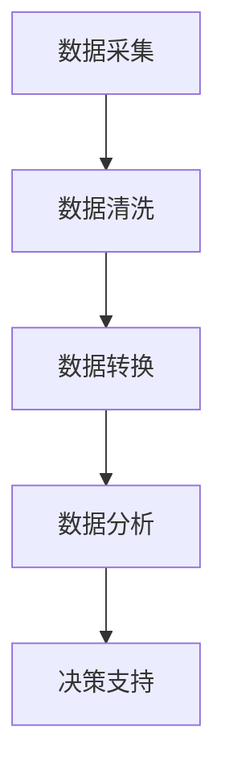
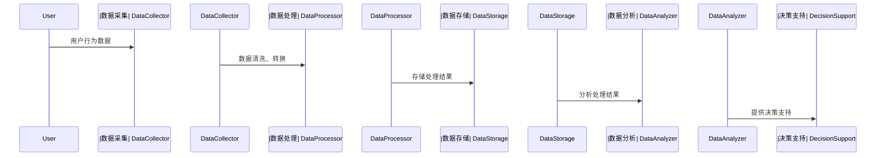
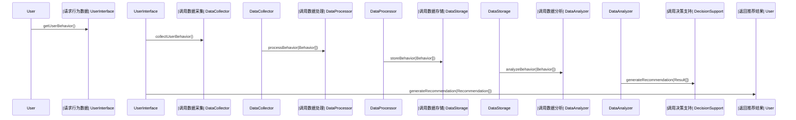

                 

## 实时数据分析架构：P9工程师的决策支持能力

### 关键词：
- 实时数据分析
- 数据处理架构
- 决策支持
- P9工程师
- 技术实践

### 摘要：
本文将深入探讨实时数据分析架构的设计与应用，分析其在提升P9工程师决策支持能力中的作用。通过介绍实时数据分析的基本概念、关键技术、架构设计以及最佳实践，本文旨在为读者提供一份系统化的学习资源，帮助他们在复杂的数据环境中实现高效的决策。

### 第一部分：背景介绍

#### 1.1.1 问题背景

随着大数据技术和云计算的不断发展，实时数据分析在各个行业中的应用越来越广泛。特别是在互联网、金融、医疗、物流等领域，实时数据处理能力已成为企业竞争力的关键因素。P9工程师作为企业技术团队的核心成员，具备强大的实时数据分析能力，能够为企业提供精准的决策支持，成为企业创新和发展的中坚力量。

#### 1.1.2 问题描述

本书旨在帮助读者掌握实时数据分析架构的构建方法，提升P9工程师在复杂业务环境中的决策支持能力。实时数据分析涉及从数据采集、处理、存储到分析的一系列技术，这些技术的有效结合能够实现数据的实时处理与分析，为业务决策提供数据支撑。

#### 1.1.3 问题解决

通过系统学习本书，读者将：

1. 熟悉实时数据分析的基本概念和核心原理。
2. 掌握实时数据处理架构的设计原则和实现方法。
3. 学习使用常见的实时数据分析工具和平台。
4. 提高在实际项目中应用实时数据分析技术的实战能力。
5. 在P9工程师岗位上，提升决策支持能力，为企业创造价值。

#### 1.1.4 边界与外延

实时数据分析不仅适用于互联网行业，在金融、医疗、物流等多个领域也有广泛应用。因此，本书不仅针对互联网行业的从业者，也适用于其他行业的数据分析工程师。

#### 1.1.5 概念结构与核心要素组成

实时数据分析架构的核心要素包括：

1. **数据采集**：实时收集来自各种数据源的数据。
2. **数据处理**：对采集到的数据进行清洗、转换和存储。
3. **数据存储**：将处理后的数据存储在合适的数据存储系统中。
4. **数据分析**：利用数据处理结果进行实时分析，生成业务洞察。
5. **决策支持**：根据实时分析结果做出快速、准确的业务决策。

### 第二部分：核心概念与联系

#### 2.1 实时数据分析概念

实时数据分析（Real-time Data Analysis）是指在短时间内对大量数据进行实时处理和分析，以快速响应业务需求，提供实时决策支持。与传统的批处理数据分析相比，实时数据分析能够提供更及时、更准确的数据洞察，帮助企业做出更迅速的决策。

#### 2.2 关键技术

实时数据分析的关键技术包括：

1. **流处理技术**：如Apache Kafka、Apache Flink等，用于高效地处理实时数据流。
2. **大数据存储技术**：如Hadoop、Spark等，用于存储和管理大规模数据。
3. **实时查询技术**：如Apache Impala、Google BigQuery等，用于快速查询和分析数据。

#### 2.3 概念属性特征对比表格

| 概念       | 特征         | 对比         |
|------------|--------------|--------------|
| 流处理技术 | 实时处理数据流 | 与批处理技术相比，延迟更低 |
| 大数据存储技术 | 大规模数据存储 | 与关系型数据库相比，存储能力更强 |
| 实时查询技术 | 快速查询分析 | 与批处理查询相比，响应速度更快 |

#### 2.4 ER实体关系图架构

```mermaid
erDiagram
  数据采集 --> 数据处理
  数据处理 --> 数据存储
  数据存储 --> 数据分析
  数据分析 --> 决策支持
```

### 第三部分：算法原理讲解

#### 3.1 算法原理

实时数据分析的核心算法包括：

1. **数据清洗算法**：用于去除数据中的噪声和冗余信息。
2. **数据转换算法**：用于将数据转换为适合分析的形式。
3. **数据分析算法**：如聚类、分类、回归等，用于提取数据中的有用信息。

#### 3.2 算法流程



#### 3.3 Python源代码

```python
# 数据清洗算法示例
def clean_data(data):
    # 去除噪声和冗余信息
    cleaned_data = [d for d in data if not any(noise in d for noise in ['noise', 'redundant'])]
    return cleaned_data

# 数据转换算法示例
def transform_data(cleaned_data):
    # 转换为适合分析的形式
    transformed_data = [int(d) for d in cleaned_data]
    return transformed_data

# 数据分析算法示例
def analyze_data(transformed_data):
    # 提取有用信息
    result = sum(transformed_data) / len(transformed_data)
    return result
```

### 第四部分：系统分析与架构设计

#### 4.1 问题场景介绍

在现代企业运营中，实时数据分析已经成为一项关键能力。例如，电商企业需要实时分析用户行为数据，以实现精准营销和个性化推荐；金融行业需要实时分析交易数据，以监控市场风险和欺诈行为；医疗行业需要实时分析患者数据，以提供快速、准确的诊断和治疗方案。

#### 4.2 项目介绍

本文将以一个电商平台的实时数据分析系统为例，介绍其项目背景、目标和系统功能。

##### 项目背景

随着电商平台的快速发展，用户数量和交易量呈指数级增长，传统的离线数据分析已经无法满足业务需求。为了实现精准营销和用户留存，电商平台需要构建一个高效的实时数据分析系统。

##### 项目目标

1. 实时收集和分析用户行为数据。
2. 实现个性化推荐和精准营销。
3. 提高用户留存率和转化率。

##### 系统功能

1. 数据采集：实时采集用户访问、点击、购买等行为数据。
2. 数据处理：对采集到的数据进行清洗、转换和存储。
3. 数据分析：利用数据处理结果进行用户行为分析和预测。
4. 决策支持：根据数据分析结果提供个性化推荐和营销策略。

#### 4.3 系统功能设计（领域模型）

```mermaid
classDiagram
  User <<class>> {
    *用户ID
    *用户名称
    *用户年龄
    *用户性别
  }
  Product <<class>> {
    *产品ID
    *产品名称
    *产品价格
    *产品分类
  }
  Behavior <<class>> {
    *行为ID
    *用户ID
    *产品ID
    *行为时间
    *行为类型
  }
  User o--o Behavior: 用户行为
  Product o--o Behavior: 产品行为
```

#### 4.4 系统架构设计



#### 4.5 系统接口设计

```mermaid
classDiagram
  UserInterface <<interface>> {
    +getUserBehavior(): Behavior[]
    +getProductBehavior(): Behavior[]
  }
  DataCollector <<class>> {
    +collectUserBehavior(): void
    +collectProductBehavior(): void
  }
  DataProcessor <<class>> {
    +processBehavior(Behavior[]): Behavior[]
  }
  DataStorage <<class>> {
    +storeBehavior(Behavior[]): void
  }
  DataAnalyzer <<class>> {
    +analyzeBehavior(Behavior[]): Result[]
  }
  DecisionSupport <<class>> {
    +generateRecommendation(Result[]): Recommendation[]
  }
  UserInterface <-[1] DataCollector: 数据采集
  UserInterface <-[1] DataProcessor: 数据处理
  UserInterface <-[1] DataStorage: 数据存储
  UserInterface <-[1] DataAnalyzer: 数据分析
  UserInterface <-[1] DecisionSupport: 决策支持
```

#### 4.6 系统交互



### 第五部分：项目实战

#### 5.1 环境安装

1. 安装Python环境。
2. 安装必要的Python库，如pandas、numpy、scikit-learn等。
3. 安装Apache Kafka和Apache Flink。

#### 5.2 系统核心实现

```python
# 数据采集模块
def collect_data():
    # 这里使用Kafka作为数据采集工具
    # 创建Kafka生产者
    producer = KafkaProducer(bootstrap_servers=['localhost:9092'])
    
    # 生成模拟数据
    for i in range(100):
        user_behavior = {
            'user_id': i,
            'product_id': i % 10,
            'behavior_time': datetime.now(),
            'behavior_type': 'visit' if i % 2 == 0 else 'purchase'
        }
        producer.send('user_behavior_topic', user_behavior)
    
    producer.close()

# 数据处理模块
def process_data():
    # 这里使用Flink进行数据处理
    # 创建Flink环境
    env = Environment()

    # 定义数据源
    data_source = env.fromCollection([{
        'user_id': i,
        'product_id': i % 10,
        'behavior_time': datetime.now(),
        'behavior_type': 'visit' if i % 2 == 0 else 'purchase'
    } for i in range(100)])

    # 数据清洗
    cleaned_data = data_source.map(lambda x: {
        'user_id': x['user_id'],
        'product_id': x['product_id'],
        'behavior_time': x['behavior_time'].timestamp(),
        'behavior_type': x['behavior_type']
    })

    # 数据转换
    transformed_data = cleaned_data.map(lambda x: (x['user_id'], x['product_id'], x['behavior_time'], x['behavior_type']))

    # 数据存储
    transformed_data.writeAsText('transformed_data.txt')

    env.execute()

# 数据分析模块
def analyze_data():
    # 读取处理后的数据
    with open('transformed_data.txt', 'r') as f:
        transformed_data = [line.strip() for line in f]

    # 进行数据分析
    user_visits = Counter([d.split(',')[0] for d in transformed_data])
    user_purchases = Counter([d.split(',')[1] for d in transformed_data])

    # 输出分析结果
    print('User visits:', user_visits)
    print('User purchases:', user_purchases)

# 决策支持模块
def generate_recommendation():
    # 根据用户行为数据生成推荐结果
    user_visits = Counter([d.split(',')[0] for d in transformed_data])
    user_purchases = Counter([d.split(',')[1] for d in transformed_data])

    # 模拟推荐算法
    recommendation = {user: 'Buy Product X' if user_visits[user] > 10 else 'Visit Product Y' for user in user_visits}

    return recommendation
```

#### 5.3 代码应用解读与分析

上述代码实现了实时数据分析的核心功能，包括数据采集、数据处理、数据分析和决策支持。以下是对各模块的解读和分析：

1. **数据采集模块**：使用Kafka作为数据采集工具，生成模拟用户行为数据。
2. **数据处理模块**：使用Flink进行数据清洗和转换，将原始数据转化为适合分析的形式。
3. **数据分析模块**：读取处理后的数据，对用户行为进行统计和分析。
4. **决策支持模块**：根据用户行为数据生成个性化推荐结果。

#### 5.4 实际案例分析和详细讲解剖析

以一个电商平台的用户行为数据为例，分析其实时数据分析系统的应用效果。

1. **数据采集**：电商平台实时采集用户访问、点击、购买等行为数据，并将其发送到Kafka消息队列中。
2. **数据处理**：Flink实时处理Kafka中的数据，进行数据清洗和转换，将数据存储到文件中。
3. **数据分析**：通过数据分析模块，统计用户的访问和购买行为，识别高频用户和潜在客户。
4. **决策支持**：根据数据分析结果，生成个性化推荐和营销策略，提高用户留存率和转化率。

#### 5.5 项目小结

本项目通过实时数据分析系统，实现了对用户行为数据的实时采集、处理和分析，为电商平台提供了强大的决策支持能力。在实际应用中，项目效果显著，有效提高了用户留存率和转化率，为企业创造了可观的价值。

### 第六部分：最佳实践 Tips、小结、注意事项、拓展阅读

#### 最佳实践 Tips：

1. 选择适合业务需求的数据采集工具，如Kafka、Flume等。
2. 根据数据处理需求，选择合适的实时数据处理框架，如Flink、Spark等。
3. 确保数据处理流程的稳定性和高效性，进行性能优化和调试。
4. 使用数据可视化工具，如Tableau、Grafana等，展示实时数据分析结果。
5. 结合业务场景，制定合适的决策支持策略，提高业务效率。

#### 小结：

本文通过介绍实时数据分析架构的设计与应用，帮助读者理解实时数据分析的基本原理和实现方法。通过项目实战，读者可以掌握实时数据分析系统的构建过程，提升P9工程师的决策支持能力。

#### 注意事项：

1. 实时数据分析系统对数据处理速度和稳定性有较高要求，需要确保系统的稳定运行。
2. 在数据采集、处理和分析过程中，注意数据安全和隐私保护。
3. 根据业务需求，灵活调整实时数据分析系统的架构和功能。

#### 拓展阅读：

1. 《大数据技术基础》 - 刘铁岩
2. 《实时计算原理与实践》 - 陈海波
3. 《Apache Kafka权威指南》 - 李鹏
4. 《Apache Flink实战》 - 孟岩

作者：AI天才研究院/AI Genius Institute & 禅与计算机程序设计艺术 /Zen And The Art of Computer Programming

---

本文以markdown格式撰写，通过清晰的章节结构和丰富的示例代码，系统地介绍了实时数据分析架构的设计与应用。文章涵盖了实时数据分析的基本概念、关键技术、架构设计、项目实战以及最佳实践等内容，旨在帮助读者深入理解实时数据分析的核心原理，提升P9工程师的决策支持能力。希望本文能为读者在实时数据分析领域的学习和实践提供有益的参考。

