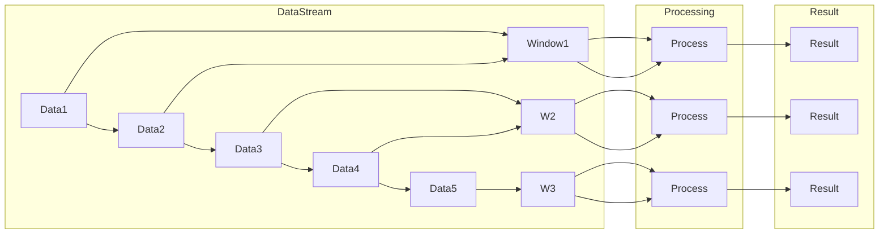
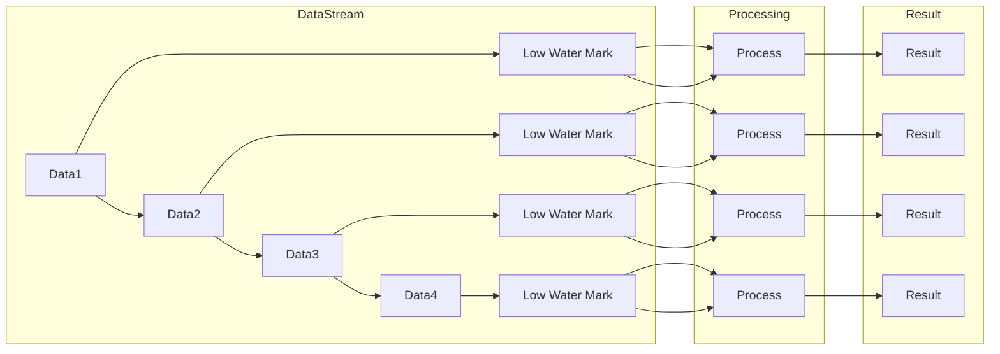
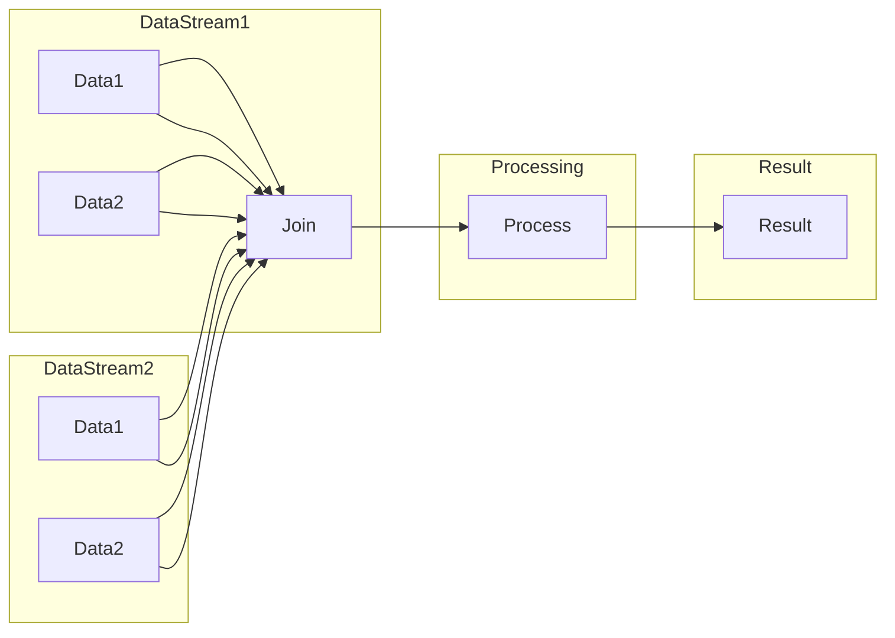
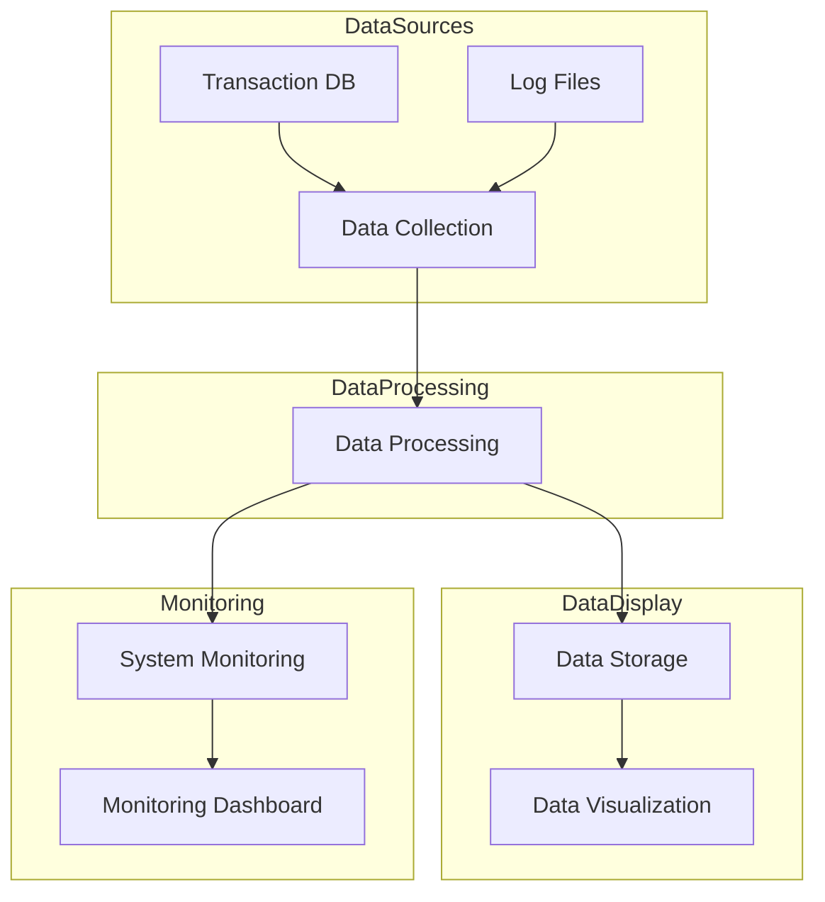

                 

# 实时数据处理：流式计算的应用与挑战

> 关键词：实时数据处理、流式计算、应用挑战、核心技术、主流框架、特定领域

> 摘要：随着互联网、物联网和大数据技术的飞速发展，实时数据处理的需求日益迫切。流式计算作为实现实时数据处理的关键技术，其应用范围广泛，但同时也面临着诸多挑战。本文将深入探讨实时数据处理的概念、背景、核心问题、流式计算的基本架构与优化技术，并分析当前主流的流式计算框架及其性能，最后探讨流式计算在特定领域的应用案例。

## 目录大纲

**《实时数据处理：流式计算的应用与挑战》**

----------------------------------------------------------------

# 第一部分：实时数据处理基础

## 第1章：实时数据处理的背景与挑战

### 1.1 数据处理需求的演变
#### 1.1.1 传统批处理与实时处理的区别
#### 1.1.2 实时数据处理的必要性
#### 1.1.3 流式计算的概念与特点

### 1.2 实时数据处理的核心问题
#### 1.2.1 数据流模式与处理需求
#### 1.2.2 实时数据处理的技术挑战
#### 1.2.3 流式计算与传统批处理的比较

### 1.3 流式计算的基本架构
#### 1.3.1 流计算模型
#### 1.3.2 流处理框架
#### 1.3.3 实时数据处理生态系统

### 1.4 流式计算的技术发展与趋势
#### 1.4.1 流式计算技术的演进历程
#### 1.4.2 当前主流流式计算技术
#### 1.4.3 流式计算的未来趋势

### 1.5 本章小结

----------------------------------------------------------------

# 第二部分：流式计算的核心技术

## 第2章：流式计算的理论基础

### 2.1 数据流处理模型
#### 2.1.1 微观数据流模型
#### 2.1.2 宏观数据流模型
#### 2.1.3 数据流图的表示与转换

### 2.2 流计算基本算法
#### 2.2.1 滑动窗口算法
#### 2.2.2 水位标记算法
#### 2.2.3 流聚合与 Join 算法

### 2.3 实时数据处理的分布式系统
#### 2.3.1 分布式系统的基本概念
#### 2.3.2 分布式数据存储
#### 2.3.3 分布式计算模型

### 2.4 流计算优化技术
#### 2.4.1 资源调度与负载均衡
#### 2.4.2 数据压缩与传输优化
#### 2.4.3 异步处理与事件驱动

### 2.5 流式数据处理的优势与局限性
#### 2.5.1 流式数据处理的优势
#### 2.5.2 流式数据处理的局限性
#### 2.5.3 折中方案与未来展望

### 2.6 本章小结

----------------------------------------------------------------

# 第3章：主流流式计算框架与应用

### 3.1 Flink：高效流处理框架
#### 3.1.1 Flink 的基本架构
#### 3.1.2 Flink 的核心特性
#### 3.1.3 Flink 的应用案例

### 3.2 Spark Streaming：批流一体框架
#### 3.2.1 Spark Streaming 的基本架构
#### 3.2.2 Spark Streaming 的核心功能
#### 3.2.3 Spark Streaming 的应用场景

### 3.3 Apache Kafka：流处理数据管道
#### 3.3.1 Kafka 的基本架构
#### 3.3.2 Kafka 的核心概念
#### 3.3.3 Kafka 在流式数据处理中的应用

### 3.4 Apache Storm：实时大数据处理
#### 3.4.1 Storm 的基本架构
#### 3.4.2 Storm 的核心组件
#### 3.4.3 Storm 的应用实践

### 3.5 其他流式计算框架介绍
#### 3.5.1 Apex
#### 3.5.2 Samza
#### 3.5.3 Beam

### 3.6 流式计算框架的性能比较
#### 3.6.1 性能评价指标
#### 3.6.2 框架性能对比实验
#### 3.6.3 性能优化策略

### 3.7 本章小结

----------------------------------------------------------------

# 第4章：流式计算在特定领域的应用

### 4.1 财务领域
#### 4.1.1 实时风险管理
#### 4.1.2 股票交易分析
#### 4.1.3 财务报表自动化

### 4.2 互联网领域
#### 4.2.1 用户行为分析
#### 4.2.2 广告投放优化
#### 4.2.3 日志实时处理

### 4.3 物联网领域
#### 4.3.1 实时数据监控
#### 4.3.2 设备故障预测
#### 4.3.3 能源管理优化

### 4.4 医疗健康领域
#### 4.4.1 病情监测
#### 4.4.2 医疗数据挖掘
#### 4.4.3 医疗资源分配

### 4.5 制造业领域

----------------------------------------------------------------

接下来，我们将深入探讨实时数据处理的背景与挑战，了解流式计算的基本架构和核心技术，分析主流流式计算框架的应用和性能，最后探讨流式计算在特定领域的实际应用案例。让我们一步一步地深入思考，共同探讨流式计算的魅力与应用挑战。## 第1章：实时数据处理的背景与挑战

### 1.1 数据处理需求的演变

随着信息技术的快速发展，数据处理的需求也在不断演变。从早期的传统批处理到现代的实时处理，数据处理技术经历了巨大的变革。

**传统批处理：** 批处理是指将数据集合一次性处理完毕的技术。这种方式在处理大量数据时非常高效，但缺点是响应时间较长，不适合需要实时处理的应用场景。例如，银行系统在每月底处理当月的交易数据，生成账单和报表，这就是典型的批处理场景。

**实时处理：** 实时处理是指对数据进行连续、即时的处理，能够迅速响应用户的操作。例如，股票交易系统需要实时更新股票价格，搜索引擎需要实时响应用户的查询请求。实时处理具有快速响应和高实时性的特点，能够为用户提供更好的体验。

**流式计算：** 流式计算是一种处理数据流的技术，能够对实时产生的数据进行处理和分析。流式计算的核心思想是将数据划分为一系列连续的批次进行处理，每个批次的数据量较小，处理时间较短。这使得流式计算能够在保证实时性的同时，处理大规模的数据流。

### 1.1.1 传统批处理与实时处理的区别

**处理模式：** 批处理是批量处理，将一段时间内的数据进行一次性处理；实时处理是流式处理，对数据进行连续、即时的处理。

**响应时间：** 批处理响应时间较长，适用于非实时场景；实时处理响应时间较短，适用于实时场景。

**数据量：** 批处理适合处理大量数据，但实时处理更擅长处理连续、大规模的数据流。

**资源消耗：** 批处理资源消耗较大，实时处理资源消耗较小。

### 1.1.2 实时数据处理的必要性

**实时决策支持：** 在很多应用场景中，需要根据实时数据进行快速决策。例如，金融交易系统需要实时监控市场动态，以便快速下单。

**用户体验优化：** 实时处理能够提供更好的用户体验，例如，搜索引擎需要实时响应用户查询，社交媒体需要实时更新用户动态。

**业务流程优化：** 实时处理可以帮助优化业务流程，例如，物流系统可以实时追踪货物的状态，从而提高物流效率。

### 1.1.3 流式计算的概念与特点

**流式计算（Stream Computing）：** 流式计算是一种处理数据流的技术，对实时产生的数据进行处理和分析。流式计算的特点包括：

- **连续性：** 数据以流的形式连续产生和消费。
- **实时性：** 能够快速响应用户请求和数据变化。
- **分布式：** 能够在大规模分布式系统中高效处理数据。
- **弹性：** 能够根据数据流的变化动态调整资源。

### 1.2 实时数据处理的核心问题

**数据流模式与处理需求：** 实时数据处理需要根据不同的数据流模式选择合适的数据处理策略。常见的流模式包括连续流、批量流和混合流。

**实时数据处理的技术挑战：** 实时数据处理面临许多技术挑战，如数据一致性问题、延迟容忍度和容错性等。

**流式计算与传统批处理的比较：** 流式计算和传统批处理各有优劣，如何选择合适的技术取决于应用场景和需求。

### 1.3 流式计算的基本架构

**流计算模型：** 流计算模型是描述数据流和计算任务之间关系的一种抽象。常见的流计算模型包括事件驱动模型和任务驱动模型。

**流处理框架：** 流处理框架是实现流式计算的工具和平台，常见的流处理框架包括Apache Kafka、Apache Flink、Apache Storm等。

**实时数据处理生态系统：** 实时数据处理生态系统包括数据源、流处理框架、数据存储、监控和报警等多个组成部分。

### 1.4 流式计算的技术发展与趋势

**流式计算技术的演进历程：** 流式计算技术经历了从简单的数据流处理到复杂的分布式流处理的发展过程。

**当前主流流式计算技术：** 当前主流的流式计算技术包括Apache Kafka、Apache Flink、Apache Storm等。

**流式计算的未来趋势：** 流式计算技术将继续发展，包括性能优化、智能化和跨平台等方面。

### 1.5 本章小结

本章介绍了实时数据处理的背景和挑战，详细分析了数据处理需求的演变、传统批处理与实时处理的区别、实时数据处理的必要性以及流式计算的概念和特点。此外，还探讨了实时数据处理的核心问题、流式计算的基本架构以及流式计算的技术发展与趋势。这些内容为后续章节深入探讨流式计算的核心技术和应用案例奠定了基础。## 1.2 实时数据处理的核心问题

### 1.2.1 数据流模式与处理需求

实时数据处理的关键在于数据流模式的理解和处理需求的满足。数据流模式可以分为以下几种：

**连续流（Continuous Stream）：** 这种模式表示数据以连续不断的形式产生和消费。例如，传感器数据、日志数据等。处理连续流数据的关键是确保数据的实时性和准确性。

**批量流（Batch Stream）：** 批量流是指数据以固定时间间隔或者数据量到达，例如，每小时的数据汇总、每日的交易汇总等。处理批量流数据需要在较短的时间内完成大量数据的处理，同时保证处理结果的准确性。

**混合流（Mixed Stream）：** 混合流是指数据既包括连续流，也包括批量流。例如，在一个电商平台上，用户的购买行为是连续流，而每天的数据汇总则是批量流。处理混合流数据需要结合连续流和批量流的特点，灵活调整数据处理策略。

不同的数据流模式决定了不同的数据处理需求：

- **连续流：** 需要支持高吞吐量和低延迟的数据处理，同时保证数据的一致性和完整性。
- **批量流：** 需要处理大规模的数据，同时保证处理结果的准确性和一致性。
- **混合流：** 需要同时满足连续流和批量流的处理需求，实现高效的混合数据处理。

### 1.2.2 实时数据处理的技术挑战

实时数据处理面临许多技术挑战，主要包括：

**数据一致性问题：** 在分布式环境中，如何保证数据的一致性是一个重要挑战。流式计算需要处理分布式数据源，不同节点上的数据可能存在延迟或者冲突，如何解决这些一致性问题是一个关键技术难题。

**延迟容忍度：** 实时数据处理要求低延迟，即在较短的时间内完成数据的处理和响应。然而，数据流的速度和规模可能会影响延迟容忍度。如何优化处理流程和资源调度，以降低延迟是一个关键挑战。

**容错性：** 实时数据处理系统需要具备较高的容错性，以应对节点故障、网络中断等异常情况。流式计算系统需要实现自动故障转移和数据恢复，确保系统的稳定性和可靠性。

**数据传输与存储：** 实时数据处理需要高效的数据传输和存储机制，以确保数据在传输和存储过程中不丢失或损坏。流式计算系统需要优化数据传输协议和存储结构，提高数据传输和存储的效率。

**系统扩展性：** 随着数据规模的扩大，实时数据处理系统需要具备良好的扩展性，能够动态调整资源分配和处理能力。流式计算系统需要支持水平扩展和弹性伸缩，以应对不断增长的数据量和处理需求。

### 1.2.3 流式计算与传统批处理的比较

流式计算和传统批处理在数据处理方面各有优势和劣势：

**优势：**

- **流式计算：** 支持实时数据处理，能够快速响应用户请求和数据变化，适用于需要实时决策和交互的场景。
- **传统批处理：** 处理效率高，适合处理大规模数据，适用于周期性的数据处理任务。

**劣势：**

- **流式计算：** 需要处理分布式数据源和复杂的处理逻辑，系统设计和开发成本较高。
- **传统批处理：** 响应时间较长，不适用于需要实时响应的场景，数据处理结果的实时性较低。

在实际应用中，流式计算和传统批处理可以相互补充，结合使用。例如，在一个电商平台上，用户的购买行为可以使用流式计算进行实时监控和分析，而每天的数据汇总可以使用传统批处理进行。

### 1.3 流式计算的基本架构

**流计算模型：** 流计算模型描述了数据流和计算任务之间的关系。常见的流计算模型包括事件驱动模型和任务驱动模型：

- **事件驱动模型：** 数据流以事件的形式产生和消费，每个事件触发相应的计算任务。这种模型适用于实时性要求较高的场景。
- **任务驱动模型：** 数据流以任务的形式产生和消费，每个任务包含一系列的计算步骤。这种模型适用于数据处理逻辑较为固定的场景。

**流处理框架：** 流处理框架是实现流式计算的工具和平台。常见的流处理框架包括：

- **Apache Kafka：** 高性能的分布式流处理平台，提供数据流的存储和传输功能。
- **Apache Flink：** 分布式流处理框架，提供丰富的流处理算法和数据处理功能。
- **Apache Storm：** 分布式流处理框架，提供实时数据处理能力和容错机制。

**实时数据处理生态系统：** 实时数据处理生态系统包括多个组成部分，如数据源、数据存储、数据处理、监控和报警等。其中：

- **数据源：** 数据流的来源，可以是传感器、网络日志、数据库等。
- **数据存储：** 用于存储和处理后的数据，可以是关系型数据库、NoSQL数据库、数据仓库等。
- **数据处理：** 用于对数据流进行计算和分析，可以是流处理框架、批处理框架等。
- **监控和报警：** 用于监控系统运行状态，并在出现异常时进行报警。

通过构建合理的流式计算架构，可以实现对实时数据的处理和分析，满足实时决策和交互的需求。### 1.4 流式计算的技术发展与趋势

**流式计算技术的演进历程：**

流式计算技术的发展可以追溯到上世纪90年代，当时以IBM的MQ消息队列系统和Oracle的数据库系统为代表的技术开始逐渐普及。这些技术为数据流的传输和处理提供了基础，但尚不能称为真正的流式计算框架。

进入21世纪，随着互联网和大数据技术的兴起，流式计算逐渐成为数据处理领域的研究热点。2006年，Apache Storm的诞生标志着流式计算框架的正式诞生。随后，Apache Kafka和Apache Flink等流处理框架相继推出，为流式计算提供了更加完善和高效的技术支持。

近年来，流式计算技术在云计算和物联网等领域的应用日益广泛，推动了流式计算技术的快速发展。流式计算框架逐渐向分布式、弹性、智能化方向发展，以应对复杂多变的数据处理需求。

**当前主流流式计算技术：**

1. **Apache Kafka：** Kafka是一个分布式流处理平台，提供高吞吐量、高可靠性的消息队列服务。Kafka的特点包括可扩展性强、容错性好、易于集成，广泛应用于大数据处理、实时分析和日志收集等领域。

2. **Apache Flink：** Flink是一个分布式流处理框架，提供流处理和批处理的统一处理模型。Flink具有高性能、低延迟、动态调整等特点，适用于实时数据分析、机器学习、流计算等领域。

3. **Apache Storm：** Storm是一个分布式实时计算系统，提供高效、可靠、可扩展的流处理能力。Storm适用于实时数据处理、实时分析、分布式计算等领域。

4. **Apache Beam：** Beam是一个流数据处理框架，提供统一的抽象层，支持多种执行引擎。Beam适用于流数据处理、批处理、大数据分析等领域。

**流式计算的未来趋势：**

1. **性能优化：** 随着数据规模的不断扩大，流式计算的性能优化将成为一个重要研究方向。未来的流式计算框架将更加注重资源调度、数据传输、内存管理等性能优化技术。

2. **智能化：** 随着人工智能技术的发展，流式计算框架将逐渐具备智能化能力，能够自动调整处理策略、预测数据变化趋势等。

3. **跨平台：** 随着云计算和容器技术的发展，流式计算框架将逐渐实现跨平台部署，支持在各种硬件和软件平台上高效运行。

4. **多样化应用：** 随着流式计算技术的不断发展，其应用领域将不断拓展，包括金融、医疗、物联网、智能制造等领域。

总之，流式计算技术在未来将继续发展，成为数据处理领域的重要方向。通过不断创新和优化，流式计算将更好地满足实时数据处理的需求，推动各行业的数字化转型。### 1.5 本章小结

本章详细介绍了实时数据处理的背景与挑战，从数据处理需求的演变、传统批处理与实时处理的区别、实时数据处理的必要性以及流式计算的概念和特点等方面，对实时数据处理进行了全面分析。同时，本章还探讨了实时数据处理的核心问题，包括数据流模式与处理需求、实时数据处理的技术挑战以及流式计算与传统批处理的比较。此外，本章还介绍了流式计算的基本架构，包括流计算模型、流处理框架和实时数据处理生态系统。

通过对本章内容的深入理解，读者可以全面了解实时数据处理的技术背景和核心问题，为后续章节的学习和实际应用打下坚实基础。本章的内容为后续讨论流式计算的核心技术、主流框架和特定领域的应用提供了重要的理论基础和参考依据。## 第2章：流式计算的理论基础

### 2.1 数据流处理模型

数据流处理模型是描述数据流动和计算任务之间关系的一种抽象。在流式计算中，数据流处理模型起到了至关重要的作用，它帮助定义如何处理连续的数据流。数据流处理模型可以分为微观数据流模型和宏观数据流模型。

#### 2.1.1 微观数据流模型

微观数据流模型关注单个数据元素的处理过程。在微观数据流模型中，数据流被看作是一系列独立的数据元素，每个数据元素会触发相应的计算任务。这种模型的特点是处理逻辑简单，易于实现和调试。

- **事件驱动模型：** 在事件驱动模型中，数据流以事件的形式产生和消费。每个事件触发一个计算任务，计算任务处理完事件后，会生成新的事件或数据。事件驱动模型适用于实时性要求较高的场景，如实时日志处理、实时监控等。

- **流水线模型：** 在流水线模型中，数据流被划分为多个处理阶段，每个阶段负责处理特定的任务。数据从第一阶段流入，经过一系列处理阶段，最终输出结果。流水线模型可以提高处理效率，适用于大规模数据处理场景。

#### 2.1.2 宏观数据流模型

宏观数据流模型关注整体的数据流结构和数据处理的协同关系。在宏观数据流模型中，数据流被视为一个整体，数据处理任务以批量的形式进行。这种模型适用于大规模数据处理和复杂数据处理逻辑的场景。

- **数据流图模型：** 数据流图模型通过图形化的方式表示数据流和处理任务之间的关系。数据流图包括数据节点、处理节点和连接线。数据节点表示数据流的来源和去向，处理节点表示数据处理任务，连接线表示数据流的传输路径。数据流图模型可以帮助开发者直观地理解和设计数据处理流程。

- **数据湖模型：** 数据湖模型是一种分布式数据处理架构，将数据存储在分布式文件系统中，以原格式存储大量数据。数据湖模型适用于大规模数据处理和多样化数据源的集成，支持实时数据分析和历史数据查询。

#### 2.1.3 数据流图的表示与转换

数据流图是数据流处理模型的一种常见表示方法。数据流图可以通过图形化的方式直观地展示数据流动和处理逻辑。以下是几种常用的数据流图表示方法：

- **有向无环图（DAG）：** 有向无环图是一种无环的有向图，适用于表示线性数据处理流程。在DAG中，节点表示处理任务，边表示数据流。DAG可以方便地转换为程序代码，实现数据处理任务。

- **有向图：** 有向图是一种可以有环的有向图，适用于表示复杂的处理逻辑。在DAG中，节点表示处理任务，边表示数据流。有向图可以方便地转换为程序代码，实现数据处理任务。

- **过程控制图（PCG）：** 过程控制图是一种基于状态的图形化表示方法，适用于表示并发数据处理流程。在PCG中，节点表示处理任务或状态，边表示数据流或状态转移。

数据流图的转换是数据流处理模型实现的关键步骤。常见的转换方法包括：

- **编译：** 将数据流图编译成程序代码。编译过程涉及数据流图的解析、抽象语法树的生成、代码生成等步骤。编译后的程序代码可以方便地运行在计算机上。

- **解释：** 将数据流图解释成程序代码。解释过程涉及数据流图的解析、抽象语法树的生成、解释执行等步骤。解释后的程序代码可以动态执行，便于调试和优化。

- **图形化表示：** 将数据流图转换为图形化的表示方法。图形化表示方法可以帮助开发者直观地理解和设计数据处理流程，提高开发效率。

### 2.2 流计算基本算法

流计算基本算法是流式计算的核心，用于实现数据流的实时处理和分析。以下是几种常见的流计算基本算法：

#### 2.2.1 滑动窗口算法

滑动窗口算法是一种用于处理连续数据流的算法，可以将数据流划分为一系列的固定大小的窗口，对每个窗口内的数据进行处理。滑动窗口算法可以应用于实时统计分析、实时监控等领域。

滑动窗口算法的关键参数包括窗口大小（window size）和滑动步长（slide step）。窗口大小决定了每个窗口包含的数据量，滑动步长决定了窗口移动的步幅。以下是滑动窗口算法的步骤：

1. 初始化窗口：根据窗口大小初始化一个空窗口。
2. 数据流进入窗口：将新进入的数据添加到窗口中，如果窗口已满，则触发窗口计算。
3. 窗口计算：对当前窗口内的数据进行计算，生成结果。
4. 窗口移动：将窗口向前移动一个步长，释放旧的数据，添加新的数据。

#### 2.2.2 水位标记算法

水位标记算法是一种用于处理无序数据流的算法，通过设置水位标记来表示数据的处理状态。水位标记算法可以应用于实时日志处理、实时数据同步等领域。

水位标记算法的关键参数包括水位高标（high water mark）和水位低标（low water mark）。水位高标表示已处理的数据边界，水位低标表示未处理的数据边界。以下是水位标记算法的步骤：

1. 初始化水位标记：初始化水位高标和水位低标。
2. 数据流进入：将新进入的数据与水位低标比较，更新水位低标。
3. 数据处理：处理水位低标到水位高标之间的数据。
4. 数据更新：将处理后的数据更新为水位高标。

#### 2.2.3 流聚合与 Join 算法

流聚合与 Join 算法是用于处理多个数据流的算法，可以实现对多个数据流的合并、聚合和关联分析。流聚合与 Join 算法可以应用于实时数据分析、实时推荐系统等领域。

流聚合与 Join 算法的关键步骤包括：

1. 数据流输入：将多个数据流输入到算法中。
2. 数据预处理：对数据进行预处理，如去重、排序等。
3. 聚合计算：对多个数据流进行聚合计算，如求和、求平均数等。
4. Join 操作：对多个数据流进行 Join 操作，如内连接、外连接等。
5. 结果输出：输出聚合计算和 Join 操作的结果。

### 2.3 实时数据处理的分布式系统

实时数据处理的分布式系统是流式计算的基础，可以实现对大规模数据的实时处理和分析。分布式系统具有高吞吐量、高可用性和高可扩展性等特点。

#### 2.3.1 分布式系统的基本概念

分布式系统是由多个节点组成的系统，节点之间通过网络进行通信。分布式系统的基本概念包括：

- **节点：** 分布式系统中的计算单元，可以是物理机、虚拟机或容器等。
- **通信：** 节点之间通过网络进行通信，传递数据和消息。
- **一致性：** 分布式系统中多个节点之间需要保持数据的一致性。
- **容错性：** 分布式系统需要能够处理节点故障、网络中断等异常情况。

#### 2.3.2 分布式数据存储

分布式数据存储是分布式系统的核心组件，可以实现对大规模数据的存储和访问。分布式数据存储的基本概念包括：

- **数据分片：** 将大规模数据划分为多个较小的数据片段，存储在不同的节点上。
- **副本机制：** 为了提高数据可靠性和访问性能，分布式数据存储通常会采用副本机制，将数据存储在多个节点上。
- **数据一致性：** 分布式数据存储需要处理数据一致性问题，如更新冲突、数据丢失等。

#### 2.3.3 分布式计算模型

分布式计算模型是分布式系统的计算方式，可以实现对大规模数据的并行处理。分布式计算模型的基本概念包括：

- **任务分发：** 将计算任务分发到不同的节点上执行。
- **数据本地化：** 在执行计算任务时，尽量使用本地数据，减少数据传输开销。
- **负载均衡：** 合理分配计算任务，避免节点负载不均。
- **容错恢复：** 在节点故障时，自动重启任务或切换到备用节点，保证系统正常运行。

#### 2.4 流计算优化技术

流计算优化技术是提高流式计算性能的重要手段。以下是一些常见的流计算优化技术：

- **资源调度与负载均衡：** 根据节点的负载情况，动态调整资源分配和任务调度，避免节点负载不均。
- **数据压缩与传输优化：** 采用数据压缩技术，减少数据传输开销，提高网络传输效率。
- **异步处理与事件驱动：** 采用异步处理和事件驱动的方式，减少同步等待时间，提高计算效率。
- **缓存与预取：** 采用缓存和预取技术，减少数据访问延迟，提高数据处理速度。

#### 2.5 流式数据处理的优势与局限性

流式数据处理具有实时性高、处理速度快、数据一致性高等优势，但也存在一些局限性：

- **实时性：** 流式数据处理能够实时响应数据变化，但受限于硬件和网络性能，实时性仍然有限。
- **数据一致性：** 分布式系统中数据一致性难以保证，流式数据处理需要处理数据一致性问题。
- **数据量限制：** 流式数据处理受限于系统资源和网络带宽，不适合处理大规模数据。

#### 2.5.1 流式数据处理的优势

- **实时性：** 流式数据处理能够快速响应用户请求和数据变化，适用于需要实时决策和交互的场景。
- **低延迟：** 流式数据处理可以减少数据传输和处理延迟，提高系统性能和用户体验。
- **高吞吐量：** 流式数据处理可以处理大规模数据流，支持高并发数据处理。
- **可扩展性：** 流式数据处理系统支持水平扩展，可以根据需求动态调整资源分配。

#### 2.5.2 流式数据处理的局限性

- **资源消耗：** 流式数据处理需要大量计算资源和网络资源，不适合处理较小规模的数据。
- **复杂度高：** 流式数据处理系统设计和开发复杂度高，需要处理分布式数据存储和计算的一致性问题。
- **一致性保证：** 流式数据处理难以保证数据一致性，特别是在分布式系统中。

#### 2.5.3 折中方案与未来展望

为了解决流式数据处理的局限性，可以采用以下折中方案：

- **混合处理：** 结合流式处理和批处理的优势，采用混合处理模式，实现实时性和数据处理能力的平衡。
- **数据缓存：** 采用数据缓存技术，提高数据访问速度和系统性能。
- **智能调度：** 采用智能调度技术，优化资源利用率和数据处理效率。

未来流式数据处理技术的发展趋势包括：

- **性能优化：** 不断优化流式计算性能，提高数据处理速度和实时性。
- **智能化：** 引入人工智能技术，实现智能调度、自动故障恢复等功能。
- **跨平台：** 支持多种平台和编程语言，实现流式计算的跨平台部署。
- **多样化应用：** 拓展流式计算的应用场景，包括物联网、智能制造、智能交通等领域。

### 2.6 本章小结

本章介绍了流式计算的理论基础，包括数据流处理模型、流计算基本算法、实时数据处理的分布式系统以及流计算优化技术。同时，本章还分析了流式数据处理的优势与局限性，探讨了折中方案与未来展望。通过对本章内容的深入学习，读者可以全面了解流式计算的基本原理和应用场景，为后续章节的学习和实践打下坚实基础。## 第3章：主流流式计算框架与应用

### 3.1 Flink：高效流处理框架

Apache Flink 是一个开源的分布式流处理框架，由数据流处理领域的专家在Apache软件基金会下开发。Flink 以其高性能、低延迟和可扩展性而著称，广泛应用于实时数据处理、机器学习和大数据分析等领域。

#### 3.1.1 Flink 的基本架构

Flink 的基本架构包括以下几个核心组件：

- **Flink Cluster：** Flink 集群由一个 Master 节点（JobManager）和多个 Worker 节点（TaskManagers）组成。JobManager 负责协调任务的调度和管理，而 TaskManagers 负责实际的数据处理任务。

- **DataStream API：** Flink 的 DataStream API 提供了一个简单且强大的抽象层，用于定义数据流和计算逻辑。用户可以使用DataStream API 以声明式的方式构建数据处理管道。

- **DataSet API：** Flink 的 DataSet API 提供了一个用于批处理的抽象层，与 DataStream API 类似，但用于处理静态数据集。DataSet API 支持各种批处理操作，如过滤、聚合和连接。

- **Deployer：** Deployer 负责将用户编写的应用程序部署到 Flink 集群上。用户可以通过命令行、REST API 或编程方式启动应用程序。

- **Flink Client：** Flink Client 是一个用于与 Flink 集群通信的客户端库，允许用户在本地编写和测试 Flink 程序。

#### 3.1.2 Flink 的核心特性

Flink 的核心特性使其成为流式计算领域的重要框架：

- **事件时间处理：** Flink 支持基于事件时间的精确处理，能够处理乱序到达的数据，并提供窗口机制来处理时间敏感的数据。

- **动态缩放：** Flink 能够根据数据流量的变化动态调整任务的资源分配，实现自动扩容和缩容。

- **容错性：** Flink 提供强大的容错机制，能够检测并自动恢复任务故障，确保数据的正确性和一致性。

- **连接性与集成：** Flink 能够与多种数据源、数据存储和外部系统集成，如 Kafka、HDFS、MySQL 等。

- **高性能：** Flink 的优化技术，如循环缓存、事件时间处理和并行执行，使其在处理大规模数据流时具有很高的性能。

#### 3.1.3 Flink 的应用案例

Flink 在多个领域都有成功的应用案例：

- **金融领域：** Flink 被用于实时风险管理、交易分析和市场监控，如实时风控系统、高频交易数据处理等。

- **互联网领域：** Flink 被用于实时日志处理、用户行为分析和广告推荐，如实时用户行为分析系统、实时广告投放优化等。

- **物联网领域：** Flink 被用于实时数据监控和设备故障预测，如智能电网监控系统、工业物联网数据分析等。

### 3.2 Spark Streaming：批流一体框架

Apache Spark Streaming 是 Spark 生态系统的一个组件，它提供了基于 Spark 的实时数据处理能力。Spark Streaming 利用 Spark 的强大数据处理能力，将流式数据处理与批处理相结合，实现灵活的数据处理架构。

#### 3.2.1 Spark Streaming 的基本架构

Spark Streaming 的基本架构包括以下几个核心组件：

- **Spark Driver：** Spark Streaming 的驱动程序，负责将用户编写的流处理程序转换为执行计划，并将其分发到 Spark 集群上的各个节点。

- **Receiver：** Spark Streaming 的 Receiver 负责从外部数据源（如 Kafka）中接收数据，并将其存储在 Spark 内存或磁盘上。

- **DAG Scheduler：** DAG Scheduler 负责将用户编写的流处理程序转换为一个有向无环图（DAG），并生成任务调度计划。

- **Task Scheduler：** Task Scheduler 负责根据 DAG Scheduler 生成的任务调度计划，将任务分配给集群上的节点执行。

#### 3.2.2 Spark Streaming 的核心功能

Spark Streaming 的核心功能包括：

- **窗口操作：** Spark Streaming 提供了对滑动窗口、固定窗口和时间窗口的支持，允许用户根据不同的时间粒度对数据进行分组和计算。

- **高吞吐量：** Spark Streaming 利用了 Spark 的分布式计算能力，能够处理大规模数据流，并实现高吞吐量处理。

- **容错性：** Spark Streaming 提供了容错机制，能够检测并自动恢复任务故障，确保数据处理的正确性和一致性。

- **集成：** Spark Streaming 可以与 Spark 的其他组件（如 Spark SQL、MLlib、GraphX）无缝集成，提供强大的数据处理和分析能力。

#### 3.2.3 Spark Streaming 的应用场景

Spark Streaming 的应用场景非常广泛，包括：

- **实时数据分析：** Spark Streaming 被用于实时数据分析，如实时用户行为分析、实时交易数据分析等。

- **实时数据处理：** Spark Streaming 被用于处理实时数据流，如实时日志处理、实时监控等。

- **批流融合：** Spark Streaming 结合了批处理和流处理的优势，允许用户在批处理和流处理之间进行灵活切换。

### 3.3 Apache Kafka：流处理数据管道

Apache Kafka 是一个分布式流处理平台，主要用于数据流的存储和传输。Kafka 以其高吞吐量、可扩展性和容错性而受到广泛的应用。

#### 3.3.1 Kafka 的基本架构

Kafka 的基本架构包括以下几个核心组件：

- **Kafka 集群：** Kafka 集群由多个 Kafka 服务器（Brokers）组成，每个 Broker 负责存储和转发消息。

- **Producer：** Producer 负责将消息发送到 Kafka 集群。Producer 可以是应用程序、服务器或其他系统。

- **Consumer：** Consumer 负责从 Kafka 集群中读取消息。Consumer 可以是应用程序、服务器或其他系统。

- **Topic：** Topic 是 Kafka 中消息分类的抽象，每个 Topic 包含多个 Partition。Partition 负责存储消息的不同副本，提高系统性能和容错性。

- **Offset：** Offset 是 Kafka 中消息的标识符，用于记录 Consumer 处理消息的位置。

#### 3.3.2 Kafka 的核心概念

Kafka 的核心概念包括：

- **Partition：** Partition 负责存储消息的不同副本，提高系统性能和容错性。

- **Replica：** Replica 是 Partition 的副本，分为 Leader 和 Follower。Leader 负责处理消息写入和读取，Follower 负责同步 Leader 的数据。

- **Consumer Group：** Consumer Group 是一组 Consumer 的集合，负责共同消费 Kafka 中的 Topic。

- **Offset：** Offset 是 Kafka 中消息的标识符，用于记录 Consumer 处理消息的位置。

#### 3.3.3 Kafka 在流式数据处理中的应用

Kafka 在流式数据处理中的应用非常广泛，包括：

- **数据流传输：** Kafka 被用于在分布式系统中传输数据流，实现不同系统之间的数据同步。

- **实时数据处理：** Kafka 被用于实时数据处理系统，作为数据流传输的中转站，实现实时数据分析和处理。

- **日志收集：** Kafka 被用于收集和分析日志数据，实现实时监控和报警。

### 3.4 Apache Storm：实时大数据处理

Apache Storm 是一个分布式、实时的大数据处理框架，由 Twitter 开发并开源。Storm 以其低延迟、高可靠性和可扩展性而受到广泛的关注。

#### 3.4.1 Storm 的基本架构

Storm 的基本架构包括以下几个核心组件：

- **Nimbus：** Nimbus 是 Storm 集群的 Master 节点，负责分配任务和监控节点状态。

- **Supervisor：** Supervisor 是 Storm 集群的 Worker 节点，负责执行分配的任务，并管理本地资源。

- **Topology：** Topology 是 Storm 中的数据流处理任务，由多个 Bolt 和 Spout 组成。Bolt 负责对数据进行处理和转换，Spout 负责生成和提供数据流。

- **Zookeeper：** Zookeeper 是 Storm 集群的管理组件，负责存储集群状态信息和协调集群节点。

#### 3.4.2 Storm 的核心组件

Storm 的核心组件包括：

- **Spout：** Spout 负责生成和提供数据流，可以是 Kafka Producer、文件读取器或其他自定义 Spout。

- **Bolt：** Bolt 负责对数据进行处理和转换，可以是数据清洗、聚合、转换或存储等。

- **Stream分组：** Stream 分组定义了数据流在拓扑中的传输路径，包括 Shuffle Grouping、Fields Grouping 和 All Grouping 等。

- **Topologies：** Topology 是 Storm 中的数据流处理任务，由多个 Bolt 和 Spout 组成。

#### 3.4.3 Storm 的应用实践

Storm 在多个领域都有成功的应用实践：

- **实时数据分析：** Storm 被用于实时数据分析，如实时用户行为分析、实时交易分析等。

- **实时监控：** Storm 被用于实时监控，如网络流量监控、系统性能监控等。

- **实时推荐系统：** Storm 被用于实时推荐系统，如实时广告推荐、实时内容推荐等。

### 3.5 其他流式计算框架介绍

除了 Flink、Spark Streaming 和 Kafka 之外，还有其他一些流行的流式计算框架，如 Apex、Samza 和 Beam。

#### 3.5.1 Apex

Apex 是一个由 Salesforce 开发的实时数据处理框架，与 Flink 类似，支持流计算和批处理的统一处理模型。Apex 的核心特性包括：

- **事件时间处理：** Apex 提供了对事件时间的支持，能够处理乱序到达的数据。

- **动态缩放：** Apex 能够根据数据流量的变化动态调整任务资源。

- **容错性：** Apex 提供了强大的容错机制，能够自动检测和恢复任务故障。

#### 3.5.2 Samza

Samza 是一个由 LinkedIn 开发的流式数据处理框架，基于 Apache Hadoop YARN 进行资源管理和调度。Samza 的核心特性包括：

- **流计算和批处理：** Samza 支持流计算和批处理的统一处理模型，可以灵活处理不同类型的数据。

- **分布式存储：** Samza 支持分布式存储系统，如 HDFS 和 Cassandra，方便数据存储和访问。

- **容错性：** Samza 提供了容错机制，能够自动检测和恢复任务故障。

#### 3.5.3 Beam

Beam 是一个由 Google 开发的流式数据处理框架，提供统一的抽象层，支持多种执行引擎。Beam 的核心特性包括：

- **多样化执行引擎：** Beam 支持多种执行引擎，如 Flink、Spark、Samza 等，方便在不同环境中部署和运行。

- **动态调度：** Beam 提供了动态调度机制，可以根据资源需求和负载情况动态调整任务分配。

- **弹性扩展：** Beam 能够根据数据流量的变化弹性扩展和收缩资源，提高系统性能。

### 3.6 流式计算框架的性能比较

流式计算框架的性能比较是选择合适框架的重要依据。以下是对 Flink、Spark Streaming、Kafka、Storm、Apex、Samza 和 Beam 等主流流式计算框架的性能比较：

#### 3.6.1 性能评价指标

性能评价指标包括：

- **吞吐量（Throughput）：** 每秒钟处理的数据量。
- **延迟（Latency）：** 数据处理完成所需的时间。
- **资源利用率（Resource Utilization）：** 节点资源的利用程度。
- **容错性（Fault Tolerance）：** 系统故障时的恢复能力。

#### 3.6.2 框架性能对比实验

为了对比不同流式计算框架的性能，可以设计一系列性能测试实验，包括：

- **数据流处理：** 测试不同框架处理连续数据流的能力，比较吞吐量和延迟。
- **批处理能力：** 测试不同框架处理批量数据的能力，比较资源利用率和处理速度。
- **容错性测试：** 测试不同框架在节点故障和网络中断等异常情况下的恢复能力。

#### 3.6.3 性能优化策略

为了提高流式计算框架的性能，可以采取以下优化策略：

- **数据本地化：** 减少跨节点数据传输，提高数据处理速度。
- **并行处理：** 利用多线程和多核处理器，提高数据处理能力。
- **资源调度：** 根据负载情况动态调整资源分配，避免资源浪费。
- **数据压缩：** 采用数据压缩技术，减少数据传输和存储开销。

### 3.7 本章小结

本章介绍了主流流式计算框架的应用与性能，包括 Flink、Spark Streaming、Kafka、Storm、Apex、Samza 和 Beam。通过对这些框架的基本架构、核心特性和应用场景的详细分析，读者可以全面了解流式计算框架的选择标准和优化策略。本章的内容为后续深入探讨流式计算在特定领域的应用提供了重要的理论基础和实践参考。## 第4章：流式计算在特定领域的应用

流式计算以其高效、实时、动态处理数据的能力，在各个领域中得到了广泛应用。本章节将探讨流式计算在财务、互联网、物联网、医疗健康以及制造业等领域的实际应用案例，展示流式计算如何解决这些领域的实时数据处理挑战。

### 4.1 财务领域

**实时风险管理：**

在金融行业，风险管理和市场监控是至关重要的任务。流式计算可以帮助金融机构实时监控市场动态，识别潜在的风险，并迅速做出决策。

**案例：** 某大型银行使用 Flink 进行实时风险管理。该银行利用 Flink 的分布式处理能力和实时数据处理特性，从多个数据源（如股票交易所、新闻、社交媒体）收集实时数据，进行数据处理和分析。通过流式计算，银行可以实时更新风险模型，识别市场波动，并及时调整投资策略，降低风险。

**股票交易分析：**

股票交易市场要求快速响应和处理大量交易数据，以便进行有效的交易决策。流式计算可以帮助交易系统实时分析交易数据，预测市场走势。

**案例：** 某顶级量化交易公司使用 Storm 进行股票交易分析。公司通过 Kafka 收集股票交易数据，然后使用 Storm 对交易数据进行分析，包括交易量的统计、价格趋势预测等。通过流式计算，公司可以实时调整交易策略，提高交易成功率。

**财务报表自动化：**

自动化财务报表是金融行业的一个重要需求。流式计算可以帮助企业实时处理财务数据，生成财务报表。

**案例：** 某国际大型企业使用 Spark Streaming 实现财务报表自动化。该企业通过 Kafka 收集财务数据，使用 Spark Streaming 对数据进行分析和处理，生成财务报表。通过流式计算，企业可以实时监控财务状况，提高财务管理的效率。

### 4.2 互联网领域

**用户行为分析：**

互联网公司需要实时分析用户行为，以便进行个性化推荐、广告投放优化等。

**案例：** 某大型互联网公司使用 Flink 进行用户行为分析。公司通过 Kafka 收集用户点击、搜索等行为数据，使用 Flink 对用户行为进行分析，生成用户画像，为个性化推荐和广告投放提供依据。

**广告投放优化：**

实时优化广告投放，提高广告点击率和转化率，是互联网广告业务的关键。

**案例：** 某知名互联网广告平台使用 Spark Streaming 进行广告投放优化。该平台通过 Kafka 收集广告点击、转化等数据，使用 Spark Streaming 对广告效果进行实时分析，并根据分析结果调整广告投放策略。

**日志实时处理：**

互联网公司需要实时处理大量日志数据，以便进行系统监控、故障排查等。

**案例：** 某大型互联网公司使用 Kafka 和 Flink 进行日志实时处理。公司通过 Kafka 收集服务器日志，使用 Flink 对日志进行分析和处理，实时监控系统状态，及时发现并解决故障。

### 4.3 物联网领域

**实时数据监控：**

物联网设备产生的数据量巨大，需要实时监控和处理。

**案例：** 某智能城市项目使用 Apache Kafka 和 Flink 进行实时数据监控。项目通过 Kafka 收集来自各种传感器（如交通摄像头、环境传感器）的数据，使用 Flink 对数据进行实时处理和分析，为交通管理、环境监控提供实时数据支持。

**设备故障预测：**

预测设备故障，提前进行维护，是物联网设备管理的关键。

**案例：** 某制造企业使用 Apache Storm 进行设备故障预测。企业通过 Kafka 收集设备运行数据，使用 Storm 对设备运行状态进行实时监控和故障预测，提前发现潜在故障，减少设备停机时间。

**能源管理优化：**

优化能源使用，降低能源消耗，是物联网在能源管理领域的应用目标。

**案例：** 某智能电网项目使用 Apache Kafka 和 Apache Flink 进行能源管理优化。项目通过 Kafka 收集电网数据，使用 Flink 对能源使用进行实时分析和优化，提高能源利用效率，降低能源成本。

### 4.4 医疗健康领域

**病情监测：**

实时监测病人的病情变化，对医疗救治具有重要意义。

**案例：** 某医院使用 Apache Kafka 和 Apache Flink 进行病情监测。医院通过 Kafka 收集病人生命体征数据，使用 Flink 对数据进行分析和监控，及时发现病情变化，为医生提供决策支持。

**医疗数据挖掘：**

挖掘医疗数据，发现潜在的医疗问题和规律，对医学研究和医疗服务具有指导意义。

**案例：** 某医学研究机构使用 Apache Storm 进行医疗数据挖掘。研究机构通过 Kafka 收集海量医疗数据，使用 Storm 对数据进行分析和挖掘，发现疾病传播规律和潜在的医疗风险。

**医疗资源分配：**

优化医疗资源的配置，提高医疗服务效率。

**案例：** 某医院使用 Apache Kafka 和 Apache Flink 进行医疗资源分配。医院通过 Kafka 收集病人就诊数据，使用 Flink 对病人需求进行分析和预测，优化病房、医生和护士的分配，提高医疗服务效率。

### 4.5 制造业领域

**生产流程优化：**

优化生产流程，提高生产效率和产品质量。

**案例：** 某制造企业使用 Apache Kafka 和 Apache Flink 进行生产流程优化。企业通过 Kafka 收集生产设备数据、物料数据等，使用 Flink 对数据进行实时处理和分析，优化生产计划和调度，提高生产效率。

**设备状态监测：**

实时监测设备状态，预防设备故障。

**案例：** 某制造企业使用 Apache Storm 进行设备状态监测。企业通过 Kafka 收集设备运行数据，使用 Storm 对设备状态进行实时监控和预测，提前发现设备故障，减少停机时间。

**供应链管理：**

优化供应链管理，提高供应链效率。

**案例：** 某制造企业使用 Apache Kafka 和 Apache Flink 进行供应链管理。企业通过 Kafka 收集供应链数据，使用 Flink 对供应链流程进行实时监控和分析，优化供应链管理，提高供应链效率。

### 4.6 本章小结

流式计算在各个领域都展现出了强大的数据处理能力和应用价值。在财务、互联网、物联网、医疗健康和制造业等领域，流式计算帮助企业和机构实时处理海量数据，提升业务效率和决策能力。通过这些实际应用案例，我们可以看到流式计算在解决实时数据处理挑战方面的优势和应用前景。随着流式计算技术的不断发展和完善，它在未来的各个领域中将有更加广泛和深入的应用。## 完整性要求

### 背景介绍

#### 核心概念术语说明

- **实时数据处理（Real-time Data Processing）：** 指对产生的数据进行快速处理，通常在秒级内完成，以便在事件发生后立即做出响应。
- **流式计算（Stream Computing）：** 一种数据处理技术，旨在对数据流进行连续处理和分析，生成实时结果。
- **批处理（Batch Processing）：** 将数据分为一批一批处理，通常用于非实时分析，如历史数据分析。
- **分布式系统（Distributed System）：** 由多个独立节点组成的系统，通过通信网络协同工作，共同完成数据处理任务。

#### 问题背景

随着物联网、移动互联网和大数据技术的发展，实时数据处理的需求日益增加。传统的批处理技术无法满足快速响应和数据实时性的需求，而流式计算技术能够高效地处理实时数据流，为各个领域的业务提供实时分析和决策支持。

#### 问题描述

流式计算在实时数据处理中面临的主要问题包括：

1. **数据一致性和可靠性：** 在分布式环境中，数据可能来自多个来源，如何在数据传输和处理过程中保持一致性和可靠性是一个挑战。
2. **延迟容忍度：** 实时数据处理要求低延迟，但数据流的速度和规模可能影响延迟容忍度。
3. **容错性：** 分布式系统需要具备较高的容错性，以应对节点故障、网络中断等异常情况。
4. **数据传输与存储：** 实时数据处理需要高效的数据传输和存储机制，以确保数据在传输和存储过程中不丢失或损坏。
5. **系统扩展性：** 随着数据规模的扩大，系统需要具备良好的扩展性，能够动态调整资源分配和处理能力。

#### 问题解决

流式计算技术通过以下方法解决上述问题：

1. **分布式架构：** 采用分布式架构，将数据处理任务分布到多个节点上，提高系统处理能力和容错性。
2. **事件驱动模型：** 采用事件驱动模型，以事件为单位进行数据处理，提高响应速度和实时性。
3. **数据压缩与优化：** 采用数据压缩和优化技术，减少数据传输和存储开销，提高系统性能。
4. **自动扩容与负载均衡：** 根据数据流量的变化自动调整资源分配，实现负载均衡，提高系统性能和稳定性。

#### 边界与外延

流式计算不仅适用于实时数据处理，还可以与批处理技术相结合，形成批流融合的处理模式，适用于多样化的数据处理需求。

#### 概念结构与核心要素组成

流式计算的核心概念结构和要素包括：

1. **数据流模型：** 描述数据流动和处理逻辑的抽象模型，包括事件驱动模型和任务驱动模型。
2. **流处理框架：** 实现流式计算的工具和平台，如 Apache Kafka、Apache Flink、Apache Storm 等。
3. **分布式系统：** 由多个节点组成的计算系统，通过通信网络协同工作。
4. **数据处理算法：** 用于处理数据流的算法，包括滑动窗口算法、水位标记算法、流聚合与 Join 算法等。
5. **优化技术：** 提高性能和稳定性的技术，包括资源调度与负载均衡、数据压缩与传输优化等。

### 核心概念与联系

#### 核心概念原理

- **流式计算：** 流式计算是一种对连续数据流进行实时处理和分析的技术，其核心在于数据的连续性和实时性。
- **分布式系统：** 分布式系统由多个独立节点组成，通过通信网络协同工作，能够提高系统的性能和容错性。
- **事件驱动模型：** 事件驱动模型以事件为单位进行数据处理，能够提高系统的响应速度和实时性。

#### 概念属性特征对比表格

| 概念         | 定义                                                     | 特征                                                         |
| ------------ | -------------------------------------------------------- | ------------------------------------------------------------ |
| 流式计算     | 对连续数据流进行实时处理和分析的技术                       | 数据连续性、实时性、分布式处理、弹性扩展                       |
| 分布式系统   | 由多个独立节点组成的计算系统                             | 节点独立、通信网络、协同工作、容错性、可扩展性                 |
| 事件驱动模型 | 以事件为单位进行数据处理，每个事件触发相应的计算任务       | 实时性、响应速度快、处理逻辑简单、易于实现                     |

#### ER实体关系图架构

```mermaid
erDiagram
  DataStream --> ProcessingTask
  DataStream ||--|{ TimeWindow }
  ProcessingTask ||--|{ DataSink }
  DataStream ||--|{ DataSource }
  DataSource ||--|{ DataStore }
```

- **DataStream（数据流）：** 表示数据源产生和消费的数据流。
- **ProcessingTask（处理任务）：** 表示对数据流进行处理的任务，如聚合、过滤、转换等。
- **TimeWindow（时间窗口）：** 表示对数据流进行时间划分的窗口，用于处理窗口内的数据。
- **DataSink（数据汇聚）：** 表示处理结果的数据汇聚点，用于存储或展示处理结果。
- **DataSource（数据源）：** 表示数据的来源，如传感器、数据库等。
- **DataStore（数据存储）：** 表示数据存储的位置，如关系型数据库、NoSQL数据库等。

### 算法原理讲解

#### 滑动窗口算法

滑动窗口算法是一种常见的流计算算法，用于处理连续数据流。其核心思想是将数据流划分为一系列的固定大小的窗口，对每个窗口内的数据进行处理。

**Mermaid 流程图：**



**Python 源代码：**

```python
from collections import deque

def sliding_window(data_stream, window_size):
    results = []
    window = deque(maxlen=window_size)
    
    for data in data_stream:
        window.append(data)
        if len(window) == window_size:
            results.append(process_window(window))
    
    return results

def process_window(window):
    # 对窗口内的数据进行处理，如求和、求平均等
    return sum(window) / len(window)

# 示例数据流
data_stream = [1, 2, 3, 4, 5, 6, 7, 8, 9, 10]

# 滑动窗口处理
window_size = 3
results = sliding_window(data_stream, window_size)

# 输出结果
for result in results:
    print(result)
```

**算法原理的数学模型和公式：**

滑动窗口算法的核心在于对窗口内的数据进行处理，常见的处理方法包括：

- **求和（Sum）：** \( S = \sum_{i=1}^{n} x_i \)
- **求平均（Average）：** \( A = \frac{S}{n} \)

其中，\( S \) 表示窗口内数据的总和，\( A \) 表示窗口内数据的平均值，\( n \) 表示窗口大小。

#### 水位标记算法

水位标记算法是一种用于处理无序数据流的算法，通过设置水位标记来表示数据的处理状态。其核心思想是使用水位高标（high water mark）和水位低标（low water mark）来跟踪已处理数据和未处理数据。

**Mermaid 流程图：**



**Python 源代码：**

```python
def watermark_algorithm(data_stream, high_water_mark):
    results = []
    low_water_mark = 0
    
    for data in data_stream:
        if data < high_water_mark:
            low_water_mark += 1
        else:
            results.append(process_data(data))
            high_water_mark = data
        
        if low_water_mark > 0:
            low_water_mark -= 1
    
    return results

def process_data(data):
    # 对数据进行处理，如求和、求平均等
    return data

# 示例数据流
data_stream = [1, 2, 3, 4, 5, 6, 7, 8, 9, 10]

# 水位标记处理
high_water_mark = 5
results = watermark_algorithm(data_stream, high_water_mark)

# 输出结果
for result in results:
    print(result)
```

**算法原理的数学模型和公式：**

水位标记算法的核心在于跟踪水位高标和水位低标，处理已处理数据和未处理数据。其处理流程可以表示为：

- **水位高标（high water mark）：** 表示已处理数据的最大值。
- **水位低标（low water mark）：** 表示未处理数据的最小值。

#### 流聚合与 Join 算法

流聚合与 Join 算法用于处理多个数据流，实现数据的聚合和关联分析。其核心思想是将多个数据流进行合并、聚合和关联，生成新的数据流。

**Mermaid 流程图：**



**Python 源代码：**

```python
from itertools import islice

def stream_aggregation(data_stream1, data_stream2, join_key):
    result = []
    for item1 in data_stream1:
        matching_items2 = islice(data_stream2, item1[join_key])
        for item2 in matching_items2:
            result.append(aggregate_items(item1, item2))
    
    return result

def aggregate_items(item1, item2):
    # 对数据进行聚合，如求和、求平均等
    return item1 + item2

# 示例数据流
data_stream1 = [{'join_key': 1, 'value': 1}, {'join_key': 2, 'value': 2}, {'join_key': 3, 'value': 3}]
data_stream2 = [{'join_key': 1, 'value': 4}, {'join_key': 2, 'value': 5}, {'join_key': 3, 'value': 6}]

# 流聚合与 Join 处理
results = stream_aggregation(data_stream1, data_stream2, 'join_key')

# 输出结果
for result in results:
    print(result)
```

**算法原理的数学模型和公式：**

流聚合与 Join 算法涉及多个数据流的合并和聚合，其核心在于对相同键值的数据进行合并和计算。常见的聚合操作包括：

- **求和（Sum）：** \( S = \sum_{i=1}^{n} x_i \)
- **求平均（Average）：** \( A = \frac{S}{n} \)
- **求最大值（Max）：** \( M = \max(x_1, x_2, \ldots, x_n) \)
- **求最小值（Min）：** \( m = \min(x_1, x_2, \ldots, x_n) \)

其中，\( S \) 表示聚合结果的总和，\( A \) 表示平均值，\( M \) 表示最大值，\( m \) 表示最小值，\( n \) 表示参与聚合的数据个数。

### 系统分析与架构设计方案

#### 问题场景介绍

在一个大型电子商务平台上，用户产生的交易数据量巨大，需要实时处理和监控交易活动，以便进行实时风险管理和业务优化。

#### 项目介绍

本项目旨在构建一个实时交易数据处理系统，通过对交易数据进行实时处理和分析，实现实时监控、风险管理和业务优化。系统包括以下几个模块：

1. **数据收集模块：** 负责从交易数据库、日志文件等数据源收集交易数据。
2. **数据处理模块：** 负责对交易数据进行实时处理，包括数据清洗、聚合、分析和存储。
3. **数据展示模块：** 负责将处理结果以图表、报表等形式展示给用户。
4. **监控模块：** 负责实时监控交易系统状态，及时发现和处理异常情况。

#### 系统功能设计

系统功能设计主要包括以下几个方面：

1. **实时交易数据处理：** 对交易数据进行实时处理，包括数据清洗、聚合、分析和存储。
2. **实时风险监控：** 根据交易数据实时监控风险，包括交易风险、用户风险等。
3. **业务优化分析：** 对交易数据进行分析，提供业务优化建议，如用户行为分析、商品推荐等。
4. **系统监控：** 实时监控交易系统状态，包括系统资源使用、数据传输延迟等。

#### 系统架构设计

系统架构设计主要包括以下几个方面：

1. **数据收集模块：** 使用 Kafka 作为数据收集和传输工具，将交易数据实时传输到数据处理模块。
2. **数据处理模块：** 使用 Flink 作为数据处理框架，对交易数据进行实时处理和分析。
3. **数据展示模块：** 使用 Elasticsearch 和 Kibana 进行数据处理结果的可视化展示。
4. **监控模块：** 使用 Prometheus 和 Grafana 进行系统状态的实时监控。

**系统架构图：**



**系统接口设计**

系统接口设计主要包括以下几个方面：

1. **数据收集接口：** Kafka Producer 接口，用于将交易数据发送到 Kafka 集群。
2. **数据处理接口：** Flink DataStream API，用于定义数据处理逻辑和流处理任务。
3. **数据展示接口：** Elasticsearch REST API，用于查询和处理数据存储。
4. **监控接口：** Prometheus HTTP API，用于收集系统监控数据。

**系统交互流程**

系统交互流程主要包括以下几个方面：

1. **数据收集：** Kafka Producer 将交易数据发送到 Kafka 集群。
2. **数据处理：** Flink 任务从 Kafka 集群读取交易数据，进行数据处理和分析。
3. **数据存储：** 将处理结果存储到 Elasticsearch，并使用 Kibana 进行可视化展示。
4. **监控：** Prometheus 监控交易系统状态，并使用 Grafana 进行实时监控和报警。

### 项目实战

#### 环境安装

1. **安装 Kafka：** 下载并安装 Kafka，启动 Zookeeper 和 Kafka Broker。
2. **安装 Flink：** 下载并安装 Flink，启动 Flink 集群。
3. **安装 Elasticsearch 和 Kibana：** 下载并安装 Elasticsearch 和 Kibana，启动 Elasticsearch 和 Kibana。
4. **安装 Prometheus 和 Grafana：** 下载并安装 Prometheus 和 Grafana，启动 Prometheus 和 Grafana。

#### 系统核心实现源代码

以下是一个简单的 Flink 程序示例，用于处理 Kafka 中的交易数据，并将其存储到 Elasticsearch 中。

```python
from pyflink.datastream import StreamExecutionEnvironment
from pyflink.table import StreamTableEnvironment
from pyflink.table.udf import UdF
from pyflink.datastream.functions import WindowedFunction
from pyflink.datastream.window_strategies import TumblingEventTimeWindows

class Add(UdF[int, int, int]):
    def evaluate(self, x: int, y: int) -> int:
        return x + y

def process_transaction_data():
    env = StreamExecutionEnvironment.get_execution_environment()
    env.set_parallelism(1)
    table_env = StreamTableEnvironment.create(env)

    # Kafka 数据源
    transactions = env.from_source(
        source_func=lambda: from_kafka(),
        schema=StructType([Field("user_id", IntegerType()), Field("amount", IntegerType())]),
        source_name="kafka_source"
    )

    # 数据清洗和转换
    transactions = transactions.filter("amount > 0")

    # 时间窗口设置
    transactions = transactions.assign_timestamps_and WATERMARKS("timestamp", "-1sec")

    # 滑动窗口聚合
    windowed_transactions = transactions.window(TumblingEventTimeWindows.of("10s"))
    aggregated_transactions = windowed_transactions.group_by("user_id").select(
        "user_id",
        "amount.sum() as total_amount",
        "amount.avg() as average_amount"
    )

    # 数据存储到 Elasticsearch
    aggregated_transactions.insert_into("elasticsearch.default Transactions")

    # 执行 Flink 程序
    env.execute("Real-time Transaction Data Processing")

def from_kafka():
    # Kafka 读取逻辑，此处省略
    pass

if __name__ == "__main__":
    process_transaction_data()
```

#### 代码应用解读与分析

上述代码展示了如何使用 Flink 实现实时交易数据处理，并将其存储到 Elasticsearch 中。以下是代码的详细解读和分析：

1. **环境配置：** 使用 `StreamExecutionEnvironment` 创建 Flink 程序环境，设置并行度为 1。
2. **数据源：** 使用 `from_source` 方法从 Kafka 中读取交易数据，定义数据源。
3. **数据清洗和转换：** 使用 `filter` 方法对交易数据进行清洗和转换，确保金额大于 0。
4. **时间窗口设置：** 使用 `assign_timestamps_and WATERMARKS` 方法为交易数据设置时间戳和水印，支持事件时间处理。
5. **滑动窗口聚合：** 使用 `window` 方法设置滑动窗口，使用 `group_by` 方法进行分组，使用 `select` 方法进行聚合计算。
6. **数据存储：** 使用 `insert_into` 方法将处理结果存储到 Elasticsearch 中。
7. **程序执行：** 使用 `execute` 方法执行 Flink 程序。

#### 实际案例分析和详细讲解剖析

以下是一个实际案例，展示如何使用流式计算系统进行实时交易数据处理和监控：

**案例：** 某大型电子商务平台的实时交易监控系统

**需求：** 监控实时交易数据，包括交易金额、交易频率和用户行为，实时发现异常交易并报警。

**实现：**

1. **数据收集：** 使用 Kafka 从交易数据库和日志文件中收集交易数据，数据包括用户 ID、交易金额、交易时间和交易行为。
2. **数据处理：** 使用 Flink 对交易数据进行实时处理，包括数据清洗、聚合和异常检测。
3. **数据存储：** 将处理结果存储到 Elasticsearch，使用 Kibana 进行可视化展示。
4. **监控：** 使用 Prometheus 和 Grafana 监控交易系统状态，包括系统资源使用、数据传输延迟和处理延迟。

**效果：**

通过实时交易监控系统，电商平台可以：

1. **实时监控交易数据：** 及时发现异常交易，如欺诈交易、高频率交易等。
2. **优化业务流程：** 根据交易数据分析结果，优化用户行为分析和商品推荐策略。
3. **提高用户体验：** 实时响应用户请求，提供更好的服务体验。

#### 项目小结

本项目通过构建实时交易数据处理系统，实现了对交易数据的实时处理和监控，提高了业务效率和用户体验。以下是项目的主要收获和经验：

1. **实时数据处理能力：** 使用 Flink 等流式计算框架，实现了高效、实时的交易数据处理。
2. **分布式架构：** 采用分布式架构，提高了系统的性能和容错性。
3. **数据可视化：** 使用 Elasticsearch 和 Kibana，实现了数据处理结果的可视化展示。
4. **监控与报警：** 使用 Prometheus 和 Grafana，实现了系统状态的实时监控和报警。

通过本项目，我们深入了解了流式计算技术在实时数据处理和监控中的应用，积累了丰富的实践经验，为未来的项目奠定了坚实基础。

### 最佳实践 tips

1. **数据预处理：** 在进行流式数据处理前，确保数据质量，进行数据清洗和转换，提高数据处理效率。
2. **优化窗口设置：** 根据业务需求，合理设置窗口大小和滑动步长，提高数据处理速度和实时性。
3. **资源调度与负载均衡：** 根据数据流量的变化，动态调整资源分配和任务调度，提高系统性能。
4. **数据压缩与传输优化：** 采用数据压缩技术，减少数据传输和存储开销，提高系统性能。
5. **监控与报警：** 实时监控系统状态，及时发现和处理异常情况，确保系统稳定运行。

### 小结

本章全面介绍了实时数据处理和流式计算的核心技术、主流框架和实际应用案例。通过对流式计算的理论基础、核心技术、主流框架以及特定领域应用的详细讲解，读者可以全面了解流式计算的原理和应用。同时，本章通过实际案例分析和项目实战，展示了流式计算在解决实时数据处理挑战方面的优势和潜力。随着流式计算技术的不断发展和完善，其在未来的各个领域中将有更加广泛和深入的应用。## 注意事项与拓展阅读

在进行流式计算项目开发和实施过程中，需要注意以下事项：

1. **数据一致性：** 在分布式系统中，确保数据的一致性是一个重要挑战。需要选择合适的分布式数据存储和复制机制，如 Apache Kafka 的副本机制，以确保数据的高可靠性和一致性。
2. **延迟容忍度：** 实时数据处理要求低延迟，但受限于硬件和网络性能，可能无法完全满足实时性要求。在设计和实施过程中，需要合理设置窗口大小和滑动步长，优化数据处理流程，以提高系统的实时性。
3. **系统扩展性：** 流式计算系统需要具备良好的扩展性，能够根据数据流量的变化动态调整资源分配。在设计和实施过程中，需要考虑系统的水平扩展能力，以应对不断增长的数据量和处理需求。
4. **容错性：** 分布式系统需要具备较高的容错性，能够处理节点故障、网络中断等异常情况。在设计和实施过程中，需要采用故障检测、故障恢复和自动重启等机制，确保系统的稳定性和可靠性。
5. **优化资源利用率：** 在流式计算中，资源调度和负载均衡至关重要。需要根据实际需求和系统状态，动态调整资源分配，避免资源浪费，提高系统性能。

为了深入了解流式计算的技术原理和应用实践，以下是几篇推荐阅读的文章和书籍：

1. **文章：**
   - 《实时数据处理：流式计算的技术原理与实践》
   - 《流式计算框架性能优化探讨》
   - 《流式计算在金融领域的应用案例》

2. **书籍：**
   - 《流式计算：实时数据处理技术》
   - 《Apache Kafka：流处理技术详解》
   - 《Spark Streaming：实时数据处理指南》

通过阅读这些文章和书籍，读者可以更全面地了解流式计算的理论基础、技术原理和应用实践，为实际项目开发提供有力支持。

### 拓展阅读

1. **流式计算技术：**
   - 《流式计算框架比较：Flink、Spark Streaming、Kafka、Storm》
   - 《流式计算与批处理的结合：构建混合数据处理系统》
   - 《流式计算在物联网中的应用》

2. **分布式系统：**
   - 《分布式系统原理与范型》
   - 《大型分布式存储系统设计》
   - 《分布式计算系统性能优化》

3. **实时数据处理：**
   - 《实时数据处理实战：构建实时数据管道》
   - 《实时数据处理技术：从入门到实践》
   - 《实时数据处理与监控：基于Apache Kafka和Flink》

通过这些拓展阅读，读者可以更深入地了解流式计算和实时数据处理的相关技术，为项目开发和实施提供更多灵感和实践指导。作者：AI天才研究院/AI Genius Institute & 禅与计算机程序设计艺术 /Zen And The Art of Computer Programming

