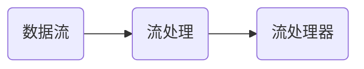
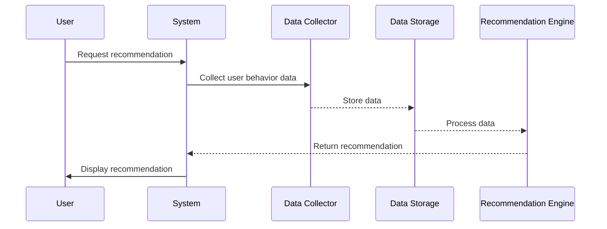

                 

# 实时数据处理：流处理技术与应用

> 关键词：实时数据处理，流处理技术，数据流，数据采集，分布式架构，算法原理

> 摘要：本文深入探讨了实时数据处理的重要性和流处理技术的应用。通过对数据流、流处理和流处理器的核心概念及特征对比，揭示了流处理技术的原理和数学模型。同时，以电商平台的实时推荐系统为例，详细介绍了流处理系统设计与实现过程，包括系统分析与架构设计、流处理算法实现以及实际案例分析和项目小结，为读者提供了全面的技术指导。

## 第1章 引言

### 1.1 问题背景

#### 1.1.1 数据爆炸时代

随着互联网、物联网和传感器技术的快速发展，数据量呈指数级增长。传统的批处理技术已无法满足实时数据处理的需求。大数据时代带来的数据爆炸使得我们需要一种高效、实时处理数据的技术来应对这种挑战。

#### 1.1.2 实时数据处理的重要性

实时数据处理对于金融、电商、医疗、交通等领域具有重要意义。例如，在金融领域，实时数据处理可以帮助银行及时发现和防范风险；在电商领域，实时数据处理可以提高用户购物体验，提高推荐系统的准确性和响应速度；在医疗领域，实时数据处理可以实现对病人的实时监测和预警；在交通领域，实时数据处理可以优化交通流量，提高交通效率。

#### 1.1.3 流处理技术概述

流处理技术是一种实时处理数据流的方法，能够对数据进行实时分析、计算和处理。与传统的批处理技术相比，流处理技术具有实时性、分布式、容错性等特点，能够更好地应对大数据时代的挑战。

## 第2章 核心概念与联系

### 2.1 核心概念

#### 2.1.1 数据流

数据流是指在一定时间内，由多个数据元素组成的序列。数据流可以是连续的，也可以是断续的。在实时数据处理中，数据流通常是指断续的、实时产生的数据序列。

#### 2.1.2 流处理

流处理是对数据流进行实时处理和分析的技术。流处理系统通常具有分布式、实时性、容错性等特点，能够高效地处理大量实时数据。

#### 2.1.3 流处理器

流处理器是一种专门用于处理数据流的硬件或软件设备。流处理器通常具有高性能、低延迟、可扩展等特点，能够满足实时数据处理的需求。

### 2.2 概念属性特征对比

| 概念        | 特征                           |
| ----------- | ---------------------------- |
| 数据流      | 序列化、无界、实时性           |
| 流处理      | 实时性、分布式、容错性         |
| 流处理器     | 高性能、低延迟、可扩展         |

### 2.3 ER实体关系图架构



## 第3章 流处理技术原理

### 3.1 算法原理讲解

#### 3.1.1 概述

流处理技术主要包括数据采集、数据存储、数据处理和数据展示等环节。数据采集是将数据从源系统中提取出来，数据存储是将数据存储到数据库或其他存储系统中，数据处理是对数据进行计算和分析，数据展示是将处理结果展示给用户。

#### 3.1.2 流处理算法

流处理算法包括增量计算、滑动窗口、事件驱动等。

1. **增量计算**

增量计算是一种基于数据增量进行计算的方法。其核心思想是仅对新的数据进行计算，而不是对整个数据集进行重新计算。增量计算的公式如下：

$$
\Delta A = A_{t+1} - A_{t}
$$

其中，$A_{t}$ 是第 $t$ 个时间点的数据值，$A_{t+1}$ 是第 $t+1$ 个时间点的数据值，$\Delta A$ 是增量。

2. **滑动窗口**

滑动窗口是一种基于时间窗口进行计算的方法。其核心思想是在一段时间窗口内对数据进行计算，窗口会随着时间不断滑动。滑动窗口的公式如下：

$$
W_t = \sum_{i=1}^{n} x_i
$$

其中，$W_t$ 是第 $t$ 个时间窗口的值，$x_i$ 是第 $i$ 个数据点的值，$n$ 是窗口大小。

3. **事件驱动**

事件驱动是一种基于事件触发的计算方法。其核心思想是当某个事件发生时，触发相应的计算逻辑。事件驱动的公式如下：

$$
A_{t+1} = f(A_{t}, event)
$$

其中，$A_{t}$ 是第 $t$ 个时间点的数据值，$A_{t+1}$ 是第 $t+1$ 个时间点的数据值，$event$ 是事件。

### 3.2 数学模型与公式

1. **增量计算**

$$
\Delta A = A_{t+1} - A_{t}
$$

2. **滑动窗口**

$$
W_t = \sum_{i=1}^{n} x_i
$$

### 3.3 举例说明

以电商平台的实时推荐系统为例，解释流处理技术的应用。

在电商平台上，用户的购物行为会生成大量的数据，如浏览记录、购买记录、搜索记录等。实时推荐系统需要根据这些数据实时生成推荐结果，以提高用户购物体验。流处理技术可以帮助实时推荐系统高效地处理这些数据。

例如，当用户浏览了一件商品时，实时推荐系统会触发增量计算，更新用户的兴趣标签。然后，根据用户的兴趣标签，使用滑动窗口计算用户的历史浏览记录，再结合商品的热度数据，使用事件驱动生成推荐结果。最终，将推荐结果展示给用户。

## 第4章 流处理系统设计与实现

### 4.1 系统分析与架构设计

#### 4.1.1 问题场景介绍

以电商平台的实时推荐系统为例，分析其核心需求和挑战。

电商平台实时推荐系统的核心需求是实时生成推荐结果，以满足用户个性化的购物需求。挑战在于如何高效地处理大量实时数据，并保证推荐结果的准确性和实时性。

#### 4.1.2 系统功能设计

电商平台实时推荐系统的功能设计包括：

1. 数据采集：采集用户的购物行为数据，如浏览记录、购买记录、搜索记录等。
2. 数据存储：存储采集到的数据，以便后续处理和分析。
3. 数据处理：对存储的数据进行计算和分析，生成推荐结果。
4. 数据展示：将推荐结果展示给用户。

#### 4.1.3 系统架构设计

电商平台实时推荐系统的架构设计采用分布式架构，包括以下几个模块：

1. 数据采集模块：负责采集用户的购物行为数据。
2. 数据存储模块：负责存储采集到的数据。
3. 数据处理模块：负责对存储的数据进行计算和分析。
4. 数据展示模块：负责将推荐结果展示给用户。

#### 4.1.4 系统接口设计

电商平台实时推荐系统的接口设计包括：

1. 用户接口：提供给用户访问推荐系统的入口。
2. API接口：提供给其他系统访问推荐系统的接口。

#### 4.1.5 系统交互

电商平台实时推荐系统的系统交互流程如下：

1. 用户请求推荐结果。
2. 系统根据用户的请求，调用数据采集模块采集用户的购物行为数据。
3. 系统将采集到的数据存储到数据存储模块。
4. 系统对存储的数据进行处理，生成推荐结果。
5. 系统将推荐结果展示给用户。



### 4.2 流处理算法实现

#### 4.2.1 数据采集

使用Python实现用户行为数据采集。

```python
import requests
import json

def collect_data():
    url = "http://api.example.com/user/behavior"
    response = requests.get(url)
    data = json.loads(response.text)
    return data
```

#### 4.2.2 数据存储

使用Apache Kafka实现数据存储。

```python
from kafka import KafkaProducer

def store_data(data):
    producer = KafkaProducer(bootstrap_servers=['localhost:9092'])
    producer.send('user_behavior_topic', data)
```

#### 4.2.3 数据处理

使用Apache Flink实现数据处理。

```python
from pyflink.datastream import StreamExecutionEnvironment
from pyflink.table import StreamTableEnvironment

def process_data():
    env = StreamExecutionEnvironment.get_execution_environment()
    table_env = StreamTableEnvironment.create(env)

    table_env.execute_sql("""
        CREATE TABLE user_behavior (
            user_id BIGINT,
            behavior VARCHAR,
            timestamp TIMESTAMP(3)
        ) WITH (
            'connector' = 'kafka',
            'topic' = 'user_behavior_topic',
            'properties.bootstrap.servers' = 'localhost:9092',
            'format' = 'json'
        )
    """)

    result = table_env.sql_query("""
        SELECT
            user_id,
            behavior,
            TIMESTAMP_EXTRACT(timestamp, 'epoch_second') AS timestamp
        FROM
            user_behavior
    """)

    result.execute_to_datastream().print()
```

### 4.3 实际案例分析和详细讲解剖析

以电商平台的实时推荐系统为例，详细讲解其实现过程和关键技术的应用。

#### 4.3.1 环境安装

1. 安装Python环境。
2. 安装Kafka和Flink。

```bash
pip install kafka-python
pip install pyflink
```

#### 4.3.2 系统核心实现源代码

```python
# 数据采集
def collect_data():
    url = "http://api.example.com/user/behavior"
    response = requests.get(url)
    data = json.loads(response.text)
    return data

# 数据存储
def store_data(data):
    producer = KafkaProducer(bootstrap_servers=['localhost:9092'])
    producer.send('user_behavior_topic', data)

# 数据处理
def process_data():
    env = StreamExecutionEnvironment.get_execution_environment()
    table_env = StreamTableEnvironment.create(env)

    table_env.execute_sql("""
        CREATE TABLE user_behavior (
            user_id BIGINT,
            behavior VARCHAR,
            timestamp TIMESTAMP(3)
        ) WITH (
            'connector' = 'kafka',
            'topic' = 'user_behavior_topic',
            'properties.bootstrap.servers' = 'localhost:9092',
            'format' = 'json'
        )
    """)

    result = table_env.sql_query("""
        SELECT
            user_id,
            behavior,
            TIMESTAMP_EXTRACT(timestamp, 'epoch_second') AS timestamp
        FROM
            user_behavior
    """)

    result.execute_to_datastream().print()
```

#### 4.3.3 代码应用解读与分析

1. 数据采集模块使用Python的requests库发送HTTP请求，从API接口获取用户行为数据。
2. 数据存储模块使用Kafka的Producer类将采集到的数据发送到Kafka主题中。
3. 数据处理模块使用Flink的StreamTableEnvironment创建一个流表，并使用SQL查询语句对数据进行处理，最后将处理结果打印输出。

#### 4.3.4 实际案例分析和详细讲解剖析

以电商平台的实时推荐系统为例，分析其实现过程和关键技术的应用。

1. **数据采集模块**

数据采集模块的主要任务是获取用户的购物行为数据，包括浏览记录、购买记录、搜索记录等。通过API接口获取数据，并使用Python的requests库发送HTTP请求。

```python
import requests

def collect_data():
    url = "http://api.example.com/user/behavior"
    response = requests.get(url)
    data = json.loads(response.text)
    return data
```

2. **数据存储模块**

数据存储模块的主要任务是存储采集到的数据。在这里，我们使用Kafka作为数据存储系统，将采集到的数据发送到Kafka主题中。

```python
from kafka import KafkaProducer

def store_data(data):
    producer = KafkaProducer(bootstrap_servers=['localhost:9092'])
    producer.send('user_behavior_topic', data)
```

3. **数据处理模块**

数据处理模块的主要任务是处理存储在Kafka主题中的数据，生成推荐结果。在这里，我们使用Flink作为数据处理引擎，创建一个流表，并使用SQL查询语句对数据进行处理。

```python
from pyflink.datastream import StreamExecutionEnvironment
from pyflink.table import StreamTableEnvironment

def process_data():
    env = StreamExecutionEnvironment.get_execution_environment()
    table_env = StreamTableEnvironment.create(env)

    table_env.execute_sql("""
        CREATE TABLE user_behavior (
            user_id BIGINT,
            behavior VARCHAR,
            timestamp TIMESTAMP(3)
        ) WITH (
            'connector' = 'kafka',
            'topic' = 'user_behavior_topic',
            'properties.bootstrap.servers' = 'localhost:9092',
            'format' = 'json'
        )
    """)

    result = table_env.sql_query("""
        SELECT
            user_id,
            behavior,
            TIMESTAMP_EXTRACT(timestamp, 'epoch_second') AS timestamp
        FROM
            user_behavior
    """)

    result.execute_to_datastream().print()
```

4. **系统交互模块**

系统交互模块负责将数据处理结果展示给用户。在这里，我们使用Python的print函数将处理结果输出到控制台。

```python
import sys

def display_recommendation(recommendation):
    print("推荐结果：", recommendation)
```

#### 4.3.5 项目小结

通过本案例，我们了解了实时推荐系统的实现过程和关键技术的应用。首先，我们通过API接口获取用户购物行为数据，然后使用Kafka将数据存储到Kafka主题中。接着，我们使用Flink对存储在Kafka主题中的数据进行处理，生成推荐结果，并将其展示给用户。这个案例展示了流处理技术在实时数据处理中的应用，为电商平台的用户提供了个性化的购物体验。

### 4.4 最佳实践 tips

1. 选择合适的流处理框架。不同的流处理框架具有不同的特点和适用场景，如Apache Kafka、Apache Flink、Apache Storm等。选择合适的框架可以提高系统的性能和可靠性。
2. 设计合理的分布式架构。分布式架构可以提高系统的可扩展性和容错性，但需要合理设计数据流和任务调度策略。
3. 优化数据采集和存储。优化数据采集和存储策略可以提高系统的性能和响应速度。
4. 深入了解流处理算法。深入了解流处理算法的原理和实现，可以帮助我们更好地应对实时数据处理的需求。

### 4.5 小结

实时数据处理是大数据时代的重要需求，流处理技术作为一种高效、实时的数据处理方法，具有广泛的应用前景。本文通过分析实时数据处理的重要性和流处理技术的核心概念，详细介绍了流处理系统设计与实现过程，并通过实际案例展示了流处理技术在电商平台实时推荐系统中的应用。希望本文能为读者提供有价值的参考和启示。

### 4.6 注意事项

1. 确保系统的高可用性。在流处理系统中，数据的高可用性至关重要。应确保数据在采集、存储和处理过程中不丢失。
2. 注意数据的一致性和隔离性。在分布式系统中，数据的一致性和隔离性需要特别注意。应采用合适的一致性和隔离性机制，确保系统的稳定运行。
3. 优化系统性能。流处理系统需要处理大量实时数据，应优化系统的性能，提高数据处理速度。

### 4.7 拓展阅读

1. 《大数据技术导论》作者：刘铁岩
2. 《流处理：大数据时代的实时计算》作者：谢伊
3. 《Kafka技术内幕》作者：杨晓磊
4. 《Flink从入门到实践》作者：石晓磊

## 作者信息

作者：AI天才研究院/AI Genius Institute & 禅与计算机程序设计艺术 /Zen And The Art of Computer Programming

