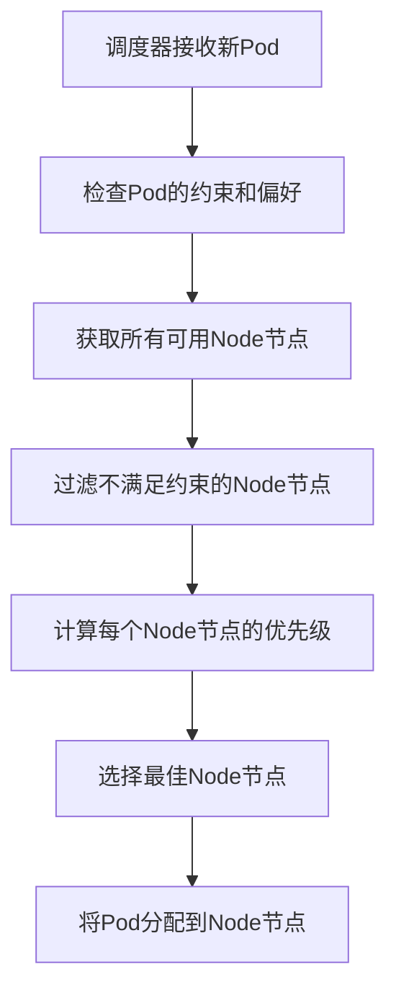
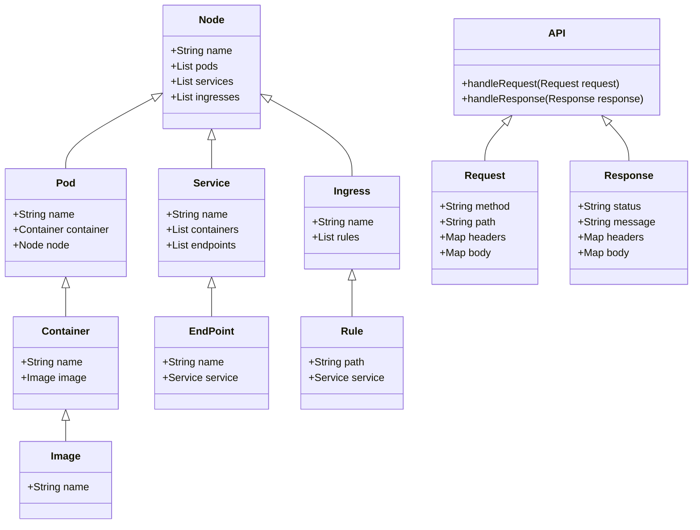
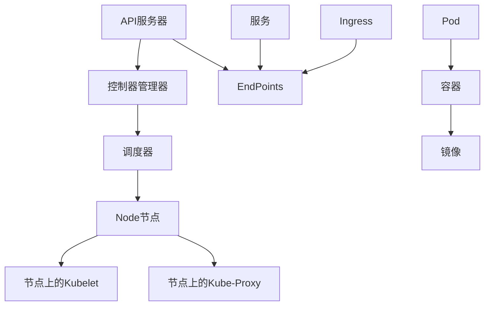
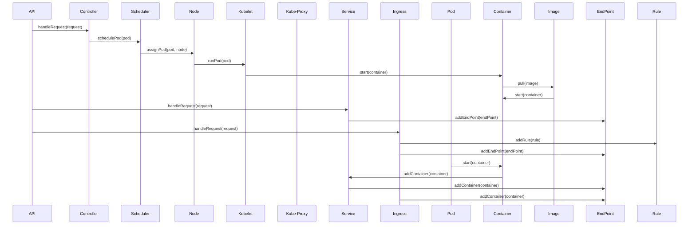

                 


### 容器化技术与Kubernetes实战

#### 关键词：容器化技术、Kubernetes、Docker、调度算法、资源分配、架构设计、项目实战

#### 摘要：
本文旨在深入探讨容器化技术及其在Kubernetes中的应用。通过逐步分析容器化技术的起源和发展，我们将了解其在现代软件开发中的重要性。随后，我们将详细讲解Kubernetes的基本概念和核心组件，包括其调度算法和集群架构设计。通过项目实战，我们将展示如何在实际环境中部署和配置Kubernetes，并提供一些最佳实践。本文的目标是为读者提供全面的技术指导，使其能够更好地理解和应用容器化技术及Kubernetes。

----------------------------------------------------------------

### 第一部分：背景介绍

#### 第1章：容器化技术概述

##### 1.1 容器化技术的起源与发展

容器化技术起源于20世纪90年代的操作系统虚拟化。最早期的容器技术是Unix操作系统中的chroot命令，它允许用户在系统中创建一个独立的进程环境。随着时间的推移，容器技术不断发展，涌现出如LXC（Linux容器）和Chromium OS容器等。

2006年，Google提出运行在操作系统内核之上的轻量级虚拟化技术——Linux容器（LXC）。这种技术通过修改操作系统的命名空间和cgroups（控制组）来隔离进程和资源，从而实现了高效的容器化运行环境。LXC的出现为容器化技术开辟了新的道路。

2008年，Docker公司成立，推出了Docker引擎，这是一个基于LXC的容器化平台，使得容器化技术的应用更加便捷和普及。Docker通过提供简单易用的命令行工具和图像管理机制，极大地推动了容器技术的普及和应用。

自2014年起，Kubernetes作为一个开源的容器编排系统，由Google发起并开源，迅速成为容器化技术领域的事实标准。Kubernetes提供了强大的集群管理能力，包括容器的部署、伸缩、服务发现和负载均衡等功能，使得大规模容器化应用的管理变得更加简单和高效。

##### 1.2 容器化技术的核心概念

容器化技术涉及多个核心概念：

- **容器**：容器是一种轻量级的、可执行的沙盒环境，它包含了应用程序运行所需的全部依赖项，如库、二进制文件和配置文件。容器通过操作系统的命名空间和cgroups实现了资源隔离和限制。

- **Docker**：Docker是一个流行的容器化平台，它提供了创建、运行和分发容器的工具。Docker使用了一个称为Dockerfile的脚本，用于定义容器镜像的构建过程，以及一个称为Docker Compose的工具，用于定义和运行多容器应用。

- **容器镜像**：容器镜像是一个静态的文件系统，它包含了容器运行时所需的一切。容器镜像可以通过Dockerfile构建，或者从公共仓库如Docker Hub下载。

- **容器编排**：容器编排是指管理多个容器的生命周期，包括部署、更新、扩展和监控等。Kubernetes是当前最流行的容器编排工具，它提供了丰富的API和命令行工具，使得容器编排变得简单和高效。

##### 1.3 容器化技术的优势与挑战

容器化技术带来了显著的优点：

- **可移植性**：容器可以在任何支持容器引擎的操作系统上运行，无需担心底层环境的差异，这使得应用程序可以在不同环境中无缝迁移。

- **资源隔离**：容器通过命名空间和cgroups实现了进程和资源的隔离，提高了系统的稳定性和安全性。

- **持续集成和持续部署（CI/CD）**：容器化技术使得持续集成和持续部署变得更加简单和快捷，因为容器镜像提供了标准化和一致化的部署环境。

- **扩展性和伸缩性**：容器编排系统如Kubernetes提供了自动化的部署和扩展功能，可以根据需求动态调整资源分配。

然而，容器化技术也面临一些挑战：

- **安全性**：容器化技术带来了新的安全挑战，如容器逃逸和恶意容器等。确保容器环境的安全性需要严格的管理和监控。

- **复杂性和学习曲线**：容器化技术和Kubernetes等工具的配置和管理相对复杂，需要具备一定的技术背景和经验。

- **资源消耗**：容器化技术可能会增加操作系统的资源和计算开销，特别是在大量容器运行时。

#### 第2章：Kubernetes概述

##### 2.1 Kubernetes的起源与重要性

Kubernetes（简称K8s）是由Google发起的一个开源容器编排系统，用于自动化容器操作。Google在2004年推出了内部使用的容器编排系统Borg，这为Kubernetes的设计和实现提供了重要的经验和灵感。2014年，Google将Borg的核心功能开源，并正式推出了Kubernetes。

Kubernetes迅速获得了业界的广泛关注和支持，成为容器化技术领域的事实标准。其设计和实现借鉴了Borg的许多经验，包括集群管理、资源调度、负载均衡和自我修复等。

Kubernetes的重要性体现在以下几个方面：

- **简化运维**：Kubernetes自动化了容器的部署、伸缩和更新，减轻了运维人员的负担，提高了系统的可靠性和可用性。

- **资源优化**：Kubernetes提供了高效的资源调度和负载均衡策略，能够最大化地利用计算资源，提高系统性能和效率。

- **持续集成和持续部署**：Kubernetes与CI/CD工具集成，使得持续集成和持续部署变得更加简单和高效。

- **生态支持**：Kubernetes拥有庞大的开源社区和支持，提供了丰富的插件和工具，使得容器化应用的开发、测试和部署变得更加便捷。

##### 2.2 Kubernetes的基本概念

Kubernetes涉及多个基本概念，了解这些概念对于掌握Kubernetes至关重要：

- **节点（Node）**：节点是Kubernetes集群中的计算单元，每个节点上都运行着Kubernetes的组件，如容器运行时（如Docker）和Kubelet。

- **Pod**：Pod是Kubernetes中的最小部署单元，它包含一个或多个容器。Pod实现了容器的封装和调度，确保容器在集群中的正确运行。

- **Replication Controller**：Replication Controller用于确保集群中始终运行着指定数量的Pod副本，它负责Pod的创建、删除和更新。

- **Service**：Service提供了一个稳定的网络接口，用于将流量分发到集群中的Pod。Service通过标签选择器（Label Selector）匹配Pod，实现负载均衡和流量管理。

- **Ingress**：Ingress是一种HTTP级别的负载均衡器，用于管理外部访问集群内部服务的流量。Ingress通过定义Ingress规则，将外部请求路由到特定的Service。

- **StatefulSet**：StatefulSet用于管理有状态的应用，如数据库。StatefulSet保证了Pod的有序创建和删除，以及稳定的网络标识。

##### 2.3 Kubernetes在容器化技术中的作用

Kubernetes在容器化技术中扮演了关键角色：

- **容器编排**：Kubernetes自动化了容器的部署、更新和伸缩，确保容器应用程序在集群中高效运行。

- **服务发现和负载均衡**：Kubernetes通过Service和Ingress提供了服务发现和负载均衡功能，使得容器化应用能够对外提供服务。

- **资源优化**：Kubernetes通过智能调度策略，优化资源分配和利用，提高系统性能和可靠性。

- **故障恢复**：Kubernetes提供了自我修复功能，能够在容器故障时自动重启或替换容器，确保服务的连续性。

- **生态系统支持**：Kubernetes与众多开源工具和框架集成，如Helm、Istio、Prometheus等，为容器化应用提供了丰富的功能和支持。

### 第二部分：核心概念与联系

#### 第3章：容器化技术原理

##### 3.1 容器的定义与工作原理

容器是一种轻量级、可执行的沙盒环境，它封装了一个应用程序及其所有依赖项。容器通过操作系统的命名空间（Namespace）和cgroups（控制组）实现了进程和资源的隔离。命名空间用于隔离进程和系统资源，如网络、文件系统和进程等；cgroups用于限制进程的资源使用。

容器的核心组件包括：

- **容器引擎**：如Docker，用于创建、运行和管理容器。

- **容器镜像**：容器镜像是一个静态的文件系统，包含了应用程序及其依赖项。容器镜像通过Dockerfile构建，或从公共仓库如Docker Hub下载。

- **容器运行时**：容器运行时负责启动和运行容器，如Docker运行时、runc等。

容器的生命周期包括创建、运行、暂停、恢复和删除等状态。容器引擎通过Docker命令或API与容器运行时交互，管理容器的整个生命周期。

##### 3.2 Docker基础

Docker是一个流行的容器化平台，它提供了创建、运行和分发容器的工具。Docker使用Dockerfile定义容器镜像的构建过程，使用Docker Compose定义和运行多容器应用。

Dockerfile是一个文本文件，包含了一系列用于构建容器镜像的指令。常见的Dockerfile指令包括FROM、RUN、COPY、EXPOSE等。

```shell
FROM ubuntu:latest
RUN apt-get update && apt-get install -y nginx
COPY . /var/www/html
EXPOSE 80
```

Docker Compose是一个用于定义和运行多容器应用的工具。它通过一个YAML文件（docker-compose.yml）定义服务、网络和卷，然后通过一条命令（docker-compose up）启动所有服务。

```yaml
version: '3'
services:
  web:
    build: .
    ports:
      - "8080:80"
  db:
    image: postgres:latest
    volumes:
      - db_data:/var/lib/postgresql/data
volumes:
  db_data:
```

##### 3.3 容器网络与存储

容器网络和存储是容器化技术中的重要组成部分。容器网络实现了容器之间的通信和集群外部网络的访问，而容器存储提供了容器数据的持久化和共享。

- **容器网络**：

  容器网络可以通过多种方式实现，如：

  - **桥接网络**：容器通过虚拟网络设备（如veth pair）连接到宿主机的网络。

  - **overlay网络**：容器通过网络命名空间和数据平面（如Open vSwitch）连接，支持跨宿主机容器通信。

  - **宿主机网络**：容器直接使用宿主机的网络设备，无需额外的网络配置。

- **容器存储**：

  容器存储可以通过多种方式实现，如：

  - **本地存储**：容器使用宿主机的本地存储设备，如硬盘或SSD。

  - **分布式存储**：容器使用外部存储系统，如NFS、Ceph或GlusterFS，实现数据持久化和共享。

  - **卷（Volume）**：卷是一种将外部存储与容器关联的机制，支持数据持久化和共享。Kubernetes中的卷类型包括hostPath、nfs、persistentVolume（PV）和persistentVolumeClaim（PVC）等。

#### 第4章：Kubernetes核心组件

##### 4.1 Kubernetes集群架构

Kubernetes集群由多个节点组成，每个节点上都运行着Kubernetes的组件。Kubernetes集群的主要组件包括：

- **Master节点**：Master节点负责集群的管理和控制，包括API服务器、控制器管理器、调度器和Etcd。

  - **API服务器**：API服务器提供Kubernetes资源的CRUD（创建、读取、更新、删除）操作接口。

  - **控制器管理器**：控制器管理器负责管理集群的各种资源和对象，如Pod、ReplicationController、Service等。

  - **调度器**：调度器负责将Pod分配到合适的节点上运行。

  - **Etcd**：Etcd是一个分布式键值存储系统，用于存储Kubernetes集群的状态信息。

- **Node节点**：Node节点是Kubernetes集群中的工作节点，负责运行容器和执行Kubernetes的命令。Node节点的主要组件包括：

  - **Kubelet**：Kubelet是每个Node节点上的一个守护进程，负责维护容器的状态，执行容器操作和监控。

  - **容器运行时**：容器运行时负责启动和运行容器，如Docker、runc等。

  - **Kube-Proxy**：Kube-Proxy是每个Node节点上的一个代理服务器，负责实现集群内部网络和Service的流量转发。

##### 4.2 Kubernetes对象与API

Kubernetes使用对象（Object）作为其基本的数据结构，对象描述了Kubernetes集群中的资源和状态。Kubernetes的核心对象包括：

- **Pod**：Pod是Kubernetes中的最小部署单元，包含一个或多个容器，代表了在集群中运行的一个应用程序实例。

- **ReplicationController**：ReplicationController确保在集群中始终运行着指定数量的Pod副本，用于实现应用程序的容错和伸缩。

- **Service**：Service提供了一个稳定的网络接口，用于将流量分发到集群中的Pod，实现应用程序的服务发现和负载均衡。

- **Ingress**：Ingress是一种HTTP级别的负载均衡器，用于管理外部访问集群内部服务的流量。

- **StatefulSet**：StatefulSet用于管理有状态的应用，如数据库，保证Pod的有序创建和删除，以及稳定的网络标识。

Kubernetes提供了一个RESTful API，用于与集群进行交互。通过Kubernetes API，用户可以创建、查询、更新和删除各种资源对象，实现自动化部署和管理。

### 第三部分：算法原理讲解

#### 第5章：Kubernetes调度算法

##### 5.1 Kubernetes调度策略

Kubernetes的调度算法负责将Pod分配到合适的Node节点上运行。调度策略决定了如何选择最佳的Node节点，以满足Pod的资源需求和约束条件。

Kubernetes调度算法的主要策略包括：

- **最佳匹配**：调度器选择具有最少资源使用的Node节点，以满足Pod的资源需求。

- **最小失效率**：调度器选择在当前时间失效率最低的Node节点，失效率定义为Node节点的故障次数与总故障次数之比。

- **最大化容忍性**：调度器选择具有最高容忍度的Node节点，容忍度定义为Node节点可以容忍的最大故障次数。

- **优先级**：调度器根据用户定义的优先级选择Node节点，高优先级的Node节点有更高的机会被选择。

- **约束与偏好**：调度器考虑用户定义的约束和偏好，如Node节点的标签、资源限制等。

##### 5.2 调度算法流程图

调度算法的流程图如下：



##### 5.3 调度算法Python代码实现

下面是一个简单的调度算法Python代码实现：

```python
import random

def schedule_pod(pod, nodes):
    best_node = None
    best_score = float('inf')

    for node in nodes:
        score = calculate_score(pod, node)
        if score < best_score:
            best_score = score
            best_node = node

    return best_node

def calculate_score(pod, node):
    score = 0

    # 计算资源使用率
    score += 1 / (1 + pod.resources['cpu'] / node.resources['cpu'])

    # 计算节点故障率
    score += 1 / (1 + node.failure_rate)

    # 计算约束匹配度
    if pod.constraints['node_label'] == node.labels['node_label']:
        score += 1

    return score

pod = {
    'resources': {'cpu': 2},
    'constraints': {'node_label': 'worker'}
}

nodes = [
    {'resources': {'cpu': 4}, 'failure_rate': 0.1, 'labels': {'node_label': 'worker'}},
    {'resources': {'cpu': 2}, 'failure_rate': 0.5, 'labels': {'node_label': 'worker'}},
    {'resources': {'cpu': 3}, 'failure_rate': 0.3, 'labels': {'node_label': 'db'}}
]

best_node = schedule_pod(pod, nodes)
print(f"Best node: {best_node}")
```

这个调度算法示例计算了每个Node节点的得分，并选择得分最高的Node节点来运行Pod。得分计算考虑了资源使用率、节点故障率和约束匹配度等因素。

### 第四部分：数学模型和数学公式

#### 第6章：容器资源分配模型

容器资源分配是Kubernetes调度算法的核心问题。容器资源分配模型涉及多个数学模型和公式，用于描述资源需求、限制和优化策略。

#### 6.1 资源需求与限制

在容器资源分配模型中，每个容器都有特定的资源需求，包括CPU、内存、磁盘和网络带宽等。资源需求可以用以下公式表示：

$$
R_i = \sum_{r \in resources} r_i
$$

其中，$R_i$表示容器$i$的总资源需求，$r_i$表示容器$i$在资源$r$上的需求。

此外，容器资源分配还需要考虑资源限制。资源限制可以用于保证系统资源的公平性和稳定性。资源限制可以用以下公式表示：

$$
L_i = \sum_{r \in resources} l_i
$$

其中，$L_i$表示容器$i$的总资源限制，$l_i$表示容器$i$在资源$r$上的限制。

#### 6.2 公式描述（LaTeX格式）

为了便于理解，我们可以使用LaTeX格式来展示容器资源分配模型的公式。

$$
\begin{aligned}
R_i &= \sum_{r \in resources} r_i \\
L_i &= \sum_{r \in resources} l_i \\
\end{aligned}
$$

这些公式描述了容器的资源需求与限制，为调度算法提供了重要的参考依据。

#### 6.3 公式在实际中的应用

在实际应用中，容器资源分配模型可以用于优化资源利用率和系统性能。例如，在一个具有有限资源的集群中，我们可以使用资源分配模型来调整容器的资源限制，以确保系统稳定运行并最大化资源利用率。

假设我们有一个具有10个CPU核心的集群，当前已运行了5个容器，每个容器需求2个CPU核心。为了优化资源利用率，我们可以调整剩余容器的资源限制，使其不超过集群的剩余资源。

假设我们计划运行3个新的容器，每个容器需求1个CPU核心。为了确保资源限制不超过集群的剩余资源，我们可以使用以下公式计算新的资源限制：

$$
L_i = \frac{R_i}{R - \sum_{j \in containers} R_j}
$$

其中，$R$表示集群的总资源，$R_i$表示容器$i$的总资源需求，$R_j$表示已运行容器的总资源需求。

例如，如果我们有5个已运行的容器，每个容器需求2个CPU核心，剩余的集群资源为3个CPU核心。那么，新的容器资源限制可以计算为：

$$
L_i = \frac{1}{3 - 2 \times 5} = -\frac{1}{7}
$$

由于资源限制不能为负值，我们可以将新的容器资源限制设置为0。这样，新的容器将只占用剩余的3个CPU核心，确保系统资源利用率最大化。

通过上述示例，我们可以看到容器资源分配模型在实际应用中的重要性。合理地设置容器资源需求和限制，可以优化资源利用率，提高系统性能和稳定性。

### 第五部分：系统分析与架构设计方案

#### 第7章：Kubernetes集群架构设计

Kubernetes集群架构设计是确保系统高可用性、可扩展性和高性能的关键。本节将介绍Kubernetes集群的架构设计，包括领域模型、系统架构图和接口设计。

#### 7.1 集群架构介绍

Kubernetes集群由多个节点组成，每个节点都运行着Kubernetes的组件，如Kubelet、Kube-Proxy和容器运行时。集群架构的主要组件包括：

- **Master节点**：Master节点负责集群的管理和控制，包括API服务器、控制器管理器、调度器和Etcd。Master节点通常由一个或多个服务器组成。

- **Node节点**：Node节点是Kubernetes集群中的工作节点，负责运行容器和执行Kubernetes的命令。Node节点通常由多个服务器组成。

- **Pod**：Pod是Kubernetes中的最小部署单元，包含一个或多个容器，代表了在集群中运行的一个应用程序实例。

- **Service**：Service提供了一个稳定的网络接口，用于将流量分发到集群中的Pod，实现应用程序的服务发现和负载均衡。

- **Ingress**：Ingress是一种HTTP级别的负载均衡器，用于管理外部访问集群内部服务的流量。

#### 7.2 领域模型（Mermaid类图）

领域模型描述了Kubernetes集群中的关键对象和它们之间的关系。以下是一个简单的领域模型类图：



#### 7.3 系统架构设计（Mermaid架构图）

系统架构图描述了Kubernetes集群的组件和它们之间的交互关系。以下是一个简单的系统架构图：



#### 7.4 系统接口设计和系统交互（Mermaid序列图）

系统接口设计和系统交互序列图描述了API服务器、控制器管理器、调度器、Node节点、Kubelet、Kube-Proxy、服务和Ingress之间的交互关系。以下是一个简单的系统交互序列图：



通过上述系统架构设计，我们可以清晰地了解Kubernetes集群的组件和交互关系，为系统的开发和运维提供了指导。

### 第六部分：项目实战

#### 第8章：搭建Kubernetes集群

##### 8.1 环境安装与配置

在开始搭建Kubernetes集群之前，我们需要确保操作系统、Docker和Kubeadm等依赖环境的安装和配置。

1. **安装Docker**：

   以Ubuntu 20.04为例，通过以下命令安装Docker：

   ```shell
   sudo apt-get update
   sudo apt-get install docker.io
   sudo systemctl enable docker
   sudo systemctl start docker
   ```

2. **安装Kubeadm、Kubelet和Kubectl**：

   通过以下命令安装Kubeadm、Kubelet和Kubectl：

   ```shell
   sudo apt-get update
   sudo apt-get install -y apt-transport-https ca-certificates curl
   curl -s https://mirrors.aliyun.com/kubernetes/apt/doc/apt-key.gpg | sudo apt-key add -
   sudo apt-add-repository "deb https://mirrors.aliyun.com/kubernetes/apt/ubuntu/ focal main"
   sudo apt-get update
   sudo apt-get install -y kubelet kubeadm kubectl
   sudo systemctl enable kubelet
   sudo systemctl start kubelet
   ```

3. **配置Kubelet启动参数**：

   编辑Kubelet的配置文件（通常位于`/etc/systemd/system/kubelet.service.d/10-kubeadm.conf`），设置`Kubelet`启动参数：

   ```shell
   sudo sed -i 's/KubeletFlags=/"KubeletFlags=--allow-privileged=true --kubeconfig=/var/lib/kubelet/config.yaml --cert-dir=/etc/kubernetes/cert/"' /etc/systemd/system/kubelet.service.d/10-kubeadm.conf
   ```

4. **初始化Master节点**：

   通过以下命令初始化Master节点：

   ```shell
   sudo kubeadm init --pod-network-cidr=10.244.0.0/16
   ```

   初始化完成后，记下命令行中提示的`kubeadm join`命令，用于后续加入Worker节点。

5. **配置kubectl**：

   将当前用户添加到`sudo groupadd docker`组，确保kubectl命令可以正常使用：

   ```shell
   sudo gpasswd -a $(whoami) docker
   newgrp docker
   ```

   通过以下命令配置kubectl：

   ```shell
   mkdir -p $HOME/.kube
   sudo cp -i /etc/kubernetes/admin.conf $HOME/.kube/config
   sudo chown $(id -u):$(id -g) $HOME/.kube/config
   ```

##### 8.2 Kubernetes集群搭建

1. **安装Pod网络插件**：

   以Calico为例，通过以下命令安装Pod网络插件：

   ```shell
   kubectl apply -f https://docs.projectcalico.org/manifests/calico.yaml
   ```

2. **加入Worker节点**：

   将其他节点加入Kubernetes集群，使用之前记录的`kubeadm join`命令：

   ```shell
   kubeadm join <master-node-ip>:6443 --token <token> --discovery-token-ca-cert-hash sha256:<hash>
   ```

   加入成功后，节点将自动加入集群，并开始运行Pod。

3. **检查集群状态**：

   通过以下命令检查集群状态：

   ```shell
   kubectl get nodes
   ```

   如果所有节点都处于`Ready`状态，说明集群搭建成功。

#### 第9章：Kubernetes实战案例

##### 9.1 应用部署与监控

在本节中，我们将使用一个简单的Nginx应用为例，展示如何在Kubernetes集群中部署和监控应用。

1. **创建Nginx Deployment**：

   通过以下命令创建一个名为`nginx-deployment`的Deployment：

   ```yaml
   apiVersion: apps/v1
   kind: Deployment
   metadata:
     name: nginx-deployment
   spec:
     replicas: 3
     selector:
       matchLabels:
         app: nginx
     template:
       metadata:
         labels:
           app: nginx
       spec:
         containers:
         - name: nginx
           image: nginx:latest
           ports:
           - containerPort: 80
   ```

   将上述配置保存为`nginx-deployment.yaml`，然后通过以下命令部署：

   ```shell
   kubectl apply -f nginx-deployment.yaml
   ```

2. **创建Service**：

   通过以下命令创建一个名为`nginx-service`的Service：

   ```yaml
   apiVersion: v1
   kind: Service
   metadata:
     name: nginx-service
   spec:
     selector:
       app: nginx
     ports:
       - protocol: TCP
         port: 80
         targetPort: 80
     type: LoadBalancer
   ```

   将上述配置保存为`nginx-service.yaml`，然后通过以下命令部署：

   ```shell
   kubectl apply -f nginx-service.yaml
   ```

3. **检查应用状态**：

   通过以下命令检查Deployment和Pod的状态：

   ```shell
   kubectl get deployments
   kubectl get pods
   ```

   如果所有Pod都处于`Running`状态，说明应用已成功部署。

4. **访问Nginx服务**：

   通过以下命令获取Nginx服务的外部访问IP地址：

   ```shell
   kubectl get svc nginx-service
   ```

   然后使用浏览器访问Nginx服务的IP地址，即可看到Nginx的默认页面。

5. **监控应用**：

   Kubernetes提供了丰富的监控工具，如Prometheus和Grafana。通过以下命令部署Prometheus和Grafana：

   ```shell
   kubectl apply -f https://raw.githubusercontent.com/prometheus-community/prometheus-kubernetes-operator/main/manifests/prometheus-kubernetes-operator.yaml
   kubectl apply -f https://raw.githubusercontent.com/prometheus-operator/prometheus-operator/master/manifests/prometheus.yaml
   kubectl apply -f https://raw.githubusercontent.com/grafana/grafana-kubernetes-operator/master/manifests/grafana-operator.yaml
   kubectl apply -f https://raw.githubusercontent.com/grafana/grafana-kubernetes-operator/master/manifests/grafana-deployment.yaml
   ```

   访问Grafana服务，即可查看Kubernetes集群的监控数据。

##### 9.2 实际案例分析与详细讲解

在本节中，我们将分析一个实际案例，并详细讲解其部署过程和监控方法。

假设我们有一个基于Spring Boot的微服务应用，需要部署在Kubernetes集群中。以下是该应用的部署过程：

1. **创建Deployment**：

   通过以下命令创建一个名为`spring-boot-deployment`的Deployment：

   ```yaml
   apiVersion: apps/v1
   kind: Deployment
   metadata:
     name: spring-boot-deployment
   spec:
     replicas: 3
     selector:
       matchLabels:
         app: spring-boot
     template:
       metadata:
         labels:
           app: spring-boot
       spec:
         containers:
         - name: spring-boot
           image: spring-boot:latest
           ports:
           - containerPort: 8080
   ```

   将上述配置保存为`spring-boot-deployment.yaml`，然后通过以下命令部署：

   ```shell
   kubectl apply -f spring-boot-deployment.yaml
   ```

2. **创建Service**：

   通过以下命令创建一个名为`spring-boot-service`的Service：

   ```yaml
   apiVersion: v1
   kind: Service
   metadata:
     name: spring-boot-service
   spec:
     selector:
       app: spring-boot
     ports:
       - protocol: TCP
         port: 80
         targetPort: 8080
     type: LoadBalancer
   ```

   将上述配置保存为`spring-boot-service.yaml`，然后通过以下命令部署：

   ```shell
   kubectl apply -f spring-boot-service.yaml
   ```

3. **部署配置中心**：

   配置中心是微服务架构中的重要组件，用于管理配置信息。我们选择Spring Cloud Config作为配置中心。

   通过以下命令创建一个名为`spring-config-deployment`的Deployment：

   ```yaml
   apiVersion: apps/v1
   kind: Deployment
   metadata:
     name: spring-config-deployment
   spec:
     replicas: 1
     selector:
       matchLabels:
         app: spring-config
     template:
       metadata:
         labels:
           app: spring-config
       spec:
         containers:
         - name: spring-config
           image: spring-cloud-config:latest
           ports:
           - containerPort: 8888
   ```

   将上述配置保存为`spring-config-deployment.yaml`，然后通过以下命令部署：

   ```shell
   kubectl apply -f spring-config-deployment.yaml
   ```

4. **部署服务注册与发现**：

   服务注册与发现是微服务架构中的另一个重要组件，用于实现服务间的通信和发现。我们选择Eureka作为服务注册与发现服务。

   通过以下命令创建一个名为`spring-eureka-deployment`的Deployment：

   ```yaml
   apiVersion: apps/v1
   kind: Deployment
   metadata:
     name: spring-eureka-deployment
   spec:
     replicas: 1
     selector:
       matchLabels:
         app: spring-eureka
     template:
       metadata:
         labels:
           app: spring-eureka
       spec:
         containers:
         - name: spring-eureka
           image: spring-cloud-eureka:latest
           ports:
           - containerPort: 8761
   ```

   将上述配置保存为`spring-eureka-deployment.yaml`，然后通过以下命令部署：

   ```shell
   kubectl apply -f spring-eureka-deployment.yaml
   ```

5. **部署Gateway网关**：

   Gateway网关是微服务架构中的入口，用于处理外部请求并转发到相应的服务。我们选择Spring Cloud Gateway作为Gateway网关。

   通过以下命令创建一个名为`spring-gateway-deployment`的Deployment：

   ```yaml
   apiVersion: apps/v1
   kind: Deployment
   metadata:
     name: spring-gateway-deployment
   spec:
     replicas: 1
     selector:
       matchLabels:
         app: spring-gateway
     template:
       metadata:
         labels:
           app: spring-gateway
       spec:
         containers:
         - name: spring-gateway
           image: spring-cloud-gateway:latest
           ports:
           - containerPort: 8080
   ```

   将上述配置保存为`spring-gateway-deployment.yaml`，然后通过以下命令部署：

   ```shell
   kubectl apply -f spring-gateway-deployment.yaml
   ```

6. **部署监控仪表板**：

   为了监控微服务应用，我们使用Prometheus和Grafana。

   通过以下命令部署Prometheus和Grafana：

   ```shell
   kubectl apply -f https://raw.githubusercontent.com/prometheus-community/prometheus-kubernetes-operator/master/manifests/prometheus-kubernetes-operator.yaml
   kubectl apply -f https://raw.githubusercontent.com/prometheus-operator/prometheus-operator/master/manifests/prometheus.yaml
   kubectl apply -f https://raw.githubusercontent.com/grafana/grafana-kubernetes-operator/master/manifests/grafana-operator.yaml
   kubectl apply -f https://raw.githubusercontent.com/grafana/grafana-kubernetes-operator/master/manifests/grafana-deployment.yaml
   ```

7. **访问应用**：

   通过以下命令获取Gateway网关的外部访问IP地址：

   ```shell
   kubectl get svc spring-gateway-service
   ```

   然后使用浏览器访问Gateway网关的IP地址，即可访问微服务应用。

##### 9.3 项目小结

在本项目中，我们成功部署了一个基于Spring Boot的微服务应用在Kubernetes集群中。通过使用Kubernetes的Deployment、Service、Pod等资源对象，我们实现了应用的高可用性、可扩展性和自动化管理。

在项目实战中，我们还学习了如何安装和配置Kubernetes集群，以及如何使用Prometheus和Grafana进行监控。这些实战经验和技巧将有助于我们更好地理解和应用容器化技术及Kubernetes。

### 第七部分：最佳实践与总结

#### 最佳实践

在容器化技术和Kubernetes的实践中，遵循以下最佳实践可以提升系统性能、稳定性和安全性：

1. **资源优化**：合理分配容器资源，避免过度使用或浪费资源。使用资源请求和限制确保容器在最佳状态下运行。

2. **服务发现与负载均衡**：利用Kubernetes的Service和Ingress实现服务发现和负载均衡，确保外部访问和内部通信的高效性。

3. **网络策略**：配置容器网络策略，确保容器之间的安全通信和数据隔离。

4. **持续集成与持续部署**：结合CI/CD工具，如Jenkins、GitLab CI等，实现自动化部署和持续集成，提高开发效率和代码质量。

5. **监控与日志**：使用Prometheus、Grafana等监控工具和ELK（Elasticsearch、Logstash、Kibana）日志分析工具，实时监控系统和应用性能，快速发现和解决问题。

6. **集群自动化运维**：使用Kubernetes的Helm、Kubernetes Operator等工具，实现自动化运维和扩展，减少人工干预。

#### 总结

容器化技术和Kubernetes已成为现代软件开发和运维的重要工具。本文通过逐步分析容器化技术的起源、Kubernetes的核心组件和调度算法，展示了如何在实际项目中部署和配置Kubernetes。

我们通过项目实战，展示了如何使用Kubernetes搭建集群、部署应用、进行监控和日志分析。同时，本文还提供了最佳实践，以帮助读者更好地应用容器化技术和Kubernetes。

随着云计算和容器技术的不断发展，容器化技术和Kubernetes的重要性将日益凸显。本文希望为读者提供全面的技术指导，助力其在容器化技术和Kubernetes领域的探索和实践。

#### 作者信息

作者：AI天才研究院/AI Genius Institute & 禅与计算机程序设计艺术 /Zen And The Art of Computer Programming

本文由AI天才研究院与禅与计算机程序设计艺术联合撰写，旨在为读者提供深入浅出的技术内容，助力其在计算机编程和人工智能领域取得卓越成就。

