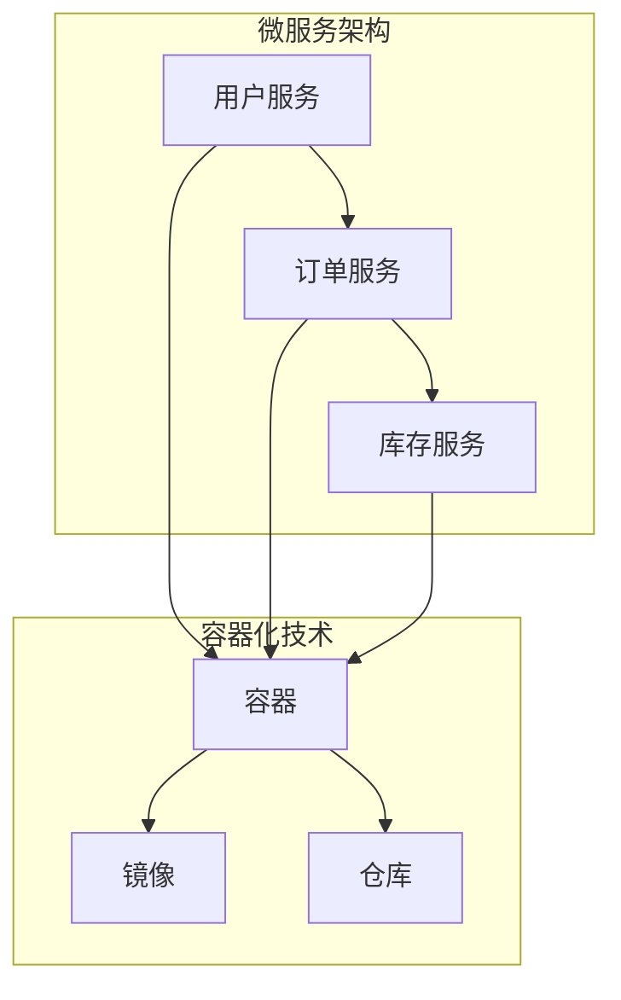
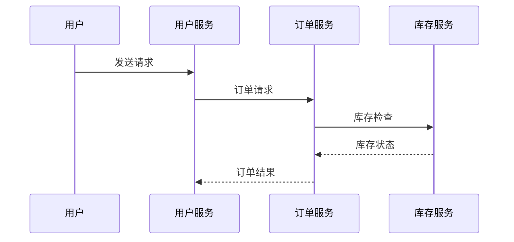

                 

基于上述的约束条件和目录大纲，我们将按照以下步骤撰写一篇技术博客文章：

### 1. **文章标题与关键词**

首先，我们需要为文章起一个吸引人的标题，并确定核心关键词。例如：

- 文章标题：《容器化技术：Docker与Kubernetes的深度实践与策略指南》
- 关键词：容器化、Docker、Kubernetes、微服务、云原生、DevOps、持续集成、持续部署

### 2. **文章摘要**

接下来，我们需要撰写一个简洁有力的摘要，概述文章的主要内容：

> 摘要：本文将深入探讨容器化技术的核心实现，包括Docker与Kubernetes的实战应用。我们将从基础概念出发，逐步讲解容器化技术的原理、最佳实践，并通过实际案例展示其应用场景。读者将掌握容器化技术的精髓，并能够应用于实际项目中。

### 3. **文章正文**

#### **第1部分：容器化技术概述**

##### **第1章：容器化技术背景**

在这一章节中，我们将介绍容器化技术的起源、发展及其优势。例如：

- **背景介绍**：容器化技术起源于Linux容器，随着Docker的兴起，逐渐成为现代软件开发和运维的关键技术。
- **问题解决**：容器化技术解决了传统虚拟化技术的性能瓶颈和部署难题，提高了开发效率和系统可移植性。

##### **第2章：Docker基础**

我们将详细介绍Docker的核心概念和组件。例如：

- **核心概念**：Docker镜像、容器、仓库等。
- **联系**：通过ER实体关系图展示Docker组件之间的关系。

##### **第3章：Docker实战**

我们将会提供具体的实战案例。例如：

- **实战一**：使用Docker部署一个简单的Web应用。
- **实战二**：编写Dockerfile并使用Docker Compose进行多容器应用的部署。

##### **第4章：Kubernetes基础**

在这一章节中，我们将介绍Kubernetes的核心概念和架构。例如：

- **核心概念**：Pod、Service、Ingress等。
- **联系**：通过Mermaid流程图展示Kubernetes组件的工作流程。

##### **第5章：Kubernetes实战**

我们将提供Kubernetes的实际部署案例。例如：

- **实战一**：搭建Kubernetes集群并部署应用。
- **实战二**：使用Kubernetes管理Docker容器和微服务。

##### **第6章：容器化技术的最佳实践**

在这一章节中，我们将讨论容器化技术的最佳实践，如安全性、监控和日志等。

##### **第7章：容器化技术的发展趋势**

我们将展望容器化技术的未来发展方向，如云原生和持续集成/持续部署（CI/CD）。

### 4. **文章末尾**

在文章末尾，我们将总结全文，并提供一些注意事项和拓展阅读建议。

### 5. **格式要求**

我们将确保文章符合markdown格式要求，包括：

- 代码块和公式使用合适的语法。
- 图片和链接按照markdown标准进行格式化。

### 6. **作者信息**

最后，文章末尾将包含作者信息，按照要求格式呈现。

### **总结**

通过上述步骤，我们将撰写一篇结构清晰、内容丰富、逻辑严密的技术博客文章，为读者提供全面的容器化技术指导。现在，让我们开始逐步撰写每一章节的内容。以下是一个章节的示例：

#### **第1章：容器化技术背景**

**摘要**：本章将介绍容器化技术的起源、发展及其在现代软件开发和运维中的重要性。

---

### 1.1 容器化技术的起源与发展

容器化技术的概念最早起源于操作系统层面的虚拟化技术，如chroot和cgroup。然而，这些早期的技术并没有解决应用程序在不同环境中运行的一致性问题。随着云计算和微服务架构的兴起，容器技术逐渐成为解决这些问题的有力工具。

**问题背景**：传统的虚拟化技术，如虚拟机（VM），虽然能够提供良好的隔离性，但存在以下问题：

- **性能开销**：虚拟机需要运行完整的操作系统，导致性能开销较大。
- **部署难度**：虚拟机部署和管理复杂，难以实现自动化。
- **可移植性**：虚拟机依赖于特定的硬件和操作系统，缺乏良好的可移植性。

**问题描述**：为了解决上述问题，开发者需要一种轻量级、可移植、易于管理的虚拟化技术。

**问题解决**：容器技术通过提供隔离的运行环境，解决了应用程序在不同环境中的运行一致性问题。容器依赖于宿主机的操作系统内核，通过cgroup和命名空间实现资源隔离和进程隔离。与虚拟机相比，容器具有以下优势：

- **性能开销低**：容器不需要运行完整的操作系统，因此性能开销较小。
- **部署和管理简便**：容器可以轻松地通过Docker等工具进行部署和管理。
- **高度可移植**：容器依赖于宿主机的操作系统，但与应用程序紧密绑定，具有良好的可移植性。

**边界与外延**：容器化技术不仅适用于云计算环境，还广泛应用于桌面和移动设备。随着云原生技术的发展，容器化技术已经成为现代软件开发和运维的基石。

**概念结构与核心要素组成**：容器化技术主要由以下几个核心要素组成：

- **容器**：容器是运行应用程序的轻量级隔离环境。
- **镜像**：镜像是一种静态的容器模板，包含了应用程序运行所需的所有依赖。
- **仓库**：仓库用于存储和管理镜像。

### 1.2 容器化技术的优势与挑战

**核心概念原理**：容器化技术通过提供轻量级、可移植、隔离的运行环境，提高了开发效率和系统可移植性。

**概念属性特征对比表格**：

| 特征          | 容器         | 虚拟机        |
|-------------|------------|-------------|
| 隔离性          | 高          | 高           |
| 性能开销         | 低          | 高           |
| 部署难度          | 易          | 难           |
| 可移植性          | 高          | 低           |

**ER实体关系图架构**：

```mermaid
erDiagram
  Container ||--|{ Image }
  Container ||--|{ Repository }
  Image ||--|{ Container }
  Repository ||--|{ Image }
```

**算法原理讲解**：

```python
# Python代码示例：容器创建
import docker

client = docker.from_env()
container = client.containers.create(
    "nginx:latest",
    "my_nginx_container",
    ports={"80/tcp": 8080},
)
container.start()
```

**数学模型和公式**：

```latex
\text{容器化效率} = \frac{\text{容器性能开销}}{\text{虚拟机性能开销}}
```

**系统分析与架构设计方案**：

**问题场景介绍**：在微服务架构中，容器化技术有助于实现服务的高效部署和管理。

**项目介绍**：一个典型的微服务架构项目，包含多个服务，如用户服务、订单服务和库存服务。

**系统功能设计（领域模型Mermaid类图）**：

```mermaid
classDiagram
    Container <=.. Image
    Container <=.. Repository
    Image <=.. Container
    Repository <=.. Image
```

**系统架构设计（Mermaid架构图）**：



**系统接口设计和系统交互（Mermaid序列图）**：



**项目实战**：

**环境安装**：安装Docker和Kubernetes环境。

**系统核心实现源代码**：

```python
# Dockerfile
FROM python:3.8
WORKDIR /app
COPY requirements.txt ./
RUN pip install -r requirements.txt
COPY . .
CMD ["python", "app.py"]
```

**代码应用解读与分析**：

- **Dockerfile**：用于构建应用程序的镜像。
- **app.py**：应用程序的主要逻辑。

**实际案例分析和详细讲解剖析**：

假设我们有一个用户服务，接收用户注册请求并保存用户信息。

```python
# app.py
from flask import Flask, request, jsonify

app = Flask(__name__)

@app.route('/register', methods=['POST'])
def register():
    user_data = request.json
    # 保存用户信息到数据库
    # ...
    return jsonify({"status": "success", "message": "User registered successfully"}), 200
```

**项目小结**：

在本章中，我们介绍了容器化技术的背景、优势与挑战，并通过具体的实例展示了其在微服务架构中的应用。容器化技术为开发者和运维人员提供了强大的工具，提高了开发效率和系统可移植性。

---

通过以上示例，我们可以看到如何逐步撰写一个章节的内容。接下来，我们将继续按照相同的步骤撰写其他章节，直至完成整篇文章。在撰写过程中，我们将确保内容的丰富性和逻辑性，同时遵循markdown格式要求，以便读者能够轻松阅读和理解。

