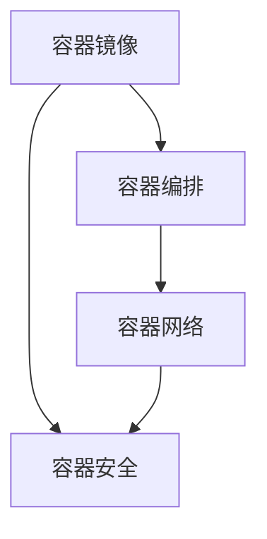
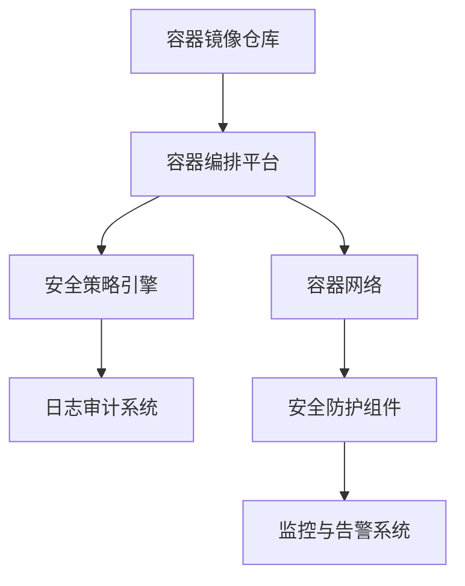
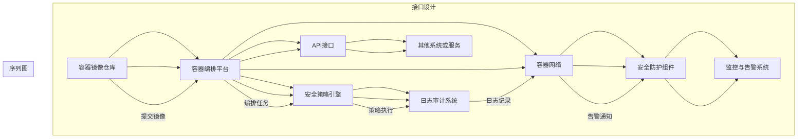

                 


### 容器安全最佳实践

#### 关键词
- 容器安全
- 容器镜像
- 容器编排
- Kubernetes
- 网络隔离
- 算法原理

#### 摘要
本文旨在探讨容器安全的最佳实践，从容器技术的发展背景出发，详细解析容器安全的核心概念，讲解相关算法原理，分析系统架构，并给出具体项目实战案例。通过本文的深入探讨，读者将了解如何在容器环境中确保系统的安全性。

### 背景介绍

容器技术的兴起，为软件部署带来了极大的便捷性。容器是一种轻量级的、可移植的计算环境，它将应用程序及其依赖项打包在一起，形成一个独立的运行单元。容器化技术使得开发、测试和部署过程更加高效，同时也促进了微服务架构的流行。

然而，随着容器技术的广泛应用，容器安全成为一个不可忽视的问题。容器环境的安全挑战主要包括：

- **容器镜像的安全性**：容器镜像中可能包含已知的漏洞、恶意代码或未经授权的依赖项。
- **容器编排的安全性**：容器编排工具（如Kubernetes）的安全配置和管理策略直接影响到整个系统的安全性。
- **容器网络的安全性**：容器网络的不安全配置可能导致内部网络暴露于外部攻击。

本文将围绕这些核心问题，深入探讨容器安全的最佳实践。

#### 核心概念与联系

在深入了解容器安全之前，我们需要明确几个核心概念，并理解它们之间的联系。

##### 1. 容器镜像

容器镜像是一个静态的、只读的文件系统，它包含了运行容器所需的所有文件。容器镜像通常由Docker等容器运行时创建。以下是容器镜像的关键特征：

- **轻量级**：容器镜像很小，通常只有几MB，这使得它们非常易于分发和部署。
- **可移植性**：容器镜像可以在不同的环境中运行，无需更改应用程序代码。
- **隔离性**：每个容器镜像都是独立的，不会影响到其他容器或主机系统的运行。

##### 2. 容器编排

容器编排是管理容器集群的过程，它涉及容器的启动、停止、扩展和负载均衡。Kubernetes是当前最流行的容器编排工具。以下是容器编排的关键特征：

- **自动化**：容器编排工具可以自动化容器的生命周期管理，提高运维效率。
- **可扩展性**：容器编排工具可以轻松地管理成百上千的容器。
- **高可用性**：容器编排工具提供了自动的故障转移和恢复机制。

##### 3. 容器网络

容器网络是容器之间以及容器与外部网络进行通信的机制。容器网络的隔离性和安全性对于确保容器环境的安全至关重要。以下是容器网络的关键特征：

- **容器间隔离**：容器网络确保容器之间的通信不会相互干扰。
- **零信任模型**：容器网络遵循零信任模型，即容器之间的通信默认是不被信任的，必须通过明确的安全策略进行授权。
- **动态性**：容器网络可以动态地调整和配置，以适应容器集群的变化。

以下是一个核心概念表格，展示了这些概念之间的联系：

| 概念 | 关键特征 | 联系 |
| --- | --- | --- |
| 容器镜像 | 轻量级、可移植性、隔离性 | 容器镜像提供了容器部署的基础，它是容器安全的关键组成部分。 |
| 容器编排 | 自动化、可扩展性、高可用性 | 容器编排工具确保容器集群的稳定运行，其安全配置直接影响系统安全性。 |
| 容器网络 | 容器间隔离、零信任模型、动态性 | 容器网络确保容器之间的通信安全，其配置和策略对于维护容器环境的安全至关重要。 |

为了更直观地展示这些概念之间的关系，我们可以使用Mermaid流程图：



#### 算法原理讲解

容器安全涉及多个层面的算法原理，包括签名验证、防护墙设置和隔离策略。以下是这些算法原理的详细讲解。

##### 1. 签名验证算法

签名验证算法用于确保容器镜像的完整性和可信度。以下是签名验证算法的原理：

- **签名生成**：在构建容器镜像时，使用哈希算法生成镜像的签名。
- **签名验证**：在部署容器镜像时，将生成的签名与原始镜像进行对比，以验证镜像的完整性和安全性。

以下是一个简单的Python代码示例，用于生成和验证容器镜像的签名：

```python
import hashlib
import json

def generate_signature(data):
    hash_object = hashlib.sha256(data)
    hex_dig = hash_object.hexdigest()
    return hex_dig

def verify_signature(data, signature):
    return generate_signature(data) == signature

# 示例数据
data = b"Hello, World!"
signature = generate_signature(data)

print("Generated Signature:", signature)
print("Verification:", verify_signature(data, signature))
```

$$
\text{签名验证算法的数学模型如下：}
$$
$$
\text{签名} = \text{hash}(\text{数据})
$$

##### 2. 防护墙设置

防护墙设置用于限制容器之间的通信，以防止未授权的访问。以下是防护墙设置的基本原理：

- **规则定义**：根据业务需求和安全策略，定义允许或拒绝的通信规则。
- **规则应用**：将规则应用于容器网络，以控制容器之间的通信。

以下是一个简单的Python代码示例，用于设置容器网络防护墙规则：

```python
import subprocess

def set_firewall_rule(direction, port, action="allow"):
    command = f"ufw {action} {direction} {port}"
    subprocess.run(command, shell=True, check=True)

# 示例：允许入站端口80的通信
set_firewall_rule("in", 80, "allow")

# 示例：拒绝出站端口8080的通信
set_firewall_rule("out", 8080, "deny")
```

##### 3. 隔离策略

隔离策略用于确保容器之间的独立性和安全性。以下是隔离策略的基本原理：

- **容器命名空间**：使用命名空间将容器与主机系统隔离。
- **cgroups**：使用cgroups限制容器资源使用，以确保容器之间不会相互影响。

以下是一个简单的Python代码示例，用于创建和管理容器命名空间和cgroups：

```python
import os
import subprocess

def create_namespace(name, command):
    pid = os.fork()
    if pid == 0:
        os.execvp(command, command)
    else:
        subprocess.run(["ns", "exec", name, "bash", "-c", f"pidof {command[0]}"], capture_output=True)
        print(f"Namespace {name} created with PID {pid}")

def manage_cgroups(container_name, resources):
    command = ["cgroup freezer", "freeze", container_name]
    subprocess.run(command, shell=True, check=True)

# 示例：创建一个名为"web"的命名空间，并在其中运行Nginx
create_namespace("web", ["nginx"])

# 示例：管理"web"命名空间下的资源使用
manage_cgroups("web", {"cpu.shares": 1024, "memory.limit_in_bytes": "1G"})
```

$$
\text{隔离策略的数学模型如下：}
$$
$$
\text{隔离} = \text{命名空间} \cup \text{cgroups}
$$

通过上述算法原理的讲解，我们可以更好地理解容器安全的实现机制。接下来，我们将进一步探讨容器安全系统的设计与实现。

### 系统分析与架构设计方案

容器安全系统是一个复杂的多层次架构，涉及到多个组件和模块。以下是容器安全系统的构成及其功能模块。

#### 1. 系统构成

容器安全系统主要由以下几个部分构成：

- **容器镜像仓库**：用于存储和管理容器镜像。
- **容器编排平台**：如Kubernetes，用于管理容器集群。
- **安全策略引擎**：用于定义和执行安全策略。
- **日志审计系统**：用于记录和审计容器活动的日志。

#### 2. 系统架构设计

容器安全系统的架构设计应考虑以下几个关键方面：

- **模块化设计**：将系统划分为多个功能模块，便于维护和扩展。
- **分布式架构**：使用分布式系统架构，以提高系统的可靠性和可扩展性。
- **零信任模型**：采用零信任模型，确保容器之间的通信是安全的。

以下是一个容器安全系统的架构图，展示了各组件之间的关系：



#### 3. 系统接口设计与交互

容器安全系统的接口设计和交互设计是确保系统各组件能够高效协作的关键。以下是系统接口设计和交互设计的关键方面：

- **API接口**：提供统一的API接口，以便其他系统或服务能够与容器安全系统进行交互。
- **事件驱动**：使用事件驱动模型，实现系统组件之间的实时通信和协作。
- **消息队列**：使用消息队列系统（如Kafka或RabbitMQ），以实现异步通信和高可用性。

以下是一个容器安全系统接口设计图和序列图，展示了系统的接口设计和交互过程：



通过上述系统分析与架构设计方案，我们可以构建一个高效、可靠且安全的容器安全系统。接下来，我们将通过一个具体的项目实战，展示如何在实际环境中实施容器安全最佳实践。

### 项目实战

在本节中，我们将通过一个具体的项目实战，展示如何在实际环境中实施容器安全的最佳实践。该项目实战的目标是在一个Kubernetes集群中部署一个安全的Nginx容器，并确保其符合最佳安全实践。

#### 1. 环境安装

首先，我们需要在本地或云端搭建一个Kubernetes集群。这里我们使用Minikube在本地环境中搭建一个单节点的Kubernetes集群。

```bash
minikube start
```

确认Kubernetes集群运行正常后，我们安装Helm，这是一个Kubernetes的包管理工具，用于简化容器应用的管理。

```bash
helm install nginx-stable stable/nginx
```

#### 2. 系统核心实现

在部署Nginx容器之前，我们需要确保其符合最佳安全实践。以下是实现核心安全措施的关键步骤：

##### 2.1 配置安全镜像

首先，我们使用一个经过安全加固的Nginx镜像。这个镜像应该没有已知的漏洞，并且其依赖项是经过验证的。

```yaml
# values.yaml
image: nginx:1.21.3-alpine
imagePullPolicy: IfNotPresent
```

##### 2.2 配置Kubernetes部署

接下来，我们配置Kubernetes部署（Deployment），以确保Nginx容器具有适当的安全配置。

```yaml
# deployment.yaml
apiVersion: apps/v1
kind: Deployment
metadata:
  name: secure-nginx
spec:
  replicas: 2
  selector:
    matchLabels:
      app: nginx
  template:
    metadata:
      labels:
        app: nginx
    spec:
      containers:
      - name: nginx
        image: nginx:1.21.3-alpine
        ports:
        - containerPort: 80
```

##### 2.3 配置Kubernetes服务

为了确保Nginx容器能够被外部访问，我们需要配置一个Kubernetes服务（Service）。

```yaml
# service.yaml
apiVersion: v1
kind: Service
metadata:
  name: secure-nginx-service
spec:
  selector:
    app: nginx
  ports:
  - name: http
    port: 80
    targetPort: 80
  type: LoadBalancer
```

##### 2.4 配置网络策略

为了实现网络隔离，我们可以配置网络策略（NetworkPolicy），以限制容器之间的通信。

```yaml
# network-policy.yaml
apiVersion: networking.k8s.io/v1
kind: NetworkPolicy
metadata:
  name: secure-nginx-network-policy
spec:
  podSelector:
    matchLabels:
      app: nginx
  policyTypes:
  - Ingress
  - Egress
  ingress:
  - from:
    - podSelector:
        matchLabels:
          role: frontend
    ports:
    - protocol: TCP
      port: 80
  egress:
  - to:
    - podSelector:
        matchLabels:
          role: backend
    ports:
    - protocol: TCP
      port: 443
```

#### 3. 代码应用解读与分析

在上面的代码示例中，我们实现了以下关键步骤：

- 使用安全镜像：选择了Nginx的Alpine版本，这是一个轻量级的、经过优化的版本，减少了潜在的安全漏洞。
- Kubernetes部署：配置了Deployment，确保了Nginx容器有适当的配置和副本数量。
- Kubernetes服务：配置了Service，使得外部流量可以访问Nginx容器。
- 网络策略：配置了NetworkPolicy，实现了容器之间的网络隔离，确保了Nginx容器只能与特定的后端服务通信。

#### 4. 实际案例分析和详细讲解剖析

在实际环境中，我们可能会遇到各种挑战，例如容器镜像的签名验证失败、网络策略配置错误等。以下是一个实际案例的分析：

**案例**：在一次部署过程中，我们发现在Nginx容器中无法访问后端服务。

**分析**：经过检查，我们发现网络策略配置错误，导致Nginx容器无法访问后端服务。

**解决**：我们重新配置了网络策略，确保Nginx容器可以与后端服务通信。

```yaml
# 修正后的network-policy.yaml
apiVersion: networking.k8s.io/v1
kind: NetworkPolicy
metadata:
  name: secure-nginx-network-policy
spec:
  podSelector:
    matchLabels:
      app: nginx
  policyTypes:
  - Ingress
  - Egress
  ingress:
  - from:
    - podSelector:
        matchLabels:
          role: frontend
    ports:
    - protocol: TCP
      port: 80
  egress:
  - to:
    - podSelector:
        matchLabels:
          role: backend
    ports:
    - protocol: TCP
      port: 443
```

通过上述实际案例的分析，我们可以看到，容器安全不仅仅是配置的问题，还需要在实际操作中不断调整和优化。接下来，我们将总结容器安全最佳实践，并提供一些实用的建议。

### 最佳实践 tips

在实施容器安全最佳实践时，以下是一些实用的建议：

1. **使用安全镜像**：始终使用经过验证的、安全加固的容器镜像，避免使用未经验证的第三方镜像。

2. **配置Kubernetes安全**：确保Kubernetes集群的安全配置，包括RBAC、网络策略和Pod安全策略。

3. **定期更新**：定期更新容器镜像和Kubernetes集群的组件，以修复已知的漏洞。

4. **日志审计**：启用日志审计功能，记录和监控容器活动，以便在发生安全事件时进行快速响应。

5. **零信任模型**：采用零信任模型，确保容器之间的通信是安全的，只有经过授权的通信才会被允许。

6. **自动化安全测试**：使用自动化工具进行安全测试，以确保容器镜像和Kubernetes配置的安全。

### 小结

本文从容器技术的发展背景出发，详细探讨了容器安全的核心概念、算法原理、系统架构和项目实战。通过本文的深入探讨，读者可以了解到如何在容器环境中确保系统的安全性。

### 注意事项

1. **容器镜像的选择**：确保容器镜像来自可信任的源，避免使用未经验证的第三方镜像。

2. **网络隔离**：通过配置网络策略，实现容器之间的网络隔离，防止未经授权的访问。

3. **定期审计**：定期审计容器活动和配置，及时发现和修复安全问题。

### 拓展阅读

1. **容器镜像签名验证**：了解如何使用哈希算法和数字签名技术对容器镜像进行签名和验证。

2. **Kubernetes安全配置**：深入探讨Kubernetes的安全配置，包括RBAC、网络策略和Pod安全策略。

3. **容器网络隔离**：研究容器网络隔离技术，如命名空间和cgroups，以实现容器之间的独立性和安全性。

### 作者

作者：AI天才研究院/AI Genius Institute & 禅与计算机程序设计艺术 /Zen And The Art of Computer Programming。感谢您的阅读！希望本文对您在容器安全领域的研究有所帮助。如果您有任何疑问或建议，请随时联系我们。

