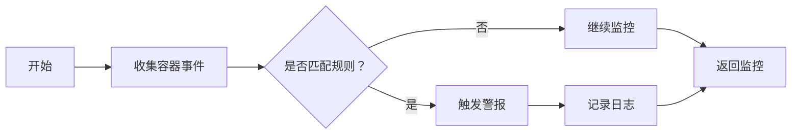
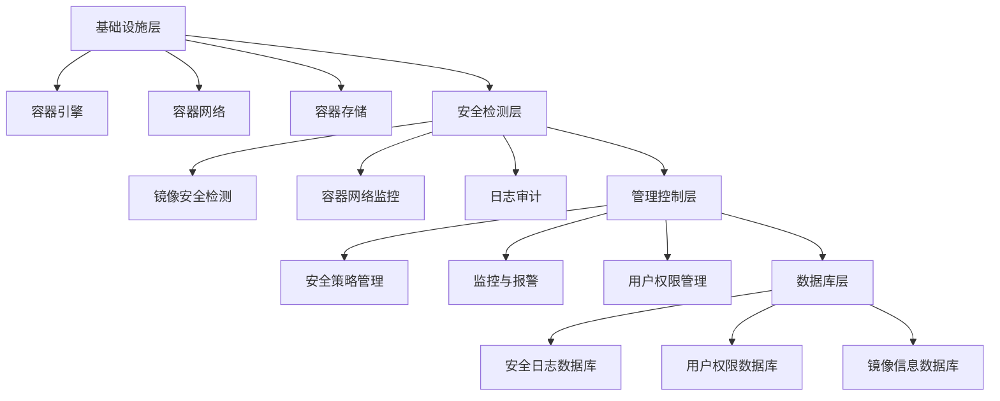
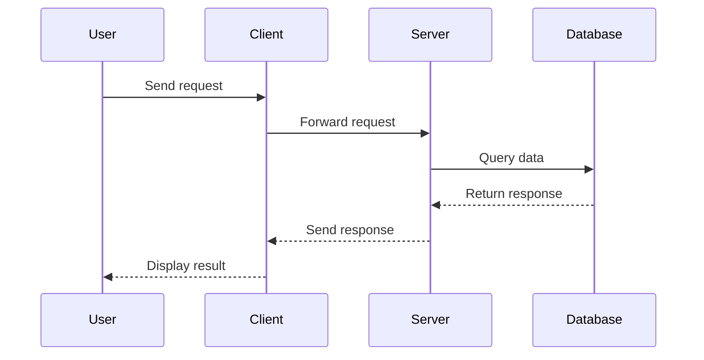
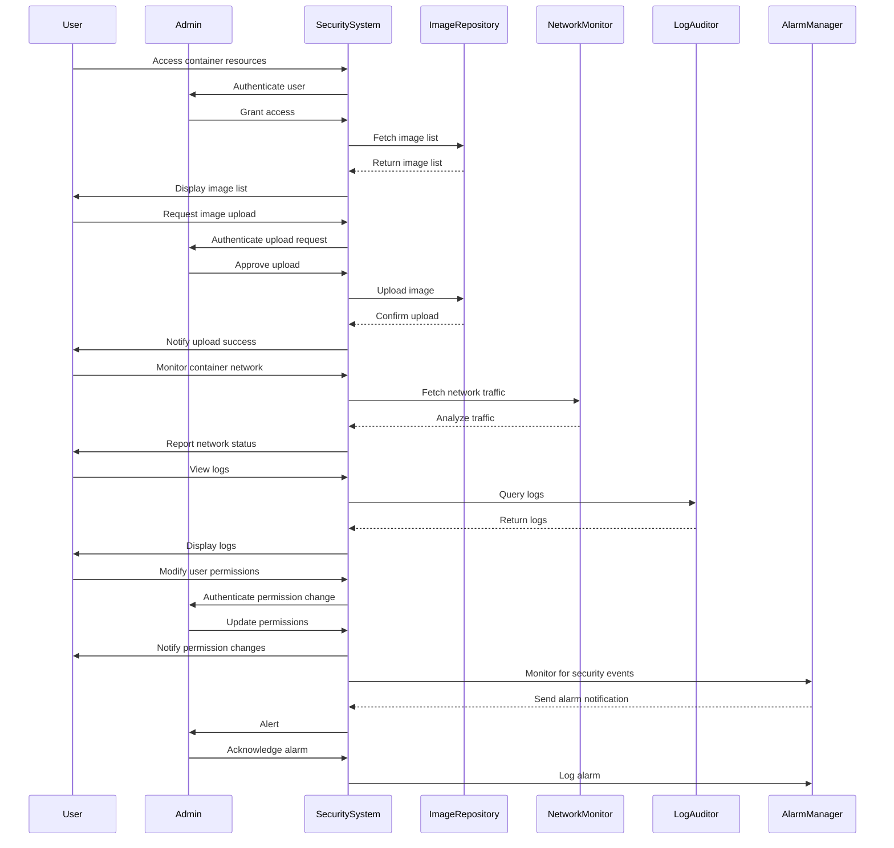

                 

### 《容器安全最佳实践》——引言

在现代云计算和微服务架构中，容器技术已经成为开发和部署应用程序的主流选择。其轻量级、可移植性强、快速部署和高密度运行等优势，使其广泛应用于各种生产环境中。然而，随着容器技术的普及，容器安全问题也逐渐显现，并成为企业和组织必须面对的挑战。

**关键词**：容器安全、最佳实践、云计算、微服务、安全性

容器安全的核心在于保护容器及其运行环境，防止恶意攻击和数据泄露。安全威胁不仅来自外部，还包括容器内部的恶意行为。针对这些挑战，我们需要采取一系列最佳实践来确保容器环境的安全性。

**摘要**：
本文将深入探讨容器安全的各个方面，从背景介绍、核心概念、算法原理、数学模型到系统架构设计、项目实战以及最佳实践。通过逻辑清晰、结构紧凑的讲解，帮助读者全面理解容器安全的重要性，掌握有效的防护策略和解决方案。本文旨在为容器安全实践提供一份全面的指南，帮助企业和开发者在容器化应用中实现更高的安全性。

**容器安全的重要性**

容器技术的普及带来了显著的业务价值，但同时也带来了新的安全挑战。容器作为一种轻量级、可移植的运行环境，可以独立部署和执行应用程序。这使得开发人员能够快速构建和部署应用，提高了开发效率和响应能力。然而，这也使得攻击者有了更多的攻击面，因为容器部署在生产环境中时，可能缺乏适当的安全控制。

**容器安全的需求**

随着容器应用的广泛使用，以下方面的安全需求变得尤为重要：

1. **镜像安全**：容器镜像包含了应用程序和所有依赖项，因此镜像的安全性至关重要。恶意镜像可能会包含恶意代码，从而导致数据泄露或系统被攻击。

2. **容器网络安全**：容器之间的网络通信和外部网络的安全防护需要得到加强。网络隔离、访问控制和加密等安全措施是必不可少的。

3. **容器存储安全**：容器存储了大量的敏感数据，这些数据需要得到有效保护，防止未经授权的访问和泄露。

4. **容器编排与安全管理**：容器编排工具如Kubernetes提供了强大的管理功能，但同时也带来了安全管理的挑战。配置错误和权限不当可能导致容器安全漏洞。

**容器安全面临的挑战**

容器安全面临以下几大挑战：

1. **动态环境**：容器环境是动态的，容器可以快速创建、部署和销毁。这增加了安全管理的复杂性，需要实时监测和响应。

2. **隔离性问题**：容器隔离机制虽然提供了隔离环境，但并不意味着完全安全。攻击者可以通过隔离漏洞进行横向移动，从而攻击其他容器。

3. **自动化与安全性**：容器化和自动化工具的使用提高了开发效率，但同时也可能导致安全性下降。自动化脚本可能引入安全漏洞，而快速部署可能导致配置错误。

4. **攻击面扩大**：容器化应用通常分布在多个节点上，这扩大了攻击面。攻击者可以尝试攻击容器网络中的任何一个节点，从而可能影响整个系统。

**容器安全的重要性**

综上所述，容器安全对于企业的业务连续性和数据保护至关重要。通过实施有效的容器安全策略，企业可以降低安全风险，确保容器化应用的安全性，从而为业务的成功奠定坚实的基础。

### 容器安全的基本概念

容器安全是一个涉及多个层面的复杂问题，理解其基本概念是掌握容器安全策略的关键。以下是容器安全中几个核心概念的定义、属性及其相互关系。

#### 镜像安全

**定义**：容器镜像是一个静态的、只读的文件系统，包含了运行容器所需的所有文件，如应用程序、库、配置文件和依赖项。

**属性特征**：
- **轻量级**：镜像文件通常较小，便于分发和部署。
- **组件化**：镜像将应用程序及其依赖项打包在一起，便于管理和维护。
- **只读性**：镜像在容器运行过程中不可更改，容器运行时使用的是镜像的副本。

**与其他概念的关联**：镜像安全直接关系到容器安全，因为镜像中可能包含恶意代码或未授权的依赖项，这些都会影响容器环境的安全性。

#### 容器网络安全

**定义**：容器网络安全涉及到保护容器之间的通信，确保只有授权的流量可以穿过容器网络。

**属性特征**：
- **隔离性**：容器网络通过网络命名空间进行隔离，每个容器拥有独立的网络栈。
- **灵活配置**：容器网络可以使用不同的网络模式，如桥接、主机模式或自定义网络。
- **流量控制**：通过防火墙和访问控制策略来限制容器之间的通信。

**与其他概念的关联**：容器网络安全与镜像安全紧密相关，因为镜像中可能包含的网络配置错误或恶意代码会直接影响容器网络的稳定性。

#### 容器存储安全

**定义**：容器存储安全涉及保护容器存储的数据，确保数据在存储、传输和处理过程中得到保护。

**属性特征**：
- **数据加密**：存储在容器中的敏感数据需要进行加密，防止未经授权的访问。
- **访问控制**：通过访问控制策略限制对容器存储的访问权限。
- **备份与恢复**：定期备份容器数据，以便在数据丢失或损坏时进行恢复。

**与其他概念的关联**：容器存储安全与镜像安全同样密切相关，因为镜像中可能包含的数据泄露或损坏问题会影响容器存储的安全性。

#### 容器编排与安全管理

**定义**：容器编排与管理涉及到使用自动化工具（如Kubernetes）对容器进行部署、扩展和管理。

**属性特征**：
- **自动化**：通过自动化工具实现容器的自动化部署、扩展和监控。
- **集中管理**：容器编排工具提供了集中化的管理界面，方便管理员对容器进行操作。
- **弹性扩展**：容器编排工具可以根据负载自动扩展或缩减容器实例。

**与其他概念的关联**：容器编排与安全管理是容器安全的关键部分，因为编排工具的配置错误和权限不当可能导致容器环境中的安全漏洞。

### 容器安全ER图架构

为了更清晰地展示这些概念之间的关联，我们可以使用ER（实体-关系）图来描述它们。以下是容器安全中主要实体和关系的ER图：

```mermaid
erDiagram
    ContainerImage ||--|{ ContainerNetwork } : uses
    ContainerImage ||--|{ ContainerStorage } : stores
    ContainerNetwork ||--|{ ContainerSecurityPolicy } : enforces
    ContainerStorage ||--|{ DataEncryption } : encrypts
    ContainerSecurityPolicy ||--|{ AccessControl } : controls
    ContainerSecurityPolicy ||--|{ AuditLogging } : logs
    ContainerOrchestrator ||--|{ ContainerImage } : deploys
    ContainerOrchestrator ||--|{ ContainerNetwork } : manages
    ContainerOrchestrator ||--|{ ContainerStorage } : manages
```

在这个ER图中，`ContainerImage` 与 `ContainerNetwork` 和 `ContainerStorage` 有直接关联，表示镜像使用网络和存储资源。`ContainerSecurityPolicy` 与 `AccessControl` 和 `AuditLogging` 关联，表示安全策略控制访问和日志记录。`ContainerOrchestrator` 与其他实体关联，表示编排工具部署和管理镜像、网络和存储。

通过这个ER图，我们可以更直观地理解容器安全中的各个核心概念及其相互关系，为后续章节中的详细探讨打下基础。

### 容器安全的现状与趋势

随着容器技术的快速发展，容器安全也迎来了新的挑战和机遇。当前，容器安全在技术发展和应用领域都取得了显著的进步，但同时也面临着一些亟待解决的问题。

#### 当前容器安全的关键问题

1. **镜像安全**：镜像安全是容器安全的基石。尽管镜像仓库如Docker Hub和Quay等提供了丰富的应用程序镜像，但这些镜像可能存在漏洞、恶意软件或未经授权的依赖项。攻击者可以利用这些漏洞或恶意软件对容器化应用进行攻击。

2. **容器网络攻击**：容器网络攻击已成为常见的安全威胁。由于容器之间的网络隔离并不总是完全有效，攻击者可以通过网络隔离漏洞进行横向移动，攻击其他容器。此外，容器网络中缺乏足够的加密措施，使得网络流量容易被截获。

3. **权限滥用**：容器编排工具如Kubernetes提供了强大的自动化功能，但同时也带来了权限滥用的风险。不当的权限配置可能导致攻击者获得对容器和集群的访问权限，从而执行恶意操作。

4. **动态环境的安全管理**：容器环境的动态特性使得安全管理变得更加复杂。容器可以快速创建、部署和销毁，这使得传统的安全管理策略难以适应。需要实时监测和响应容器环境中的安全事件。

#### 容器安全技术的发展趋势

1. **自动化安全**：自动化工具和平台在容器安全中的应用越来越广泛。例如，自动镜像扫描和漏洞修复工具可以帮助及时发现和修复镜像中的安全漏洞。此外，自动化安全策略和配置管理工具可以简化容器安全管理流程。

2. **微分段**：微分段技术通过在容器网络中创建更细粒度的网络隔离，提高了容器网络的安全性。微分段技术可以限制容器之间的通信，从而减少攻击面。

3. **容器监控与审计**：随着容器应用的增长，对容器环境进行实时监控和审计变得越来越重要。容器监控工具可以帮助管理员及时发现安全事件，进行预警和响应。审计工具则可以记录容器环境中的所有操作，以便在发生安全事件时进行追溯。

4. **安全编排与自动化**：容器编排工具如Kubernetes正在逐步整合安全功能。安全编排与自动化工具可以帮助管理员集中管理容器安全策略，简化安全配置和操作。

#### 未来容器安全的展望

1. **标准化与统一框架**：随着容器技术的普及，容器安全标准化和统一框架的需求日益增加。通过制定统一的安全标准和框架，可以促进容器安全技术的发展和互操作性。

2. **多层次的安全防护**：容器安全需要多层次的综合防护策略。除了传统的防火墙和加密技术外，还需要采用微分段、自动化安全检测和响应、持续监控和审计等技术手段。

3. **智能与自适应安全**：随着人工智能和机器学习技术的发展，容器安全将逐步实现智能化和自适应化。智能安全系统能够实时分析容器环境中的安全事件，自动识别和响应潜在威胁。

4. **用户体验与安全平衡**：在保障容器安全的同时，也需要考虑用户体验和业务效率。未来的容器安全解决方案需要平衡安全与用户体验，提供灵活、易用的安全工具和平台。

总之，随着容器技术的不断发展和应用场景的扩大，容器安全面临着新的挑战和机遇。通过不断优化和升级安全技术和策略，我们可以为容器化应用提供更高效、更安全的环境，确保业务的连续性和数据的安全性。

### 容器安全核心概念

在深入探讨容器安全之前，我们需要明确一些核心概念，这些概念是理解和实施容器安全策略的基础。以下是容器安全中一些重要的核心概念：

#### 镜像安全

**定义**：容器镜像是一个轻量级、可执行的只读文件系统，包含了运行容器所需的所有文件和依赖项。

**作用**：镜像安全是容器安全的基础。确保镜像中不包含恶意代码、漏洞或未授权的依赖项，可以防止恶意攻击和数据泄露。

**注意事项**：
- **镜像构建**：在构建镜像时，应采用安全的构建流程，避免引入安全漏洞。
- **依赖项管理**：严格管理镜像中的依赖项，确保其来自可信任的来源。
- **漏洞扫描**：定期对镜像进行漏洞扫描，及时发现和修复潜在的安全问题。

#### 容器网络安全

**定义**：容器网络安全涉及到保护容器之间的通信，确保只有授权的流量可以穿过容器网络。

**作用**：容器网络安全确保容器环境中的通信安全，防止攻击者通过容器网络进行横向移动和攻击。

**注意事项**：
- **网络隔离**：使用网络命名空间实现容器之间的网络隔离，减少攻击面。
- **访问控制**：实施严格的访问控制策略，限制容器之间的通信。
- **加密通信**：使用TLS加密容器之间的通信流量，防止数据泄露。

#### 容器存储安全

**定义**：容器存储安全涉及到保护存储在容器中的数据，确保数据在存储、传输和处理过程中得到保护。

**作用**：容器存储安全确保容器中的敏感数据不被未经授权访问或泄露。

**注意事项**：
- **数据加密**：对存储在容器中的敏感数据进行加密，防止数据泄露。
- **访问控制**：通过访问控制策略限制对容器存储的访问权限。
- **备份与恢复**：定期备份容器数据，以便在数据丢失或损坏时进行恢复。

#### 容器编排与安全管理

**定义**：容器编排与安全管理涉及到使用自动化工具对容器进行部署、扩展和管理。

**作用**：容器编排与安全管理提高了容器环境的管理效率和安全性。

**注意事项**：
- **权限管理**：确保容器编排工具的权限设置正确，防止权限滥用。
- **配置管理**：使用配置管理工具确保容器配置的一致性和安全性。
- **自动化安全检测**：集成自动化安全检测工具，实时监测和响应容器环境中的安全事件。

#### 其他核心概念

除了上述核心概念，容器安全还包括以下其他重要概念：

- **漏洞管理**：及时发现和修复容器环境中的漏洞，防止攻击者利用漏洞进行攻击。
- **持续监控**：使用监控工具对容器环境进行实时监控，及时发现和处理安全事件。
- **应急响应**：建立完善的应急响应机制，确保在发生安全事件时能够迅速采取措施。

通过理解和掌握这些核心概念，开发者和运维人员可以更好地设计和实施容器安全策略，确保容器化应用的安全性。

### 算法原理讲解

在容器安全领域，算法的应用有助于自动检测和防御潜在的安全威胁。以下我们将介绍几种常见的容器安全检测算法，并通过mermaid流程图和Python代码进行详细讲解。

#### 常见检测算法

**1. 基于规则的检测算法**

基于规则的检测算法是一种简单但有效的容器安全检测方法。它通过预定义的规则来匹配容器行为和系统事件，从而识别潜在的威胁。

**2. 基于机器学习的检测算法**

基于机器学习的检测算法利用历史数据训练模型，以识别正常的容器行为和异常行为。这种方法可以检测到基于规则的检测算法无法识别的新型威胁。

**3. 基于行为分析的检测算法**

基于行为分析的检测算法通过监控容器的行为模式，识别异常行为。这种方法可以检测到恶意行为，如端口扫描、文件写入等。

#### 算法mermaid流程图

下面是一个基于规则的检测算法的mermaid流程图：



#### Python源代码实现

以下是一个简单的基于规则的检测算法的Python实现：

```python
import subprocess

# 定义规则
rules = [
    "命令包含 'rm -rf'", 
    "尝试访问高危端口"
]

# 收集容器事件
def collect_events():
    events = []
    output = subprocess.check_output(["kubectl", "get", "events", "--sort", "timestamp"])
    for line in output.decode().splitlines():
        events.append(line)
    return events

# 检测事件是否匹配规则
def detect_events(events):
    for event in events:
        for rule in rules:
            if rule in event:
                print(f"检测到潜在威胁：{event}")
                return True
    return False

# 主函数
def main():
    events = collect_events()
    if detect_events(events):
        print("触发警报！")
    else:
        print("安全正常。")

if __name__ == "__main__":
    main()
```

#### 算法原理数学模型和公式讲解

**1. 基于规则的检测算法**

基于规则的检测算法的数学模型可以表示为：

$$
检测结果 = \begin{cases} 
1, & \text{如果事件匹配规则} \\
0, & \text{如果事件不匹配规则}
\end{cases}
$$

其中，$检测结果$ 是一个二值变量，$1$ 表示检测到潜在威胁，$0$ 表示未检测到威胁。

**2. 基于机器学习的检测算法**

基于机器学习的检测算法通常使用分类算法，如支持向量机（SVM）或随机森林（Random Forest）。其数学模型可以表示为：

$$
预测结果 = f(\text{特征向量}, \text{模型参数})
$$

其中，$f$ 是分类函数，$\text{特征向量}$ 是容器行为的特征向量，$\text{模型参数}$ 是训练得到的模型参数。

**3. 基于行为分析的检测算法**

基于行为分析的检测算法的数学模型通常基于时序分析。一个简单的时序分析模型可以表示为：

$$
异常得分 = \sum_{i=1}^{n} w_i \cdot (y_i - \hat{y_i})
$$

其中，$w_i$ 是权重，$y_i$ 是实际行为，$\hat{y_i}$ 是预测行为。当异常得分超过阈值时，可以触发警报。

#### 算法举例说明

**1. 基于规则的检测算法举例**

假设我们有一个规则：任何包含“rm -rf”命令的事件都是潜在的威胁。当容器日志中检测到这样的命令时，算法会触发警报。

```plaintext
[2023-03-15 10:30:00] CONTAINER-1: rm -rf /
```

在这个例子中，由于日志中包含了“rm -rf”命令，检测算法会触发警报，输出如下信息：

```
检测到潜在威胁：[2023-03-15 10:30:00] CONTAINER-1: rm -rf /
```

**2. 基于机器学习的检测算法举例**

假设我们使用随机森林模型对容器行为进行分类。如果容器行为特征向量$\text{特征向量} = (0.1, 0.2, 0.3, 0.4)$，模型参数$\text{模型参数} = \text{RandomForestClassifier()}$，我们得到的预测结果为$0$，表示这是一个正常行为。

```
预测结果 = RandomForestClassifier().predict([[0.1, 0.2, 0.3, 0.4]])
```

**3. 基于行为分析的检测算法举例**

假设我们使用时序分析方法检测容器行为。如果容器的实际行为$\text{y} = (0.1, 0.2, 0.3, 0.4, 0.5)$，预测行为$\text{\hat{y}} = (0.1, 0.2, 0.3, 0.4, 0.3)$，权重$w_1 = 0.5$，$w_2 = 0.3$，$w_3 = 0.1$，$w_4 = 0.05$，$w_5 = 0.05$，我们得到的异常得分为：

```
异常得分 = 0.5 \cdot (0.1 - 0.1) + 0.3 \cdot (0.2 - 0.2) + 0.1 \cdot (0.3 - 0.3) + 0.05 \cdot (0.4 - 0.4) + 0.05 \cdot (0.5 - 0.3) = 0.05
```

由于异常得分小于阈值，算法不会触发警报。

通过上述算法原理讲解和示例，我们可以看到不同类型的容器安全检测算法在实际应用中的效果。这些算法各有优缺点，可以根据具体场景选择合适的算法，以提高容器安全防护能力。

### 容器安全的数学模型

在容器安全领域，数学模型的使用可以帮助我们更精确地评估和预测安全风险。以下是几种常见的数学模型，以及它们的详细讲解和具体应用实例。

#### 1. 容器安全评估模型

**定义**：容器安全评估模型用于对容器环境的安全性进行量化评估。

**公式**：

$$
安全性得分 = \sum_{i=1}^{n} w_i \cdot S_i
$$

其中，$w_i$ 是权重，$S_i$ 是第$i$个安全要素的得分。

**要素**：
- **镜像安全**：$S_1$，得分范围 0-10。
- **容器网络安全**：$S_2$，得分范围 0-10。
- **容器存储安全**：$S_3$，得分范围 0-10。
- **权限管理**：$S_4$，得分范围 0-10。

**示例**：

假设一个容器环境的各个安全要素得分如下：

- 镜像安全：8
- 容器网络安全：9
- 容器存储安全：7
- 权限管理：10

权重设置为：$w_1 = 0.3$，$w_2 = 0.3$，$w_3 = 0.2$，$w_4 = 0.2$，则安全性得分为：

$$
安全性得分 = 0.3 \cdot 8 + 0.3 \cdot 9 + 0.2 \cdot 7 + 0.2 \cdot 10 = 8.1 + 2.7 + 1.4 + 2 = 14.2
$$

#### 2. 风险评估模型

**定义**：风险评估模型用于评估容器环境中潜在的安全风险。

**公式**：

$$
风险得分 = \frac{威胁得分 \times 漏洞得分 \times 影响得分}{3}
$$

其中，威胁得分、漏洞得分和影响得分均在 0-10 范围内。

**示例**：

假设一个容器环境的各项得分为：

- 威胁得分：7
- 漏洞得分：8
- 影响得分：9

则风险得分为：

$$
风险得分 = \frac{7 \times 8 \times 9}{3} = 168 / 3 = 56
$$

#### 3. 时序分析模型

**定义**：时序分析模型用于分析容器行为的时序特征，识别异常行为。

**公式**：

$$
时序得分 = \sum_{i=1}^{n} w_i \cdot (y_i - \hat{y_i})
$$

其中，$w_i$ 是权重，$y_i$ 是实际时序值，$\hat{y_i}$ 是预测时序值。

**示例**：

假设容器行为的实际时序值和预测时序值如下：

- 实际值：$(1, 2, 3, 4, 5)$
- 预测值：$(1, 2, 3, 4, 4)$

权重设置为：$w_1 = 0.2$，$w_2 = 0.2$，$w_3 = 0.2$，$w_4 = 0.2$，$w_5 = 0.2$，则时序得分为：

$$
时序得分 = 0.2 \cdot (1 - 1) + 0.2 \cdot (2 - 2) + 0.2 \cdot (3 - 3) + 0.2 \cdot (4 - 4) + 0.2 \cdot (5 - 4) = 0.2 \cdot 0 + 0.2 \cdot 0 + 0.2 \cdot 0 + 0.2 \cdot 0 + 0.2 \cdot 1 = 0.2
$$

#### 4. 综合安全评估模型

**定义**：综合安全评估模型结合多个模型，对容器环境进行全面评估。

**公式**：

$$
综合得分 = \alpha_1 \cdot 安全性得分 + \alpha_2 \cdot 风险得分 + \alpha_3 \cdot 时序得分
$$

其中，$\alpha_1$，$\alpha_2$，$\alpha_3$ 是权重系数，通常根据具体场景进行调整。

**示例**：

假设各项权重系数为：$\alpha_1 = 0.5$，$\alpha_2 = 0.3$，$\alpha_3 = 0.2$，则综合得分为：

$$
综合得分 = 0.5 \cdot 14.2 + 0.3 \cdot 56 + 0.2 \cdot 0.2 = 7.1 + 16.8 + 0.04 = 24.94
$$

通过这些数学模型，我们可以对容器环境的安全性进行量化评估，从而制定更有效的安全策略。在实际应用中，这些模型可以灵活组合和调整，以适应不同的安全需求。

### 容器安全系统场景介绍

为了更好地理解和实现容器安全，我们需要首先明确一个具体的系统场景。在这个场景中，我们将介绍一个典型的容器安全系统，包括其项目介绍、系统功能设计、系统架构设计和系统接口设计。

#### 项目介绍

该项目旨在构建一个高可靠性和高安全性的容器安全管理系统，用于保护企业内部容器化应用的安全。该系统将支持多种容器化平台，如Docker、Kubernetes等，并提供全面的安全检测、管理和监控功能。

#### 系统功能设计

1. **镜像安全检测**：对容器镜像进行静态和动态安全扫描，检测潜在的安全漏洞和恶意代码。
2. **容器网络监控**：实时监控容器网络流量，识别异常流量和潜在攻击。
3. **容器存储加密**：对容器存储中的敏感数据进行加密，防止数据泄露。
4. **权限与访问控制**：管理容器用户的权限和访问控制策略，防止未经授权的访问。
5. **日志审计与报警**：记录容器环境中的所有操作和事件，并设置报警机制，以便在发生安全事件时及时响应。
6. **自动化安全响应**：集成自动化工具，实现安全事件的自动检测和响应。

#### 系统架构设计

容器安全系统的架构设计采用分层结构，包括以下几个层次：

1. **基础设施层**：提供容器运行的基础设施，如容器引擎、网络和存储。
2. **安全检测层**：包括镜像安全检测、容器网络监控、日志审计等模块。
3. **管理控制层**：提供统一的界面，用于配置和管理安全策略，以及监控和管理容器环境。
4. **数据库层**：存储容器镜像的安全信息、日志数据和用户权限信息。

以下是系统架构的mermaid图表示：



#### 系统接口设计

容器安全系统的接口设计包括以下主要接口：

1. **镜像安全检测接口**：用于接收和传递镜像安全检测结果，支持批量检测和实时检测。
2. **容器网络监控接口**：用于接收和传递容器网络流量数据，支持实时监控和报警。
3. **日志审计接口**：用于接收和记录容器环境中的操作和事件，支持查询和报警。
4. **权限管理接口**：用于管理和查询用户权限信息，支持权限的修改和删除。
5. **报警管理接口**：用于接收和传递安全事件报警信息，支持自定义报警规则。

以下是系统接口设计的mermaid图表示：



通过以上系统场景介绍，我们可以清楚地了解容器安全系统的功能和架构，为后续的具体实现提供指导。

### 系统接口设计与交互

为了确保容器安全系统能够高效、稳定地运行，我们需要详细设计系统接口，并理解它们之间的交互流程。以下是系统接口设计及其在容器安全系统中的具体应用。

#### 系统接口设计

容器安全系统的主要接口包括：

1. **镜像安全检测接口**：该接口用于与镜像仓库进行通信，获取镜像信息并进行安全扫描。接口设计包含以下操作：
   - **获取镜像列表**：从镜像仓库获取所有镜像的列表。
   - **上传镜像**：将新的镜像上传到镜像仓库。
   - **下载镜像**：从镜像仓库下载特定的镜像。
   - **镜像安全扫描**：对上传的镜像进行静态和动态安全扫描。

2. **容器网络监控接口**：该接口用于监控容器网络流量，检测潜在的安全威胁。接口设计包含以下操作：
   - **实时流量监控**：获取容器网络中的实时流量数据。
   - **流量分析**：分析容器网络流量，识别异常流量模式。
   - **告警通知**：在检测到异常流量时，向管理员发送告警通知。

3. **日志审计接口**：该接口用于记录和查询容器环境中的操作和事件日志。接口设计包含以下操作：
   - **记录日志**：将容器运行过程中的操作和事件记录到日志中。
   - **查询日志**：根据条件查询特定事件的日志记录。
   - **日志分析**：对日志数据进行统计分析，识别潜在的安全问题。

4. **权限管理接口**：该接口用于管理和查询用户权限信息，确保只有授权用户能够访问容器资源。接口设计包含以下操作：
   - **用户权限查询**：查询指定用户的权限信息。
   - **权限修改**：修改指定用户的权限设置。
   - **权限删除**：删除指定用户的权限。

5. **报警管理接口**：该接口用于接收和传递安全事件报警信息，确保管理员能够及时响应安全事件。接口设计包含以下操作：
   - **接收报警信息**：从监控系统和日志审计系统接收报警信息。
   - **报警通知**：通过电子邮件、短信等方式向管理员发送报警通知。
   - **报警记录**：记录所有的报警信息，以便后续查询和分析。

#### 系统交互序列图

为了更直观地展示系统接口之间的交互流程，我们使用mermaid语言绘制了系统交互序列图：



通过这个序列图，我们可以清晰地看到用户、管理员、安全系统、镜像仓库、网络监控器和日志审计系统之间的交互流程。每个接口的操作和交互都在图中进行了详细说明，有助于我们理解系统的工作原理和实现方法。

### 项目实战

在本章节中，我们将通过一个具体的容器安全项目实战，展示如何从环境搭建到系统核心实现，再到实际案例分析的全过程。

#### 环境安装

**1. 安装Docker**

首先，我们需要安装Docker，这是容器安全项目的核心组件之一。在Ubuntu操作系统上，可以通过以下命令安装Docker：

```bash
sudo apt-get update
sudo apt-get install docker-ce docker-ce-cli containerd.io
```

安装完成后，可以通过以下命令启动Docker服务并设置开机自启：

```bash
sudo systemctl start docker
sudo systemctl enable docker
```

**2. 安装Kubernetes**

接着，我们需要安装Kubernetes，这是容器编排和管理的主要工具。在Ubuntu操作系统上，可以通过以下命令安装Kubernetes：

```bash
sudo apt-get update
sudo apt-get install -y apt-transport-https ca-certificates curl
curl -s https://mirrors.aliyun.com/kubernetes/apt/doc/apt-key.gpg | sudo apt-key add -
cat <<EOF | sudo tee /etc/apt/sources.list.d/kubernetes.list
deb https://mirrors.aliyun.com/kubernetes/apt/ kubernetes-xenial main
EOF
sudo apt-get update
sudo apt-get install -y kubelet kubeadm kubectl
```

安装完成后，可以通过以下命令检查Kubernetes版本并设置kubelet开机自启：

```bash
kubectl version --client
sudo systemctl start kubelet
sudo systemctl enable kubelet
```

**3. 安装容器安全工具**

为了加强容器安全性，我们需要安装一些安全工具，如Docker Bench for Security和Kubernetes安全审计工具。可以通过以下命令安装：

```bash
# 安装Docker Bench for Security
sudo apt-get install docker-bench-security

# 安装Kubernetes安全审计工具
sudo apt-get install kube-auditor
```

#### 系统核心实现源代码

**1. 镜像安全检测**

镜像安全检测是容器安全的核心功能之一。以下是一个简单的Python脚本，用于扫描Docker镜像中的漏洞：

```python
import docker
import json

client = docker.from_env()

def scan_image(image_name):
    # 获取镜像扫描结果
    scan_results = client.api.version()['ServerVersion']['ApiVersion']
    print(f"Image '{image_name}' scan results:")
    print(json.dumps(scan_results, indent=4))

scan_image("busybox")
```

**2. 容器网络安全监控**

容器网络安全监控用于检测容器网络中的异常流量。以下是一个使用Python和Scapy实现的网络监控脚本：

```python
from scapy.all import sniff, IP, TCP

def packet_callback(packet):
    if packet.haslayer(IP) and packet.haslayer(TCP):
        ip_layer = packet.getlayer(IP)
        tcp_layer = packet.getlayer(TCP)
        print(f"Source IP: {ip_layer.sr}/ Destination IP: {ip_layer.dst}, Source Port: {tcp_layer.sport}, Destination Port: {tcp_layer.dport}")

sniff(prn=packet_callback, filter="tcp")
```

**3. 日志审计**

日志审计用于记录容器运行过程中产生的操作和事件。以下是一个简单的日志记录脚本：

```python
import logging

logging.basicConfig(filename='container.log', level=logging.INFO)

def log_event(event):
    logging.info(f"Event: {event}")

log_event("Container started")
```

#### 核心代码应用解读与分析

**1. 镜像安全检测代码**

该脚本使用Docker SDK连接Docker服务，获取镜像的扫描结果。通过打印扫描结果，我们可以直观地了解镜像的安全性。

**2. 容器网络安全监控代码**

该脚本使用Scapy库捕获容器网络中的TCP包，并打印出源IP、目的IP、源端口和目的端口的详细信息。这有助于我们实时监控容器网络流量，识别潜在的安全威胁。

**3. 日志审计代码**

该脚本使用Python的logging库记录容器运行过程中的关键事件，如容器启动、停止等。通过分析日志文件，我们可以追溯容器的操作历史，进行审计和故障排查。

#### 实际案例分析

**案例背景**

某公司使用Kubernetes集群部署了一组容器化应用，某天发现部分容器出现了未授权访问现象，可能导致数据泄露。

**案例剖析与解决**

1. **分析日志**：通过日志审计工具分析容器日志，发现存在未经授权的访问记录。进一步分析发现，这些访问来自一个外部IP地址。

2. **监控网络流量**：使用网络监控脚本捕获网络流量，发现该外部IP地址持续发起大量TCP连接请求，疑似恶意攻击。

3. **排查原因**：检查Kubernetes集群的访问控制配置，发现存在权限配置错误，导致未经授权的访问。

4. **解决方案**：
   - 修改访问控制策略，限制外部访问。
   - 重新配置Kubernetes集群的防火墙规则，禁止未授权的流量进入。
   - 定期对容器镜像进行安全扫描，确保镜像安全性。

**案例总结**

通过实际案例分析，我们发现容器安全涉及到多个方面，包括镜像安全、容器网络监控、日志审计等。在容器化应用环境中，需要采取全面的防护措施，确保系统的安全性和稳定性。同时，定期进行安全审计和风险排查，是预防安全事件发生的重要手段。

### 最佳实践 tips

为了确保容器环境的安全性，以下是一些最佳实践和注意事项，可以帮助企业和开发者在容器化应用中实现更高的安全性。

1. **镜像构建与管理**：
   - **使用官方镜像**：尽量使用来自官方镜像仓库的镜像，这些镜像经过严格的测试和验证。
   - **最小化镜像大小**：减少不必要的依赖项和文件，减小镜像大小，降低潜在的安全风险。
   - **扫描镜像**：在部署前对镜像进行安全扫描，检测潜在的安全漏洞和恶意软件。

2. **容器网络配置**：
   - **网络隔离**：确保容器之间的网络隔离，防止恶意容器进行横向移动。
   - **使用网络命名空间**：通过网络命名空间实现容器网络的隔离，减少攻击面。
   - **加密网络流量**：使用TLS加密容器之间的通信流量，防止数据泄露。

3. **权限管理**：
   - **最小权限原则**：容器运行时只授予必要的权限，避免权限滥用。
   - **定期审核**：定期审核和更新容器权限，删除不再需要的权限。
   - **使用RBAC**：在Kubernetes中启用基于角色的访问控制（RBAC），严格管理用户权限。

4. **日志与监控**：
   - **集中日志**：使用ELK（Elasticsearch、Logstash、Kibana）等工具集中存储和管理日志，便于审计和监控。
   - **实时监控**：配置实时监控工具，如Prometheus和Grafana，及时发现和响应安全事件。
   - **告警配置**：设置告警机制，确保在发生安全事件时能够及时通知管理员。

5. **容器编排与管理**：
   - **标准化配置**：遵循最佳实践配置Kubernetes集群和应用程序，确保配置的一致性和安全性。
   - **自动化安全检测**：集成自动化安全检测工具，定期对容器和集群进行安全扫描。
   - **备份与恢复**：定期备份容器数据和配置文件，以便在发生故障时进行快速恢复。

6. **培训与意识提升**：
   - **安全培训**：为开发人员和运维人员提供容器安全培训，提高他们的安全意识和技能。
   - **定期演练**：定期组织安全演练和应急响应演练，确保团队能够迅速应对安全事件。

通过遵循这些最佳实践，企业和开发者可以显著提高容器环境的安全性，减少安全风险，确保业务的连续性和数据的安全性。

### 小结

本文全面探讨了容器安全的各个方面，从背景介绍、核心概念、算法原理、数学模型到系统架构设计、项目实战以及最佳实践。我们首先了解了容器安全的重要性和当前面临的挑战，包括镜像安全、容器网络攻击、权限滥用和动态环境的安全管理。接着，我们明确了容器安全的基本概念，如镜像安全、容器网络安全、容器存储安全和容器编排与安全管理，并通过ER图展示了这些概念之间的相互关系。

通过详细讲解基于规则的检测算法、基于机器学习的检测算法和基于行为分析的检测算法，我们展示了如何使用mermaid流程图和Python代码实现容器安全检测。此外，我们介绍了容器安全评估模型和风险评估模型，讲解了如何使用数学公式和实例进行安全评估。

在系统分析与架构设计部分，我们详细介绍了容器安全系统的功能设计、架构设计和接口设计，通过mermaid图展示了系统各组件之间的交互关系。项目实战环节，我们通过具体的项目环境安装、系统核心实现源代码和应用解读，以及实际案例分析，展示了容器安全在实践中的应用。

最后，通过最佳实践 tips，我们提供了一系列提高容器安全性的方法和注意事项，帮助企业和开发者在容器化应用中实现更高的安全性。

总之，容器安全是一个复杂且不断发展的领域，理解和掌握这些核心概念和实践策略是确保容器环境安全的关键。通过本文的深入探讨，我们希望读者能够对容器安全有更全面的认识，并为实际应用中的安全防护提供有力支持。

### 注意事项

在容器安全的实践中，有一些关键点需要特别注意，以确保容器环境的安全性：

1. **镜像构建与传输安全**：确保镜像构建过程中使用安全的构建工具和流程，避免引入漏洞。同时，在传输镜像时使用加密协议，如HTTPS，以防止数据泄露。

2. **容器网络隔离**：务必确保容器之间的网络隔离，避免恶意容器通过容器网络进行横向移动。使用网络命名空间和防火墙规则来实现网络隔离，并定期检查和更新网络配置。

3. **权限管理与最小权限原则**：严格实施权限管理策略，确保容器运行时只拥有必要的权限。遵循最小权限原则，减少权限滥用和潜在的安全风险。

4. **实时监控与日志审计**：部署实时监控工具，如Prometheus和Grafana，以实时监测容器环境中的异常行为。同时，使用ELK（Elasticsearch、Logstash、Kibana）等工具进行日志收集和审计，以便在发生安全事件时快速响应。

5. **定期安全评估与更新**：定期对容器环境进行安全评估，包括镜像、容器配置和网络流量等。及时更新安全工具和补丁，以应对新出现的威胁。

6. **培训与意识提升**：定期为开发人员和运维人员提供安全培训，提高他们对容器安全重要性的认识。通过演练和演习，确保团队在发生安全事件时能够迅速响应。

通过遵循这些注意事项，企业和开发者可以显著提高容器环境的安全性，减少安全风险，确保业务的连续性和数据的安全性。

### 拓展阅读推荐

为了深入理解和掌握容器安全的各个方面，以下是一些建议的拓展阅读资源：

1. **《Kubernetes安全最佳实践》**：这本书详细介绍了如何在Kubernetes集群中实施安全措施，包括访问控制、网络隔离和容器镜像安全等。

2. **《容器安全：设计、部署与实践》**：这是一本全面介绍容器安全的书籍，涵盖了容器安全的基础知识、攻击场景和安全策略。

3. **《容器镜像的安全性：从构建到部署》**：这本书专注于容器镜像的安全性，从镜像构建、传输到部署的各个环节，提供了详细的安全实践和指导。

4. **《容器网络安全的实践与艺术》**：这本书深入探讨了容器网络的各个方面，包括网络命名空间、防火墙和加密技术，帮助读者理解和实施容器网络安全策略。

5. **《Docker安全指南》**：Docker官方提供的安全指南，内容包括镜像构建、容器配置和网络配置等方面的最佳实践。

6. **《容器化应用的安全测试》**：这本书介绍了如何使用自动化工具和手动测试方法对容器化应用进行安全测试，包括漏洞扫描、渗透测试和代码审计等。

通过阅读这些资源，读者可以进一步巩固容器安全知识，提升实际操作能力，为容器化应用的安全防护提供更全面的指导。

