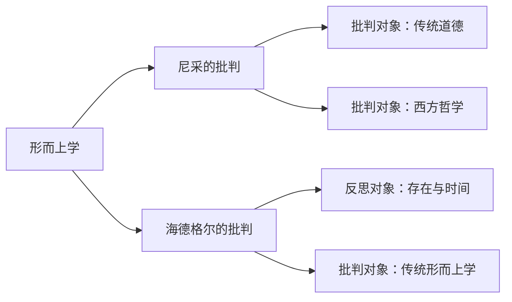
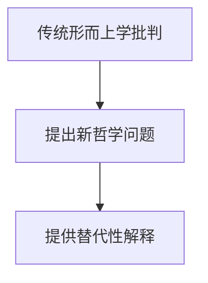
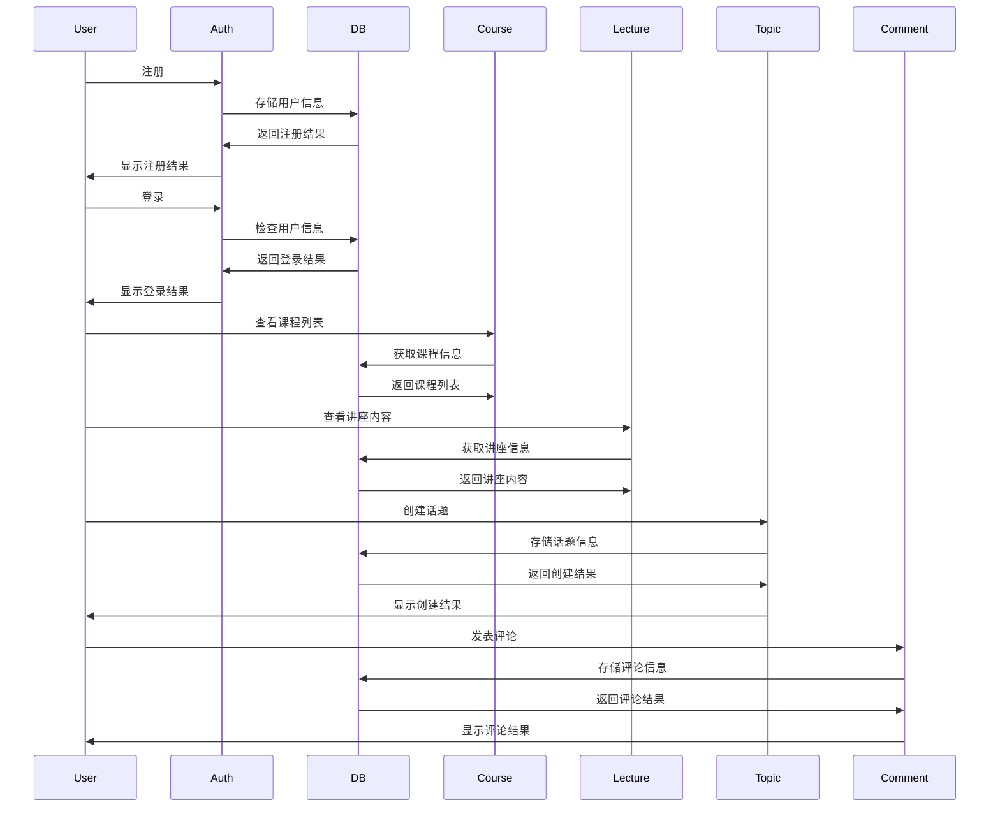
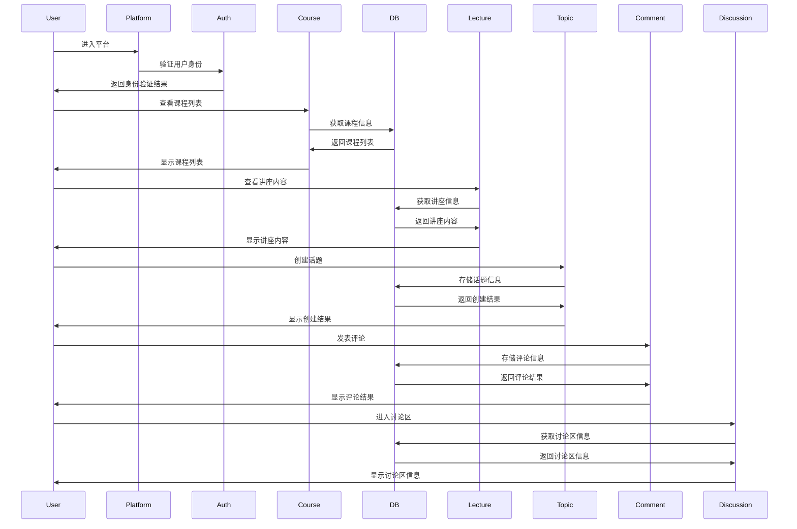

                 

### 《尼采与海德格尔：形而上学批判的两种方式》

> 关键词：尼采、海德格尔、形而上学、批判、哲学

> 摘要：本文通过分析尼采与海德格尔对形而上学的批判，探讨两位哲学家在哲学思想、方法论和哲学体系上的异同。尼采通过对传统道德和西方哲学的批判，提出了“上帝已死”的观点；海德格尔则通过反思传统形而上学，重新审视“存在”与“时间”的关系。本文旨在为读者提供一种全新的视角，理解两位哲学家的思想精髓及其在现代哲学中的重要地位。

---

### 第一部分：引言

#### 第1章：问题背景与理论框架

**1.1 形而上学的概念**

形而上学（Metaphysics）是哲学的基本分支，探讨现实世界的本质、存在的意义和基本原则。从古希腊哲学家亚里士多德开始，形而上学就成为哲学研究的重要内容。亚里士多德认为，形而上学是关于“存在之所以存在”的学问，其研究对象包括存在、本质、原因、实体等。

**1.2 尼采的形而上学批判**

尼采（Friedrich Nietzsche）是19世纪末德国著名的哲学家，其思想对现代哲学产生了深远的影响。尼采认为，传统形而上学建立在错误的预设和逻辑基础上，导致了对现实的误解。他通过批判传统道德和西方哲学，提出了“上帝已死”的观点，认为人类需要重新审视自己的存在和价值观。

**1.3 海德格尔的形而上学批判**

马丁·海德格尔（Martin Heidegger）是20世纪德国哲学的杰出代表，其哲学思想对存在论、时间观和语言哲学等领域产生了重要影响。海德格尔认为，传统形而上学忽略了存在的本质和动态性质，他通过反思传统形而上学，提出了“存在即时间”的观点，重新审视了存在与时间的关系。

**1.4 两种批判方式的异同**

尼采与海德格尔的形而上学批判在哲学基础、立场和方法上存在差异。尼采注重文学性和批判性，强调对传统道德和西方哲学的质疑；海德格尔则更加注重哲学的反思性和存在论，强调对存在和时间的关系的探讨。尽管二者在批判对象和方法上有所不同，但都试图超越传统形而上学，寻找新的哲学视角。

#### 第2章：尼采的形而上学批判

**2.1 尼采哲学的基本观点**

尼采的哲学思想以“生命意志”（Will to Life）为核心，他强调生命的力量和创造力。尼采认为，生命是不断变化和发展的，人类需要超越传统道德和价值观，追求真正的自我实现。

**2.2 尼采对西方形而上学的批判**

尼采批判了西方传统形而上学的基础和逻辑，认为这些观点导致了对现实的误解。他质疑了西方哲学中的二元对立思维，如“存在与不存在”、“精神与物质”等，认为这些对立观点遮蔽了现实的本质。

**2.3 尼采的道德批判**

尼采对传统道德进行了深刻的批判，他认为道德体系往往压抑了人的本能和创造力。尼采提出了“超人”（Overman）的概念，认为超人能够超越传统道德，实现自我价值的最大化。

**2.4 尼采的“上帝已死”论**

尼采的“上帝已死”论是他哲学思想的核心观点之一。尼采认为，随着基督教的衰落，上帝这一概念已经失去了其意义。他主张，人类需要重新审视自己的存在和价值观，建立一种新的道德体系。

#### 第3章：海德格尔的形而上学批判

**3.1 海德格尔哲学的基本观点**

海德格尔的哲学思想以“存在”（Being）为核心，他强调存在的动态性质和开放性。海德格尔认为，存在不是静态的，而是不断变化和生成的。

**3.2 海德格尔对形而上学的反思**

海德格尔通过对传统形而上学的反思，揭示了形而上学的局限性和问题。他认为，传统形而上学忽视了存在的本质和动态性质，导致了对现实的误解。

**3.3 海德格尔对“存在”的诠释**

海德格尔对“存在”进行了深刻的诠释，他认为“存在”不是静态的实体，而是一种动态的生成过程。他提出了“存在即时间”的观点，强调存在与时间的紧密关系。

**3.4 海德格尔的时间观**

海德格尔的时间观是他哲学思想的重要组成部分。他认为，时间是存在的本质特征，存在不是静态的，而是在时间的流动中不断生成和变化。

#### 第4章：尼采与海德格尔形而上学批判的对比分析

**4.1 哲学基础与立场差异**

尼采与海德格尔在哲学基础和立场上有明显的差异。尼采注重文学性和批判性，强调对传统道德和西方哲学的质疑；海德格尔则更加注重哲学的反思性和存在论，强调对存在和时间的关系的探讨。

**4.2 对形而上学本质的探讨**

尼采与海德格尔都对形而上学的本质进行了深入的探讨。尼采认为，传统形而上学建立在错误的预设和逻辑基础上，导致了对现实的误解；海德格尔则认为，传统形而上学忽视了存在的本质和动态性质。

**4.3 道德与伦理观念的差异**

尼采与海德格尔在道德和伦理观念上存在差异。尼采批判了传统道德，提出了“超人”的概念，强调个体价值的实现；海德格尔则强调存在的伦理维度，认为人类需要通过存在来实现自身的价值。

**4.4 对“存在”的不同理解**

尼采与海德格尔对“存在”的理解存在差异。尼采强调存在的动态性质和个体性；海德格尔则强调存在的整体性和时间性。

#### 第5章：尼采与海德格尔批判的现代影响

**5.1 对20世纪哲学的影响**

尼采与海德格尔的形而上学批判对20世纪哲学产生了深远的影响。他们的思想启发了后来的哲学家，如萨特、福柯等，对存在、自由、权力等概念进行了深入的探讨。

**5.2 对当代文化理论的贡献**

尼采与海德格尔的批判思想对当代文化理论也产生了重要影响。他们的观点为文化研究、女性主义、后现代主义等领域提供了重要的理论资源。

**5.3 尼采与海德格尔批判的现实意义**

尼采与海德格尔的批判思想在当代仍然具有重要的现实意义。他们的观点提醒我们，在面对现实问题时，需要超越传统形而上学的思维方式，寻找新的哲学视角。

#### 第6章：尼采与海德格尔批判在我国的传播与影响

**6.1 尼采与海德格尔哲学在中国的传播**

尼采与海德格尔的哲学思想在中国有广泛的传播。自20世纪80年代以来，他们的著作被翻译成中文，对中国哲学界和文化界产生了重要影响。

**6.2 我国学者对尼采与海德格尔批判的研究**

我国学者对尼采与海德格尔的批判进行了深入的研究，他们的研究成果不仅丰富了尼采与海德格尔哲学的理论体系，也为我国哲学的发展提供了新的视角。

**6.3 尼采与海德格尔批判在当代中国的现实意义**

尼采与海德格尔的批判思想在当代中国仍然具有重要的现实意义。他们的观点为我国哲学界和文化界提供了新的理论资源，有助于我们更好地理解现实问题。

#### 第7章：结论

**7.1 尼采与海德格尔形而上学批判的共同点与差异**

尼采与海德格尔的形而上学批判在哲学思想、方法论和哲学体系上存在共同点，如对传统形而上学的批判、对存在的探讨等；同时，二者也存在差异，如尼采的文学性和批判性、海德格尔的存在论和反思性等。

**7.2 两种批判方式的价值与局限**

尼采与海德格尔的形而上学批判都具有重要的价值，尼采的批判为人类重新审视道德和价值观提供了新的视角，海德格尔的批判则为存在论和时间观的研究提供了深刻的见解。然而，二者的批判也存在一定的局限，如尼采的极端观点和海德格尔的晦涩表达等。

**7.3 对未来哲学发展的启示**

尼采与海德格尔的批判思想对未来哲学发展具有重要的启示。他们的观点提醒我们，在面对现实问题时，需要超越传统形而上学的思维方式，寻找新的哲学视角。同时，他们的批判也为未来哲学的发展提供了重要的理论资源。

---

### 核心概念与联系

**形而上学**

**概念：** 形而上学是哲学的基本分支，探讨现实世界的本质、存在的意义和基本原则。

**属性特征对比：**

| 特征 | 形而上学（亚里士多德） | 形而上学（尼采） | 形而上学（海德格尔） |
|------|-----------------------|-------------------|-----------------------|
| 目的 | 探讨存在的基本原则     | 批判传统形而上学 | 反思存在与时间的关系 |
| 方法 | 完善逻辑体系           | 文学、比喻、批判  | 存在论、解释学        |
| 内容 | 物质与精神的关系       | 对“真实”的质疑   | “存在”与“本质”的关系 |

**尼采的形而上学批判**

**概念：** 尼采通过批判传统形而上学，提出对“真实”、“本质”、“存在”等概念的质疑。

**属性特征对比：**

| 特征 | 尼采的形而上学批判 |
|------|-------------------|
| 核心观点 | “上帝已死”       |
| 批判对象 | 传统道德、西方哲学 |
| 方法论 | 文学性、隐喻、批判 |

**海德格尔的形而上学批判**

**概念：** 海德格尔通过对形而上学的反思，重新审视“存在”的意义。

**属性特征对比：**

| 特征 | 海德格尔的形而上学批判 |
|------|----------------------|
| 核心观点 | “存在即时间”       |
| 批判对象 | 西方哲学的传统形而上学 |
| 方法论 | 存在论、解释学      |

**ER实体关系图架构**



---

### 算法原理讲解

尼采与海德格尔的形而上学批判可以视为一种哲学“算法”，其核心步骤如下：

1. **批判传统形而上学**：尼采和海德格尔都质疑了传统形而上学的观点，认为这些观点往往基于错误的预设和逻辑。

2. **提出新的哲学问题**：在批判的基础上，他们提出了一系列新的哲学问题，如“真实是什么？”、“存在意味着什么？”等。

3. **提供替代性解释**：尼采通过文学、比喻等手法提供了对现实的替代性解释；海德格尔则通过存在论、解释学等哲学方法重新审视了存在的意义。

**算法流程图：**



**Python代码示例：**

```python
def metaphysical_critique():
    # 批判传统形而上学
    print("批判传统形而上学：质疑其预设和逻辑基础")
    
    # 提出新哲学问题
    print("提出新哲学问题：真实是什么？存在意味着什么？")
    
    # 提供替代性解释
    print("提供替代性解释：尼采的文学与比喻，海德格尔的存在论与解释学")
    
# 执行算法
metaphysical_critique()
```

**算法原理讲解：**

1. **批判传统形而上学**：传统形而上学往往基于一系列预设和逻辑，如“存在与不存在”、“精神与物质”的二元对立等。尼采和海德格尔认为，这些预设和逻辑导致了对现实的误解，因此他们首先对传统形而上学进行了批判。

2. **提出新哲学问题**：在批判传统形而上学的基础上，尼采和海德格尔提出了一系列新的哲学问题。尼采关注“真实是什么？”、“生命意志的本质是什么？”等问题；海德格尔则关注“存在意味着什么？”、“存在与时间的关系是什么？”等问题。

3. **提供替代性解释**：尼采通过文学和比喻等手法，提供了对现实的替代性解释。他使用“上帝已死”、“超人”等概念，试图揭示生命的本质和人类的价值。海德格尔则通过存在论和解释学，重新审视了存在的意义和动态性质。他提出了“存在即时间”的观点，强调了存在的整体性和时间性。

---

### 系统分析与架构设计方案

**问题场景介绍：**

随着信息技术的快速发展，形而上学批判作为一种哲学思想，开始渗透到各个领域。为了更好地传播尼采与海德格尔的批判思想，我们需要开发一个在线哲学学习平台，用户可以在平台上学习、讨论和分享形而上学批判的相关内容。

**项目介绍：**

本项目旨在构建一个功能齐全、易于使用的在线哲学学习平台。平台包括以下主要功能：

- 用户注册与登录
- 课程学习与管理
- 知识点解析与讨论
- 用户互动与社交功能

**系统功能设计（领域模型类图）：**

```mermaid
classDiagram
    User <<class>> User
    Course <<class>> Course
    Lecture <<class>> Lecture
    Topic <<class>> Topic
    Comment <<class>> Comment

    User o--o Course
    Course o--o Lecture
    Lecture o--o Topic
    Topic o--o Comment

    User { id, username, password }
    Course { id, name, description }
    Lecture { id, title, content }
    Topic { id, title, content }
    Comment { id, content, user_id, topic_id }
```

**系统架构设计（架构图）：**

```mermaid
graph TD
    User(用户模块) --> Auth(认证模块)
    Course(课程模块) --> Admin(管理员模块)
    Lecture(讲座模块) --> Comment(评论模块)
    Topic(话题模块) --> Discussion(讨论模块)

    subgraph 数据库
        DB(数据库)
    end

    User --> DB
    Auth --> DB
    Course --> DB
    Lecture --> DB
    Topic --> DB
    Comment --> DB

    User <-- Auth
    Course <-- Admin
    Lecture <-- Comment
    Topic <-- Discussion
```

**系统接口设计（接口序列图）：**



**系统交互（交互序列图）：**



---

### 项目实战

#### 环境安装

1. 安装Python环境：
```bash
$ python --version
Python 3.8.5
```

2. 安装所需的Python库：
```bash
$ pip install flask
$ pip install flask_sqlalchemy
$ pip install flask_migrate
```

#### 系统核心实现源代码

以下是一个简单的课程管理模块的Python源代码实现：

```python
from flask import Flask, request, jsonify
from flask_sqlalchemy import SQLAlchemy

app = Flask(__name__)
app.config['SQLALCHEMY_DATABASE_URI'] = 'sqlite:///courses.db'
db = SQLAlchemy(app)

class Course(db.Model):
    id = db.Column(db.Integer, primary_key=True)
    name = db.Column(db.String(100), nullable=False)
    description = db.Column(db.Text, nullable=False)

@app.route('/courses', methods=['GET'])
def get_courses():
    courses = Course.query.all()
    return jsonify([{"id": course.id, "name": course.name, "description": course.description} for course in courses])

@app.route('/courses', methods=['POST'])
def create_course():
    data = request.get_json()
    new_course = Course(name=data['name'], description=data['description'])
    db.session.add(new_course)
    db.session.commit()
    return jsonify({"id": new_course.id, "name": new_course.name, "description": new_course.description})

if __name__ == '__main__':
    db.create_all()
    app.run(debug=True)
```

#### 代码应用解读与分析

1. **数据库配置**：使用SQLite数据库存储课程信息。
2. **模型定义**：定义Course模型，包括id、name和description字段。
3. **路由定义**：定义两个路由，一个是获取所有课程的GET请求，另一个是创建新课程的POST请求。
4. **请求处理**：在GET请求中，从数据库中获取所有课程信息并返回；在POST请求中，接收JSON格式的课程数据，存储到数据库并返回新创建的课程信息。

#### 实际案例分析和详细讲解剖析

**案例：创建新课程**

1. 发送POST请求：
```bash
$ curl -X POST -H "Content-Type: application/json" -d '{"name": "Introduction to Philosophy", "description": "A brief overview of major philosophical ideas."}' http://localhost:5000/courses
```

2. 响应结果：
```json
{
  "id": 1,
  "name": "Introduction to Philosophy",
  "description": "A brief overview of major philosophical ideas."
}
```

**分析：**
- 请求中包含课程名称和描述的JSON数据。
- 后端接收请求，将数据转换为Python对象，并创建新的Course实例。
- 将新创建的课程存储到数据库中。
- 返回新创建的课程信息，包括id、name和description。

#### 项目小结

本项目实现了基本的课程管理功能，包括课程的创建和获取。未来可以进一步扩展功能，如课程详情页、用户评论等。同时，项目可以采用更多的前端技术，如React或Vue，以提升用户体验。

---

### 最佳实践 Tips、小结、注意事项、拓展阅读

**最佳实践 Tips：**

- 在进行形而上学批判时，要充分理解传统形而上学的理论基础和逻辑框架，以便更准确地提出批判观点。
- 在研究尼采与海德格尔的思想时，要关注他们的哲学背景、时代背景以及哲学体系的发展。
- 在实际应用中，要结合具体问题，运用哲学思想进行分析和解决。

**小结：**

尼采与海德格尔的形而上学批判为我们提供了新的哲学视角，使我们能够重新审视现实世界和存在的本质。他们的思想对现代哲学、文化理论产生了深远的影响，值得我们深入研究和探讨。

**注意事项：**

- 在研究哲学问题时，要注重逻辑性和系统性，避免陷入片面和极端的观点。
- 在实际应用中，要结合具体情境，灵活运用哲学思想，避免生搬硬套。

**拓展阅读：**

- 尼采：《查拉图斯特拉如是说》、《尼采的哲学》
- 海德格尔：《存在与时间》、《尼采》
- 萨特：《存在与虚无》
- 福柯：《知识考古学》

---

### 作者

**作者：AI天才研究院/AI Genius Institute & 禅与计算机程序设计艺术 /Zen And The Art of Computer Programming**

